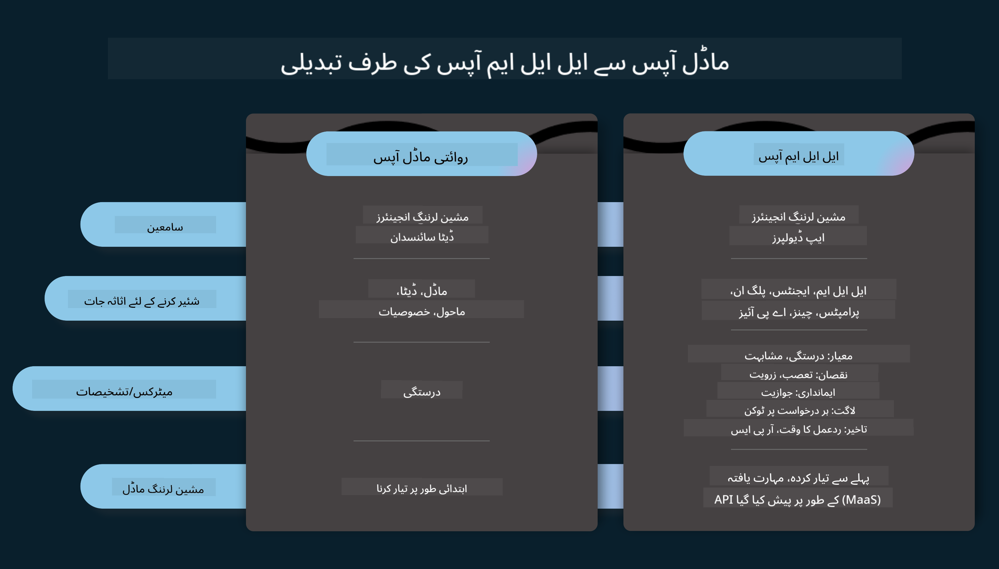
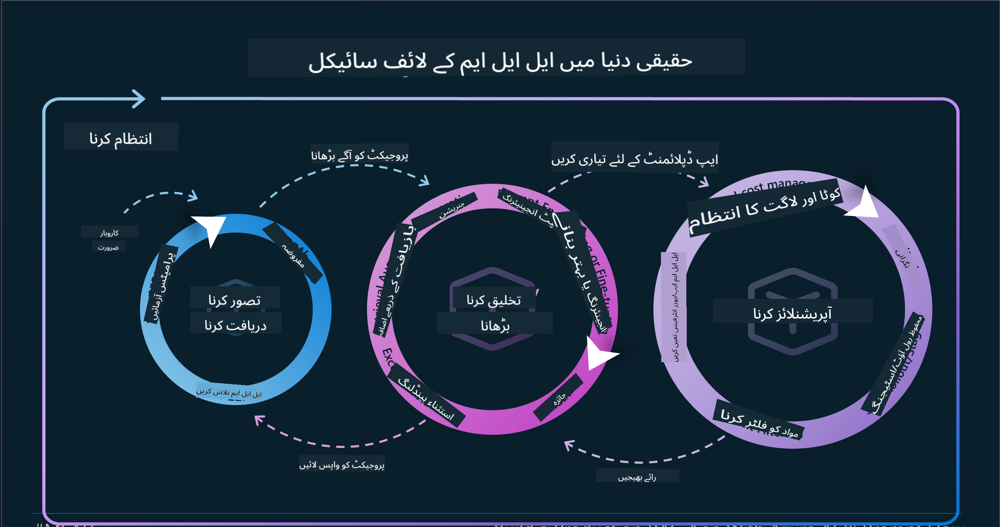
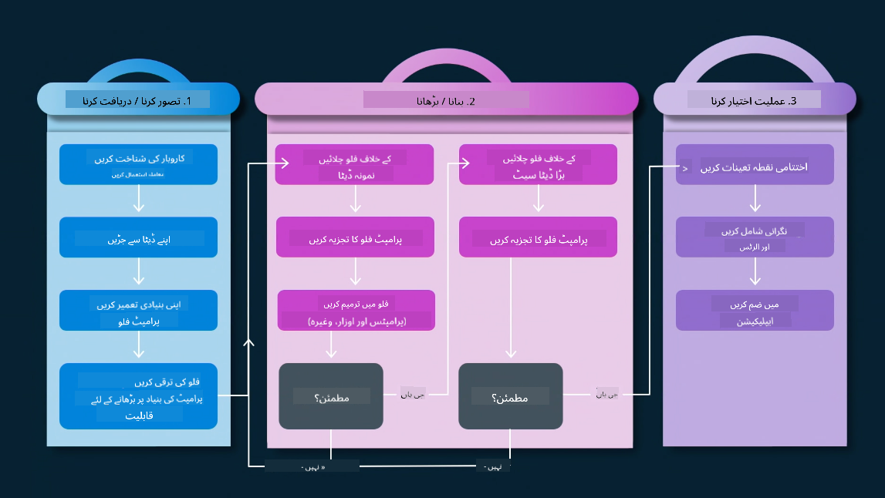
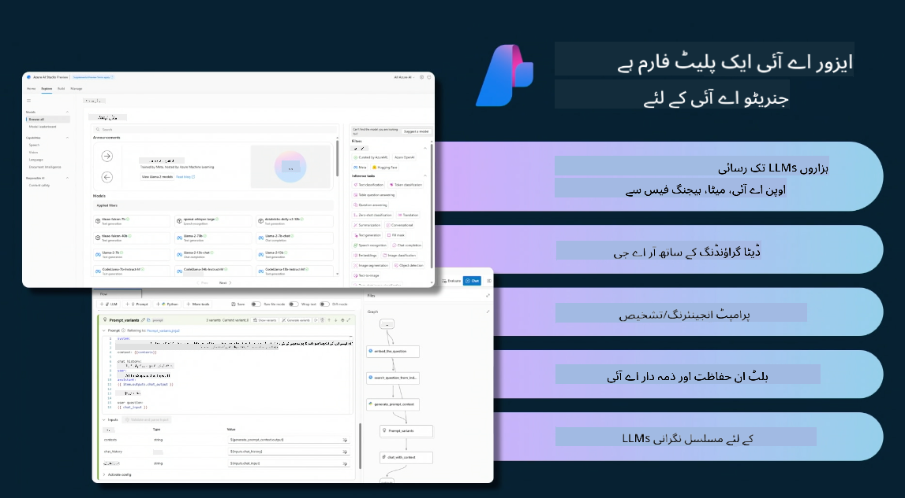
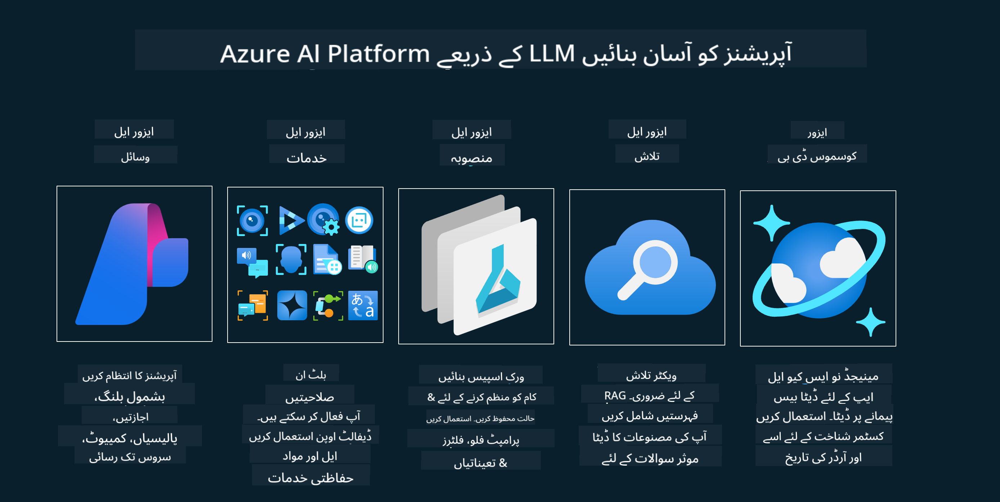
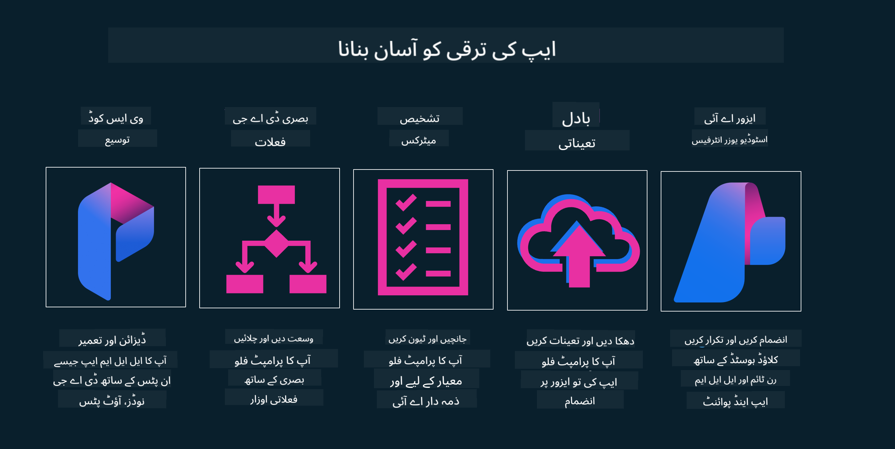

<!--
CO_OP_TRANSLATOR_METADATA:
{
  "original_hash": "27a5347a5022d5ef0a72ab029b03526a",
  "translation_date": "2025-05-19T23:20:24+00:00",
  "source_file": "14-the-generative-ai-application-lifecycle/README.md",
  "language_code": "ur"
}
-->

# جنریٹیو AI ایپلیکیشن لائف سائیکل

تمام AI ایپلیکیشنز کے لئے ایک اہم سوال AI فیچرز کی مطابقت ہے، کیونکہ AI ایک تیزی سے ترقی پذیر میدان ہے، یہ یقینی بنانے کے لئے کہ آپ کی ایپلیکیشن مطابقت پذیر، قابل اعتماد، اور مضبوط رہے، آپ کو اس کی نگرانی، تشخیص، اور بہتری کی ضرورت ہے۔ یہاں جنریٹیو AI لائف سائیکل کا کردار آتا ہے۔

جنریٹیو AI لائف سائیکل ایک فریم ورک ہے جو آپ کو جنریٹیو AI ایپلیکیشن کی ترقی، تعیناتی، اور دیکھ بھال کے مراحل سے گزرتا ہے۔ یہ آپ کو اپنے اہداف کی وضاحت کرنے، اپنی کارکردگی کی پیمائش کرنے، اپنے چیلنجز کی شناخت کرنے، اور اپنے حلوں کو نافذ کرنے میں مدد کرتا ہے۔ یہ آپ کی ایپلیکیشن کو آپ کے ڈومین اور آپ کے اسٹیک ہولڈرز کے اخلاقی اور قانونی معیارات کے ساتھ ہم آہنگ کرنے میں بھی مدد کرتا ہے۔ جنریٹیو AI لائف سائیکل کی پیروی کرکے، آپ یقینی بنا سکتے ہیں کہ آپ کی ایپلیکیشن ہمیشہ قدر فراہم کر رہی ہے اور آپ کے صارفین کو مطمئن کر رہی ہے۔

## تعارف

اس باب میں، آپ:

- MLOps سے LLMOps تک پیراڈائم شفٹ کو سمجھیں گے
- LLM لائف سائیکل
- لائف سائیکل ٹولنگ
- لائف سائیکل میٹرکیشن اور تشخیص

## MLOps سے LLMOps تک پیراڈائم شفٹ کو سمجھیں

LLMs مصنوعی ذہانت کے اسلحہ خانے میں ایک نیا آلہ ہیں، وہ ایپلیکیشنز کے لئے تجزیہ اور تخلیق کے کاموں میں انتہائی طاقتور ہیں، تاہم اس طاقت کا AI اور کلاسک مشین لرننگ کاموں کو آسان بنانے کے طریقے پر کچھ نتائج ہیں۔

اس کے ساتھ، ہمیں ایک نیا پیراڈائم درکار ہے تاکہ اس آلے کو ایک متحرک میں، صحیح ترغیبات کے ساتھ ڈھال سکیں۔ ہم پرانی AI ایپس کو "ML ایپس" اور نئی AI ایپس کو "GenAI ایپس" یا صرف "AI ایپس" کے طور پر درجہ بندی کر سکتے ہیں، جو اس وقت استعمال ہونے والی مرکزی دھارے کی ٹیکنالوجی اور تکنیکوں کی عکاسی کرتی ہیں۔ یہ ہمارے بیانیے کو کئی طریقوں سے بدلتا ہے، درج ذیل موازنہ پر نظر ڈالیں۔

نوٹ کریں کہ LLMOps میں، ہم ایپ ڈویلپرز پر زیادہ توجہ مرکوز کر رہے ہیں، انضمام کو ایک کلیدی نقطہ کے طور پر استعمال کرتے ہوئے، "ماڈلز-ایز-اے-سروس" کا استعمال کرتے ہوئے اور میٹرکس کے لئے درج ذیل نکات پر غور کرتے ہوئے۔

- معیار: جواب کا معیار
- نقصان: ذمہ دار AI
- ایمانداری: جواب کی بنیاد (کیا یہ سمجھ میں آتا ہے؟ کیا یہ درست ہے؟)
- لاگت: حل کا بجٹ
- تاخیر: ٹوکن جواب کے لئے اوسط وقت

## LLM لائف سائیکل

سب سے پہلے، لائف سائیکل اور تبدیلیوں کو سمجھنے کے لئے، آئیے اگلی انفوگرافک پر نظر ڈالیں۔

جیسا کہ آپ نوٹ کر سکتے ہیں، یہ MLOps کے عام لائف سائیکلز سے مختلف ہے۔ LLMs کے بہت سے نئے تقاضے ہیں، جیسے پرامپٹنگ، معیار کو بہتر بنانے کے مختلف تکنیک (فائن-ٹیوننگ، RAG، میٹا-پرامپٹس)، ذمہ دار AI کے ساتھ مختلف تشخیص اور ذمہ داری، آخر میں، نئے تشخیصی میٹرکس (معیار، نقصان، ایمانداری، لاگت اور تاخیر)۔

مثال کے طور پر، دیکھیں کہ ہم کیسے تصور کرتے ہیں۔ مختلف LLMs کے ساتھ تجربہ کرنے کے لئے پرامپٹ انجینئرنگ کا استعمال کرتے ہوئے امکانات کو دریافت کرنے کے لئے ان کے مفروضے درست ہو سکتے ہیں۔

نوٹ کریں کہ یہ لکیری نہیں ہے، بلکہ مربوط لوپ، تکراری اور ایک جامع سائیکل کے ساتھ ہے۔

ہم ان مراحل کو کیسے دریافت کر سکتے ہیں؟ آئیے تفصیل میں جائیں کہ ہم کیسے لائف سائیکل بنا سکتے ہیں۔

یہ تھوڑا پیچیدہ لگ سکتا ہے، آئیے پہلے تین بڑے مراحل پر توجہ مرکوز کریں۔

1. تصور/دریافت: دریافت، یہاں ہم اپنے کاروباری ضروریات کے مطابق دریافت کر سکتے ہیں۔ پروٹوٹائپنگ، ایک [PromptFlow](https://microsoft.github.io/promptflow/index.html?WT.mc_id=academic-105485-koreyst) بنانا اور جانچنا کہ آیا یہ ہمارے مفروضے کے لئے کافی مؤثر ہے۔
2. تعمیر/اضافہ: نفاذ، اب، ہم بڑے ڈیٹا سیٹس کے لئے تکنیکوں کو نافذ کرنے کے لئے شروع کرتے ہیں، جیسے فائن-ٹیوننگ اور RAG، تاکہ ہمارے حل کی مضبوطی کو جانچ سکیں۔ اگر یہ نہیں کرتا، تو اسے دوبارہ نافذ کرنا، ہمارے فلو میں نئے مراحل شامل کرنا یا ڈیٹا کو دوبارہ ترتیب دینا مددگار ثابت ہو سکتا ہے۔ ہمارے فلو اور ہمارے پیمانے کی جانچ کرنے کے بعد، اگر یہ کام کرتا ہے اور ہمارے میٹرکس کو چیک کرتا ہے، تو یہ اگلے مرحلے کے لئے تیار ہے۔
3. آپریشنلائزنگ: انضمام، اب ہمارے سسٹم میں نگرانی اور الرٹ سسٹم شامل کرنا، تعیناتی اور ایپلیکیشن انضمام کو ہماری ایپلیکیشن میں شامل کرنا۔

پھر، ہمارے پاس انتظام کا جامع سائیکل ہے، سیکورٹی، تعمیل اور گورننس پر توجہ مرکوز کرنا۔

مبارک ہو، اب آپ کی AI ایپ تیار ہے اور آپریشنل ہے۔ ایک عملی تجربے کے لئے، [Contoso Chat Demo](https://nitya.github.io/contoso-chat/?WT.mc_id=academic-105485-koreys) پر نظر ڈالیں۔

اب، ہم کون سے ٹولز استعمال کر سکتے ہیں؟

## لائف سائیکل ٹولنگ

ٹولنگ کے لئے، Microsoft [Azure AI Platform](https://azure.microsoft.com/solutions/ai/?WT.mc_id=academic-105485-koreys) اور [PromptFlow](https://microsoft.github.io/promptflow/index.html?WT.mc_id=academic-105485-koreyst) فراہم کرتا ہے جو آپ کے سائیکل کو آسانی سے نافذ کرنے اور تیار کرنے کے لئے تیار کرتا ہے۔

[Azure AI Platform](https://azure.microsoft.com/solutions/ai/?WT.mc_id=academic-105485-koreys) آپ کو [AI Studio](https://ai.azure.com/?WT.mc_id=academic-105485-koreys) استعمال کرنے کی اجازت دیتا ہے۔ AI Studio ایک ویب پورٹل ہے جو آپ کو ماڈلز، نمونوں اور ٹولز کو دریافت کرنے کی اجازت دیتا ہے۔ اپنے وسائل کا انتظام، UI ترقی کے فلو اور کوڈ-فرسٹ ترقی کے لئے SDK/CLI آپشنز کا انتظام۔

Azure AI آپ کو متعدد وسائل استعمال کرنے کی اجازت دیتا ہے، تاکہ آپ کی آپریشنز، خدمات، منصوبوں، ویکٹر تلاش اور ڈیٹا بیس کی ضروریات کا انتظام کر سکیں۔

Proof-of-Concept(POC) سے لے کر بڑے پیمانے پر ایپلیکیشنز تک PromptFlow کے ساتھ تعمیر کریں:

- VS Code سے ایپس کو ڈیزائن اور بنائیں، بصری اور عملی ٹولز کے ساتھ
- اپنے ایپس کو اعلی معیار کے AI کے لئے جانچیں اور بہتر بنائیں، آسانی سے۔
- Azure AI Studio کا استعمال کرتے ہوئے کلاؤڈ کے ساتھ انضمام اور تکرار کریں، فوری انضمام کے لئے پش اور تعینات کریں۔

## زبردست! اپنی تعلیم جاری رکھیں!

حیرت انگیز، اب مزید سیکھیں کہ ہم ایپلیکیشن کو کیسے ڈھانچہ کرتے ہیں تاکہ [Contoso Chat App](https://nitya.github.io/contoso-chat/?WT.mc_id=academic-105485-koreyst) کے ساتھ تصورات کا استعمال کریں، یہ دیکھنے کے لئے کہ کلاؤڈ ایڈووکیسی ان تصورات کو مظاہروں میں کیسے شامل کرتا ہے۔ مزید مواد کے لئے، ہمارے [Ignite breakout session](https://www.youtube.com/watch?v=DdOylyrTOWg) کو چیک کریں!

اب، سبق 15 کو چیک کریں، یہ سمجھنے کے لئے کہ [Retrieval Augmented Generation اور Vector Databases](../15-rag-and-vector-databases/README.md?WT.mc_id=academic-105485-koreyst) جنریٹیو AI پر کیسے اثر انداز ہوتے ہیں اور مزید دلچسپ ایپلیکیشنز بنانے کے لئے!

**ڈس کلیمر**:  
یہ دستاویز AI ترجمہ سروس [Co-op Translator](https://github.com/Azure/co-op-translator) کا استعمال کرتے ہوئے ترجمہ کی گئی ہے۔ ہم درستگی کے لیے کوشش کرتے ہیں، لیکن براہ کرم آگاہ رہیں کہ خودکار ترجمے میں غلطیاں یا غلطیاں ہو سکتی ہیں۔ اصل دستاویز کو اس کی اصل زبان میں مستند ماخذ سمجھا جانا چاہیے۔ اہم معلومات کے لیے، پیشہ ورانہ انسانی ترجمہ کی سفارش کی جاتی ہے۔ ہم اس ترجمے کے استعمال سے پیدا ہونے والی کسی بھی غلط فہمی یا غلط تشریح کے ذمہ دار نہیں ہیں۔