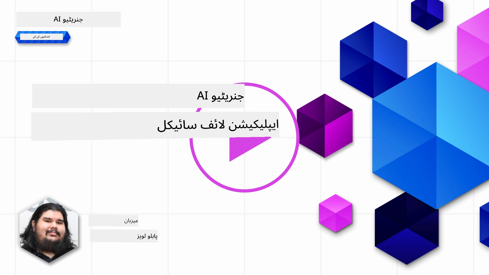
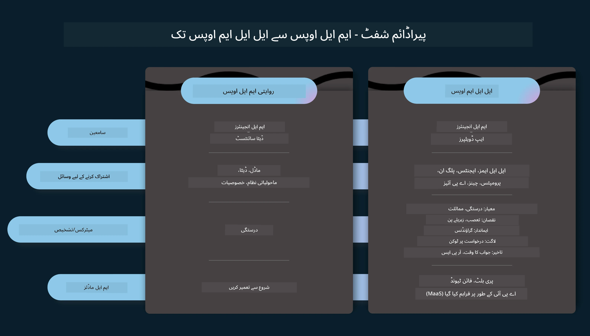
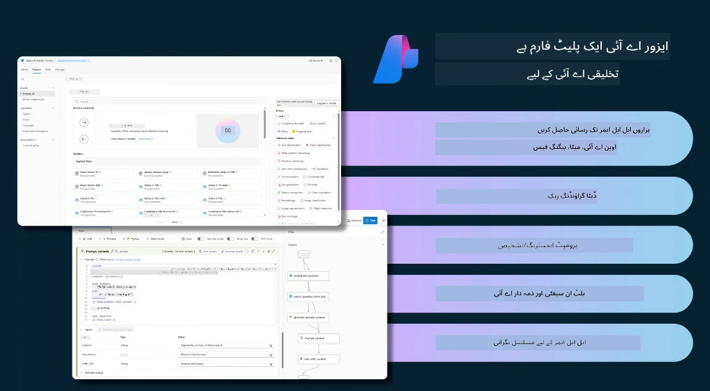
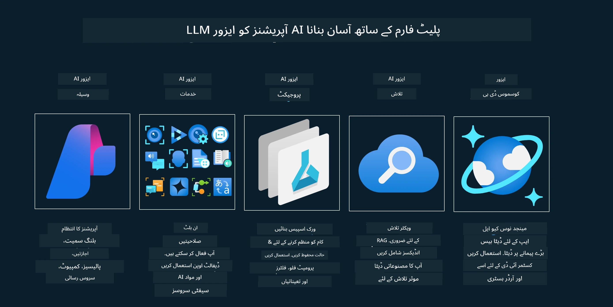
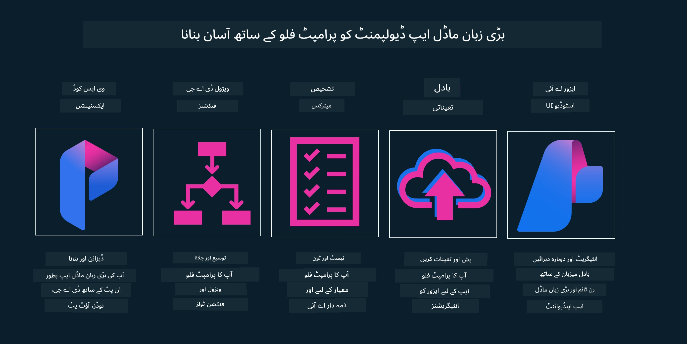

# جنریٹو AI ایپلیکیشن لائف سائیکل

تمام AI ایپلیکیشنز کے لیے ایک اہم سوال AI خصوصیات کی مطابقت ہے، کیونکہ AI ایک تیزی سے ترقی پذیر میدان ہے، تاکہ آپ کی ایپلیکیشن متعلقہ، قابل اعتماد، اور مضبوط رہے، آپ کو اسے مسلسل مانیٹر، جائزہ اور بہتر بنانا ہوگا۔ یہی وہ جگہ ہے جہاں جنریٹو AI لائف سائیکل آتا ہے۔

جنریٹو AI لائف سائیکل ایک فریم ورک ہے جو آپ کو جنریٹو AI ایپلیکیشن کی ترقی، تعیناتی، اور دیکھ بھال کے مراحل سے گزرتا ہے۔ یہ آپ کو اپنے مقاصد کی وضاحت کرنے، اپنی کارکردگی کی پیمائش کرنے، اپنے چیلنجز کی شناخت کرنے، اور اپنے حل نافذ کرنے میں مدد دیتا ہے۔ یہ آپ کی ایپلیکیشن کو آپ کے ڈومین اور اسٹیک ہولڈرز کے اخلاقی اور قانونی معیارات کے مطابق بھی لانے میں مدد دیتا ہے۔ جنریٹو AI لائف سائیکل کی پیروی کرکے، آپ یقینی بنا سکتے ہیں کہ آپ کی ایپلیکیشن ہمیشہ قدر فراہم کر رہی ہے اور آپ کے صارفین کو مطمئن کر رہی ہے۔

## تعارف

اس باب میں، آپ:

- MLOps سے LLMOps کی پیراڈائم شفٹ کو سمجھیں گے
- LLM لائف سائیکل
- لائف سائیکل ٹولنگ
- لائف سائیکل میٹرکیشن اور جائزہ

## MLOps سے LLMOps کی پیراڈائم شفٹ کو سمجھیں

LLMs مصنوعی ذہانت کے ہتھیار میں ایک نیا آلہ ہیں، یہ ایپلیکیشنز کے لیے تجزیہ اور تخلیق کے کاموں میں انتہائی طاقتور ہیں، تاہم اس طاقت کے کچھ نتائج ہیں کہ ہم AI اور کلاسیکی مشین لرننگ کے کاموں کو کس طرح ہموار کرتے ہیں۔

اس کے ساتھ، ہمیں اس آلے کو متحرک انداز میں، صحیح ترغیبات کے ساتھ اپنانے کے لیے ایک نئی پیراڈائم کی ضرورت ہے۔ ہم پرانی AI ایپس کو "ML ایپس" اور نئی AI ایپس کو "GenAI ایپس" یا صرف "AI ایپس" کے طور پر درجہ بندی کر سکتے ہیں، جو اس وقت استعمال ہونے والی مرکزی دھارے کی ٹیکنالوجی اور تکنیک کی عکاسی کرتی ہیں۔ یہ ہماری کہانی کو کئی طریقوں سے تبدیل کرتا ہے، درج ذیل موازنہ دیکھیں۔

نوٹ کریں کہ LLMOps میں، ہم ایپ ڈویلپرز پر زیادہ توجہ مرکوز کرتے ہیں، انضمام کو ایک کلیدی نقطہ کے طور پر استعمال کرتے ہیں، "ماڈلز-ایز-اے-سروس" استعمال کرتے ہیں اور میٹرکس کے لیے درج ذیل نکات پر غور کرتے ہیں۔

- معیار: جواب کا معیار
- نقصان: ذمہ دار AI
- ایمانداری: جواب کی بنیاد (کیا سمجھ آتی ہے؟ کیا یہ درست ہے؟)
- لاگت: حل کا بجٹ
- تاخیر: ٹوکن جواب کے لیے اوسط وقت

## LLM لائف سائیکل

سب سے پہلے، لائف سائیکل اور تبدیلیوں کو سمجھنے کے لیے، اگلی انفرافک نوٹ کریں۔

جیسا کہ آپ نوٹ کر سکتے ہیں، یہ MLOps کے معمول کے لائف سائیکل سے مختلف ہے۔ LLMs کے بہت سے نئے تقاضے ہیں، جیسے پرامپٹنگ، معیار کو بہتر بنانے کی مختلف تکنیکیں (فائن-ٹیوننگ، RAG، میٹا-پرامپٹس)، ذمہ دار AI کے ساتھ مختلف جائزہ اور ذمہ داری، آخر میں، نئے جائزہ میٹرکس (معیار، نقصان، ایمانداری، لاگت اور تاخیر)۔

مثال کے طور پر، دیکھیں کہ ہم کیسے آئیڈیاز بناتے ہیں۔ مختلف LLMs کے ساتھ تجربہ کرنے کے لیے پرامپٹ انجینئرنگ کا استعمال کرتے ہوئے امکانات کو تلاش کرنا تاکہ جانچ سکیں کہ ان کا مفروضہ درست ہو سکتا ہے۔

نوٹ کریں کہ یہ خطی نہیں ہے، بلکہ مربوط لوپس، تکراری اور ایک جامع سائیکل کے ساتھ ہے۔

ہم ان مراحل کو کیسے دریافت کر سکتے ہیں؟ آئیے تفصیل میں جائیں کہ ہم لائف سائیکل کیسے بنا سکتے ہیں۔

یہ تھوڑا پیچیدہ لگ سکتا ہے، پہلے تین بڑے مراحل پر توجہ مرکوز کرتے ہیں۔

1. آئیڈیٹنگ/ایکسپلورنگ: تلاش، یہاں ہم اپنے کاروباری ضروریات کے مطابق تلاش کر سکتے ہیں۔ پروٹوٹائپنگ، [PromptFlow](https://microsoft.github.io/promptflow/index.html?WT.mc_id=academic-105485-koreyst) بنانا اور جانچنا کہ آیا یہ ہمارے مفروضے کے لیے کافی مؤثر ہے۔
1. بلڈنگ/آگمینٹنگ: نفاذ، اب، ہم بڑے ڈیٹا سیٹس کے لیے تکنیکوں کو نافذ کرنے کے لیے جائزہ لینا شروع کرتے ہیں، جیسے فائن-ٹیوننگ اور RAG، تاکہ ہمارے حل کی مضبوطی کو چیک کریں۔ اگر یہ کام نہیں کرتا، تو اسے دوبارہ نافذ کرنا، ہمارے فلو میں نئے مراحل شامل کرنا یا ڈیٹا کو دوبارہ ترتیب دینا مددگار ہو سکتا ہے۔ اپنے فلو اور پیمانے کی جانچ کے بعد، اگر یہ کام کرتا ہے اور ہمارے میٹرکس کو چیک کرتا ہے، تو یہ اگلے مرحلے کے لیے تیار ہے۔
1. آپریشنلائزنگ: انضمام، اب مانیٹرنگ اور الرٹس سسٹمز کو ہمارے نظام میں شامل کرنا، تعیناتی اور ایپلیکیشن انضمام۔

پھر، ہمارے پاس مینجمنٹ کا جامع سائیکل ہے، جو سیکیورٹی، تعمیل اور گورننس پر توجہ مرکوز کرتا ہے۔

مبارک ہو، اب آپ کی AI ایپ تیار ہے اور آپریشنل ہے۔ عملی تجربے کے لیے، [Contoso Chat Demo](https://nitya.github.io/contoso-chat/?WT.mc_id=academic-105485-koreys) دیکھیں۔

اب، ہم کون سے ٹولز استعمال کر سکتے ہیں؟

## لائف سائیکل ٹولنگ

ٹولنگ کے لیے، مائیکروسافٹ [Azure AI Platform](https://azure.microsoft.com/solutions/ai/?WT.mc_id=academic-105485-koreys) اور [PromptFlow](https://microsoft.github.io/promptflow/index.html?WT.mc_id=academic-105485-koreyst) فراہم کرتا ہے جو آپ کے سائیکل کو آسانی سے نافذ کرنے اور تیار کرنے میں مدد دیتا ہے۔

[Azure AI Platform](https://azure.microsoft.com/solutions/ai/?WT.mc_id=academic-105485-koreys) آپ کو [AI Studio](https://ai.azure.com/?WT.mc_id=academic-105485-koreys) استعمال کرنے کی اجازت دیتا ہے۔ AI Studio ایک ویب پورٹل ہے جو آپ کو ماڈلز، نمونے اور ٹولز کو دریافت کرنے کی اجازت دیتا ہے۔ آپ کے وسائل کا انتظام، UI ڈیولپمنٹ فلو اور کوڈ-فرسٹ ڈیولپمنٹ کے لیے SDK/CLI اختیارات۔

Azure AI آپ کو متعدد وسائل استعمال کرنے کی اجازت دیتا ہے، تاکہ آپ اپنے آپریشنز، خدمات، پروجیکٹس، ویکٹر سرچ اور ڈیٹا بیس کی ضروریات کا انتظام کر سکیں۔

PromptFlow کے ساتھ پروف آف کانسپٹ (POC) سے لے کر بڑے پیمانے پر ایپلیکیشنز تک تعمیر کریں:

- VS Code سے ایپس ڈیزائن اور بنائیں، بصری اور فنکشنل ٹولز کے ساتھ
- اپنی ایپس کو معیار AI کے لیے آسانی سے ٹیسٹ اور فائن-ٹیون کریں۔
- Azure AI Studio استعمال کریں تاکہ کلاؤڈ کے ساتھ انضمام اور تکرار کریں، جلدی انضمام کے لیے پش اور تعیناتی کریں۔

## بہت خوب! اپنی تعلیم جاری رکھیں!

زبردست، اب سیکھیں کہ ہم ایپلیکیشن کو کیسے ساخت دیتے ہیں تاکہ تصورات کو [Contoso Chat App](https://nitya.github.io/contoso-chat/?WT.mc_id=academic-105485-koreyst) کے ساتھ استعمال کیا جا سکے، تاکہ دیکھیں کہ کلاؤڈ ایڈووکیسی ان تصورات کو مظاہروں میں کیسے شامل کرتی ہے۔ مزید مواد کے لیے، ہمارا [Ignite بریک آؤٹ سیشن](https://www.youtube.com/watch?v=DdOylyrTOWg) دیکھیں!

اب، سبق 15 دیکھیں، تاکہ سمجھ سکیں کہ [Retrieval Augmented Generation اور Vector Databases](../15-rag-and-vector-databases/README.md?WT.mc_id=academic-105485-koreyst) جنریٹو AI پر کیسے اثر انداز ہوتے ہیں اور مزید دلچسپ ایپلیکیشنز بنانے کے لیے!

---

<!-- CO-OP TRANSLATOR DISCLAIMER START -->
**دستخطی دستبرداری**:  
یہ دستاویز AI ترجمہ سروس [Co-op Translator](https://github.com/Azure/co-op-translator) کے ذریعے ترجمہ کی گئی ہے۔ اگرچہ ہم درستگی کے لیے کوشاں ہیں، براہ کرم آگاہ رہیں کہ خودکار ترجمے میں غلطیاں یا عدم درستیاں ہو سکتی ہیں۔ اصل دستاویز اپنی مادری زبان میں ہی معتبر ماخذ سمجھی جانی چاہیے۔ اہم معلومات کے لیے پیشہ ور انسانی ترجمہ کی سفارش کی جاتی ہے۔ اس ترجمے کے استعمال سے پیدا ہونے والی کسی بھی غلط فہمی یا غلط تشریح کی ذمہ داری ہم پر عائد نہیں ہوتی۔
<!-- CO-OP TRANSLATOR DISCLAIMER END -->