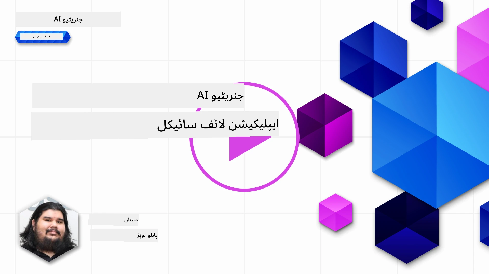
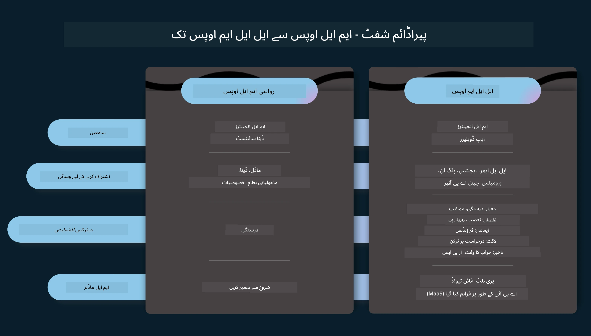
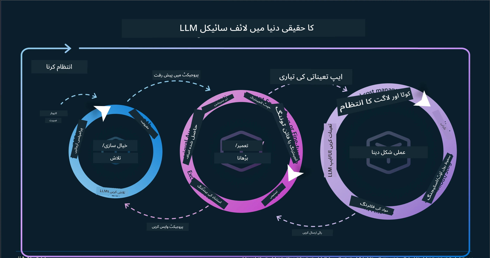
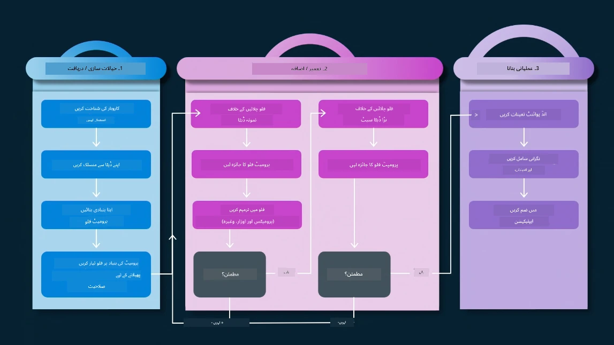
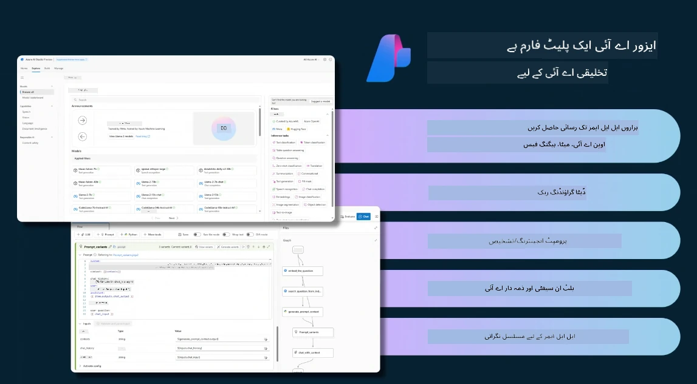
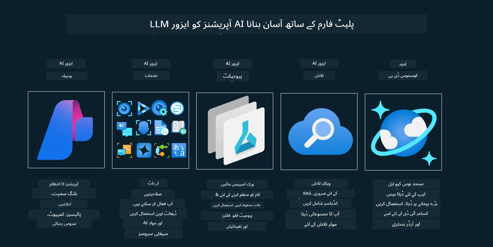
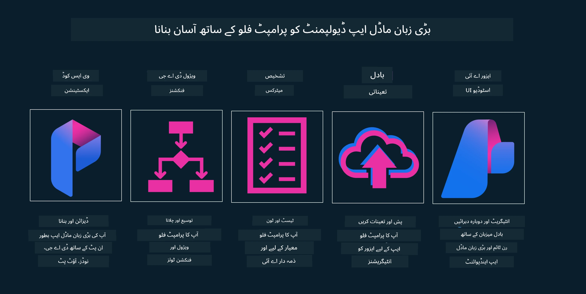

# جنریٹو AI ایپلیکیشن کا لائف سائیکل

تمام AI ایپلیکیشنز کے لیے ایک اہم سوال AI خصوصیات کی مطابقت کا ہے، کیونکہ AI ایک تیزی سے ترقی کرنے والا میدان ہے، تاکہ آپ کی ایپلیکیشن متعلقہ، قابل اعتماد، اور مضبوط بنی رہے، آپ کو اسے مسلسل مانیٹر، جائزہ اور بہتر بنانا ہوگا۔ یہیں جنریٹو AI لائف سائیکل کام آتا ہے۔

جنریٹو AI لائف سائیکل ایک فریم ورک ہے جو آپ کو جنریٹو AI ایپلیکیشن کی تیاری، تعیناتی، اور دیکھ بھال کے مراحل میں رہنمائی کرتا ہے۔ یہ آپ کو اپنے مقاصد کی تعریف کرنے، اپنی کارکردگی کا اندازہ لگانے، اپنے چیلنجز کی نشاندہی کرنے، اور حل نافذ کرنے میں مدد دیتا ہے۔ یہ آپ کی ایپلیکیشن کو آپ کے شعبے اور اسٹیک ہولڈرز کے اخلاقی اور قانونی معیارات کے مطابق بھی ہم آہنگ کرتا ہے۔ جنریٹو AI لائف سائیکل کی پیروی کرکے، آپ یقین دہانی کر سکتے ہیں کہ آپ کی ایپلیکیشن ہمیشہ قدر فراہم کر رہی ہے اور صارفین کو مطمئن کر رہی ہے۔

## تعارف

اس باب میں آپ:

- MLOps سے LLMOps کی پیراڈائم شفٹ کو سمجھیں گے
- LLM لائف سائیکل
- لائف سائیکل ٹولنگ
- لائف سائیکل کی میٹرکیشن اور جائزہ

## MLOps سے LLMOps کی پیراڈائم شفٹ کو سمجھیں

LLMs مصنوعی ذہانت کے ہتھیار میں ایک نیا آلہ ہیں، یہ ایپلیکیشنز کے تجزیہ اور جنریشن کے کاموں میں بہت طاقتور ہیں، تاہم اس طاقت کے کچھ نتائج ہوتے ہیں کہ ہم AI اور کلاسیکی مشین لرننگ کے کاموں کو کیسے ہموار کریں۔

اس کے ساتھ، ہمیں اس آلے کو ایک متحرک انداز میں، صحیح ترغیبات کے ساتھ اپنانے کے لیے ایک نیا پیراڈائم چاہیے۔ ہم پرانے AI ایپس کو "ML ایپس" کے طور پر اور جدید AI ایپس کو "GenAI ایپس" یا صرف "AI ایپس" کے طور پر درجہ بندی کر سکتے ہیں، جو اس وقت استعمال ہونے والی مرکزی تکنالوجی اور تکنیک کی عکاسی کرتی ہیں۔ یہ ہماری کہانی کو متعدد طریقوں سے بدل دیتا ہے، درج ذیل موازنہ دیکھیں۔

نوٹ کریں کہ LLMOps میں، ہم ایپ ڈویلپرز پر زیادہ توجہ دیتے ہیں، انٹیگریشن کو کلیدی نقطہ کے طور پر استعمال کرتے ہیں، "Models-as-a-Service" کا استعمال کرتے ہیں اور درج ذیل نکات پر میٹرکس کے بارے میں سوچتے ہیں۔

- معیار: جواب کا معیار
- نقصان: ذمہ دار AI
- دیانت: جواب کی بنیادیت (کیا مطلب بنتا ہے؟ کیا یہ درست ہے؟)
- لاگت: حل کا بجٹ
- تاخیر: ٹوکن جواب کے اوسط وقت

## LLM لائف سائیکل

پہلے، لائف سائیکل اور تبدیلیوں کو سمجھنے کے لیے، اگلا انفراگرافک دیکھیں۔

جیسا کہ آپ نوٹ کر سکتے ہیں، یہ MLOps کے معمول کے لائف سائیکلز سے مختلف ہے۔ LLMs کے بہت سے نئے تقاضے ہیں، جیسے پرامپٹنگ، معیار کو بہتر بنانے کی مختلف تکنیکیں (فائن ٹوننگ، RAG، میٹا پرامپٹس)، ذمہ دار AI کے ساتھ ذمہ داری اور مختلف جائزہ میٹرکس (معیار، نقصان، دیانت، لاگت اور تاخیر)۔

مثال کے طور پر، دیکھیں کہ ہم کیسے آئیڈیے کرتے ہیں۔ مختلف LLMs کے ساتھ تجربہ کرنے کے لیے پرامپٹ انجینئرنگ کا استعمال کرتے ہوئے امکانات کو تلاش کرنا تاکہ یہ جانچا جا سکے کہ آیا ان کا مفروضہ درست ہو سکتا ہے۔

نوٹ کریں کہ یہ خطی نہیں بلکہ مربوط لوپس، دوبارہ دہرائی جانے والی اور ایک مکمل سائیکل کے ساتھ ہے۔

ہم ان مراحل کو کیسے دریافت کر سکتے ہیں؟ آئیے تفصیل میں جائیں کہ لائف سائیکل کیسے بنایا جا سکتا ہے۔

یہ کچھ پیچیدہ لگ سکتا ہے، پہلے تین بڑے مراحل پر توجہ دیتے ہیں۔

1. آئیڈیٹنگ/ایکسپلورنگ: دریافت، یہاں ہم اپنے کاروباری ضروریات کے مطابق دریافت کر سکتے ہیں۔ پروٹوٹائپنگ، [PromptFlow](https://microsoft.github.io/promptflow/index.html?WT.mc_id=academic-105485-koreyst) بنانا اور جانچنا کہ آیا یہ ہمارے مفروضے کے لیے کافی مؤثر ہے۔
1. بلڈنگ/آگمنٹنگ: نفاذ، اب ہم بڑے ڈیٹا سیٹ کے لیے تکنیکیں جیسے فائن ٹوننگ اور RAG نافذ کرکے اپنے حل کی مضبوطی کا جائزہ لیتے ہیں۔ اگر یہ کام نہیں کرتا، تو دوبارہ نافذ کرنا، ہمارے فلو میں نئے مراحل شامل کرنا، یا ڈیٹا کو دوبارہ ترتیب دینا مددگار ہو سکتا ہے۔ اپنے فلو اور پیمانے کا ٹیسٹ کرنے کے بعد، اگر یہ کام کرتا ہے اور ہمارے میٹرکس چیک کرتا ہے، تو یہ اگلے مرحلے کے لیے تیار ہے۔
1. آپریشنلائزنگ: انٹیگریشن، اب مانیٹرنگ اور الرٹ سسٹمز کو شامل کرنا، ڈپلائمنٹ اور ایپلیکیشن انٹیگریشن۔

اس کے بعد، ہمارے پاس مینجمنٹ کا ایک جامع سائکل ہے، جو سیکیورٹی، تعمیل اور گورننس پر مرکوز ہے۔

مبارک ہو، اب آپ کی AI ایپ تیار ہے اور آپریشنل ہے۔ ایک عملی تجربے کے لیے، [Contoso Chat Demo](https://nitya.github.io/contoso-chat/?WT.mc_id=academic-105485-koreyst) دیکھیں۔

اب، ہم کون سے ٹولز استعمال کر سکتے ہیں؟

## لائف سائیکل ٹولنگ

ٹولنگ کے لیے، مائیکروسافٹ [Azure AI Platform](https://azure.microsoft.com/solutions/ai/?WT.mc_id=academic-105485-koreyst) اور [PromptFlow](https://microsoft.github.io/promptflow/index.html?WT.mc_id=academic-105485-koreyst) فراہم کرتا ہے جو آپ کے سائیکل کو آسانی سے نافذ کرنے اور آپریشن کے لیے تیار کرنے میں سہولت دیتا ہے۔

[Azure AI Platform](https://azure.microsoft.com/solutions/ai/?WT.mc_id=academic-105485-koreyst) آپ کو [AI Studio](https://ai.azure.com/?WT.mc_id=academic-105485-koreyst) استعمال کرنے کی اجازت دیتا ہے۔ AI Studio ایک ویب پورٹل ہے جو آپ کو ماڈلز، نمونوں اور ٹولز کو دریافت کرنے دیتا ہے۔ آپ کے وسائل کا نظم، UI ترقیاتی فلو اور کوڈ-فرسٹ ترقی کے لیے SDK/CLI کے اختیارات مینیج کرنے میں مدد دیتا ہے۔

Azure AI آپ کو متعدد وسائل استعمال کرنے دیتا ہے تاکہ آپ اپنی آپریشنز، سروسز، پروجیکٹس، ویکٹر سرچ اور ڈیٹابیس کی ضروریات کو مینیج کر سکیں۔

پرومٹ فلو کے ساتھ پروف آف کانسیپٹ (POC) سے لے کر بڑے پیمانے کی ایپلیکیشنز تک تعمیر کریں:

- VS Code سے ایپس ڈیزائن اور بنائیں، بصری اور فنکشنل ٹولز کے ساتھ
- اپنے ایپس کی کوالٹی AI کے لیے آسانی سے جانچ اور فائن ٹون کریں
- Azure AI Studio استعمال کریں تاکہ کلاؤڈ کے ساتھ انٹیگریٹ اور تیزی سے پش اور ڈپلائے کریں۔

## زبردست! اپنی تعلیم جاری رکھیں!

زبردست، اب مزید سیکھیں کہ ہم ایک ایپلیکیشن کو کیسے ڈھانچے میں مرتب کرتے ہیں تاکہ تصورات کو [Contoso Chat App](https://nitya.github.io/contoso-chat/?WT.mc_id=academic-105485-koreyst) کے ساتھ استعمال کیا جا سکے، تاکہ معلوم ہو کہ کلاؤڈ ایڈووکیسی ان تصورات کو ڈیموسٹریشنز میں کیسے شامل کرتی ہے۔ مزید مواد کے لیے ہمارا [Ignite بریک آؤٹ سیشن!](https://www.youtube.com/watch?v=DdOylyrTOWg) دیکھیں۔

اب، سبق 15 دیکھیں تاکہ جان سکیں کہ [Retrieval Augmented Generation اور Vector Databases](../15-rag-and-vector-databases/README.md?WT.mc_id=academic-105485-koreyst) جنریٹو AI پر کیسے اثر انداز ہوتے ہیں اور زیادہ دلچسپ ایپلیکیشنز کیسے بنا سکتے ہیں!

---

<!-- CO-OP TRANSLATOR DISCLAIMER START -->
**دستخطی وضاحت**:
یہ دستاویز AI ترجمہ سروس [Co-op Translator](https://github.com/Azure/co-op-translator) کے ذریعے ترجمہ کی گئی ہے۔ اگرچہ ہم درستگی کی کوشش کرتے ہیں، براہ کرم اس بات سے آگاہ رہیں کہ خودکار ترجموں میں غلطیاں یا بےقاعدگیاں ہو سکتی ہیں۔ اصل دستاویز اپنی مادری زبان میں مستند ذریعہ سمجھی جاتی ہے۔ اہم معلومات کے لیے پیشہ ورانہ انسانی ترجمہ کی سفارش کی جاتی ہے۔ اس ترجمے کے استعمال سے پیدا ہونے والی کسی بھی غلط فہمی یا غلط تشریح کی ذمہ داری ہم قبول نہیں کرتے۔
<!-- CO-OP TRANSLATOR DISCLAIMER END -->