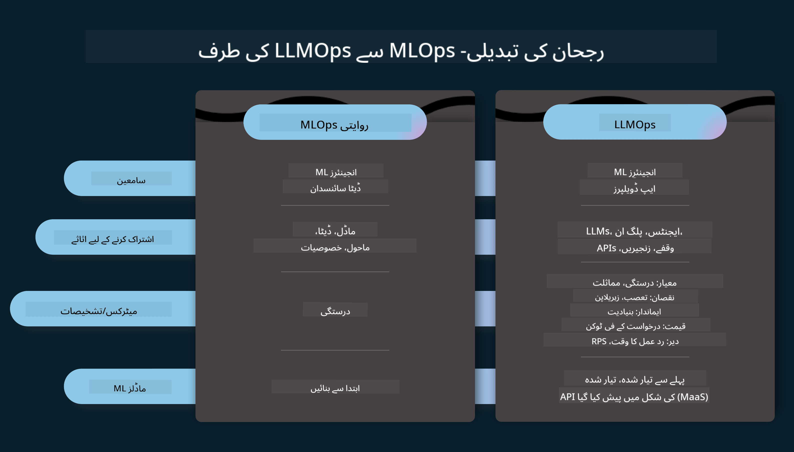
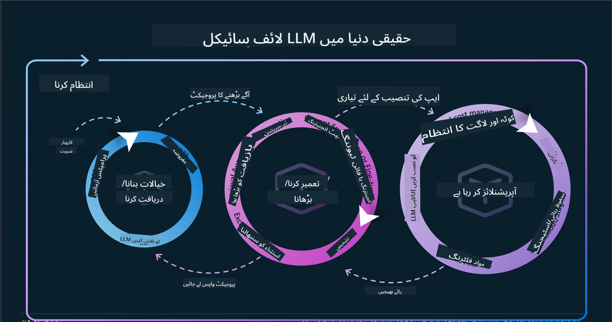
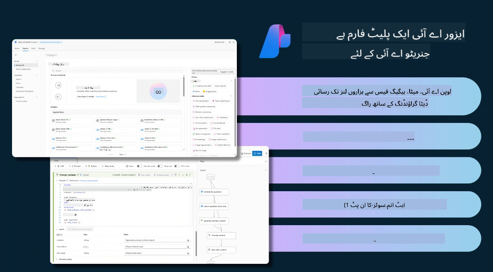
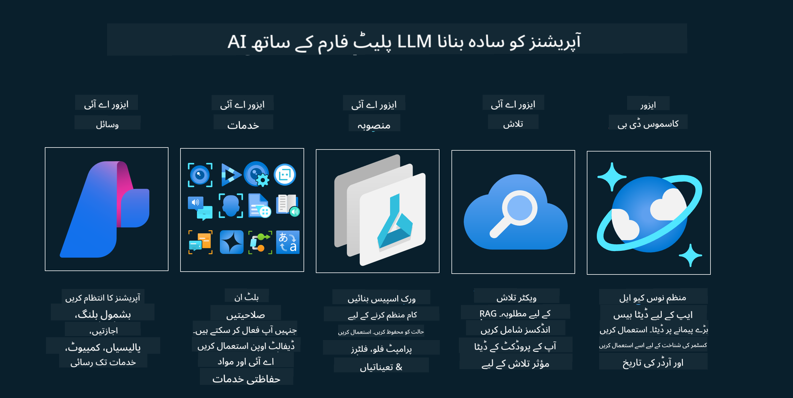
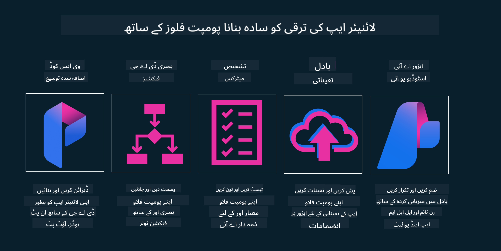

<!--
CO_OP_TRANSLATOR_METADATA:
{
  "original_hash": "27a5347a5022d5ef0a72ab029b03526a",
  "translation_date": "2025-06-25T21:55:54+00:00",
  "source_file": "14-the-generative-ai-application-lifecycle/README.md",
  "language_code": "ur"
}
-->

# جنریٹیو AI ایپلیکیشن لائف سائیکل

تمام AI ایپلیکیشنز کے لیے ایک اہم سوال AI خصوصیات کی مطابقت ہے، کیونکہ AI ایک تیزی سے ترقی پذیر میدان ہے، اس بات کو یقینی بنانے کے لیے کہ آپ کی ایپلیکیشن متعلقہ، قابل اعتماد، اور مضبوط رہے، آپ کو اسے مسلسل نگرانی، جائزہ اور بہتری کی ضرورت ہوتی ہے۔ یہ وہ جگہ ہے جہاں جنریٹیو AI لائف سائیکل آتا ہے۔

جنریٹیو AI لائف سائیکل ایک فریم ورک ہے جو آپ کو جنریٹیو AI ایپلیکیشن تیار کرنے، تعینات کرنے، اور برقرار رکھنے کے مراحل سے گزرتا ہے۔ یہ آپ کو اپنے اہداف کی وضاحت کرنے، اپنی کارکردگی کی پیمائش کرنے، اپنے چیلنجز کی نشاندہی کرنے، اور اپنے حل کو نافذ کرنے میں مدد کرتا ہے۔ یہ آپ کی ایپلیکیشن کو آپ کے ڈومین کے اخلاقی اور قانونی معیارات اور آپ کے اسٹیک ہولڈرز کے ساتھ ہم آہنگ کرنے میں بھی مدد کرتا ہے۔ جنریٹیو AI لائف سائیکل کی پیروی کرکے، آپ اس بات کو یقینی بنا سکتے ہیں کہ آپ کی ایپلیکیشن ہمیشہ قدر فراہم کر رہی ہے اور آپ کے صارفین کو مطمئن کر رہی ہے۔

## تعارف

اس باب میں، آپ:

- MLOps سے LLMOps کی طرف پیراڈائم شفٹ کو سمجھیں گے
- LLM لائف سائیکل
- لائف سائیکل ٹولنگ
- لائف سائیکل میٹرکیشن اور جائزہ

## MLOps سے LLMOps کی طرف پیراڈائم شفٹ کو سمجھیں

LLMs مصنوعی ذہانت کے ہتھیاروں میں ایک نیا ٹول ہیں، وہ ایپلیکیشنز کے لیے تجزیہ اور جنریشن کے کاموں میں ناقابل یقین حد تک طاقتور ہیں، تاہم یہ طاقت AI اور کلاسک مشین لرننگ کے کاموں کو ہموار کرنے کے طریقے پر کچھ نتائج رکھتی ہے۔

اس کے ساتھ، ہمیں اس ٹول کو متحرک طور پر اپنانے کے لیے ایک نیا پیراڈائم درکار ہے، صحیح ترغیبات کے ساتھ۔ ہم پرانی AI ایپس کو "ML Apps" اور نئی AI ایپس کو "GenAI Apps" یا صرف "AI Apps" کے طور پر درجہ بندی کر سکتے ہیں، جو اس وقت استعمال ہونے والی مرکزی دھارے کی ٹیکنالوجی اور تکنیک کی عکاسی کرتی ہیں۔ یہ ہماری داستان کو متعدد طریقوں سے منتقل کرتا ہے، درج ذیل موازنہ پر ایک نظر ڈالیں۔

نوٹ کریں کہ LLMOps میں، ہم ایپ ڈویلپرز پر زیادہ توجہ مرکوز کر رہے ہیں، انضمام کو ایک اہم نقطہ کے طور پر استعمال کرتے ہوئے، "ماڈلز بطور سروس" کا استعمال کرتے ہوئے اور میٹرکس کے لیے درج ذیل نکات میں سوچتے ہیں۔

- معیار: جواب کا معیار
- نقصان: ذمہ دار AI
- ایمانداری: جواب کی بنیاد (کیا یہ سمجھ میں آتا ہے؟ کیا یہ درست ہے؟)
- لاگت: حل کا بجٹ
- تاخیر: ٹوکن کے جواب کے لیے اوسط وقت

## LLM لائف سائیکل

پہلے، لائف سائیکل اور ترمیمات کو سمجھنے کے لیے، اگلی انفوگرافک پر نوٹ کریں۔

جیسا کہ آپ نوٹ کر سکتے ہیں، یہ MLOps کے عام لائف سائیکل سے مختلف ہے۔ LLMs کے پاس بہت ساری نئی ضروریات ہیں، جیسے پرامپٹنگ، معیار کو بہتر بنانے کی مختلف تکنیکیں (فائن ٹیوننگ، RAG، میٹا پرامپٹس)، ذمہ دار AI کے ساتھ مختلف تشخیص اور ذمہ داری، آخر میں، نئے تشخیصی میٹرکس (معیار، نقصان، ایمانداری، لاگت اور تاخیر)۔

مثال کے طور پر، دیکھیں کہ ہم کیسے آئیڈیٹ کرتے ہیں۔ ان کی قیاس آرائی کو جانچنے کے امکانات کو دریافت کرنے کے لیے مختلف LLMs کے ساتھ تجربہ کرنے کے لیے پرامپٹ انجینئرنگ کا استعمال۔

نوٹ کریں کہ یہ لکیری نہیں ہے، بلکہ مربوط لوپس، تکراری اور ایک مجموعی سائیکل کے ساتھ ہے۔

ہم ان اقدامات کو کیسے دریافت کر سکتے ہیں؟ آئیے تفصیل میں جائیں کہ ہم لائف سائیکل کیسے بنا سکتے ہیں۔

یہ تھوڑا پیچیدہ لگ سکتا ہے، پہلے تین بڑے اقدامات پر توجہ مرکوز کریں۔

1. آئیڈیٹنگ/ایکسپلورنگ: تلاش، یہاں ہم اپنی کاروباری ضروریات کے مطابق دریافت کر سکتے ہیں۔ پروٹو ٹائپنگ، ایک [PromptFlow](https://microsoft.github.io/promptflow/index.html?WT.mc_id=academic-105485-koreyst) بنانا اور جانچنا کہ آیا یہ ہماری قیاس آرائی کے لیے کافی مؤثر ہے۔
2. تعمیر/اضافہ: نفاذ، اب، ہم بڑے ڈیٹا سیٹس کے لیے تکنیکوں کو لاگو کرنے کے لیے جانچ شروع کرتے ہیں، جیسے کہ فائن ٹیوننگ اور RAG، ہمارے حل کی مضبوطی کو جانچنے کے لیے۔ اگر ایسا نہیں ہوتا ہے، تو اسے دوبارہ لاگو کرنا، ہمارے فلو میں نئے مراحل شامل کرنا یا ڈیٹا کو دوبارہ ترتیب دینا مددگار ثابت ہو سکتا ہے۔ ہمارے فلو اور ہمارے پیمانے کی جانچ کے بعد، اگر یہ کام کرتا ہے اور ہمارے میٹرکس کو چیک کرتا ہے، تو یہ اگلے مرحلے کے لیے تیار ہے۔
3. آپریشنلائزنگ: انضمام، اب ہمارے سسٹم میں مانیٹرنگ اور الرٹس سسٹمز کا اضافہ، ہمارے ایپلیکیشن میں تعیناتی اور ایپلیکیشن انضمام۔

پھر، ہمارے پاس مینجمنٹ کا مجموعی سائیکل ہے، جو سیکیورٹی، تعمیل اور حکمرانی پر توجہ مرکوز کرتا ہے۔

مبارک ہو، اب آپ کی AI ایپ تیار ہے اور آپریشنل ہے۔ عملی تجربے کے لیے، [Contoso Chat Demo](https://nitya.github.io/contoso-chat/?WT.mc_id=academic-105485-koreys) پر ایک نظر ڈالیں۔

اب، ہم کون سے ٹولز استعمال کر سکتے ہیں؟

## لائف سائیکل ٹولنگ

ٹولنگ کے لیے، Microsoft [Azure AI Platform](https://azure.microsoft.com/solutions/ai/?WT.mc_id=academic-105485-koreys) اور [PromptFlow](https://microsoft.github.io/promptflow/index.html?WT.mc_id=academic-105485-koreyst) فراہم کرتا ہے تاکہ آپ کے سائیکل کو نافذ کرنے اور جانے کے لیے تیار کرنے میں آسانی ہو۔

[Azure AI Platform](https://azure.microsoft.com/solutions/ai/?WT.mc_id=academic-105485-koreys)، آپ کو [AI Studio](https://ai.azure.com/?WT.mc_id=academic-105485-koreys) استعمال کرنے کی اجازت دیتا ہے۔ AI Studio ایک ویب پورٹل ہے جو آپ کو ماڈلز، نمونے اور ٹولز کو دریافت کرنے کی اجازت دیتا ہے۔ اپنے وسائل، UI ترقیاتی فلو اور کوڈ فرسٹ ڈویلپمنٹ کے لیے SDK/CLI اختیارات کا انتظام کرنا۔

Azure AI، آپ کو اپنے آپریشنز، خدمات، پروجیکٹس، ویکٹر سرچ اور ڈیٹا بیس کی ضروریات کا انتظام کرنے کے لیے متعدد وسائل استعمال کرنے کی اجازت دیتا ہے۔

پروف آف کانسیپٹ (POC) سے لے کر بڑی پیمانے پر ایپلیکیشنز تک PromptFlow کے ساتھ تعمیر کریں:

- بصری اور فعال ٹولز کے ساتھ VS کوڈ سے ایپس ڈیزائن اور بنائیں
- اپنے ایپس کو معیار AI کے لیے آسانی سے ٹیسٹ کریں اور بہتر بنائیں۔
- کلاؤڈ کے ساتھ انضمام اور تکرار کرنے کے لیے Azure AI اسٹوڈیو کا استعمال کریں، فوری انضمام کے لیے پش اور ڈپلائی کریں۔

## شاندار! اپنی سیکھنے کو جاری رکھیں!

زبردست، اب سیکھیں کہ ہم کس طرح ایک ایپلیکیشن کو ان تصورات کو استعمال کرنے کے لیے منظم کرتے ہیں [Contoso Chat App](https://nitya.github.io/contoso-chat/?WT.mc_id=academic-105485-koreyst) کے ساتھ، یہ جاننے کے لیے کہ کلاؤڈ ایڈووکیسی ان تصورات کو مظاہروں میں کیسے شامل کرتی ہے۔ مزید مواد کے لیے، ہمارا [Ignite breakout session](https://www.youtube.com/watch?v=DdOylyrTOWg) دیکھیں!

اب، سبق 15 دیکھیں، یہ سمجھنے کے لیے کہ [Retrieval Augmented Generation and Vector Databases](../15-rag-and-vector-databases/README.md?WT.mc_id=academic-105485-koreyst) جنریٹیو AI پر کیسے اثر انداز ہوتی ہے اور مزید دلچسپ ایپلیکیشنز بنانے کے لیے!

**ڈس کلیمر**:  
یہ دستاویز AI ترجمہ سروس [Co-op Translator](https://github.com/Azure/co-op-translator) کا استعمال کرتے ہوئے ترجمہ کی گئی ہے۔ ہم درستگی کے لئے کوشاں ہیں، لیکن براہ کرم آگاہ رہیں کہ خودکار ترجمے میں غلطیاں یا نقائص ہو سکتے ہیں۔ اصل دستاویز کو اس کی مقامی زبان میں مستند ذریعہ سمجھا جانا چاہئے۔ اہم معلومات کے لئے، پیشہ ور انسانی ترجمہ کی سفارش کی جاتی ہے۔ اس ترجمے کے استعمال سے پیدا ہونے والی کسی بھی غلط فہمی یا غلط تشریح کے لئے ہم ذمہ دار نہیں ہیں۔