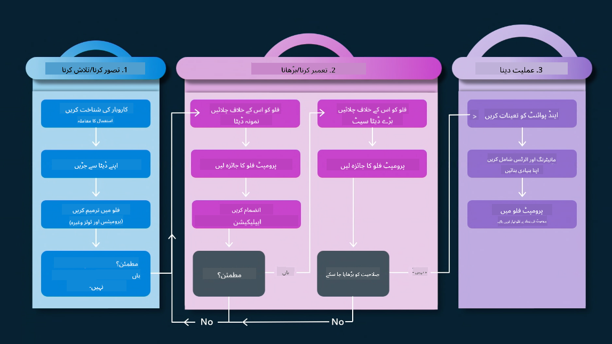
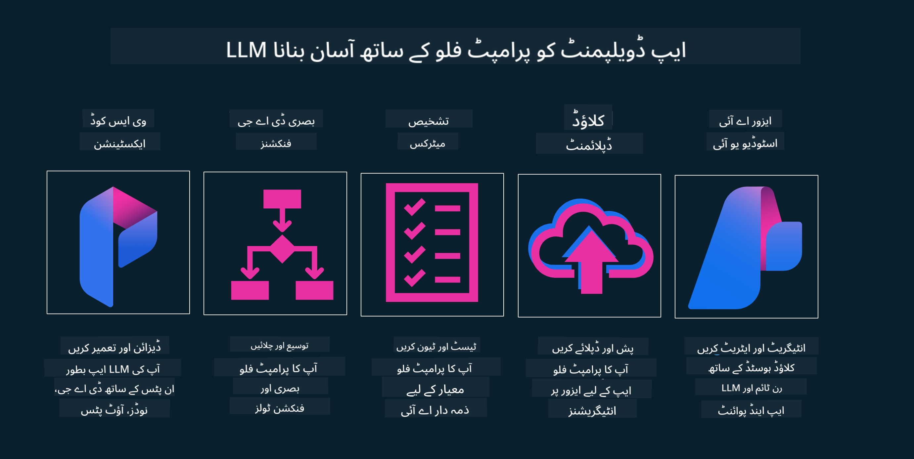

<!--
CO_OP_TRANSLATOR_METADATA:
{
  "original_hash": "b9d32511b27373a1b21b5789d4fda057",
  "translation_date": "2025-10-17T13:05:21+00:00",
  "source_file": "14-the-generative-ai-application-lifecycle/README.md",
  "language_code": "ur"
}
-->

# تخلیقی AI ایپلیکیشن لائف سائیکل

تمام AI ایپلیکیشنز کے لیے ایک اہم سوال AI خصوصیات کی مطابقت ہے، کیونکہ AI ایک تیزی سے ترقی پذیر میدان ہے۔ اس بات کو یقینی بنانے کے لیے کہ آپ کی ایپلیکیشن متعلقہ، قابل اعتماد اور مضبوط رہے، آپ کو اسے مسلسل مانیٹر، جانچ اور بہتر بنانا ہوگا۔ یہی وہ جگہ ہے جہاں تخلیقی AI لائف سائیکل کام آتا ہے۔

تخلیقی AI لائف سائیکل ایک فریم ورک ہے جو آپ کو تخلیقی AI ایپلیکیشن کو تیار کرنے، تعینات کرنے اور برقرار رکھنے کے مراحل سے گزرنے میں رہنمائی کرتا ہے۔ یہ آپ کو اپنے اہداف کی وضاحت کرنے، اپنی کارکردگی کی پیمائش کرنے، اپنے چیلنجز کی شناخت کرنے اور اپنے حل کو نافذ کرنے میں مدد کرتا ہے۔ یہ آپ کی ایپلیکیشن کو آپ کے شعبے اور اسٹیک ہولڈرز کے اخلاقی اور قانونی معیارات کے ساتھ ہم آہنگ کرنے میں بھی مدد کرتا ہے۔ تخلیقی AI لائف سائیکل کی پیروی کرکے، آپ اس بات کو یقینی بنا سکتے ہیں کہ آپ کی ایپلیکیشن ہمیشہ قدر فراہم کر رہی ہے اور اپنے صارفین کو مطمئن کر رہی ہے۔

## تعارف

اس باب میں، آپ:

- MLOps سے LLMOps تک کے پیراڈائم شفٹ کو سمجھیں گے
- LLM لائف سائیکل
- لائف سائیکل ٹولنگ
- لائف سائیکل میٹرکیشن اور تشخیص

## MLOps سے LLMOps تک کے پیراڈائم شفٹ کو سمجھیں

LLMs مصنوعی ذہانت کے ہتھیاروں میں ایک نیا ٹول ہیں، یہ ایپلیکیشنز کے لیے تجزیہ اور تخلیق کے کاموں میں ناقابل یقین حد تک طاقتور ہیں، تاہم اس طاقت کے کچھ نتائج ہیں کہ ہم AI اور کلاسک مشین لرننگ کے کاموں کو کس طرح ہموار کرتے ہیں۔

اس کے ساتھ، ہمیں اس ٹول کو متحرک انداز میں، درست ترغیبات کے ساتھ اپنانے کے لیے ایک نئے پیراڈائم کی ضرورت ہے۔ ہم پرانی AI ایپس کو "ML ایپس" اور نئی AI ایپس کو "GenAI ایپس" یا صرف "AI ایپس" کے طور پر درجہ بندی کر سکتے ہیں، جو اس وقت استعمال ہونے والی مرکزی دھارے کی ٹیکنالوجی اور تکنیک کی عکاسی کرتے ہیں۔ یہ ہماری کہانی کو کئی طریقوں سے بدل دیتا ہے، درج ذیل موازنہ دیکھیں۔

نوٹ کریں کہ LLMOps میں، ہم ایپ ڈویلپرز پر زیادہ توجہ مرکوز کر رہے ہیں، انضمام کو ایک اہم نقطہ کے طور پر استعمال کرتے ہوئے، "ماڈلز-ایز-اے-سروس" کا استعمال کرتے ہوئے اور میٹرکس کے لیے درج ذیل نکات پر غور کرتے ہوئے۔

- معیار: جواب کا معیار
- نقصان: ذمہ دار AI
- ایمانداری: جواب کی بنیاد (کیا یہ سمجھ میں آتا ہے؟ کیا یہ درست ہے؟)
- لاگت: حل کا بجٹ
- تاخیر: ٹوکن جواب کے لیے اوسط وقت

## LLM لائف سائیکل

سب سے پہلے، لائف سائیکل اور ترمیمات کو سمجھنے کے لیے، اگلے انفوگرافک پر نوٹ کریں۔

جیسا کہ آپ نوٹ کر سکتے ہیں، یہ MLOps کے معمول کے لائف سائیکل سے مختلف ہے۔ LLMs کے لیے بہت سی نئی ضروریات ہیں، جیسے پرامپٹنگ، معیار کو بہتر بنانے کے لیے مختلف تکنیکیں (فائن ٹیوننگ، RAG، میٹا پرامپٹس)، ذمہ دار AI کے ساتھ مختلف تشخیص اور ذمہ داری، آخر میں، نئے تشخیصی میٹرکس (معیار، نقصان، ایمانداری، لاگت اور تاخیر)۔

مثال کے طور پر، دیکھیں کہ ہم کیسے آئیڈیٹ کرتے ہیں۔ مختلف LLMs کے ساتھ تجربہ کرنے کے لیے پرامپٹ انجینئرنگ کا استعمال کرتے ہوئے امکانات کو تلاش کریں تاکہ یہ جانچ سکیں کہ آیا ان کا مفروضہ درست ہو سکتا ہے۔

نوٹ کریں کہ یہ لکیری نہیں ہے، بلکہ مربوط لوپس، تکراری اور ایک مجموعی سائیکل کے ساتھ ہے۔

ہم ان مراحل کو کیسے تلاش کر سکتے ہیں؟ آئیے تفصیل میں قدم رکھیں کہ ہم لائف سائیکل کیسے بنا سکتے ہیں۔

یہ تھوڑا پیچیدہ لگ سکتا ہے، پہلے تین بڑے مراحل پر توجہ مرکوز کریں۔

1. آئیڈیٹنگ/ایکسپلورنگ: تلاش، یہاں ہم اپنے کاروباری ضروریات کے مطابق تلاش کر سکتے ہیں۔ پروٹوٹائپنگ، ایک [PromptFlow](https://microsoft.github.io/promptflow/index.html?WT.mc_id=academic-105485-koreyst) بنانا اور جانچنا کہ آیا یہ ہمارے مفروضے کے لیے کافی موثر ہے۔
1. بلڈنگ/اگمینٹنگ: نفاذ، اب، ہم بڑے ڈیٹا سیٹس کے لیے جانچ شروع کرتے ہیں، تکنیکوں کو نافذ کرتے ہیں، جیسے فائن ٹیوننگ اور RAG، تاکہ ہمارے حل کی مضبوطی کو چیک کیا جا سکے۔ اگر ایسا نہیں ہوتا، تو اسے دوبارہ نافذ کرنا، ہمارے فلو میں نئے مراحل شامل کرنا یا ڈیٹا کو دوبارہ ترتیب دینا مددگار ثابت ہو سکتا ہے۔ ہمارے فلو اور ہمارے پیمانے کی جانچ کرنے کے بعد، اگر یہ کام کرتا ہے اور ہمارے میٹرکس کو چیک کرتا ہے، تو یہ اگلے مرحلے کے لیے تیار ہے۔
1. آپریشنلائزنگ: انضمام، اب ہمارے سسٹم میں مانیٹرنگ اور الرٹس سسٹمز شامل کرنا، تعیناتی اور ایپلیکیشن کو ہماری ایپلیکیشن کے ساتھ مربوط کرنا۔

پھر، ہمارے پاس انتظامیہ کا مجموعی سائیکل ہے، جو سیکیورٹی، تعمیل اور گورننس پر مرکوز ہے۔

مبارک ہو، اب آپ کی AI ایپ تیار ہے اور آپریشنل ہے۔ عملی تجربے کے لیے، [Contoso Chat Demo](https://nitya.github.io/contoso-chat/?WT.mc_id=academic-105485-koreys) پر ایک نظر ڈالیں۔

اب، ہم کون سے ٹولز استعمال کر سکتے ہیں؟

## لائف سائیکل ٹولنگ

ٹولنگ کے لیے، Microsoft [Azure AI Platform](https://azure.microsoft.com/solutions/ai/?WT.mc_id=academic-105485-koreys) اور [PromptFlow](https://microsoft.github.io/promptflow/index.html?WT.mc_id=academic-105485-koreyst) فراہم کرتا ہے تاکہ آپ کے سائیکل کو نافذ کرنا آسان اور تیار ہو جائے۔

[Azure AI Platform](https://azure.microsoft.com/solutions/ai/?WT.mc_id=academic-105485-koreys)، آپ کو [AI Studio](https://ai.azure.com/?WT.mc_id=academic-105485-koreys) استعمال کرنے کی اجازت دیتا ہے۔ AI Studio ایک ویب پورٹل ہے جو آپ کو ماڈلز، نمونوں اور ٹولز کو دریافت کرنے کی اجازت دیتا ہے۔ اپنے وسائل کا انتظام کرنا، UI ڈویلپمنٹ فلو اور کوڈ-فرسٹ ڈویلپمنٹ کے لیے SDK/CLI آپشنز۔

Azure AI، آپ کو اپنے آپریشنز، سروسز، پروجیکٹس، ویکٹر سرچ اور ڈیٹا بیس کی ضروریات کو منظم کرنے کے لیے متعدد وسائل استعمال کرنے کی اجازت دیتا ہے۔

Proof-of-Concept(POC) سے لے کر بڑے پیمانے پر ایپلیکیشنز تک PromptFlow کے ساتھ تعمیر کریں:

- VS Code سے ایپس ڈیزائن اور بنائیں، بصری اور فنکشنل ٹولز کے ساتھ
- اپنی ایپس کو آسانی سے معیاری AI کے لیے جانچیں اور فائن ٹیون کریں۔
- Azure AI Studio کا استعمال کرتے ہوئے کلاؤڈ کے ساتھ انضمام اور تکرار کریں، فوری انضمام کے لیے پش اور تعینات کریں۔

## زبردست! اپنی تعلیم جاری رکھیں!

زبردست، اب سیکھیں کہ ہم ایپلیکیشن کو ان تصورات کے ساتھ استعمال کرنے کے لیے کیسے ترتیب دیتے ہیں [Contoso Chat App](https://nitya.github.io/contoso-chat/?WT.mc_id=academic-105485-koreyst) کے ساتھ، یہ دیکھنے کے لیے کہ کلاؤڈ ایڈوکیسی ان تصورات کو مظاہروں میں کیسے شامل کرتی ہے۔ مزید مواد کے لیے، ہمارا [Ignite breakout session](https://www.youtube.com/watch?v=DdOylyrTOWg) دیکھیں!

اب، سبق 15 دیکھیں، یہ سمجھنے کے لیے کہ [Retrieval Augmented Generation اور ویکٹر ڈیٹا بیس](../15-rag-and-vector-databases/README.md?WT.mc_id=academic-105485-koreyst) تخلیقی AI کو کیسے متاثر کرتے ہیں اور مزید دلچسپ ایپلیکیشنز بنانے کے لیے!

---

**اعلانِ لاتعلقی**:  
یہ دستاویز AI ترجمہ سروس [Co-op Translator](https://github.com/Azure/co-op-translator) کا استعمال کرتے ہوئے ترجمہ کی گئی ہے۔ ہم درستگی کی بھرپور کوشش کرتے ہیں، لیکن براہ کرم آگاہ رہیں کہ خودکار ترجمے میں غلطیاں یا غیر درستیاں ہو سکتی ہیں۔ اصل دستاویز کو اس کی اصل زبان میں مستند ذریعہ سمجھا جانا چاہیے۔ اہم معلومات کے لیے، پیشہ ور انسانی ترجمہ کی سفارش کی جاتی ہے۔ اس ترجمے کے استعمال سے پیدا ہونے والی کسی بھی غلط فہمی یا غلط تشریح کے لیے ہم ذمہ دار نہیں ہیں۔