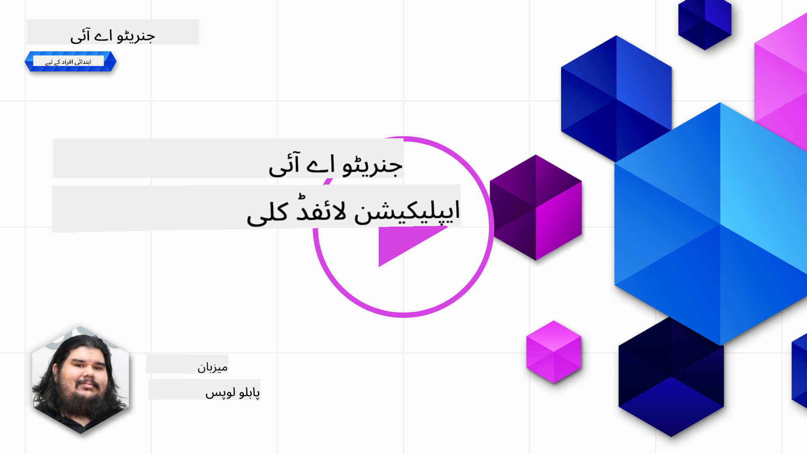

<!--
CO_OP_TRANSLATOR_METADATA:
{
  "original_hash": "27a5347a5022d5ef0a72ab029b03526a",
  "translation_date": "2025-07-09T15:48:08+00:00",
  "source_file": "14-the-generative-ai-application-lifecycle/README.md",
  "language_code": "ur"
}
-->

# جنریٹو AI ایپلیکیشن کا لائف سائیکل

تمام AI ایپلیکیشنز کے لیے ایک اہم سوال یہ ہے کہ AI خصوصیات کتنی متعلقہ ہیں، کیونکہ AI ایک تیزی سے ترقی پذیر میدان ہے۔ اس بات کو یقینی بنانے کے لیے کہ آپ کی ایپلیکیشن متعلقہ، قابل اعتماد اور مضبوط رہے، آپ کو اسے مسلسل مانیٹر، جانچ اور بہتر بنانا ہوگا۔ یہی وہ جگہ ہے جہاں جنریٹو AI لائف سائیکل کا کردار آتا ہے۔

جنریٹو AI لائف سائیکل ایک فریم ورک ہے جو آپ کو جنریٹو AI ایپلیکیشن کی ترقی، تعیناتی اور دیکھ بھال کے مراحل سے گزرتا ہے۔ یہ آپ کو اپنے مقاصد کی وضاحت کرنے، اپنی کارکردگی کی پیمائش کرنے، چیلنجز کی نشاندہی کرنے اور حل نافذ کرنے میں مدد دیتا ہے۔ یہ آپ کی ایپلیکیشن کو آپ کے شعبے اور اسٹیک ہولڈرز کے اخلاقی اور قانونی معیارات کے مطابق بھی ہم آہنگ کرتا ہے۔ جنریٹو AI لائف سائیکل کی پیروی کرکے، آپ یقینی بنا سکتے ہیں کہ آپ کی ایپلیکیشن ہمیشہ قدر فراہم کر رہی ہے اور آپ کے صارفین کو مطمئن کر رہی ہے۔

## تعارف

اس باب میں، آپ:

- MLOps سے LLMOps کی طرف پیراڈائم شفٹ کو سمجھیں گے
- LLM لائف سائیکل
- لائف سائیکل ٹولنگ
- لائف سائیکل میٹرکیشن اور جائزہ

## MLOps سے LLMOps کی طرف پیراڈائم شفٹ کو سمجھیں

LLMs مصنوعی ذہانت کے ہتھیار میں ایک نیا آلہ ہیں، یہ ایپلیکیشنز کے لیے تجزیہ اور تخلیق کے کاموں میں بے حد طاقتور ہیں، تاہم اس طاقت کے کچھ اثرات ہوتے ہیں کہ ہم AI اور کلاسیکی مشین لرننگ کے کاموں کو کس طرح ہموار کرتے ہیں۔

اسی لیے، ہمیں اس آلے کو متحرک انداز میں اپنانے کے لیے ایک نیا پیراڈائم چاہیے، جس میں درست ترغیبات ہوں۔ ہم پرانی AI ایپلیکیشنز کو "ML Apps" اور نئی AI ایپلیکیشنز کو "GenAI Apps" یا صرف "AI Apps" کے طور پر درجہ بندی کر سکتے ہیں، جو اس وقت استعمال ہونے والی مرکزی ٹیکنالوجی اور تکنیک کی عکاسی کرتی ہے۔ یہ ہماری کہانی کو کئی طریقوں سے بدل دیتا ہے، درج ذیل موازنہ دیکھیں۔

نوٹ کریں کہ LLMOps میں، ہم زیادہ تر App Developers پر توجہ مرکوز کرتے ہیں، انضمام کو ایک کلیدی نقطہ کے طور پر استعمال کرتے ہیں، "Models-as-a-Service" کا استعمال کرتے ہیں اور میٹرکس کے لیے درج ذیل نکات پر غور کرتے ہیں۔

- معیار: جواب کا معیار
- نقصان: ذمہ دار AI
- ایمانداری: جواب کی بنیاد (کیا یہ سمجھ میں آتا ہے؟ کیا یہ درست ہے؟)
- لاگت: حل کا بجٹ
- تاخیر: ٹوکن کے جواب کا اوسط وقت

## LLM لائف سائیکل

سب سے پہلے، لائف سائیکل اور اس میں تبدیلیوں کو سمجھنے کے لیے، اگلی انفرافک نوٹ کریں۔

جیسا کہ آپ دیکھ سکتے ہیں، یہ MLOps کے معمول کے لائف سائیکل سے مختلف ہے۔ LLMs کے بہت سے نئے تقاضے ہیں، جیسے پرامپٹنگ، معیار کو بہتر بنانے کی مختلف تکنیکیں (Fine-Tuning، RAG، Meta-Prompts)، ذمہ دار AI کے ساتھ مختلف جائزہ اور ذمہ داری، اور آخر میں، نئے جائزہ میٹرکس (معیار، نقصان، ایمانداری، لاگت اور تاخیر)۔

مثال کے طور پر، دیکھیں کہ ہم کیسے آئیڈیاز بناتے ہیں۔ مختلف LLMs کے ساتھ تجربہ کرنے کے لیے پرامپٹ انجینئرنگ کا استعمال کرتے ہیں تاکہ امکانات کو دریافت کیا جا سکے اور جانچا جا سکے کہ ان کے مفروضے درست ہو سکتے ہیں یا نہیں۔

نوٹ کریں کہ یہ خطی نہیں ہے، بلکہ مربوط لوپس، تکراری اور ایک جامع سائیکل کے ساتھ ہے۔

ہم ان مراحل کو کیسے دریافت کر سکتے ہیں؟ آئیے تفصیل میں جائیں کہ ہم لائف سائیکل کیسے بنا سکتے ہیں۔

یہ تھوڑا پیچیدہ لگ سکتا ہے، پہلے تین بڑے مراحل پر توجہ دیتے ہیں۔

1. آئیڈیٹ کرنا/دریافت کرنا: دریافت، یہاں ہم اپنے کاروباری ضروریات کے مطابق دریافت کر سکتے ہیں۔ پروٹوٹائپنگ، [PromptFlow](https://microsoft.github.io/promptflow/index.html?WT.mc_id=academic-105485-koreyst) بنانا اور جانچنا کہ آیا یہ ہمارے مفروضے کے لیے کافی مؤثر ہے۔
1. تعمیر کرنا/بہتر بنانا: نفاذ، اب ہم بڑے ڈیٹا سیٹس کے لیے تکنیکوں کا جائزہ لیتے ہیں، جیسے Fine-tuning اور RAG، تاکہ ہمارے حل کی مضبوطی کو چیک کیا جا سکے۔ اگر یہ کام نہیں کرتا، تو اسے دوبارہ نافذ کرنا، ہمارے فلو میں نئے مراحل شامل کرنا یا ڈیٹا کو دوبارہ ترتیب دینا مددگار ہو سکتا ہے۔ اپنے فلو اور اسکیل کی جانچ کے بعد، اگر یہ کام کرتا ہے اور ہمارے میٹرکس درست ہیں، تو یہ اگلے مرحلے کے لیے تیار ہے۔
1. آپریشنلائز کرنا: انضمام، اب مانیٹرنگ اور الرٹس سسٹمز کو ہمارے نظام میں شامل کرنا، تعیناتی اور ایپلیکیشن کے ساتھ انضمام۔

اس کے بعد، ہمارے پاس مینجمنٹ کا جامع سائیکل ہے، جو سیکیورٹی، تعمیل اور گورننس پر مرکوز ہے۔

مبارک ہو، اب آپ کی AI ایپ تیار ہے اور آپریشنل ہے۔ عملی تجربے کے لیے، [Contoso Chat Demo](https://nitya.github.io/contoso-chat/?WT.mc_id=academic-105485-koreys) دیکھیں۔

اب، ہم کون سے ٹولز استعمال کر سکتے ہیں؟

## لائف سائیکل ٹولنگ

ٹولنگ کے لیے، Microsoft [Azure AI Platform](https://azure.microsoft.com/solutions/ai/?WT.mc_id=academic-105485-koreys) اور [PromptFlow](https://microsoft.github.io/promptflow/index.html?WT.mc_id=academic-105485-koreyst) فراہم کرتا ہے جو آپ کے سائیکل کو آسانی سے نافذ کرنے اور تیار کرنے میں مدد دیتے ہیں۔

[Azure AI Platform](https://azure.microsoft.com/solutions/ai/?WT.mc_id=academic-105485-koreys) آپ کو [AI Studio](https://ai.azure.com/?WT.mc_id=academic-105485-koreys) استعمال کرنے کی اجازت دیتا ہے۔ AI Studio ایک ویب پورٹل ہے جو آپ کو ماڈلز، نمونے اور ٹولز دریافت کرنے دیتا ہے۔ آپ کے وسائل کا انتظام، UI ڈیولپمنٹ فلو اور SDK/CLI آپشنز برائے کوڈ-فرسٹ ڈیولپمنٹ۔

Azure AI آپ کو متعدد وسائل استعمال کرنے دیتا ہے، تاکہ آپ اپنی آپریشنز، سروسز، پروجیکٹس، ویکٹر سرچ اور ڈیٹا بیس کی ضروریات کا انتظام کر سکیں۔

PromptFlow کے ساتھ، Proof-of-Concept (POC) سے لے کر بڑے پیمانے پر ایپلیکیشنز تک تعمیر کریں:

- VS Code سے ایپس ڈیزائن اور بنائیں، بصری اور فنکشنل ٹولز کے ساتھ
- اپنی ایپس کو آسانی سے معیار کے AI کے لیے ٹیسٹ اور فائن ٹون کریں۔
- Azure AI Studio کا استعمال کریں تاکہ کلاؤڈ کے ساتھ انضمام اور تکرار کریں، تیز انضمام کے لیے Push اور Deploy کریں۔

## بہت خوب! اپنی تعلیم جاری رکھیں!

زبردست، اب مزید جانیں کہ ہم ایپلیکیشن کو کیسے ترتیب دیتے ہیں تاکہ تصورات کو [Contoso Chat App](https://nitya.github.io/contoso-chat/?WT.mc_id=academic-105485-koreyst) کے ساتھ استعمال کیا جا سکے، تاکہ دیکھیں کہ Cloud Advocacy ان تصورات کو مظاہروں میں کیسے شامل کرتا ہے۔ مزید مواد کے لیے، ہمارا [Ignite بریک آؤٹ سیشن](https://www.youtube.com/watch?v=DdOylyrTOWg) دیکھیں۔

اب، سبق 15 دیکھیں، تاکہ سمجھ سکیں کہ [Retrieval Augmented Generation اور Vector Databases](../15-rag-and-vector-databases/README.md?WT.mc_id=academic-105485-koreyst) جنریٹو AI پر کیسے اثر انداز ہوتے ہیں اور ایپلیکیشنز کو مزید دلچسپ بناتے ہیں!

**دستخطی دستبرداری**:  
یہ دستاویز AI ترجمہ سروس [Co-op Translator](https://github.com/Azure/co-op-translator) کے ذریعے ترجمہ کی گئی ہے۔ اگرچہ ہم درستگی کے لیے کوشاں ہیں، براہ کرم آگاہ رہیں کہ خودکار ترجمے میں غلطیاں یا عدم درستیاں ہو سکتی ہیں۔ اصل دستاویز اپنی مادری زبان میں ہی معتبر ماخذ سمجھی جانی چاہیے۔ اہم معلومات کے لیے پیشہ ور انسانی ترجمہ کی سفارش کی جاتی ہے۔ اس ترجمے کے استعمال سے پیدا ہونے والی کسی بھی غلط فہمی یا غلط تشریح کی ذمہ داری ہم پر عائد نہیں ہوتی۔