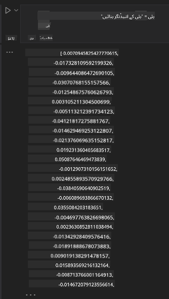

<!--
CO_OP_TRANSLATOR_METADATA:
{
  "original_hash": "e2861bbca91c0567ef32bc77fe054f9e",
  "translation_date": "2025-05-20T01:03:30+00:00",
  "source_file": "15-rag-and-vector-databases/README.md",
  "language_code": "ur"
}
-->
# رٹریول آگمینٹڈ جنریشن (RAG) اور ویکٹر ڈیٹا بیس

سرچ ایپلیکیشنز کے سبق میں، ہم نے مختصراً سیکھا کہ آپ اپنے ڈیٹا کو بڑے زبان ماڈلز (LLMs) میں کیسے ضم کر سکتے ہیں۔ اس سبق میں، ہم آپ کے LLM ایپلیکیشن میں ڈیٹا کو بنیاد فراہم کرنے کے تصورات، اس عمل کے میکینکس، اور ڈیٹا کو اسٹور کرنے کے طریقوں کو مزید گہرائی سے دیکھیں گے، جس میں ایمبیڈنگز اور ٹیکسٹ دونوں شامل ہیں۔

> **ویڈیو جلد آرہی ہے**

## تعارف

اس سبق میں ہم درج ذیل کو کور کریں گے:

- RAG کا تعارف، یہ کیا ہے اور AI (مصنوعی ذہانت) میں اس کا استعمال کیوں ہوتا ہے۔

- ویکٹر ڈیٹا بیس کیا ہیں اور ہماری ایپلیکیشن کے لئے ایک بنانا۔

- ایک عملی مثال کہ کیسے RAG کو ایپلیکیشن میں ضم کیا جائے۔

## سیکھنے کے مقاصد

اس سبق کو مکمل کرنے کے بعد، آپ قابل ہوں گے:

- ڈیٹا رٹریول اور پراسیسنگ میں RAG کی اہمیت کی وضاحت کریں۔

- RAG ایپلیکیشن سیٹ اپ کریں اور اپنے ڈیٹا کو LLM پر بنیاد فراہم کریں

- LLM ایپلیکیشنز میں RAG اور ویکٹر ڈیٹا بیس کا مؤثر انضمام۔

## ہمارا منظر نامہ: ہمارے LLMs کو اپنے ڈیٹا کے ساتھ بہتر بنانا

اس سبق کے لئے، ہم چاہتے ہیں کہ ہم اپنی نوٹس کو تعلیمی اسٹارٹ اپ میں شامل کریں، جو چیٹ بوٹ کو مختلف موضوعات پر مزید معلومات حاصل کرنے کی اجازت دیتا ہے۔ ان نوٹس کو استعمال کرتے ہوئے جو ہمارے پاس ہیں، سیکھنے والے بہتر مطالعہ کر سکیں گے اور مختلف موضوعات کو سمجھ سکیں گے، جس سے ان کے امتحانات کی تیاری آسان ہو جائے گی۔ ہمارا منظر نامہ بنانے کے لئے، ہم استعمال کریں گے:

- `Azure OpenAI:` LLM جسے ہم اپنے چیٹ بوٹ بنانے کے لئے استعمال کریں گے

- `AI for beginners' lesson on Neural Networks`: یہ وہ ڈیٹا ہوگا جس پر ہم اپنا LLM بنیاد فراہم کریں گے

- `Azure AI Search` اور `Azure Cosmos DB:` ویکٹر ڈیٹا بیس ہمارے ڈیٹا کو اسٹور کرنے اور سرچ انڈیکس بنانے کے لئے

صارفین اپنے نوٹس سے پریکٹس کوئزز، ریویژن فلیش کارڈز بنا سکیں گے اور اسے مختصر جائزوں میں خلاصہ کر سکیں گے۔ شروع کرنے کے لئے، آئیے دیکھتے ہیں کہ RAG کیا ہے اور کیسے کام کرتا ہے:

## رٹریول آگمینٹڈ جنریشن (RAG)

ایک LLM پاورڈ چیٹ بوٹ صارف کی پروامپٹس کو پروسیس کرتا ہے تاکہ جوابات تیار کر سکے۔ یہ ایک انٹرایکٹو ڈیزائن کیا گیا ہے جو صارفین کے ساتھ مختلف موضوعات پر بات چیت کرتا ہے۔ تاہم، اس کے جوابات فراہم کردہ سیاق و سباق اور اس کے بنیادی تربیتی ڈیٹا تک محدود ہوتے ہیں۔ مثال کے طور پر، GPT-4 کا نالج کٹ آف ستمبر 2021 ہے، یعنی، اس میں اس کے بعد ہونے والے واقعات کا علم نہیں ہے۔ اس کے علاوہ، LLMs کی تربیت کے لئے استعمال کیا گیا ڈیٹا حساس معلومات جیسے ذاتی نوٹس یا کسی کمپنی کے پروڈکٹ مینوئل کو شامل نہیں کرتا۔

### RAGs (رٹریول آگمینٹڈ جنریشن) کیسے کام کرتے ہیں

فرض کریں کہ آپ ایک چیٹ بوٹ کو تعینات کرنا چاہتے ہیں جو آپ کے نوٹس سے کوئزز بناتا ہے، آپ کو نالج بیس کے ساتھ ایک کنکشن کی ضرورت ہوگی۔ یہیں پر RAG مدد کے لئے آتا ہے۔ RAGs مندرجہ ذیل طریقے سے کام کرتے ہیں:

- **نالج بیس:** رٹریول سے پہلے، ان دستاویزات کو انجیست اور پری پروسیس کرنے کی ضرورت ہوتی ہے، عام طور پر بڑی دستاویزات کو چھوٹے ٹکڑوں میں تقسیم کرتے ہوئے، انہیں ٹیکسٹ ایمبیڈنگ میں تبدیل کرتے ہوئے اور انہیں ڈیٹا بیس میں اسٹور کرتے ہوئے۔

- **صارف کا سوال:** صارف ایک سوال پوچھتا ہے

- **رٹریول:** جب ایک صارف سوال پوچھتا ہے، ایمبیڈنگ ماڈل ہمارے نالج بیس سے متعلقہ معلومات کو حاصل کرتا ہے تاکہ پروامپٹ میں شامل کیا جا سکے۔

- **آگمینٹڈ جنریشن:** LLM اپنے جواب کو حاصل کردہ ڈیٹا کی بنیاد پر بڑھاتا ہے۔ یہ جواب کو صرف پہلے سے تربیت یافتہ ڈیٹا پر نہیں بلکہ شامل کردہ سیاق و سباق سے متعلق معلومات پر بھی بنیاد فراہم کرتا ہے۔ حاصل کردہ ڈیٹا کو LLM کے جوابات کو آگمینٹ کرنے کے لئے استعمال کیا جاتا ہے۔ LLM پھر صارف کے سوال کا جواب دیتا ہے۔

RAGs کے لئے آرکیٹیکچر کو ٹرانسفارمرز کا استعمال کرتے ہوئے نافذ کیا جاتا ہے جس میں دو حصے ہوتے ہیں: ایک انکوڈر اور ایک ڈیکوڈر۔ مثال کے طور پر، جب ایک صارف سوال پوچھتا ہے، ان پٹ ٹیکسٹ کو 'انکوڈ' کیا جاتا ہے تاکہ الفاظ کے معنی کو پکڑنے والے ویکٹرز میں تبدیل کیا جا سکے اور ویکٹرز کو ہمارے دستاویز انڈیکس میں 'ڈیکوڈ' کیا جاتا ہے اور صارف کے سوال کی بنیاد پر نیا ٹیکسٹ تیار کیا جاتا ہے۔ LLM انکوڈر-ڈیکوڈر ماڈل کا استعمال کرتے ہوئے آؤٹ پٹ تیار کرتا ہے۔

دو طریقے جب RAG کو نافذ کرتے ہیں جیسا کہ مجوزہ پیپر کے مطابق: [رٹریول-آگمینٹڈ جنریشن برائے نالج انٹینسیو NLP (نیچرل لینگویج پروسیسنگ سافٹ ویئر) ٹاسکس](https://arxiv.org/pdf/2005.11401.pdf?WT.mc_id=academic-105485-koreyst) ہیں:

- **_RAG-سیکوینس_** صارف کے سوال کا بہترین ممکنہ جواب پیش کرنے کے لئے حاصل کردہ دستاویزات کا استعمال

- **RAG-ٹوکین** دستاویزات کا استعمال کرتے ہوئے اگلا ٹوکین تیار کرنا، پھر انہیں صارف کے سوال کا جواب دینے کے لئے حاصل کرنا

### آپ RAGs کا استعمال کیوں کریں گے؟

- **معلومات کی دولت:** ٹیکسٹ جوابات کو اپ ڈیٹ اور موجودہ رکھنے کو یقینی بناتا ہے۔ یہ، لہذا، ڈومین مخصوص کاموں پر کارکردگی کو بہتر بناتا ہے داخلی نالج بیس تک رسائی حاصل کر کے۔

- **قابل تصدیق ڈیٹا** کا استعمال کرتے ہوئے صارف کے سوالات کو سیاق و سباق فراہم کرنے کے لئے غلط معلومات کو کم کرتا ہے۔

- یہ **قیمت مؤثر** ہے کیونکہ وہ ایک LLM کو فائن ٹیون کرنے کے مقابلے میں زیادہ اقتصادی ہیں۔

## نالج بیس بنانا

ہماری ایپلیکیشن ہمارے ذاتی ڈیٹا پر مبنی ہے یعنی، نیورل نیٹ ورک سبق برائے AI فار بیگنرز نصاب۔

### ویکٹر ڈیٹا بیس

ایک ویکٹر ڈیٹا بیس، روایتی ڈیٹا بیس کے برعکس، ایک خصوصی ڈیٹا بیس ہے جو ایمبیڈڈ ویکٹرز کو اسٹور، منظم اور تلاش کرنے کے لئے ڈیزائن کیا گیا ہے۔ یہ دستاویزات کی عددی نمائندگیوں کو اسٹور کرتا ہے۔ ڈیٹا کو عددی ایمبیڈنگز میں تقسیم کرنا ہمارے AI سسٹم کے لئے ڈیٹا کو سمجھنا اور پراسیس کرنا آسان بناتا ہے۔

ہم اپنی ایمبیڈنگز کو ویکٹر ڈیٹا بیس میں اسٹور کرتے ہیں کیونکہ LLMs کے پاس ان پٹ کے طور پر قبول کرنے والے ٹوکینز کی تعداد کی حد ہوتی ہے۔ چونکہ آپ پوری ایمبیڈنگز کو LLM میں منتقل نہیں کر سکتے، ہمیں انہیں ٹکڑوں میں تقسیم کرنے کی ضرورت ہوگی اور جب ایک صارف سوال پوچھتا ہے، سوال کے سب سے زیادہ ملتے جلتے ایمبیڈنگز کو پروامپٹ کے ساتھ واپس کیا جائے گا۔ ٹکڑوں میں تقسیم کرنا بھی LLM کے ذریعے منتقل ہونے والے ٹوکینز کی تعداد پر لاگت کو کم کرتا ہے۔

کچھ مشہور ویکٹر ڈیٹا بیس میں Azure Cosmos DB، Clarifyai، Pinecone، Chromadb، ScaNN، Qdrant اور DeepLake شامل ہیں۔ آپ Azure CLI کے ساتھ درج ذیل کمانڈ کا استعمال کرتے ہوئے Azure Cosmos DB ماڈل بنا سکتے ہیں:

```bash
az login
az group create -n <resource-group-name> -l <location>
az cosmosdb create -n <cosmos-db-name> -r <resource-group-name>
az cosmosdb list-keys -n <cosmos-db-name> -g <resource-group-name>
```

### ٹیکسٹ سے ایمبیڈنگز تک

اس سے پہلے کہ ہم اپنے ڈیٹا کو اسٹور کریں، ہمیں اسے ڈیٹا بیس میں اسٹور کرنے سے پہلے ویکٹر ایمبیڈنگز میں تبدیل کرنے کی ضرورت ہوگی۔ اگر آپ بڑے دستاویزات یا طویل ٹیکسٹ کے ساتھ کام کر رہے ہیں، تو آپ انہیں ان سوالات کی بنیاد پر تقسیم کر سکتے ہیں جن کی آپ توقع کرتے ہیں۔ ٹکڑوں میں تقسیم کرنا جملے کی سطح پر یا پیراگراف کی سطح پر کیا جا سکتا ہے۔ چونکہ ٹکڑوں میں تقسیم کرنا ان کے ارد گرد کے الفاظ سے معنی اخذ کرتا ہے، آپ ایک ٹکڑے میں کچھ دوسرے سیاق و سباق شامل کر سکتے ہیں، مثال کے طور پر، دستاویز کا عنوان شامل کر کے یا ٹکڑے سے پہلے یا بعد میں کچھ ٹیکسٹ شامل کر کے۔ آپ ڈیٹا کو اس طرح تقسیم کر سکتے ہیں:

```python
def split_text(text, max_length, min_length):
    words = text.split()
    chunks = []
    current_chunk = []

    for word in words:
        current_chunk.append(word)
        if len(' '.join(current_chunk)) < max_length and len(' '.join(current_chunk)) > min_length:
            chunks.append(' '.join(current_chunk))
            current_chunk = []

    # If the last chunk didn't reach the minimum length, add it anyway
    if current_chunk:
        chunks.append(' '.join(current_chunk))

    return chunks
```

ایک بار تقسیم ہو جانے کے بعد، ہم مختلف ایمبیڈنگ ماڈلز کا استعمال کرتے ہوئے اپنے ٹیکسٹ کو ایمبیڈ کر سکتے ہیں۔ کچھ ماڈلز جن کا آپ استعمال کر سکتے ہیں ان میں شامل ہیں: word2vec، ada-002 از OpenAI، Azure Computer Vision اور بہت کچھ۔ استعمال کرنے کے لئے ماڈل کا انتخاب آپ کے استعمال کردہ زبانوں، انکوڈ کیے جانے والے مواد کی قسم (ٹیکسٹ/امیجز/آڈیو)، انپٹ کا سائز جسے یہ انکوڈ کر سکتا ہے اور ایمبیڈنگ آؤٹ پٹ کی لمبائی پر منحصر ہوگا۔

OpenAI کے `text-embedding-ada-002` ماڈل کا استعمال کرتے ہوئے ایمبیڈ کیے گئے ٹیکسٹ کی ایک مثال:


## رٹریول اور ویکٹر سرچ

جب ایک صارف سوال پوچھتا ہے، تو رٹریور اسے کوئری انکوڈر کا استعمال کرتے ہوئے ایک ویکٹر میں تبدیل کرتا ہے، پھر یہ ہمارے دستاویز سرچ انڈیکس میں ان دستاویزات کے متعلقہ ویکٹرز کی تلاش کرتا ہے جو انپٹ سے متعلق ہیں۔ ایک بار مکمل ہونے کے بعد، یہ انپٹ ویکٹر اور دستاویز ویکٹرز دونوں کو ٹیکسٹ میں تبدیل کرتا ہے اور اسے LLM کے ذریعے منتقل کرتا ہے۔

### رٹریول

رٹریول اس وقت ہوتا ہے جب نظام انڈیکس سے ان دستاویزات کو جلدی سے تلاش کرنے کی کوشش کرتا ہے جو سرچ کے معیار کو پورا کرتی ہیں۔ رٹریور کا مقصد ان دستاویزات کو حاصل کرنا ہے جو سیاق و سباق فراہم کریں اور آپ کے ڈیٹا پر LLM کو بنیاد فراہم کریں۔

ہمارے ڈیٹا بیس کے اندر سرچ کرنے کے کئی طریقے ہیں جیسے:

- **کی ورڈ سرچ** - ٹیکسٹ سرچز کے لئے استعمال کیا جاتا ہے

- **سمانٹک سرچ** - الفاظ کے سمانٹک معنی کا استعمال کرتا ہے

- **ویکٹر سرچ** - دستاویزات کو ایمبیڈنگ ماڈلز کا استعمال کرتے ہوئے ٹیکسٹ سے ویکٹر نمائندگیوں میں تبدیل کرتا ہے۔ رٹریول ان دستاویزات کو کوئری کر کے کیا جائے گا جن کی ویکٹر نمائندگیاں صارف کے سوال کے قریب ترین ہوں گی۔

- **ہائبرڈ** - کی ورڈ اور ویکٹر سرچ دونوں کا مجموعہ۔

رٹریول کے ساتھ ایک چیلنج اس وقت آتا ہے جب ڈیٹا بیس میں سوال کے لئے کوئی ملتا جلتا جواب نہ ہو، نظام پھر بہترین معلومات واپس کرے گا جو وہ حاصل کر سکتا ہے، تاہم، آپ ایسی تدابیر استعمال کر سکتے ہیں جیسے متعلقہ ہونے کے لئے زیادہ سے زیادہ فاصلے کو سیٹ اپ کرنا یا ہائبرڈ سرچ کا استعمال کرنا جو کی ورڈز اور ویکٹر سرچ دونوں کو یکجا کرتا ہے۔ اس سبق میں ہم ہائبرڈ سرچ کا استعمال کریں گے، جو ویکٹر اور کی ورڈ سرچ دونوں کا مجموعہ ہے۔ ہم اپنے ڈیٹا کو ایک ڈیٹا فریم میں اسٹور کریں گے جس میں کالمز ٹکڑوں کے ساتھ ساتھ ایمبیڈنگز بھی شامل ہوں گے۔

### ویکٹر مماثلت

رٹریور نالج ڈیٹا بیس کے ذریعے ان ایمبیڈنگز کی تلاش کرے گا جو قریب قریب ہیں، قریب ترین پڑوسی، کیونکہ وہ ٹیکسٹ ہیں جو ملتے جلتے ہیں۔ جب ایک صارف سوال پوچھتا ہے، تو اسے پہلے ایمبیڈ کیا جاتا ہے پھر اسی طرح کی ایمبیڈنگز سے مماثل کیا جاتا ہے۔ عام پیمائش جو مختلف ویکٹرز کی مماثلت کو تلاش کرنے کے لئے استعمال کی جاتی ہے وہ کوسائن مماثلت ہے جو دو ویکٹرز کے درمیان زاویے پر مبنی ہے۔

ہم مماثلت کو دیگر متبادل کا استعمال کرتے ہوئے ماپ سکتے ہیں جنہیں ہم استعمال کر سکتے ہیں جیسے یوکلیڈیئن فاصلہ جو ویکٹر کے اختتامی نقاط کے درمیان سیدھی لائن ہے اور ڈاٹ پروڈکٹ جو دو ویکٹرز کے ہم منصب عناصر کے پروڈکٹس کے مجموعہ کو ماپتا ہے۔

### سرچ انڈیکس

جب رٹریول کر رہے ہوں، ہمیں اپنے نالج بیس کے لئے ایک سرچ انڈیکس بنانا ہوگا اس سے پہلے کہ ہم سرچ کریں۔ ایک انڈیکس ہماری ایمبیڈنگز کو اسٹور کرے گا اور بڑے ڈیٹا بیس میں بھی سب سے زیادہ ملتے جلتے ٹکڑوں کو جلدی سے حاصل کر سکے گا۔ ہم اپنے انڈیکس کو مقامی طور پر بنا سکتے ہیں:

```python
from sklearn.neighbors import NearestNeighbors

embeddings = flattened_df['embeddings'].to_list()

# Create the search index
nbrs = NearestNeighbors(n_neighbors=5, algorithm='ball_tree').fit(embeddings)

# To query the index, you can use the kneighbors method
distances, indices = nbrs.kneighbors(embeddings)
```

### دوبارہ درجہ بندی

ایک بار جب آپ نے ڈیٹا بیس کو کوئری کر لیا، تو آپ کو سب سے زیادہ متعلقہ نتائج سے نتائج کو ترتیب دینے کی ضرورت پڑ سکتی ہے۔ دوبارہ درجہ بندی کرنے والا LLM مشین لرننگ کا استعمال کرتا ہے تاکہ سرچ کے نتائج کی مطابقت کو بہتر بنایا جا سکے انہیں سب سے زیادہ متعلقہ سے ترتیب دے کر۔ Azure AI سرچ کا استعمال کرتے ہوئے، دوبارہ درجہ بندی آپ کے لئے خودکار طور پر کی جاتی ہے سمانٹک رینکر کا استعمال کرتے ہوئے۔ نزدیک ترین پڑوسیوں کا استعمال کرتے ہوئے دوبارہ درجہ بندی کیسے کام کرتی ہے کی ایک مثال:

```python
# Find the most similar documents
distances, indices = nbrs.kneighbors([query_vector])

index = []
# Print the most similar documents
for i in range(3):
    index = indices[0][i]
    for index in indices[0]:
        print(flattened_df['chunks'].iloc[index])
        print(flattened_df['path'].iloc[index])
        print(flattened_df['distances'].iloc[index])
    else:
        print(f"Index {index} not found in DataFrame")
```

## سب کو اکٹھا کرنا

آخری قدم یہ ہے کہ ہمارے LLM کو شامل کیا جائے تاکہ جوابات حاصل کیے جا سکیں جو ہمارے ڈیٹا پر بنیاد فراہم کریں۔ ہم اسے اس طرح نافذ کر سکتے ہیں:

```python
user_input = "what is a perceptron?"

def chatbot(user_input):
    # Convert the question to a query vector
    query_vector = create_embeddings(user_input)

    # Find the most similar documents
    distances, indices = nbrs.kneighbors([query_vector])

    # add documents to query  to provide context
    history = []
    for index in indices[0]:
        history.append(flattened_df['chunks'].iloc[index])

    # combine the history and the user input
    history.append(user_input)

    # create a message object
    messages=[
        {"role": "system", "content": "You are an AI assistant that helps with AI questions."},
        {"role": "user", "content": history[-1]}
    ]

    # use chat completion to generate a response
    response = openai.chat.completions.create(
        model="gpt-4",
        temperature=0.7,
        max_tokens=800,
        messages=messages
    )

    return response.choices[0].message

chatbot(user_input)
```

## ہماری ایپلیکیشن کا جائزہ لینا

### تشخیصی میٹرکس

- فراہم کردہ جوابات کی کوالٹی کو یقینی بنانا کہ یہ قدرتی، روانی اور انسانی جیسا لگے

- ڈیٹا کی بنیاد: جائزہ لینا کہ آیا جواب فراہم کردہ دستاویزات سے آیا

- مطابقت: جائزہ لینا کہ جواب سوال کے مطابق ہے اور اس سے متعلق ہے

- روانی - آیا جواب گرامر کے لحاظ سے معنی خیز ہے

## RAG (رٹریول آگمینٹڈ جنریشن) اور ویکٹر ڈیٹا بیس کا استعمال کرتے ہوئے استعمال کے معاملات

بہت سے مختلف استعمال کے معاملات ہیں جہاں فنکشن کالز آپ کی ایپ کو بہتر بنا سکتی ہیں جیسے:

- سوال و جواب: آپ کے کمپنی کے ڈیٹا کو ایک چیٹ میں بنیاد فراہم کرنا جسے ملازمین سوالات پوچھنے کے لئے استعمال کر سکتے ہیں۔

- سفارش کے نظام: جہاں آپ ایک نظام بنا سکتے ہیں جو سب سے زیادہ ملتے جلتے اقدار سے مماثل ہوتا ہے مثلاً فلمیں، ریستوران اور بہت کچھ۔

- چیٹ بوٹ سروسز: آپ چیٹ ہسٹری کو اسٹور کر سکتے ہیں اور صارف کے ڈیٹا کی بنیاد پر گفتگو کو ذاتی بنا سکتے ہیں۔

- ویکٹر ایمبیڈنگز کی بنیاد پر امیج سرچ، جب امیج کی شناخت اور بے ضابطگی کا پتہ لگانے کر رہے ہوں تو مفید۔

## خلاصہ

ہم نے RAG کے بنیادی علاقوں کو کور کیا ہے جیسے ہمارے ڈیٹا کو ایپلیکیشن میں شامل کرنا، صارف کا سوال اور آؤٹ پٹ۔ RAG کی تخلیق کو آسان بنانے کے لئے، آپ Semanti Kernel، Langchain یا Autogen جیسے فریم ورک استعمال کر سکتے ہیں۔

## اسائنمنٹ

رٹریول آگمینٹڈ جنریشن (RAG) کی اپنی سیکھنے کو جاری رکھنے کے لئے آپ بنا سکتے ہیں:

- اپنی پسند کے فریم ورک کا استعمال کرتے ہوئے ایپلیکیشن کے لئے ایک فرنٹ اینڈ بنائیں

- ایک فریم ورک، یا تو LangChain یا Semantic Kernel، استعمال کریں اور اپنی ایپلیکیشن کو دوبارہ بنائیں۔

سبق مکمل کرنے پر مبارکباد 👏۔

## سیکھنا یہاں ختم نہیں ہوتا، سفر جاری رکھیں

اس سبق کو مکمل کرنے کے بعد، ہمارے [جنریٹو AI لرننگ کلیکشن](https://aka.ms/genai-collection?WT.mc_id=academic-105485-koreyst) کو دیکھیں تاکہ اپنے جنریٹو AI کے علم کو بڑھاتے رہیں!

**ڈس کلیمر**:
یہ دستاویز AI ترجمہ سروس [Co-op Translator](https://github.com/Azure/co-op-translator) کا استعمال کرتے ہوئے ترجمہ کی گئی ہے۔ ہم درستگی کے لیے کوشش کرتے ہیں، لیکن براہ کرم آگاہ رہیں کہ خودکار ترجمے میں غلطیاں یا غلط بیانی ہو سکتی ہیں۔ اصل دستاویز کو اس کی اصل زبان میں مستند ذریعہ سمجھا جانا چاہیے۔ اہم معلومات کے لیے، پیشہ ور انسانی ترجمہ کی سفارش کی جاتی ہے۔ ہم اس ترجمے کے استعمال سے پیدا ہونے والی کسی بھی غلط فہمی یا غلط تشریح کے ذمہ دار نہیں ہیں۔