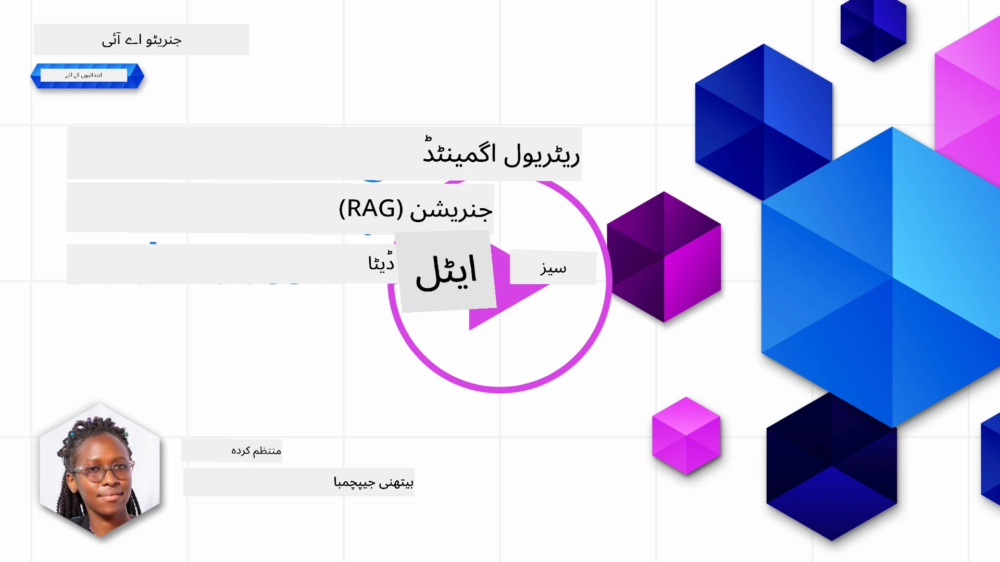
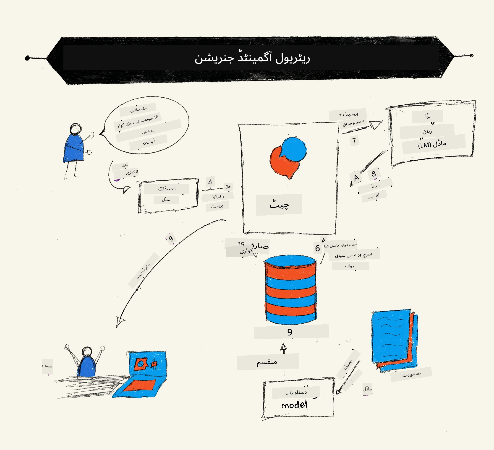
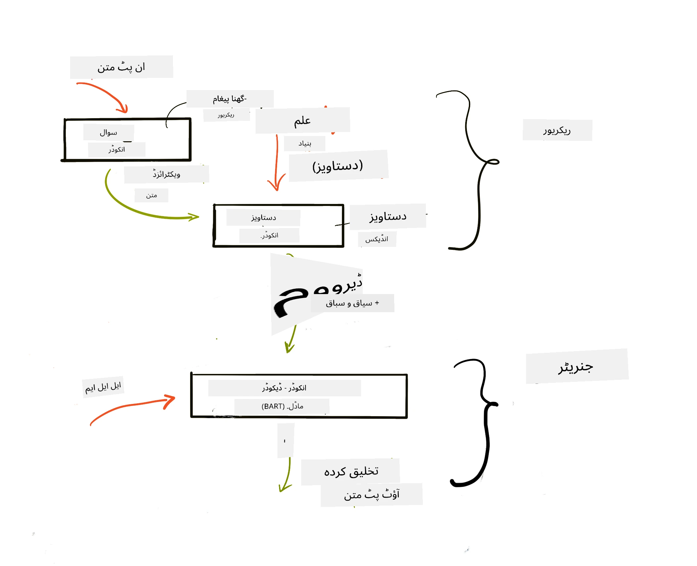
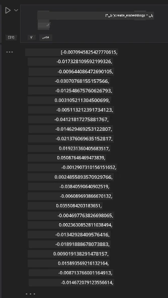

# بازیافت میں اضافہ شدہ تخلیق (RAG) اور ویکٹر ڈیٹا بیسز

[](https://youtu.be/4l8zhHUBeyI?si=BmvDmL1fnHtgQYkL)

تلاش کی ایپلیکیشنز کے سبق میں، ہم نے مختصراً سیکھا کہ آپ اپنے ذاتی ڈیٹا کو بڑے زبان کے ماڈلز (LLMs) میں کیسے ضم کریں۔ اس سبق میں، ہم اپنے LLM ایپلیکیشن میں اپنے ڈیٹا کو گراؤنڈ کرنے کے تصورات، عمل کی میکانکس اور ڈیٹا کو ذخیرہ کرنے کے طریقوں پر مزید گہرائی سے بات کریں گے، جس میں embedding اور متن دونوں شامل ہیں۔

> **ویڈیو جلد آ رہا ہے**

## تعارف

اس سبق میں ہم درج ذیل موضوعات کا احاطہ کریں گے:

- RAG کا تعارف، یہ کیا ہے اور اسے AI (مصنوعی ذہانت) میں کیوں استعمال کیا جاتا ہے۔

- ویکٹر ڈیٹا بیسز کیا ہوتے ہیں کو سمجھنا اور اپنی ایپلیکیشن کے لیے ایک بنانا۔

- RAG کو ایک ایپلیکیشن میں ضم کرنے پر ایک عملی مثال۔

## سیکھنے کے مقاصد

اس سبق کو مکمل کرنے کے بعد، آپ کر سکیں گے:

- ڈیٹا بازیافت اور پروسیسنگ میں RAG کی اہمیت کی وضاحت کرنا۔

- RAG ایپلیکیشن کو سیٹ اپ کرنا اور اپنے ڈیٹا کو LLM سے گراؤنڈ کرنا۔

- LLM ایپلیکیشنز میں RAG اور ویکٹر ڈیٹا بیسز کا مؤثر انضمام۔

## ہمارا منظر نامہ: اپنے ذاتی ڈیٹا کے ذریعے اپنے LLMs کو بہتر بنانا

اس سبق کے لیے، ہم اپنی تعلیماتی اسٹارٹ اپ میں اپنے نوٹس شامل کرنا چاہتے ہیں، جو چیٹ بوٹ کو مختلف مضامین پر مزید معلومات حاصل کرنے کی اجازت دیتا ہے۔ اپنے پاس جو نوٹس ہیں، انہیں استعمال کرتے ہوئے، سیکھنے والے بہتر مطالعہ کر سکیں گے اور مختلف موضوعات کو سمجھ سکیں گے، جس سے امتحانات کی تیاری آسان ہو جائے گی۔ ہمارا منظر نامہ بنانے کے لیے، ہم درج ذیل استعمال کریں گے:

- `Azure OpenAI:` وہ LLM جو ہم اپنا چیٹ بوٹ بنانے کے لیے استعمال کریں گے۔

- `AI for beginners' lesson on Neural Networks:` یہ وہ ڈیٹا ہوگا جس پر ہمارے LLM کو گراؤنڈ کیا جائے گا۔

- `Azure AI Search` اور `Azure Cosmos DB:` ویکٹر ڈیٹا بیس جو ہمارے ڈیٹا کو ذخیرہ کرنے اور سرچ انڈیکس بنانے کے لیے۔

صارفین اپنے نوٹس سے پریکٹس کوئزز بنا سکیں گے، جائزے کے فلیش کارڈز اور مختصر خلاصے بنا سکیں گے۔ شروع کرنے کے لیے، آئیے دیکھتے ہیں کہ RAG کیا ہے اور کیسے کام کرتا ہے۔

## بازیافت میں اضافہ شدہ تخلیق (RAG)

ایک LLM سے چلنے والا چیٹ بوٹ صارف کے پرامپٹس کو پروسیس کرتا ہے تاکہ جوابات پیدا کرے۔ اسے انٹرایکٹو اور مختلف موضوعات پر صارفین کے ساتھ بات چیت کرنے کے لیے ڈیزائن کیا گیا ہے۔ تاہم، اس کے جوابات فراہم کردہ سیاق و سباق اور اس کے بنیادی تربیتی ڈیٹا تک محدود ہوتے ہیں۔ مثال کے طور پر، GPT-4 کا علم ستمبر 2021 تک کا ہے، یعنی اسے اس وقت کے بعد ہونے والے واقعات کا علم نہیں ہے۔ اس کے علاوہ، LLMs کی تربیت کے لیے استعمال شدہ ڈیٹا میں خفیہ معلومات شامل نہیں ہوتی جیسے ذاتی نوٹس یا کمپنی کے پروڈکٹ مینول۔

### RAG کیسے کام کرتے ہیں (بازیافت میں اضافہ شدہ تخلیق)



فرض کریں آپ ایک ایسا چیٹ بوٹ ڈپلائے کرنا چاہتے ہیں جو آپ کے نوٹس سے کوئزز بنائے، تو اس کے لیے آپ کو علم کے ذخیرے سے کنکشن درکار ہوگا۔ یہی جگہ ہے جہاں RAG مدد کرتا ہے۔ RAGs اس طرح کام کرتے ہیں:

- **علمی ذخیرہ:** بازیافت سے پہلے، ان دستاویزات کو انٹیک اور پری پراسیس کرنا ہوتا ہے، عام طور پر بڑے دستاویزات کو چھوٹے حصوں میں تقسیم کرنا، انہیں متن کے embeddings میں تبدیل کرنا اور ڈیٹا بیس میں اسٹور کرنا۔

- **صارف کی استفسار:** صارف سوال پوچھتا ہے۔

- **بازیافت:** جب صارف سوال پوچھتا ہے، embedding ماڈل ہماری علمی ذخیرہ سے متعلقہ معلومات بازیافت کرتا ہے تاکہ مزید سیاق و سباق فراہم کیا جا سکے جو پرامپٹ میں شامل کیا جائے گا۔

- **زیادہ شدہ تخلیق:** LLM اپنے جواب کو بازیافت شدہ ڈیٹا کی بنیاد پر بہتر بناتا ہے۔ یہ جواب کو صرف پری ٹرینڈ ڈیٹا پر مبنی نہیں بلکہ شامل کردہ سیاق و سباق کی متعلقہ معلومات پر مبنی بناتا ہے۔ بازیافت شدہ ڈیٹا LLM کے جوابات کو بہتر بنانے کے لیے استعمال ہوتا ہے۔ پھر LLM صارف کے سوال کا جواب دیتا ہے۔



RAGs کے فن تعمیر کو ٹرانسفارمرز کے ذریعے نافذ کیا جاتا ہے جو دو حصوں پر مشتمل ہوتا ہے: ایک انکوڈر اور دوسرا ڈیکوڈر۔ مثال کے طور پر، جب صارف سوال کرتا ہے، ان پٹ ٹیکسٹ کو 'انکوڈ' کیا جاتا ہے جو الفاظ کے معنی کو پکڑتا ہے اور ویکٹرز کو 'ڈیکوڈ' کیا جاتا ہے تاکہ ہمارے دستاویز انڈیکس میں جائے اور صارف کے سوال کی بنیاد پر نیا متن تیار کرے۔ LLM آؤٹ پٹ پیدا کرنے کے لیے انکوڈر-ڈیکوڈر ماڈل دونوں استعمال کرتا ہے۔

RAG کو نافذ کرنے کے لیے دو طریقے، جیسا کہ تجویز کردہ مقالے میں بتایا گیا ہے: [Retrieval-Augmented Generation for Knowledge intensive NLP Tasks](https://arxiv.org/pdf/2005.11401.pdf?WT.mc_id=academic-105485-koreyst)، یہ ہیں:

- **_RAG-Sequence_** بازیافت شدہ دستاویزات کو صارف کے سوال کا بہترین ممکن جواب پیش کرنے کے لیے استعمال کرنا۔

- **RAG-Token** دستاویزات کو اگلے ٹوکن پیدا کرنے کے لیے استعمال کرنا، پھر انہیں صارف کے سوال کا جواب دینے کے لیے بازیافت کرنا۔

### آپ RAG کیوں استعمال کریں؟ 

- **معلومات کی بھرپائی:** یقینی بناتا ہے کہ متنی جوابات تازہ ترین اور موجودہ ہوں۔ اس لیے مخصوص موضوعات پر کارکردگی میں بہتری آتی ہے کیونکہ اندرونی علمی ذخیرہ تک رسائی ہوتی ہے۔

- **تخلیق سے بچاؤ:** علمی ذخیرہ میں قابل تصدیق ڈیٹا استعمال کر کے صارف کے سوالات کو سیاق و سباق فراہم کرتا ہے۔

- یہ **کم لاگت** ہے کیونکہ یہ ایک LLM کو فائن ٹیون کرنے کے مقابلے میں زیادہ اقتصادی ہے۔

## علمی ذخیرہ بنانا

ہماری ایپلیکیشن ہمارے ذاتی ڈیٹا پر مبنی ہے، یعنی AI for Beginners نصاب پر نیورل نیٹ ورک سبق۔

### ویکٹر ڈیٹا بیسز

ایک ویکٹر ڈیٹا بیس، روایتی ڈیٹا بیسز کے برعکس، ایک خاص ڈیٹا بیس ہے جو embedded vectors کو ذخیرہ، منظم اور تلاش کرنے کے لیے ڈیزائن کیا گیا ہے۔ یہ دستاویزات کی عددی نمائندگی ذخیرہ کرتا ہے۔ ڈیٹا کو عددی embeddings میں توڑنا ہمارے AI سسٹم کے لیے ڈیٹا کو سمجھنا اور پروسیس کرنا آسان بناتا ہے۔

ہم اپنے embeddings کو ویکٹر ڈیٹا بیسز میں ذخیرہ کرتے ہیں کیونکہ LLMs ایک مخصوص تعداد میں ٹوکن کی حد رکھتے ہیں جو وہ ان پٹ کے طور پر قبول کرتے ہیں۔ چونکہ آپ پوری embedding ایک LLM کو نہیں دے سکتے، اس لیے ہمیں انہیں ٹکڑوں میں توڑنا پڑتا ہے اور جب صارف سوال کرتا ہے، تو وہ embeddings جو سوال کے سب سے زیادہ قریب ہوں واپس کی جاتی ہیں، ساتھ میں پرامپٹ کے۔ chunking لاگت کو بھی کم کرتا ہے کیونکہ کم ٹوکن LLM میں جا رہے ہوتے ہیں۔

کچھ مشہور ویکٹر ڈیٹا بیسز میں Azure Cosmos DB، Clarifyai، Pinecone، Chromadb، ScaNN، Qdrant اور DeepLake شامل ہیں۔ آپ Azure CLI کا استعمال کرتے ہوئے Azure Cosmos DB ماڈل تخلیق کر سکتے ہیں:

```bash
az login
az group create -n <resource-group-name> -l <location>
az cosmosdb create -n <cosmos-db-name> -r <resource-group-name>
az cosmosdb list-keys -n <cosmos-db-name> -g <resource-group-name>
```

### متن سے embeddings تک

ہم اپنے ڈیٹا کو ذخیرہ کرنے سے پہلے، اسے ویکٹر embeddings میں تبدیل کرنا ہوگا۔ اگر آپ بڑے دستاویزات یا طویل متن پر کام کر رہے ہیں، تو آپ انہیں متوقع سوالات کی بنیاد پر چنکس میں تقسیم کر سکتے ہیں۔ چنکس بنانا جملہ یا پیراگراف کی سطح پر کیا جا سکتا ہے۔ چونکہ چنکس اپنے لفظوں کے ارد گرد کے سیاق و سباق سے معنی لیتے ہیں، آپ چنک میں کچھ اضافی سیاق شامل کر سکتے ہیں، مثال کے طور پر، دستاویز کا عنوان یا چنک سے پہلے یا بعد کچھ متن شامل کرنا۔ آپ ڈیٹا کو اس طرح چنک کر سکتے ہیں:

```python
def split_text(text, max_length, min_length):
    words = text.split()
    chunks = []
    current_chunk = []

    for word in words:
        current_chunk.append(word)
        if len(' '.join(current_chunk)) < max_length and len(' '.join(current_chunk)) > min_length:
            chunks.append(' '.join(current_chunk))
            current_chunk = []

    # اگر آخری حصہ کم از کم لمبائی تک نہ پہنچا ہو تو بھی اسے شامل کریں
    if current_chunk:
        chunks.append(' '.join(current_chunk))

    return chunks
```

چنکس بنانے کے بعد، ہم اپنے متن کو مختلف embedding ماڈلز کے ذریعے embed کر سکتے ہیں۔ آپ استعمال کر سکتے ہیں: word2vec، OpenAI کا ada-002، Azure Computer Vision اور بہت کچھ۔ ماڈل کے انتخاب کا انحصار زبانوں، انکوڈ کیے جانے والے مواد کی قسم (متن/تصاویر/آڈیو)، ان پٹ کے حجم اور embedding آؤٹ پٹ کی لمبائی پر ہوگا۔

OpenAI کے `text-embedding-ada-002` ماڈل کا استعمال کرتے ہوئے embedded متن کی ایک مثال ہے:


## بازیافت اور ویکٹر تلاش

جب صارف سوال پوچھتا ہے، تو retriever اسے query encoder کے ذریعے ویکٹر میں تبدیل کرتا ہے، پھر وہ ہمارے دستاویز سرچ انڈیکس میں متعلقہ ویکٹرز تلاش کرتا ہے جو ان پٹ سے متعلق ہوں۔ مکمل ہونے کے بعد، یہ دونوں ان پٹ ویکٹر اور دستاویز ویکٹر کو متن میں تبدیل کرتا ہے اور اسے LLM میں پاس کرتا ہے۔

### بازیافت

بازیافت اس وقت ہوتی ہے جب نظام ان دستاویزات کو جلدی تلاش کرتا ہے جو تلاش کے معیار پر پورا اترتی ہوں۔ retriever کا مقصد وہ دستاویزات حاصل کرنا ہے جو سیاق و سباق فراہم کریں اور LLM کو آپ کے ڈیٹا پر گراؤنڈ کریں۔

ہمارے ڈیٹا بیس میں تلاش کرنے کے کئی طریقے ہیں جیسے:

- **کی ورڈ سرچ:** متن کی تلاش کے لیے استعمال ہوتا ہے۔

- **ویکٹر سرچ:** دستاویزات کو embed کرکے ویکٹر نمائندگیوں میں تبدیل کرتا ہے، جس سے الفاظ کے معنی کی بنیاد پر **سیمانیٹک سرچ** ممکن ہوتی ہے۔ بازیافت اس طریقے سے ہوتی ہے کہ صارف کے سوال کے سب سے قریب ویکٹر کی دستاویزات کو تلاش کیا جاتا ہے۔

- **ہائبرڈ:** دونوں کی ورڈ اور ویکٹر سرچ کا امتزاج۔

ایک چیلنج تب آتا ہے جب ڈیٹا بیس میں سوال کا کوئی مماثل جواب نہ ہو، تو نظام بہترین معلومات فراہم کرتا ہے جو مل سکتی ہیں، لیکن آپ ایسے اقدامات کر سکتے ہیں جیسے مطابقت کے لیے زیادہ سے زیادہ فاصلے کا تعین کرنا یا کی ورڈ اور ویکٹر سرچ کو ملانے والا ہائبرڈ سرچ استعمال کرنا۔ اس سبق میں ہم ہائبرڈ سرچ استعمال کریں گے، جو دونوں کا امتزاج ہے۔ ہم اپنے ڈیٹا کو ایک ڈیٹا فریم میں چنکس اور embeddings کے کالمز کے ساتھ اسٹور کریں گے۔

### ویکٹر مماثلت

retriever embeddings تلاش کرے گا جو قریب قریب ہوں، سب سے قریب ہمسایہ، کیونکہ یہ متن کے لحاظ سے ملتے جلتے ہیں۔ جب صارف سوال کرتا ہے، تو یہ پہلے embed ہوتا ہے پھر ملتے جلتے embeddings سے میچ کیا جاتا ہے۔ مختلف ویکٹرز کی مماثلت معلوم کرنے کے لیے عام پیمائش cosine similarity ہے جو دو ویکٹرز کے زاویہ پر مبنی ہے۔

ہم مماثلت ناپنے کے لیے دیگر متبادل استعمال کر سکتے ہیں جیسے Euclidean distance جو ویکٹر کے نقطہ آغاز اور اختتام کے درمیان سیدھی لائن ہے، اور dot product جو دو ویکٹرز کے متعلقہ عناصر کے حاصل ضرب کے مجموعے کو ماپتا ہے۔

### سرچ انڈیکس

بازیافت کرتے وقت، ہمیں سرچ انڈیکس بنانا ہوگا تاکہ ہماری علمی ذخیرہ کی تیز تر تلاش ہو سکے۔ انڈیکس ہمارے embeddings کو ذخیرہ کرے گا اور بڑے ڈیٹا بیس میں بھی سب سے مماثل چنکس تیزی سے بازیافت کر سکے گا۔ ہم مقامی طور پر انڈیکس اس طرح بنا سکتے ہیں:

```python
from sklearn.neighbors import NearestNeighbors

embeddings = flattened_df['embeddings'].to_list()

# سرچ انڈیکس بنائیں
nbrs = NearestNeighbors(n_neighbors=5, algorithm='ball_tree').fit(embeddings)

# انڈیکس کو استفسار کرنے کے لیے، آپ kneighbors طریقہ استعمال کر سکتے ہیں
distances, indices = nbrs.kneighbors(embeddings)
```

### دوبارہ درجہ بندی

جب آپ نے ڈیٹا بیس سے سوال پوچھ لیا، تو آپ کو شاید نتائج کو سب سے زیادہ متعلقہ سے ترتیب دینا پڑے۔ ایک reranking LLM مشین لرننگ استعمال کرتا ہے تاکہ تلاش کے نتائج کی مطابقت کو بہتر بنائے اور انہیں سب سے متعلقہ سے ترتیب دے۔ Azure AI Search استعمال کرتے ہوئے، reranking خود بخود ایک semantic reranker کے ذریعے کی جاتی ہے۔ قریب ترین ہمسایوں کا استعمال کرتے ہوئے reranking کی ایک مثال:

```python
# سب سے مماثل دستاویزات تلاش کریں
distances, indices = nbrs.kneighbors([query_vector])

index = []
# سب سے مماثل دستاویزات پرنٹ کریں
for i in range(3):
    index = indices[0][i]
    for index in indices[0]:
        print(flattened_df['chunks'].iloc[index])
        print(flattened_df['path'].iloc[index])
        print(flattened_df['distances'].iloc[index])
    else:
        print(f"Index {index} not found in DataFrame")
```

## سب کچھ ملا کر

آخری مرحلہ یہ ہے کہ اپنے LLM کو بھی شامل کریں تاکہ ہمیں جوابات مل سکیں جو ہمارے ڈیٹا پر مبنی ہوں۔ ہم اسے یوں نافذ کر سکتے ہیں:

```python
user_input = "what is a perceptron?"

def chatbot(user_input):
    # سوال کو ایک استفساری ویکٹر میں تبدیل کریں
    query_vector = create_embeddings(user_input)

    # سب سے زیادہ مماثل دستاویزات تلاش کریں
    distances, indices = nbrs.kneighbors([query_vector])

    # دستاویزات کو تناظر فراہم کرنے کے لیے استفسار میں شامل کریں
    history = []
    for index in indices[0]:
        history.append(flattened_df['chunks'].iloc[index])

    # تاریخچہ اور صارف کی ان پٹ کو یکجا کریں
    history.append(user_input)

    # ایک پیغام آبجیکٹ بنائیں
    messages=[
        {"role": "system", "content": "You are an AI assistant that helps with AI questions."},
        {"role": "user", "content": "\n\n".join(history) }
    ]

    # جواب پیدا کرنے کے لیے چیٹ تکمیل کا استعمال کریں
    response = openai.chat.completions.create(
        model="gpt-4",
        temperature=0.7,
        max_tokens=800,
        messages=messages
    )

    return response.choices[0].message

chatbot(user_input)
```

## اپنی ایپلیکیشن کا جائزہ لینا

### جائزہ کے میٹرکس

- فراہم کردہ جوابات کا معیار، یہ یقینی بنانا کہ یہ قدرتی، رواں اور انسانی ذہن کی طرح ہو۔

- ڈیٹا کی groundedness: جائزہ لینا کہ آیا جواب فراہم کردہ دستاویزات سے آیا ہے۔

- مطابقت: جائزہ لینا کہ جواب سوال کے مطابق اور متعلقہ ہے یا نہیں۔

- روانی - یہ جانچنا کہ جواب گرائمر کے لحاظ سے درست ہے یا نہیں۔

## RAG (بازیافت میں اضافہ شدہ تخلیق) اور ویکٹر ڈیٹا بیسز کے استعمال کے کیسز

ایسے کئی مختلف کیسز ہیں جہاں فنکشن کالز آپ کی ایپ کو بہتر بنا سکتی ہیں جیسے:

- سوال و جواب: اپنی کمپنی کے ڈیٹا کو چیٹ کے ساتھ گراؤنڈ کرنا جو ملازمین کے سوالات کے لیے استعمال ہو سکتا ہے۔

- سفارشاتی نظام: جہاں آپ ایک ایسا نظام بنا سکتے ہیں جو سب سے ملتے جلتے اقدار مثلاً فلمیں، ریستوران اور بہت کچھ میچ کرے۔

- چیٹ بوٹ سروسز: آپ چیٹ ہسٹری ذخیرہ کر سکتے ہیں اور صارف کے ڈیٹا کی بنیاد پر گفتگو کو شخصی بنا سکتے ہیں۔

- ویکٹر embeddings کی بنیاد پر تصویر کی تلاش، جو تصویر کی شناخت اور anomaly detection میں مفید ہے۔

## خلاصہ

ہم نے RAG کے بنیادی پہلوؤں کا احاطہ کیا، اپنے ڈیٹا کو ایپلیکیشن میں شامل کرنا، صارف کا سوال اور آؤٹ پٹ۔ RAG کی تخلیق کو آسان بنانے کے لیے، آپ Semanti Kernel، Langchain یا Autogen جیسے فریم ورکس استعمال کر سکتے ہیں۔

## اسائنمنٹ

Retrieval Augmented Generation (RAG) کی اپنی تعلیم جاری رکھنے کے لیے آپ بنا سکتے ہیں:

- اپنی مرضی کے فریم ورک کا استعمال کرتے ہوئے ایپلیکیشن کے لیے فرنٹ اینڈ بنائیں۔

- LangChain یا Semantic Kernel میں سے کوئی فریم ورک استعمال کریں اور اپنی ایپ کو دوبارہ بنائیں۔

سبق مکمل کرنے پر مبارکباد 👏۔

## سیکھنا یہاں ختم نہیں ہوتا، سفر جاری رکھیں

اس سبق کو مکمل کرنے کے بعد، ہماری [Generative AI Learning collection](https://aka.ms/genai-collection?WT.mc_id=academic-105485-koreyst) دیکھیں تاکہ آپ اپنی Generative AI کی معلومات کو مزید بڑھا سکیں!

---

<!-- CO-OP TRANSLATOR DISCLAIMER START -->
**دستخطی ذمہ داری سے معافی**:  
یہ دستاویز AI ترجمہ سروس [Co-op Translator](https://github.com/Azure/co-op-translator) کے ذریعے ترجمہ کی گئی ہے۔ اگرچہ ہم درستگی کے لیے کوشاں ہیں، براہ کرم اس بات سے آگاہ رہیں کہ خودکار ترجمے میں غلطیاں یا ناواقفیاں ہو سکتی ہیں۔ اصل دستاویز اپنی مادری زبان میں معتبر ماخذ سمجھی جانی چاہیے۔ اہم معلومات کے لیے، پیشہ ور انسانی ترجمے کی سفارش کی جاتی ہے۔ ہم اس ترجمے کے استعمال سے پیدا ہونے والے کسی بھی غلط فہمی یا غلط تشریحات کے ذمہ دار نہیں ہیں۔
<!-- CO-OP TRANSLATOR DISCLAIMER END -->