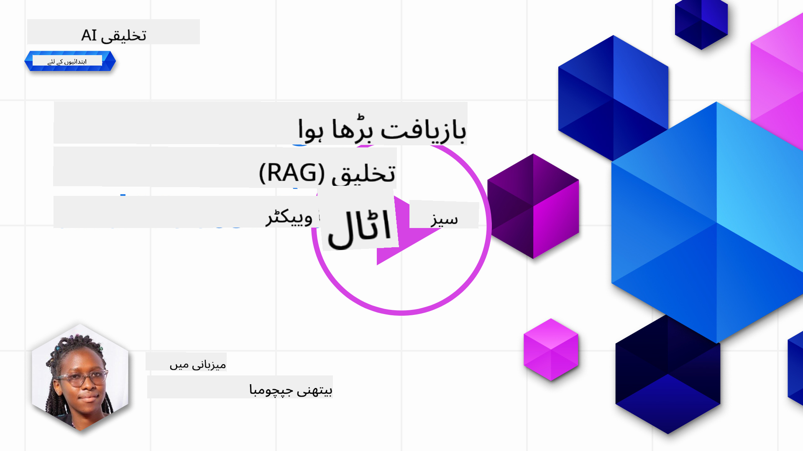
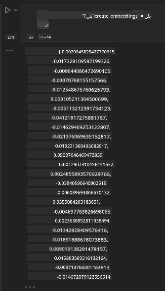

<!--
CO_OP_TRANSLATOR_METADATA:
{
  "original_hash": "b4b0266fbadbba7ded891b6485adc66d",
  "translation_date": "2025-10-17T13:02:26+00:00",
  "source_file": "15-rag-and-vector-databases/README.md",
  "language_code": "ur"
}
-->
# بازیافت شدہ اضافہ شدہ جنریشن (RAG) اور ویکٹر ڈیٹا بیس

[](https://youtu.be/4l8zhHUBeyI?si=BmvDmL1fnHtgQYkL)

تلاش ایپلیکیشنز کے سبق میں، ہم نے مختصراً سیکھا کہ کس طرح اپنے ڈیٹا کو بڑے زبان ماڈلز (LLMs) میں شامل کیا جا سکتا ہے۔ اس سبق میں، ہم آپ کے LLM ایپلیکیشن میں اپنے ڈیٹا کو بنیاد بنانے کے تصورات، اس عمل کی میکینکس اور ڈیٹا کو ذخیرہ کرنے کے طریقوں، بشمول ایمبیڈنگز اور متن، پر مزید غور کریں گے۔

> **ویڈیو جلد آ رہی ہے**

## تعارف

اس سبق میں ہم درج ذیل موضوعات کا احاطہ کریں گے:

- RAG کا تعارف، یہ کیا ہے اور AI (مصنوعی ذہانت) میں کیوں استعمال ہوتا ہے۔

- ویکٹر ڈیٹا بیس کو سمجھنا اور اپنی ایپلیکیشن کے لیے ایک بنانا۔

- ایک عملی مثال کہ کس طرح RAG کو ایپلیکیشن میں شامل کیا جا سکتا ہے۔

## سیکھنے کے اہداف

اس سبق کو مکمل کرنے کے بعد، آپ قابل ہوں گے:

- ڈیٹا بازیافت اور پروسیسنگ میں RAG کی اہمیت کو بیان کریں۔

- RAG ایپلیکیشن سیٹ اپ کریں اور اپنے ڈیٹا کو LLM پر بنیاد بنائیں۔

- LLM ایپلیکیشنز میں RAG اور ویکٹر ڈیٹا بیس کو مؤثر طریقے سے شامل کریں۔

## ہمارا منظرنامہ: اپنے ڈیٹا کے ساتھ LLMs کو بہتر بنانا

اس سبق کے لیے، ہم اپنی نوٹس کو تعلیمی اسٹارٹ اپ میں شامل کرنا چاہتے ہیں، جو چیٹ بوٹ کو مختلف موضوعات پر مزید معلومات حاصل کرنے کی اجازت دیتا ہے۔ ہمارے نوٹس کا استعمال کرتے ہوئے، سیکھنے والے بہتر مطالعہ کر سکیں گے اور مختلف موضوعات کو سمجھ سکیں گے، جس سے ان کے امتحانات کی تیاری آسان ہو جائے گی۔ ہمارا منظرنامہ بنانے کے لیے، ہم استعمال کریں گے:

- `Azure OpenAI:` وہ LLM جو ہم اپنے چیٹ بوٹ بنانے کے لیے استعمال کریں گے۔

- `AI for beginners' lesson on Neural Networks:` یہ وہ ڈیٹا ہوگا جس پر ہم اپنے LLM کو بنیاد بنائیں گے۔

- `Azure AI Search` اور `Azure Cosmos DB:` ویکٹر ڈیٹا بیس ہمارے ڈیٹا کو ذخیرہ کرنے اور تلاش انڈیکس بنانے کے لیے۔

صارفین اپنے نوٹس سے پریکٹس کوئزز، ریویژن فلیش کارڈز بنا سکیں گے اور اسے مختصر خلاصوں میں تبدیل کر سکیں گے۔ شروع کرنے کے لیے، آئیے دیکھتے ہیں کہ RAG کیا ہے اور یہ کیسے کام کرتا ہے:

## بازیافت شدہ اضافہ شدہ جنریشن (RAG)

ایک LLM پر مبنی چیٹ بوٹ صارف کے پرامپٹس کو پروسیس کرتا ہے تاکہ جوابات تیار کیے جا سکیں۔ یہ انٹرایکٹو ہونے کے لیے ڈیزائن کیا گیا ہے اور صارفین کے ساتھ مختلف موضوعات پر بات چیت کرتا ہے۔ تاہم، اس کے جوابات فراہم کردہ سیاق و سباق اور اس کے بنیادی تربیتی ڈیٹا تک محدود ہیں۔ مثال کے طور پر، GPT-4 کا علم ستمبر 2021 تک محدود ہے، یعنی یہ اس مدت کے بعد ہونے والے واقعات کے بارے میں معلومات نہیں رکھتا۔ اس کے علاوہ، LLMs کو تربیت دینے کے لیے استعمال ہونے والے ڈیٹا میں ذاتی نوٹس یا کسی کمپنی کے پروڈکٹ مینوئل جیسے خفیہ معلومات شامل نہیں ہوتی۔

### RAGs (بازیافت شدہ اضافہ شدہ جنریشن) کیسے کام کرتے ہیں


فرض کریں کہ آپ ایک چیٹ بوٹ تعینات کرنا چاہتے ہیں جو آپ کے نوٹس سے کوئزز بناتا ہے، آپ کو علم کے ذخیرے سے کنکشن کی ضرورت ہوگی۔ یہیں RAG مدد کرتا ہے۔ RAGs درج ذیل طریقے سے کام کرتے ہیں:

- **علم کا ذخیرہ:** بازیافت سے پہلے، ان دستاویزات کو انٹیک اور پری پروسیس کرنے کی ضرورت ہوتی ہے، عام طور پر بڑی دستاویزات کو چھوٹے حصوں میں تقسیم کرنا، انہیں متن ایمبیڈنگ میں تبدیل کرنا اور انہیں ڈیٹا بیس میں ذخیرہ کرنا۔

- **صارف کی استفسار:** صارف سوال پوچھتا ہے۔

- **بازیافت:** جب صارف سوال پوچھتا ہے، ایمبیڈنگ ماڈل ہمارے علم کے ذخیرے سے متعلقہ معلومات بازیافت کرتا ہے تاکہ مزید سیاق و سباق فراہم کیا جا سکے جو پرامپٹ میں شامل کیا جائے گا۔

- **اضافہ شدہ جنریشن:** LLM اپنے جواب کو بازیافت شدہ ڈیٹا کی بنیاد پر بہتر بناتا ہے۔ یہ جواب کو نہ صرف پہلے سے تربیت یافتہ ڈیٹا بلکہ شامل کردہ سیاق و سباق سے متعلقہ معلومات پر بھی مبنی بناتا ہے۔ بازیافت شدہ ڈیٹا LLM کے جوابات کو بڑھانے کے لیے استعمال کیا جاتا ہے۔ LLM پھر صارف کے سوال کا جواب دیتا ہے۔


RAGs کی آرکیٹیکچر ٹرانسفارمرز کا استعمال کرتے ہوئے نافذ کی جاتی ہے جس میں دو حصے شامل ہوتے ہیں: ایک انکوڈر اور ایک ڈیکوڈر۔ مثال کے طور پر، جب صارف سوال پوچھتا ہے، ان پٹ متن کو 'انکوڈ' کیا جاتا ہے تاکہ الفاظ کے معنی کو پکڑنے والے ویکٹرز میں تبدیل کیا جا سکے اور ویکٹرز کو 'ڈیکوڈ' کیا جاتا ہے تاکہ ہمارے دستاویز انڈیکس میں شامل کیا جا سکے اور صارف کی استفسار کی بنیاد پر نیا متن تیار کیا جا سکے۔ LLM انکوڈر-ڈیکوڈر ماڈل کا استعمال کرتے ہوئے آؤٹ پٹ تیار کرتا ہے۔

دو طریقے جو RAG کو نافذ کرتے وقت استعمال کیے جاتے ہیں، تجویز کردہ مقالے کے مطابق: [Retrieval-Augmented Generation for Knowledge intensive NLP (قدرتی زبان پروسیسنگ سافٹ ویئر) Tasks](https://arxiv.org/pdf/2005.11401.pdf?WT.mc_id=academic-105485-koreyst) ہیں:

- **_RAG-Sequence_** بازیافت شدہ دستاویزات کا استعمال کرتے ہوئے صارف کی استفسار کا بہترین ممکنہ جواب پیش کرنا۔

- **RAG-Token** دستاویزات کا استعمال کرتے ہوئے اگلا ٹوکن تیار کرنا، پھر انہیں صارف کی استفسار کا جواب دینے کے لیے بازیافت کرنا۔

### آپ RAGs کیوں استعمال کریں گے؟ 

- **معلومات کی بھرپوری:** یقینی بناتا ہے کہ متن کے جوابات تازہ ترین اور موجودہ ہیں۔ یہ، لہذا، ڈومین مخصوص کاموں پر کارکردگی کو بہتر بناتا ہے داخلی علم کے ذخیرے تک رسائی حاصل کر کے۔

- **قابل تصدیق ڈیٹا** کا استعمال کرتے ہوئے جعل سازی کو کم کرتا ہے تاکہ صارف کی استفسار کے لیے سیاق و سباق فراہم کیا جا سکے۔

- یہ **معاشی طور پر مؤثر** ہے کیونکہ یہ LLM کو فائن ٹیون کرنے کے مقابلے میں زیادہ اقتصادی ہیں۔

## علم کا ذخیرہ بنانا

ہماری ایپلیکیشن ہمارے ذاتی ڈیٹا یعنی AI For Beginners نصاب کے نیورل نیٹ ورک سبق پر مبنی ہے۔

### ویکٹر ڈیٹا بیس

ایک ویکٹر ڈیٹا بیس، روایتی ڈیٹا بیس کے برعکس، ایک خاص ڈیٹا بیس ہے جو ایمبیڈڈ ویکٹرز کو ذخیرہ کرنے، منظم کرنے اور تلاش کرنے کے لیے ڈیزائن کیا گیا ہے۔ یہ دستاویزات کی عددی نمائندگیوں کو ذخیرہ کرتا ہے۔ ڈیٹا کو عددی ایمبیڈنگز میں تقسیم کرنا ہمارے AI سسٹم کے لیے ڈیٹا کو سمجھنا اور پروسیس کرنا آسان بناتا ہے۔

ہم اپنے ایمبیڈنگز کو ویکٹر ڈیٹا بیس میں ذخیرہ کرتے ہیں کیونکہ LLMs کے پاس ان پٹ کے طور پر قبول کیے جانے والے ٹوکنز کی تعداد کی حد ہوتی ہے۔ چونکہ آپ پورے ایمبیڈنگز کو LLM میں پاس نہیں کر سکتے، ہمیں انہیں حصوں میں تقسیم کرنے کی ضرورت ہوگی اور جب صارف سوال پوچھتا ہے، تو سوال کے سب سے زیادہ مشابہ ایمبیڈنگز پرامپٹ کے ساتھ واپس کی جائیں گی۔ چنکنگ LLM کے ذریعے پاس کیے جانے والے ٹوکنز کی تعداد پر لاگت کو بھی کم کرتی ہے۔

کچھ مشہور ویکٹر ڈیٹا بیس میں Azure Cosmos DB، Clarifyai، Pinecone، Chromadb، ScaNN، Qdrant اور DeepLake شامل ہیں۔ آپ Azure CLI کا استعمال کرتے ہوئے Azure Cosmos DB ماڈل درج ذیل کمانڈ کے ذریعے بنا سکتے ہیں:

```bash
az login
az group create -n <resource-group-name> -l <location>
az cosmosdb create -n <cosmos-db-name> -r <resource-group-name>
az cosmosdb list-keys -n <cosmos-db-name> -g <resource-group-name>
```

### متن سے ایمبیڈنگز تک

ڈیٹا کو ذخیرہ کرنے سے پہلے، ہمیں اسے ویکٹر ایمبیڈنگز میں تبدیل کرنے کی ضرورت ہوگی اس سے پہلے کہ اسے ڈیٹا بیس میں ذخیرہ کیا جائے۔ اگر آپ بڑے دستاویزات یا طویل متن کے ساتھ کام کر رہے ہیں، تو آپ انہیں ان استفسارات کی بنیاد پر چنک کر سکتے ہیں جن کی آپ توقع کرتے ہیں۔ چنکنگ جملے کی سطح پر یا پیراگراف کی سطح پر کی جا سکتی ہے۔ چونکہ چنکنگ الفاظ کے ارد گرد کے معنی اخذ کرتی ہے، آپ چنک میں کچھ اور سیاق و سباق شامل کر سکتے ہیں، مثال کے طور پر، دستاویز کا عنوان شامل کر کے یا چنک سے پہلے یا بعد میں کچھ متن شامل کر کے۔ آپ ڈیٹا کو درج ذیل طریقے سے چنک کر سکتے ہیں:

```python
def split_text(text, max_length, min_length):
    words = text.split()
    chunks = []
    current_chunk = []

    for word in words:
        current_chunk.append(word)
        if len(' '.join(current_chunk)) < max_length and len(' '.join(current_chunk)) > min_length:
            chunks.append(' '.join(current_chunk))
            current_chunk = []

    # If the last chunk didn't reach the minimum length, add it anyway
    if current_chunk:
        chunks.append(' '.join(current_chunk))

    return chunks
```

چنک کرنے کے بعد، ہم اپنے متن کو مختلف ایمبیڈنگ ماڈلز کا استعمال کرتے ہوئے ایمبیڈ کر سکتے ہیں۔ کچھ ماڈلز جنہیں آپ استعمال کر سکتے ہیں ان میں شامل ہیں: word2vec، ada-002 by OpenAI، Azure Computer Vision اور بہت کچھ۔ استعمال کرنے کے لیے ماڈل کا انتخاب آپ کے استعمال کردہ زبانوں، انکوڈ کیے گئے مواد کی قسم (متن/تصاویر/آڈیو)، ان پٹ کے سائز جو یہ انکوڈ کر سکتا ہے اور ایمبیڈنگ آؤٹپٹ کی لمبائی پر منحصر ہوگا۔

OpenAI کے `text-embedding-ada-002` ماڈل کا استعمال کرتے ہوئے ایمبیڈڈ متن کی ایک مثال:


## بازیافت اور ویکٹر تلاش

جب صارف سوال پوچھتا ہے، تو بازیافت کنندہ اسے کوئری انکوڈر کا استعمال کرتے ہوئے ویکٹر میں تبدیل کرتا ہے، پھر ہمارے دستاویز تلاش انڈیکس کے ذریعے ان دستاویزات کے متعلقہ ویکٹرز تلاش کرتا ہے جو ان پٹ سے متعلق ہیں۔ ایک بار مکمل ہونے کے بعد، یہ ان پٹ ویکٹر اور دستاویز ویکٹرز دونوں کو متن میں تبدیل کرتا ہے اور اسے LLM کے ذریعے پاس کرتا ہے۔

### بازیافت

بازیافت اس وقت ہوتی ہے جب نظام انڈیکس سے جلدی سے ان دستاویزات کو تلاش کرنے کی کوشش کرتا ہے جو تلاش کے معیار کو پورا کرتی ہیں۔ بازیافت کنندہ کا مقصد ان دستاویزات کو حاصل کرنا ہے جو سیاق و سباق فراہم کرنے اور آپ کے ڈیٹا پر LLM کو بنیاد بنانے کے لیے استعمال ہوں گی۔

ہمارے ڈیٹا بیس کے اندر تلاش کرنے کے کئی طریقے ہیں جیسے:

- **کلیدی لفظ تلاش** - متن کی تلاش کے لیے استعمال کیا جاتا ہے۔

- **سیمینٹک تلاش** - الفاظ کے سیمینٹک معنی کا استعمال کرتا ہے۔

- **ویکٹر تلاش** - ایمبیڈنگ ماڈلز کا استعمال کرتے ہوئے دستاویزات کو متن سے ویکٹر نمائندگیوں میں تبدیل کرتا ہے۔ بازیافت صارف کے سوال کے قریب ترین ویکٹر نمائندگیوں والے دستاویزات کو کوئری کر کے کی جائے گی۔

- **ہائبرڈ** - کلیدی لفظ اور ویکٹر تلاش دونوں کا مجموعہ۔

بازیافت کے ساتھ ایک چیلنج اس وقت آتا ہے جب ڈیٹا بیس میں کوئری کے لیے کوئی مشابہ جواب نہ ہو، نظام پھر بہترین معلومات واپس کرے گا جو وہ حاصل کر سکتا ہے، تاہم، آپ ایسی حکمت عملی استعمال کر سکتے ہیں جیسے مطابقت کے لیے زیادہ سے زیادہ فاصلے کو سیٹ اپ کرنا یا ہائبرڈ تلاش کا استعمال کرنا جو کلیدی لفظ اور ویکٹر تلاش دونوں کو یکجا کرتا ہے۔ اس سبق میں ہم ہائبرڈ تلاش کا استعمال کریں گے، جو ویکٹر اور کلیدی لفظ تلاش دونوں کا مجموعہ ہے۔ ہم اپنے ڈیٹا کو ایک ڈیٹا فریم میں ذخیرہ کریں گے جس میں چنکس کے ساتھ ساتھ ایمبیڈنگز پر مشتمل کالمز ہوں گے۔

### ویکٹر مماثلت

بازیافت کنندہ علم کے ڈیٹا بیس کے ذریعے ان ایمبیڈنگز کو تلاش کرے گا جو ایک دوسرے کے قریب ہیں، قریب ترین پڑوسی، کیونکہ وہ متن ہیں جو مشابہ ہیں۔ اس منظرنامے میں جب صارف کوئری کرتا ہے، اسے پہلے ایمبیڈ کیا جاتا ہے پھر مشابہ ایمبیڈنگز کے ساتھ ملایا جاتا ہے۔ عام پیمائش جو مختلف ویکٹرز کے مشابہ ہونے کا پتہ لگانے کے لیے استعمال کی جاتی ہے وہ کوسائن مماثلت ہے جو دو ویکٹرز کے درمیان زاویہ پر مبنی ہے۔

ہم مماثلت کی پیمائش کرنے کے لیے دیگر متبادلات استعمال کر سکتے ہیں جیسے یوقلیڈین فاصلہ جو ویکٹر کے اختتامی پوائنٹس کے درمیان سیدھی لائن ہے اور ڈاٹ پروڈکٹ جو دو ویکٹرز کے متعلقہ عناصر کی مصنوعات کے مجموعے کی پیمائش کرتا ہے۔

### تلاش انڈیکس

بازیافت کرتے وقت، ہمیں اپنے علم کے ذخیرے کے لیے ایک تلاش انڈیکس بنانا ہوگا اس سے پہلے کہ ہم تلاش کریں۔ ایک انڈیکس ہمارے ایمبیڈنگز کو ذخیرہ کرے گا اور ایک بڑے ڈیٹا بیس میں بھی سب سے مشابہ چنکس کو جلدی سے بازیافت کر سکے گا۔ ہم اپنے انڈیکس کو مقامی طور پر درج ذیل طریقے سے بنا سکتے ہیں:

```python
from sklearn.neighbors import NearestNeighbors

embeddings = flattened_df['embeddings'].to_list()

# Create the search index
nbrs = NearestNeighbors(n_neighbors=5, algorithm='ball_tree').fit(embeddings)

# To query the index, you can use the kneighbors method
distances, indices = nbrs.kneighbors(embeddings)
```

### دوبارہ درجہ بندی

ایک بار جب آپ نے ڈیٹا بیس کو کوئری کر لیا، تو آپ کو نتائج کو سب سے زیادہ متعلقہ سے ترتیب دینے کی ضرورت پڑ سکتی ہے۔ ایک دوبارہ درجہ بندی کرنے والا LLM مشین لرننگ کا استعمال کرتے ہوئے تلاش کے نتائج کی مطابقت کو بہتر بناتا ہے تاکہ انہیں سب سے زیادہ متعلقہ سے ترتیب دیا جا سکے۔ Azure AI Search کا استعمال کرتے ہوئے، دوبارہ درجہ بندی خود بخود آپ کے لیے کی جاتی ہے ایک سیمینٹک ری رینکر کا استعمال کرتے ہوئے۔ قریب ترین پڑوسیوں کا استعمال کرتے ہوئے دوبارہ درجہ بندی کیسے کام کرتی ہے اس کی ایک مثال:

```python
# Find the most similar documents
distances, indices = nbrs.kneighbors([query_vector])

index = []
# Print the most similar documents
for i in range(3):
    index = indices[0][i]
    for index in indices[0]:
        print(flattened_df['chunks'].iloc[index])
        print(flattened_df['path'].iloc[index])
        print(flattened_df['distances'].iloc[index])
    else:
        print(f"Index {index} not found in DataFrame")
```

## سب کچھ ایک ساتھ لانا

آخری مرحلہ یہ ہے کہ ہمارے ڈیٹا پر بنیاد بنائے گئے جوابات حاصل کرنے کے لیے ہمارے LLM کو شامل کیا جائے۔ ہم اسے درج ذیل طریقے سے نافذ کر سکتے ہیں:

```python
user_input = "what is a perceptron?"

def chatbot(user_input):
    # Convert the question to a query vector
    query_vector = create_embeddings(user_input)

    # Find the most similar documents
    distances, indices = nbrs.kneighbors([query_vector])

    # add documents to query  to provide context
    history = []
    for index in indices[0]:
        history.append(flattened_df['chunks'].iloc[index])

    # combine the history and the user input
    history.append(user_input)

    # create a message object
    messages=[
        {"role": "system", "content": "You are an AI assistant that helps with AI questions."},
        {"role": "user", "content": history[-1]}
    ]

    # use chat completion to generate a response
    response = openai.chat.completions.create(
        model="gpt-4",
        temperature=0.7,
        max_tokens=800,
        messages=messages
    )

    return response.choices[0].message

chatbot(user_input)
```

## ہماری ایپلیکیشن کا جائزہ لینا

### جائزہ میٹرکس

- فراہم کردہ جوابات کا معیار یقینی بنانا کہ وہ قدرتی، روانی اور انسانی جیسے لگیں۔

- ڈیٹا کی بنیاد: جائزہ لینا کہ آیا جواب فراہم کردہ دستاویزات سے آیا ہے۔

- مطابقت: جائزہ لینا کہ جواب سوال سے میل کھاتا ہے اور اس سے متعلق ہے۔

- روانی - آیا جواب گرامر کے لحاظ سے درست ہے۔

## RAG (بازیافت شدہ اضافہ شدہ جنریشن) اور ویکٹر ڈیٹا بیس کے استعمال کے کیسز

بہت سے مختلف استعمال کے کیسز ہیں جہاں فنکشن کالز آپ کی ایپ کو بہتر بنا سکتی ہیں جیسے:

- سوال و جواب: آپ کے کمپنی ڈیٹا کو ایک چیٹ پر بنیاد بنانا جو ملازمین کے ذریعے سوالات پوچھنے کے لیے استعمال کیا جا سکتا ہے۔

- سفارشاتی نظام: جہاں آپ ایک ایسا نظام بنا سکتے ہیں جو سب سے مشابہ اقدار کو میچ کرے جیسے فلمیں، ریستوران اور بہت کچھ۔

- چیٹ بوٹ سروسز: آپ چیٹ کی تاریخ کو ذخیرہ کر سکتے ہیں اور صارف کے ڈیٹا کی بنیاد پر گفتگو کو ذاتی بنا سکتے ہیں۔

- ویکٹر ایمبیڈنگز کی بنیاد پر تصویر کی تلاش، تصویر کی شناخت اور انومالی ڈیٹیکشن کرتے وقت مفید۔

## خلاصہ

ہم نے RAG کے بنیادی پہلوؤں کا احاطہ کیا ہے، اپنے ڈیٹا کو ایپلیکیشن میں شامل کرنے، صارف کی استفسار اور آؤٹپٹ تک۔ RAG کی تخلیق کو آسان بنانے کے لیے، آپ Semanti Kernel، Langchain یا Autogen جیسے فریم ورک استعمال کر سکتے ہیں۔

## اسائنمنٹ

بازیافت شدہ اضافہ شدہ جنریشن (RAG) کی اپنی تعلیم کو جاری رکھنے کے لیے آپ بنا سکتے ہیں:

- اپنی پسند کے فریم ورک کا استعمال کرتے ہوئے ایپلیکیشن کے لیے ایک فرنٹ اینڈ بنائیں۔

- ایک فریم ورک، یا تو LangChain یا Semantic Kernel، کا استعمال کریں اور اپنی ایپلیکیشن کو دوبارہ بنائیں۔

سبق مکمل کرنے پر مبارک ہو 👏۔

## سیکھنا یہاں ختم نہیں ہوتا، سفر جاری رکھیں

اس سبق کو مکمل کرنے کے بعد، ہمارے [Generative AI Learning collection](https://aka.ms/genai-collection?WT.mc_id=academic-105485-koreyst) کو دیکھیں تاکہ اپنی جنریٹو AI کے علم کو مزید بڑھا سکیں!

---

**ڈسکلیمر**:  
یہ دستاویز AI ترجمہ سروس [Co-op Translator](https://github.com/Azure/co-op-translator) کا استعمال کرتے ہوئے ترجمہ کی گئی ہے۔ ہم درستگی کے لیے کوشش کرتے ہیں، لیکن براہ کرم آگاہ رہیں کہ خودکار ترجمے میں غلطیاں یا غیر درستیاں ہو سکتی ہیں۔ اصل دستاویز کو اس کی اصل زبان میں مستند ذریعہ سمجھا جانا چاہیے۔ اہم معلومات کے لیے، پیشہ ور انسانی ترجمہ کی سفارش کی جاتی ہے۔ ہم اس ترجمے کے استعمال سے پیدا ہونے والی کسی بھی غلط فہمی یا غلط تشریح کے ذمہ دار نہیں ہیں۔