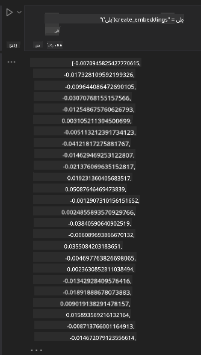

<!--
CO_OP_TRANSLATOR_METADATA:
{
  "original_hash": "e2861bbca91c0567ef32bc77fe054f9e",
  "translation_date": "2025-06-25T22:19:27+00:00",
  "source_file": "15-rag-and-vector-databases/README.md",
  "language_code": "ur"
}
-->
# بازیافت کے ساتھ جنریشن (RAG) اور ویکٹر ڈیٹا بیس

سرچ ایپلیکیشنز کے سبق میں، ہم نے مختصر طور پر سیکھا کہ آپ کس طرح اپنے ڈیٹا کو بڑے زبان کے ماڈلز (LLMs) میں ضم کر سکتے ہیں۔ اس سبق میں، ہم آپ کے LLM ایپلیکیشن میں اپنے ڈیٹا کو بنیاد دینے کے تصورات، عمل کے میکینکس اور ڈیٹا ذخیرہ کرنے کے طریقوں پر مزید غور کریں گے، جن میں ایمبیڈنگز اور متن دونوں شامل ہیں۔

> **ویڈیو جلد آ رہی ہے**

## تعارف

اس سبق میں ہم درج ذیل کو شامل کریں گے:

- RAG کا تعارف، یہ کیا ہے اور مصنوعی ذہانت میں اس کا استعمال کیوں ہوتا ہے۔

- ویکٹر ڈیٹا بیس کیا ہیں اور اپنی ایپلیکیشن کے لیے ایک بنانا۔

- ایک عملی مثال کہ RAG کو ایپلیکیشن میں کیسے ضم کیا جا سکتا ہے۔

## سیکھنے کے مقاصد

اس سبق کو مکمل کرنے کے بعد، آپ قابل ہو جائیں گے:

- ڈیٹا بازیافت اور پروسیسنگ میں RAG کی اہمیت کی وضاحت کریں۔

- RAG ایپلیکیشن سیٹ اپ کریں اور اپنے ڈیٹا کو LLM کے ساتھ جوڑیں

- LLM ایپلیکیشنز میں RAG اور ویکٹر ڈیٹا بیس کا موثر انضمام۔

## ہمارا منظرنامہ: اپنے LLMs کو اپنے ڈیٹا کے ساتھ بڑھانا

اس سبق کے لیے، ہم چاہتے ہیں کہ ہم اپنے نوٹس کو تعلیمی اسٹارٹ اپ میں شامل کریں، جو چیٹ بوٹ کو مختلف موضوعات پر مزید معلومات حاصل کرنے کی اجازت دیتا ہے۔ جو نوٹس ہمارے پاس ہیں، ان کے استعمال سے، سیکھنے والے بہتر مطالعہ کر سکیں گے اور مختلف موضوعات کو سمجھ سکیں گے، جس سے ان کے امتحانات کی تیاری آسان ہو جائے گی۔ ہمارا منظرنامہ بنانے کے لیے، ہم استعمال کریں گے:

- `Azure OpenAI:` LLM جو ہم اپنے چیٹ بوٹ بنانے کے لیے استعمال کریں گے

- `AI for beginners' lesson on Neural Networks`: یہ وہ ڈیٹا ہوگا جس پر ہم اپنے LLM کو بنیاد دیں گے

- `Azure AI Search` اور `Azure Cosmos DB:` ویکٹر ڈیٹا بیس ہمارے ڈیٹا کو ذخیرہ کرنے اور ایک سرچ انڈیکس بنانے کے لیے

صارفین اپنے نوٹس سے عملی کوئزز بنا سکیں گے، جائزہ فلیش کارڈز اور اس کو مختصر جائزوں میں خلاصہ کر سکیں گے۔ شروع کرنے کے لیے، آئیے دیکھتے ہیں کہ RAG کیا ہے اور یہ کیسے کام کرتا ہے:

## بازیافت کے ساتھ جنریشن (RAG)

ایک LLM سے چلنے والا چیٹ بوٹ صارف کے پرامپٹس کو پروسیس کرتا ہے تاکہ جوابات تیار کیے جا سکیں۔ اسے انٹرایکٹو ہونے کے لیے ڈیزائن کیا گیا ہے اور یہ صارفین کے ساتھ مختلف موضوعات پر بات چیت کرتا ہے۔ تاہم، اس کے جوابات فراہم کردہ سیاق و سباق اور اس کے بنیادی تربیتی ڈیٹا تک محدود ہیں۔ مثال کے طور پر، GPT-4 کا علم ستمبر 2021 تک ہے، یعنی، اس کے بعد ہونے والے واقعات کا علم نہیں ہے۔ اس کے علاوہ، LLMs کی تربیت کے لیے استعمال ہونے والا ڈیٹا ذاتی نوٹس یا کسی کمپنی کے پروڈکٹ مینوئل جیسے خفیہ معلومات کو خارج کرتا ہے۔

### RAGs (بازیافت کے ساتھ جنریشن) کیسے کام کرتے ہیں

فرض کریں کہ آپ ایک چیٹ بوٹ تعینات کرنا چاہتے ہیں جو آپ کے نوٹس سے کوئزز بناتا ہے، آپ کو علم کے بیس سے کنکشن کی ضرورت ہوگی۔ یہیں پر RAG مدد کے لیے آتا ہے۔ RAGs اس طرح کام کرتے ہیں:

- **علم کا بیس:** بازیافت سے پہلے، ان دستاویزات کو ہضم اور پہلے سے پروسیس کرنے کی ضرورت ہوتی ہے، عام طور پر بڑی دستاویزات کو چھوٹے ٹکڑوں میں توڑنا، انہیں متن ایمبیڈنگ میں تبدیل کرنا اور انہیں ڈیٹا بیس میں ذخیرہ کرنا۔

- **صارف کا سوال:** صارف سوال پوچھتا ہے

- **بازیافت:** جب صارف سوال پوچھتا ہے، ایمبیڈنگ ماڈل ہمارے علم کے بیس سے متعلقہ معلومات بازیافت کرتا ہے تاکہ مزید سیاق و سباق فراہم کیا جا سکے جو پرامپٹ میں شامل کیا جائے گا۔

- **بڑھا ہوا جنریشن:** LLM اپنے جواب کو بازیافت کردہ ڈیٹا کی بنیاد پر بڑھاتا ہے۔ یہ جواب کو صرف پہلے سے تربیت یافتہ ڈیٹا کی بنیاد پر نہیں بلکہ شامل کردہ سیاق و سباق سے متعلقہ معلومات پر مبنی ہونے کی اجازت دیتا ہے۔ بازیافت کردہ ڈیٹا LLM کے جوابات کو بڑھانے کے لیے استعمال کیا جاتا ہے۔ پھر LLM صارف کے سوال کا جواب دیتا ہے۔

RAGs کے لیے آرکیٹیکچر کو ٹرانسفارمرز کا استعمال کرتے ہوئے نافذ کیا جاتا ہے جس میں دو حصے ہوتے ہیں: ایک اینکوڈر اور ایک ڈیکوڈر۔ مثال کے طور پر، جب کوئی صارف سوال پوچھتا ہے، تو ان پٹ متن کو ویکٹرز میں 'اینکوڈ' کیا جاتا ہے جو الفاظ کے معنی کو پکڑتے ہیں اور ویکٹرز کو ہمارے دستاویز کے انڈیکس میں 'ڈیکوڈ' کیا جاتا ہے اور صارف کے سوال کی بنیاد پر نیا متن تیار کرتے ہیں۔ LLM آؤٹ پٹ تیار کرنے کے لیے اینکوڈر-ڈیکوڈر ماڈل دونوں کا استعمال کرتا ہے۔

RAG کو نافذ کرتے وقت دو طریقے تجویز کردہ پیپر کے مطابق: [علمی گہری NLP (قدرتی زبان پروسیسنگ سافٹ ویئر) کاموں کے لیے بازیافت-بڑھا ہوا جنریشن](https://arxiv.org/pdf/2005.11401.pdf?WT.mc_id=academic-105485-koreyst) ہیں:

- **_RAG-Sequence_** بازیافت کردہ دستاویزات کا استعمال کرتے ہوئے صارف کے سوال کے بہترین ممکنہ جواب کی پیش گوئی کرنا

- **RAG-Token** دستاویزات کا استعمال کرتے ہوئے اگلا ٹوکن تیار کرنا، پھر انہیں صارف کے سوال کا جواب دینے کے لیے بازیافت کرنا

### آپ RAGs کیوں استعمال کریں گے؟

- **معلومات کی بھرپوری:** یقینی بناتا ہے کہ متن کے جوابات تازہ ترین اور موجودہ ہیں۔ لہذا، یہ ڈومین مخصوص کاموں پر کارکردگی کو بڑھاتا ہے اندرونی علم کے بیس تک رسائی حاصل کر کے۔

- **قابل تصدیق ڈیٹا** کا استعمال کر کے صارف کے سوالات کو سیاق و سباق فراہم کر کے جعلسازی کو کم کرتا ہے۔

- یہ **اخراجات کے لحاظ سے مؤثر** ہے کیونکہ وہ ایک LLM کو فائن ٹیوننگ کرنے کے مقابلے میں زیادہ اقتصادی ہیں۔

## علم کا بیس بنانا

ہمارا ایپلیکیشن ہمارے ذاتی ڈیٹا پر مبنی ہے یعنی، AI فار بیگنرز نصاب کے نیورل نیٹ ورک سبق پر۔

### ویکٹر ڈیٹا بیس

ایک ویکٹر ڈیٹا بیس، روایتی ڈیٹا بیس کے برعکس، ایک مخصوص ڈیٹا بیس ہے جو ایمبیڈڈ ویکٹرز کو ذخیرہ کرنے، ان کا انتظام کرنے اور تلاش کرنے کے لیے ڈیزائن کیا گیا ہے۔ یہ دستاویزات کی عددی نمائندگی کو ذخیرہ کرتا ہے۔ ڈیٹا کو عددی ایمبیڈنگ میں توڑنا ہمارے AI سسٹم کے لیے ڈیٹا کو سمجھنا اور پروسیس کرنا آسان بناتا ہے۔

ہم اپنے ایمبیڈنگز کو ویکٹر ڈیٹا بیس میں اس لیے ذخیرہ کرتے ہیں کیونکہ LLMs کی ان پٹ کے طور پر قبول کردہ ٹوکنز کی تعداد کی حد ہوتی ہے۔ جیسا کہ آپ پوری ایمبیڈنگز کو LLM میں پاس نہیں کر سکتے، ہمیں انہیں ٹکڑوں میں توڑنے کی ضرورت ہوگی اور جب صارف سوال پوچھے گا، ایمبیڈنگز جو سوال کے سب سے زیادہ مشابہ ہوں گی وہ پرامپٹ کے ساتھ واپس کر دی جائیں گی۔ چنکنگ LLM کے ذریعے پاس کیے گئے ٹوکنز کی تعداد پر لاگت کو بھی کم کرتی ہے۔

کچھ مشہور ویکٹر ڈیٹا بیس میں Azure Cosmos DB، Clarifyai، Pinecone، Chromadb، ScaNN، Qdrant اور DeepLake شامل ہیں۔ آپ Azure CLI کا استعمال کرتے ہوئے مندرجہ ذیل کمانڈ کے ساتھ Azure Cosmos DB ماڈل بنا سکتے ہیں:

```bash
az login
az group create -n <resource-group-name> -l <location>
az cosmosdb create -n <cosmos-db-name> -r <resource-group-name>
az cosmosdb list-keys -n <cosmos-db-name> -g <resource-group-name>
```

### متن سے ایمبیڈنگز تک

اس سے پہلے کہ ہم اپنا ڈیٹا ذخیرہ کریں، ہمیں اسے ڈیٹا بیس میں ذخیرہ کرنے سے پہلے ویکٹر ایمبیڈنگز میں تبدیل کرنے کی ضرورت ہوگی۔ اگر آپ بڑی دستاویزات یا طویل متون کے ساتھ کام کر رہے ہیں، تو آپ انہیں ان سوالات کی بنیاد پر چنک کر سکتے ہیں جن کی آپ توقع کرتے ہیں۔ چنکنگ جملے کی سطح پر، یا پیراگراف کی سطح پر کی جا سکتی ہے۔ جیسا کہ چنکنگ الفاظ کے ارد گرد کے معانی اخذ کرتی ہے، آپ چنک میں کچھ دوسرے سیاق و سباق کو شامل کر سکتے ہیں، مثال کے طور پر، دستاویز کا عنوان شامل کر کے یا چنک سے پہلے یا بعد میں کچھ متن شامل کر کے۔ آپ ڈیٹا کو اس طرح چنک کر سکتے ہیں:

```python
def split_text(text, max_length, min_length):
    words = text.split()
    chunks = []
    current_chunk = []

    for word in words:
        current_chunk.append(word)
        if len(' '.join(current_chunk)) < max_length and len(' '.join(current_chunk)) > min_length:
            chunks.append(' '.join(current_chunk))
            current_chunk = []

    # If the last chunk didn't reach the minimum length, add it anyway
    if current_chunk:
        chunks.append(' '.join(current_chunk))

    return chunks
```

ایک بار چنکنگ ہو جانے کے بعد، ہم اپنے متن کو مختلف ایمبیڈنگ ماڈلز کا استعمال کرتے ہوئے ایمبیڈ کر سکتے ہیں۔ کچھ ماڈلز جنہیں آپ استعمال کر سکتے ہیں ان میں شامل ہیں: word2vec، ada-002 بائی OpenAI، Azure Computer Vision اور بہت کچھ۔ استعمال کرنے کے لیے ماڈل کا انتخاب اس زبان پر منحصر ہوگا جسے آپ استعمال کر رہے ہیں، انکوڈ شدہ مواد کی قسم (متن/تصاویر/آڈیو)، ان پٹ کا سائز جسے یہ انکوڈ کر سکتا ہے اور ایمبیڈنگ آؤٹ پٹ کی لمبائی۔

OpenAI کے `text-embedding-ada-002` ماڈل کا استعمال کرتے ہوئے ایمبیڈڈ متن کی ایک مثال ہے:


## بازیافت اور ویکٹر تلاش

جب صارف سوال پوچھتا ہے، تو بازیافت کنندہ اسے کوئری اینکوڈر کا استعمال کرتے ہوئے ویکٹر میں تبدیل کرتا ہے، پھر یہ ان پٹ سے متعلقہ دستاویز میں ویکٹرز کے لیے ہمارے دستاویز کے تلاش کے انڈیکس میں تلاش کرتا ہے۔ ایک بار مکمل ہونے کے بعد، یہ ان پٹ ویکٹر اور دستاویز ویکٹرز دونوں کو متن میں تبدیل کرتا ہے اور اسے LLM کے ذریعے پاس کرتا ہے۔

### بازیافت

بازیافت اس وقت ہوتی ہے جب سسٹم انڈیکس سے تیزی سے دستاویزات تلاش کرنے کی کوشش کرتا ہے جو تلاش کے معیار کو پورا کرتی ہیں۔ بازیافت کنندہ کا مقصد دستاویزات حاصل کرنا ہے جو سیاق و سباق فراہم کرنے کے لیے استعمال ہوں گی اور آپ کے ڈیٹا پر LLM کو بنیاد فراہم کریں گی۔

ہمارے ڈیٹا بیس میں تلاش کرنے کے کئی طریقے ہیں جیسے:

- **کلیدی لفظ تلاش** - متن کی تلاش کے لیے استعمال ہوتا ہے

- **سیمینٹک تلاش** - الفاظ کے معنیاتی معنی کا استعمال کرتا ہے

- **ویکٹر تلاش** - دستاویزات کو متن سے ویکٹر نمائندگیوں میں تبدیل کرتا ہے ایمبیڈنگ ماڈلز کا استعمال کرتے ہوئے۔ بازیافت دستاویزات کی کوئری کر کے کی جائے گی جن کی ویکٹر نمائندگیاں صارف کے سوال کے قریب ترین ہیں۔

- **ہائبرڈ** - کلیدی لفظ اور ویکٹر تلاش دونوں کا مجموعہ۔

بازیافت کے ساتھ ایک چیلنج اس وقت آتا ہے جب ڈیٹا بیس میں کوئری کے لیے کوئی اسی طرح کا جواب نہ ہو، سسٹم پھر بہترین معلومات واپس کرے گا جو وہ حاصل کر سکتا ہے، تاہم، آپ ایسی حکمت عملیوں کا استعمال کر سکتے ہیں جیسے مطابقت کے لیے زیادہ سے زیادہ فاصلہ مقرر کرنا یا ہائبرڈ تلاش کا استعمال جو کلیدی الفاظ اور ویکٹر تلاش دونوں کو جوڑتا ہے۔ اس سبق میں ہم ہائبرڈ تلاش کا استعمال کریں گے، جو ویکٹر اور کلیدی لفظ تلاش دونوں کا مجموعہ ہے۔ ہم اپنے ڈیٹا کو ڈیٹا فریم میں ذخیرہ کریں گے جس میں چنک کے ساتھ ساتھ ایمبیڈنگز پر مشتمل کالمز ہوں گے۔

### ویکٹر مماثلت

بازیافت کنندہ علم کے ڈیٹا بیس میں قریب ترین ہمسایہ کے طور پر قریب ترین ایمبیڈنگز کے لیے تلاش کرے گا، کیونکہ وہ ایسے متون ہیں جو ملتے جلتے ہیں۔ اس منظر میں جب صارف سوال پوچھتا ہے، تو پہلے اسے ایمبیڈ کیا جاتا ہے پھر اسی طرح کے ایمبیڈنگز سے میل کھایا جاتا ہے۔ مختلف ویکٹرز کی مماثلت کو تلاش کرنے کے لیے استعمال ہونے والی عام پیمائش کوسائن مماثلت ہے جو دو ویکٹرز کے درمیان زاویہ پر مبنی ہے۔

ہم مماثلت کو دیگر متبادلات کا استعمال کرتے ہوئے ماپ سکتے ہیں جو ہم یورپیائی فاصلہ استعمال کر سکتے ہیں جو ویکٹر کے اختتامی نقطوں کے درمیان سیدھی لکیر ہے اور ڈاٹ پروڈکٹ جو دو ویکٹرز کے مطابق عناصر کی مصنوعات کے مجموعے کی پیمائش کرتا ہے۔

### تلاش کا انڈیکس

جب بازیافت کر رہے ہوں، تو ہمیں تلاش کرنے سے پہلے اپنے علم کے بیس کے لیے تلاش کا انڈیکس بنانا ہوگا۔ ایک انڈیکس ہمارے ایمبیڈنگز کو ذخیرہ کرے گا اور بڑی ڈیٹا بیس میں بھی سب سے زیادہ ملتے جلتے چنکس کو جلدی بازیافت کر سکے گا۔ ہم مقامی طور پر اپنا انڈیکس بنا سکتے ہیں:

```python
from sklearn.neighbors import NearestNeighbors

embeddings = flattened_df['embeddings'].to_list()

# Create the search index
nbrs = NearestNeighbors(n_neighbors=5, algorithm='ball_tree').fit(embeddings)

# To query the index, you can use the kneighbors method
distances, indices = nbrs.kneighbors(embeddings)
```

### دوبارہ درجہ بندی

ایک بار جب آپ نے ڈیٹا بیس کی کوئری کر لی، تو آپ کو نتائج کو سب سے زیادہ متعلقہ سے ترتیب دینے کی ضرورت ہو سکتی ہے۔ دوبارہ درجہ بندی کرنے والا LLM مشین لرننگ کا استعمال کرتا ہے تاکہ تلاش کے نتائج کی مطابقت کو بہتر بنایا جا سکے انہیں سب سے زیادہ متعلقہ سے ترتیب دے کر۔ Azure AI Search کا استعمال کرتے ہوئے، دوبارہ درجہ بندی خود بخود آپ کے لیے کی جاتی ہے ایک معنیاتی دوبارہ درجہ بندی کرنے والے کا استعمال کرتے ہوئے۔ قریب ترین ہمسایوں کا استعمال کرتے ہوئے دوبارہ درجہ بندی کے کام کرنے کی ایک مثال:

```python
# Find the most similar documents
distances, indices = nbrs.kneighbors([query_vector])

index = []
# Print the most similar documents
for i in range(3):
    index = indices[0][i]
    for index in indices[0]:
        print(flattened_df['chunks'].iloc[index])
        print(flattened_df['path'].iloc[index])
        print(flattened_df['distances'].iloc[index])
    else:
        print(f"Index {index} not found in DataFrame")
```

## سب کچھ اکٹھا کرنا

آخری مرحلہ یہ ہے کہ ہمارے LLM کو شامل کیا جائے تاکہ ہم جوابات حاصل کر سکیں جو ہمارے ڈیٹا پر مبنی ہوں۔ ہم اسے اس طرح نافذ کر سکتے ہیں:

```python
user_input = "what is a perceptron?"

def chatbot(user_input):
    # Convert the question to a query vector
    query_vector = create_embeddings(user_input)

    # Find the most similar documents
    distances, indices = nbrs.kneighbors([query_vector])

    # add documents to query  to provide context
    history = []
    for index in indices[0]:
        history.append(flattened_df['chunks'].iloc[index])

    # combine the history and the user input
    history.append(user_input)

    # create a message object
    messages=[
        {"role": "system", "content": "You are an AI assistant that helps with AI questions."},
        {"role": "user", "content": history[-1]}
    ]

    # use chat completion to generate a response
    response = openai.chat.completions.create(
        model="gpt-4",
        temperature=0.7,
        max_tokens=800,
        messages=messages
    )

    return response.choices[0].message

chatbot(user_input)
```

## ہماری ایپلیکیشن کا جائزہ لینا

### تشخیصی میٹرکس

- فراہم کردہ جوابات کا معیار یہ یقینی بنانا کہ یہ قدرتی، رواں اور انسانی جیسا لگتا ہے

- ڈیٹا کی بنیاد: اس بات کا جائزہ لینا کہ آیا جواب فراہم کردہ دستاویزات سے آیا ہے

- مطابقت: اس بات کا جائزہ لینا کہ جواب سوال سے میل کھاتا ہے اور اس سے متعلق ہے

- روانی - چاہے جواب گرائمر کے لحاظ سے معنی خیز ہو

## RAG (بازیافت کے ساتھ جنریشن) اور ویکٹر ڈیٹا بیس کے استعمال کے کیسز

بہت سے مختلف استعمال کے کیسز ہیں جہاں فنکشن کالز آپ کی ایپ کو بہتر بنا سکتی ہیں جیسے:

- سوال و جواب: اپنی کمپنی کے ڈیٹا کو ایک چیٹ سے بنیاد دینا جسے ملازمین سوالات پوچھنے کے لیے استعمال کر سکتے ہیں۔

- سفارشاتی نظام: جہاں آپ ایک ایسا نظام بنا سکتے ہیں جو سب سے زیادہ ملتے جلتے اقدار کو ملاتا ہے مثلاً فلمیں، ریستوران اور بہت کچھ۔

- چیٹ بوٹ سروسز: آپ چیٹ کی تاریخ کو ذخیرہ کر سکتے ہیں اور صارف کے ڈیٹا کی بنیاد پر بات چیت کو ذاتی بنا سکتے ہیں۔

- ویکٹر ایمبیڈنگز کی بنیاد پر امیج سرچ، جب امیج کی شناخت اور انوملی ڈیٹیکشن کر رہے ہوں تو مفید۔

## خلاصہ

ہم نے RAG کے بنیادی علاقوں کا احاطہ کیا ہے جیسے کہ اپنے ڈیٹا کو ایپلیکیشن میں شامل کرنا، صارف کا سوال اور آؤٹ پٹ۔ RAG کی تخلیق کو آسان بنانے کے لیے، آپ Semanti Kernel، Langchain یا Autogen جیسے فریم ورک استعمال کر سکتے ہیں۔

## اسائنمنٹ

بازیافت کے ساتھ جنریشن (RAG) کی اپنی تعلیم کو جاری رکھنے کے لیے آپ بنا سکتے ہیں:

- اپنے منتخب کردہ فریم ورک کا استعمال کرتے ہوئے ایپلیکیشن کے لیے ایک فرنٹ اینڈ بنائیں

- ایک فریم ورک کا استعمال کریں، یا تو LangChain یا Semantic Kernel، اور اپنی ایپلیکیشن کو دوبارہ بنائیں۔

سبق مکمل کرنے پر مبارک ہو 👏۔

## سیکھنا یہاں ختم نہیں ہوتا، سفر جاری رکھیں

اس سبق کو مکمل کرنے کے بعد، ہمارے [جنریٹیو AI لرننگ کلیکشن](https://aka.ms/genai-collection?WT.mc_id=academic-105485-koreyst) کو دیکھیں تاکہ اپنی جنریٹیو AI کی معلومات کو مزید بڑھائیں!

**ڈس کلیمر**:
یہ دستاویز AI ترجمہ سروس [Co-op Translator](https://github.com/Azure/co-op-translator) کا استعمال کرتے ہوئے ترجمہ کی گئی ہے۔ ہم درستگی کی کوشش کرتے ہیں، لیکن براہ کرم آگاہ رہیں کہ خودکار ترجمے میں غلطیاں یا نقائص ہو سکتے ہیں۔ اصل دستاویز کو اس کی مقامی زبان میں مستند ذریعہ سمجھا جانا چاہیے۔ اہم معلومات کے لئے، پیشہ ورانہ انسانی ترجمہ کی سفارش کی جاتی ہے۔ ہم اس ترجمے کے استعمال سے پیدا ہونے والی کسی بھی غلط فہمی یا غلط تشریح کے ذمہ دار نہیں ہیں۔