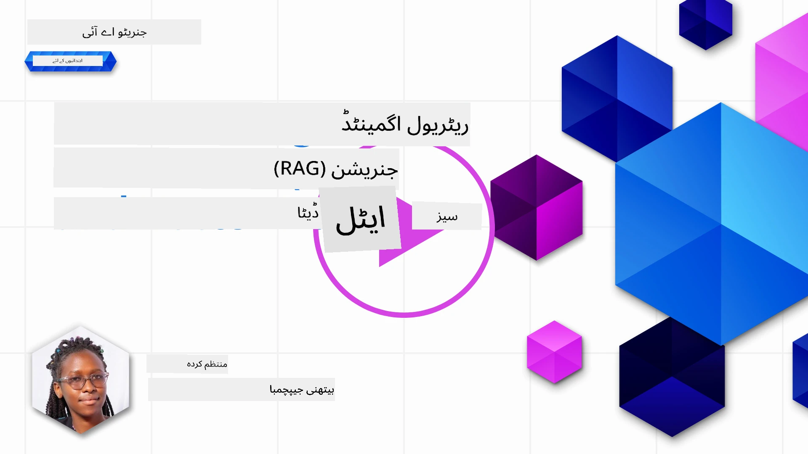
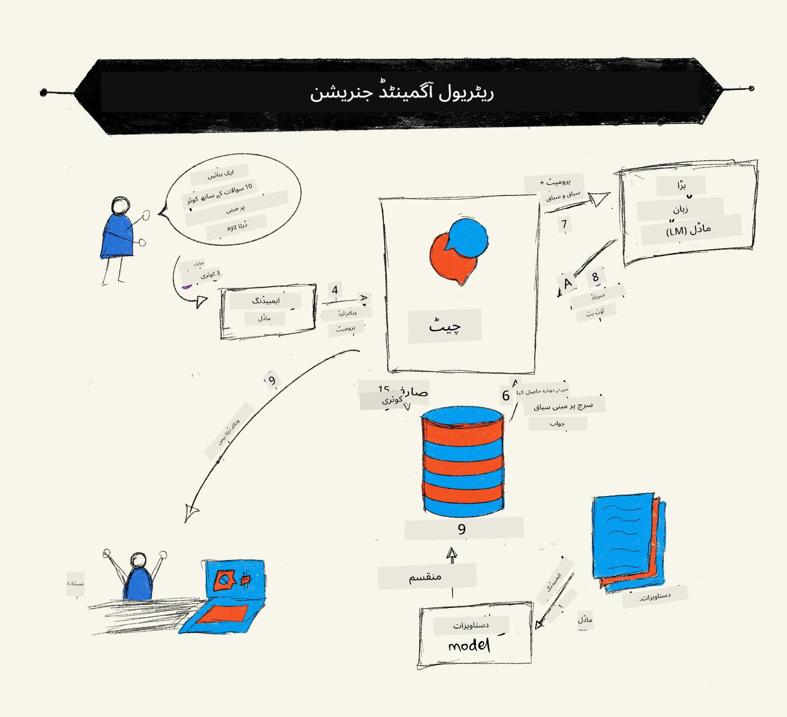
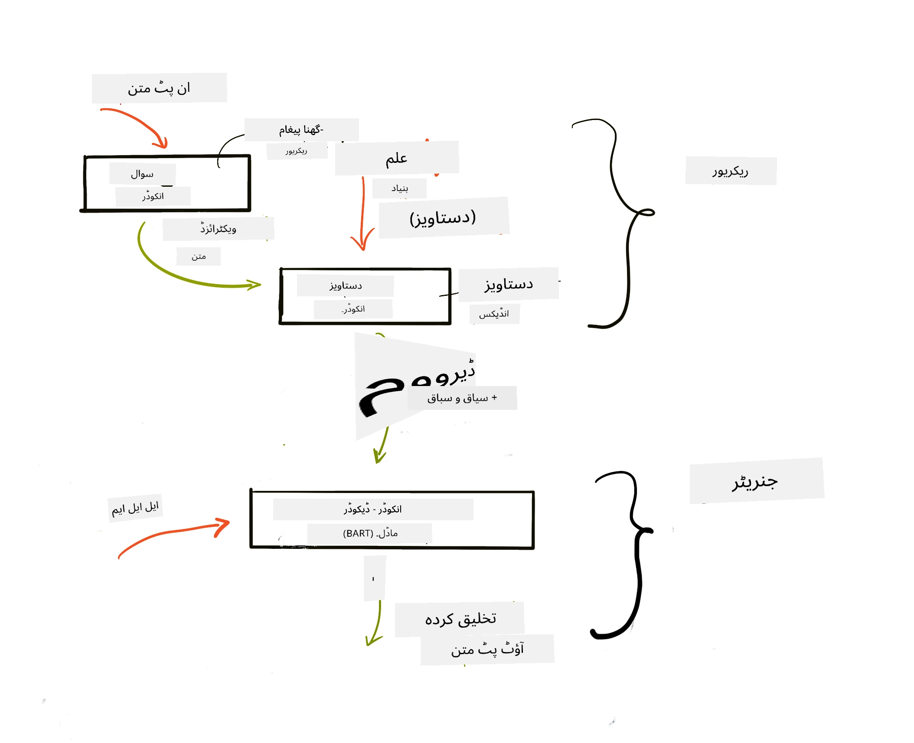
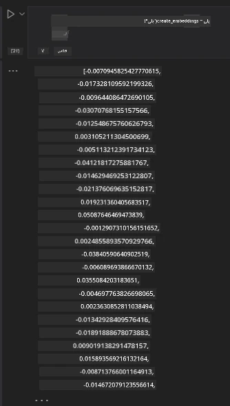

# بازیافت سے تقویت یافتہ تخلیق (RAG) اور ویکٹر ڈیٹا بیسز

[](https://youtu.be/4l8zhHUBeyI?si=BmvDmL1fnHtgQYkL)

تلاش کی ایپلیکیشنز کے سبق میں، ہم نے مختصر طور پر سیکھا کہ اپنی ذاتی معلومات کو بڑے لینگویج ماڈلز (LLMs) میں کیسے شامل کیا جائے۔ اس سبق میں، ہم ڈیٹا کے اپنی LLM ایپلیکیشن میں گراؤنڈنگ کے تصورات، اس عمل کے طریقہ کار اور ڈیٹا ذخیرہ کرنے کے طریقوں پر مزید تفصیل سے بات کریں گے، جس میں ایمبیڈنگز اور متن دونوں شامل ہیں۔

> **ویڈیو جلد آ رہی ہے**

## تعارف

اس سبق میں ہم درج ذیل موضوعات پر بات کریں گے:

- RAG کا تعارف، یہ کیا ہے اور مصنوعی ذہانت (AI) میں اس کے استعمال کی وجوہات۔

- ویکٹر ڈیٹا بیسز کیا ہیں اور اپنی ایپلیکیشن کے لیے ایک کیسے بنائیں۔

- RAG کو ایک ایپلیکیشن میں شامل کرنے کی عملی مثال۔

## تعلیمی مقاصد

اس سبق کے مکمل ہونے کے بعد، آپ قادر ہوں گے:

- RAG کی ڈیٹا بازیافت اور پراسیسنگ میں اہمیت کی وضاحت کرنے کے قابل ہوں۔

- RAG ایپلیکیشن سیٹ اپ کریں اور اپنے ڈیٹا کو LLM کے ساتھ جوڑیں۔

- LLM ایپلیکیشنز میں RAG اور ویکٹر ڈیٹا بیسز کا مؤثر انضمام۔

## ہمارا منظرنامہ: اپنے LLMs کو اپنی معلومات سے بہتر بنانا

اس سبق کے لیے، ہم چاہتے ہیں کہ تعلیمی اسٹارٹ اپ میں ہماری اپنی نوٹس شامل کی جائیں، جس سے چیٹ بوٹ کو مختلف موضوعات پر مزید معلومات حاصل ہو سکیں۔ ہمارے پاس جو نوٹس ہیں، ان کی مدد سے طلباء بہتر مطالعہ کر سکیں گے اور مختلف موضوعات کو سمجھ سکیں گے، جو امتحانات کے لیے تیاری کو آسان بنائے گا۔ اپنا منظرنامہ بنانے کے لیے، ہم استعمال کریں گے:

- `Azure OpenAI:` وہ LLM جو ہم اپنے چیٹ بوٹ کی تخلیق کے لیے استعمال کریں گے

- `AI for beginners' lesson on Neural Networks`: یہ وہ ڈیٹا ہوگا جس پر ہم اپنا LLM گراؤنڈ کریں گے

- `Azure AI Search` اور `Azure Cosmos DB:` ویکٹر ڈیٹا بیس ہمارے ڈیٹا کو ذخیرہ کرنے اور سرچ انڈیکس بنانے کے لیے

صارفین اپنی نوٹس سے مشق کے کوئزز، ریویژن فلیش کارڈز بنا سکیں گے اور اسے مختصر خلاصوں میں تبدیل کر سکیں گے۔ شروع کرنے کے لیے، آئیے دیکھتے ہیں کہ RAG کیا ہے اور کیسے کام کرتا ہے:

## بازیافت سے تقویت یافتہ تخلیق (RAG)

ایک LLM طاقتور چیٹ بوٹ صارف کے پرامپٹس کو پراسیس کر کے جوابات تخلیق کرتا ہے۔ یہ انٹریکٹو بنانے کے لیے ڈیزائن کیا گیا ہے اور صارفین کے ساتھ مختلف موضوعات پر بات چیت کرتا ہے۔ تاہم، اس کے جوابات فراہم کردہ سیاق و سباق اور اس کی بنیادی تربیتی معلومات تک محدود ہوتے ہیں۔ مثال کے طور پر، GPT-4 کی معلوماتی حد ستمبر 2021 ہے، یعنی، اسے اس تاریخ کے بعد واقع ہونے والے واقعات کا علم نہیں ہے۔ مزید برآں، LLMs کی تربیت کے لیے استعمال ہونے والے ڈیٹا میں ذاتی نوٹس یا کسی کمپنی کا پراڈکٹ مینول جیسی خفیہ معلومات شامل نہیں ہوتیں۔

### RAGs (بازیافت سے تقویت یافتہ تخلیق) کیسے کام کرتے ہیں



فرض کریں آپ ایک ایسا چیٹ بوٹ بنانا چاہتے ہیں جو آپ کی نوٹس سے کوئزز تیار کرے، تو آپ کو معلوماتی بنیاد سے کنکشن کی ضرورت ہوگی۔ یہی وہ جگہ ہے جہاں RAG مددگار ثابت ہوتا ہے۔ RAGs اس طرح کام کرتے ہیں:

- **معلوماتی بنیاد:** بازیافت سے پہلے، ان دستاویزات کو شامل اور پری پروسیس کیا جاتا ہے، عموماً بڑی دستاویزات کو چھوٹے حصوں میں تقسیم کیا جاتا ہے، انہیں متن کی ایمبیڈنگ میں تبدیل کیا جاتا ہے اور ڈیٹا بیس میں ذخیرہ کیا جاتا ہے۔

- **صارف کا سوال:** صارف سوال پوچھتا ہے

- **بازیافت:** جب صارف سوال پوچھتا ہے، تو ایمبیڈنگ ماڈل ہمارے معلوماتی بنیاد سے متعلقہ معلومات تلاش کرتا ہے تاکہ مزید سیاق و سباق فراہم کرے جو پرامپٹ میں شامل کیا جائے گا۔

- **تقویت یافتہ تخلیق:** LLM اپنی جواب کو بازیافت شدہ ڈیٹا کی بنیاد پر بہتر بناتا ہے۔ یہ جواب کو نہ صرف پہلے سے تربیت یافتہ ڈیٹا کی بنیاد پر بناۓ گا بلکہ اضافی سیاق و سباق سے متعلقہ معلومات بھی شامل کرے گا۔ بازیافت شدہ ڈیٹا LLM کے جوابات کی تقویت کے لیے استعمال ہوتا ہے۔ پھر LLM صارف کے سوال کا جواب دیتا ہے۔



RAGs کی فن تعمیر ٹرانسفارمر ماڈلز کے ذریعے نافذ کی جاتی ہے جو دو حصوں پر مشتمل ہوتی ہے: ایک اینکوڈر اور ایک ڈیکوڈر۔ مثال کے طور پر، جب صارف کوئی سوال پوچھتا ہے، تو ان پٹ متن کو ویکٹرز میں 'اینکوڈ' کیا جاتا ہے جو الفاظ کے معنی کو پکڑتے ہیں، اور پھر ویکٹرز کو ہمارے دستاویز انڈیکس میں 'ڈیکوڈ' کیا جاتا ہے اور صارف کے سوال کی بنیاد پر نیا متن تیار کیا جاتا ہے۔ LLM آؤٹ پٹ تخلیق کرنے کے لیے اینکوڈر-ڈیکوڈر ماڈل دونوں استعمال کرتا ہے۔

ایک تجویز کردہ مقالے: [Retrieval-Augmented Generation for Knowledge intensive NLP (natural language processing software) Tasks](https://arxiv.org/pdf/2005.11401.pdf?WT.mc_id=academic-105485-koreyst) کے مطابق RAG کو نافذ کرنے کے دو طریقے ہیں:

- **_RAG-Sequence_** بازیافت شدہ دستاویزات کا استعمال کر کے صارف کے سوال کا بہترین ممکنہ جواب پیش کرنا

- **RAG-Token** دستاویزات کا استعمال کر کے اگلا ٹوکن تیار کرنا، پھر صارف کے سوال کا جواب دینے کے لیے انہیں بازیافت کرنا

### آپ RAGs کیوں استعمال کریں گے؟ 

- **معلومات کی دولت:** یقینی بناتا ہے کہ متن کے جوابات تازہ ترین اور موجودہ ہوں۔ اس سے مخصوص شعبوں کے کاموں پر کارکردگی بہتر ہوتی ہے کیونکہ یہ اندرونی معلوماتی بنیاد تک رسائی فراہم کرتا ہے۔

- مستند ڈیٹا کا استعمال کر کے جعلسازی کو کم کرتا ہے تاکہ صارف کے سوالات کو سیاق و سباق فراہم کیا جا سکے۔

- یہ **لاگت مؤثر** ہے کیونکہ یہ LLM کو فائن ٹیون کرنے کے مقابلے میں زیادہ اقتصادی ہیں۔

## معلوماتی بنیاد بنانا

ہماری ایپلیکیشن ہمارے ذاتی ڈیٹا پر مبنی ہے، یعنی AI For Beginners کے نصاب میں نیورل نیٹ ورک کا سبق۔

### ویکٹر ڈیٹا بیسز

ویکٹر ڈیٹا بیس، روایتی ڈیٹا بیسز کے برعکس، ایک خاص ڈیٹا بیس ہے جو ایمبیڈڈ ویکٹرز کو ذخیرہ، منظم اور تلاش کرنے کے لیے ڈیزائن کیا گیا ہے۔ یہ دستاویزات کی عددی نمائندگی ذخیرہ کرتا ہے۔ ڈیٹا کو عددی ایمبیڈنگ میں توڑنے سے ہمارے AI سسٹم کے لیے ڈیٹا کو سمجھنا اور پراسیس کرنا آسان ہو جاتا ہے۔

ہم اپنی ایمبیڈنگز ویکٹر ڈیٹا بیسز میں ذخیرہ کرتے ہیں کیونکہ LLMs ان پٹ کے طور پر قبول ہونے والے ٹوکنز کی تعداد پر حد رکھتے ہیں۔ چونکہ آپ مکمل ایمبیڈنگز LLM کو فراہم نہیں کر سکتے، ہمیں انہیں حصوں میں تقسیم کرنا ہوگا اور جب صارف سوال پوچھے گا، تو سب سے زیادہ سوال سے متعلق ایمبیڈنگز پرامپٹ کے ساتھ واپس کی جائیں گی۔ چنک کرنا LLM میں منتقل ہونے والے ٹوکنز کی تعداد پر بھی لاگت کم کرتا ہے۔

کچھ مشہور ویکٹر ڈیٹا بیسز میں Azure Cosmos DB, Clarifyai, Pinecone, Chromadb, ScaNN, Qdrant اور DeepLake شامل ہیں۔ آپ Azure CLI کے ذریعے Azure Cosmos DB ماڈل درج ذیل کمانڈ سے بنا سکتے ہیں:

```bash
az login
az group create -n <resource-group-name> -l <location>
az cosmosdb create -n <cosmos-db-name> -r <resource-group-name>
az cosmosdb list-keys -n <cosmos-db-name> -g <resource-group-name>
```

### متن سے ایمبیڈنگز تک

اپنے ڈیٹا کو ذخیرہ کرنے سے پہلے، ہمیں اسے ویکٹر ایمبیڈنگز میں تبدیل کرنا ہوگا۔ اگر آپ بڑے دستاویزات یا طویل متون پر کام کر رہے ہیں تو آپ انہیں متوقع سوالات کی بنیاد پر چنک کر سکتے ہیں۔ چنکنگ جملے کی سطح پر یا پیراگراف کی سطح پر کی جا سکتی ہے۔ چونکہ چنک کے ارد گرد کے الفاظ کے معنی نکالے جاتے ہیں، آپ چنک میں کچھ اور سیاق و سباق جیسے دستاویز کا عنوان یا چنک سے پہلے یا بعد کا کچھ متن شامل کر سکتے ہیں۔ آپ ڈیٹا کو اس طرح چنک کر سکتے ہیں:

```python
def split_text(text, max_length, min_length):
    words = text.split()
    chunks = []
    current_chunk = []

    for word in words:
        current_chunk.append(word)
        if len(' '.join(current_chunk)) < max_length and len(' '.join(current_chunk)) > min_length:
            chunks.append(' '.join(current_chunk))
            current_chunk = []

    # اگر آخری ٹکڑا کم از کم لمبائی تک نہیں پہنچا تو اسے پھر بھی شامل کریں
    if current_chunk:
        chunks.append(' '.join(current_chunk))

    return chunks
```

ایک بار چنک کیا جانے کے بعد، ہم اپنے متن کو مختلف ایمبیڈنگ ماڈلز استعمال کر کے ایمبیڈ کر سکتے ہیں۔ آپ جو ماڈلز استعمال کر سکتے ہیں ان میں word2vec, OpenAI کا ada-002, Azure Computer Vision اور بہت سے شامل ہیں۔ ماڈل کا انتخاب استعمال ہونے والی زبانوں، ان کوڈڈ مواد کی قسم (متن/تصاویر/آڈیو)، اس کی ان پٹ سائز کی حدود اور ایمبیڈنگ آؤٹ پٹ کی لمبائی پر منحصر ہوگا۔

OpenAI کے `text-embedding-ada-002` ماڈل کے ذریعے ایمبیڈ کی گئی لفظ "cat" کی مثال یہ ہے:


## بازیافت اور ویکٹر تلاش

جب صارف سوال پوچھتا ہے، تو ریٹریور اسے کوئری اینکوڈر کے ذریعے ویکٹر میں تبدیل کرتا ہے، پھر ہماری دستاویز سرچ انڈیکس میں متعلقہ ویکٹرز کی تلاش کرتا ہے جو ان پٹ سے متعلق ہوں۔ مکمل ہونے کے بعد، یہ دونوں ان پٹ ویکٹر اور دستاویز ویکٹرز کو متن میں بدلتا ہے اور اسے LLM کو بھیجتا ہے۔

### بازیافت

بازیافت اس وقت ہوتی ہے جب سسٹم تیزی سے ان دستاویزات کو تلاش کرنے کی کوشش کرتا ہے جو تلاش کے معیار کو پورا کرتی ہیں۔ ریٹریور کا مقصد ایسی دستاویزات حاصل کرنا ہے جو سیاق و سباق فراہم کریں اور آپ کے ڈیٹا پر LLM کو گراؤنڈ کریں۔

ہمارے ڈیٹا بیس میں تلاش کرنے کے کئی طریقے ہیں جیسے:

- **کلیدی لفظ سرچ** - متن کی تلاش کے لیے استعمال ہوتا ہے

- **ویکٹر سرچ** - دستاویزات کو متن سے ویکٹر نمائندگی میں تبدیل کرتا ہے ایمبیڈنگ ماڈلز کے ذریعے، جو الفاظ کے معنی کے مطابق **سیمانٹک سرچ** کی اجازت دیتا ہے۔ بازیافت ان دستاویزات سے کی جاتی ہے جن کے ویکٹر نمائندگی صارف کے سوال کے سب سے قریب ہوتے ہیں۔

- **ہائبرڈ** - کلیدی لفظ اور ویکٹر سرچ دونوں کا امتزاج۔

بازیافت کے ساتھ چیلنج اس وقت آتا ہے جب ڈیٹا بیس میں سوال کے برابر کوئی مشابہ جواب نہ ہو، تو سسٹم بہترین معلومات فراہم کرے گا جو اسے مل سکیں۔ تاہم، آپ ایسے حربے استعمال کر سکتے ہیں جیسے موزوںت کے لیے زیادہ سے زیادہ فاصلہ مقرر کرنا یا ہائبرڈ سرچ استعمال کرنا جو کلیدی الفاظ اور ویکٹر تلاش دونوں کو ملاتی ہے۔ اس سبق میں ہم ہائبرڈ سرچ استعمال کریں گے، جو ویکٹر اور کلیدی لفظ تلاش کا امتزاج ہے۔ ہم اپنے ڈیٹا کو ایک ڈیٹا فریم میں ذخیرہ کریں گے جس کے کالم چنکس اور ایمبیڈنگز دونوں پر مشتمل ہوں گے۔

### ویکٹر مماثلت

ریٹریور معلوماتی ڈیٹا بیس میں قریبی ایمبیڈنگز تلاش کرے گا، سب سے قریب پڑوسی، کیونکہ وہ متن مشابہ ہوتے ہیں۔ جب صارف سوال کرتا ہے، تو اسے پہلے ایمبیڈ کیا جاتا ہے پھر مشابہ ایمبیڈنگز کے ساتھ ملایا جاتا ہے۔ ایک عام پیمائش جو مختلف ویکٹرز کی مشابہی کی پیمائش کرتی ہے وہ کوسائن سمilarity ہے جو دو ویکٹرز کے زاویے کی بنیاد پر ہوتی ہے۔

ہم دوسری متبادلات بھی استعمال کر سکتے ہیں جیسے Euclidean distance جو دو ویکٹر کے سروں کے درمیان سیدھی لائن ہے اور dot product جو دو ویکٹروں کے مطابقت رکھنے والے عناصر کی مصنوعات کا مجموعہ ناپتا ہے۔

### تلاش انڈیکس

بازیافت کرتے ہوئے، ہمیں اپنی معلوماتی بنیاد کے لیے ایک تلاش انڈیکس بنانا ہوگا۔ ایک انڈیکس ہماری ایمبیڈنگز ذخیرہ کرے گا اور بڑی ڈیٹا بیس میں بھی سب سے مشابہ چنکس کو جلدی بازیافت کر پائے گا۔ ہم اپنی انڈیکس مقامی طور پر درج ذیل طریقے سے بنا سکتے ہیں:

```python
from sklearn.neighbors import NearestNeighbors

embeddings = flattened_df['embeddings'].to_list()

# تلاش کا انڈیکس بنائیں
nbrs = NearestNeighbors(n_neighbors=5, algorithm='ball_tree').fit(embeddings)

# انڈیکس سے استفسار کرنے کے لیے، آپ kneighbors طریقہ استعمال کر سکتے ہیں
distances, indices = nbrs.kneighbors(embeddings)
```

### دوبارہ درجہ بندی

ایک بار جب آپ نے ڈیٹا بیس کو کوئری کر لیا، تو آپ کو نتائج کو سب سے زیادہ متعلقہ سے ترتیب دینا پڑ سکتا ہے۔ reranking LLM مشین لرننگ کا استعمال کر کے تلاش کے نتائج کی مطابقت کو بہتر بناتا ہے۔ Azure AI Search کے استعمال سے، reranking آپ کے لیے خودکار طریقے سے سیمانٹک ریرینکر کے ذریعے کی جاتی ہے۔ قریبی پڑوسیوں کے استعمال کی مثال:

```python
# سب سے ملتے جلتے دستاویزات تلاش کریں
distances, indices = nbrs.kneighbors([query_vector])

index = []
# سب سے ملتے جلتے دستاویزات پرنٹ کریں
for i in range(3):
    index = indices[0][i]
    for index in indices[0]:
        print(flattened_df['chunks'].iloc[index])
        print(flattened_df['path'].iloc[index])
        print(flattened_df['distances'].iloc[index])
    else:
        print(f"Index {index} not found in DataFrame")
```

## سب کو ایک ساتھ لانا

آخری مرحلہ ہے کہ ہمارے LLM کو ایسا شامل کریں کہ یہ ہمارے ڈیٹا پر مبنی جوابات دے سکے۔ ہم اسے اس طرح نافذ کر سکتے ہیں:

```python
user_input = "what is a perceptron?"

def chatbot(user_input):
    # سوال کو ایک سوالہ ویکٹر میں تبدیل کریں
    query_vector = create_embeddings(user_input)

    # سب سے زیادہ مشابہ دستاویزات تلاش کریں
    distances, indices = nbrs.kneighbors([query_vector])

    # سیاق و سباق فراہم کرنے کے لیے سوال میں دستاویزات شامل کریں
    history = []
    for index in indices[0]:
        history.append(flattened_df['chunks'].iloc[index])

    # تاریخ اور صارف کی ان پٹ کو یکجا کریں
    history.append(user_input)

    # ایک پیغام کا آبجیکٹ بنائیں
    messages=[
        {"role": "system", "content": "You are an AI assistant that helps with AI questions."},
        {"role": "user", "content": "\n\n".join(history) }
    ]

    # جواب پیدا کرنے کے لیے Responses API استعمال کریں
    response = client.responses.create(
        model="gpt-5-mini",
        max_output_tokens=800,
        input=messages,
        store=False,
    )

    return response.output_text

chatbot(user_input)
```

## اپنی ایپلیکیشن کا جائزہ لینا

### جائزہ پیمانے

- فراہم کردہ جوابات کا معیار: یقین دہانی کہ یہ قدرتی، روان اور انسانی نما ہیں۔

- ڈیٹا کی گراؤنڈڈنس: یہ جانچنا کہ آیا جواب فراہم کردہ دستاویزات سے آیا ہے۔

- مطابقت: یہ جانچنا کہ جواب سوال کے ساتھ میل کھاتا ہے اور متعلقہ ہے۔

- روانی - جواب گرامر کے لحاظ سے سمجھ میں آتا ہے یا نہیں۔

## RAG (بازیافت سے تقویت یافتہ تخلیق) اور ویکٹر ڈیٹا بیسز کے استعمال کے معاملات

بہت سے مختلف استعمالات ہیں جہاں فنکشن کالز آپ کی ایپ کو بہتر بنا سکتی ہیں، جیسے:

- سوال و جواب: اپنی کمپنی کے ڈیٹا کو ایسے چیٹ سے مربوط کرنا جو ملازمین کے سوالات کے جواب دے سکے۔

- سفارشاتی نظام: جہاں آپ ایسے نظام بنا سکتے ہیں جو سب سے مشابہ اقدار کو میچ کرے، مثلاً فلمیں، ریسٹورانٹس وغیرہ۔

- چیٹ بوٹ خدمات: آپ چیٹ کی تاریخ ذخیرہ کر سکتے ہیں اور صارف کے ڈیٹا کی بنیاد پر گفتگو کو ذاتی نوعیت دے سکتے ہیں۔

- ویکٹر ایمبیڈنگز کی بنیاد پر تصویر کی تلاش، جو تصویر کی پہچان اور انوملی ڈیٹیکشن کے وقت مفید ہے۔

## خلاصہ

ہم نے RAG کے بنیادی پہلوؤں کا احاطہ کیا جیسے ہمارا ڈیٹا ایپلیکیشن میں شامل کرنا، صارف کا سوال اور نتیجہ۔ RAG کی تخلیق کو آسان بنانے کے لیے آپ ایسے فریم ورکس استعمال کر سکتے ہیں جیسے Semanti Kernel, Langchain یا Autogen۔

## اسائنمنٹ

اپنی RAG (بازیافت سے تقویت یافتہ تخلیق) کی تعلیم جاری رکھنے کے لیے آپ بنا سکتے ہیں:

- اپنی پسند کے فریم ورک کا استعمال کرتے ہوئے ایپلیکیشن کے لیے فرنٹ اینڈ تیار کریں۔

- LangChain یا Semantic Kernel میں سے کسی فریم ورک کو استعمال کریں اور اپنی ایپلیکیشن دوبارہ بنائیں۔

سبق مکمل کرنے پر مبارکباد 👏۔

## سیکھنا یہاں ختم نہیں ہوتا، سفر جاری رکھیں

اس سبق کے مکمل ہونے کے بعد، ہمارے [Generative AI Learning collection](https://aka.ms/genai-collection?WT.mc_id=academic-105485-koreyst) کو دیکھیں تاکہ اپنے Generative AI کے علم کو مزید بڑھا سکیں!

---

<!-- CO-OP TRANSLATOR DISCLAIMER START -->
**ڈس کلیمر**:
یہ دستاویز AI ترجمہ سروس [Co-op Translator](https://github.com/Azure/co-op-translator) کے ذریعے ترجمہ کی گئی ہے۔ جبکہ ہم درستگی کے لیے کوشاں ہیں، براہ کرم اس بات سے آگاہ رہیں کہ خودکار ترجمے میں غلطیاں یا عدم درستیاں ہو سکتی ہیں۔ اصل دستاویز اپنے مادری زبان میں مستند ماخذ سمجھی جائے گی۔ حساس معلومات کے لیے پیشہ ور انسانی ترجمہ کی سفارش کی جاتی ہے۔ اس ترجمے کے استعمال سے پیدا ہونے والی کسی بھی غلط فہمی یا غلط تشریح کی ذمہ داری ہم قبول نہیں کرتے۔
<!-- CO-OP TRANSLATOR DISCLAIMER END -->