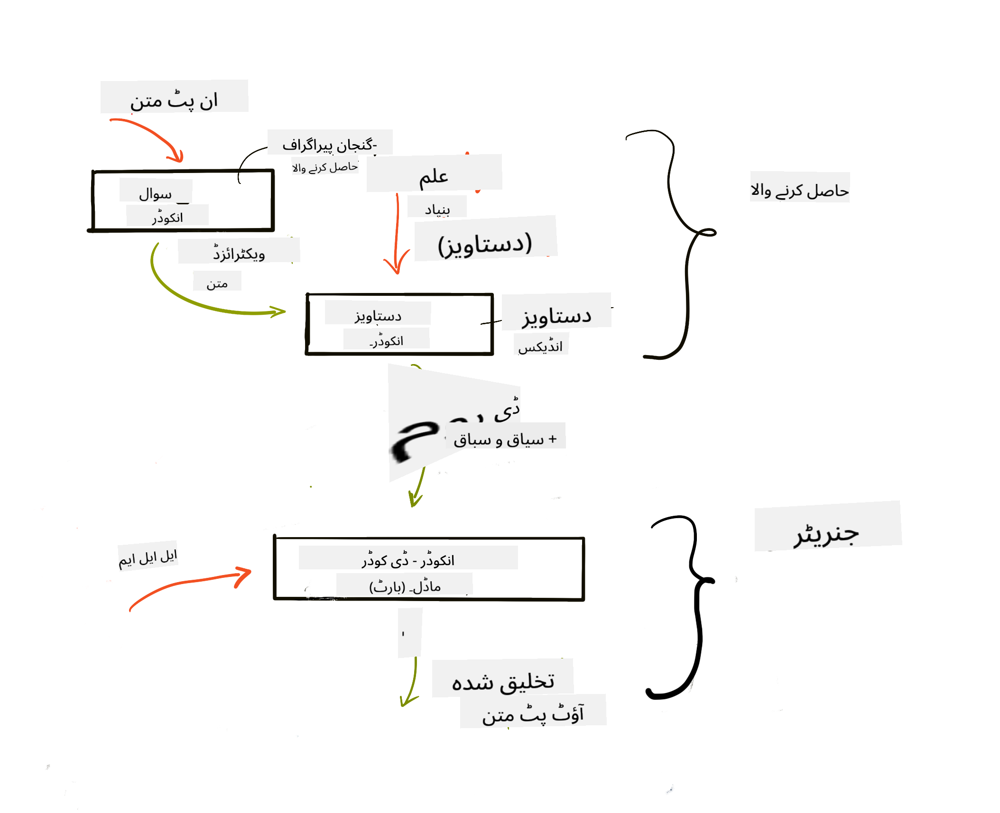

<!--
CO_OP_TRANSLATOR_METADATA:
{
  "original_hash": "e2861bbca91c0567ef32bc77fe054f9e",
  "translation_date": "2025-07-09T16:04:06+00:00",
  "source_file": "15-rag-and-vector-databases/README.md",
  "language_code": "ur"
}
-->
# Retrieval Augmented Generation (RAG) اور ویکٹر ڈیٹا بیسز

[](https://aka.ms/gen-ai-lesson15-gh?WT.mc_id=academic-105485-koreyst)

سرچ ایپلیکیشنز کے سبق میں، ہم نے مختصراً سیکھا کہ کس طرح اپنے ڈیٹا کو Large Language Models (LLMs) میں شامل کیا جا سکتا ہے۔ اس سبق میں، ہم اپنے LLM ایپلیکیشن میں ڈیٹا کو گراؤنڈ کرنے کے تصورات، اس عمل کے طریقہ کار اور ڈیٹا کو ذخیرہ کرنے کے طریقے، بشمول embeddings اور متن، پر مزید تفصیل سے بات کریں گے۔

> **ویڈیو جلد آ رہی ہے**

## تعارف

اس سبق میں ہم درج ذیل موضوعات کا احاطہ کریں گے:

- RAG کا تعارف، یہ کیا ہے اور AI (مصنوعی ذہانت) میں اس کا استعمال کیوں کیا جاتا ہے۔

- ویکٹر ڈیٹا بیسز کو سمجھنا اور اپنی ایپلیکیشن کے لیے ایک بنانا۔

- RAG کو ایپلیکیشن میں شامل کرنے کی عملی مثال۔

## سیکھنے کے مقاصد

اس سبق کو مکمل کرنے کے بعد، آپ قابل ہوں گے:

- RAG کی اہمیت کو ڈیٹا بازیافت اور پراسیسنگ میں بیان کرنا۔

- RAG ایپلیکیشن سیٹ اپ کرنا اور اپنے ڈیٹا کو LLM سے گراؤنڈ کرنا۔

- LLM ایپلیکیشنز میں RAG اور ویکٹر ڈیٹا بیسز کا مؤثر انضمام۔

## ہمارا منظرنامہ: اپنے LLMs کو اپنے ڈیٹا کے ساتھ بہتر بنانا

اس سبق کے لیے، ہم اپنی تعلیماتی اسٹارٹ اپ میں اپنے نوٹس شامل کرنا چاہتے ہیں، تاکہ چیٹ بوٹ مختلف موضوعات پر مزید معلومات حاصل کر سکے۔ ہمارے پاس موجود نوٹس کی مدد سے، سیکھنے والے بہتر مطالعہ کر سکیں گے اور مختلف موضوعات کو سمجھ سکیں گے، جس سے امتحانات کی تیاری آسان ہو جائے گی۔ اپنے منظرنامے کو بنانے کے لیے، ہم استعمال کریں گے:

- `Azure OpenAI:` وہ LLM جسے ہم اپنے چیٹ بوٹ بنانے کے لیے استعمال کریں گے

- `AI for beginners' lesson on Neural Networks:` یہ وہ ڈیٹا ہوگا جس پر ہم اپنے LLM کو گراؤنڈ کریں گے

- `Azure AI Search` اور `Azure Cosmos DB:` ویکٹر ڈیٹا بیس جہاں ہم اپنا ڈیٹا ذخیرہ کریں گے اور سرچ انڈیکس بنائیں گے

صارفین اپنے نوٹس سے پریکٹس کوئزز، ریویژن فلیش کارڈز بنا سکیں گے اور انہیں مختصر خلاصوں میں تبدیل کر سکیں گے۔ شروع کرنے کے لیے، آئیے دیکھتے ہیں کہ RAG کیا ہے اور یہ کیسے کام کرتا ہے:

## Retrieval Augmented Generation (RAG)

ایک LLM سے چلنے والا چیٹ بوٹ صارف کے پرامپٹس کو پراسیس کر کے جوابات تیار کرتا ہے۔ یہ انٹرایکٹو ہوتا ہے اور صارفین کے ساتھ مختلف موضوعات پر بات چیت کرتا ہے۔ تاہم، اس کے جوابات صرف فراہم کردہ سیاق و سباق اور اس کے بنیادی تربیتی ڈیٹا تک محدود ہوتے ہیں۔ مثال کے طور پر، GPT-4 کا نالج کٹ آف ستمبر 2021 ہے، یعنی اسے اس تاریخ کے بعد ہونے والے واقعات کا علم نہیں ہوتا۔ اس کے علاوہ، LLMs کی تربیت میں ذاتی نوٹس یا کمپنی کے پروڈکٹ مینوئل جیسے خفیہ معلومات شامل نہیں ہوتیں۔

### RAGs (Retrieval Augmented Generation) کیسے کام کرتے ہیں


فرض کریں آپ ایک ایسا چیٹ بوٹ بنانا چاہتے ہیں جو آپ کے نوٹس سے کوئزز بنائے، تو آپ کو نالج بیس سے کنکشن کی ضرورت ہوگی۔ یہی وہ جگہ ہے جہاں RAG مدد کرتا ہے۔ RAGs اس طرح کام کرتے ہیں:

- **Knowledge base:** بازیافت سے پہلے، ان دستاویزات کو ingest اور preprocess کرنا ہوتا ہے، عام طور پر بڑے دستاویزات کو چھوٹے حصوں میں تقسیم کرنا، انہیں ٹیکسٹ embeddings میں تبدیل کرنا اور ڈیٹا بیس میں ذخیرہ کرنا۔

- **User Query:** صارف سوال پوچھتا ہے

- **Retrieval:** جب صارف سوال پوچھتا ہے، embedding ماڈل ہمارے نالج بیس سے متعلقہ معلومات بازیافت کرتا ہے تاکہ مزید سیاق و سباق فراہم کیا جا سکے جو پرامپٹ میں شامل کیا جائے گا۔

- **Augmented Generation:** LLM اپنے جواب کو بازیافت شدہ ڈیٹا کی بنیاد پر بہتر بناتا ہے۔ یہ جواب کو صرف پہلے سے تربیت یافتہ ڈیٹا پر مبنی نہیں بلکہ شامل کردہ سیاق و سباق سے متعلق معلومات پر بھی مبنی بناتا ہے۔ بازیافت شدہ ڈیٹا LLM کے جوابات کو بڑھانے کے لیے استعمال ہوتا ہے۔ پھر LLM صارف کے سوال کا جواب دیتا ہے۔



RAGs کی آرکیٹیکچر ٹرانسفارمرز پر مبنی ہوتی ہے جس میں دو حصے ہوتے ہیں: encoder اور decoder۔ مثال کے طور پر، جب صارف سوال پوچھتا ہے، تو ان پٹ ٹیکسٹ کو ویکٹرز میں 'encode' کیا جاتا ہے جو الفاظ کے معنی کو پکڑتے ہیں، اور ویکٹرز کو ہمارے دستاویز انڈیکس میں 'decode' کیا جاتا ہے اور صارف کے سوال کی بنیاد پر نیا متن تیار کیا جاتا ہے۔ LLM آؤٹ پٹ تیار کرنے کے لیے encoder-decoder ماڈل دونوں استعمال کرتا ہے۔

RAG کو نافذ کرنے کے دو طریقے، جیسا کہ تجویز کردہ مقالے [Retrieval-Augmented Generation for Knowledge intensive NLP Tasks](https://arxiv.org/pdf/2005.11401.pdf?WT.mc_id=academic-105485-koreyst) میں بیان کیے گئے ہیں:

- **_RAG-Sequence_**: بازیافت شدہ دستاویزات کو استعمال کرتے ہوئے صارف کے سوال کا بہترین ممکنہ جواب پیش کرنا

- **RAG-Token**: دستاویزات کو استعمال کرتے ہوئے اگلا ٹوکن تیار کرنا، پھر انہیں صارف کے سوال کا جواب دینے کے لیے بازیافت کرنا

### آپ RAGs کیوں استعمال کریں؟ 

- **معلومات کی بھرپوریت:** یقینی بناتا ہے کہ ٹیکسٹ جوابات تازہ ترین اور موجودہ ہوں۔ اس طرح یہ مخصوص شعبوں کے کاموں میں کارکردگی کو بہتر بناتا ہے کیونکہ یہ اندرونی نالج بیس تک رسائی فراہم کرتا ہے۔

- جعلی معلومات کو کم کرتا ہے کیونکہ یہ صارف کے سوالات کے لیے سیاق و سباق فراہم کرنے کے لیے **تصدیق شدہ ڈیٹا** استعمال کرتا ہے۔

- یہ **لاگت مؤثر** ہے کیونکہ یہ LLM کو fine-tune کرنے کے مقابلے میں زیادہ اقتصادی ہے۔

## نالج بیس بنانا

ہماری ایپلیکیشن ہمارے ذاتی ڈیٹا پر مبنی ہے، یعنی AI For Beginners کے نصاب میں Neural Network کا سبق۔

### ویکٹر ڈیٹا بیسز

ویکٹر ڈیٹا بیس، روایتی ڈیٹا بیسز کے برعکس، ایک خاص قسم کا ڈیٹا بیس ہے جو embedded ویکٹرز کو ذخیرہ، منظم اور تلاش کرنے کے لیے ڈیزائن کیا گیا ہے۔ یہ دستاویزات کی عددی نمائندگی ذخیرہ کرتا ہے۔ ڈیٹا کو عددی embeddings میں توڑنا ہمارے AI سسٹم کے لیے ڈیٹا کو سمجھنا اور پراسیس کرنا آسان بناتا ہے۔

ہم اپنے embeddings کو ویکٹر ڈیٹا بیسز میں ذخیرہ کرتے ہیں کیونکہ LLMs کے ان پٹ کے طور پر قبول کیے جانے والے ٹوکنز کی تعداد محدود ہوتی ہے۔ چونکہ آپ پورے embeddings کو LLM کو نہیں دے سکتے، اس لیے ہمیں انہیں چھوٹے حصوں میں تقسیم کرنا ہوگا اور جب صارف سوال پوچھے گا، تو سب سے زیادہ متعلقہ embeddings کو پرامپٹ کے ساتھ واپس کیا جائے گا۔ chunking سے LLM میں بھیجے جانے والے ٹوکنز کی تعداد پر لاگت بھی کم ہوتی ہے۔

کچھ مشہور ویکٹر ڈیٹا بیسز میں Azure Cosmos DB، Clarifyai، Pinecone، Chromadb، ScaNN، Qdrant اور DeepLake شامل ہیں۔ آپ Azure CLI کے ذریعے Azure Cosmos DB ماڈل بنا سکتے ہیں:

```bash
az login
az group create -n <resource-group-name> -l <location>
az cosmosdb create -n <cosmos-db-name> -r <resource-group-name>
az cosmosdb list-keys -n <cosmos-db-name> -g <resource-group-name>
```

### متن سے embeddings تک

اپنا ڈیٹا ذخیرہ کرنے سے پہلے، ہمیں اسے ویکٹر embeddings میں تبدیل کرنا ہوگا۔ اگر آپ بڑے دستاویزات یا طویل متون کے ساتھ کام کر رہے ہیں، تو آپ انہیں متوقع سوالات کی بنیاد پر چھوٹے حصوں میں تقسیم کر سکتے ہیں۔ chunking جملے کی سطح پر یا پیراگراف کی سطح پر کی جا سکتی ہے۔ چونکہ chunking الفاظ کے ارد گرد کے سیاق و سباق سے معنی حاصل کرتا ہے، آپ کسی chunk میں اضافی سیاق و سباق بھی شامل کر سکتے ہیں، مثلاً دستاویز کا عنوان یا chunk سے پہلے یا بعد کا کچھ متن۔ آپ ڈیٹا کو اس طرح chunk کر سکتے ہیں:

```python
def split_text(text, max_length, min_length):
    words = text.split()
    chunks = []
    current_chunk = []

    for word in words:
        current_chunk.append(word)
        if len(' '.join(current_chunk)) < max_length and len(' '.join(current_chunk)) > min_length:
            chunks.append(' '.join(current_chunk))
            current_chunk = []

    # If the last chunk didn't reach the minimum length, add it anyway
    if current_chunk:
        chunks.append(' '.join(current_chunk))

    return chunks
```

chunk کرنے کے بعد، ہم مختلف embedding ماڈلز استعمال کر کے اپنا متن embed کر سکتے ہیں۔ کچھ ماڈلز جنہیں آپ استعمال کر سکتے ہیں: word2vec، OpenAI کا ada-002، Azure Computer Vision اور بہت سے دیگر۔ ماڈل کا انتخاب آپ کی زبانوں، مواد کی قسم (متن/تصاویر/آڈیو)، ان پٹ سائز اور embedding آؤٹ پٹ کی لمبائی پر منحصر ہوگا۔

OpenAI کے `text-embedding-ada-002` ماڈل سے embed کیا گیا متن کی مثال:


## بازیافت اور ویکٹر سرچ

جب صارف سوال پوچھتا ہے، تو retriever اسے query encoder کے ذریعے ویکٹر میں تبدیل کرتا ہے، پھر ہمارے دستاویز سرچ انڈیکس میں متعلقہ ویکٹرز تلاش کرتا ہے جو ان پٹ سے متعلق ہوں۔ اس کے بعد، یہ ان پٹ ویکٹر اور دستاویز ویکٹرز کو متن میں تبدیل کر کے LLM کو بھیجتا ہے۔

### بازیافت

بازیافت اس وقت ہوتی ہے جب سسٹم جلدی سے ان دستاویزات کو تلاش کرتا ہے جو سرچ کے معیار پر پورا اترتی ہوں۔ retriever کا مقصد وہ دستاویزات حاصل کرنا ہے جو سیاق و سباق فراہم کریں اور LLM کو آپ کے ڈیٹا پر گراؤنڈ کریں۔

ہماری ڈیٹا بیس میں سرچ کرنے کے کئی طریقے ہیں، جیسے:

- **Keyword search** - متن کی تلاش کے لیے استعمال ہوتا ہے

- **Semantic search** - الفاظ کے معنوی مفہوم کو استعمال کرتا ہے

- **Vector search** - دستاویزات کو embedding ماڈلز کے ذریعے متن سے ویکٹر نمائندگی میں تبدیل کرتا ہے۔ بازیافت ان دستاویزات سے کی جاتی ہے جن کی ویکٹر نمائندگی صارف کے سوال کے سب سے قریب ہو۔

- **Hybrid** - keyword اور vector سرچ کا امتزاج

بازیافت میں ایک چیلنج یہ آتا ہے کہ اگر ڈیٹا بیس میں سوال کے لیے کوئی مماثل جواب نہ ہو، تو سسٹم بہترین دستیاب معلومات واپس کرتا ہے، تاہم آپ relevance کے لیے زیادہ سے زیادہ فاصلے کا تعین کر سکتے ہیں یا hybrid سرچ استعمال کر سکتے ہیں جو keyword اور vector سرچ دونوں کو ملاتی ہے۔ اس سبق میں ہم hybrid سرچ استعمال کریں گے، جو vector اور keyword سرچ کا امتزاج ہے۔ ہم اپنا ڈیٹا ایک dataframe میں ذخیرہ کریں گے جس میں chunks اور embeddings دونوں شامل ہوں گے۔

### ویکٹر مماثلت

retriever نالج بیس میں ایسے embeddings تلاش کرے گا جو ایک دوسرے کے قریب ہوں، یعنی سب سے قریبی ہمسایہ، کیونکہ یہ متن میں مماثلت رکھتے ہیں۔ جب صارف سوال پوچھتا ہے، تو اسے پہلے embed کیا جاتا ہے اور پھر مماثل embeddings سے میچ کیا جاتا ہے۔ مختلف ویکٹرز کی مماثلت معلوم کرنے کے لیے عام پیمائش cosine similarity ہے جو دو ویکٹرز کے درمیان زاویہ پر مبنی ہوتی ہے۔

ہم مماثلت کو دیگر طریقوں سے بھی ناپ سکتے ہیں، جیسے Euclidean distance جو ویکٹر کے اختتام پوائنٹس کے درمیان سیدھی لائن ہے، اور dot product جو دو ویکٹرز کے متعلقہ عناصر کے حاصل ضرب کا مجموعہ ناپتا ہے۔

### سرچ انڈیکس

بازیافت کرنے سے پہلے، ہمیں اپنے نالج بیس کے لیے سرچ انڈیکس بنانا ہوگا۔ انڈیکس ہمارے embeddings کو ذخیرہ کرتا ہے اور بڑے ڈیٹا بیس میں بھی سب سے مماثل chunks کو جلدی بازیافت کر سکتا ہے۔ ہم اپنا انڈیکس مقامی طور پر بنا سکتے ہیں:

```python
from sklearn.neighbors import NearestNeighbors

embeddings = flattened_df['embeddings'].to_list()

# Create the search index
nbrs = NearestNeighbors(n_neighbors=5, algorithm='ball_tree').fit(embeddings)

# To query the index, you can use the kneighbors method
distances, indices = nbrs.kneighbors(embeddings)
```

### دوبارہ درجہ بندی (Re-ranking)

جب آپ نے ڈیٹا بیس سے نتائج حاصل کر لیے، تو آپ کو انہیں سب سے زیادہ متعلقہ سے ترتیب دینے کی ضرورت ہو سکتی ہے۔ ایک reranking LLM مشین لرننگ کا استعمال کرتے ہوئے سرچ نتائج کی مطابقت کو بہتر بناتا ہے اور انہیں سب سے زیادہ متعلقہ سے ترتیب دیتا ہے۔ Azure AI Search میں reranking خودکار طور پر semantic reranker کے ذریعے کی جاتی ہے۔ nearest neighbours کے استعمال سے reranking کی مثال:

```python
# Find the most similar documents
distances, indices = nbrs.kneighbors([query_vector])

index = []
# Print the most similar documents
for i in range(3):
    index = indices[0][i]
    for index in indices[0]:
        print(flattened_df['chunks'].iloc[index])
        print(flattened_df['path'].iloc[index])
        print(flattened_df['distances'].iloc[index])
    else:
        print(f"Index {index} not found in DataFrame")
```

## سب کو ایک ساتھ لانا

آخری مرحلہ یہ ہے کہ اپنے LLM کو شامل کریں تاکہ جوابات ہمارے ڈیٹا پر مبنی ہوں۔ ہم اسے اس طرح نافذ کر سکتے ہیں:

```python
user_input = "what is a perceptron?"

def chatbot(user_input):
    # Convert the question to a query vector
    query_vector = create_embeddings(user_input)

    # Find the most similar documents
    distances, indices = nbrs.kneighbors([query_vector])

    # add documents to query  to provide context
    history = []
    for index in indices[0]:
        history.append(flattened_df['chunks'].iloc[index])

    # combine the history and the user input
    history.append(user_input)

    # create a message object
    messages=[
        {"role": "system", "content": "You are an AI assistant that helps with AI questions."},
        {"role": "user", "content": history[-1]}
    ]

    # use chat completion to generate a response
    response = openai.chat.completions.create(
        model="gpt-4",
        temperature=0.7,
        max_tokens=800,
        messages=messages
    )

    return response.choices[0].message

chatbot(user_input)
```

## اپنی ایپلیکیشن کا جائزہ لینا

### جائزہ کے معیار

- فراہم کردہ جوابات کا معیار، یہ یقینی بنانا کہ یہ قدرتی، روان اور انسانی جیسا لگے

- ڈیٹا کی گراؤنڈڈنس: یہ جانچنا کہ جواب فراہم کردہ دستاویزات سے آیا ہے یا نہیں

- مطابقت: یہ جانچنا کہ جواب سوال سے میل کھاتا ہے اور متعلقہ ہے

- روانی - کیا جواب گرامر کے لحاظ سے درست اور سمجھ میں آتا ہے

## RAG (Retrieval Augmented Generation) اور ویکٹر ڈیٹا بیسز کے استعمال کے کیسز

ایسے کئی مختلف استعمال کے کیسز ہیں جہاں فنکشن کالز آپ کی ایپ کو بہتر بنا سکتی ہیں، جیسے:

- سوال و جواب: اپنی کمپنی کے ڈیٹا کو چیٹ میں گراؤنڈ کرنا تاکہ ملازمین سوالات پوچھ سکیں۔

- سفارشاتی نظام: جہاں آپ ایک ایسا نظام بنا سکتے ہیں جو سب سے زیادہ مماثل اقدار کو میچ کرے، مثلاً فلمیں، ریستوران اور بہت کچھ۔

- چیٹ بوٹ سروسز: آپ چیٹ ہسٹری ذخیرہ کر سکتے ہیں اور صارف کے ڈیٹا کی بنیاد پر گفتگو کو ذاتی نوعیت دے سکتے ہیں۔

- ویکٹر embeddings کی بنیاد پر تصویر کی تلاش، جو تصویر کی شناخت اور انوملی ڈیٹیکشن میں مفید ہے۔

## خلاصہ

ہم نے RAG کے بنیادی پہلوؤں کا احاطہ کیا، جیسے ایپلیکیشن میں اپنا ڈیٹا شامل کرنا، صارف کا سوال اور آؤٹ پٹ۔ RAG بنانے کو آسان بنانے کے لیے، آپ Semanti Kernel، Langchain یا Autogen جیسے فریم ورکس استعمال کر سکتے ہیں۔

## اسائنمنٹ

Retrieval Augmented Generation (RAG) کی اپنی تعلیم جاری رکھنے کے لیے آپ بنا سکتے ہیں:

- اپنی پسند کے فریم ورک کا استعمال کرتے ہوئے ایپلیکیشن کے لیے فرنٹ اینڈ بنائیں

- LangChain یا Semantic Kernel میں سے کسی ایک فریم ورک کو استعمال کرتے ہوئے اپنی ایپلیکیشن کو دوبارہ تخلیق کریں۔

سبق مکمل کرنے پر مبارکباد 👏۔

## سیکھنا یہاں ختم نہیں ہوتا، سفر جاری رکھیں

اس سبق کو مکمل کرنے کے بعد، ہمارے [Generative AI Learning collection](https://aka.ms/genai-collection?WT.mc_id=academic-105485-koreyst) کو دیکھیں تاکہ اپنی Generative AI کی معلومات کو مزید بڑھا سکیں!

**دستخطی نوٹ**:  
یہ دستاویز AI ترجمہ سروس [Co-op Translator](https://github.com/Azure/co-op-translator) کے ذریعے ترجمہ کی گئی ہے۔ اگرچہ ہم درستگی کے لیے کوشاں ہیں، براہ کرم اس بات سے آگاہ رہیں کہ خودکار ترجمے میں غلطیاں یا عدم درستیاں ہو سکتی ہیں۔ اصل دستاویز اپنی مادری زبان میں ہی معتبر ماخذ سمجھی جانی چاہیے۔ اہم معلومات کے لیے پیشہ ور انسانی ترجمہ کی سفارش کی جاتی ہے۔ اس ترجمے کے استعمال سے پیدا ہونے والی کسی بھی غلط فہمی یا غلط تشریح کی ذمہ داری ہم پر عائد نہیں ہوتی۔