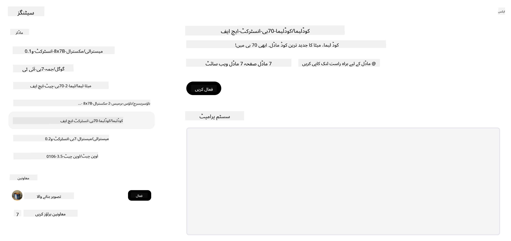
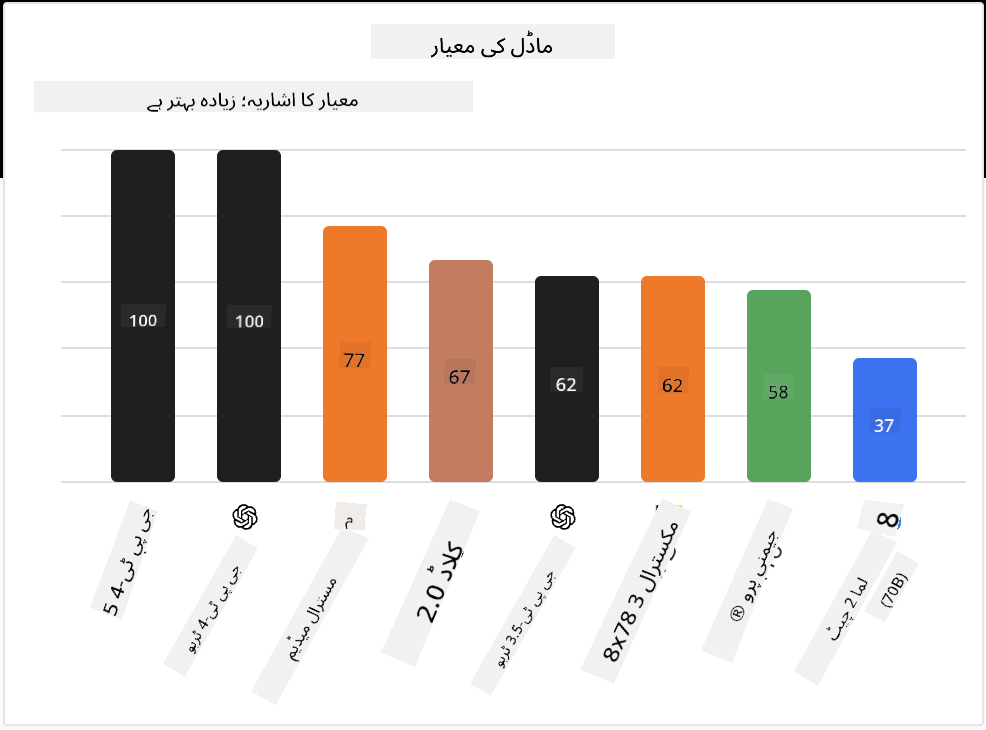

<!--
CO_OP_TRANSLATOR_METADATA:
{
  "original_hash": "a2a83aac52158c23161046cbd13faa2b",
  "translation_date": "2025-10-17T13:09:17+00:00",
  "source_file": "16-open-source-models/README.md",
  "language_code": "ur"
}
-->

## تعارف

اوپن سورس LLMs کی دنیا دلچسپ اور مسلسل ترقی پذیر ہے۔ اس سبق کا مقصد اوپن سورس ماڈلز پر گہرائی سے نظر ڈالنا ہے۔ اگر آپ یہ جاننا چاہتے ہیں کہ ملکیتی ماڈلز اوپن سورس ماڈلز کے مقابلے میں کیسے ہیں، تو ["Exploring and Comparing Different LLMs" سبق](../02-exploring-and-comparing-different-llms/README.md?WT.mc_id=academic-105485-koreyst) پر جائیں۔ یہ سبق فائن ٹیوننگ کے موضوع کا بھی احاطہ کرے گا، لیکن اس کی مزید تفصیل ["Fine-Tuning LLMs" سبق](../18-fine-tuning/README.md?WT.mc_id=academic-105485-koreyst) میں مل سکتی ہے۔

## سیکھنے کے مقاصد

- اوپن سورس ماڈلز کو سمجھنا
- اوپن سورس ماڈلز کے ساتھ کام کرنے کے فوائد کو سمجھنا
- ہگنگ فیس اور ایزور اے آئی اسٹوڈیو پر دستیاب اوپن ماڈلز کا جائزہ لینا

## اوپن سورس ماڈلز کیا ہیں؟

اوپن سورس سافٹ ویئر نے مختلف شعبوں میں ٹیکنالوجی کی ترقی میں اہم کردار ادا کیا ہے۔ اوپن سورس انیشیٹو (OSI) نے [سافٹ ویئر کے لیے 10 معیار](https://web.archive.org/web/20241126001143/https://opensource.org/osd?WT.mc_id=academic-105485-koreyst) مقرر کیے ہیں تاکہ اسے اوپن سورس کے طور پر درجہ بند کیا جا سکے۔ سورس کوڈ کو OSI کی منظور شدہ لائسنس کے تحت کھلے عام شیئر کیا جانا چاہیے۔

LLMs کی ترقی میں سافٹ ویئر کی ترقی کے کچھ مشابہ عناصر ہیں، لیکن یہ عمل بالکل ایک جیسا نہیں ہے۔ اس نے کمیونٹی میں LLMs کے سیاق و سباق میں اوپن سورس کی تعریف پر بہت زیادہ بحث کو جنم دیا ہے۔ ایک ماڈل کو روایتی اوپن سورس تعریف کے مطابق ہونے کے لیے درج ذیل معلومات عوامی طور پر دستیاب ہونی چاہئیں:

- ماڈل کو تربیت دینے کے لیے استعمال کیے گئے ڈیٹا سیٹس۔
- مکمل ماڈل ویٹس تربیت کے حصے کے طور پر۔
- تشخیصی کوڈ۔
- فائن ٹیوننگ کوڈ۔
- مکمل ماڈل ویٹس اور تربیتی میٹرکس۔

فی الحال، صرف چند ماڈلز ہیں جو اس معیار پر پورا اترتے ہیں۔ [OLMo ماڈل جو ایلن انسٹی ٹیوٹ فار آرٹیفیشل انٹیلیجنس (AllenAI) نے بنایا ہے](https://huggingface.co/allenai/OLMo-7B?WT.mc_id=academic-105485-koreyst) اس زمرے میں آتا ہے۔

اس سبق کے لیے، ہم ماڈلز کو "اوپن ماڈلز" کے طور پر حوالہ دیں گے کیونکہ وہ اس وقت تحریر کے وقت مذکورہ معیار پر پورا نہیں اتر سکتے۔

## اوپن ماڈلز کے فوائد

**انتہائی حسب ضرورت** - چونکہ اوپن ماڈلز تفصیلی تربیتی معلومات کے ساتھ جاری کیے جاتے ہیں، محققین اور ڈویلپرز ماڈل کے اندرونی حصوں میں ترمیم کر سکتے ہیں۔ یہ انتہائی مخصوص ماڈلز بنانے کے قابل بناتا ہے جو کسی خاص کام یا مطالعہ کے شعبے کے لیے فائن ٹیون کیے گئے ہوں۔ اس کی کچھ مثالیں کوڈ جنریشن، ریاضیاتی آپریشنز اور حیاتیات ہیں۔

**لاگت** - ان ماڈلز کو استعمال کرنے اور تعینات کرنے کی لاگت فی ٹوکن ملکیتی ماڈلز کے مقابلے میں کم ہے۔ جب جنریٹو اے آئی ایپلیکیشنز بناتے ہیں، تو ان ماڈلز کے ساتھ کام کرتے وقت کارکردگی بمقابلہ قیمت کو دیکھنا ضروری ہے۔

  
ماخذ: آرٹیفیشل اینالیسس

**لچک** - اوپن ماڈلز کے ساتھ کام کرنے سے آپ مختلف ماڈلز استعمال کرنے یا انہیں یکجا کرنے میں لچکدار ہو سکتے ہیں۔ اس کی ایک مثال [HuggingChat Assistants](https://huggingface.co/chat?WT.mc_id=academic-105485-koreyst) ہے، جہاں صارف انٹرفیس میں براہ راست استعمال ہونے والے ماڈل کو منتخب کر سکتا ہے:

## مختلف اوپن ماڈلز کا جائزہ

### Llama 2

[LLama2](https://huggingface.co/meta-llama?WT.mc_id=academic-105485-koreyst)، جو میٹا نے تیار کیا ہے، ایک اوپن ماڈل ہے جو چیٹ پر مبنی ایپلیکیشنز کے لیے بہتر بنایا گیا ہے۔ یہ اس کے فائن ٹیوننگ طریقہ کی وجہ سے ہے، جس میں مکالمے اور انسانی تاثرات کی ایک بڑی مقدار شامل تھی۔ اس طریقہ کے ساتھ، ماڈل زیادہ ایسے نتائج پیدا کرتا ہے جو انسانی توقعات کے مطابق ہوتے ہیں، جو ایک بہتر صارف تجربہ فراہم کرتا ہے۔

Llama کے فائن ٹیونڈ ورژنز کی کچھ مثالوں میں [Japanese Llama](https://huggingface.co/elyza/ELYZA-japanese-Llama-2-7b?WT.mc_id=academic-105485-koreyst) شامل ہے، جو جاپانی زبان میں مہارت رکھتا ہے، اور [Llama Pro](https://huggingface.co/TencentARC/LLaMA-Pro-8B?WT.mc_id=academic-105485-koreyst)، جو بنیادی ماڈل کا ایک بہتر ورژن ہے۔

### Mistral

[Mistral](https://huggingface.co/mistralai?WT.mc_id=academic-105485-koreyst) ایک اوپن ماڈل ہے جو اعلی کارکردگی اور کارکردگی پر زور دیتا ہے۔ یہ Mixture-of-Experts طریقہ استعمال کرتا ہے جو ایک نظام میں ماہر ماڈلز کے ایک گروپ کو یکجا کرتا ہے، جہاں ان پٹ کے لحاظ سے مخصوص ماڈلز کو منتخب کیا جاتا ہے۔ یہ کمپیوٹیشن کو زیادہ مؤثر بناتا ہے کیونکہ ماڈلز صرف ان ان پٹس کو ایڈریس کرتے ہیں جن میں وہ مہارت رکھتے ہیں۔

Mistral کے فائن ٹیونڈ ورژنز کی کچھ مثالوں میں [BioMistral](https://huggingface.co/BioMistral/BioMistral-7B?text=Mon+nom+est+Thomas+et+mon+principal?WT.mc_id=academic-105485-koreyst) شامل ہے، جو طبی شعبے پر مرکوز ہے، اور [OpenMath Mistral](https://huggingface.co/nvidia/OpenMath-Mistral-7B-v0.1-hf?WT.mc_id=academic-105485-koreyst)، جو ریاضیاتی حسابات انجام دیتا ہے۔

### Falcon

[Falcon](https://huggingface.co/tiiuae?WT.mc_id=academic-105485-koreyst) ایک LLM ہے جو ٹیکنالوجی انوویشن انسٹی ٹیوٹ (**TII**) نے بنایا ہے۔ Falcon-40B کو 40 ارب پیرامیٹرز پر تربیت دی گئی ہے، جس نے کم کمپیوٹ بجٹ کے ساتھ GPT-3 سے بہتر کارکردگی دکھائی ہے۔ یہ FlashAttention الگورتھم اور ملٹی کوئری اٹینشن کے استعمال کی وجہ سے ہے، جو انفرنس کے وقت میموری کی ضروریات کو کم کرنے کے قابل بناتا ہے۔ اس کم انفرنس وقت کے ساتھ، Falcon-40B چیٹ ایپلیکیشنز کے لیے موزوں ہے۔

Falcon کے فائن ٹیونڈ ورژنز کی کچھ مثالیں [OpenAssistant](https://huggingface.co/OpenAssistant/falcon-40b-sft-top1-560?WT.mc_id=academic-105485-koreyst) ہیں، جو اوپن ماڈلز پر مبنی ایک اسسٹنٹ ہے، اور [GPT4ALL](https://huggingface.co/nomic-ai/gpt4all-falcon?WT.mc_id=academic-105485-koreyst)، جو بنیادی ماڈل سے زیادہ کارکردگی فراہم کرتا ہے۔

## کیسے منتخب کریں

اوپن ماڈل کا انتخاب کرنے کے لیے کوئی ایک جواب نہیں ہے۔ ایک اچھی شروعات ایزور اے آئی اسٹوڈیو کے ٹاسک کے لحاظ سے فلٹر کرنے کی خصوصیت کا استعمال کرنا ہے۔ یہ آپ کو یہ سمجھنے میں مدد دے گا کہ ماڈل کو کس قسم کے کاموں کے لیے تربیت دی گئی ہے۔ ہگنگ فیس بھی ایک LLM لیڈر بورڈ برقرار رکھتا ہے جو آپ کو مخصوص میٹرکس کی بنیاد پر بہترین کارکردگی دکھانے والے ماڈلز دکھاتا ہے۔

مختلف اقسام کے LLMs کا موازنہ کرنے کے لیے، [Artificial Analysis](https://artificialanalysis.ai/?WT.mc_id=academic-105485-koreyst) ایک اور بہترین ذریعہ ہے:

  
ماخذ: آرٹیفیشل اینالیسس

اگر کسی مخصوص استعمال کے کیس پر کام کر رہے ہیں، تو اسی علاقے پر مرکوز فائن ٹیونڈ ورژنز تلاش کرنا مؤثر ہو سکتا ہے۔ متعدد اوپن ماڈلز کے ساتھ تجربہ کرنا تاکہ یہ دیکھا جا سکے کہ وہ آپ اور آپ کے صارفین کی توقعات کے مطابق کیسے کارکردگی دکھاتے ہیں، ایک اور اچھی مشق ہے۔

## اگلے اقدامات

اوپن ماڈلز کے بارے میں سب سے اچھی بات یہ ہے کہ آپ ان کے ساتھ کام کرنا جلدی شروع کر سکتے ہیں۔ [Azure AI Foundry Model Catalog](https://ai.azure.com?WT.mc_id=academic-105485-koreyst) کو دیکھیں، جس میں ہگنگ فیس کلیکشن کے ساتھ وہ ماڈلز شامل ہیں جن پر ہم نے یہاں بات کی۔

## سیکھنا یہاں ختم نہیں ہوتا، سفر جاری رکھیں

اس سبق کو مکمل کرنے کے بعد، ہمارے [Generative AI Learning collection](https://aka.ms/genai-collection?WT.mc_id=academic-105485-koreyst) کو دیکھیں تاکہ اپنی جنریٹو اے آئی کی معلومات کو مزید بڑھا سکیں!

---

**اعلانِ لاتعلقی**:  
یہ دستاویز AI ترجمہ سروس [Co-op Translator](https://github.com/Azure/co-op-translator) کا استعمال کرتے ہوئے ترجمہ کی گئی ہے۔ ہم درستگی کی بھرپور کوشش کرتے ہیں، لیکن براہ کرم آگاہ رہیں کہ خودکار ترجمے میں غلطیاں یا غیر درستیاں ہو سکتی ہیں۔ اصل دستاویز کو اس کی اصل زبان میں مستند ذریعہ سمجھا جانا چاہیے۔ اہم معلومات کے لیے، پیشہ ور انسانی ترجمہ کی سفارش کی جاتی ہے۔ اس ترجمے کے استعمال سے پیدا ہونے والی کسی بھی غلط فہمی یا غلط تشریح کے لیے ہم ذمہ دار نہیں ہیں۔