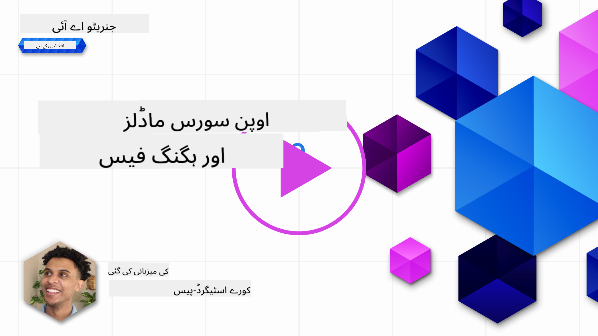
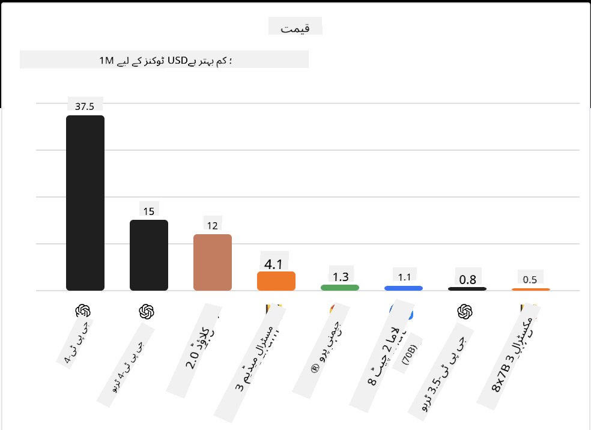
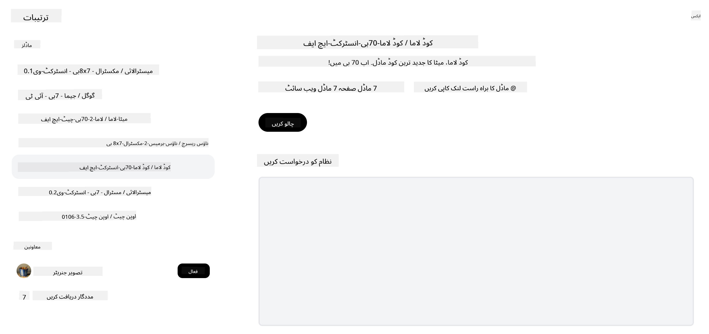

<!--
CO_OP_TRANSLATOR_METADATA:
{
  "original_hash": "0bba96e53ab841d99db731892a51fab8",
  "translation_date": "2025-05-20T06:47:48+00:00",
  "source_file": "16-open-source-models/README.md",
  "language_code": "ur"
}
-->

## تعارف

اوپن سورس LLMs کی دنیا دلچسپ اور مسلسل ترقی پذیر ہے۔ یہ سبق اوپن سورس ماڈلز کا تفصیلی جائزہ فراہم کرنے کا ارادہ رکھتا ہے۔ اگر آپ کو معلوم کرنا ہے کہ ملکیتی ماڈلز کا اوپن سورس ماڈلز کے ساتھ کس طرح موازنہ ہوتا ہے، تو ["مختلف LLMs کی تحقیق اور موازنہ" سبق](../02-exploring-and-comparing-different-llms/README.md?WT.mc_id=academic-105485-koreyst) پر جائیں۔ یہ سبق فائن ٹوننگ کے موضوع کو بھی شامل کرے گا لیکن مزید تفصیلی وضاحت ["فائن ٹوننگ LLMs" سبق](../18-fine-tuning/README.md?WT.mc_id=academic-105485-koreyst) میں پایا جا سکتا ہے۔

## سیکھنے کے مقاصد

- اوپن سورس ماڈلز کی سمجھ حاصل کریں
- اوپن سورس ماڈلز کے ساتھ کام کرنے کے فوائد کو سمجھنا
- ہگنگ فیس اور ایزور AI اسٹوڈیو پر دستیاب اوپن ماڈلز کی تحقیق کرنا

## اوپن سورس ماڈلز کیا ہیں؟

اوپن سورس سافٹ ویئر نے مختلف شعبوں میں ٹیکنالوجی کی ترقی میں اہم کردار ادا کیا ہے۔ اوپن سورس انیشیٹو (OSI) نے [سافٹ ویئر کے لیے 10 معیار](https://web.archive.org/web/20241126001143/https://opensource.org/osd?WT.mc_id=academic-105485-koreyst) مقرر کیے ہیں تاکہ اسے اوپن سورس کے طور پر درجہ بندی کیا جا سکے۔ سورس کوڈ کو OSI کے منظور شدہ لائسنس کے تحت کھلے عام شیئر کیا جانا چاہیے۔

جبکہ LLMs کی ترقی میں سافٹ ویئر کی ترقی کے کچھ عناصر شامل ہیں، یہ عمل بالکل ایک جیسا نہیں ہے۔ یہ LLMs کے تناظر میں اوپن سورس کی تعریف پر کمیونٹی میں بہت سی بحثوں کا باعث بنا ہے۔ ایک ماڈل کو روایتی اوپن سورس تعریف کے مطابق ہونے کے لیے درج ذیل معلومات عوامی طور پر دستیاب ہونی چاہیے:

- ماڈل کو تربیت دینے کے لیے استعمال کیے گئے ڈیٹا سیٹس۔
- تربیت کا حصہ کے طور پر مکمل ماڈل وزن۔
- تشخیصی کوڈ۔
- فائن ٹوننگ کوڈ۔
- مکمل ماڈل وزن اور تربیتی میٹرکس۔

فی الحال صرف چند ماڈلز اس معیار سے میل کھاتے ہیں۔ [OLMo ماڈل جو ایلن انسٹیٹیوٹ فار آرٹیفیشل انٹیلی جنس (AllenAI) نے بنایا](https://huggingface.co/allenai/OLMo-7B?WT.mc_id=academic-105485-koreyst) ہے، اس زمرے میں فٹ ہوتا ہے۔

اس سبق کے لیے، ہم ماڈلز کو "اوپن ماڈلز" کے طور پر آگے بڑھائیں گے کیونکہ وہ اس وقت لکھنے کے وقت اوپر دیئے گئے معیار سے میل نہیں کھا سکتے ہیں۔

## اوپن ماڈلز کے فوائد

**انتہائی حسب ضرورت** - چونکہ اوپن ماڈلز کو تفصیلی تربیتی معلومات کے ساتھ جاری کیا جاتا ہے، محققین اور ڈویلپرز ماڈل کے اندرونی حصوں کو تبدیل کر سکتے ہیں۔ یہ مخصوص کام یا مطالعہ کے علاقے کے لیے انتہائی خصوصی ماڈلز بنانے کی اجازت دیتا ہے۔ اس کی کچھ مثالیں کوڈ جنریشن، ریاضی کے آپریشنز اور حیاتیات ہیں۔

**قیمت** - ان ماڈلز کو استعمال کرنے اور تعینات کرنے کے لیے فی ٹوکن کی قیمت ملکیتی ماڈلز کے مقابلے میں کم ہے۔ جب جنریٹو AI ایپلیکیشنز بناتے ہیں، تو ان ماڈلز کے ساتھ اپنے استعمال کے کیس پر کام کرتے وقت کارکردگی بمقابلہ قیمت کو دیکھنا چاہیے۔

 ماخذ: مصنوعی تجزیہ

**لچک** - اوپن ماڈلز کے ساتھ کام کرنا مختلف ماڈلز استعمال کرنے یا ان کو یکجا کرنے کے لحاظ سے آپ کو لچکدار بناتا ہے۔ اس کی ایک مثال [HuggingChat Assistants](https://huggingface.co/chat?WT.mc_id=academic-105485-koreyst) ہے جہاں صارف انٹرفیس میں براہ راست استعمال ہونے والے ماڈل کا انتخاب کر سکتا ہے:

## مختلف اوپن ماڈلز کی تحقیق

### Llama 2

[LLama2](https://huggingface.co/meta-llama?WT.mc_id=academic-105485-koreyst)، جو میٹا نے تیار کیا ہے، ایک اوپن ماڈل ہے جو چیٹ پر مبنی ایپلیکیشنز کے لیے بہتر بنایا گیا ہے۔ یہ اس کے فائن ٹوننگ طریقہ کی وجہ سے ہے، جس میں بڑی مقدار میں ڈائیلاگ اور انسانی فیڈبیک شامل ہے۔ اس طریقہ کے ساتھ، ماڈل مزید نتائج پیدا کرتا ہے جو انسانی توقع کے مطابق ہوتے ہیں جو بہتر صارف تجربہ فراہم کرتا ہے۔

Llama کے فائن ٹونڈ ورژنز کی کچھ مثالیں [جاپانی Llama](https://huggingface.co/elyza/ELYZA-japanese-Llama-2-7b?WT.mc_id=academic-105485-koreyst) ہیں، جو جاپانی میں مہارت رکھتا ہے اور [Llama Pro](https://huggingface.co/TencentARC/LLaMA-Pro-8B?WT.mc_id=academic-105485-koreyst)، جو بنیادی ماڈل کا بہتر ورژن ہے۔

### Mistral

[Mistral](https://huggingface.co/mistralai?WT.mc_id=academic-105485-koreyst) ایک اوپن ماڈل ہے جس میں اعلیٰ کارکردگی اور استعداد پر توجہ مرکوز کی گئی ہے۔ یہ Mixture-of-Experts طریقہ استعمال کرتا ہے جو ماہر ماڈلز کے ایک گروپ کو ایک سسٹم میں یکجا کرتا ہے جہاں ان پٹ کے مطابق، مخصوص ماڈلز کو استعمال کرنے کے لیے منتخب کیا جاتا ہے۔ یہ حساب کتاب کو زیادہ مؤثر بناتا ہے کیونکہ ماڈلز صرف ان ان پٹس کو ایڈریس کر رہے ہیں جن میں وہ مہارت رکھتے ہیں۔

Mistral کے فائن ٹونڈ ورژنز کی کچھ مثالیں [BioMistral](https://huggingface.co/BioMistral/BioMistral-7B?text=Mon+nom+est+Thomas+et+mon+principal?WT.mc_id=academic-105485-koreyst) ہیں، جو طبی ڈومین پر مرکوز ہے اور [OpenMath Mistral](https://huggingface.co/nvidia/OpenMath-Mistral-7B-v0.1-hf?WT.mc_id=academic-105485-koreyst)، جو ریاضی کی حساب کتاب کرتا ہے۔

### Falcon

[Falcon](https://huggingface.co/tiiuae?WT.mc_id=academic-105485-koreyst) ایک LLM ہے جو ٹیکنالوجی انوویشن انسٹیٹیوٹ (**TII**) نے بنایا ہے۔ Falcon-40B کو 40 ارب پیرامیٹرز پر تربیت دی گئی تھی جس نے کم کمپیوٹ بجٹ کے ساتھ GPT-3 سے بہتر کارکردگی کا مظاہرہ کیا ہے۔ یہ FlashAttention الگوردم اور ملٹی کوئری اٹینشن کے استعمال کی وجہ سے ہے جو اسے انفریسنس کے وقت میموری کی ضروریات کو کم کرنے کی اجازت دیتا ہے۔ اس کم انفریسنس وقت کے ساتھ، Falcon-40B چیٹ ایپلیکیشنز کے لیے موزوں ہے۔

Falcon کے فائن ٹونڈ ورژنز کی کچھ مثالیں [OpenAssistant](https://huggingface.co/OpenAssistant/falcon-40b-sft-top1-560?WT.mc_id=academic-105485-koreyst)، اوپن ماڈلز پر مبنی ایک اسسٹنٹ اور [GPT4ALL](https://huggingface.co/nomic-ai/gpt4all-falcon?WT.mc_id=academic-105485-koreyst) ہیں، جو بنیادی ماڈل سے بہتر کارکردگی فراہم کرتا ہے۔

## انتخاب کیسے کریں

اوپن ماڈل کا انتخاب کرنے کے لیے کوئی ایک جواب نہیں ہے۔ شروع کرنے کے لیے ایک اچھی جگہ Azure AI اسٹوڈیو کے فلٹر بائی ٹاسک فیچر کا استعمال ہے۔ یہ آپ کو سمجھنے میں مدد دے گا کہ ماڈل کو کس قسم کے کاموں کے لیے تربیت دی گئی ہے۔ ہگنگ فیس بھی ایک LLM لیڈر بورڈ برقرار رکھتا ہے جو آپ کو کچھ میٹرکس کی بنیاد پر بہترین کارکردگی کا مظاہرہ کرنے والے ماڈلز دکھاتا ہے۔

مختلف اقسام کے LLMs کا موازنہ کرنے کے لیے، [Artificial Analysis](https://artificialanalysis.ai/?WT.mc_id=academic-105485-koreyst) ایک اور زبردست وسیلہ ہے:

 ماخذ: مصنوعی تجزیہ

اگر کسی مخصوص استعمال کے کیس پر کام کر رہے ہیں، تو اسی علاقے پر مرکوز فائن ٹونڈ ورژنز کی تلاش مؤثر ثابت ہو سکتی ہے۔ متعدد اوپن ماڈلز کے ساتھ تجربہ کرنا تاکہ یہ دیکھیں کہ وہ آپ اور آپ کے صارفین کی توقعات کے مطابق کیسے کارکردگی کا مظاہرہ کرتے ہیں، ایک اور اچھی مشق ہے

## اگلے اقدامات

اوپن ماڈلز کے بارے میں سب سے اچھی بات یہ ہے کہ آپ ان کے ساتھ کام کرنا جلدی شروع کر سکتے ہیں۔ [Azure AI اسٹوڈیو ماڈل کیٹلاگ](https://ai.azure.com?WT.mc_id=academic-105485-koreyst) کو دیکھیں، جو ہگنگ فیس کے مخصوص کلیکشن کی خصوصیات رکھتا ہے جن کا ہم نے یہاں ذکر کیا۔

## سیکھنا یہاں ختم نہیں ہوتا، سفر جاری رکھیں

اس سبق کو مکمل کرنے کے بعد، ہماری [Generative AI Learning collection](https://aka.ms/genai-collection?WT.mc_id=academic-105485-koreyst) کو دیکھیں تاکہ اپنے جنریٹو AI علم کو مزید بڑھا سکیں!

**ڈس کلیمر**:  
یہ دستاویز AI ترجمہ سروس [Co-op Translator](https://github.com/Azure/co-op-translator) کا استعمال کرتے ہوئے ترجمہ کی گئی ہے۔ اگرچہ ہم درستگی کی کوشش کرتے ہیں، براہ کرم آگاہ رہیں کہ خودکار ترجمے میں غلطیاں یا خامیاں ہو سکتی ہیں۔ اصل دستاویز کو اس کی اصل زبان میں معتبر ذریعہ سمجھا جانا چاہیے۔ اہم معلومات کے لیے، پیشہ ور انسانی ترجمہ کی سفارش کی جاتی ہے۔ ہم اس ترجمے کے استعمال سے پیدا ہونے والی کسی بھی غلط فہمی یا غلط تشریح کے ذمہ دار نہیں ہیں۔