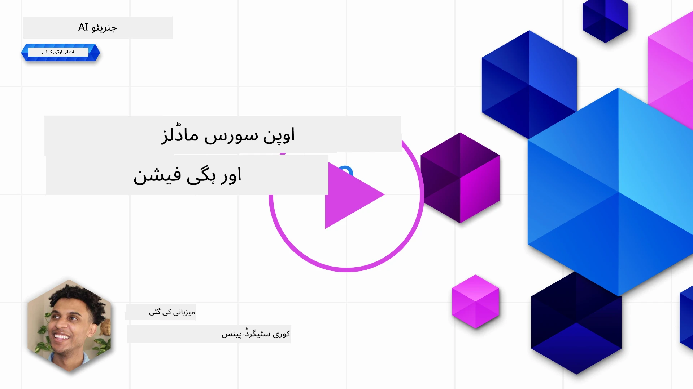
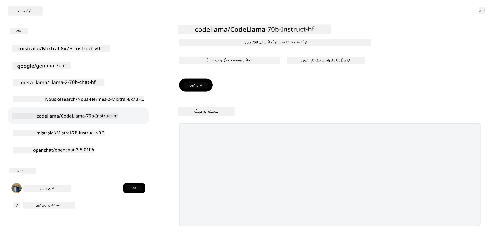

<!--
CO_OP_TRANSLATOR_METADATA:
{
  "original_hash": "85b754d4dc980f270f264d17116d9a5f",
  "translation_date": "2025-12-19T13:11:36+00:00",
  "source_file": "16-open-source-models/README.md",
  "language_code": "ur"
}
-->

## تعارف

اوپن سورس LLMs کی دنیا دلچسپ اور مسلسل ترقی پذیر ہے۔ یہ سبق اوپن سورس ماڈلز پر گہری نظر فراہم کرنے کا مقصد رکھتا ہے۔ اگر آپ یہ جاننا چاہتے ہیں کہ پروپرائٹری ماڈلز اوپن سورس ماڈلز کے مقابلے میں کیسے ہیں، تو ["Exploring and Comparing Different LLMs" سبق](../02-exploring-and-comparing-different-llms/README.md?WT.mc_id=academic-105485-koreyst) پر جائیں۔ یہ سبق فائن ٹیوننگ کے موضوع کو بھی کور کرے گا لیکن اس کی مزید تفصیلی وضاحت ["Fine-Tuning LLMs" سبق](../18-fine-tuning/README.md?WT.mc_id=academic-105485-koreyst) میں مل سکتی ہے۔

## سیکھنے کے مقاصد

- اوپن سورس ماڈلز کی سمجھ حاصل کرنا
- اوپن سورس ماڈلز کے ساتھ کام کرنے کے فوائد کو سمجھنا
- Hugging Face اور Azure AI Studio پر دستیاب اوپن ماڈلز کو دریافت کرنا

## اوپن سورس ماڈلز کیا ہیں؟

اوپن سورس سافٹ ویئر نے مختلف شعبوں میں ٹیکنالوجی کی ترقی میں اہم کردار ادا کیا ہے۔ اوپن سورس انیشیٹو (OSI) نے [سافٹ ویئر کے لیے 10 معیار](https://web.archive.org/web/20241126001143/https://opensource.org/osd?WT.mc_id=academic-105485-koreyst) متعین کیے ہیں تاکہ اسے اوپن سورس قرار دیا جا سکے۔ سورس کوڈ کو OSI کی منظور شدہ لائسنس کے تحت کھلے عام شیئر کیا جانا چاہیے۔

اگرچہ LLMs کی ترقی میں سافٹ ویئر کی ترقی کے مشابہ عناصر ہیں، لیکن یہ عمل بالکل ایک جیسا نہیں ہے۔ اس نے کمیونٹی میں LLMs کے سیاق و سباق میں اوپن سورس کی تعریف پر کافی بحث کو جنم دیا ہے۔ ایک ماڈل کو روایتی اوپن سورس تعریف کے مطابق بنانے کے لیے درج ذیل معلومات عوامی طور پر دستیاب ہونی چاہئیں:

- ماڈل کی تربیت کے لیے استعمال ہونے والے ڈیٹا سیٹس۔
- تربیت کے حصے کے طور پر مکمل ماڈل ویٹس۔
- تشخیصی کوڈ۔
- فائن ٹیوننگ کوڈ۔
- مکمل ماڈل ویٹس اور تربیتی میٹرکس۔

اس وقت صرف چند ماڈلز اس معیار پر پورے اترتے ہیں۔ [Allen Institute for Artificial Intelligence (AllenAI) کا OLMo ماڈل](https://huggingface.co/allenai/OLMo-7B?WT.mc_id=academic-105485-koreyst) اس زمرے میں آتا ہے۔

اس سبق کے لیے، ہم ماڈلز کو "اوپن ماڈلز" کہیں گے کیونکہ یہ تحریر کے وقت اوپر دیے گئے معیار سے مکمل طور پر میل نہیں کھا سکتے۔

## اوپن ماڈلز کے فوائد

**انتہائی حسب ضرورت** - چونکہ اوپن ماڈلز تفصیلی تربیتی معلومات کے ساتھ جاری کیے جاتے ہیں، محققین اور ڈویلپرز ماڈل کے اندرونی حصوں میں ترمیم کر سکتے ہیں۔ اس سے مخصوص کام یا مطالعہ کے شعبے کے لیے فائن ٹیونڈ انتہائی مخصوص ماڈلز بنانے کی سہولت ملتی ہے۔ اس کی مثالیں کوڈ جنریشن، ریاضیاتی عملیات اور حیاتیات ہیں۔

**لاگت** - ان ماڈلز کے استعمال اور تعیناتی کے لیے فی ٹوکن لاگت پروپرائٹری ماڈلز کے مقابلے میں کم ہوتی ہے۔ جب جنریٹو AI ایپلیکیشنز بنائی جا رہی ہوں، تو ان ماڈلز کے ساتھ آپ کے استعمال کے معاملے میں کارکردگی بمقابلہ قیمت کا جائزہ لینا چاہیے۔

ماخذ: Artificial Analysis

**لچک** - اوپن ماڈلز کے ساتھ کام کرنے سے آپ مختلف ماڈلز استعمال کرنے یا انہیں ملانے میں لچکدار ہوتے ہیں۔ اس کی ایک مثال [HuggingChat Assistants](https://huggingface.co/chat?WT.mc_id=academic-105485-koreyst) ہے جہاں صارف براہ راست یوزر انٹرفیس میں استعمال ہونے والا ماڈل منتخب کر سکتا ہے:

## مختلف اوپن ماڈلز کی دریافت

### Llama 2

[LLama2](https://huggingface.co/meta-llama?WT.mc_id=academic-105485-koreyst)، جو میٹا نے تیار کیا ہے، ایک اوپن ماڈل ہے جو چیٹ پر مبنی ایپلیکیشنز کے لیے بہتر بنایا گیا ہے۔ اس کی وجہ اس کی فائن ٹیوننگ کا طریقہ ہے، جس میں بڑی مقدار میں مکالمہ اور انسانی تاثرات شامل تھے۔ اس طریقہ کار سے ماڈل ایسے نتائج پیدا کرتا ہے جو انسانی توقعات کے زیادہ قریب ہوتے ہیں، جو بہتر صارف تجربہ فراہم کرتا ہے۔

Llama کے فائن ٹیونڈ ورژنز کی مثالوں میں [Japanese Llama](https://huggingface.co/elyza/ELYZA-japanese-Llama-2-7b?WT.mc_id=academic-105485-koreyst) شامل ہے جو جاپانی زبان میں مہارت رکھتا ہے اور [Llama Pro](https://huggingface.co/TencentARC/LLaMA-Pro-8B?WT.mc_id=academic-105485-koreyst) جو بنیادی ماڈل کا بہتر ورژن ہے۔

### Mistral

[Mistral](https://huggingface.co/mistralai?WT.mc_id=academic-105485-koreyst) ایک اوپن ماڈل ہے جو اعلی کارکردگی اور افادیت پر زور دیتا ہے۔ یہ Mixture-of-Experts طریقہ استعمال کرتا ہے جو ماہر ماڈلز کے گروپ کو ایک نظام میں ملاتا ہے جہاں ان پٹ کے مطابق مخصوص ماڈلز منتخب کیے جاتے ہیں۔ اس سے کمپیوٹیشن زیادہ مؤثر ہو جاتی ہے کیونکہ ماڈلز صرف ان ان پٹس کو ہینڈل کرتے ہیں جن میں وہ ماہر ہوتے ہیں۔

Mistral کے فائن ٹیونڈ ورژنز کی مثالوں میں [BioMistral](https://huggingface.co/BioMistral/BioMistral-7B?text=Mon+nom+est+Thomas+et+mon+principal?WT.mc_id=academic-105485-koreyst) شامل ہے جو طبی شعبے پر مرکوز ہے اور [OpenMath Mistral](https://huggingface.co/nvidia/OpenMath-Mistral-7B-v0.1-hf?WT.mc_id=academic-105485-koreyst) جو ریاضیاتی حساب کتاب کرتا ہے۔

### Falcon

[Falcon](https://huggingface.co/tiiuae?WT.mc_id=academic-105485-koreyst) ایک LLM ہے جو Technology Innovation Institute (**TII**) نے بنایا ہے۔ Falcon-40B کو 40 ارب پیرامیٹرز پر تربیت دی گئی ہے اور یہ کم کمپیوٹ بجٹ کے ساتھ GPT-3 سے بہتر کارکردگی دکھاتا ہے۔ اس کی وجہ FlashAttention الگورتھم اور ملٹی کوئری اٹینشن کا استعمال ہے جو انفرنس کے وقت میموری کی ضروریات کو کم کرتا ہے۔ اس کم انفرنس وقت کے ساتھ، Falcon-40B چیٹ ایپلیکیشنز کے لیے موزوں ہے۔

Falcon کے فائن ٹیونڈ ورژنز کی مثالوں میں [OpenAssistant](https://huggingface.co/OpenAssistant/falcon-40b-sft-top1-560?WT.mc_id=academic-105485-koreyst) شامل ہے، جو اوپن ماڈلز پر مبنی ایک اسسٹنٹ ہے، اور [GPT4ALL](https://huggingface.co/nomic-ai/gpt4all-falcon?WT.mc_id=academic-105485-koreyst) جو بنیادی ماڈل سے بہتر کارکردگی فراہم کرتا ہے۔

## انتخاب کیسے کریں

اوپن ماڈل منتخب کرنے کا کوئی ایک جواب نہیں ہے۔ شروع کرنے کے لیے Azure AI Studio کے "filter by task" فیچر کا استعمال ایک اچھا نقطہ آغاز ہے۔ یہ آپ کو سمجھنے میں مدد دے گا کہ ماڈل کو کس قسم کے کاموں کے لیے تربیت دی گئی ہے۔ Hugging Face بھی ایک LLM Leaderboard رکھتا ہے جو مخصوص میٹرکس کی بنیاد پر بہترین کارکردگی دکھانے والے ماڈلز کو ظاہر کرتا ہے۔

مختلف اقسام کے LLMs کا موازنہ کرنے کے لیے، [Artificial Analysis](https://artificialanalysis.ai/?WT.mc_id=academic-105485-koreyst) ایک اور بہترین ذریعہ ہے:

ماخذ: Artificial Analysis

اگر آپ کسی مخصوص استعمال کے معاملے پر کام کر رہے ہیں، تو اسی شعبے پر مرکوز فائن ٹیونڈ ورژنز کی تلاش مؤثر ہو سکتی ہے۔ متعدد اوپن ماڈلز کے ساتھ تجربہ کرنا اور دیکھنا کہ وہ آپ اور آپ کے صارفین کی توقعات کے مطابق کیسے کارکردگی دکھاتے ہیں، ایک اچھی مشق ہے۔

## اگلے اقدامات

اوپن ماڈلز کا سب سے اچھا حصہ یہ ہے کہ آپ ان کے ساتھ کام شروع کر سکتے ہیں بہت جلدی۔ [Azure AI Foundry Model Catalog](https://ai.azure.com?WT.mc_id=academic-105485-koreyst) دیکھیں، جس میں ایک مخصوص Hugging Face کلیکشن شامل ہے جس میں وہ ماڈلز ہیں جن پر ہم نے یہاں بات کی ہے۔

## سیکھنا یہاں ختم نہیں ہوتا، سفر جاری رکھیں

اس سبق کو مکمل کرنے کے بعد، ہمارے [Generative AI Learning collection](https://aka.ms/genai-collection?WT.mc_id=academic-105485-koreyst) کو دیکھیں تاکہ آپ اپنی جنریٹو AI کی معلومات کو مزید بڑھا سکیں!

---

<!-- CO-OP TRANSLATOR DISCLAIMER START -->
**دستخطی دستبرداری**:  
یہ دستاویز AI ترجمہ سروس [Co-op Translator](https://github.com/Azure/co-op-translator) کے ذریعے ترجمہ کی گئی ہے۔ اگرچہ ہم درستگی کے لیے کوشاں ہیں، براہ کرم آگاہ رہیں کہ خودکار ترجمے میں غلطیاں یا عدم درستیاں ہو سکتی ہیں۔ اصل دستاویز اپنی مادری زبان میں معتبر ماخذ سمجھی جانی چاہیے۔ اہم معلومات کے لیے پیشہ ور انسانی ترجمہ کی سفارش کی جاتی ہے۔ اس ترجمے کے استعمال سے پیدا ہونے والی کسی بھی غلط فہمی یا غلط تشریح کی ذمہ داری ہم پر عائد نہیں ہوتی۔
<!-- CO-OP TRANSLATOR DISCLAIMER END -->