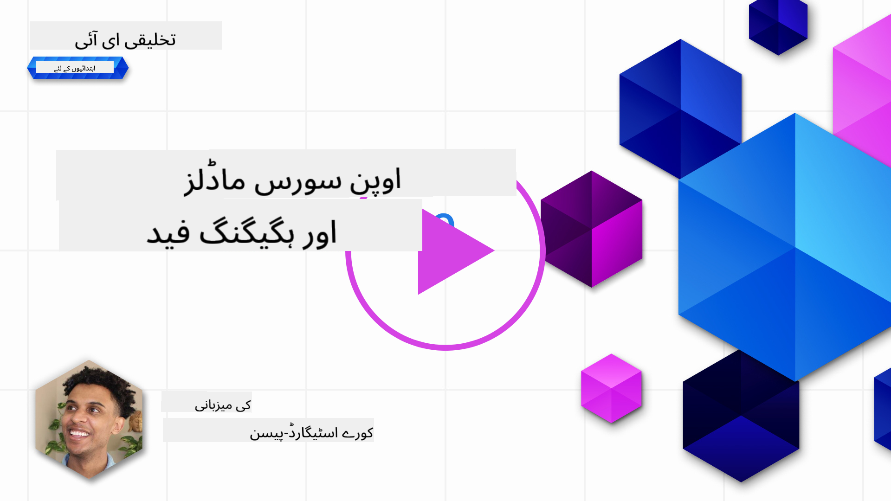
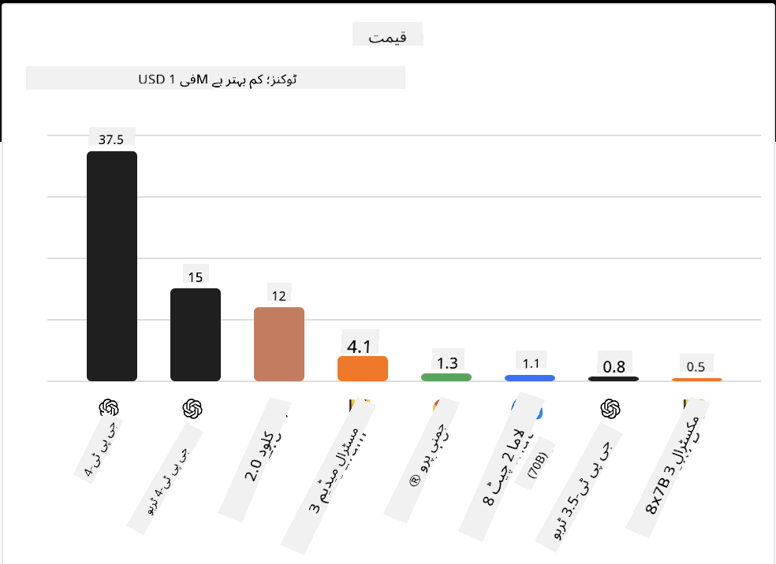
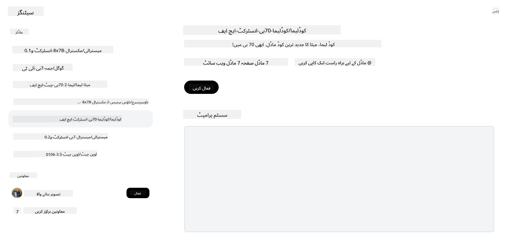
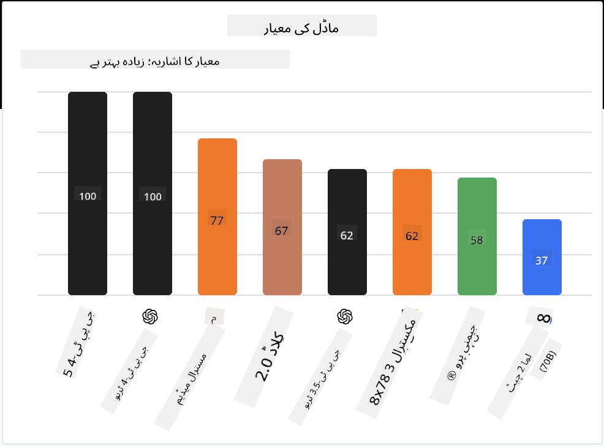

<!--
CO_OP_TRANSLATOR_METADATA:
{
  "original_hash": "0bba96e53ab841d99db731892a51fab8",
  "translation_date": "2025-06-25T23:49:30+00:00",
  "source_file": "16-open-source-models/README.md",
  "language_code": "ur"
}
-->

## تعارف

اوپن سورس LLMs کی دنیا دلچسپ اور مسلسل ترقی پذیر ہے۔ اس سبق کا مقصد اوپن سورس ماڈلز کا گہرائی سے جائزہ فراہم کرنا ہے۔ اگر آپ یہ جاننا چاہتے ہیں کہ ملکیتی ماڈلز کا اوپن سورس ماڈلز سے کیسے موازنہ کیا جاتا ہے تو ["Exploring and Comparing Different LLMs" سبق](../02-exploring-and-comparing-different-llms/README.md?WT.mc_id=academic-105485-koreyst) پر جائیں۔ یہ سبق فائن ٹیوننگ کے موضوع کا بھی احاطہ کرے گا لیکن ایک زیادہ تفصیلی وضاحت ["Fine-Tuning LLMs" سبق](../18-fine-tuning/README.md?WT.mc_id=academic-105485-koreyst) میں مل سکتی ہے۔

## سیکھنے کے مقاصد

- اوپن سورس ماڈلز کی سمجھ حاصل کریں
- اوپن سورس ماڈلز کے ساتھ کام کرنے کے فوائد کو سمجھیں
- Hugging Face اور Azure AI Studio پر دستیاب اوپن ماڈلز کی تلاش

## اوپن سورس ماڈلز کیا ہیں؟

اوپن سورس سافٹ ویئر نے مختلف شعبوں میں ٹیکنالوجی کی ترقی میں اہم کردار ادا کیا ہے۔ اوپن سورس انیشیٹو (OSI) نے [سافٹ ویئر کے لیے 10 معیار](https://web.archive.org/web/20241126001143/https://opensource.org/osd?WT.mc_id=academic-105485-koreyst) کی وضاحت کی ہے تاکہ اسے اوپن سورس کے طور پر درجہ بندی کیا جا سکے۔ سورس کوڈ کو OSI کی منظور شدہ لائسنس کے تحت کھلے عام شیئر کیا جانا چاہیے۔

LLMs کی ترقی میں سافٹ ویئر کی ترقی کے ساتھ کچھ مماثلتیں ہیں، لیکن یہ عمل بالکل ایک جیسا نہیں ہے۔ اس نے کمیونٹی میں LLMs کے تناظر میں اوپن سورس کی تعریف پر بہت زیادہ بحث کو جنم دیا ہے۔ ایک ماڈل کو روایتی اوپن سورس تعریف کے مطابق بنانے کے لیے درج ذیل معلومات عوامی طور پر دستیاب ہونی چاہئیں:

- ماڈل کو تربیت دینے کے لیے استعمال کیے گئے ڈیٹا سیٹس۔
- تربیت کے ایک حصے کے طور پر مکمل ماڈل ویٹس۔
- تشخیص کا کوڈ۔
- فائن ٹیوننگ کوڈ۔
- مکمل ماڈل ویٹس اور تربیتی میٹرکس۔

فی الحال صرف چند ماڈلز ہیں جو اس معیار سے میل کھاتے ہیں۔ [OLMo ماڈل جو Allen Institute for Artificial Intelligence (AllenAI) نے بنایا ہے](https://huggingface.co/allenai/OLMo-7B?WT.mc_id=academic-105485-koreyst) اس زمرے میں آتا ہے۔

اس سبق کے لیے، ہم ان ماڈلز کو "اوپن ماڈلز" کہیں گے کیونکہ وہ تحریر کے وقت اوپر بیان کردہ معیار سے مطابقت نہیں رکھتے ہو سکتے ہیں۔

## اوپن ماڈلز کے فوائد

**انتہائی حسب ضرورت** - چونکہ اوپن ماڈلز کو تفصیلی تربیتی معلومات کے ساتھ جاری کیا جاتا ہے، محققین اور ڈویلپرز ماڈل کے اندرونی حصوں میں ترمیم کر سکتے ہیں۔ یہ انتہائی مخصوص کام یا مطالعہ کے شعبے کے لیے فائن ٹیونڈ ماڈلز کی تخلیق کو قابل بناتا ہے۔ اس کی کچھ مثالیں کوڈ جنریشن، ریاضیاتی آپریشنز اور بایولوجی ہیں۔

**قیمت** - ان ماڈلز کو استعمال کرنے اور تعینات کرنے کی قیمت فی ٹوکن ملکیتی ماڈلز کے مقابلے میں کم ہے۔ جب Generative AI ایپلی کیشنز بنا رہے ہوں، تو اپنی استعمال کے کیس پر ان ماڈلز کے ساتھ کام کرتے وقت کارکردگی بمقابلہ قیمت کو دیکھنا چاہیے۔

 
ماخذ: Artificial Analysis

**لچک** - اوپن ماڈلز کے ساتھ کام کرنے سے آپ کو مختلف ماڈلز استعمال کرنے یا ان کو یکجا کرنے کے لحاظ سے لچک حاصل ہوتی ہے۔ اس کی ایک مثال [HuggingChat Assistants](https://huggingface.co/chat?WT.mc_id=academic-105485-koreyst) ہے جہاں صارف انٹرفیس میں براہ راست استعمال ہونے والے ماڈل کا انتخاب کر سکتا ہے:

## مختلف اوپن ماڈلز کی تلاش

### Llama 2

[LLama2](https://huggingface.co/meta-llama?WT.mc_id=academic-105485-koreyst)، جو Meta نے تیار کیا ہے، ایک اوپن ماڈل ہے جو چیٹ پر مبنی ایپلی کیشنز کے لیے موزوں ہے۔ یہ اس کے فائن ٹیوننگ طریقہ کی وجہ سے ہے، جس میں بہت زیادہ مکالمہ اور انسانی رائے شامل تھی۔ اس طریقے کے ساتھ، ماڈل زیادہ نتائج پیدا کرتا ہے جو انسانی توقعات کے مطابق ہوتے ہیں جو بہتر صارف کا تجربہ فراہم کرتا ہے۔

Llama کے فائن ٹیونڈ ورژنز کی کچھ مثالوں میں [Japanese Llama](https://huggingface.co/elyza/ELYZA-japanese-Llama-2-7b?WT.mc_id=academic-105485-koreyst) شامل ہے، جو جاپانی زبان میں مہارت رکھتا ہے اور [Llama Pro](https://huggingface.co/TencentARC/LLaMA-Pro-8B?WT.mc_id=academic-105485-koreyst)، جو بنیادی ماڈل کا ایک بہتر ورژن ہے۔

### Mistral

[Mistral](https://huggingface.co/mistralai?WT.mc_id=academic-105485-koreyst) ایک اوپن ماڈل ہے جو اعلی کارکردگی اور کارکردگی پر زور دیتا ہے۔ یہ Mixture-of-Experts طریقہ کار کا استعمال کرتا ہے جو مخصوص ماہر ماڈلز کے ایک گروپ کو ایک نظام میں یکجا کرتا ہے جہاں ان پٹ کے لحاظ سے، کچھ ماڈلز کو استعمال کے لیے منتخب کیا جاتا ہے۔ یہ حساب کتاب کو زیادہ مؤثر بناتا ہے کیونکہ ماڈلز صرف ان ان پٹس کو ایڈریس کر رہے ہیں جن میں وہ مہارت رکھتے ہیں۔

Mistral کے فائن ٹیونڈ ورژنز کی کچھ مثالوں میں [BioMistral](https://huggingface.co/BioMistral/BioMistral-7B?text=Mon+nom+est+Thomas+et+mon+principal?WT.mc_id=academic-105485-koreyst) شامل ہے، جو طبی شعبے پر مرکوز ہے اور [OpenMath Mistral](https://huggingface.co/nvidia/OpenMath-Mistral-7B-v0.1-hf?WT.mc_id=academic-105485-koreyst)، جو ریاضیاتی حساب کتاب انجام دیتا ہے۔

### Falcon

[Falcon](https://huggingface.co/tiiuae?WT.mc_id=academic-105485-koreyst) ایک LLM ہے جو ٹیکنالوجی انوویشن انسٹی ٹیوٹ (**TII**) نے بنایا ہے۔ Falcon-40B کو 40 ارب پیرامیٹرز پر تربیت دی گئی ہے جس نے کم کمپیوٹ بجٹ کے ساتھ GPT-3 سے بہتر کارکردگی کا مظاہرہ کیا ہے۔ یہ FlashAttention الگوردم اور ملٹی کوئری توجہ کے استعمال کی وجہ سے ہے جو اسے انفرنس کے وقت میموری کی ضروریات کو کم کرنے کے قابل بناتا ہے۔ اس کم انفرنس وقت کے ساتھ، Falcon-40B چیٹ ایپلی کیشنز کے لیے موزوں ہے۔

Falcon کے فائن ٹیونڈ ورژنز کی کچھ مثالیں [OpenAssistant](https://huggingface.co/OpenAssistant/falcon-40b-sft-top1-560?WT.mc_id=academic-105485-koreyst)، اوپن ماڈلز پر بنایا گیا ایک اسسٹنٹ اور [GPT4ALL](https://huggingface.co/nomic-ai/gpt4all-falcon?WT.mc_id=academic-105485-koreyst)، جو بنیادی ماڈل سے زیادہ کارکردگی فراہم کرتا ہے۔

## انتخاب کیسے کریں

اوپن ماڈل کا انتخاب کرنے کے لیے کوئی ایک جواب نہیں ہے۔ ایک اچھی جگہ شروع کرنے کے لیے Azure AI Studio کی ٹاسک کے لحاظ سے فلٹر کرنے کی خصوصیت کا استعمال ہے۔ یہ آپ کو سمجھنے میں مدد دے گا کہ ماڈل کو کس قسم کے کاموں کے لیے تربیت دی گئی ہے۔ Hugging Face بھی ایک LLM لیڈر بورڈ کو برقرار رکھتا ہے جو آپ کو کچھ میٹرکس کی بنیاد پر بہترین کارکردگی کا مظاہرہ کرنے والے ماڈلز دکھاتا ہے۔

مختلف اقسام میں LLMs کا موازنہ کرنے کے لیے دیکھتے وقت، [Artificial Analysis](https://artificialanalysis.ai/?WT.mc_id=academic-105485-koreyst) ایک اور بہترین ذریعہ ہے:

 
ماخذ: Artifical Analysis

اگر کسی مخصوص استعمال کے کیس پر کام کر رہے ہیں، تو اسی علاقے پر مرکوز فائن ٹیونڈ ورژنز کی تلاش مؤثر ثابت ہو سکتی ہے۔ یہ دیکھنے کے لیے متعدد اوپن ماڈلز کے ساتھ تجربہ کرنا کہ وہ آپ اور آپ کے صارفین کی توقعات کے مطابق کیسے کارکردگی کا مظاہرہ کرتے ہیں، ایک اور اچھی مشق ہے۔

## اگلے مراحل

اوپن ماڈلز کے بارے میں بہترین بات یہ ہے کہ آپ ان کے ساتھ کام کرنا بہت جلد شروع کر سکتے ہیں۔ [Azure AI Studio Model Catalog](https://ai.azure.com?WT.mc_id=academic-105485-koreyst) کو دیکھیں، جس میں ہم نے یہاں جن ماڈلز پر بات کی ہے ان کے ساتھ ایک مخصوص Hugging Face مجموعہ پیش کیا گیا ہے۔

## سیکھنا یہاں نہیں رکتا، سفر جاری رکھیں

اس سبق کو مکمل کرنے کے بعد، ہمارے [Generative AI Learning collection](https://aka.ms/genai-collection?WT.mc_id=academic-105485-koreyst) کو دیکھیں تاکہ آپ اپنی Generative AI کی معلومات کو مزید بہتر بنا سکیں!

**ڈس کلیمر**:  
یہ دستاویز AI ترجمہ سروس [Co-op Translator](https://github.com/Azure/co-op-translator) کا استعمال کرتے ہوئے ترجمہ کی گئی ہے۔ اگرچہ ہم درستگی کے لئے کوشاں ہیں، براہ کرم آگاہ رہیں کہ خودکار ترجمے میں غلطیاں یا غلط فہمیاں ہو سکتی ہیں۔ اصل دستاویز کو اس کی مقامی زبان میں مستند ذریعہ سمجھا جانا چاہیے۔ اہم معلومات کے لئے، پیشہ ورانہ انسانی ترجمہ کی سفارش کی جاتی ہے۔ اس ترجمے کے استعمال سے پیدا ہونے والی کسی بھی غلط فہمی یا غلط تشریح کے لئے ہم ذمہ دار نہیں ہیں۔