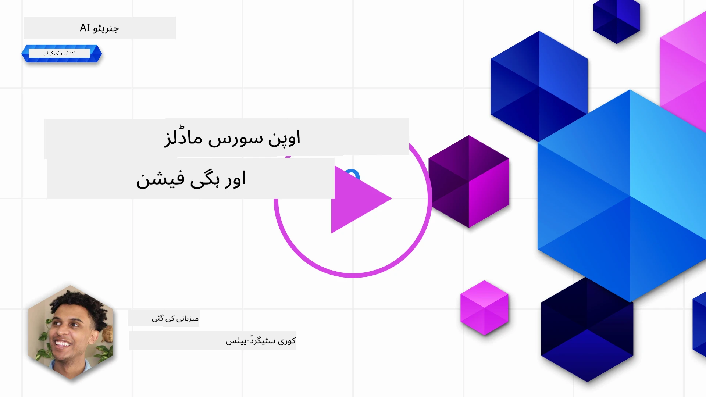
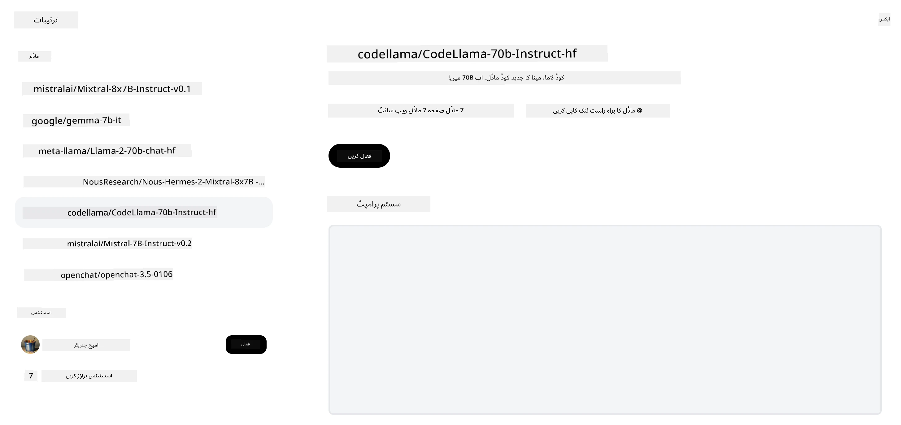

## تعارف

اوپن سورس ایل ایل ایمز کی دنیا دلچسپ اور مسلسل ترقی پذیر ہے۔ یہ سبق اوپن سورس ماڈلز کا ایک جامع جائزہ فراہم کرنے کا مقصد رکھتا ہے۔ اگر آپ کو یہ جاننے میں دلچسپی ہے کہ کس طرح پروپرائٹری ماڈلز اوپن سورس ماڈلز سے مختلف ہیں تو ["Exploring and Comparing Different LLMs" سبق](../02-exploring-and-comparing-different-llms/README.md?WT.mc_id=academic-105485-koreyst) دیکھیں۔ یہ سبق فائن ٹوننگ کے موضوع کو بھی شامل کرے گا لیکن اس کی تفصیلات کے لئے آپ ["Fine-Tuning LLMs" سبق](../18-fine-tuning/README.md?WT.mc_id=academic-105485-koreyst) ملاحظہ کریں۔

## سیکھنے کے مقاصد

- اوپن سورس ماڈلز کی سمجھ بوجھ حاصل کرنا
- اوپن سورس ماڈلز کے ساتھ کام کرنے کے فوائد کو سمجھنا
- ہگیگ فیس اور مائیکروسافٹ فاؤنڈری ماڈل کٹلاگ پر دستیاب اوپن ماڈلز کو دریافت کرنا

## اوپن سورس ماڈلز کیا ہیں؟

اوپن سورس سافٹ ویئر نے مختلف میدانوں میں ٹیکنالوجی کی ترقی میں اہم کردار ادا کیا ہے۔ اوپن سورس انیشیٹو (OSI) نے [سافٹ ویئر کے لیے 10 معیار](https://web.archive.org/web/20241126001143/https://opensource.org/osd?WT.mc_id=academic-105485-koreyst) متعین کیے ہیں تاکہ اسے اوپن سورس قرار دیا جائے۔ سورس کوڈ کو OSI کی منظور شدہ لائسنس کے تحت کھلے عام شیئر کیا جانا چاہیے۔

جہاں ایل ایل ایمز کی ترقی میں سافٹ ویئر کی ترقی جیسے عناصر پائے جاتے ہیں، وہی عمل بالکل ایک جیسا نہیں ہوتا۔ اس موضوع پر کمیونٹی میں اوپن سورس کی تعریف پر کافی بحث ہوئی ہے۔ ماڈل کو روایتی اوپن سورس تعریف کے مطابق بنانے کے لیے درج ذیل معلومات عوامی سطح پر دستیاب ہونی چاہئیں:

- ماڈل کو تربیت دینے کے لیے استعمال ہونے والے ڈیٹا سیٹس۔
- تربیت کے حصے کے طور پر مکمل ماڈل ویٹس۔
- تشخیصی کوڈ۔
- فائن ٹوننگ کوڈ۔
- مکمل ماڈل ویٹس اور تربیتی میٹرکس۔

اس وقت صرف چند ماڈلز اس معیار پر پورے اترتے ہیں۔ [ایلن انسٹی ٹیوٹ فار آرٹیفیشل انٹیلی جنس (AllenAI) کی طرف سے بنایا گیا OLMo ماڈل](https://huggingface.co/allenai/OLMo-7B?WT.mc_id=academic-105485-koreyst) ایک ایسا ماڈل ہے جو اس زمرے میں آتا ہے۔

اس سبق کے لیے، ہم آگے بڑھتے ہوئے ان ماڈلز کو "اوپن ماڈلز" کہیں گے کیونکہ یہ اس وقت مذکورہ معیار پر پورے نہیں بھی ہو سکتے۔

## اوپن ماڈلز کے فوائد

**بہت زیادہ کسٹمائزایبل** - چونکہ اوپن ماڈلز تفصیلی تربیتی معلومات کے ساتھ جاری کیے جاتے ہیں، محققین اور ڈیولپرز ماڈل کے اندرونی حصوں میں ترمیم کر سکتے ہیں۔ یہ ایسی ماڈلز بنانے کے قابل بناتا ہے جو خاص کام یا مطالعے کے ایک شعبے کے لیے بہترین ہیں۔ اس کی مثالوں میں کوڈ جنریشن، ریاضیاتی عمل اور حیاتیات شامل ہیں۔

**لاگت** - ان ماڈلز کو استعمال کرنے اور تعینات کرنے کی فی ٹوکن قیمت پروپرائٹری ماڈلز کی نسبت کم ہوتی ہے۔ جنریٹیو AI ایپلیکیشنز کے لیے، اپنی ضروریات کے مطابق ان ماڈلز کی کارکردگی بمقابلہ قیمت کو موازنہ کرنا ضروری ہوتا ہے۔

ماخذ: آرٹیفیشل انالیسس

**لچک** - اوپن ماڈلز کے ساتھ کام کرنے سے مختلف ماڈلز کو استعمال کرنے یا انہیں ترکیب کرنے میں لچک حاصل ہوتی ہے۔ ایک مثال [ہگیگ چیٹ اسسٹنٹس](https://huggingface.co/chat?WT.mc_id=academic-105485-koreyst) ہے جہاں صارف ماڈل کو انٹرفیس سے منتخب کر سکتا ہے:

## مختلف اوپن ماڈلز کی تلاش

### للاما 2

[LLama2](https://huggingface.co/meta-llama?WT.mc_id=academic-105485-koreyst)، میٹا کی طرف سے تیار کردہ، ایک اوپن ماڈل ہے جو چیٹ پر مبنی ایپلیکیشنز کے لیے بہتر بنایا گیا ہے۔ یہ اس کی فائن ٹوننگ طریقہ کار کی وجہ سے ہے، جس میں بڑی مقدار میں مکالمہ اور انسانی فیڈبیک شامل تھا۔ اس طریقہ سے، ماڈل زیادہ نتائج پیدا کرتا ہے جو انسانی توقعات سے ہم آہنگ ہوتے ہیں اور بہتر صارف تجربہ فراہم کرتے ہیں۔

للاما کے کچھ فائن ٹونڈ ورژنز کی مثالوں میں [جاپانی للاما](https://huggingface.co/elyza/ELYZA-japanese-Llama-2-7b?WT.mc_id=academic-105485-koreyst) ہے جو جاپانی زبان میں مہارت رکھتا ہے اور [Llama Pro](https://huggingface.co/TencentARC/LLaMA-Pro-8B?WT.mc_id=academic-105485-koreyst) ہے جو بنیادی ماڈل کا بہتر ورژن ہے۔

### میسٹرال

[Mistral](https://huggingface.co/mistralai?WT.mc_id=academic-105485-koreyst) ایک اوپن ماڈل ہے جو اعلیٰ کارکردگی اور ایفیشینسی پر زور دیتا ہے۔ یہ Mixture-of-Experts طریقہ استعمال کرتا ہے جو ماہر ماڈلز کے ایک گروہ کو ایک نظام میں ضم کرتا ہے، جہاں ان پٹ کے مطابق مخصوص ماڈلز منتخب کیے جاتے ہیں۔ اس سے کمپیوٹیشن زیادہ مؤثر ہوتی ہے کیونکہ ماڈلز صرف ان ان پٹس کو ہی ہینڈل کرتے ہیں جن میں وہ ماہر ہوتے ہیں۔

میسٹرال کے بعض فائن ٹونڈ ورژنز کی مثالوں میں [BioMistral](https://huggingface.co/BioMistral/BioMistral-7B?text=Mon+nom+est+Thomas+et+mon+principal?WT.mc_id=academic-105485-koreyst) ہے جو طبی شعبے پر مرکوز ہے اور [OpenMath Mistral](https://huggingface.co/nvidia/OpenMath-Mistral-7B-v0.1-hf?WT.mc_id=academic-105485-koreyst) ہے جو ریاضیاتی حساب کتاب انجام دیتا ہے۔

### فالکن

[Falcon](https://huggingface.co/tiiuae?WT.mc_id=academic-105485-koreyst) ٹیکنالوجی انوویشن انسٹی ٹیوٹ (**TII**) کی تخلیق کردہ ایک ایل ایل ایم ہے۔ فالکن-40B کو 40 ارب پیرا میٹرز پر تربیت دی گئی، جس نے کم کمپیوٹ بجٹ کے ساتھ GPT-3 سے بہتر کارکردگی دکھائی ہے۔ یہ ان کی FlashAttention الگورتھم اور ملٹی کوئری اٹینشن کے استعمال کی وجہ سے ہے جو انفرینس کے وقت میموری کی ضروریات کو کم کرتا ہے۔ اس کم وقت کی وجہ سے فالکن-40B چیٹ ایپلیکیشنز کے لیے مناسب ہے۔

فالکن کے کچھ فائن ٹونڈ ورژنز کی مثالوں میں [OpenAssistant](https://huggingface.co/OpenAssistant/falcon-40b-sft-top1-560?WT.mc_id=academic-105485-koreyst) شامل ہے، جو اوپن ماڈلز پر مبنی ایک اسسٹنٹ ہے اور [GPT4ALL](https://huggingface.co/nomic-ai/gpt4all-falcon?WT.mc_id=academic-105485-koreyst) ہے جو بیس ماڈل سے بہتر کارکردگی فراہم کرتا ہے۔

## انتخاب کا طریقہ

اوپن ماڈل منتخب کرنے کے لیے کوئی واحد درست جواب نہیں ہے۔ ایک اچھا آغاز مائیکروسافٹ فاؤنڈری ماڈل کٹلاگ کے ٹاسک کے ذریعے فلٹر کرنے کی خصوصیت استعمال کرنا ہے۔ یہ آپ کی مدد کرے گا کہ ماڈل کن کن اقسام کے کاموں کے لیے تربیت یافتہ ہے۔ ہگیگ فیس بھی ایک ایل ایل ایم لیڈر بورڈ برقرار رکھتا ہے جو مخصوص میٹرکس کی بنیاد پر بہترین ماڈلز دکھاتا ہے۔

مختلف اقسام کے ایل ایل ایمز کے موازنہ کے لیے [Artificial Analysis](https://artificialanalysis.ai/?WT.mc_id=academic-105485-koreyst) ایک بہترین وسیلہ ہے:

ماخذ: آرٹیفیشل انالیسس

اگر آپ کسی خاص استعمال کے کیس پر کام کر رہے ہیں تو، اسی شعبے پر مرکوز فائن ٹونڈ ورژنز تلاش کرنا مؤثر ہو سکتا ہے۔ متعدد اوپن ماڈلز کے ساتھ تجربہ کر کے دیکھنا کہ وہ آپ اور آپ کے صارفین کی توقعات کے مطابق کیسے کارکردگی دکھاتے ہیں، ایک اچھی مشق ہے۔

## اگلے مراحل

اوپن ماڈلز کی سب سے بہترین بات یہ ہے کہ آپ ان کے ساتھ بہت جلد کام شروع کر سکتے ہیں۔ [مائیکروسافٹ فاؤنڈری ماڈل کٹلاگ](https://ai.azure.com?WT.mc_id=academic-105485-koreyst) کو دیکھیں، جس میں ان ماڈلز کا ایک خاص ہگیگ فیس کلیکشن شامل ہے جن پر ہم نے یہاں بات کی ہے۔

## سیکھنا یہاں ختم نہیں ہوتا، سفر جاری رکھیں

اس سبق کو مکمل کرنے کے بعد، ہماری [Generative AI Learning collection](https://aka.ms/genai-collection?WT.mc_id=academic-105485-koreyst) دیکھیں تاکہ آپ اپنی جنریٹیو AI کی مہارت کو مزید بڑھا سکیں!

---

<!-- CO-OP TRANSLATOR DISCLAIMER START -->
**ڈس کلیمر**:
یہ دستاویز AI ترجمہ سروس [Co-op Translator](https://github.com/Azure/co-op-translator) کے ذریعے ترجمہ کی گئی ہے۔ جبکہ ہم درستگی کے لیے کوشاں ہیں، براہ کرم اس بات سے آگاہ رہیں کہ خودکار ترجمے میں غلطیاں یا عدم درستیاں ہو سکتی ہیں۔ اصل دستاویز اپنے مادری زبان میں مستند ماخذ سمجھی جائے گی۔ حساس معلومات کے لیے پیشہ ور انسانی ترجمہ کی سفارش کی جاتی ہے۔ اس ترجمے کے استعمال سے پیدا ہونے والی کسی بھی غلط فہمی یا غلط تشریح کی ذمہ داری ہم قبول نہیں کرتے۔
<!-- CO-OP TRANSLATOR DISCLAIMER END -->