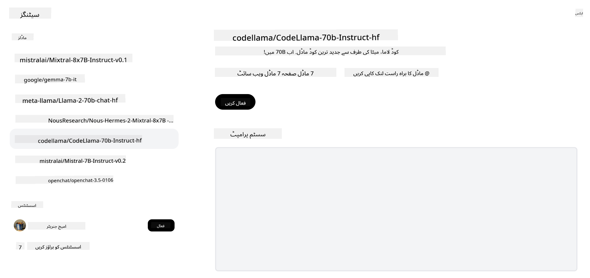

<!--
CO_OP_TRANSLATOR_METADATA:
{
  "original_hash": "0bba96e53ab841d99db731892a51fab8",
  "translation_date": "2025-07-09T17:04:36+00:00",
  "source_file": "16-open-source-models/README.md",
  "language_code": "ur"
}
-->

## تعارف

اوپن سورس LLMs کی دنیا دلچسپ اور مسلسل ترقی پذیر ہے۔ یہ سبق اوپن سورس ماڈلز کا تفصیلی جائزہ فراہم کرنے کا مقصد رکھتا ہے۔ اگر آپ یہ جاننا چاہتے ہیں کہ پروپرائٹری ماڈلز اوپن سورس ماڈلز کے مقابلے میں کیسے ہیں، تو ["Exploring and Comparing Different LLMs" سبق](../02-exploring-and-comparing-different-llms/README.md?WT.mc_id=academic-105485-koreyst) دیکھیں۔ اس سبق میں fine-tuning کا موضوع بھی شامل ہے، لیکن اس کی مزید تفصیل ["Fine-Tuning LLMs" سبق](../18-fine-tuning/README.md?WT.mc_id=academic-105485-koreyst) میں ملے گی۔

## سیکھنے کے مقاصد

- اوپن سورس ماڈلز کی سمجھ حاصل کرنا  
- اوپن سورس ماڈلز کے ساتھ کام کرنے کے فوائد کو سمجھنا  
- Hugging Face اور Azure AI Studio پر دستیاب اوپن ماڈلز کو دریافت کرنا  

## اوپن سورس ماڈلز کیا ہیں؟

اوپن سورس سافٹ ویئر نے مختلف شعبوں میں ٹیکنالوجی کی ترقی میں اہم کردار ادا کیا ہے۔ Open Source Initiative (OSI) نے [سافٹ ویئر کے لیے 10 معیارات](https://web.archive.org/web/20241126001143/https://opensource.org/osd?WT.mc_id=academic-105485-koreyst) متعین کیے ہیں تاکہ اسے اوپن سورس قرار دیا جا سکے۔ سورس کوڈ کو OSI کی منظور شدہ لائسنس کے تحت کھلے عام شیئر کیا جانا چاہیے۔

اگرچہ LLMs کی ترقی سافٹ ویئر کی ترقی سے مشابہت رکھتی ہے، لیکن یہ عمل بالکل ایک جیسا نہیں ہے۔ اس وجہ سے کمیونٹی میں LLMs کے سیاق و سباق میں اوپن سورس کی تعریف پر کافی بحث ہوئی ہے۔ روایتی اوپن سورس تعریف کے مطابق، ایک ماڈل کے لیے درج ذیل معلومات عوامی طور پر دستیاب ہونی چاہئیں:

- ماڈل کی تربیت کے لیے استعمال ہونے والے ڈیٹا سیٹس  
- تربیت کے دوران مکمل ماڈل ویٹس  
- تشخیصی کوڈ  
- fine-tuning کا کوڈ  
- مکمل ماڈل ویٹس اور تربیتی میٹرکس  

اس معیار پر پورا اترنے والے صرف چند ماڈلز موجود ہیں۔ [Allen Institute for Artificial Intelligence (AllenAI) کا OLMo ماڈل](https://huggingface.co/allenai/OLMo-7B?WT.mc_id=academic-105485-koreyst) اس زمرے میں آتا ہے۔

اس سبق میں، ہم ماڈلز کو "اوپن ماڈلز" کہیں گے کیونکہ ممکن ہے کہ تحریر کے وقت وہ مذکورہ معیار پر پورے نہ اترتے ہوں۔

## اوپن ماڈلز کے فوائد

**بہت زیادہ حسب ضرورت** - چونکہ اوپن ماڈلز تفصیلی تربیتی معلومات کے ساتھ جاری کیے جاتے ہیں، محققین اور ڈویلپرز ماڈل کے اندرونی حصوں میں ترمیم کر سکتے ہیں۔ اس سے خاص کام یا مطالعے کے شعبے کے لیے ماہر ماڈلز بنانے کی سہولت ملتی ہے۔ اس کی مثالیں کوڈ جنریشن، ریاضیاتی عملیات اور حیاتیات ہیں۔

**لاگت** - ان ماڈلز کے استعمال اور تعیناتی کی فی ٹوکن لاگت پروپرائٹری ماڈلز کے مقابلے میں کم ہوتی ہے۔ جب Generative AI ایپلیکیشنز بنائی جائیں، تو اپنے استعمال کے کیس کے لیے کارکردگی اور قیمت کا موازنہ کرنا ضروری ہے۔

  
ماخذ: Artificial Analysis

**لچک** - اوپن ماڈلز کے ساتھ کام کرنے سے آپ مختلف ماڈلز استعمال کرنے یا انہیں ملانے میں لچکدار ہوتے ہیں۔ اس کی مثال [HuggingChat Assistants](https://huggingface.co/chat?WT.mc_id=academic-105485-koreyst) ہے جہاں صارف براہ راست یوزر انٹرفیس میں ماڈل منتخب کر سکتا ہے:

## مختلف اوپن ماڈلز کی دریافت

### Llama 2

[LLama2](https://huggingface.co/meta-llama?WT.mc_id=academic-105485-koreyst)، جو میٹا نے تیار کیا ہے، ایک اوپن ماڈل ہے جو چیٹ پر مبنی ایپلیکیشنز کے لیے بہتر بنایا گیا ہے۔ اس کی fine-tuning کی تکنیک میں بڑی مقدار میں مکالمہ اور انسانی فیڈبیک شامل ہے۔ اس طریقے سے ماڈل ایسے نتائج دیتا ہے جو انسانی توقعات کے زیادہ قریب ہوتے ہیں، جس سے صارف کا تجربہ بہتر ہوتا ہے۔

Llama کے fine-tuned ورژنز کی مثالیں ہیں [Japanese Llama](https://huggingface.co/elyza/ELYZA-japanese-Llama-2-7b?WT.mc_id=academic-105485-koreyst) جو جاپانی زبان میں مہارت رکھتا ہے، اور [Llama Pro](https://huggingface.co/TencentARC/LLaMA-Pro-8B?WT.mc_id=academic-105485-koreyst) جو بنیادی ماڈل کا بہتر ورژن ہے۔

### Mistral

[Mistral](https://huggingface.co/mistralai?WT.mc_id=academic-105485-koreyst) ایک اوپن ماڈل ہے جو اعلی کارکردگی اور مؤثریت پر زور دیتا ہے۔ یہ Mixture-of-Experts طریقہ استعمال کرتا ہے، جس میں ماہر ماڈلز کا ایک گروپ ایک نظام میں ملایا جاتا ہے، جہاں ان پٹ کے مطابق مخصوص ماڈلز منتخب کیے جاتے ہیں۔ اس سے کمپیوٹیشن زیادہ مؤثر ہو جاتی ہے کیونکہ ماڈلز صرف ان ان پٹس کو ہینڈل کرتے ہیں جن میں وہ ماہر ہوتے ہیں۔

Mistral کے fine-tuned ورژنز کی مثالیں ہیں [BioMistral](https://huggingface.co/BioMistral/BioMistral-7B?text=Mon+nom+est+Thomas+et+mon+principal?WT.mc_id=academic-105485-koreyst) جو طبی شعبے پر مرکوز ہے، اور [OpenMath Mistral](https://huggingface.co/nvidia/OpenMath-Mistral-7B-v0.1-hf?WT.mc_id=academic-105485-koreyst) جو ریاضیاتی حساب کتاب کرتا ہے۔

### Falcon

[Falcon](https://huggingface.co/tiiuae?WT.mc_id=academic-105485-koreyst) ایک LLM ہے جو Technology Innovation Institute (**TII**) نے بنایا ہے۔ Falcon-40B کو 40 ارب پیرامیٹرز پر تربیت دی گئی ہے، جس نے کم کمپیوٹ بجٹ کے ساتھ GPT-3 سے بہتر کارکردگی دکھائی ہے۔ یہ FlashAttention الگورتھم اور multiquery attention کے استعمال کی بدولت ممکن ہوا ہے، جو inference کے وقت میموری کی ضرورت کو کم کرتا ہے۔ اس کم inference وقت کی وجہ سے Falcon-40B چیٹ ایپلیکیشنز کے لیے موزوں ہے۔

Falcon کے fine-tuned ورژنز کی مثالیں ہیں [OpenAssistant](https://huggingface.co/OpenAssistant/falcon-40b-sft-top1-560?WT.mc_id=academic-105485-koreyst)، جو اوپن ماڈلز پر مبنی ایک اسسٹنٹ ہے، اور [GPT4ALL](https://huggingface.co/nomic-ai/gpt4all-falcon?WT.mc_id=academic-105485-koreyst) جو بنیادی ماڈل سے بہتر کارکردگی فراہم کرتا ہے۔

## انتخاب کیسے کریں

اوپن ماڈل منتخب کرنے کا کوئی واحد جواب نہیں ہے۔ شروع کرنے کے لیے Azure AI Studio کے filter by task فیچر کا استعمال کریں۔ یہ آپ کو سمجھنے میں مدد دے گا کہ ماڈل کو کس قسم کے کاموں کے لیے تربیت دی گئی ہے۔ Hugging Face بھی ایک LLM Leaderboard رکھتا ہے جو مخصوص میٹرکس کی بنیاد پر بہترین کارکردگی دکھانے والے ماڈلز کو ظاہر کرتا ہے۔

مختلف اقسام کے LLMs کا موازنہ کرنے کے لیے [Artificial Analysis](https://artificialanalysis.ai/?WT.mc_id=academic-105485-koreyst) ایک اور بہترین ذریعہ ہے:

  
ماخذ: Artificial Analysis

اگر آپ کسی خاص استعمال کے کیس پر کام کر رہے ہیں، تو اسی شعبے پر مرکوز fine-tuned ورژنز تلاش کرنا مؤثر ہو سکتا ہے۔ متعدد اوپن ماڈلز کے ساتھ تجربہ کرنا اور دیکھنا کہ وہ آپ اور آپ کے صارفین کی توقعات کے مطابق کیسے کارکردگی دکھاتے ہیں، ایک اچھی مشق ہے۔

## اگلے اقدامات

اوپن ماڈلز کی سب سے اچھی بات یہ ہے کہ آپ ان کے ساتھ کام شروع کر سکتے ہیں بہت جلدی۔ [Azure AI Studio Model Catalog](https://ai.azure.com?WT.mc_id=academic-105485-koreyst) دیکھیں، جس میں Hugging Face کا ایک خاص مجموعہ شامل ہے جس میں وہ ماڈلز شامل ہیں جن پر ہم نے یہاں بات کی ہے۔

## سیکھنا یہاں ختم نہیں ہوتا، سفر جاری رکھیں

اس سبق کو مکمل کرنے کے بعد، ہمارے [Generative AI Learning collection](https://aka.ms/genai-collection?WT.mc_id=academic-105485-koreyst) کو دیکھیں تاکہ آپ اپنی Generative AI کی معلومات کو مزید بڑھا سکیں!

**دستخطی نوٹ**:  
یہ دستاویز AI ترجمہ سروس [Co-op Translator](https://github.com/Azure/co-op-translator) کے ذریعے ترجمہ کی گئی ہے۔ اگرچہ ہم درستگی کے لیے کوشاں ہیں، براہ کرم آگاہ رہیں کہ خودکار ترجمے میں غلطیاں یا عدم درستیاں ہو سکتی ہیں۔ اصل دستاویز اپنی مادری زبان میں ہی معتبر ماخذ سمجھی جانی چاہیے۔ اہم معلومات کے لیے پیشہ ور انسانی ترجمہ کی سفارش کی جاتی ہے۔ اس ترجمے کے استعمال سے پیدا ہونے والی کسی بھی غلط فہمی یا غلط تشریح کی ذمہ داری ہم پر عائد نہیں ہوتی۔