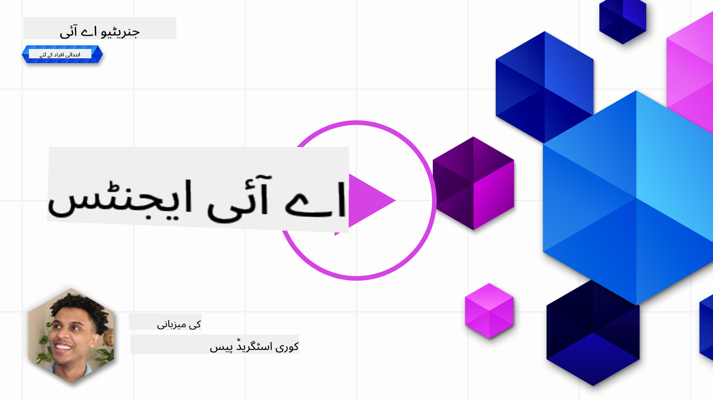
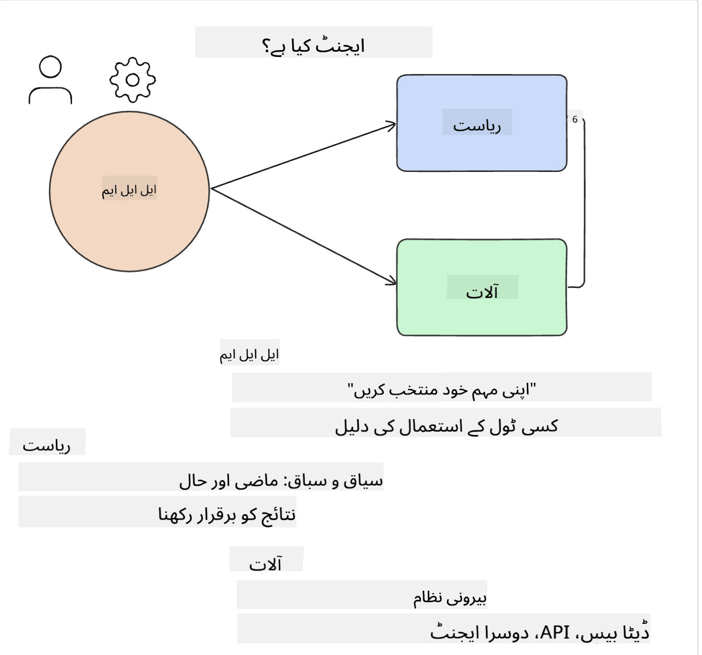
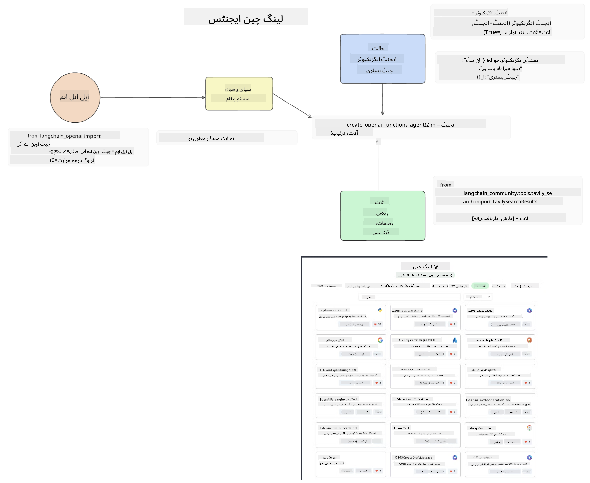
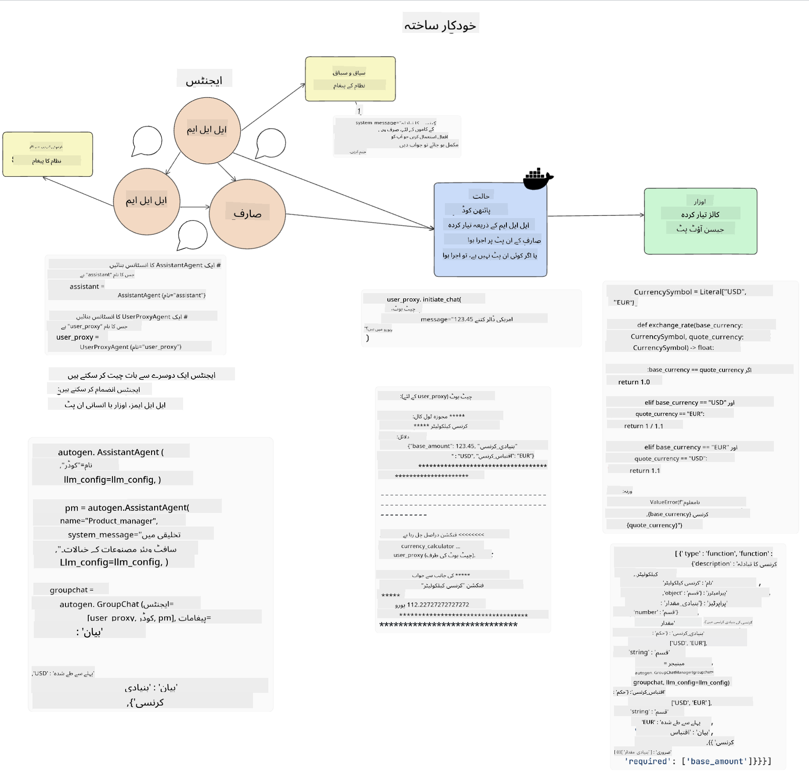
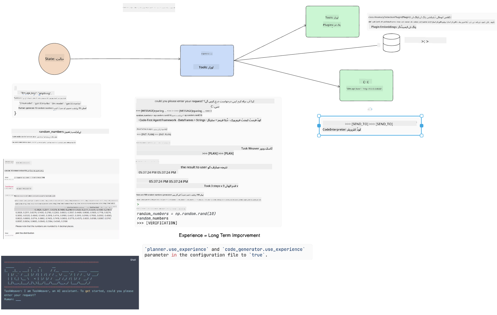

<!--
CO_OP_TRANSLATOR_METADATA:
{
  "original_hash": "11f03c81f190d9cbafd0f977dcbede6c",
  "translation_date": "2025-05-20T07:09:25+00:00",
  "source_file": "17-ai-agents/README.md",
  "language_code": "ur"
}
-->
[](https://aka.ms/gen-ai-lesson17-gh?WT.mc_id=academic-105485-koreyst)

## تعارف

AI ایجنٹس جنریٹو AI میں ایک دلچسپ ترقی کی نمائندگی کرتے ہیں، جو بڑے زبان کے ماڈلز (LLMs) کو معاونین سے ایجنٹس میں تبدیل کرنے کے قابل بناتے ہیں جو اقدامات کر سکتے ہیں۔ AI ایجنٹ فریم ورک ڈویلپرز کو ایسی ایپلیکیشنز بنانے کی اجازت دیتے ہیں جو LLMs کو آلات اور حالت کے انتظام تک رسائی فراہم کرتے ہیں۔ یہ فریم ورک نظر کو بھی بڑھاتے ہیں، صارفین اور ڈویلپرز کو LLMs کے منصوبہ بند اقدامات کی نگرانی کرنے کی اجازت دیتے ہیں، جس سے تجربے کے انتظام کو بہتر بنایا جا سکتا ہے۔

سبق درج ذیل علاقوں کا احاطہ کرے گا:

- AI ایجنٹ کیا ہے سمجھنا - بالکل AI ایجنٹ کیا ہے؟
- چار مختلف AI ایجنٹ فریم ورک کو دریافت کرنا - انہیں منفرد کیا بناتا ہے؟
- مختلف استعمال کے معاملات پر ان AI ایجنٹس کا اطلاق - ہمیں کب AI ایجنٹس کا استعمال کرنا چاہئے؟

## سیکھنے کے اہداف

اس سبق کے بعد، آپ قابل ہوں گے:

- وضاحت کریں کہ AI ایجنٹس کیا ہیں اور انہیں کیسے استعمال کیا جا سکتا ہے۔
- کچھ مشہور AI ایجنٹ فریم ورک کے درمیان فرق کو سمجھیں، اور وہ کیسے مختلف ہیں۔
- سمجھیں کہ AI ایجنٹس کیسے کام کرتے ہیں تاکہ ان کے ساتھ ایپلیکیشنز بنا سکیں۔

## AI ایجنٹس کیا ہیں؟

AI ایجنٹس جنریٹو AI کی دنیا میں ایک بہت ہی دلچسپ میدان ہیں۔ اس جوش کے ساتھ کبھی کبھی اصطلاحات اور ان کے اطلاق میں الجھن پیدا ہوتی ہے۔ چیزوں کو آسان اور زیادہ تر ٹولز کو شامل رکھنے کے لیے جو AI ایجنٹس کا حوالہ دیتے ہیں، ہم یہ تعریف استعمال کرنے جا رہے ہیں:

AI ایجنٹس بڑے زبان کے ماڈلز (LLMs) کو **حالت** اور **آلات** تک رسائی دے کر کام کرنے کی اجازت دیتے ہیں۔



آئیے ان اصطلاحات کی وضاحت کرتے ہیں:

**بڑے زبان کے ماڈلز** - یہ وہ ماڈلز ہیں جن کا اس کورس میں حوالہ دیا گیا ہے جیسے GPT-3.5، GPT-4، Llama-2 وغیرہ۔

**حالت** - یہ اس سیاق و سباق کی طرف اشارہ کرتا ہے جس میں LLM کام کر رہا ہے۔ LLM اپنے ماضی کے اقدامات اور موجودہ سیاق و سباق کے تناظر کا استعمال کرتا ہے، اپنے بعد کے اقدامات کے لیے فیصلہ سازی کی رہنمائی کرتا ہے۔ AI ایجنٹ فریم ورک ڈویلپرز کو اس سیاق و سباق کو آسانی سے برقرار رکھنے کی اجازت دیتے ہیں۔

**آلات** - اس کام کو مکمل کرنے کے لیے جو صارف نے درخواست کی ہے اور جسے LLM نے منصوبہ بندی کی ہے، LLM کو آلات تک رسائی کی ضرورت ہے۔ آلات کی کچھ مثالیں ڈیٹا بیس، API، بیرونی ایپلیکیشن یا یہاں تک کہ ایک اور LLM ہو سکتی ہیں!

یہ تعریفیں آپ کو آگے بڑھنے کے لیے اچھی بنیاد فراہم کریں گی جب ہم دیکھیں گے کہ انہیں کیسے نافذ کیا جاتا ہے۔ آئیے کچھ مختلف AI ایجنٹ فریم ورک کو دریافت کریں:

## لانگ چین ایجنٹس

[لانگ چین ایجنٹس](https://python.langchain.com/docs/how_to/#agents?WT.mc_id=academic-105485-koreyst) ان تعریفوں کا نفاذ ہے جو ہم نے اوپر فراہم کی ہیں۔

**حالت** کو منظم کرنے کے لیے، یہ ایک بلٹ ان فنکشن استعمال کرتا ہے جسے `AgentExecutor` کہا جاتا ہے۔ یہ مقررہ `agent` اور `tools` کو قبول کرتا ہے جو اسے دستیاب ہیں۔

`Agent Executor` بھی چیٹ کی تاریخ کو اسٹور کرتا ہے تاکہ چیٹ کے سیاق و سباق کو فراہم کیا جا سکے۔



لانگ چین ایک [آلات کا کیٹلاگ](https://integrations.langchain.com/tools?WT.mc_id=academic-105485-koreyst) پیش کرتا ہے جو آپ کی ایپلیکیشن میں درآمد کیا جا سکتا ہے جس میں LLM رسائی حاصل کر سکتا ہے۔ یہ کمیونٹی اور لانگ چین ٹیم کے ذریعہ بنائے گئے ہیں۔

آپ پھر ان آلات کی تعریف کر سکتے ہیں اور انہیں `Agent Executor` کو پاس کر سکتے ہیں۔

نظر AI ایجنٹس کے بارے میں بات کرتے وقت ایک اور اہم پہلو ہے۔ یہ ایپلیکیشن ڈویلپرز کے لیے یہ سمجھنا ضروری ہے کہ LLM کون سا آلہ استعمال کر رہا ہے اور کیوں۔ اس کے لیے، لانگ چین کی ٹیم نے لانگ اسمتھ تیار کیا ہے۔

## آٹو جن

اگلا AI ایجنٹ فریم ورک جس پر ہم بحث کریں گے وہ ہے [آٹو جن](https://microsoft.github.io/autogen/?WT.mc_id=academic-105485-koreyst)۔ آٹو جن کا بنیادی فوکس بات چیت ہے۔ ایجنٹس دونوں **بات چیت کرنے والے** اور **حسب ضرورت** ہیں۔

**بات چیت کرنے والا -** LLMs دوسرے LLM کے ساتھ بات چیت شروع کر سکتے ہیں اور جاری رکھ سکتے ہیں تاکہ ایک کام مکمل کر سکیں۔ یہ `AssistantAgents` بنا کر اور انہیں ایک مخصوص نظام پیغام دے کر کیا جاتا ہے۔

```python

autogen.AssistantAgent( name="Coder", llm_config=llm_config, ) pm = autogen.AssistantAgent( name="Product_manager", system_message="Creative in software product ideas.", llm_config=llm_config, )

```

**حسب ضرورت** - ایجنٹس کو نہ صرف LLMs کے طور پر بلکہ صارف یا ایک آلہ کے طور پر بھی بیان کیا جا سکتا ہے۔ ایک ڈویلپر کے طور پر، آپ ایک `UserProxyAgent` کی تعریف کر سکتے ہیں جو صارف کے ساتھ بات چیت کرنے کے لیے ذمہ دار ہے تاکہ ایک کام کو مکمل کرنے میں رائے حاصل کی جا سکے۔ یہ رائے یا تو کام کے نفاذ کو جاری رکھ سکتی ہے یا اسے روک سکتی ہے۔

```python
user_proxy = UserProxyAgent(name="user_proxy")
```

### حالت اور آلات

حالت کو تبدیل کرنے اور منظم کرنے کے لیے، ایک معاون ایجنٹ کام کو مکمل کرنے کے لیے پائیتھون کوڈ جنریٹ کرتا ہے۔

یہاں عمل کی ایک مثال ہے:



#### LLM ایک نظام پیغام کے ساتھ تعریف کی گئی

```python
system_message="For weather related tasks, only use the functions you have been provided with. Reply TERMINATE when the task is done."
```

یہ نظام پیغام اس مخصوص LLM کو ہدایت کرتا ہے کہ کون سے فنکشنز اس کے کام کے لیے متعلقہ ہیں۔ یاد رکھیں، آٹو جن کے ساتھ آپ کے پاس مختلف نظام پیغامات کے ساتھ متعدد معاون ایجنٹس ہو سکتے ہیں۔

#### چیٹ صارف کے ذریعے شروع کی جاتی ہے

```python
user_proxy.initiate_chat( chatbot, message="I am planning a trip to NYC next week, can you help me pick out what to wear? ", )

```

یہ پیغام user_proxy (انسان) سے ایجنٹ کے عمل کو شروع کرنے کے لیے ممکنہ فنکشنز کو تلاش کرنے کے عمل کو شروع کرے گا۔

#### فنکشن نافذ کیا جاتا ہے

```bash
chatbot (to user_proxy):

***** Suggested tool Call: get_weather ***** Arguments: {"location":"New York City, NY","time_periond:"7","temperature_unit":"Celsius"} ******************************************************** --------------------------------------------------------------------------------

>>>>>>>> EXECUTING FUNCTION get_weather... user_proxy (to chatbot): ***** Response from calling function "get_weather" ***** 112.22727272727272 EUR ****************************************************************

```

ایک بار جب ابتدائی چیٹ پروسیس ہو جاتی ہے، ایجنٹ تجویز کردہ آلہ کو کال کرنے کے لیے بھیجے گا۔ اس معاملے میں، یہ ایک فنکشن ہے جسے `get_weather`. Depending on your configuration, this function can be automatically executed and read by the Agent or can be executed based on user input.

You can find a list of [AutoGen code samples](https://microsoft.github.io/autogen/docs/Examples/?WT.mc_id=academic-105485-koreyst) to further explore how to get started building.

## Taskweaver

The next agent framework we will explore is [Taskweaver](https://microsoft.github.io/TaskWeaver/?WT.mc_id=academic-105485-koreyst). It is known as a "code-first" agent because instead of working strictly with `strings` , it can work with DataFrames in Python. This becomes extremely useful for data analysis and generation tasks. This can be things like creating graphs and charts or generating random numbers.

### State and Tools

To manage the state of the conversation, TaskWeaver uses the concept of a `Planner`. The `Planner` is a LLM that takes the request from the users and maps out the tasks that need to be completed to fulfill this request.

To complete the tasks the `Planner` is exposed to the collection of tools called `Plugins` کہا جاتا ہے۔ یہ پائیتھون کلاسز یا ایک عمومی کوڈ انٹرپریٹر ہو سکتے ہیں۔ یہ پلگ انز embeddings کے طور پر ذخیرہ کیے جاتے ہیں تاکہ LLM صحیح پلگ ان کو بہتر طریقے سے تلاش کر سکے۔



یہاں ایک مثال ہے کہ anomaly detection کو سنبھالنے کے لیے ایک پلگ ان کیسے بنایا جاتا ہے:

```python
class AnomalyDetectionPlugin(Plugin): def __call__(self, df: pd.DataFrame, time_col_name: str, value_col_name: str):
```

کوڈ کو نافذ کرنے سے پہلے تصدیق کی جاتی ہے۔ ٹاسک ویور میں سیاق و سباق کو منظم کرنے کے لیے ایک اور خصوصیت `experience`. Experience allows for the context of a conversation to be stored over to the long term in a YAML file. This can be configured so that the LLM improves over time on certain tasks given that it is exposed to prior conversations.

## JARVIS

The last agent framework we will explore is [JARVIS](https://github.com/microsoft/JARVIS?tab=readme-ov-file?WT.mc_id=academic-105485-koreyst). What makes JARVIS unique is that it uses an LLM to manage the `state` ہے جو بات چیت کا ہے اور `tools` دوسرے AI ماڈلز ہیں۔ ہر AI ماڈل مخصوص ماڈلز ہیں جو کچھ کام انجام دیتے ہیں جیسے object detection، transcription یا image captioning۔


LLM، ایک عمومی مقصد کا ماڈل ہونے کے ناطے، صارف سے درخواست وصول کرتا ہے اور مخصوص کام اور اس کام کو مکمل کرنے کے لیے ضروری دلائل/ڈیٹا کی شناخت کرتا ہے۔

```python
[{"task": "object-detection", "id": 0, "dep": [-1], "args": {"image": "e1.jpg" }}]
```

LLM پھر درخواست کو اس طرح سے فارمیٹ کرتا ہے کہ مخصوص AI ماڈل اسے سمجھ سکے، جیسے JSON۔ ایک بار جب AI ماڈل نے کام کی بنیاد پر اپنی پیش گوئی واپس کر دی، LLM جواب وصول کرتا ہے۔

اگر کام کو مکمل کرنے کے لیے متعدد ماڈلز کی ضرورت ہوتی ہے، تو یہ ان ماڈلز کے جوابات کی تشریح بھی کرے گا اس سے پہلے کہ انہیں اکٹھا کر کے صارف کو جواب تیار کرے۔

نیچے دی گئی مثال دکھاتی ہے کہ یہ کیسے کام کرے گا جب ایک صارف تصویر میں موجود اشیاء کی وضاحت اور تعداد کی درخواست کر رہا ہے:

## اسائنمنٹ

AI ایجنٹس کی اپنی تعلیم کو جاری رکھنے کے لیے آپ آٹو جن کے ساتھ بنا سکتے ہیں:

- ایک ایپلیکیشن جو ایک تعلیمی اسٹارٹ اپ کے مختلف محکموں کے ساتھ کاروباری میٹنگ کی نقل کرتی ہے۔
- نظام پیغامات بنائیں جو LLMs کو مختلف کرداروں اور ترجیحات کو سمجھنے میں رہنمائی کرتے ہیں، اور صارف کو ایک نیا پروڈکٹ آئیڈیا پیش کرنے کے قابل بناتے ہیں۔
- LLM کو پھر ہر محکمہ سے فالو اپ سوالات پیدا کرنے چاہئیں تاکہ پیشکش اور پروڈکٹ آئیڈیا کو بہتر بنایا جا سکے

## سیکھنا یہاں نہیں رک رہا، سفر جاری رکھیں

اس سبق کو مکمل کرنے کے بعد، ہمارے [جنریٹو AI لرننگ کلیکشن](https://aka.ms/genai-collection?WT.mc_id=academic-105485-koreyst) کو دیکھیں تاکہ اپنی جنریٹو AI کی معلومات کو بڑھاتے رہیں!

**ڈس کلیمر**:  
یہ دستاویز AI ترجمہ سروس [Co-op Translator](https://github.com/Azure/co-op-translator) کا استعمال کرتے ہوئے ترجمہ کی گئی ہے۔ ہم درستگی کے لیے کوشش کرتے ہیں، لیکن براہ کرم آگاہ رہیں کہ خودکار ترجمے میں غلطیاں یا غلط فہمیاں ہو سکتی ہیں۔ اصل دستاویز کو اس کی اصل زبان میں مستند ماخذ سمجھا جانا چاہیے۔ اہم معلومات کے لیے، پیشہ ور انسانی ترجمہ کی سفارش کی جاتی ہے۔ ہم اس ترجمے کے استعمال سے پیدا ہونے والی کسی بھی غلط فہمی یا غلط تشریح کے ذمہ دار نہیں ہیں۔