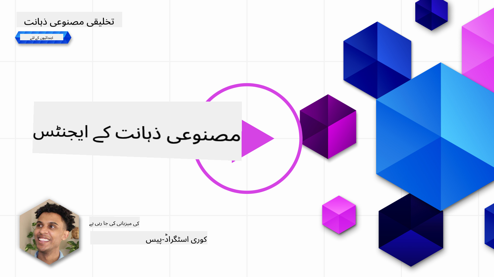
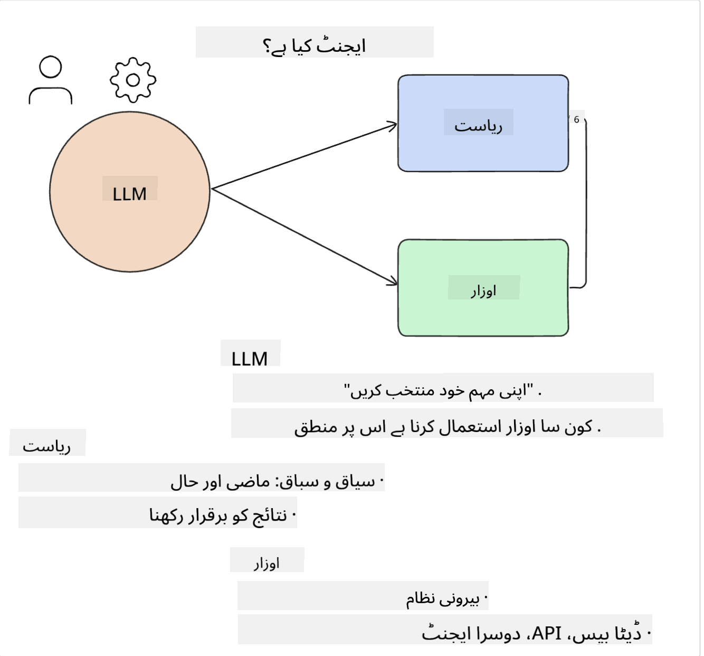
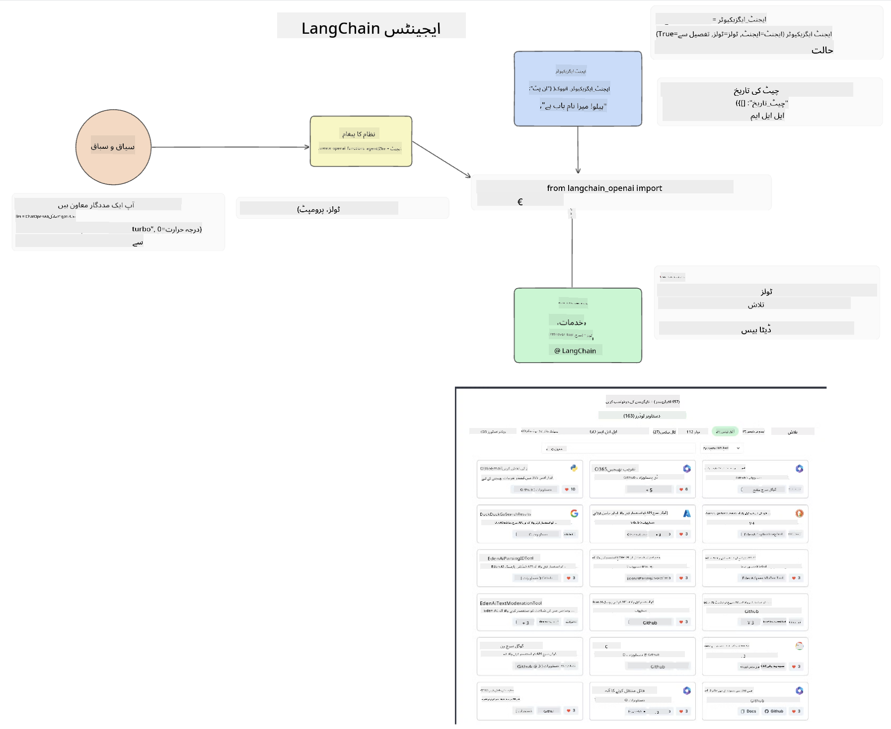
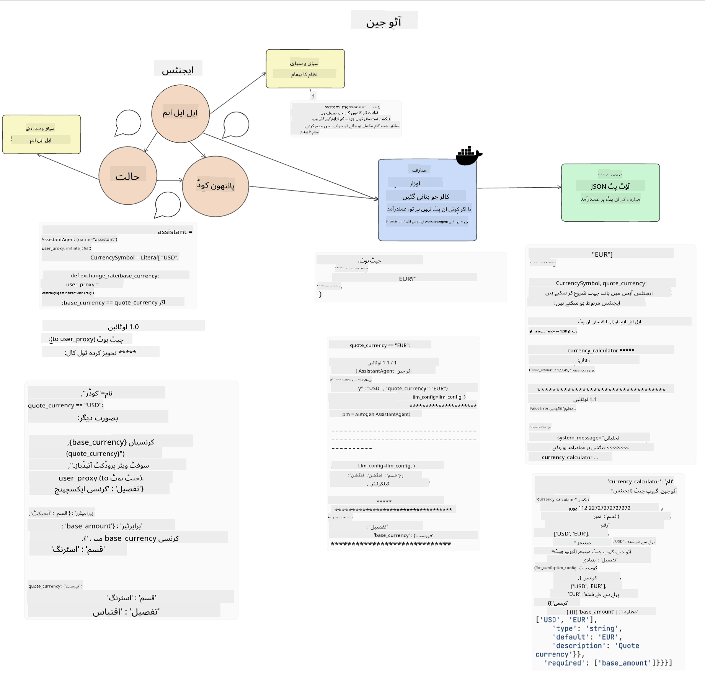
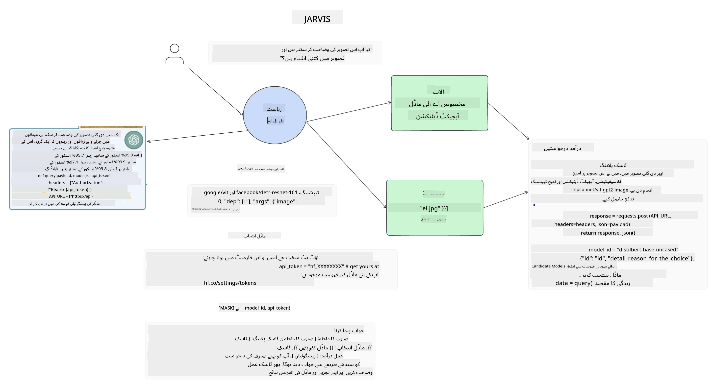

<!--
CO_OP_TRANSLATOR_METADATA:
{
  "original_hash": "11f03c81f190d9cbafd0f977dcbede6c",
  "translation_date": "2025-06-26T00:10:03+00:00",
  "source_file": "17-ai-agents/README.md",
  "language_code": "ur"
}
-->
[](https://aka.ms/gen-ai-lesson17-gh?WT.mc_id=academic-105485-koreyst)

## تعارف

AI ایجنٹس جنریٹو AI میں ایک دلچسپ ترقی کی نمائندگی کرتے ہیں، جو بڑے زبان کے ماڈلز (LLMs) کو اسسٹنٹس سے ایسے ایجنٹس میں تبدیل کرنے کے قابل بناتے ہیں جو اقدامات کر سکتے ہیں۔ AI ایجنٹ فریم ورک ڈویلپرز کو ایسی ایپلیکیشنز بنانے کے قابل بناتے ہیں جو LLMs کو ٹولز اور اسٹیٹ مینجمنٹ تک رسائی فراہم کرتے ہیں۔ یہ فریم ورک نظر کو بھی بڑھاتے ہیں، جس سے صارفین اور ڈویلپرز کو LLMs کی منصوبہ بند کارروائیوں کی نگرانی کرنے کی اجازت ملتی ہے، اس طرح تجربے کے انتظام کو بہتر بنایا جاتا ہے۔

سبق میں مندرجہ ذیل شعبے شامل ہوں گے:

- AI ایجنٹ کیا ہے - بالکل AI ایجنٹ کیا ہے؟
- چار مختلف AI ایجنٹ فریم ورک کو دریافت کرنا - انہیں منفرد کیا بناتا ہے؟
- ان AI ایجنٹس کو مختلف استعمال کے کیسز پر لاگو کرنا - ہمیں AI ایجنٹس کا استعمال کب کرنا چاہئے؟

## سیکھنے کے مقاصد

اس سبق کو لینے کے بعد، آپ قابل ہوں گے:

- وضاحت کریں کہ AI ایجنٹس کیا ہیں اور انہیں کیسے استعمال کیا جا سکتا ہے۔
- کچھ مشہور AI ایجنٹ فریم ورک کے درمیان فرق کو سمجھیں، اور وہ کیسے مختلف ہیں۔
- یہ سمجھیں کہ AI ایجنٹس کس طرح کام کرتے ہیں تاکہ ان کے ساتھ ایپلیکیشنز بنائی جا سکیں۔

## AI ایجنٹس کیا ہیں؟

AI ایجنٹس جنریٹو AI کی دنیا میں ایک بہت ہی دلچسپ میدان ہیں۔ اس جوش کے ساتھ بعض اوقات اصطلاحات اور ان کی درخواست میں الجھن بھی پیدا ہوتی ہے۔ چیزوں کو سادہ اور زیادہ تر ٹولز کو شامل کرنے کے لئے جو AI ایجنٹس کا حوالہ دیتے ہیں، ہم یہ تعریف استعمال کرنے جا رہے ہیں:

AI ایجنٹس بڑے زبان کے ماڈلز (LLMs) کو **اسٹیٹ** اور **ٹولز** تک رسائی دے کر کام کرنے کی اجازت دیتے ہیں۔



آئیے ان اصطلاحات کی وضاحت کریں:

**بڑے زبان کے ماڈلز** - یہ وہ ماڈلز ہیں جن کا اس کورس میں حوالہ دیا گیا ہے جیسے GPT-3.5, GPT-4, Llama-2 وغیرہ۔

**اسٹیٹ** - اس سے مراد وہ سیاق و سباق ہے جس میں LLM کام کر رہا ہے۔ LLM اپنے ماضی کی کارروائیوں کے سیاق و سباق اور موجودہ سیاق و سباق کو استعمال کرتا ہے، جو اس کے بعد کی کارروائیوں کے لئے اس کے فیصلے کی رہنمائی کرتا ہے۔ AI ایجنٹ فریم ورک ڈویلپرز کو اس سیاق و سباق کو آسانی سے برقرار رکھنے کی اجازت دیتے ہیں۔

**ٹولز** - صارف کی درخواست کردہ کام کو مکمل کرنے کے لئے اور جسے LLM نے منصوبہ بنایا ہے، LLM کو ٹولز تک رسائی کی ضرورت ہوتی ہے۔ ٹولز کی کچھ مثالیں ہو سکتی ہیں جیسے ڈیٹا بیس، ایک API، ایک بیرونی ایپلیکیشن یا حتی کہ ایک اور LLM!

یہ تعریفیں امید ہے کہ آپ کو آگے بڑھنے کے لئے ایک اچھی بنیاد فراہم کریں گی کیونکہ ہم دیکھتے ہیں کہ انہیں کس طرح نافذ کیا جاتا ہے۔ آئیے چند مختلف AI ایجنٹ فریم ورک کا جائزہ لیتے ہیں:

## لانگ چین ایجنٹس

[لانگ چین ایجنٹس](https://python.langchain.com/docs/how_to/#agents?WT.mc_id=academic-105485-koreyst) ان تعریفوں کا نفاذ ہے جو ہم نے اوپر فراہم کی ہیں۔

**اسٹیٹ** کو منظم کرنے کے لئے، یہ ایک بلٹ ان فنکشن کا استعمال کرتا ہے جسے `AgentExecutor` کہا جاتا ہے۔ یہ تعریف کردہ `agent` اور `tools` کو قبول کرتا ہے جو اس کے لئے دستیاب ہیں۔

`Agent Executor` چیٹ کی تاریخ کو بھی ذخیرہ کرتا ہے تاکہ چیٹ کے سیاق و سباق کو فراہم کیا جا سکے۔



لانگ چین ایک [ٹولز کی کیٹلاگ](https://integrations.langchain.com/tools?WT.mc_id=academic-105485-koreyst) پیش کرتا ہے جو آپ کی ایپلیکیشن میں درآمد کیا جا سکتا ہے جس میں LLM رسائی حاصل کر سکتا ہے۔ یہ کمیونٹی اور لانگ چین ٹیم کے ذریعہ بنائے گئے ہیں۔

آپ پھر ان ٹولز کو تعریف کر سکتے ہیں اور انہیں `Agent Executor` کو منتقل کر سکتے ہیں۔

نظر ایک اور اہم پہلو ہے جب AI ایجنٹس کی بات کی جائے۔ ایپلیکیشن ڈویلپرز کے لئے یہ سمجھنا ضروری ہے کہ LLM کون سا ٹول استعمال کر رہا ہے اور کیوں۔ اس کے لئے، لانگ چین کی ٹیم نے لانگ سمتھ تیار کیا ہے۔

## آٹو جن

اگلا AI ایجنٹ فریم ورک جس پر ہم بحث کریں گے وہ ہے [آٹو جن](https://microsoft.github.io/autogen/?WT.mc_id=academic-105485-koreyst)۔ آٹو جن کا مرکزی فوکس مکالمات ہیں۔ ایجنٹس دونوں **مکالماتی** اور **حسب ضرورت** ہیں۔

**مکالماتی -** LLMs کسی کام کو مکمل کرنے کے لئے ایک دوسرے کے ساتھ مکالمہ شروع اور جاری رکھ سکتے ہیں۔ یہ `AssistantAgents` بنانے اور انہیں ایک مخصوص سسٹم پیغام دینے کے ذریعے کیا جاتا ہے۔

```python

autogen.AssistantAgent( name="Coder", llm_config=llm_config, ) pm = autogen.AssistantAgent( name="Product_manager", system_message="Creative in software product ideas.", llm_config=llm_config, )

```

**حسب ضرورت** - ایجنٹس کو نہ صرف LLMs کے طور پر بلکہ ایک صارف یا ایک ٹول کے طور پر بھی تعریف کیا جا سکتا ہے۔ بطور ڈویلپر، آپ ایک `UserProxyAgent` تعریف کر سکتے ہیں جو صارف کے ساتھ فیڈ بیک کے لئے تعامل کرنے کا ذمہ دار ہے تاکہ کام کو مکمل کیا جا سکے۔ یہ فیڈ بیک یا تو کام کے عمل کو جاری رکھ سکتا ہے یا اسے روک سکتا ہے۔

```python
user_proxy = UserProxyAgent(name="user_proxy")
```

### اسٹیٹ اور ٹولز

اسٹیٹ کو تبدیل اور منظم کرنے کے لئے، ایک اسسٹنٹ ایجنٹ کام کو مکمل کرنے کے لئے Python کوڈ تیار کرتا ہے۔

یہاں عمل کی ایک مثال ہے:



#### سسٹم پیغام کے ساتھ LLM کی تعریف

```python
system_message="For weather related tasks, only use the functions you have been provided with. Reply TERMINATE when the task is done."
```

یہ سسٹم پیغام اس مخصوص LLM کو ہدایت دیتا ہے کہ اس کے کام کے لئے کون سی افعال متعلقہ ہیں۔ یاد رکھیں، آٹو جن کے ساتھ آپ مختلف سسٹم پیغامات کے ساتھ متعدد اسسٹنٹ ایجنٹس کی تعریف کر سکتے ہیں۔

#### چیٹ کا آغاز صارف کے ذریعہ

```python
user_proxy.initiate_chat( chatbot, message="I am planning a trip to NYC next week, can you help me pick out what to wear? ", )

```

یہ پیغام user_proxy (انسان) سے وہ ہے جو ایجنٹ کے عمل کو شروع کرے گا تاکہ وہ ممکنہ افعال کو تلاش کرے جو اسے انجام دینے چاہئیں۔

#### فنکشن کو انجام دیا جاتا ہے

```bash
chatbot (to user_proxy):

***** Suggested tool Call: get_weather ***** Arguments: {"location":"New York City, NY","time_periond:"7","temperature_unit":"Celsius"} ******************************************************** --------------------------------------------------------------------------------

>>>>>>>> EXECUTING FUNCTION get_weather... user_proxy (to chatbot): ***** Response from calling function "get_weather" ***** 112.22727272727272 EUR ****************************************************************

```

ایک بار جب ابتدائی چیٹ پر عمل درآمد ہو جاتا ہے، ایجنٹ تجویز کردہ ٹول کو کال کرنے کے لئے بھیجے گا۔ اس معاملے میں، یہ ایک فنکشن ہے جسے `get_weather`. Depending on your configuration, this function can be automatically executed and read by the Agent or can be executed based on user input.

You can find a list of [AutoGen code samples](https://microsoft.github.io/autogen/docs/Examples/?WT.mc_id=academic-105485-koreyst) to further explore how to get started building.

## Taskweaver

The next agent framework we will explore is [Taskweaver](https://microsoft.github.io/TaskWeaver/?WT.mc_id=academic-105485-koreyst). It is known as a "code-first" agent because instead of working strictly with `strings` , it can work with DataFrames in Python. This becomes extremely useful for data analysis and generation tasks. This can be things like creating graphs and charts or generating random numbers.

### State and Tools

To manage the state of the conversation, TaskWeaver uses the concept of a `Planner`. The `Planner` is a LLM that takes the request from the users and maps out the tasks that need to be completed to fulfill this request.

To complete the tasks the `Planner` is exposed to the collection of tools called `Plugins` کہا جاتا ہے۔ یہ Python کلاسز یا ایک عمومی کوڈ انٹرپریٹر ہو سکتا ہے۔ یہ پلگ ان امبیڈنگز کے طور پر ذخیرہ ہوتے ہیں تاکہ LLM صحیح پلگ ان کو بہتر طور پر تلاش کر سکے۔


یہاں ایک پلگ ان کی مثال ہے جو anomaly detection کو سنبھالنے کے لئے ہے:

```python
class AnomalyDetectionPlugin(Plugin): def __call__(self, df: pd.DataFrame, time_col_name: str, value_col_name: str):
```

کوڈ کو انجام دینے سے پہلے اس کی تصدیق کی جاتی ہے۔ ٹاسک ویور میں سیاق و سباق کو منظم کرنے کے لئے ایک اور خصوصیت `experience`. Experience allows for the context of a conversation to be stored over to the long term in a YAML file. This can be configured so that the LLM improves over time on certain tasks given that it is exposed to prior conversations.

## JARVIS

The last agent framework we will explore is [JARVIS](https://github.com/microsoft/JARVIS?tab=readme-ov-file?WT.mc_id=academic-105485-koreyst). What makes JARVIS unique is that it uses an LLM to manage the `state` ہے اور `tools` دوسرے AI ماڈلز ہیں۔ ہر AI ماڈل مخصوص ماڈلز ہیں جو کچھ کام انجام دیتے ہیں جیسے object detection, transcription یا image captioning۔



LLM، ایک عمومی مقصد ماڈل ہونے کے ناطے، صارف سے درخواست وصول کرتا ہے اور مخصوص کام اور کسی بھی دلائل/ڈیٹا کی شناخت کرتا ہے جو کام کو مکمل کرنے کے لئے ضروری ہے۔

```python
[{"task": "object-detection", "id": 0, "dep": [-1], "args": {"image": "e1.jpg" }}]
```

پھر LLM درخواست کو اس انداز میں فارمیٹ کرتا ہے کہ مخصوص AI ماڈل اسے سمجھ سکے، جیسے JSON۔ ایک بار جب AI ماڈل نے کام کی بنیاد پر اپنی پیش گوئی واپس کر دی، تو LLM جواب وصول کرتا ہے۔

اگر کام کو مکمل کرنے کے لئے متعدد ماڈلز کی ضرورت ہوتی ہے، تو یہ ان ماڈلز کے جواب کو بھی سمجھتا ہے اس سے پہلے کہ انہیں صارف کو جواب دینے کے لئے اکٹھا کرے۔

ذیل کی مثال دکھاتی ہے کہ جب ایک صارف تصویر میں اشیاء کی تفصیل اور گنتی کی درخواست کر رہا ہے تو یہ کیسے کام کرے گا:

## اسائنمنٹ

AI ایجنٹس کی سیکھنے کو جاری رکھنے کے لئے آپ آٹو جن کے ساتھ بنا سکتے ہیں:

- ایک ایپلیکیشن جو ایک تعلیمی اسٹارٹ اپ کے مختلف شعبوں کے ساتھ ایک کاروباری میٹنگ کی نقل کرتی ہے۔
- سسٹم پیغامات بنائیں جو LLMs کو مختلف شخصیات اور ترجیحات کو سمجھنے میں رہنمائی کریں، اور صارف کو ایک نئی پروڈکٹ آئیڈیا پیش کرنے کے قابل بنائیں۔
- پھر LLM کو ہر شعبے سے فالو اپ سوالات پیدا کرنے چاہئیں تاکہ پیشکش اور پروڈکٹ آئیڈیا کو بہتر بنایا جا سکے

## سیکھنا یہاں ختم نہیں ہوتا، سفر جاری رکھیں

اس سبق کو مکمل کرنے کے بعد، ہماری [جنریٹو AI لرننگ کلیکشن](https://aka.ms/genai-collection?WT.mc_id=academic-105485-koreyst) کو دیکھیں تاکہ آپ اپنی جنریٹو AI علم کو مزید بڑھا سکیں!

**ڈس کلیمر**:  
یہ دستاویز AI ترجمہ سروس [Co-op Translator](https://github.com/Azure/co-op-translator) کا استعمال کرتے ہوئے ترجمہ کی گئی ہے۔ ہم درستگی کے لیے کوشاں ہیں، لیکن براہ کرم آگاہ رہیں کہ خودکار ترجمے میں غلطیاں یا عدم درستگیاں ہو سکتی ہیں۔ اصل دستاویز کو اس کی اصل زبان میں مستند ماخذ سمجھا جانا چاہیے۔ اہم معلومات کے لیے، پیشہ ورانہ انسانی ترجمہ کی سفارش کی جاتی ہے۔ ہم اس ترجمے کے استعمال سے پیدا ہونے والی کسی بھی غلط فہمی یا غلط تعبیر کے ذمہ دار نہیں ہیں۔