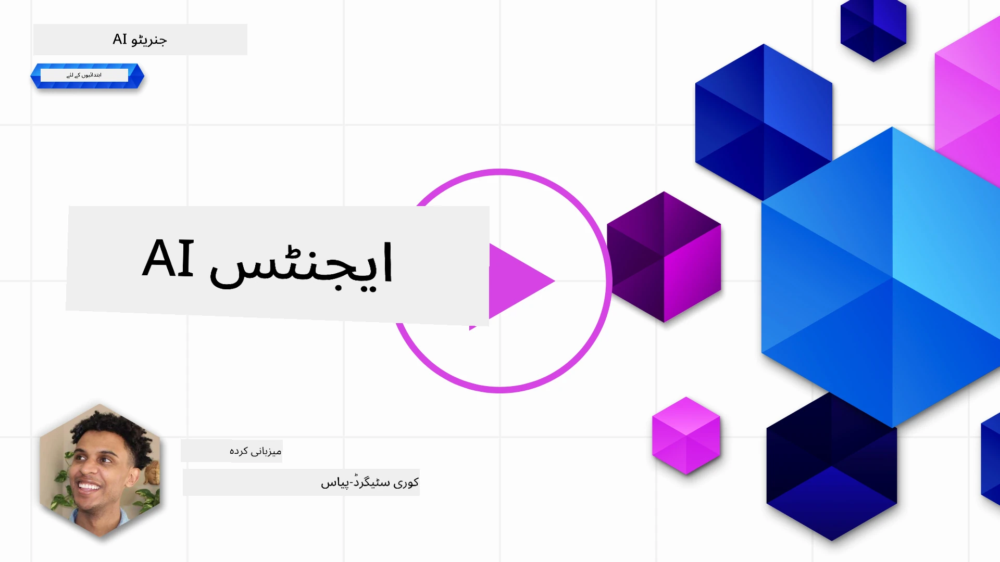
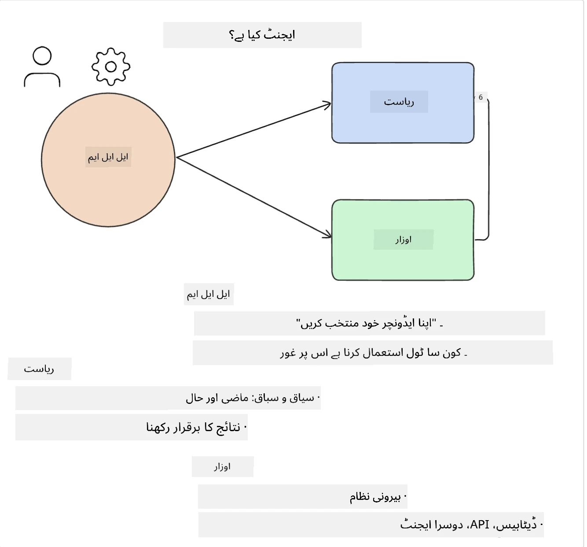
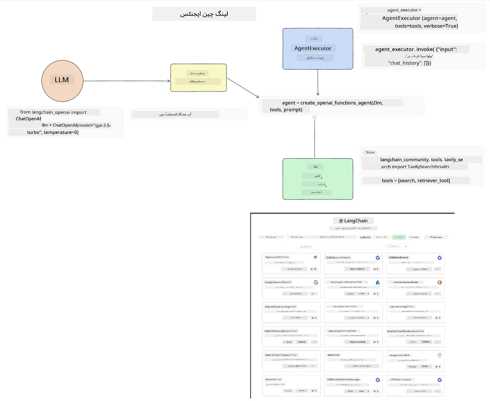
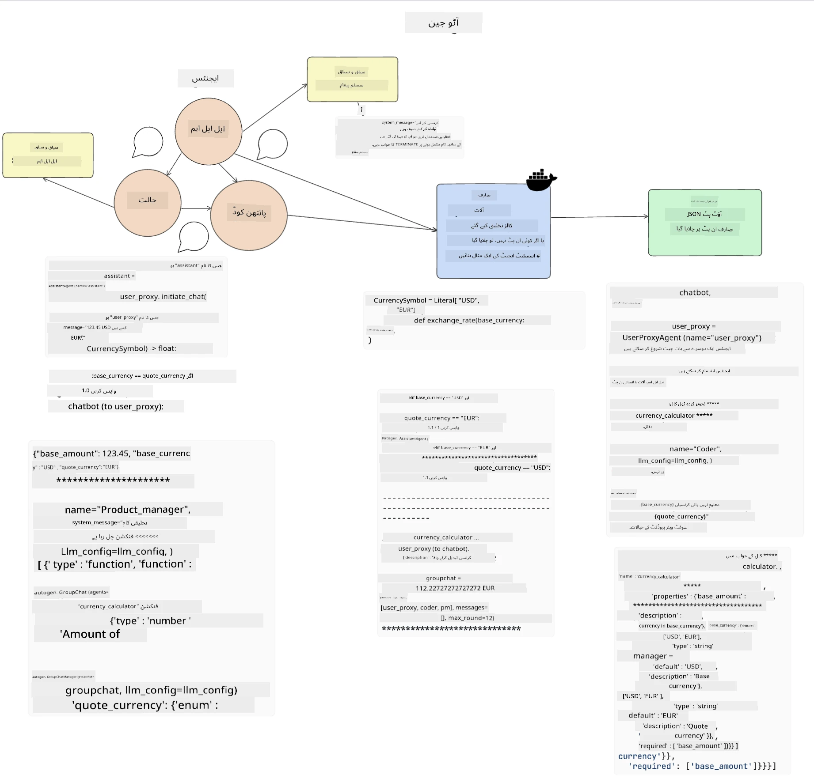
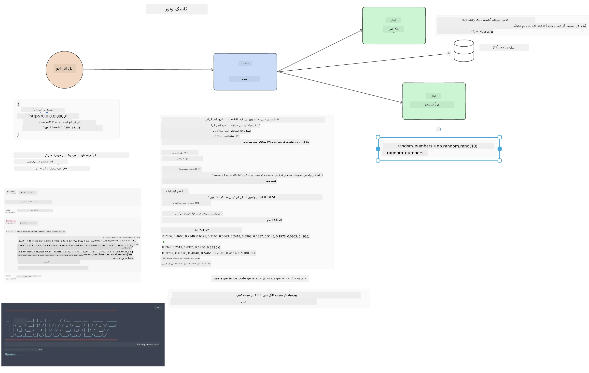
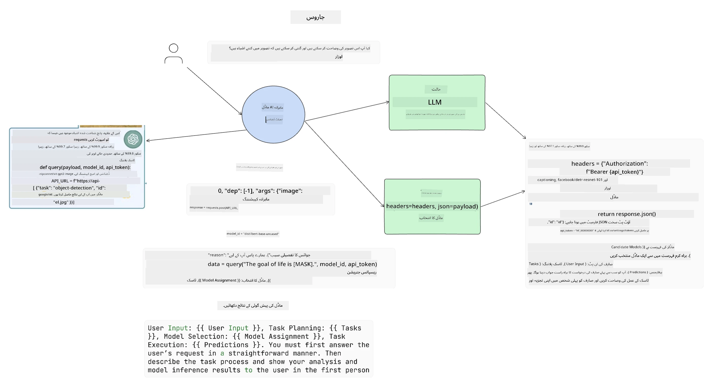

[](https://youtu.be/yAXVW-lUINc?si=bOtW9nL6jc3XJgOM)

## تعارف

AI ایجنٹس جنریٹو AI میں ایک دلچسپ ترقی کی نمائندگی کرتے ہیں، جو بڑے زبان ماڈلز (LLMs) کو معاونین سے ایسے ایجنٹس میں ترقی دینے کے قابل بناتے ہیں جو عمل کرنے کے قابل ہوں۔ AI ایجنٹ فریم ورکز ڈویلپرز کو ایسی ایپلیکیشنز بنانے کی اجازت دیتے ہیں جو LLMs کو ٹولز اور اسٹیٹ مینجمنٹ تک رسائی دیتی ہیں۔ یہ فریم ورکز دیکھنے کی صلاحیت کو بھی بہتر بناتے ہیں، جس سے صارفین اور ڈویلپرز LLMs کی جانب سے کیے جانے والے منصوبہ بند اقدامات کی نگرانی کر سکتے ہیں، اس طرح تجربہ مینجمنٹ کو بہتر بنایا جاتا ہے۔

اس سبق میں درج ذیل موضوعات شامل ہوں گے:

- AI ایجنٹ کیا ہے - AI ایجنٹ بالکل کیا ہوتا ہے؟
- چار مختلف AI ایجنٹ فریم ورکز کی جانچ - انہیں منفرد کیا بناتا ہے؟
- AI ایجنٹس کو مختلف استعمال کے معاملات میں لاگو کرنا - ہمیں کب AI ایجنٹس کا استعمال کرنا چاہیے؟

## سیکھنے کے مقاصد

اس سبق کی تکمیل کے بعد، آپ یہ کرنے کے قابل ہوں گے:

- وضاحت کریں کہ AI ایجنٹس کیا ہیں اور انہیں کیسے استعمال کیا جا سکتا ہے۔
- کچھ مشہور AI ایجنٹ فریم ورکز کے فرق کو سمجھیں اور یہ کیسے مختلف ہیں۔
- سمجھیں کہ AI ایجنٹس کیسے کام کرتے ہیں تاکہ ان کے ساتھ ایپلیکیشنز بنا سکیں۔

## AI ایجنٹس کیا ہیں؟

AI ایجنٹس جنریٹو AI کی دنیا میں ایک بہت دلچسپ شعبہ ہیں۔ اس دلچسپی کے ساتھ بعض اوقات اصطلاحات اور ان کے استعمال میں الجھن ہوتی ہے۔ چیزوں کو سادہ اور زیادہ تر ایسے ٹولز کو شامل رکھنے کے لیے جو AI ایجنٹس کا حوالہ دیتے ہیں، ہم یہ تعریف استعمال کریں گے:

AI ایجنٹس بڑے زبان ماڈلز (LLMs) کو ایک **حالت** اور **ٹولز** تک رسائی دے کر کام انجام دینے دیتے ہیں۔



آئیے ان اصطلاحات کی تعریف کریں:

**بڑے زبان ماڈلز** - یہ وہ ماڈلز ہیں جو اس کورس میں ذکر ہوئے ہیں جیسے GPT-3.5، GPT-4، Llama-2 وغیرہ۔

**حالت** - اس سے مراد وہ سیاق و سباق ہے جس میں LLM کام کر رہا ہوتا ہے۔ LLM اپنے پچھلے اعمال اور موجودہ سیاق و سباق کا استعمال کرتا ہے تاکہ اگلے اقدامات کے فیصلے کو ہدایت دے سکے۔ AI ایجنٹ فریم ورک ڈویلپرز کو اس سیاق و سباق کو آسانی سے برقرار رکھنے دیتے ہیں۔

**ٹولز** - جس کام کی صارف نے درخواست کی ہے اور جسے LLM نے منصوبہ بنایا ہے، اسے مکمل کرنے کے لیے LLM کو ٹولز تک رسائی کی ضرورت ہوتی ہے۔ کچھ ٹولز کی مثالیں ہوسکتی ہیں ڈیٹابیس، API، ایک بیرونی ایپلیکیشن یا حتیٰ کہ ایک اور LLM بھی!

یہ تعریفیں آپ کو آگے چل کر اچھی بنیاد فراہم کریں گی جب ہم دیکھیں گے کہ انہیں کیسے نافذ کیا جاتا ہے۔ آئیے کچھ مختلف AI ایجنٹ فریم ورکز کا جائزہ لیتے ہیں:

## LangChain ایجنٹس

[LangChain Agents](https://python.langchain.com/docs/how_to/#agents?WT.mc_id=academic-105485-koreyst) ہماری فراہم کردہ تعریفات کا ایک نفاذ ہے۔

**حالت** کو منظم کرنے کے لیے، یہ ایک بلٹ ان فنکشن `AgentExecutor` استعمال کرتا ہے۔ یہ متعین کردہ `agent` اور دستیاب `tools` کو قبول کرتا ہے۔

`Agent Executor` چیٹ کی تاریخ بھی محفوظ کرتا ہے تاکہ چیٹ کے سیاق و سباق کو فراہم کیا جا سکے۔



LangChain ایک [ٹولز کا ذخیرہ](https://integrations.langchain.com/tools?WT.mc_id=academic-105485-koreyst) پیش کرتا ہے جسے آپ کی ایپلیکیشن میں امپورٹ کیا جا سکتا ہے جس تک LLM رسائی حاصل کر سکتا ہے۔ یہ کمیونٹی اور LangChain ٹیم کی جانب سے بنائے گئے ہیں۔

آپ پھر ان ٹولز کو متعین کر کے `Agent Executor` کو دے سکتے ہیں۔

AI ایجنٹس کی بات کرتے وقت دیکھنے کی صلاحیت بھی ایک اہم پہلو ہے۔ ایپلیکیشن ڈویلپرز کے لیے یہ سمجھنا ضروری ہے کہ LLM کون سا ٹول استعمال کر رہا ہے اور کیوں۔ اس کے لیے LangChain ٹیم نے LangSmith تیار کیا ہے۔

## AutoGen

اگلا AI ایجنٹ فریم ورک جس پر ہم بات کریں گے وہ ہے [AutoGen](https://microsoft.github.io/autogen/?WT.mc_id=academic-105485-koreyst). AutoGen کا مرکزی فوکس مکالمات (conversations) پر ہے۔ ایجنٹس دونوں **بات چیت کے قابل** اور **حسب ضرورت** ہوتے ہیں۔

**بات چیت کے قابل -** LLMs ایک دوسرے LLM کے ساتھ گفتگو شروع اور جاری رکھ سکتے ہیں تاکہ کوئی کام مکمل کیا جا سکے۔ یہ `AssistantAgents` بنانے اور انہیں مخصوص سسٹم پیغام دینے کے ذریعے کیا جاتا ہے۔

```python

autogen.AssistantAgent( name="Coder", llm_config=llm_config, ) pm = autogen.AssistantAgent( name="Product_manager", system_message="Creative in software product ideas.", llm_config=llm_config, )

```

**حسب ضرورت -** ایجنٹس نہ صرف LLMs کے طور پر بلکہ صارف یا ٹول کے طور پر بھی متعین کیے جا سکتے ہیں۔ بطور ڈویلپر، آپ ایک `UserProxyAgent` متعین کر سکتے ہیں جو کام مکمل کرنے کے لیے فیڈبیک کے لیے صارف سے بات چیت کا ذمہ دار ہوتا ہے۔ یہ فیڈبیک کام کی کارروائی کو جاری رکھ سکتا ہے یا اسے روک سکتا ہے۔

```python
user_proxy = UserProxyAgent(name="user_proxy")
```

### حالت اور ٹولز

حالت کو تبدیل اور منظم کرنے کے لیے، ایک اسسٹنٹ ایجنٹ Python کوڈ پیدا کرتا ہے تاکہ کام مکمل کیا جا سکے۔

یہاں عمل کی ایک مثال ہے:



#### ایک سسٹم پیغام کے ساتھ LLM متعین کیا گیا

```python
system_message="For weather related tasks, only use the functions you have been provided with. Reply TERMINATE when the task is done."
```

یہ سسٹم پیغام مخصوص LLM کو ہدایت دیتا ہے کہ کون سے فنکشن اس کے کام کے لیے متعلقہ ہیں۔ یاد رکھیں، AutoGen میں آپ مختلف سسٹم پیغامات والے متعدد AssistantAgents متعین کر سکتے ہیں۔

#### صارف کی جانب سے چیٹ شروع کی گئی

```python
user_proxy.initiate_chat( chatbot, message="I am planning a trip to NYC next week, can you help me pick out what to wear? ", )

```

صارف_پراکسی (انسان) کا یہ پیغام اس عمل کی شروعات کرے گا جس میں ایجنٹ ممکنہ فنکشنز کو دریافت کرے گا جو اسے انجام دینے چاہئیں۔

#### فنکشن چلایا گیا

```bash
chatbot (to user_proxy):

***** Suggested tool Call: get_weather ***** Arguments: {"location":"New York City, NY","time_periond:"7","temperature_unit":"Celsius"} ******************************************************** --------------------------------------------------------------------------------

>>>>>>>> EXECUTING FUNCTION get_weather... user_proxy (to chatbot): ***** Response from calling function "get_weather" ***** 112.22727272727272 EUR ****************************************************************

```

ایک بار ابتدائی چیٹ پراسیس ہونے کے بعد، ایجنٹ کال کرنے کے لیے تجویز کردہ ٹول بھیجتا ہے۔ اس صورت میں، یہ `get_weather` نامی فنکشن ہے۔ آپ کی ترتیب کے مطابق، یہ فنکشن خودکار طور پر چلایا جا سکتا ہے اور ایجنٹ پڑھ سکتا ہے یا صارف کی ان پٹ کی بنیاد پر چلایا جا سکتا ہے۔

آپ مزید دریافت کے لیے [AutoGen کوڈ نمونے](https://microsoft.github.io/autogen/docs/Examples/?WT.mc_id=academic-105485-koreyst) دیکھ سکتے ہیں کہ کیسے تعمیر شروع کی جائے۔

## Taskweaver

اگلا ایجنٹ فریم ورک جسے ہم دیکھیں گے وہ ہے [Taskweaver](https://microsoft.github.io/TaskWeaver/?WT.mc_id=academic-105485-koreyst). اسے "کوڈ-فرسٹ" ایجنٹ کے طور پر جانا جاتا ہے کیونکہ یہ سختی سے `strings` کے ساتھ کام کرنے کے بجائے Python میں DataFrames کے ساتھ کام کر سکتا ہے۔ یہ ڈیٹا تجزیہ اور تخلیقی کاموں کے لیے انتہائی مفید ہو جاتا ہے۔ یہ چیزیں جیسے گراف اور چارٹ بنانا یا رینڈم نمبر جنریٹ کرنا شامل ہو سکتی ہیں۔

### حالت اور ٹولز

گفتگو کی حالت کو منظم کرنے کے لیے، TaskWeaver `Planner` کا تصور استعمال کرتا ہے۔ `Planner` ایک LLM ہے جو صارفین کی درخواست لیتا ہے اور ان کاموں کا نقشہ بناتا ہے جو اس درخواست کو پورا کرنے کے لیے مکمل کیے جانے چاہئیں۔

کامل کاموں کے لیے، `Planner` کو `Plugins` کے نام سے ایک ٹولز کے مجموعہ سے رابطہ کیا جاتا ہے۔ یہ Python کلاسیں یا ایک عمومی کوڈ انٹرپریٹر ہو سکتے ہیں۔ یہ پلگ انز امبیڈنگز کی صورت میں ذخیرہ کیے جاتے ہیں تاکہ LLM صحیح پلگ ان کو بہتر تلاش کر سکے۔



یہاں ایک پلگ ان کی مثال ہے جو اینوملی ڈیٹیکشن ہینڈل کرتا ہے:

```python
class AnomalyDetectionPlugin(Plugin): def __call__(self, df: pd.DataFrame, time_col_name: str, value_col_name: str):
```

کوڈ چلانے سے پہلے تصدیق کی جاتی ہے۔ Taskweaver میں سیاق و سباق کو منظم کرنے کی ایک اور خصوصیت `experience` ہے۔ تجربہ ایک گفتگو کے سیاق و سباق کو طویل مدت کے لیے YAML فائل میں ذخیرہ کرنے کی اجازت دیتا ہے۔ اسے اس طرح ترتیب دیا جا سکتا ہے کہ LLM وقت کے ساتھ مخصوص کاموں پر بہتر ہو جائے بشرطیکہ وہ پچھلی گفتگوؤں سے واقف ہو۔

## JARVIS

آخری ایجنٹ فریم ورک جسے ہم دیکھیں گے وہ ہے [JARVIS](https://github.com/microsoft/JARVIS?tab=readme-ov-file&WT.mc_id=academic-105485-koreyst). JARVIS کی خاص بات یہ ہے کہ یہ بات چیت کی `حالت` کو منظم کرنے کے لیے ایک LLM استعمال کرتا ہے اور `tools` دیگر AI ماڈلز ہوتے ہیں۔ ہر AI ماڈل مخصوص کام انجام دینے والا ماڈل ہوتا ہے جیسے آبجیکٹ ڈیٹیکشن، ٹرانسکرپشن یا تصویر کے کیپشننگ۔



عمومی مقصد کے ماڈل کے طور پر LLM صارف کی درخواست وصول کرتا ہے اور مخصوص کام اور کسی بھی دلائل/ڈیٹا کی شناخت کرتا ہے جو کام مکمل کرنے کے لیے درکار ہیں۔

```python
[{"task": "object-detection", "id": 0, "dep": [-1], "args": {"image": "e1.jpg" }}]
```

پھر LLM اس درخواست کو اس انداز میں فارمیٹ کرتا ہے جسے خصوصی AI ماڈل سمجھ سکے، جیسے JSON۔ ایک بار جب AI ماڈل نے کام کی بنیاد پر پیشگوئی واپس کر دی، تو LLM جواب وصول کرتا ہے۔

اگر کام مکمل کرنے کے لیے متعدد ماڈلز کی ضرورت ہو، تو یہ ان ماڈلز کے جوابات کی بھی ترجمانی کرے گا اور پھر انہیں اکٹھا کر کے صارف کو جواب تیار کرے گا۔

مندرجہ ذیل مثال دکھاتی ہے کہ جب صارف تصویر میں موجود اشیاء کی وضاحت اور گنتی مانگتا ہے تو یہ کیسے کام کرے گا:

## اسائنمنٹ

AI ایجنٹس کے بارے میں اپنی تعلیم جاری رکھنے کے لیے آپ AutoGen کے ساتھ تعمیر کر سکتے ہیں:

- ایک ایسا ایپلیکیشن جو ایک تعلیمی اسٹارٹ اپ کے مختلف محکموں کے ساتھ کاروباری میٹنگ کی نقل کرتا ہو۔
- سسٹم پیغامات تیار کریں جو LLMs کو مختلف کرداروں اور ترجیحات کو سمجھنے میں رہنمائی دیتے ہوں، اور صارف کو ایک نیا پروڈکٹ آئیڈیا پیش کرنے کے قابل بنائیں۔
- پھر LLM ہر محکمہ سے فالو اپ سوالات جنریٹ کرے تاکہ پچ اور پروڈکٹ آئیڈیا کو بہتر بنایا جا سکے۔

## سیکھنا یہاں ختم نہیں ہوتا، سفر جاری رکھیں

اس سبق کی تکمیل کے بعد، ہماری [Generative AI Learning collection](https://aka.ms/genai-collection?WT.mc_id=academic-105485-koreyst) دیکھیں تاکہ اپنی جنریٹو AI کی معلومات کو مزید بہتر بنا سکیں!

---

<!-- CO-OP TRANSLATOR DISCLAIMER START -->
**خبردار**:  
اس دستاویز کا ترجمہ AI ترجمہ سروس [Co-op Translator](https://github.com/Azure/co-op-translator) کے ذریعے کیا گیا ہے۔ اگرچہ ہم درستگی کے لئے کوشاں ہیں، براہ کرم اس بات سے آگاہ رہیں کہ خودکار ترجمے میں غلطیاں یا بے ضابطگیاں ہو سکتی ہیں۔ اصل دستاویز اپنی مادری زبان میں مکمل اور معتبر ذریعہ تصور کی جانی چاہیے۔ اہم معلومات کے لیے پیشہ ور انسانی ترجمہ کی سفارش کی جاتی ہے۔ اس ترجمہ کے استعمال سے پیدا ہونے والی کسی بھی غلط فہمی یا غلط تشریح کی ذمہ داری ہم پر عائد نہیں ہوگی۔
<!-- CO-OP TRANSLATOR DISCLAIMER END -->