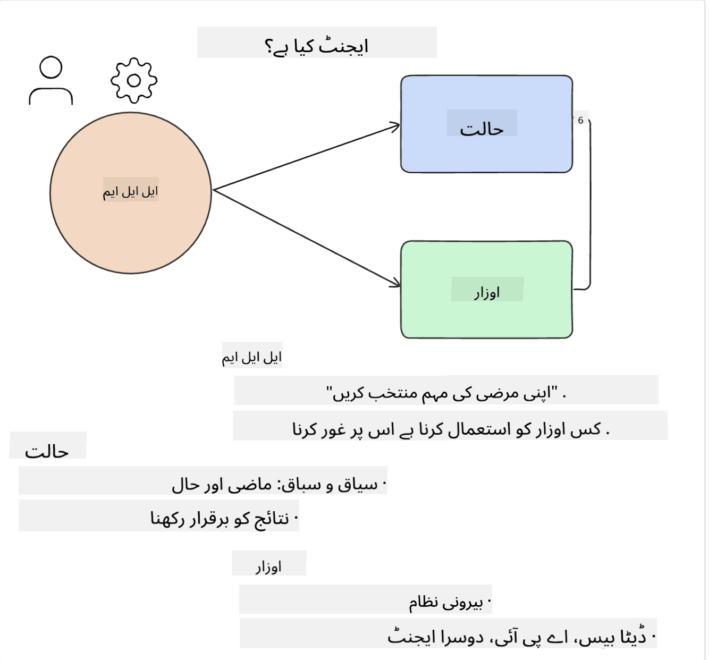
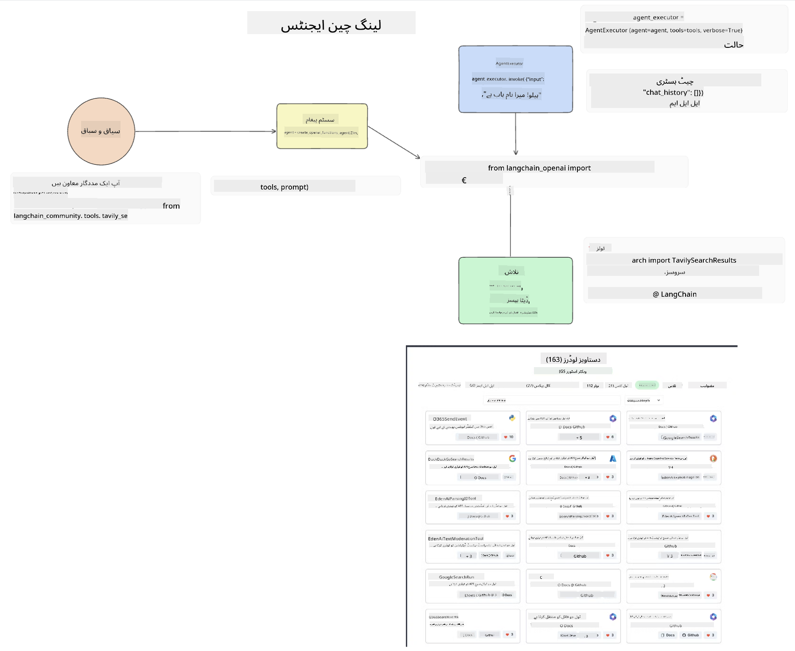
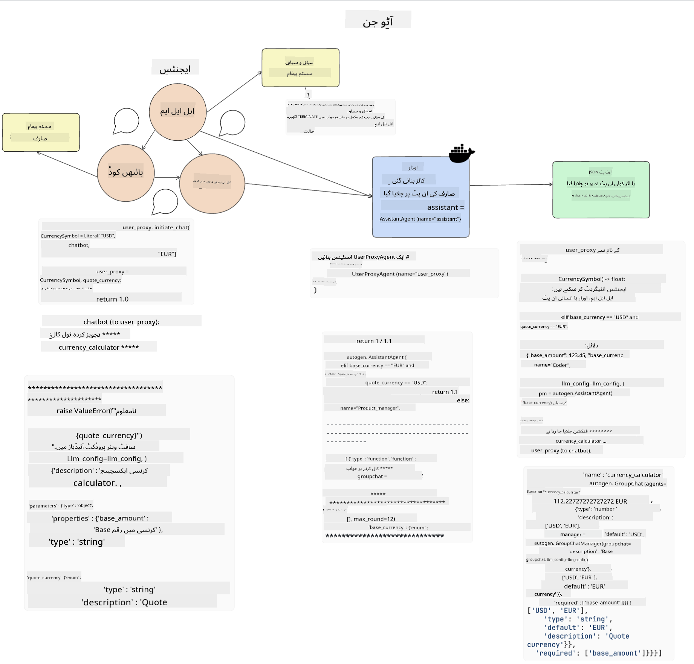

<!--
CO_OP_TRANSLATOR_METADATA:
{
  "original_hash": "8e8d1f6a63da606af7176a87ff8e92b6",
  "translation_date": "2025-10-17T13:09:38+00:00",
  "source_file": "17-ai-agents/README.md",
  "language_code": "ur"
}
-->
[](https://youtu.be/yAXVW-lUINc?si=bOtW9nL6jc3XJgOM)

## تعارف

اے آئی ایجنٹس جنریٹو اے آئی میں ایک دلچسپ ترقی کی نمائندگی کرتے ہیں، جو بڑے لینگویج ماڈلز (LLMs) کو معاونین سے ایجنٹس میں تبدیل کرنے کی صلاحیت فراہم کرتے ہیں جو عمل انجام دے سکتے ہیں۔ اے آئی ایجنٹ فریم ورک ڈویلپرز کو ایسی ایپلیکیشنز بنانے کی اجازت دیتے ہیں جو LLMs کو ٹولز اور اسٹیٹ مینجمنٹ تک رسائی فراہم کرتے ہیں۔ یہ فریم ورک صارفین اور ڈویلپرز کو LLMs کے منصوبہ بند اعمال کی نگرانی کرنے کی اجازت دے کر تجربے کے انتظام کو بہتر بناتے ہیں۔

یہ سبق درج ذیل موضوعات کا احاطہ کرے گا:

- اے آئی ایجنٹ کیا ہے - اے آئی ایجنٹ اصل میں کیا ہے؟
- چار مختلف اے آئی ایجنٹ فریم ورک کا جائزہ - ان میں کیا خاص بات ہے؟
- ان اے آئی ایجنٹس کو مختلف استعمال کے کیسز میں لاگو کرنا - ہمیں اے آئی ایجنٹس کب استعمال کرنے چاہئیں؟

## سیکھنے کے اہداف

اس سبق کے بعد آپ قابل ہوں گے:

- وضاحت کریں کہ اے آئی ایجنٹس کیا ہیں اور انہیں کیسے استعمال کیا جا سکتا ہے۔
- کچھ مشہور اے آئی ایجنٹ فریم ورک کے فرق کو سمجھیں اور ان میں کیا فرق ہے۔
- سمجھیں کہ اے آئی ایجنٹس کیسے کام کرتے ہیں تاکہ ان کے ساتھ ایپلیکیشنز بنائی جا سکیں۔

## اے آئی ایجنٹس کیا ہیں؟

اے آئی ایجنٹس جنریٹو اے آئی کی دنیا میں ایک بہت ہی دلچسپ میدان ہیں۔ اس دلچسپی کے ساتھ کبھی کبھار اصطلاحات اور ان کے اطلاق میں الجھن بھی آتی ہے۔ چیزوں کو آسان اور زیادہ تر ٹولز کو شامل رکھنے کے لیے جو اے آئی ایجنٹس کا حوالہ دیتے ہیں، ہم یہ تعریف استعمال کریں گے:

اے آئی ایجنٹس بڑے لینگویج ماڈلز (LLMs) کو **اسٹیٹ** اور **ٹولز** تک رسائی دے کر کام انجام دینے کی اجازت دیتے ہیں۔



آئیے ان اصطلاحات کی وضاحت کریں:

**بڑے لینگویج ماڈلز** - یہ وہ ماڈلز ہیں جن کا اس کورس میں حوالہ دیا گیا ہے جیسے GPT-3.5، GPT-4، Llama-2 وغیرہ۔

**اسٹیٹ** - یہ اس سیاق و سباق کو ظاہر کرتا ہے جس میں LLM کام کر رہا ہے۔ LLM اپنے ماضی کے اعمال اور موجودہ سیاق و سباق کو استعمال کرتا ہے، جو اس کے اگلے اعمال کے لیے فیصلہ سازی کی رہنمائی کرتا ہے۔ اے آئی ایجنٹ فریم ورک ڈویلپرز کو اس سیاق و سباق کو آسانی سے برقرار رکھنے کی اجازت دیتے ہیں۔

**ٹولز** - صارف کی درخواست کردہ کام کو مکمل کرنے کے لیے اور جو LLM نے منصوبہ بنایا ہے، LLM کو ٹولز تک رسائی کی ضرورت ہوتی ہے۔ ٹولز کی کچھ مثالیں ڈیٹا بیس، API، ایک بیرونی ایپلیکیشن یا یہاں تک کہ ایک اور LLM ہو سکتی ہیں!

یہ تعریفیں امید ہے کہ آپ کو آگے بڑھنے کے لیے ایک اچھی بنیاد فراہم کریں گی جب ہم دیکھیں گے کہ انہیں کیسے نافذ کیا جاتا ہے۔ آئیے کچھ مختلف اے آئی ایجنٹ فریم ورک کا جائزہ لیں:

## لینگ چین ایجنٹس

[لینگ چین ایجنٹس](https://python.langchain.com/docs/how_to/#agents?WT.mc_id=academic-105485-koreyst) اوپر دی گئی تعریفوں کا ایک نفاذ ہے۔

**اسٹیٹ** کو منظم کرنے کے لیے، یہ ایک بلٹ ان فنکشن استعمال کرتا ہے جسے `AgentExecutor` کہا جاتا ہے۔ یہ متعین `agent` اور دستیاب `tools` کو قبول کرتا ہے۔

`Agent Executor` چیٹ کی تاریخ کو بھی ذخیرہ کرتا ہے تاکہ چیٹ کے سیاق و سباق فراہم کیا جا سکے۔



لینگ چین ایک [ٹولز کی کیٹلاگ](https://integrations.langchain.com/tools?WT.mc_id=academic-105485-koreyst) پیش کرتا ہے جسے آپ کی ایپلیکیشن میں درآمد کیا جا سکتا ہے جس میں LLM کو رسائی حاصل ہو سکتی ہے۔ یہ کمیونٹی اور لینگ چین ٹیم کے ذریعہ بنائے گئے ہیں۔

آپ ان ٹولز کو متعین کر سکتے ہیں اور انہیں `Agent Executor` کو پاس کر سکتے ہیں۔

جب اے آئی ایجنٹس کی بات ہو تو مرئیت ایک اور اہم پہلو ہے۔ ایپلیکیشن ڈویلپرز کے لیے یہ سمجھنا ضروری ہے کہ LLM کون سا ٹول استعمال کر رہا ہے اور کیوں۔ اس کے لیے، لینگ چین ٹیم نے لینگ اسمتھ تیار کیا ہے۔

## آٹو جن

اگلا اے آئی ایجنٹ فریم ورک جس پر ہم بات کریں گے وہ ہے [آٹو جن](https://microsoft.github.io/autogen/?WT.mc_id=academic-105485-koreyst)۔ آٹو جن کا بنیادی فوکس گفتگو ہے۔ ایجنٹس دونوں **گفتگو کرنے والے** اور **حسب ضرورت** ہیں۔

**گفتگو کرنے والے -** LLMs ایک دوسرے LLM کے ساتھ گفتگو شروع کر سکتے ہیں اور جاری رکھ سکتے ہیں تاکہ ایک کام مکمل کیا جا سکے۔ یہ `AssistantAgents` بنا کر اور انہیں ایک مخصوص سسٹم میسج دے کر کیا جاتا ہے۔

```python

autogen.AssistantAgent( name="Coder", llm_config=llm_config, ) pm = autogen.AssistantAgent( name="Product_manager", system_message="Creative in software product ideas.", llm_config=llm_config, )

```

**حسب ضرورت** - ایجنٹس کو نہ صرف LLMs کے طور پر بلکہ صارف یا ٹول کے طور پر بھی متعین کیا جا سکتا ہے۔ ایک ڈویلپر کے طور پر، آپ ایک `UserProxyAgent` متعین کر سکتے ہیں جو صارف کے ساتھ کام مکمل کرنے کے لیے فیڈ بیک کے لیے بات چیت کرنے کا ذمہ دار ہے۔ یہ فیڈ بیک یا تو کام کے نفاذ کو جاری رکھ سکتا ہے یا اسے روک سکتا ہے۔

```python
user_proxy = UserProxyAgent(name="user_proxy")
```

### اسٹیٹ اور ٹولز

اسٹیٹ کو تبدیل کرنے اور منظم کرنے کے لیے، ایک اسسٹنٹ ایجنٹ Python کوڈ تیار کرتا ہے تاکہ کام مکمل کیا جا سکے۔

یہاں عمل کی ایک مثال ہے:



#### سسٹم میسج کے ساتھ متعین LLM

```python
system_message="For weather related tasks, only use the functions you have been provided with. Reply TERMINATE when the task is done."
```

یہ سسٹم میسج اس مخصوص LLM کو ہدایت دیتا ہے کہ کون سے فنکشنز اس کے کام کے لیے متعلقہ ہیں۔ یاد رکھیں، آٹو جن کے ساتھ آپ مختلف سسٹم میسجز کے ساتھ متعدد متعین AssistantAgents رکھ سکتے ہیں۔

#### چیٹ صارف کے ذریعہ شروع کی جاتی ہے

```python
user_proxy.initiate_chat( chatbot, message="I am planning a trip to NYC next week, can you help me pick out what to wear? ", )

```

یہ پیغام user_proxy (انسان) سے وہ عمل شروع کرے گا جس میں ایجنٹ ان ممکنہ فنکشنز کو تلاش کرے گا جنہیں اسے نافذ کرنا چاہیے۔

#### فنکشن نافذ کیا جاتا ہے

```bash
chatbot (to user_proxy):

***** Suggested tool Call: get_weather ***** Arguments: {"location":"New York City, NY","time_periond:"7","temperature_unit":"Celsius"} ******************************************************** --------------------------------------------------------------------------------

>>>>>>>> EXECUTING FUNCTION get_weather... user_proxy (to chatbot): ***** Response from calling function "get_weather" ***** 112.22727272727272 EUR ****************************************************************

```

ایک بار جب ابتدائی چیٹ پر عمل کیا جاتا ہے، ایجنٹ تجویز کردہ ٹول کو کال کرنے کے لیے بھیجے گا۔ اس معاملے میں، یہ ایک فنکشن ہے جسے `get_weather` کہا جاتا ہے۔ آپ کی کنفیگریشن پر منحصر ہے، یہ فنکشن خود بخود ایجنٹ کے ذریعہ نافذ اور پڑھا جا سکتا ہے یا صارف کی ان پٹ کی بنیاد پر نافذ کیا جا سکتا ہے۔

آپ [آٹو جن کوڈ کے نمونے](https://microsoft.github.io/autogen/docs/Examples/?WT.mc_id=academic-105485-koreyst) کی فہرست تلاش کر سکتے ہیں تاکہ مزید دریافت کریں کہ کیسے شروع کیا جائے۔

## ٹاسک ویور

اگلا ایجنٹ فریم ورک جس کا ہم جائزہ لیں گے وہ ہے [ٹاسک ویور](https://microsoft.github.io/TaskWeaver/?WT.mc_id=academic-105485-koreyst)۔ اسے "کوڈ فرسٹ" ایجنٹ کے طور پر جانا جاتا ہے کیونکہ یہ `strings` کے ساتھ سختی سے کام کرنے کے بجائے Python میں DataFrames کے ساتھ کام کر سکتا ہے۔ یہ ڈیٹا تجزیہ اور جنریشن کے کاموں کے لیے انتہائی مفید ہو جاتا ہے۔ یہ چیزیں گراف اور چارٹس بنانے یا بے ترتیب نمبر پیدا کرنے جیسی ہو سکتی ہیں۔

### اسٹیٹ اور ٹولز

گفتگو کے اسٹیٹ کو منظم کرنے کے لیے، ٹاسک ویور `Planner` کے تصور کا استعمال کرتا ہے۔ `Planner` ایک LLM ہے جو صارفین سے درخواست لیتا ہے اور ان کاموں کا نقشہ بناتا ہے جنہیں اس درخواست کو پورا کرنے کے لیے مکمل کرنے کی ضرورت ہے۔

کاموں کو مکمل کرنے کے لیے `Planner` ٹولز کے مجموعہ کو `Plugins` کہا جاتا ہے۔ یہ Python کلاسز یا ایک عمومی کوڈ انٹرپریٹر ہو سکتے ہیں۔ یہ پلگ انز ایمبیڈنگ کے طور پر ذخیرہ کیے جاتے ہیں تاکہ LLM صحیح پلگ ان کو بہتر طریقے سے تلاش کر سکے۔


یہاں ایک پلگ ان کی مثال ہے جو anomaly detection کو ہینڈل کرتا ہے:

```python
class AnomalyDetectionPlugin(Plugin): def __call__(self, df: pd.DataFrame, time_col_name: str, value_col_name: str):
```

کوڈ کو نافذ کرنے سے پہلے تصدیق کی جاتی ہے۔ ٹاسک ویور میں سیاق و سباق کو منظم کرنے کے لیے ایک اور خصوصیت `experience` ہے۔ تجربہ گفتگو کے سیاق و سباق کو طویل مدت تک YAML فائل میں ذخیرہ کرنے کی اجازت دیتا ہے۔ یہ اس طرح ترتیب دیا جا سکتا ہے کہ LLM وقت کے ساتھ مخصوص کاموں پر بہتر ہو جائے کیونکہ یہ پچھلی گفتگو کے سامنے آتا ہے۔

## جارویس

آخری ایجنٹ فریم ورک جس کا ہم جائزہ لیں گے وہ ہے [جارویس](https://github.com/microsoft/JARVIS?tab=readme-ov-file?WT.mc_id=academic-105485-koreyst)۔ جو چیز جارویس کو منفرد بناتی ہے وہ یہ ہے کہ یہ گفتگو کے `state` کو منظم کرنے کے لیے ایک LLM استعمال کرتا ہے اور `tools` دوسرے اے آئی ماڈلز ہیں۔ ہر اے آئی ماڈل مخصوص کام انجام دینے والے ماڈلز ہیں جیسے object detection، transcription یا image captioning۔


LLM، ایک عمومی مقصد ماڈل ہونے کے ناطے، صارف سے درخواست وصول کرتا ہے اور مخصوص کام اور کوئی بھی دلائل/ڈیٹا کی شناخت کرتا ہے جو کام کو مکمل کرنے کے لیے ضروری ہے۔

```python
[{"task": "object-detection", "id": 0, "dep": [-1], "args": {"image": "e1.jpg" }}]
```

LLM پھر درخواست کو اس انداز میں فارمیٹ کرتا ہے کہ مخصوص اے آئی ماڈل اسے سمجھ سکے، جیسے JSON۔ ایک بار جب اے آئی ماڈل نے کام کی بنیاد پر اپنی پیش گوئی واپس کر دی، LLM جواب وصول کرتا ہے۔

اگر کام کو مکمل کرنے کے لیے متعدد ماڈلز کی ضرورت ہو، تو یہ ان ماڈلز سے جواب کی تشریح بھی کرے گا اس سے پہلے کہ انہیں ایک ساتھ لایا جائے تاکہ صارف کو جواب تیار کیا جا سکے۔

ذیل کی مثال دکھاتی ہے کہ یہ کیسے کام کرے گا جب ایک صارف تصویر میں اشیاء کی تفصیل اور تعداد کی درخواست کر رہا ہو:

## اسائنمنٹ

اے آئی ایجنٹس کے بارے میں اپنی تعلیم جاری رکھنے کے لیے آپ آٹو جن کے ساتھ بنا سکتے ہیں:

- ایک ایپلیکیشن جو ایک تعلیمی اسٹارٹ اپ کے مختلف ڈیپارٹمنٹس کے ساتھ بزنس میٹنگ کی نقل کرتی ہے۔
- سسٹم میسجز بنائیں جو LLMs کو مختلف شخصیات اور ترجیحات کو سمجھنے میں رہنمائی کریں، اور صارف کو ایک نیا پروڈکٹ آئیڈیا پیش کرنے کے قابل بنائیں۔
- پھر LLM کو ہر ڈیپارٹمنٹ سے فالو اپ سوالات پیدا کرنے چاہئیں تاکہ پچ اور پروڈکٹ آئیڈیا کو بہتر بنایا جا سکے۔

## سیکھنا یہاں ختم نہیں ہوتا، سفر جاری رکھیں

اس سبق کو مکمل کرنے کے بعد، ہمارے [جنریٹو اے آئی لرننگ کلیکشن](https://aka.ms/genai-collection?WT.mc_id=academic-105485-koreyst) کو دیکھیں تاکہ جنریٹو اے آئی کے علم کو مزید بڑھایا جا سکے!

---

**ڈسکلیمر**:  
یہ دستاویز AI ترجمہ سروس [Co-op Translator](https://github.com/Azure/co-op-translator) کا استعمال کرتے ہوئے ترجمہ کی گئی ہے۔ ہم درستگی کے لیے کوشش کرتے ہیں، لیکن براہ کرم آگاہ رہیں کہ خودکار ترجمے میں غلطیاں یا غیر درستیاں ہو سکتی ہیں۔ اصل دستاویز کو اس کی اصل زبان میں مستند ذریعہ سمجھا جانا چاہیے۔ اہم معلومات کے لیے، پیشہ ور انسانی ترجمہ کی سفارش کی جاتی ہے۔ ہم اس ترجمے کے استعمال سے پیدا ہونے والی کسی بھی غلط فہمی یا غلط تشریح کے ذمہ دار نہیں ہیں۔