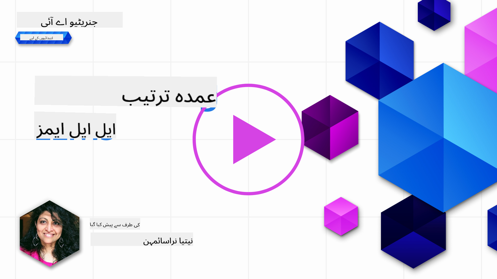

<!--
CO_OP_TRANSLATOR_METADATA:
{
  "original_hash": "68664f7e754a892ae1d8d5e2b7bd2081",
  "translation_date": "2025-05-20T07:37:31+00:00",
  "source_file": "18-fine-tuning/README.md",
  "language_code": "ur"
}
-->

# اپنے LLM کو بہتر بنانا

بڑے زبان ماڈلز کو استعمال کرتے ہوئے جنریٹو AI ایپلی کیشنز بنانے میں نئے چیلنجز آتے ہیں۔ ایک اہم مسئلہ ماڈل کے ذریعے تیار کردہ مواد کے جواب کی کوالٹی (درستگی اور مطابقت) کو یقینی بنانا ہے۔ پچھلے اسباق میں، ہم نے تکنیکوں جیسے پرامپٹ انجینئرنگ اور ریٹریول-آگمنٹڈ جنریشن پر بات کی جو موجودہ ماڈل کے _پرامپٹ ان پٹ کو تبدیل_ کرکے مسئلے کو حل کرنے کی کوشش کرتے ہیں۔

آج کے سبق میں، ہم تیسری تکنیک، **فائن ٹیوننگ** پر بات کرتے ہیں، جو اضافی ڈیٹا کے ساتھ _ماڈل کو دوبارہ تربیت دے کر_ چیلنج کو حل کرنے کی کوشش کرتی ہے۔ آئیے تفصیلات میں جاتے ہیں۔

## سیکھنے کے مقاصد

یہ سبق پہلے سے تربیت یافتہ زبان ماڈلز کے لیے فائن ٹیوننگ کے تصور کو متعارف کراتا ہے، اس نقطہ نظر کے فوائد اور چیلنجز کو تلاش کرتا ہے، اور اس بات کی رہنمائی فراہم کرتا ہے کہ کب اور کیسے اپنے جنریٹو AI ماڈلز کی کارکردگی کو بہتر بنانے کے لیے فائن ٹیوننگ کا استعمال کیا جائے۔

سبق کے اختتام تک، آپ کو مندرجہ ذیل سوالات کا جواب دینے کے قابل ہونا چاہئے:

- زبان ماڈلز کے لیے فائن ٹیوننگ کیا ہے؟
- کب، اور کیوں، فائن ٹیوننگ مفید ہے؟
- میں ایک پہلے سے تربیت یافتہ ماڈل کو کیسے فائن ٹیون کر سکتا ہوں؟
- فائن ٹیوننگ کی حدود کیا ہیں؟

تیار؟ آئیے شروع کرتے ہیں۔

## تصویری رہنمائی

کیا آپ گہرائی میں جانے سے پہلے ہم جو کچھ کور کریں گے اس کی بڑی تصویر دیکھنا چاہتے ہیں؟ اس تصویری رہنمائی کو چیک کریں جو اس سبق کے لیے سیکھنے کے سفر کی وضاحت کرتی ہے - فائن ٹیوننگ کے بنیادی تصورات اور محرکات کو سیکھنے سے لے کر، عمل کو سمجھنے اور فائن ٹیوننگ کے کام کو انجام دینے کے بہترین طریقوں تک۔ یہ دریافت کرنے کے لیے ایک دلچسپ موضوع ہے، لہذا اپنے خود ساختہ سیکھنے کے سفر کی حمایت کے لیے اضافی لنکس کے لیے [وسائل](./RESOURCES.md?WT.mc_id=academic-105485-koreyst) صفحہ کو دیکھنا نہ بھولیں!

## زبان ماڈلز کے لیے فائن ٹیوننگ کیا ہے؟

تعریف کے مطابق، بڑے زبان ماڈلز کو _پہلے سے تربیت یافتہ_ کیا جاتا ہے مختلف ذرائع بشمول انٹرنیٹ سے حاصل کردہ بڑی مقدار میں متن پر۔ جیسا کہ ہم نے پچھلے اسباق میں سیکھا ہے، ہمیں تکنیکوں جیسے _پرامپٹ انجینئرنگ_ اور _ریٹریول-آگمنٹڈ جنریشن_ کی ضرورت ہے تاکہ صارف کے سوالات ("پرامپٹس") کے جوابات کی کوالٹی کو بہتر بنایا جا سکے۔

پرامپٹ انجینئرنگ کی ایک مقبول تکنیک ماڈل کو جواب میں کیا توقع کی جاتی ہے اس پر مزید رہنمائی دینے میں شامل ہے یا تو _ہدایات_ (واضح رہنمائی) فراہم کر کے یا _کچھ مثالیں دے کر_ (غیر واضح رہنمائی)۔ اسے _فیوشوٹ لرننگ_ کہا جاتا ہے لیکن اس کی دو حدود ہیں:

- ماڈل ٹوکن کی حدیں آپ کو دی جانے والی مثالوں کی تعداد کو محدود کر سکتی ہیں، اور تاثیر کو محدود کر سکتی ہیں۔
- ماڈل ٹوکن کے اخراجات ہر پرامپٹ میں مثالیں شامل کرنے کو مہنگا بنا سکتے ہیں، اور لچک کو محدود کر سکتے ہیں۔

فائن ٹیوننگ مشین لرننگ سسٹمز میں ایک عام عمل ہے جہاں ہم ایک پہلے سے تربیت یافتہ ماڈل لیتے ہیں اور اسے مخصوص کام پر اپنی کارکردگی کو بہتر بنانے کے لیے نئے ڈیٹا کے ساتھ دوبارہ تربیت دیتے ہیں۔ زبان ماڈلز کے تناظر میں، ہم پہلے سے تربیت یافتہ ماڈل کو _کسی دیے گئے کام یا ایپلیکیشن ڈومین کے لیے مثالوں کے منتخب کردہ سیٹ کے ساتھ_ فائن ٹیون کر سکتے ہیں تاکہ ایک **حسب ضرورت ماڈل** بنایا جا سکے جو اس مخصوص کام یا ڈومین کے لیے زیادہ درست اور متعلقہ ہو۔ فائن ٹیوننگ کا ایک ضمنی فائدہ یہ ہے کہ یہ فیوشوٹ لرننگ کے لیے درکار مثالوں کی تعداد کو بھی کم کر سکتا ہے - ٹوکن کے استعمال اور متعلقہ اخراجات کو کم کرنا۔

## کب اور کیوں ہمیں ماڈلز کو فائن ٹیون کرنا چاہیے؟

_اس_ تناظر میں، جب ہم فائن ٹیوننگ کی بات کرتے ہیں، تو ہم **نگرانی شدہ** فائن ٹیوننگ کا حوالہ دے رہے ہیں جہاں دوبارہ تربیت **نئے ڈیٹا کو شامل کرکے** کی جاتی ہے جو اصل تربیتی ڈیٹاسیٹ کا حصہ نہیں تھا۔ یہ ایک غیر نگرانی شدہ فائن ٹیوننگ نقطہ نظر سے مختلف ہے جہاں ماڈل کو اصل ڈیٹا پر دوبارہ تربیت دی جاتی ہے، لیکن مختلف ہائپر پیرامیٹرز کے ساتھ۔

اہم بات یہ یاد رکھنی ہے کہ فائن ٹیوننگ ایک اعلی درجے کی تکنیک ہے جو مطلوبہ نتائج حاصل کرنے کے لیے ایک خاص سطح کی مہارت کی ضرورت ہوتی ہے۔ اگر غلط طریقے سے کیا جائے تو، یہ متوقع بہتری فراہم نہیں کر سکتا، اور یہاں تک کہ آپ کے ہدف کردہ ڈومین کے لیے ماڈل کی کارکردگی کو بھی کم کر سکتا ہے۔

لہذا، زبان ماڈلز کو "کیسے" فائن ٹیون کرنا سیکھنے سے پہلے، آپ کو یہ جاننا ہوگا کہ آپ کو اس راستے پر کیوں جانا چاہیے، اور فائن ٹیوننگ کے عمل کو کب شروع کرنا ہے۔ اپنے آپ سے یہ سوالات پوچھ کر شروع کریں:

- **استعمال کا کیس**: آپ کے فائن ٹیوننگ کے لیے _استعمال کا کیس_ کیا ہے؟ موجودہ پہلے سے تربیت یافتہ ماڈل کے کس پہلو کو آپ بہتر بنانا چاہتے ہیں؟
- **متبادلات**: کیا آپ نے مطلوبہ نتائج حاصل کرنے کے لیے _دیگر تکنیکوں_ کو آزمایا ہے؟ ان کا استعمال موازنہ کے لیے ایک بنیاد بنانے کے لیے کریں۔
  - پرامپٹ انجینئرنگ: متعلقہ پرامپٹ جوابات کی مثالوں کے ساتھ فیوشوٹ پرامپٹنگ جیسی تکنیکوں کو آزمائیں۔ جوابات کے معیار کا اندازہ لگائیں۔
  - ریٹریول آگمنٹڈ جنریشن: اپنے ڈیٹا کو تلاش کرکے بازیافت کیے گئے کوئری نتائج کے ساتھ پرامپٹس کو بڑھانے کی کوشش کریں۔ جوابات کے معیار کا اندازہ لگائیں۔
- **اخراجات**: کیا آپ نے فائن ٹیوننگ کے اخراجات کی نشاندہی کی ہے؟
  - ٹیون ایبلٹی - کیا پہلے سے تربیت یافتہ ماڈل فائن ٹیوننگ کے لیے دستیاب ہے؟
  - کوشش - تربیتی ڈیٹا تیار کرنے، ماڈل کا اندازہ لگانے اور اسے بہتر بنانے کے لیے۔
  - کمپیوٹ - فائن ٹیوننگ جابز چلانے اور فائن ٹیونڈ ماڈل کو تعینات کرنے کے لیے
  - ڈیٹا - فائن ٹیوننگ کے اثر کے لیے کافی معیار کی مثالوں تک رسائی
- **فوائد**: کیا آپ نے فائن ٹیوننگ کے فوائد کی تصدیق کی ہے؟
  - معیار - کیا فائن ٹیونڈ ماڈل نے بنیاد سے بہتر کارکردگی کا مظاہرہ کیا؟
  - لاگت - کیا یہ پرامپٹس کو آسان بنا کر ٹوکن کے استعمال کو کم کرتا ہے؟
  - توسیع پذیری - کیا آپ بنیادی ماڈل کو نئے ڈومینز کے لیے دوبارہ استعمال کر سکتے ہیں؟

ان سوالات کے جواب دے کر، آپ کو یہ فیصلہ کرنے کے قابل ہونا چاہئے کہ آیا فائن ٹیوننگ آپ کے استعمال کے کیس کے لیے صحیح نقطہ نظر ہے۔ مثالی طور پر، نقطہ نظر صرف اسی صورت میں درست ہے جب فوائد اخراجات سے زیادہ ہوں۔ ایک بار جب آپ آگے بڑھنے کا فیصلہ کرتے ہیں، تو یہ سوچنے کا وقت ہے کہ آپ پہلے سے تربیت یافتہ ماڈل کو _کیسے_ فائن ٹیون کر سکتے ہیں۔

فیصلہ سازی کے عمل پر مزید بصیرت حاصل کرنا چاہتے ہیں؟ [فائن ٹیون کرنا ہے یا نہیں](https://www.youtube.com/watch?v=0Jo-z-MFxJs) دیکھیں

## ہم پہلے سے تربیت یافتہ ماڈل کو کیسے فائن ٹیون کر سکتے ہیں؟

ایک پہلے سے تربیت یافتہ ماڈل کو فائن ٹیون کرنے کے لیے، آپ کو ضرورت ہے:

- فائن ٹیون کرنے کے لیے ایک پہلے سے تربیت یافتہ ماڈل
- فائن ٹیوننگ کے لیے استعمال کرنے کے لیے ایک ڈیٹاسیٹ
- فائن ٹیوننگ جاب چلانے کے لیے ایک تربیتی ماحول
- فائن ٹیونڈ ماڈل کو تعینات کرنے کے لیے ایک ہوسٹنگ ماحول

## فائن ٹیوننگ عملی طور پر

مندرجہ ذیل وسائل آپ کو منتخب کردہ ماڈل کے ساتھ ایک منتخب ڈیٹاسیٹ کا استعمال کرتے ہوئے ایک حقیقی مثال کے ذریعے قدم بہ قدم سبق فراہم کرتے ہیں۔ ان سبق کو مکمل کرنے کے لیے، آپ کو مخصوص فراہم کنندہ پر اکاؤنٹ کی ضرورت ہے، ساتھ ہی متعلقہ ماڈل اور ڈیٹاسیٹ تک رسائی کی بھی ضرورت ہے۔

| فراہم کنندہ   | سبق                                                                                                                                                                       | تفصیل                                                                                                                                                                                                                                                                                                                                                                                                                        |
| ------------ | ------------------------------------------------------------------------------------------------------------------------------------------------------------------------------ | ---------------------------------------------------------------------------------------------------------------------------------------------------------------------------------------------------------------------------------------------------------------------------------------------------------------------------------------------------------------------------------------------------------------------------------- |
| اوپن اے آئی       | [چیٹ ماڈلز کو فائن ٹیون کیسے کریں](https://github.com/openai/openai-cookbook/blob/main/examples/How_to_finetune_chat_models.ipynb?WT.mc_id=academic-105485-koreyst)                | تربیتی ڈیٹا تیار کرکے، فائن ٹیوننگ جاب چلا کر، اور استفسار کے لیے فائن ٹیونڈ ماڈل کا استعمال کرکے ایک مخصوص ڈومین ("ریسپی اسسٹنٹ") کے لیے `gpt-35-turbo` کو فائن ٹیون کرنا سیکھیں۔                                                                                                                                                                                                                                              |
| ایزور اوپن اے آئی | [GPT 3.5 ٹربو فائن ٹیوننگ سبق](https://learn.microsoft.com/azure/ai-services/openai/tutorials/fine-tune?tabs=python-new%2Ccommand-line?WT.mc_id=academic-105485-koreyst) | `gpt-35-turbo-0613` ماڈل کو **ایزور پر** فائن ٹیون کرنا سیکھیں تربیتی ڈیٹا بنانے اور اپ لوڈ کرنے کے اقدامات کرکے، فائن ٹیوننگ جاب چلائیں۔ نیا ماڈل تعینات کریں اور استعمال کریں۔                                                                                                                                                                                                                                                                 |
| ہگنگ فیس | [ہگنگ فیس کے ساتھ LLMs کو فائن ٹیون کرنا](https://www.philschmid.de/fine-tune-llms-in-2024-with-trl?WT.mc_id=academic-105485-koreyst)                                               | یہ بلاگ پوسٹ آپ کو _کھلے LLM_ (مثال: `CodeLlama 7B`) کو [ٹرنسفارمرز](https://huggingface.co/docs/transformers/index?WT.mc_id=academic-105485-koreyst) لائبریری اور [ٹرنسفارمر رینفورسمنٹ لرننگ (TRL)](https://huggingface.co/docs/trl/index?WT.mc_id=academic-105485-koreyst]) کے ساتھ کھلے [ڈیٹاسیٹس](https://huggingface.co/docs/datasets/index?WT.mc_id=academic-105485-koreyst) پر ہگنگ فیس پر فائن ٹیون کرنے کے ذریعے لے جاتی ہے۔ |
|              |                                                                                                                                                                                |                                                                                                                                                                                                                                                                                                                                                                                                                                    |
| 🤗 آٹوٹرین | [آٹوٹرین کے ساتھ LLMs کو فائن ٹیون کرنا](https://github.com/huggingface/autotrain-advanced/?WT.mc_id=academic-105485-koreyst)                                                         | آٹوٹرین (یا آٹوٹرین ایڈوانسڈ) ہگنگ فیس کے ذریعہ تیار کردہ ایک پائیتھن لائبریری ہے جو بہت سے مختلف کاموں بشمول LLM فائن ٹیوننگ کے لیے فائن ٹیوننگ کی اجازت دیتی ہے۔ آٹوٹرین ایک نان کوڈ حل ہے اور فائن ٹیوننگ آپ کے اپنے کلاؤڈ میں، ہگنگ فیس اسپیسز پر یا مقامی طور پر کی جا سکتی ہے۔ یہ ویب پر مبنی GUI، CLI اور yaml کنفیگ فائلوں کے ذریعے تربیت دونوں کی حمایت کرتا ہے۔                                                                               |
|              |                                                                                                                                                                                |                                                                                                                                                                                                                                                                                                                                                                                                                                    |

## اسائنمنٹ

اوپر دیے گئے سبق میں سے ایک کو منتخب کریں اور ان کے ذریعے چلیں۔ _ہم صرف حوالہ کے لیے اس ریپو میں جیوپیٹر نوٹ بکس میں ان سبقوں کے ایک ورژن کو نقل کر سکتے ہیں۔ براہ کرم تازہ ترین ورژن حاصل کرنے کے لیے اصل ذرائع کا براہ راست استعمال کریں_۔

## زبردست کام! اپنی سیکھنے کو جاری رکھیں۔

یہ سبق مکمل کرنے کے بعد، ہمارے [جنریٹو AI لرننگ کلیکشن](https://aka.ms/genai-collection?WT.mc_id=academic-105485-koreyst) کو چیک کریں تاکہ اپنی جنریٹو AI معلومات کو بڑھاتے رہیں!

مبارک ہو!! آپ نے اس کورس کے لیے v2 سیریز سے آخری سبق مکمل کر لیا ہے! سیکھنا اور بنانا بند نہ کریں۔ \*\*صرف اس موضوع کے لیے اضافی تجاویز کی فہرست کے لیے [وسائل](RESOURCES.md?WT.mc_id=academic-105485-koreyst) صفحہ کو چیک کریں۔

ہمارے v1 سیریز کے اسباق کو بھی مزید اسائنمنٹس اور تصورات کے ساتھ اپ ڈیٹ کیا گیا ہے۔ تو اپنے علم کو تازہ کرنے کے لیے ایک منٹ نکالیں - اور براہ کرم [اپنے سوالات اور آراء کا اشتراک کریں](https://github.com/microsoft/generative-ai-for-beginners/issues?WT.mc_id=academic-105485-koreyst) تاکہ ہم ان اسباق کو کمیونٹی کے لیے بہتر بنا سکیں۔

**ڈس کلیمر**:
یہ دستاویز AI ترجمہ سروس [Co-op Translator](https://github.com/Azure/co-op-translator) کا استعمال کرتے ہوئے ترجمہ کی گئی ہے۔ ہم درستگی کے لیے کوشش کرتے ہیں، لیکن براہ کرم آگاہ رہیں کہ خودکار ترجمے میں غلطیاں یا غیر درستیاں ہوسکتی ہیں۔ اصل دستاویز کو اس کی مادری زبان میں مستند ذریعہ سمجھا جانا چاہیے۔ اہم معلومات کے لیے، پیشہ ورانہ انسانی ترجمہ کی سفارش کی جاتی ہے۔ ہم اس ترجمے کے استعمال سے پیدا ہونے والے کسی بھی غلط فہمی یا غلط تشریح کے ذمہ دار نہیں ہیں۔