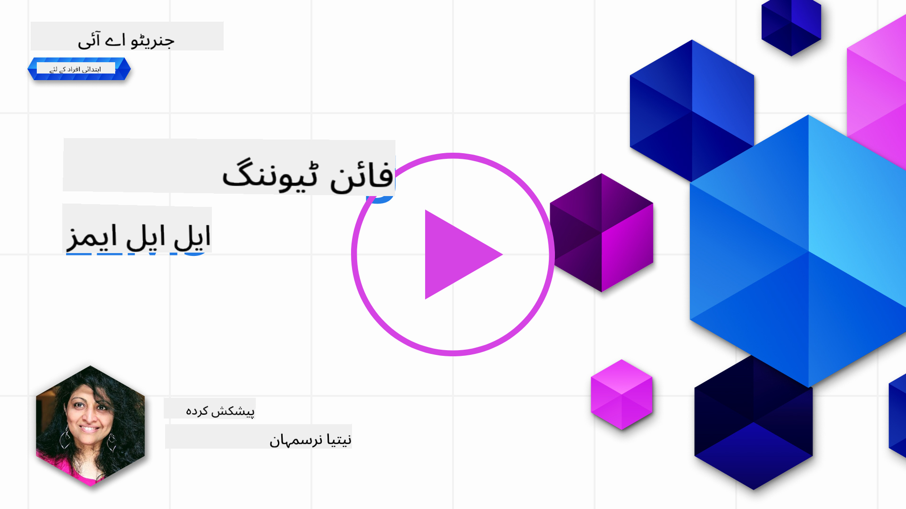

<!--
CO_OP_TRANSLATOR_METADATA:
{
  "original_hash": "68664f7e754a892ae1d8d5e2b7bd2081",
  "translation_date": "2025-06-26T00:32:17+00:00",
  "source_file": "18-fine-tuning/README.md",
  "language_code": "ur"
}
-->

# اپنے LLM کو بہتر بنائیں

بڑے زبان ماڈلز کو استعمال کرتے ہوئے جنریٹیو AI ایپلی کیشنز بنانا نئے چیلنجز کے ساتھ آتا ہے۔ ایک اہم مسئلہ ماڈل کے ذریعے پیدا کردہ مواد کی کوالٹی (درستی اور متعلقہ) کو یقینی بنانا ہے جو صارف کی درخواست کے لئے ہے۔ پچھلے سبقوں میں، ہم نے پرامپٹ انجینئرنگ اور ریٹریول-آگمینٹڈ جنریشن جیسے تکنیکوں پر بات کی جو موجودہ ماڈل کے پرامپٹ ان پٹ کو _تبدیل_ کرکے مسئلہ کو حل کرنے کی کوشش کرتے ہیں۔

آج کے سبق میں، ہم ایک تیسری تکنیک **فائن ٹیوننگ** پر بات کرتے ہیں، جو چیلنج کو _ماڈل کو خود دوبارہ تربیت دینے_ کے ذریعے اضافی ڈیٹا کے ساتھ حل کرنے کی کوشش کرتی ہے۔ آئیے تفصیلات میں جائیں۔

## سیکھنے کے مقاصد

یہ سبق پہلے سے تربیت یافتہ زبان ماڈلز کے لئے فائن ٹیوننگ کے تصور کو متعارف کراتا ہے، اس نقطہ نظر کے فوائد اور چیلنجز کو تلاش کرتا ہے، اور آپ کے جنریٹیو AI ماڈلز کی کارکردگی کو بہتر بنانے کے لئے فائن ٹیوننگ کے استعمال کے وقت اور طریقے پر رہنمائی فراہم کرتا ہے۔

اس سبق کے اختتام تک، آپ کو درج ذیل سوالات کے جواب دینے کے قابل ہونا چاہئے:

- زبان ماڈلز کے لئے فائن ٹیوننگ کیا ہے؟
- کب اور کیوں فائن ٹیوننگ مفید ہے؟
- میں پہلے سے تربیت یافتہ ماڈل کو کیسے فائن ٹیون کر سکتا ہوں؟
- فائن ٹیوننگ کی حدود کیا ہیں؟

تیار ہیں؟ شروع کریں۔

## تصویری گائیڈ

کیا آپ اس سبق میں شامل ہونے والے بڑے تصویر کو سمجھنا چاہتے ہیں؟ اس تصویری گائیڈ کو دیکھیں جو فائن ٹیوننگ کے لئے سیکھنے کے سفر کو بیان کرتا ہے - بنیادی تصورات اور فائن ٹیوننگ کی تحریک سے لے کر فائن ٹیوننگ کے کام کو انجام دینے کے عمل اور بہترین طریقوں کو سمجھنے تک۔ یہ ایک دلچسپ موضوع ہے، لہذا خود سیکھنے کے سفر کی حمایت کے لئے اضافی روابط کے لئے [وسائل](./RESOURCES.md?WT.mc_id=academic-105485-koreyst) صفحہ کو دیکھنا نہ بھولیں!

## زبان ماڈلز کے لئے فائن ٹیوننگ کیا ہے؟

تعریف کے مطابق، بڑے زبان ماڈلز _پہلے سے تربیت یافتہ_ ہوتے ہیں جو انٹرنیٹ سمیت مختلف ذرائع سے حاصل کردہ بڑے مقدار میں متن پر تربیت یافتہ ہوتے ہیں۔ جیسا کہ ہم نے پچھلے سبقوں میں سیکھا ہے، ہمیں تکنیکوں کی ضرورت ہوتی ہے جیسے _پرامپٹ انجینئرنگ_ اور _ریٹریول-آگمینٹڈ جنریشن_ تاکہ صارف کے سوالات ("پرامپٹس") کے جوابات کے معیار کو بہتر بنایا جا سکے۔

ایک مقبول پرامپٹ انجینئرنگ تکنیک میں ماڈل کو جواب میں کیا توقع کی جاتی ہے اس پر زیادہ رہنمائی دینا شامل ہوتا ہے، یا تو _ہدایات_ (واضح رہنمائی) فراہم کر کے یا _کچھ مثالیں دے کر_ (غیر واضح رہنمائی)۔ اسے _فیوشوٹ لرننگ_ کہا جاتا ہے لیکن اس کے دو حدود ہیں:

- ماڈل ٹوکن کی حدود آپ کو دی جانے والی مثالوں کی تعداد کو محدود کر سکتی ہیں، اور مؤثریت کو محدود کر سکتی ہیں۔
- ماڈل ٹوکن کے اخراجات ہر پرامپٹ میں مثالیں شامل کرنے کو مہنگا بنا سکتے ہیں، اور لچک کو محدود کر سکتے ہیں۔

فائن ٹیوننگ مشین لرننگ سسٹمز میں ایک عام عمل ہے جہاں ہم ایک پہلے سے تربیت یافتہ ماڈل لیتے ہیں اور اسے نئے ڈیٹا کے ساتھ دوبارہ تربیت دیتے ہیں تاکہ اس کی کارکردگی کو ایک خاص کام پر بہتر بنایا جا سکے۔ زبان ماڈلز کے تناظر میں، ہم پہلے سے تربیت یافتہ ماڈل کو _ایک منتخب مثالوں کے سیٹ کے ساتھ ایک دیئے گئے کام یا ایپلیکیشن ڈومین کے لئے_ فائن ٹیون کر سکتے ہیں تاکہ ایک **کسٹم ماڈل** بنایا جا سکے جو اس خاص کام یا ڈومین کے لئے زیادہ درست اور متعلقہ ہو سکتا ہے۔ فائن ٹیوننگ کا ایک ضمنی فائدہ یہ ہے کہ یہ فیوشوٹ لرننگ کے لئے ضروری مثالوں کی تعداد کو کم کر سکتا ہے - ٹوکن کے استعمال اور متعلقہ اخراجات کو کم کر سکتا ہے۔

## کب اور کیوں ہمیں ماڈلز کو فائن ٹیون کرنا چاہئے؟

_اس_ تناظر میں، جب ہم فائن ٹیوننگ کی بات کرتے ہیں، تو ہم **نگرانی شدہ** فائن ٹیوننگ کا حوالہ دیتے ہیں جہاں دوبارہ تربیت **نئے ڈیٹا کو شامل کر کے** کی جاتی ہے جو اصل تربیتی ڈیٹا سیٹ کا حصہ نہیں تھا۔ یہ ایک غیر نگرانی شدہ فائن ٹیوننگ نقطہ نظر سے مختلف ہے جہاں ماڈل کو اصل ڈیٹا پر دوبارہ تربیت دی جاتی ہے، لیکن مختلف ہائپرپیرامیٹرز کے ساتھ۔

یاد رکھنے کی کلیدی بات یہ ہے کہ فائن ٹیوننگ ایک اعلیٰ تکنیک ہے جس کے لئے مطلوبہ نتائج حاصل کرنے کے لئے ایک خاص سطح کی مہارت کی ضرورت ہوتی ہے۔ اگر غلط طریقے سے کی جائے، تو یہ توقع کردہ بہتری فراہم نہیں کر سکتی، اور آپ کے ہدف ڈومین کے لئے ماڈل کی کارکردگی کو بھی خراب کر سکتی ہے۔

لہذا، زبان ماڈلز کو "کیسے" فائن ٹیون کرنا سیکھنے سے پہلے، آپ کو "کیوں" اس راستے کو اختیار کرنا چاہئے، اور "کب" فائن ٹیوننگ کے عمل کو شروع کرنا چاہئے۔ اپنے آپ سے یہ سوالات پوچھ کر شروع کریں:

- **استعمال کیس**: فائن ٹیوننگ کے لئے آپ کا _استعمال کیس_ کیا ہے؟ موجودہ پہلے سے تربیت یافتہ ماڈل کے کس پہلو کو آپ بہتر بنانا چاہتے ہیں؟
- **متبادل**: کیا آپ نے مطلوبہ نتائج حاصل کرنے کے لئے _دیگر تکنیکوں_ کو آزمایا ہے؟ ان کا استعمال موازنہ کے لئے ایک بنیادی لائن بنانے کے لئے کریں۔
  - پرامپٹ انجینئرنگ: متعلقہ پرامپٹ جوابات کی مثالوں کے ساتھ فیوشوٹ پرامپٹنگ جیسے تکنیکوں کو آزمائیں۔ جوابات کے معیار کا جائزہ لیں۔
  - ریٹریول آگمینٹڈ جنریشن: اپنے ڈیٹا کی تلاش کر کے حاصل کردہ سوالات کے نتائج کے ساتھ پرامپٹس کو بڑھانے کی کوشش کریں۔ جوابات کے معیار کا جائزہ لیں۔
- **اخراجات**: کیا آپ نے فائن ٹیوننگ کے اخراجات کی شناخت کی ہے؟
  - ٹیون ایبلٹی - کیا پہلے سے تربیت یافتہ ماڈل فائن ٹیوننگ کے لئے دستیاب ہے؟
  - کوشش - تربیتی ڈیٹا تیار کرنے، ماڈل کا جائزہ لینے اور بہتر بنانے کے لئے۔
  - کمپیوٹ - فائن ٹیوننگ جابز چلانے اور فائن ٹیون ماڈل کو تعینات کرنے کے لئے۔
  - ڈیٹا - فائن ٹیوننگ کے اثر کے لئے کافی معیار کی مثالوں تک رسائی۔
- **فوائد**: کیا آپ نے فائن ٹیوننگ کے فوائد کی تصدیق کی ہے؟
  - معیار - کیا فائن ٹیون ماڈل نے بنیادی لائن کو بہتر بنایا؟
  - اخراجات - کیا یہ پرامپٹس کو سادہ بنا کر ٹوکن کے استعمال کو کم کرتا ہے؟
  - توسیع پذیری - کیا آپ بنیادی ماڈل کو نئے ڈومینز کے لئے دوبارہ استعمال کر سکتے ہیں؟

ان سوالات کے جواب دے کر، آپ کو فیصلہ کرنے کے قابل ہونا چاہئے کہ آیا فائن ٹیوننگ آپ کے استعمال کیس کے لئے صحیح نقطہ نظر ہے۔ مثالی طور پر، نقطہ نظر صرف تب درست ہے جب فوائد اخراجات سے زیادہ ہوں۔ ایک بار جب آپ آگے بڑھنے کا فیصلہ کر لیتے ہیں، تو وقت آتا ہے کہ آپ _کیسے_ پہلے سے تربیت یافتہ ماڈل کو فائن ٹیون کر سکتے ہیں۔

فیصلہ سازی کے عمل پر مزید بصیرت حاصل کرنا چاہتے ہیں؟ دیکھیں [فائن ٹیون کرنا یا نہ کرنا](https://www.youtube.com/watch?v=0Jo-z-MFxJs)

## ہم پہلے سے تربیت یافتہ ماڈل کو کیسے فائن ٹیون کر سکتے ہیں؟

پہلے سے تربیت یافتہ ماڈل کو فائن ٹیون کرنے کے لئے، آپ کو ضرورت ہوتی ہے:

- ایک پہلے سے تربیت یافتہ ماڈل جسے فائن ٹیون کرنا ہو
- ایک ڈیٹا سیٹ جو فائن ٹیوننگ کے لئے استعمال ہو
- تربیتی ماحول جو فائن ٹیوننگ جاب چلانے کے لئے ہو
- میزبان ماحول جو فائن ٹیون ماڈل کو تعینات کرنے کے لئے ہو

## فائن ٹیوننگ عملی طور پر

مندرجہ ذیل وسائل آپ کو منتخب ماڈل کے ساتھ ایک منتخب ڈیٹا سیٹ کا استعمال کرتے ہوئے ایک حقیقی مثال کے ذریعے مرحلہ وار رہنمائی فراہم کرتے ہیں۔ ان سبقوں کو مکمل کرنے کے لئے، آپ کو مخصوص فراہم کنندہ پر اکاؤنٹ کی ضرورت ہوگی، ساتھ ہی متعلقہ ماڈل اور ڈیٹا سیٹ تک رسائی کی ضرورت ہوگی۔

| فراہم کنندہ     | سبق                                                                                                                                                                       | وضاحت                                                                                                                                                                                                                                                                                                                                                                                                                        |
| ------------ | ------------------------------------------------------------------------------------------------------------------------------------------------------------------------------ | ---------------------------------------------------------------------------------------------------------------------------------------------------------------------------------------------------------------------------------------------------------------------------------------------------------------------------------------------------------------------------------------------------------------------------------- |
| اوپن اے آئی       | [چیٹ ماڈلز کو کیسے فائن ٹیون کریں](https://github.com/openai/openai-cookbook/blob/main/examples/How_to_finetune_chat_models.ipynb?WT.mc_id=academic-105485-koreyst)                | تربیتی ڈیٹا تیار کر کے، فائن ٹیوننگ جاب چلانے کے ذریعے، اور انفرینس کے لئے فائن ٹیون ماڈل کا استعمال کر کے ایک مخصوص ڈومین ("ریسیپی اسسٹنٹ") کے لئے `gpt-35-turbo` کو فائن ٹیون کرنا سیکھیں۔                                                                                                                                                                                                                                              |
| ایزور اوپن اے آئی | [GPT 3.5 ٹربو فائن ٹیوننگ سبق](https://learn.microsoft.com/azure/ai-services/openai/tutorials/fine-tune?tabs=python-new%2Ccommand-line?WT.mc_id=academic-105485-koreyst) | ایزور پر `gpt-35-turbo-0613` ماڈل کو فائن ٹیون کرنا سیکھیں، تربیتی ڈیٹا بنانے اور اپلوڈ کرنے کے اقدامات کر کے، فائن ٹیوننگ جاب چلائیں۔ نیا ماڈل تعینات کریں اور استعمال کریں۔                                                                                                                                                                                                                                                                 |
| ہگنگ فیس | [ہگنگ فیس کے ساتھ LLMs کو فائن ٹیون کرنا](https://www.philschmid.de/fine-tune-llms-in-2024-with-trl?WT.mc_id=academic-105485-koreyst)                                               | یہ بلاگ پوسٹ آپ کو _اوپن LLM_ (مثلاً `CodeLlama 7B`) کو [transformers](https://huggingface.co/docs/transformers/index?WT.mc_id=academic-105485-koreyst) لائبریری اور [Transformer Reinforcement Learning (TRL)](https://huggingface.co/docs/trl/index?WT.mc_id=academic-105485-koreyst) کے ساتھ ہگنگ فیس پر اوپن [datasets](https://huggingface.co/docs/datasets/index?WT.mc_id=academic-105485-koreyst) کے ساتھ فائن ٹیوننگ کے ذریعے رہنمائی کرتی ہے۔ |
|              |                                                                                                                                                                                |                                                                                                                                                                                                                                                                                                                                                                                                                                    |
| 🤗 آٹو ٹرین | [آٹو ٹرین کے ساتھ LLMs کو فائن ٹیون کرنا](https://github.com/huggingface/autotrain-advanced/?WT.mc_id=academic-105485-koreyst)                                                         | آٹو ٹرین (یا آٹو ٹرین ایڈوانسڈ) ایک پائیتھون لائبریری ہے جو ہگنگ فیس کے ذریعہ تیار کی گئی ہے جو بہت سے مختلف کاموں بشمول LLM فائن ٹیوننگ کے لئے فائن ٹیوننگ کی اجازت دیتی ہے۔ آٹو ٹرین ایک نو کوڈ حل ہے اور فائن ٹیوننگ آپ کے اپنے کلاؤڈ میں، ہگنگ فیس اسپیسز پر یا مقامی طور پر کی جا سکتی ہے۔ یہ ویب پر مبنی GUI، CLI اور yaml کنفیگ فائلوں کے ذریعے تربیت دونوں کی حمایت کرتا ہے۔                                                                               |
|              |                                                                                                                                                                                |                                                                                                                                                                                                                                                                                                                                                                                                                                    |

## اسائنمنٹ

اوپر دیئے گئے سبقوں میں سے ایک کا انتخاب کریں اور ان کے ذریعے چلیں۔ _ہم ان سبقوں کے ایک ورژن کو صرف حوالہ کے لئے اس ریپو میں جیوپیٹر نوٹ بکس میں نقل کر سکتے ہیں۔ براہ کرم اصل ذرائع کو براہ راست استعمال کریں تاکہ تازہ ترین ورژنز حاصل کر سکیں_۔

## زبردست کام! اپنی سیکھنے کو جاری رکھیں۔

اس سبق کو مکمل کرنے کے بعد، ہمارے [جنریٹیو AI لرننگ کلیکشن](https://aka.ms/genai-collection?WT.mc_id=academic-105485-koreyst) کو چیک کریں تاکہ آپ کی جنریٹیو AI کی معلومات کو مزید بڑھایا جا سکے!

مبارک ہو!! آپ نے اس کورس کے v2 سیریز کا آخری سبق مکمل کر لیا ہے! سیکھنا اور بنانا نہ روکیں۔ \*\* [وسائل](RESOURCES.md?WT.mc_id=academic-105485-koreyst) صفحہ کو دیکھیں تاکہ اس موضوع کے لئے اضافی تجاویز کی فہرست حاصل کی جا سکے۔

ہمارے v1 سبقوں کی سیریز کو بھی مزید اسائنمنٹس اور تصورات کے ساتھ اپ ڈیٹ کیا گیا ہے۔ لہذا اپنی معلومات کو تازہ کرنے کے لئے ایک منٹ لیں - اور براہ کرم [اپنے سوالات اور فیڈبیک کا اشتراک کریں](https://github.com/microsoft/generative-ai-for-beginners/issues?WT.mc_id=academic-105485-koreyst) تاکہ ہم ان سبقوں کو کمیونٹی کے لئے بہتر بنا سکیں۔

**دستبرداری**:  
یہ دستاویز AI ترجمہ سروس [Co-op Translator](https://github.com/Azure/co-op-translator) کا استعمال کرتے ہوئے ترجمہ کی گئی ہے۔ ہم درستگی کے لئے کوشش کرتے ہیں، لیکن براہ کرم آگاہ رہیں کہ خودکار ترجمے میں غلطیاں یا غلط بیانی ہو سکتی ہے۔ اصل دستاویز کو اس کی مقامی زبان میں مستند ذریعہ سمجھا جانا چاہئے۔ اہم معلومات کے لئے، پیشہ ور انسانی ترجمہ کی سفارش کی جاتی ہے۔ ہم اس ترجمہ کے استعمال سے پیدا ہونے والی کسی بھی غلط فہمی یا غلط تشریح کے ذمہ دار نہیں ہیں۔