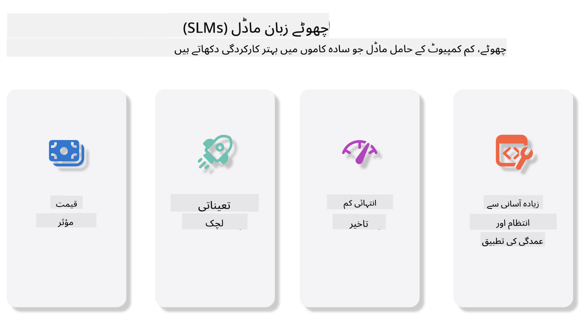
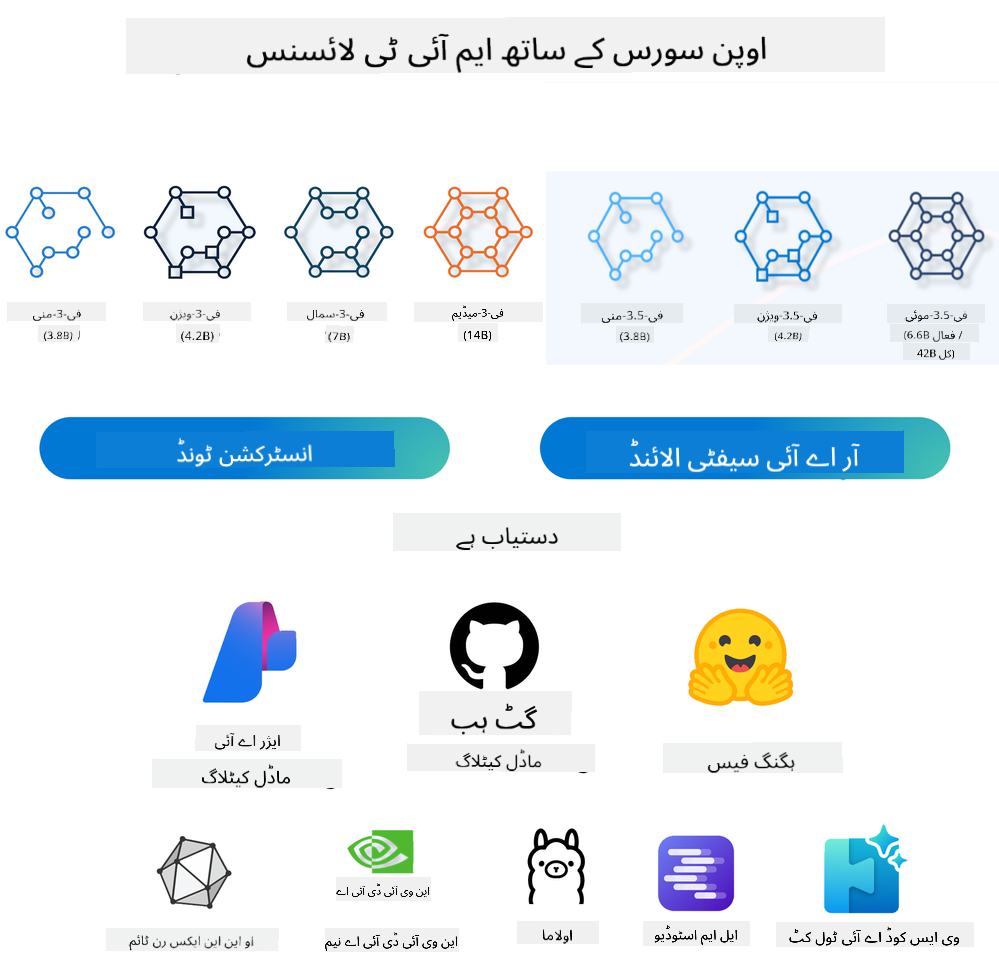
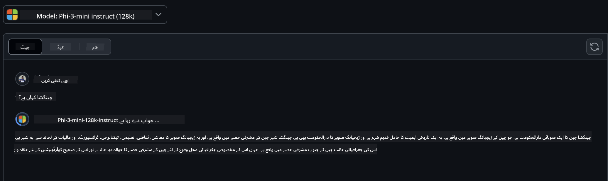

<!--
CO_OP_TRANSLATOR_METADATA:
{
  "original_hash": "124ad36cfe96f74038811b6e2bb93e9d",
  "translation_date": "2025-05-20T09:09:34+00:00",
  "source_file": "19-slm/README.md",
  "language_code": "ur"
}
-->
# جنریٹو AI کے لیے چھوٹے زبان ماڈلز کا تعارف برائے ابتدائی جنریٹو AI مصنوعی ذہانت کا ایک دلچسپ میدان ہے جو نئے مواد پیدا کرنے کی صلاحیت رکھنے والے نظاموں کی تخلیق پر مرکوز ہے۔ یہ مواد متن اور تصاویر سے لے کر موسیقی اور یہاں تک کہ پورے ورچوئل ماحول تک ہو سکتا ہے۔ جنریٹو AI کی سب سے دلچسپ ایپلی کیشنز میں سے ایک زبان ماڈلز کے دائرے میں ہے۔ ## چھوٹے زبان ماڈلز کیا ہیں؟ ایک چھوٹا زبان ماڈل (SLM) بڑے زبان ماڈل (LLM) کا ایک سکڑتا ہوا متغیر ہے، جو LLMs کے بہت سے آرکیٹیکچرل اصولوں اور تکنیکوں کا فائدہ اٹھاتا ہے، جبکہ نمایاں طور پر کم کمپیوٹیشنل فوٹ پرنٹ کی نمائش کرتا ہے۔ SLMs زبان ماڈلز کا ایک ذیلی مجموعہ ہیں جو انسان نما متن پیدا کرنے کے لیے ڈیزائن کیے گئے ہیں۔ اپنے بڑے ہم منصبوں جیسے GPT-4 کے برعکس، SLMs زیادہ کمپیکٹ اور موثر ہیں، جو انہیں ان ایپلی کیشنز کے لیے مثالی بناتے ہیں جہاں کمپیوٹیشنل وسائل محدود ہیں۔ اپنے چھوٹے سائز کے باوجود، وہ اب بھی مختلف کام انجام دے سکتے ہیں۔ عام طور پر، SLMs کو LLMs کو کمپریس یا ڈسٹل کرکے بنایا جاتا ہے، جس کا مقصد اصل ماڈل کی فعالیت اور لسانی صلاحیتوں کا کافی حصہ برقرار رکھنا ہوتا ہے۔ ماڈل کے سائز میں یہ کمی مجموعی پیچیدگی کو کم کرتی ہے، جس سے SLMs میموری کے استعمال اور کمپیوٹیشنل تقاضوں دونوں کے لحاظ سے زیادہ موثر بن جاتے ہیں۔ ان اصلاحات کے باوجود، SLMs اب بھی قدرتی زبان کی پروسیسنگ (NLP) کے کاموں کی ایک وسیع رینج انجام دے سکتے ہیں: - متن کی تخلیق: مربوط اور سیاق و سباق کے لحاظ سے متعلقہ جملے یا پیراگراف بنانا۔ - متن کی تکمیل: دیے گئے پرامپٹ کی بنیاد پر جملے کی پیشن گوئی اور تکمیل۔ - ترجمہ: ایک زبان سے دوسری زبان میں متن کا تبدیل کرنا۔ - خلاصہ: طویل متن کے ٹکڑوں کو چھوٹے، زیادہ قابل ہضم خلاصے میں کم کرنا۔ کچھ تجارتی کارکردگی یا سمجھ کی گہرائی کے ساتھ ان کے بڑے ہم منصبوں کے مقابلے میں۔ ## چھوٹے زبان ماڈلز کیسے کام کرتے ہیں؟ SLMs کو بڑے پیمانے پر متن کے ڈیٹا پر تربیت دی جاتی ہے۔ تربیت کے دوران، وہ زبان کے نمونوں اور ڈھانچوں کو سیکھتے ہیں، جس سے انہیں متن پیدا کرنے کی اجازت ملتی ہے جو گرامر کے لحاظ سے درست اور سیاق و سباق کے لحاظ سے مناسب ہوتا ہے۔ تربیت کے عمل میں شامل ہیں: - ڈیٹا جمع کرنا: مختلف ذرائع سے بڑے ڈیٹا سیٹس کو جمع کرنا۔ - پری پروسیسنگ: ڈیٹا کو صاف کرنا اور منظم کرنا تاکہ اسے تربیت کے لیے موزوں بنایا جا سکے۔ - تربیت: مشین لرننگ الگورتھم کا استعمال کرتے ہوئے ماڈل کو سکھانا کہ متن کو کیسے سمجھنا اور پیدا کرنا ہے۔ - فائن ٹیوننگ: مخصوص کاموں پر اس کی کارکردگی کو بہتر بنانے کے لیے ماڈل کو ایڈجسٹ کرنا۔ SLMs کی ترقی وسائل سے محدود ماحول میں تعینات کیے جانے والے ماڈلز کی بڑھتی ہوئی ضرورت کے ساتھ ہم آہنگ ہے، جیسے موبائل ڈیوائسز یا ایج کمپیوٹنگ پلیٹ فارمز، جہاں مکمل پیمانے پر LLMs ان کے بھاری وسائل کے مطالبات کی وجہ سے غیر عملی ہو سکتے ہیں۔ کارکردگی پر توجہ مرکوز کرکے، SLMs کارکردگی کو قابل رسائی کے ساتھ متوازن کرتے ہیں، مختلف شعبوں میں وسیع تر ایپلی کیشن کو قابل بناتے ہیں۔  ## سیکھنے کے مقاصد اس سبق میں، ہم امید کرتے ہیں کہ SLM کے علم کو متعارف کرائیں اور اسے Microsoft Phi-3 کے ساتھ مختلف منظرناموں میں متن کے مواد، وژن اور MoE کو سیکھنے کے لیے یکجا کریں۔ سبق کے آخر تک، آپ کو درج ذیل سوالات کے جوابات دینے کے قابل ہونا چاہیے: - SLM کیا ہے - SLM اور LLM کے درمیان کیا فرق ہے - Microsoft Phi-3/3.5 فیملی کیا ہے - Microsoft Phi-3/3.5 فیملی کا استنتاج کیسے کریں تیار ہیں؟ آئیے شروع کریں۔ ## بڑے زبان ماڈلز (LLMs) اور چھوٹے زبان ماڈلز (SLMs) کے درمیان امتیازات دونوں LLMs اور SLMs احتمال مشین لرننگ کے بنیادی اصولوں پر بنائے گئے ہیں، ان کی آرکیٹیکچرل ڈیزائن، تربیتی طریقہ کار، ڈیٹا جنریشن کے عمل، اور ماڈل کی تشخیص کی تکنیکوں میں اسی طرح کے طریقوں کی پیروی کرتے ہیں۔ تاہم، ان دو قسم کے ماڈلز کو مختلف کرنے والے کئی اہم عوامل ہیں۔ ## چھوٹے زبان ماڈلز کی ایپلی کیشنز SLMs کی وسیع رینج کی ایپلی کیشنز ہیں، بشمول: - چیٹ بوٹس: صارفین کو کسٹمر سپورٹ فراہم کرنا اور گفتگو کے انداز میں مشغول ہونا۔ - مواد کی تخلیق: خیالات پیدا کرنے یا یہاں تک کہ پورے مضامین کا مسودہ تیار کرنے میں لکھنے والوں کی مدد کرنا۔ - تعلیم: طلباء کو تحریری اسائنمنٹس یا نئی زبانیں سیکھنے میں مدد کرنا۔ - رسائی: معذور افراد کے لیے ٹیکسٹ ٹو اسپیچ سسٹمز جیسے ٹولز بنانا۔ **سائز** LLMs اور SLMs کے درمیان بنیادی فرق ماڈلز کے پیمانے میں ہے۔ LLMs، جیسے ChatGPT (GPT-4)، کا اندازہ لگایا گیا 1.76 ٹریلین پیرامیٹرز پر مشتمل ہو سکتا ہے، جبکہ اوپن سورس SLMs جیسے Mistral 7B کو نمایاں طور پر کم پیرامیٹرز کے ساتھ ڈیزائن کیا گیا ہے—تقریباً 7 بلین۔ یہ فرق بنیادی طور پر ماڈل آرکیٹیکچر اور تربیتی عمل میں فرق کی وجہ سے ہے۔ مثال کے طور پر، ChatGPT ایک انکوڈر-ڈیکوڈر فریم ورک کے اندر ایک سیلف اٹینشن میکانزم کو استعمال کرتا ہے، جبکہ Mistral 7B سلائیڈنگ ونڈو اٹینشن استعمال کرتا ہے، جو ڈیکوڈر-صرف ماڈل کے اندر زیادہ موثر تربیت کو قابل بناتا ہے۔ یہ آرکیٹیکچرل تغیرات ان ماڈلز کی پیچیدگی اور کارکردگی کے لیے گہرے اثرات مرتب کرتے ہیں۔ **سمجھ** SLMs کو عام طور پر مخصوص ڈومینز میں کارکردگی کے لیے بہتر بنایا جاتا ہے، جو انہیں انتہائی ماہر بناتے ہیں لیکن ممکنہ طور پر ان کی صلاحیت کو متعدد شعبوں میں وسیع سیاق و سباق کی تفہیم فراہم کرنے میں محدود کرتے ہیں۔ اس کے برعکس، LLMs کا مقصد زیادہ جامع سطح پر انسان جیسی ذہانت کی نقل کرنا ہے۔ وسیع، متنوع ڈیٹا سیٹس پر تربیت یافتہ، LLMs کو مختلف شعبوں میں اچھی کارکردگی کا مظاہرہ کرنے کے لیے ڈیزائن کیا گیا ہے، زیادہ استعداد اور موافقت پیش کرتے ہیں۔ نتیجے کے طور پر، LLMs مختلف ڈاؤن اسٹریم ٹاسکس کے لیے زیادہ موزوں ہیں، جیسے قدرتی زبان کی پروسیسنگ اور پروگرامنگ۔ **کمپیوٹنگ** LLMs کی تربیت اور تعیناتی وسائل کی حامل عمل ہیں، جن کے لیے اکثر بڑی پیمانے پر GPU کلسٹرز سمیت اہم کمپیوٹیشنل انفراسٹرکچر کی ضرورت ہوتی ہے۔ مثال کے طور پر، ChatGPT جیسے ماڈل کو شروع سے تربیت دینا طویل عرصے تک ہزاروں GPUs کی ضرورت پڑ سکتی ہے۔ اس کے برعکس، SLMs، اپنے چھوٹے پیرامیٹر کاؤنٹس کے ساتھ، کمپیوٹیشنل وسائل کے لحاظ سے زیادہ قابل رسائی ہیں۔ Mistral 7B جیسے ماڈلز کو معتدل GPU صلاحیتوں سے لیس مقامی مشینوں پر تربیت دی جا سکتی ہے اور چلایا جا سکتا ہے، حالانکہ تربیت کے لیے اب بھی کئی GPUs پر کئی گھنٹے درکار ہوتے ہیں۔ **تعصب** LLMs میں تعصب ایک معلوم مسئلہ ہے، بنیادی طور پر تربیتی ڈیٹا کی نوعیت کی وجہ سے۔ یہ ماڈل اکثر انٹرنیٹ سے خام، کھلے عام دستیاب ڈیٹا پر انحصار کرتے ہیں، جو بعض گروپوں کی نمائندگی یا غلط بیانی کر سکتے ہیں، غلط لیبلنگ متعارف کرا سکتے ہیں، یا بولی، جغرافیائی تغیرات، اور گرامر کے اصولوں سے متاثر لسانی تعصبات کی عکاسی کر سکتے ہیں۔ اضافی طور پر، LLM آرکیٹیکچرز کی پیچیدگی غیر ارادی طور پر تعصب کو بڑھا سکتی ہے، جو محتاط فائن ٹیوننگ کے بغیر نظر انداز ہو سکتا ہے۔ دوسری طرف، SLMs، زیادہ محدود، ڈومین سے مخصوص ڈیٹا سیٹس پر تربیت یافتہ ہونے کی وجہ سے، ایسے تعصبات کا شکار ہونے کی صلاحیت کم ہوتی ہے، حالانکہ وہ ان سے محفوظ نہیں ہیں۔ **استنتاج** SLMs کا چھوٹا سائز انہیں استنتاج کی رفتار کے لحاظ سے نمایاں فائدہ دیتا ہے، جس سے وہ مقامی ہارڈویئر پر آؤٹ پٹس کو موثر طریقے سے جنریٹ کر سکتے ہیں بغیر وسیع متوازی پروسیسنگ کی ضرورت کے۔ اس کے برعکس، LLMs، اپنے سائز اور پیچیدگی کی وجہ سے، اکثر قابل قبول استنتاج کے اوقات کو حاصل کرنے کے لیے کافی متوازی کمپیوٹیشنل وسائل کی ضرورت ہوتی ہے۔ متعدد بیک وقت صارفین کی موجودگی LLMs کے ردعمل کے اوقات کو مزید سست کر دیتی ہے، خاص طور پر جب بڑے پیمانے پر تعینات کیا جاتا ہے۔ خلاصہ یہ کہ، جبکہ LLMs اور SLMs مشین لرننگ میں ایک بنیادی بنیاد کا اشتراک کرتے ہیں، وہ ماڈل کے سائز، وسائل کی ضروریات، سیاق و سباق کی تفہیم، تعصب کا شکار ہونے، اور استنتاج کی رفتار کے لحاظ سے نمایاں طور پر مختلف ہیں۔ یہ امتیازات ان کے مختلف استعمال کے معاملات کے لیے موزونیت کی عکاسی کرتے ہیں، LLMs زیادہ استعداد کے حامل لیکن وسائل سے بھرپور ہیں، اور SLMs کم کمپیوٹیشنل مطالبات کے ساتھ زیادہ ڈومین مخصوص کارکردگی پیش کرتے ہیں۔ ***نوٹ: اس باب میں، ہم مثال کے طور پر Microsoft Phi-3 / 3.5 کا استعمال کرتے ہوئے SLM کو متعارف کرائیں گے۔*** ## Phi-3 / Phi-3.5 فیملی کا تعارف Phi-3 / 3.5 فیملی بنیادی طور پر متن، وژن، اور ایجنٹ (MoE) ایپلی کیشن کے منظرناموں کو نشانہ بناتا ہے: ### Phi-3 / 3.5 انسٹرکٹ بنیادی طور پر متن کی تخلیق، چیٹ کی تکمیل، اور مواد کی معلومات کے استخراج وغیرہ کے لیے۔ **Phi-3-mini** 3.8B زبان ماڈل Microsoft Azure AI Studio، Hugging Face، اور Ollama پر دستیاب ہے۔ Phi-3 ماڈلز اہم بینچ مارکس پر مساوی اور بڑے سائز کے زبان ماڈلز کو نمایاں طور پر پیچھے چھوڑ دیتے ہیں (نیچے بینچ مارک نمبرز دیکھیں، زیادہ نمبر بہتر ہیں)۔ Phi-3-mini اپنے سائز کے دوگنے ماڈلز کو پیچھے چھوڑ دیتا ہے، جبکہ Phi-3-small اور Phi-3-medium بڑے ماڈلز، بشمول GPT-3.5 کو پیچھے چھوڑ دیتے ہیں۔ **Phi-3-small & medium** صرف 7B پیرامیٹرز کے ساتھ، Phi-3-small مختلف زبان، استدلال، کوڈنگ، اور ریاضی کے بینچ مارکس پر GPT-3.5T کو شکست دیتا ہے۔ Phi-3-medium 14B پیرامیٹرز کے ساتھ اس رجحان کو جاری رکھتا ہے اور Gemini 1.0 Pro کو پیچھے چھوڑ دیتا ہے۔ **Phi-3.5-mini** ہم اسے Phi-3-mini کے اپ گریڈ کے طور پر سوچ سکتے ہیں۔ جبکہ پیرامیٹرز میں کوئی تبدیلی نہیں کی گئی، یہ متعدد زبانوں کی حمایت کی صلاحیت کو بہتر بناتا ہے (20+ زبانوں کی حمایت: عربی، چینی، چیک، ڈینش، ڈچ، انگریزی، فینش، فرانسیسی، جرمن، عبرانی، ہنگری، اطالوی، جاپانی، کورین، نارویجین، پولش، پرتگالی، روسی، ہسپانوی، سویڈش، تھائی، ترکی، یوکرینی) ​​اور طویل سیاق و سباق کے لیے مضبوط حمایت کا اضافہ کرتا ہے۔ Phi-3.5-mini 3.8B پیرامیٹرز کے ساتھ اپنے سائز کے زبان ماڈلز کو پیچھے چھوڑ دیتا ہے اور اپنے سائز کے دوگنے ماڈلز کے برابر ہے۔ ### Phi-3 / 3.5 وژن ہم Phi-3/3.5 کے انسٹرکٹ ماڈل کو Phi کی سمجھنے کی صلاحیت کے طور پر سوچ سکتے ہیں، اور وژن وہ ہے جو Phi کو دنیا کو سمجھنے کے لیے آنکھیں دیتا ہے۔ **Phi-3-Vision** Phi-3-vision، صرف 4.2B پیرامیٹرز کے ساتھ، اس رجحان کو جاری رکھتا ہے اور عام بصری استدلال کے کاموں، OCR، اور جدول اور خاکہ کی تفہیم کے کاموں پر Claude-3 Haiku اور Gemini 1.0 Pro V جیسے بڑے ماڈلز کو پیچھے چھوڑ دیتا ہے۔ **Phi-3.5-Vision** Phi-3.5-Vision بھی Phi-3-Vision کا اپ گریڈ ہے، متعدد تصاویر کے لیے حمایت کا اضافہ کرتا ہے۔ آپ اسے وژن میں بہتری کے طور پر سوچ سکتے ہیں، نہ صرف تصاویر دیکھ سکتے ہیں، بلکہ ویڈیوز بھی دیکھ سکتے ہیں۔ Phi-3.5-vision OCR، جدول اور چارٹ سمجھنے کے کاموں پر بڑے ماڈلز جیسے Claude-3.5 Sonnet اور Gemini 1.5 Flash کو پیچھے چھوڑ دیتا ہے اور عام بصری علم کے استدلال کے کاموں پر برابر ہے۔ متعدد فریم ان پٹ کی حمایت کریں، یعنی متعدد ان پٹ تصاویر پر استدلال انجام دیں۔ ### Phi-3.5-MoE ***ماہرین کا مرکب (MoE)*** ماڈلز کو بہت کم کمپیوٹ کے ساتھ پری ٹرین کرنے کے قابل بناتا ہے، جس کا مطلب ہے کہ آپ ایک گھنے ماڈل کے طور پر ایک ہی کمپیوٹ بجٹ کے ساتھ ماڈل یا ڈیٹا سیٹ کے سائز کو ڈرامائی طور پر بڑھا سکتے ہیں۔ خاص طور پر، ایک MoE ماڈل کو پری ٹریننگ کے دوران اپنے گھنے ہم منصب کی طرح معیار کو بہت تیزی سے حاصل کرنا چاہیے۔ Phi-3.5-MoE 16x3.8B ماہر ماڈیولز پر مشتمل ہے۔ Phi-3.5-MoE صرف 6.6B فعال پیرامیٹرز کے ساتھ استدلال، زبان کی سمجھ، اور ریاضی میں بڑے ماڈلز کی طرح کی سطح حاصل کرتا ہے۔ ہم مختلف منظرناموں کی بنیاد پر Phi-3/3.5 فیملی ماڈل استعمال کر سکتے ہیں۔ LLM کے برعکس، آپ Phi-3/3.5-mini یا Phi-3/3.5-Vision کو ایج ڈیوائسز پر تعینات کر سکتے ہیں۔ ## Phi-3/3.5 فیملی ماڈلز کو کیسے استعمال کریں ہم مختلف منظرناموں میں Phi-3/3.5 استعمال کرنے کی امید کرتے ہیں۔ اگلا، ہم مختلف منظرناموں کی بنیاد پر Phi-3/3.5 استعمال کریں گے۔  ### استنتاج کا فرق کلاؤڈ کی API **GitHub ماڈلز** GitHub
ماڈلز سب سے براہ راست طریقہ ہیں۔ آپ جلدی سے گیٹ ہب ماڈلز کے ذریعے Phi-3/3.5-Instruct ماڈل تک رسائی حاصل کر سکتے ہیں۔ Azure AI Inference SDK / OpenAI SDK کے ساتھ ملا کر، آپ کوڈ کے ذریعے API تک رسائی حاصل کر سکتے ہیں تاکہ Phi-3/3.5-Instruct کال مکمل کر سکیں۔ آپ Playground کے ذریعے مختلف اثرات کو بھی آزما سکتے ہیں۔ - ڈیمو: چینی منظرناموں میں Phi-3-mini اور Phi-3.5-mini کے اثرات کا موازنہ   **Azure AI Studio** یا اگر ہم وژن اور MoE ماڈلز کا استعمال کرنا چاہتے ہیں، تو آپ Azure AI Studio کا استعمال کر کے کال مکمل کر سکتے ہیں۔ اگر آپ دلچسپی رکھتے ہیں، تو آپ Phi-3 Cookbook پڑھ سکتے ہیں تاکہ یہ سیکھ سکیں کہ Azure AI Studio کے ذریعے Phi-3/3.5 Instruct، Vision، MoE کو کیسے کال کیا جائے [اس لنک پر کلک کریں](https://github.com/microsoft/Phi-3CookBook/blob/main/md/02.QuickStart/AzureAIStudio_QuickStart.md?WT.mc_id=academic-105485-koreyst) **NVIDIA NIM** Azure اور GitHub کی طرف سے فراہم کردہ کلاؤڈ پر مبنی ماڈل کیٹلاگ حل کے علاوہ، آپ متعلقہ کالز مکمل کرنے کے لئے [Nivida NIM](https://developer.nvidia.com/nim?WT.mc_id=academic-105485-koreyst) کا بھی استعمال کر سکتے ہیں۔ آپ NIVIDA NIM پر جا سکتے ہیں تاکہ Phi-3/3.5 فیملی کے API کالز کو مکمل کر سکیں۔ NVIDIA NIM (NVIDIA Inference Microservices) ایک سیٹ ہے جس میں تیز کردہ انفرنس مائیکرو سروسز شامل ہیں جو ڈویلپرز کو AI ماڈلز کو مختلف ماحول میں مؤثر طریقے سے تعینات کرنے میں مدد کرنے کے لئے ڈیزائن کیا گیا ہے، بشمول کلاؤڈز، ڈیٹا سینٹرز، اور ورک سٹیشنز۔ یہاں NVIDIA NIM کی کچھ اہم خصوصیات ہیں: - **تعیناتی کی آسانی:** NIM AI ماڈلز کی تعیناتی کو ایک کمانڈ کے ساتھ اجازت دیتا ہے، جو موجودہ ورک فلو میں انضمام کو سیدھا بناتا ہے۔ - **کارکردگی کی اصلاح:** یہ NVIDIA کے پہلے سے بہتر کردہ انفرنس انجنز جیسے TensorRT اور TensorRT-LLM کا استعمال کرتا ہے تاکہ کم لیٹنسی اور اعلی تھروپٹ کو یقینی بنایا جا سکے۔ - **توسیع پذیری:** NIM Kubernetes پر آٹوسکیلنگ کی حمایت کرتا ہے، جس سے یہ مؤثر طریقے سے مختلف ورک لوڈز کو سنبھال سکتا ہے۔ - **سیکیورٹی اور کنٹرول:** تنظیمیں اپنے ڈیٹا اور ایپلیکیشنز پر کنٹرول برقرار رکھ سکتی ہیں کیونکہ وہ NIM مائیکرو سروسز کو اپنے زیر انتظام انفراسٹرکچر پر خود ہوسٹ کر سکتی ہیں۔ - **معیاری APIs:** NIM صنعت کے معیاری APIs فراہم کرتا ہے، جس سے چیٹ بوٹس، AI اسسٹنٹس، اور دیگر AI ایپلیکیشنز کو بنانا اور انضمام کرنا آسان ہو جاتا ہے۔ NIM NVIDIA AI Enterprise کا حصہ ہے، جس کا مقصد AI ماڈلز کی تعیناتی اور آپریشنلائزیشن کو آسان بنانا ہے، اس بات کو یقینی بناتے ہوئے کہ وہ NVIDIA GPUs پر مؤثر طریقے سے چلیں۔ - ڈیمو: Nividia NIM کا استعمال کرتے ہوئے Phi-3.5-Vision-API کو کال کرنا [[اس لنک پر کلک کریں](../../../19-slm/python/Phi-3-Vision-Nividia-NIM.ipynb)] ### مقامی ماحول میں Phi-3/3.5 کا انفرنس Phi-3 یا کسی بھی زبان کے ماڈل جیسے GPT-3 کے حوالے سے انفرنس اس عمل کو بیان کرتا ہے جس میں دی گئی انپٹ کی بنیاد پر جوابات یا پیشین گوئیاں تیار کی جاتی ہیں۔ جب آپ Phi-3 کو کوئی پرومپٹ یا سوال فراہم کرتے ہیں، تو یہ اپنے تربیت یافتہ نیورل نیٹ ورک کا استعمال کرتا ہے تاکہ سب سے زیادہ ممکنہ اور متعلقہ جواب کو اخذ کیا جا سکے، جس کے لئے وہ تربیت یافتہ ڈیٹا میں موجود نمونوں اور تعلقات کا تجزیہ کرتا ہے۔ **Hugging Face Transformer** Hugging Face Transformers ایک طاقتور لائبریری ہے جو قدرتی زبان کی پروسیسنگ (NLP) اور دیگر مشین لرننگ کے کاموں کے لئے ڈیزائن کی گئی ہے۔ یہاں اس کے بارے میں کچھ اہم نکات ہیں: 1. **پری ٹرینڈ ماڈلز**: یہ ہزاروں پری ٹرینڈ ماڈلز فراہم کرتا ہے جو مختلف کاموں کے لئے استعمال کیے جا سکتے ہیں جیسے کہ متن کی درجہ بندی، نامی ہستی کی شناخت، سوالات کے جوابات، خلاصہ، ترجمہ، اور متن کی تخلیق۔ 2. **فریم ورک انٹرآپریبیلیٹی**: لائبریری متعدد ڈیپ لرننگ فریم ورک کی حمایت کرتی ہے، بشمول PyTorch، TensorFlow، اور JAX۔ یہ آپ کو ایک فریم ورک میں ماڈل کو تربیت دینے اور دوسرے میں استعمال کرنے کی اجازت دیتا ہے۔ 3. **ملٹی موڈل صلاحیتیں**: NLP کے علاوہ، Hugging Face Transformers کمپیوٹر وژن (مثلاً، تصویر کی درجہ بندی، اشیاء کی شناخت) اور آڈیو پروسیسنگ (مثلاً، تقریر کی شناخت، آڈیو کی درجہ بندی) کے کاموں کی بھی حمایت کرتا ہے۔ 4. **استعمال میں آسانی**: لائبریری APIs اور ٹولز فراہم کرتی ہے تاکہ ماڈلز کو آسانی سے ڈاؤن لوڈ اور بہتر بنایا جا سکے، جس سے یہ ابتدائیوں اور ماہرین دونوں کے لئے قابل رسائی ہوتا ہے۔ 5. **کمیونٹی اور وسائل**: Hugging Face کے پاس ایک متحرک کمیونٹی اور وسیع دستاویزات، سبق آموز مواد، اور گائیڈز ہیں جو صارفین کو شروع کرنے اور لائبریری سے زیادہ سے زیادہ فائدہ اٹھانے میں مدد کرتے ہیں۔ [سرکاری دستاویزات](https://huggingface.co/docs/transformers/index?WT.mc_id=academic-105485-koreyst) یا ان کا [GitHub مخزن](https://github.com/huggingface/transformers?WT.mc_id=academic-105485-koreyst)۔ یہ سب سے زیادہ استعمال شدہ طریقہ ہے، لیکن یہ بھی GPU ایکسیلریشن کی ضرورت ہے۔ آخر کار، جیسے کہ وژن اور MoE کے منظرنامے بہت زیادہ حساب کتاب کی ضرورت ہوتی ہے، جو CPU میں بہت محدود ہوں گے اگر وہ کوانٹائز نہیں کیے گئے ہوں۔ - ڈیمو: Transformer کا استعمال کرتے ہوئے Phi-3.5-Instuct کو کال کرنا [اس لنک پر کلک کریں](../../../19-slm/python/phi35-instruct-demo.ipynb) - ڈیمو: Transformer کا استعمال کرتے ہوئے Phi-3.5-Vision کو کال کرنا[اس لنک پر کلک کریں](../../../19-slm/python/phi35-vision-demo.ipynb) - ڈیمو: Transformer کا استعمال کرتے ہوئے Phi-3.5-MoE کو کال کرنا[اس لنک پر کلک کریں](../../../19-slm/python/phi35_moe_demo.ipynb) **Ollama** [Ollama](https://ollama.com/?WT.mc_id=academic-105485-koreyst) ایک پلیٹ فارم ہے جو بڑے زبان کے ماڈلز (LLMs) کو آپ کی مشین پر مقامی طور پر چلانے کو آسان بناتا ہے۔ یہ مختلف ماڈلز کی حمایت کرتا ہے جیسے Llama 3.1، Phi 3، Mistral، اور Gemma 2، دیگر کے علاوہ۔ پلیٹ فارم ماڈل کے وزن، کنفیگریشن، اور ڈیٹا کو ایک پیکیج میں باندھ کر عمل کو آسان بناتا ہے، جس سے صارفین کے لئے اپنے ماڈلز کو حسب ضرورت بنانے اور تخلیق کرنے کے لئے زیادہ قابل رسائی ہوتا ہے۔ Ollama macOS، Linux، اور Windows کے لئے دستیاب ہے۔ یہ ایک بہترین ٹول ہے اگر آپ LLMs کے ساتھ تجربہ کرنا یا کلاؤڈ سروسز پر انحصار کیے بغیر انہیں تعینات کرنا چاہتے ہیں۔ Ollama سب سے براہ راست طریقہ ہے، آپ کو صرف مندرجہ ذیل بیان کو نافذ کرنے کی ضرورت ہے۔ ```bash

ollama run phi3.5

``` **ONNX Runtime for GenAI** [ONNX Runtime](https://github.com/microsoft/onnxruntime-genai?WT.mc_id=academic-105485-koreyst) ایک کراس پلیٹ فارم انفرنس اور تربیتی مشین لرننگ ایکسیلیریٹر ہے۔ ONNX Runtime for Generative AI (GENAI) ایک طاقتور ٹول ہے جو آپ کو مختلف پلیٹ فارمز پر جنریٹو AI ماڈلز کو مؤثر طریقے سے چلانے میں مدد کرتا ہے۔ ## ONNX Runtime کیا ہے؟ ONNX Runtime ایک اوپن سورس پروجیکٹ ہے جو مشین لرننگ ماڈلز کی اعلی کارکردگی انفرنس کو فعال کرتا ہے۔ یہ اوپن نیورل نیٹ ورک ایکسچینج (ONNX) فارمیٹ میں ماڈلز کی حمایت کرتا ہے، جو مشین لرننگ ماڈلز کی نمائندگی کے لئے ایک معیاری ہے۔ONNX Runtime انفرنس تیز تر کسٹمر تجربات اور کم لاگت کو فعال کر سکتا ہے، جو PyTorch اور TensorFlow/Keras جیسے ڈیپ لرننگ فریم ورک کے ماڈلز کے ساتھ ساتھ کلاسیکی مشین لرننگ لائبریریوں جیسے scikit-learn، LightGBM، XGBoost، وغیرہ کی حمایت کرتا ہے۔ ONNX Runtime مختلف ہارڈویئر، ڈرائیورز، اور آپریٹنگ سسٹمز کے ساتھ مطابقت رکھتا ہے، اور گراف کی اصلاحات اور ٹرانسفارمز کے ساتھ ہارڈویئر ایکسیلیریٹرز کو جہاں قابل اطلاق ہو، استعمال کر کے بہترین کارکردگی فراہم کرتا ہے ## جنریٹو AI کیا ہے؟ جنریٹو AI ان AI سسٹمز کو بیان کرتا ہے جو نئے مواد، جیسے کہ متن، تصاویر، یا موسیقی کو تخلیق کر سکتے ہیں، جس پر انہوں نے تربیت حاصل کی ہو۔ مثالوں میں زبان کے ماڈلز جیسے GPT-3 اور تصویر تخلیق ماڈلز جیسے Stable Diffusion شامل ہیں۔ ONNX Runtime for GenAI لائبریری ONNX ماڈلز کے لئے جنریٹو AI لوپ فراہم کرتی ہے، جس میں ONNX Runtime کے ساتھ انفرنس، لاجٹس پروسیسنگ، تلاش اور نمونہ سازی، اور KV کیش مینجمنٹ شامل ہیں۔ ## ONNX Runtime for GENAI ONNX Runtime for GENAI ONNX Runtime کی صلاحیتوں کو جنریٹو AI ماڈلز کی حمایت کرنے کے لئے بڑھاتا ہے۔ یہاں کچھ اہم خصوصیات ہیں: - **وسیع پلیٹ فارم کی حمایت:** یہ مختلف پلیٹ فارمز پر کام کرتا ہے، بشمول Windows، Linux، macOS، Android، اور iOS۔ - **ماڈل کی حمایت:** یہ بہت سے مقبول جنریٹو AI ماڈلز کی حمایت کرتا ہے، جیسے LLaMA، GPT-Neo، BLOOM، اور مزید۔ - **کارکردگی کی اصلاح:** یہ مختلف ہارڈویئر ایکسیلیریٹرز جیسے NVIDIA GPUs، AMD GPUs، اور مزید کے لئے اصلاحات شامل کرتا ہے2۔ - **استعمال میں آسانی:** یہ ایپلیکیشنز میں آسان انضمام کے لئے APIs فراہم کرتا ہے، جس سے آپ کو کم سے کم کوڈ کے ساتھ متن، تصاویر، اور دیگر مواد کو تخلیق کرنے کی اجازت ملتی ہے - صارفین اعلی سطح کی generate() میتھڈ کو کال کر سکتے ہیں، یا ماڈل کے ہر تکرار کو ایک لوپ میں چلا سکتے ہیں، ایک وقت میں ایک ٹوکن تخلیق کر سکتے ہیں، اور اختیاری طور پر لوپ کے اندر تخلیقی پیرامیٹرز کو اپ ڈیٹ کر سکتے ہیں۔ - ONNX runtime بھی ٹوکن سیکوینسز کو تخلیق کرنے کے لئے لالچی/بیم تلاش اور TopP، TopK نمونہ سازی کی حمایت کرتا ہے اور لاجٹس پروسیسنگ میں تعمیر شدہ دہرانے کی سزائیں جیسے خصوصیات کو شامل کرتا ہے۔ آپ آسانی سے کسٹم سکورنگ بھی شامل کر سکتے ہیں۔ ## شروع کرنا ONNX Runtime for GENAI کے ساتھ شروع کرنے کے لئے، آپ ان مراحل کی پیروی کر سکتے ہیں: ### ONNX Runtime انسٹال کریں: ```Python
pip install onnxruntime
``` ### جنریٹو AI ایکسٹینشنز انسٹال کریں: ```Python
pip install onnxruntime-genai
``` ### ماڈل چلائیں: یہاں Python میں ایک سادہ مثال ہے: ```Python
import onnxruntime_genai as og

model = og.Model('path_to_your_model.onnx')

tokenizer = og.Tokenizer(model)

input_text = "Hello, how are you?"

input_tokens = tokenizer.encode(input_text)

output_tokens = model.generate(input_tokens)

output_text = tokenizer.decode(output_tokens)

print(output_text) 
``` ### ڈیمو:ONNX Runtime GenAI کا استعمال کرتے ہوئے Phi-3.5-Vision کو کال کرنا ```python

import onnxruntime_genai as og

model_path = './Your Phi-3.5-vision-instruct ONNX Path'

img_path = './Your Image Path'

model = og.Model(model_path)

processor = model.create_multimodal_processor()

tokenizer_stream = processor.create_stream()

text = "Your Prompt"

prompt = "<|user|>\n"

prompt += "<|image_1|>\n"

prompt += f"{text}<|end|>\n"

prompt += "<|assistant|>\n"

image = og.Images.open(img_path)

inputs = processor(prompt, images=image)

params = og.GeneratorParams(model)

params.set_inputs(inputs)

params.set_search_options(max_length=3072)

generator = og.Generator(model, params)

while not generator.is_done():

    generator.compute_logits()
    
    generator.generate_next_token()

    new_token = generator.get_next_tokens()[0]
    
    code += tokenizer_stream.decode(new_token)
    
    print(tokenizer_stream.decode(new_token), end='', flush=True)

``` **دیگر** ONNX Runtime اور Ollama حوالہ طریقوں کے علاوہ، ہم مختلف مینوفیکچررز کی طرف سے فراہم کردہ ماڈل حوالہ طریقوں کی بنیاد پر مقداری ماڈلز کے حوالہ کو بھی مکمل کر سکتے ہیں۔ جیسے کہ Apple MLX فریم ورک کے ساتھ Apple Metal، Qualcomm QNN کے ساتھ NPU، Intel OpenVINO کے ساتھ CPU/GPU، وغیرہ۔ آپ [Phi-3 Cookbook](https://github.com/microsoft/phi-3cookbook?WT.mc_id=academic-105485-koreyst) سے مزید مواد بھی حاصل کر سکتے ہیں ## مزید ہم نے Phi-3/3.5 فیملی کی بنیادی باتیں سیکھ لی ہیں، لیکن SLM کے بارے میں مزید جاننے کے لئے ہمیں مزید علم کی ضرورت ہے۔ آپ Phi-3 Cookbook میں جوابات تلاش کر سکتے ہیں۔ اگر آپ مزید سیکھنا چاہتے ہیں، تو براہ کرم [Phi-3 Cookbook](https://github.com/microsoft/phi-3cookbook?WT.mc_id=academic-105485-koreyst) پر جائیں۔

**ڈس کلیمر**:  
یہ دستاویز AI ترجمہ سروس [Co-op Translator](https://github.com/Azure/co-op-translator) کا استعمال کرتے ہوئے ترجمہ کی گئی ہے۔ ہم درستگی کے لیے کوشش کرتے ہیں، لیکن براہ کرم آگاہ رہیں کہ خودکار ترجمے میں غلطیاں یا عدم درستگی ہو سکتی ہیں۔ اصل دستاویز کو اس کی مقامی زبان میں مستند ذریعہ سمجھا جانا چاہیے۔ اہم معلومات کے لیے، پیشہ ورانہ انسانی ترجمہ کی سفارش کی جاتی ہے۔ اس ترجمے کے استعمال سے پیدا ہونے والی کسی بھی غلط فہمی یا غلط تشریح کے لیے ہم ذمہ دار نہیں ہیں۔