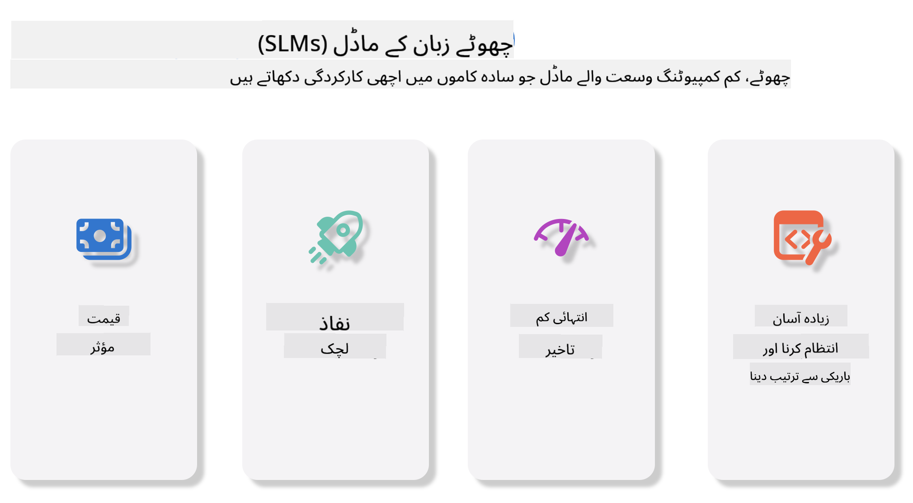
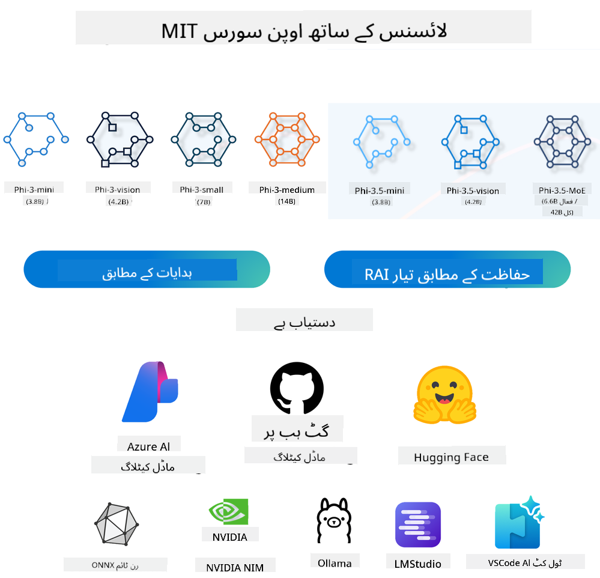
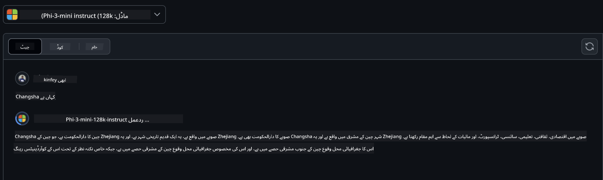
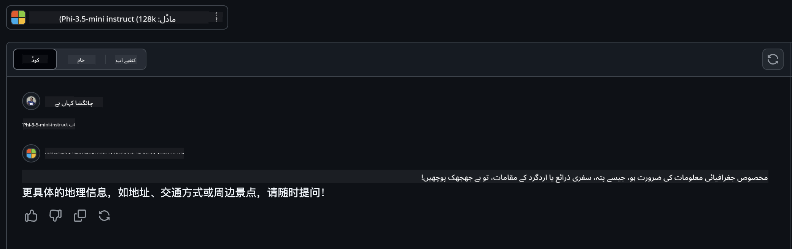

<!--
CO_OP_TRANSLATOR_METADATA:
{
  "original_hash": "124ad36cfe96f74038811b6e2bb93e9d",
  "translation_date": "2025-06-26T01:38:55+00:00",
  "source_file": "19-slm/README.md",
  "language_code": "ur"
}
-->
# مبتدیوں کے لئے جنریٹو اے آئی کے لئے چھوٹے زبان کے ماڈلز کا تعارف

جنریٹو اے آئی مصنوعی ذہانت کا ایک دلچسپ میدان ہے جو نئے مواد پیدا کرنے کے قابل نظاموں کی تخلیق پر مرکوز ہے۔ یہ مواد متن اور تصاویر سے لے کر موسیقی اور یہاں تک کہ مکمل ورچوئل ماحول تک ہو سکتا ہے۔ جنریٹو اے آئی کی سب سے دلچسپ ایپلی کیشنز میں سے ایک زبان کے ماڈلز کے دائرے میں ہے۔

## چھوٹے زبان کے ماڈلز کیا ہیں؟

ایک چھوٹا زبان ماڈل (SLM) بڑے زبان کے ماڈل (LLM) کا ایک سکڑا ہوا متغیر ہے، جو LLMs کے بہت سے معماری اصولوں اور تکنیکوں کا فائدہ اٹھاتا ہے، جبکہ نمایاں طور پر کم کمپیوٹیشنل فٹ پرنٹ کا مظاہرہ کرتا ہے۔ SLMs زبان کے ماڈلز کا ایک ذیلی سیٹ ہیں جو انسان نما متن پیدا کرنے کے لئے ڈیزائن کیے گئے ہیں۔ اپنے بڑے ہم منصبوں کے برعکس، جیسے کہ GPT-4، SLMs زیادہ کمپیکٹ اور موثر ہیں، جو انہیں ان ایپلی کیشنز کے لئے مثالی بناتے ہیں جہاں کمپیوٹیشنل وسائل محدود ہیں۔ ان کے چھوٹے سائز کے باوجود، وہ اب بھی مختلف کام انجام دے سکتے ہیں۔ عام طور پر، SLMs LLMs کو کمپریس یا ڈسٹل کرکے بنائے جاتے ہیں، جس کا مقصد اصل ماڈل کی فعالیت اور لسانی صلاحیتوں کا کافی حصہ برقرار رکھنا ہوتا ہے۔ ماڈل کے سائز میں یہ کمی مجموعی پیچیدگی کو کم کرتی ہے، جس سے SLMs کو میموری کے استعمال اور کمپیوٹیشنل ضروریات دونوں کے لحاظ سے زیادہ موثر بنایا جاتا ہے۔ ان اصلاحات کے باوجود، SLMs اب بھی قدرتی زبان کی پروسیسنگ (NLP) کے مختلف کام انجام دے سکتے ہیں:

- متن کی تخلیق: مربوط اور متنی لحاظ سے متعلقہ جملے یا پیراگراف بنانا۔
- متن کی تکمیل: دی گئی اشارے کی بنیاد پر جملے کی پیش گوئی اور تکمیل۔
- ترجمہ: متن کو ایک زبان سے دوسری زبان میں تبدیل کرنا۔
- خلاصہ: طویل متن کے ٹکڑوں کو مختصر، زیادہ قابل ہضم خلاصوں میں سمیٹنا۔

اگرچہ ان کی کارکردگی یا فہم کی گہرائی میں کچھ سمجھوتے کے ساتھ ان کے بڑے ہم منصبوں کے مقابلے میں۔

## چھوٹے زبان کے ماڈلز کیسے کام کرتے ہیں؟

SLMs کو بہت زیادہ مقدار میں متن کے ڈیٹا پر تربیت دی جاتی ہے۔ تربیت کے دوران، وہ زبان کے نمونوں اور ڈھانچے کو سیکھتے ہیں، جس سے وہ متن پیدا کرنے کے قابل ہوتے ہیں جو کہ گرامیٹکلی درست اور متنی لحاظ سے موزوں ہوتا ہے۔ تربیت کا عمل شامل ہوتا ہے:

- ڈیٹا کا جمع کرنا: مختلف ذرائع سے متن کے بڑے ڈیٹاسیٹ جمع کرنا۔
- پیش کاری: ڈیٹا کو صاف کرنا اور ترتیب دینا تاکہ یہ تربیت کے لئے موزوں ہو جائے۔
- تربیت: مشین لرننگ الگورتھم کا استعمال کرتے ہوئے ماڈل کو متن کو سمجھنے اور پیدا کرنے کا طریقہ سکھانا۔
- فائن ٹیوننگ: مخصوص کاموں پر ماڈل کی کارکردگی کو بہتر بنانے کے لئے اس کی ایڈجسٹمنٹ کرنا۔

SLMs کی ترقی ان ماڈلز کی بڑھتی ہوئی ضرورت کے ساتھ ہم آہنگ ہے جو وسائل کی پابندی والے ماحول میں تعینات کیے جا سکتے ہیں، جیسے کہ موبائل ڈیوائسز یا ایج کمپیوٹنگ پلیٹ فارمز، جہاں مکمل پیمانے پر LLMs ان کے بھاری وسائل کے مطالبات کی وجہ سے غیر عملی ہو سکتے ہیں۔ کارکردگی پر توجہ مرکوز کرکے، SLMs کارکردگی کو قابل رسائی کے ساتھ متوازن کرتے ہیں، مختلف شعبوں میں وسیع تر ایپلی کیشن کو قابل بناتے ہیں۔



## سیکھنے کے مقاصد

اس سبق میں، ہم امید کرتے ہیں کہ SLM کا علم متعارف کرائیں اور اسے مائیکروسافٹ Phi-3 کے ساتھ ملا کر متن کے مواد، وژن اور MoE میں مختلف منظرنامے سیکھیں۔ سبق کے اختتام تک، آپ کو درج ذیل سوالات کا جواب دینے کے قابل ہونا چاہئے:

- SLM کیا ہے
- SLM اور LLM میں کیا فرق ہے
- مائیکروسافٹ Phi-3/3.5 فیملی کیا ہے
- مائیکروسافٹ Phi-3/3.5 فیملی کا نتیجہ کیسے نکالا جائے

تیار ہیں؟ آئیے شروع کرتے ہیں۔

## بڑے زبان کے ماڈلز (LLMs) اور چھوٹے زبان کے ماڈلز (SLMs) کے درمیان امتیازات

دونوں LLMs اور SLMs پروبیبلسٹک مشین لرننگ کے بنیادی اصولوں پر بنائے گئے ہیں، ان کے معماری ڈیزائن، تربیتی طریقہ کار، ڈیٹا جنریشن کے عمل، اور ماڈل کے جائزہ لینے کی تکنیکوں میں ملتے جلتے طریقے اختیار کرتے ہیں۔ تاہم، کئی کلیدی عوامل ان دو قسم کے ماڈلز کو مختلف کرتے ہیں۔

## چھوٹے زبان کے ماڈلز کی ایپلی کیشنز

SLMs کی ایپلی کیشنز کی ایک وسیع رینج ہے، بشمول:

- چیٹ بوٹس: صارفین کے ساتھ گفتگو کے انداز میں بات چیت اور کسٹمر سپورٹ فراہم کرنا۔
- مواد کی تخلیق: مصنفین کی مدد کرنا خیالات پیدا کرکے یا یہاں تک کہ مکمل مضامین کا مسودہ تیار کرنا۔
- تعلیم: طلباء کی تحریری اسائنمنٹس میں مدد کرنا یا نئی زبانیں سیکھنا۔
- رسائی: معذور افراد کے لئے اوزار بنانا، جیسے کہ ٹیکسٹ ٹو اسپیچ سسٹمز۔

**سائز**

LLMs اور SLMs کے درمیان ایک بنیادی فرق ماڈلز کے پیمانے میں ہے۔ LLMs، جیسے کہ ChatGPT (GPT-4)، کا تخمینہ 1.76 ٹریلین پیرامیٹرز پر مشتمل ہوسکتا ہے، جبکہ اوپن سورس SLMs جیسے کہ Mistral 7B نمایاں طور پر کم پیرامیٹرز کے ساتھ ڈیزائن کیے گئے ہیں—تقریباً 7 بلین۔ یہ تفاوت بنیادی طور پر ماڈل کی معماری اور تربیتی عمل میں فرق کی وجہ سے ہے۔ مثال کے طور پر، ChatGPT ایک اینکوڈر-ڈیکوڈر فریم ورک کے اندر ایک سیلف اٹینشن میکانزم کو استعمال کرتا ہے، جبکہ Mistral 7B ایک سلائیڈنگ ونڈو اٹینشن کا استعمال کرتا ہے، جو ڈیکوڈر-صرف ماڈل کے اندر زیادہ موثر تربیت کو قابل بناتا ہے۔ اس معماری تغیر کا ان ماڈلز کی پیچیدگی اور کارکردگی کے لئے گہرے مضمرات ہیں۔

**فہم**

SLMs عام طور پر مخصوص ڈومینز کے اندر کارکردگی کے لئے بہتر بنائے جاتے ہیں، جو انہیں انتہائی ماہر بناتے ہیں لیکن ممکنہ طور پر متعدد علم کے شعبوں میں وسیع تر سیاق و سباق کی سمجھ فراہم کرنے کی ان کی صلاحیت کو محدود کرتے ہیں۔ اس کے برعکس، LLMs زیادہ جامع سطح پر انسان جیسی ذہانت کی نقل کرنے کا مقصد رکھتے ہیں۔ وسیع، متنوع ڈیٹاسیٹس پر تربیت یافتہ، LLMs مختلف ڈومینز میں اچھی کارکردگی کا مظاہرہ کرنے کے لئے ڈیزائن کیے گئے ہیں، جو زیادہ استعداد اور موافقت پیش کرتے ہیں۔ نتیجتاً، LLMs نیچرل لینگویج پروسیسنگ اور پروگرامنگ جیسے وسیع تر ڈاؤن اسٹریم کاموں کے لئے زیادہ موزوں ہیں۔

**کمپیوٹنگ**

LLMs کی تربیت اور تعیناتی وسائل کی شدت کے حامل عمل ہیں، جن کے لئے اکثر بڑے پیمانے پر کمپیوٹیشنل انفراسٹرکچر کی ضرورت ہوتی ہے، بشمول بڑے پیمانے پر GPU کلسٹرز۔ مثال کے طور پر، ChatGPT جیسے ماڈل کو شروع سے تربیت دینے کے لئے ہزاروں GPUs کی ضرورت ہو سکتی ہے جو طویل عرصے تک چلتے ہیں۔ اس کے برعکس، SLMs، اپنے چھوٹے پیرامیٹر کاؤنٹس کے ساتھ، کمپیوٹیشنل وسائل کے لحاظ سے زیادہ قابل رسائی ہیں۔ Mistral 7B جیسے ماڈلز کو اعتدال پسند GPU صلاحیتوں سے لیس مقامی مشینوں پر تربیت دی جا سکتی ہے اور چلایا جا سکتا ہے، حالانکہ تربیت کے لئے پھر بھی متعدد GPUs پر کئی گھنٹے درکار ہوتے ہیں۔

**تعصب**

تعصب LLMs میں ایک معروف مسئلہ ہے، بنیادی طور پر تربیتی ڈیٹا کی نوعیت کی وجہ سے۔ یہ ماڈل اکثر انٹرنیٹ سے دستیاب کھلے خام ڈیٹا پر انحصار کرتے ہیں، جو کچھ گروپوں کی کم نمائندگی یا غلط نمائندگی کر سکتے ہیں، غلط لیبلنگ متعارف کروا سکتے ہیں، یا بولی، جغرافیائی تغیرات، اور گرامر کے قواعد سے متاثر لسانی تعصبات کی عکاسی کر سکتے ہیں۔ اس کے علاوہ، LLM کی معماری کی پیچیدگی غیر ارادی طور پر تعصب کو بڑھا سکتی ہے، جو محتاط فائن ٹیوننگ کے بغیر نظر انداز ہو سکتا ہے۔ دوسری طرف، SLMs، زیادہ محدود، ڈومین مخصوص ڈیٹاسیٹس پر تربیت یافتہ ہونے کی وجہ سے، فطری طور پر ایسے تعصبات کا شکار ہونے کا امکان کم رکھتے ہیں، حالانکہ وہ ان سے محفوظ نہیں ہیں۔

**نتیجہ اخذ کرنا**

SLMs کا کم سائز انہیں نتیجہ اخذ کرنے کی رفتار کے لحاظ سے ایک اہم فائدہ دیتا ہے، جس سے انہیں مقامی ہارڈویئر پر وسیع متوازی پروسیسنگ کی ضرورت کے بغیر مؤثر طریقے سے آؤٹ پٹ تیار کرنے کی اجازت ملتی ہے۔ اس کے برعکس، LLMs، اپنے سائز اور پیچیدگی کی وجہ سے، اکثر قابل قبول نتیجہ اخذ کرنے کے اوقات کو حاصل کرنے کے لئے خاطر خواہ متوازی کمپیوٹیشنل وسائل کی ضرورت ہوتی ہے۔ متعدد بیک وقت صارفین کی موجودگی مزید LLMs کے ردعمل کے اوقات کو سست کر دیتی ہے، خاص طور پر جب بڑے پیمانے پر تعینات کیا جاتا ہے۔

خلاصہ یہ کہ، اگرچہ LLMs اور SLMs دونوں مشین لرننگ میں ایک بنیادی بنیاد کا اشتراک کرتے ہیں، لیکن وہ ماڈل کے سائز، وسائل کی ضروریات، سیاق و سباق کی سمجھ، تعصب کا شکار ہونے، اور نتیجہ اخذ کرنے کی رفتار کے لحاظ سے نمایاں طور پر مختلف ہیں۔ یہ امتیازات ان کے مختلف استعمال کے معاملات کے لئے ان کی متعلقہ موزونیت کی عکاسی کرتے ہیں، LLMs زیادہ استعداد کے حامل لیکن وسائل سے بھرپور، اور SLMs زیادہ ڈومین مخصوص کارکردگی کی پیشکش کرتے ہیں جن کے ساتھ کم کمپیوٹیشنل مطالبات ہوتے ہیں۔

***نوٹ: اس باب میں، ہم مائیکروسافٹ Phi-3 / 3.5 کو ایک مثال کے طور پر استعمال کرتے ہوئے SLM کا تعارف کرائیں گے۔***

## Phi-3 / Phi-3.5 فیملی کا تعارف

Phi-3 / 3.5 فیملی بنیادی طور پر متن، وژن، اور ایجنٹ (MoE) ایپلی کیشن منظرناموں کو نشانہ بناتا ہے:

### Phi-3 / 3.5 انسٹرکٹ

بنیادی طور پر متن کی تخلیق، چیٹ کی تکمیل، اور مواد کی معلومات کے اخراج وغیرہ کے لئے۔

**Phi-3-mini**

3.8B زبان کا ماڈل مائیکروسافٹ ایزور اے آئی اسٹوڈیو، ہگنگ فیس، اور اولاما پر دستیاب ہے۔ Phi-3 ماڈل اہم معیارات پر برابر اور بڑے سائز کے زبان کے ماڈلز کو نمایاں طور پر پیچھے چھوڑ دیتے ہیں (نیچے معیار کے نمبر دیکھیں، زیادہ نمبر بہتر ہیں)۔ Phi-3-mini اپنے سائز سے دوگنے ماڈلز کو پیچھے چھوڑ دیتا ہے، جبکہ Phi-3-small اور Phi-3-medium بڑے ماڈلز کو پیچھے چھوڑ دیتے ہیں، بشمول GPT-3.5۔

**Phi-3-small & medium**

صرف 7B پیرامیٹرز کے ساتھ، Phi-3-small مختلف زبان، استدلال، کوڈنگ، اور ریاضی کے معیارات پر GPT-3.5T کو پیچھے چھوڑ دیتا ہے۔ 14B پیرامیٹرز کے ساتھ Phi-3-medium اس رجحان کو جاری رکھتا ہے اور Gemini 1.0 Pro کو پیچھے چھوڑ دیتا ہے۔

**Phi-3.5-mini**

ہم اسے Phi-3-mini کی اپ گریڈ کے طور پر سوچ سکتے ہیں۔ جبکہ پیرامیٹرز میں کوئی تبدیلی نہیں ہوتی، یہ متعدد زبانوں کی حمایت کرنے کی صلاحیت کو بہتر بناتا ہے (20+ زبانوں کی حمایت: عربی، چینی، چیک، ڈینش، ڈچ، انگریزی، فننش، فرانسیسی، جرمن، عبرانی، ہنگیرین، اطالوی، جاپانی، کورین، نارویجین، پولش، پرتگالی، روسی، ہسپانوی، سویڈش، تھائی، ترکی، یوکرینی) ​​اور طویل سیاق و سباق کے لئے مضبوط حمایت شامل کرتا ہے۔ 3.8B پیرامیٹرز کے ساتھ Phi-3.5-mini اسی سائز کے زبان کے ماڈلز کو پیچھے چھوڑ دیتا ہے اور اپنے سائز سے دوگنے ماڈلز کے برابر ہے۔

### Phi-3 / 3.5 وژن

ہم Phi-3/3.5 کے انسٹرکٹ ماڈل کو Phi کی سمجھنے کی صلاحیت کے طور پر سوچ سکتے ہیں، اور وژن وہ ہے جو Phi کو دنیا کو سمجھنے کے لئے آنکھیں دیتا ہے۔

**Phi-3-Vision**

Phi-3-vision، صرف 4.2B پیرامیٹرز کے ساتھ، اس رجحان کو جاری رکھتا ہے اور عام بصری استدلال کے کاموں، OCR، اور ٹیبل اور ڈایاگرام کی تفہیم کے کاموں پر بڑے ماڈلز جیسے Claude-3 Haiku اور Gemini 1.0 Pro V کو پیچھے چھوڑ دیتا ہے۔

**Phi-3.5-Vision**

Phi-3.5-Vision بھی Phi-3-Vision کی ایک اپ گریڈ ہے، جو متعدد تصاویر کی حمایت شامل کرتا ہے۔ آپ اسے وژن میں بہتری کے طور پر سوچ سکتے ہیں، نہ صرف تصاویر دیکھ سکتے ہیں، بلکہ ویڈیوز بھی دیکھ سکتے ہیں۔ Phi-3.5-vision OCR، ٹیبل اور چارٹ کی تفہیم کے کاموں میں بڑے ماڈلز جیسے Claude-3.5 Sonnet اور Gemini 1.5 Flash کو پیچھے چھوڑ دیتا ہے اور عام بصری علم کے استدلال کے کاموں میں برابر ہے۔ متعدد فریم ان پٹ کی حمایت کریں، یعنی متعدد ان پٹ تصاویر پر استدلال انجام دیں۔

### Phi-3.5-MoE

***ماہرین کا مرکب (MoE)*** ماڈلز کو بہت کم کمپیوٹ کے ساتھ پری ٹرین کرنے کے قابل بناتا ہے، جس کا مطلب ہے کہ آپ ایک گھنے ماڈل کے طور پر اسی کمپیوٹ بجٹ کے ساتھ ماڈل یا ڈیٹاسیٹ کے سائز کو ڈرامائی طور پر بڑھا سکتے ہیں۔ خاص طور پر، ایک MoE ماڈل کو پری ٹریننگ کے دوران اپنے گھنے ہم منصب کے برابر معیار کو بہت تیزی سے حاصل کرنا چاہئے۔ Phi-3.5-MoE میں 16x3.8B ماہر ماڈیولز شامل ہیں۔ Phi-3.5-MoE صرف 6.6B فعال پیرامیٹرز کے ساتھ بہت بڑے ماڈلز کی طرح استدلال، زبان کی سمجھ، اور ریاضی کی سطح کو حاصل کرتا ہے۔

ہم مختلف منظرناموں کی بنیاد پر Phi-3/3.5 فیملی ماڈل استعمال کر سکتے ہیں۔ LLM کے برعکس، آپ Phi-3/3.5-mini یا Phi-3/3.5-Vision کو ایج ڈیوائسز پر تعینات کر سکتے ہیں۔

## Phi-3/3.5 فیملی ماڈلز کا استعمال کیسے کریں

ہم امید کرتے ہیں کہ مختلف منظرناموں میں Phi-3/3.5 کا استعمال کریں۔ اگلا، ہم مختلف منظرناموں کی بنیاد پر Phi-3/3.5 کا استعمال کریں گے۔



### نتیجہ اخذ کرنے کا فرق

کلاؤڈ کی API **گٹ ہب ماڈلز** گٹ ہب
ماڈلز سب سے براہ راست طریقہ ہیں۔ آپ گیٹ ہب ماڈلز کے ذریعے جلدی سے Phi-3/3.5-Instruct ماڈل تک رسائی حاصل کر سکتے ہیں۔ Azure AI Inference SDK / OpenAI SDK کے ساتھ ملا کر، آپ کوڈ کے ذریعے API تک رسائی حاصل کر سکتے ہیں تاکہ Phi-3/3.5-Instruct کال کو مکمل کر سکیں۔ آپ پلے گراؤنڈ کے ذریعے مختلف اثرات کی جانچ بھی کر سکتے ہیں۔ - ڈیمو: چینی منظرناموں میں Phi-3-mini اور Phi-3.5-mini کے اثرات کا موازنہ   **Azure AI Studio** یا اگر ہم وژن اور MoE ماڈلز استعمال کرنا چاہتے ہیں، تو آپ Azure AI Studio کا استعمال کر کے کال کو مکمل کر سکتے ہیں۔ اگر آپ دلچسپی رکھتے ہیں، تو آپ Phi-3 Cookbook پڑھ سکتے ہیں تاکہ Azure AI Studio کے ذریعے Phi-3/3.5 Instruct, Vision, MoE کو کیسے کال کریں [اس لنک پر کلک کریں](https://github.com/microsoft/Phi-3CookBook/blob/main/md/02.QuickStart/AzureAIStudio_QuickStart.md?WT.mc_id=academic-105485-koreyst) **NVIDIA NIM** Azure اور GitHub کی طرف سے فراہم کردہ کلاؤڈ بیسڈ ماڈل کیٹلاگ حل کے علاوہ، آپ [Nivida NIM](https://developer.nvidia.com/nim?WT.mc_id=academic-105485-koreyst) کا استعمال کر کے متعلقہ کالز مکمل کر سکتے ہیں۔ آپ NIVIDA NIM کا دورہ کر کے Phi-3/3.5 فیملی کے API کالز کو مکمل کر سکتے ہیں۔ NVIDIA NIM (NVIDIA Inference Microservices) ایک سیٹ ہے جو تیز رفتار انفرنس مائیکروسرویسز پر مشتمل ہے، جو ڈیولپرز کو مختلف ماحولوں میں AI ماڈلز کو مؤثر طریقے سے تعینات کرنے میں مدد کرتا ہے، بشمول کلاؤڈز، ڈیٹا سینٹرز، اور ورک سٹیشنز۔ یہاں NVIDIA NIM کی کچھ کلیدی خصوصیات ہیں: - **آسانی سے تعیناتی:** NIM AI ماڈلز کی تعیناتی کو ایک کمانڈ کے ساتھ ممکن بناتا ہے، جس سے موجودہ ورک فلو میں ضم کرنا آسان ہوتا ہے۔ - **موزوں کارکردگی:** یہ NVIDIA کے پہلے سے موزوں انفرنس انجنز، جیسے TensorRT اور TensorRT-LLM کا فائدہ اٹھاتا ہے، تاکہ کم لیٹینسی اور اعلی تھروپٹ کو یقینی بنایا جا سکے۔ - **اسکیل ایبلٹی:** NIM Kubernetes پر آٹو سکیلنگ کی حمایت کرتا ہے، جس سے یہ مختلف ورک لوڈز کو مؤثر طریقے سے سنبھال سکتا ہے۔ - **سیکیورٹی اور کنٹرول:** تنظیمیں اپنے ڈیٹا اور ایپلیکیشنز پر کنٹرول برقرار رکھ سکتی ہیں، اپنے منظم انفراسٹرکچر پر NIM مائیکروسرویسز کو خود ہوسٹ کر کے۔ - **معیاری APIs:** NIM انڈسٹری معیاری APIs فراہم کرتا ہے، جس سے چیٹ بوٹس، AI اسسٹنٹس، اور مزید AI ایپلیکیشنز بنانے اور ضم کرنا آسان ہوتا ہے۔ NIM NVIDIA AI Enterprise کا حصہ ہے، جس کا مقصد AI ماڈلز کی تعیناتی اور آپریشنلائزیشن کو آسان بنانا ہے، تاکہ وہ NVIDIA GPUs پر مؤثر طریقے سے چل سکیں۔ - ڈیمو: Nvidia NIM کا استعمال کر کے Phi-3.5-Vision-API کو کال کرنا [[اس لنک پر کلک کریں](../../../19-slm/python/Phi-3-Vision-Nividia-NIM.ipynb)] ### مقامی ماحول میں Phi-3/3.5 انفرنس انفرنس، Phi-3 یا کسی بھی زبان ماڈل جیسے GPT-3 کے حوالے سے، اس عمل کو بیان کرتا ہے جس میں یہ موصول ہونے والے ان پٹ کی بنیاد پر جوابات یا پیش گوئیاں پیدا کرتا ہے۔ جب آپ Phi-3 کو کوئی پرامپٹ یا سوال فراہم کرتے ہیں، تو یہ اپنے تربیت یافتہ نیورل نیٹ ورک کا استعمال کرتے ہوئے سب سے ممکنہ اور متعلقہ جواب کا اندازہ لگاتا ہے، جس کے ذریعے اس نے تربیت کے دوران ڈیٹا میں موجود پیٹرنز اور تعلقات کا تجزیہ کیا ہوتا ہے۔ **Hugging Face Transformer** Hugging Face Transformers ایک طاقتور لائبریری ہے جو قدرتی زبان کی پروسیسنگ (NLP) اور دیگر مشین لرننگ کاموں کے لیے ڈیزائن کی گئی ہے۔ یہاں اس کے بارے میں کچھ کلیدی نکات ہیں: 1. **پری ٹرینڈ ماڈلز**: یہ ہزاروں پری ٹرینڈ ماڈلز فراہم کرتا ہے جو مختلف کاموں جیسے ٹیکسٹ کلاسیفیکیشن، نامزد ادارہ شناخت، سوال جواب، خلاصہ سازی، ترجمہ، اور ٹیکسٹ جنریشن کے لیے استعمال کیے جا سکتے ہیں۔ 2. **فریم ورک انٹروپریبلٹی**: لائبریری متعدد ڈیپ لرننگ فریم ورکس کی حمایت کرتی ہے، بشمول PyTorch، TensorFlow، اور JAX۔ یہ آپ کو ایک فریم ورک میں ماڈل کو تربیت دینے اور دوسرے میں استعمال کرنے کی اجازت دیتا ہے۔ 3. **ملٹی موڈل قابلیتیں**: NLP کے علاوہ، Hugging Face Transformers کمپیوٹر وژن (مثلاً، امیج کلاسیفیکیشن، آبجیکٹ ڈیٹیکشن) اور آڈیو پروسیسنگ (مثلاً، تقریر کی شناخت، آڈیو کلاسیفیکیشن) میں کاموں کی بھی حمایت کرتا ہے۔ 4. **استعمال میں آسانی**: لائبریری APIs اور ٹولز فراہم کرتی ہے تاکہ ماڈلز کو آسانی سے ڈاؤن لوڈ اور فائن ٹیون کیا جا سکے، جس سے یہ مبتدیوں اور ماہرین دونوں کے لیے قابل رسائی ہوتا ہے۔ 5. **کمیونٹی اور وسائل**: Hugging Face کے پاس ایک متحرک کمیونٹی اور وسیع دستاویزات، ٹیوٹوریلز، اور گائیڈز ہیں تاکہ صارفین کو شروع کرنے اور لائبریری کا بہترین استعمال کرنے میں مدد مل سکے۔ [سرکاری دستاویزات](https://huggingface.co/docs/transformers/index?WT.mc_id=academic-105485-koreyst) یا ان کا [GitHub ریپوزیٹری](https://github.com/huggingface/transformers?WT.mc_id=academic-105485-koreyst)۔ یہ سب سے زیادہ استعمال ہونے والا طریقہ ہے، لیکن اس کے لیے GPU ایکسیلیریشن کی بھی ضرورت ہوتی ہے۔ آخرکار، وژن اور MoE جیسے منظرنامے بہت زیادہ حساب کتاب کی ضرورت ہوتی ہے، جو اگر کوانٹائز نہ ہوں تو CPU میں بہت محدود ہوں گے۔ - ڈیمو: Transformer کا استعمال کر کے Phi-3.5-Instuct کو کال کرنا [اس لنک پر کلک کریں](../../../19-slm/python/phi35-instruct-demo.ipynb) - ڈیمو: Transformer کا استعمال کر کے Phi-3.5-Vision کو کال کرنا[اس لنک پر کلک کریں](../../../19-slm/python/phi35-vision-demo.ipynb) - ڈیمو: Transformer کا استعمال کر کے Phi-3.5-MoE کو کال کرنا[اس لنک پر کلک کریں](../../../19-slm/python/phi35_moe_demo.ipynb) **Ollama** [Ollama](https://ollama.com/?WT.mc_id=academic-105485-koreyst) ایک پلیٹ فارم ہے جو آپ کی مشین پر مقامی طور پر بڑے زبان ماڈلز (LLMs) چلانے کو آسان بنانے کے لیے ڈیزائن کیا گیا ہے۔ یہ مختلف ماڈلز جیسے Llama 3.1، Phi 3، Mistral، اور Gemma 2 کی حمایت کرتا ہے، دیگر کے علاوہ۔ پلیٹ فارم ماڈل ویٹس، کنفیگریشن، اور ڈیٹا کو ایک واحد پیکج میں باندھ کر عمل کو آسان بناتا ہے، جس سے صارفین کے لیے اپنے ماڈلز کو کسٹمائز اور تخلیق کرنا زیادہ قابل رسائی ہوتا ہے۔ Ollama macOS، Linux، اور Windows کے لیے دستیاب ہے۔ اگر آپ کلاؤڈ سروسز پر انحصار کیے بغیر LLMs کے ساتھ تجربہ کرنا یا تعینات کرنا چاہتے ہیں تو یہ ایک بہترین ٹول ہے۔ Ollama سب سے براہ راست طریقہ ہے، آپ کو صرف درج ذیل بیان کو نافذ کرنے کی ضرورت ہے۔ ```bash

ollama run phi3.5

``` **ONNX Runtime for GenAI** [ONNX Runtime](https://github.com/microsoft/onnxruntime-genai?WT.mc_id=academic-105485-koreyst) ایک کراس پلیٹ فارم انفرنس اور تربیت مشین لرننگ ایکسیلیریٹر ہے۔ ONNX Runtime for Generative AI (GENAI) ایک طاقتور ٹول ہے جو آپ کو مختلف پلیٹ فارمز پر جنریٹو AI ماڈلز کو مؤثر طریقے سے چلانے میں مدد کرتا ہے۔ ## ONNX Runtime کیا ہے؟ ONNX Runtime ایک اوپن سورس پروجیکٹ ہے جو مشین لرننگ ماڈلز کے اعلی کارکردگی انفرنس کو ممکن بناتا ہے۔ یہ اوپن نیورل نیٹ ورک ایکسچینج (ONNX) فارمیٹ میں ماڈلز کی حمایت کرتا ہے، جو مشین لرننگ ماڈلز کی نمائندگی کے لیے ایک معیاری ہے۔ ONNX Runtime انفرنس صارف کے تجربات کو تیز کر سکتا ہے اور لاگت کو کم کر سکتا ہے، PyTorch اور TensorFlow/Keras جیسے ڈیپ لرننگ فریم ورکس کے ساتھ ساتھ scikit-learn، LightGBM، XGBoost وغیرہ جیسے کلاسیکل مشین لرننگ لائبریریوں کے ماڈلز کی حمایت کرتے ہوئے۔ ONNX Runtime مختلف ہارڈویئر، ڈرائیورز، اور آپریٹنگ سسٹمز کے ساتھ مطابقت رکھتا ہے، اور جہاں قابل اطلاق ہو وہاں ہارڈویئر ایکسیلیریٹرز کا فائدہ اٹھا کر گراف آپٹیمائزیشنز اور ٹرانسفارمز کے ساتھ بہترین کارکردگی فراہم کرتا ہے۔ ## جنریٹو AI کیا ہے؟ جنریٹو AI ایسے AI سسٹمز کو بیان کرتا ہے جو نئے مواد، جیسے ٹیکسٹ، امیجز، یا موسیقی، کو پیدا کر سکتے ہیں، جس کی بنیاد پر وہ تربیت یافتہ ڈیٹا پر ہوتے ہیں۔ مثالوں میں زبان ماڈلز جیسے GPT-3 اور امیج جنریشن ماڈلز جیسے Stable Diffusion شامل ہیں۔ ONNX Runtime for GenAI لائبریری ONNX ماڈلز کے لیے جنریٹو AI لوپ فراہم کرتی ہے، جس میں ONNX Runtime کے ساتھ انفرنس، لاجٹس پروسیسنگ، تلاش اور سیمپلنگ، اور KV کیش مینجمنٹ شامل ہیں۔ ## ONNX Runtime for GENAI ONNX Runtime for GENAI ONNX Runtime کی صلاحیتوں کو جنریٹو AI ماڈلز کی حمایت کرنے کے لیے بڑھاتا ہے۔ یہاں کچھ کلیدی خصوصیات ہیں: - **وسیع پلیٹ فارم سپورٹ:** یہ مختلف پلیٹ فارمز پر کام کرتا ہے، بشمول Windows، Linux، macOS، Android، اور iOS۔ - **ماڈل سپورٹ:** یہ بہت سے مشہور جنریٹو AI ماڈلز کی حمایت کرتا ہے، جیسے LLaMA، GPT-Neo، BLOOM، اور مزید۔ - **کارکردگی کی اصلاح:** یہ مختلف ہارڈویئر ایکسیلیریٹرز جیسے NVIDIA GPUs، AMD GPUs، اور مزید کے لیے اصلاحات شامل کرتا ہے۔ - **استعمال میں آسانی:** یہ ایپلیکیشنز میں آسان انضمام کے لیے APIs فراہم کرتا ہے، جس سے آپ کو کم سے کم کوڈ کے ساتھ ٹیکسٹ، امیجز، اور دیگر مواد پیدا کرنے کی اجازت ملتی ہے۔ - صارفین ایک اعلی سطحی generate() طریقہ کو کال کر سکتے ہیں، یا ماڈل کے ہر تکرار کو ایک لوپ میں چلا سکتے ہیں، ایک وقت میں ایک ٹوکن پیدا کر سکتے ہیں، اور اختیاری طور پر لوپ کے اندر جنریشن پیرامیٹرز کو اپ ڈیٹ کر سکتے ہیں۔ - ONNX Runtime میں لالچی/بیام تلاش اور TopP، TopK سیمپلنگ کی حمایت بھی ہے تاکہ ٹوکن سیکوینس پیدا کیا جا سکے اور تکرار کی سزاؤں جیسے بلٹ ان لاجٹس پروسیسنگ کو شامل کیا جا سکے۔ آپ آسانی سے کسٹم اسکورنگ بھی شامل کر سکتے ہیں۔ ## شروع کرنا ONNX Runtime for GENAI کے ساتھ شروع کرنے کے لیے، آپ ان مراحل کی پیروی کر سکتے ہیں: ### ONNX Runtime انسٹال کریں: ```Python
pip install onnxruntime
``` ### جنریٹو AI ایکسٹینشنز انسٹال کریں: ```Python
pip install onnxruntime-genai
``` ### ایک ماڈل چلائیں: یہاں Python میں ایک سادہ مثال ہے: ```Python
import onnxruntime_genai as og

model = og.Model('path_to_your_model.onnx')

tokenizer = og.Tokenizer(model)

input_text = "Hello, how are you?"

input_tokens = tokenizer.encode(input_text)

output_tokens = model.generate(input_tokens)

output_text = tokenizer.decode(output_tokens)

print(output_text) 
``` ### ڈیمو: ONNX Runtime GenAI کا استعمال کر کے Phi-3.5-Vision کو کال کرنا ```python

import onnxruntime_genai as og

model_path = './Your Phi-3.5-vision-instruct ONNX Path'

img_path = './Your Image Path'

model = og.Model(model_path)

processor = model.create_multimodal_processor()

tokenizer_stream = processor.create_stream()

text = "Your Prompt"

prompt = "<|user|>\n"

prompt += "<|image_1|>\n"

prompt += f"{text}<|end|>\n"

prompt += "<|assistant|>\n"

image = og.Images.open(img_path)

inputs = processor(prompt, images=image)

params = og.GeneratorParams(model)

params.set_inputs(inputs)

params.set_search_options(max_length=3072)

generator = og.Generator(model, params)

while not generator.is_done():

    generator.compute_logits()
    
    generator.generate_next_token()

    new_token = generator.get_next_tokens()[0]
    
    code += tokenizer_stream.decode(new_token)
    
    print(tokenizer_stream.decode(new_token), end='', flush=True)

``` **دیگر** ONNX Runtime اور Ollama حوالہ جات کے طریقوں کے علاوہ، ہم مختلف مینوفیکچررز کی طرف سے فراہم کردہ ماڈل حوالہ جات کے طریقوں کی بنیاد پر مقداری ماڈلز کا حوالہ بھی مکمل کر سکتے ہیں۔ جیسے Apple Metal کے ساتھ Apple MLX فریم ورک، NPU کے ساتھ Qualcomm QNN، CPU/GPU کے ساتھ Intel OpenVINO، وغیرہ۔ آپ [Phi-3 Cookbook](https://github.com/microsoft/phi-3cookbook?WT.mc_id=academic-105485-koreyst) سے مزید مواد بھی حاصل کر سکتے ہیں۔ ## مزید ہم نے Phi-3/3.5 فیملی کی بنیادی باتیں سیکھ لی ہیں، لیکن SLM کے بارے میں مزید جاننے کے لیے ہمیں مزید علم کی ضرورت ہے۔ آپ Phi-3 Cookbook میں جوابات حاصل کر سکتے ہیں۔ اگر آپ مزید جاننا چاہتے ہیں، تو براہ کرم [Phi-3 Cookbook](https://github.com/microsoft/phi-3cookbook?WT.mc_id=academic-105485-koreyst) پر جائیں۔

**دستبرداری**:
یہ دستاویز AI ترجمہ سروس [Co-op Translator](https://github.com/Azure/co-op-translator) کا استعمال کرتے ہوئے ترجمہ کی گئی ہے۔ جبکہ ہم درستگی کے لیے کوشش کرتے ہیں، براہ کرم آگاہ رہیں کہ خودکار ترجمے میں غلطیاں یا غلط فہمیاں ہو سکتی ہیں۔ اصل دستاویز کو اس کی مقامی زبان میں مستند ماخذ سمجھا جانا چاہیے۔ اہم معلومات کے لیے، پیشہ ورانہ انسانی ترجمہ کی سفارش کی جاتی ہے۔ ہم اس ترجمے کے استعمال سے پیدا ہونے والی کسی بھی غلط فہمی یا غلط تشریح کے ذمہ دار نہیں ہیں۔