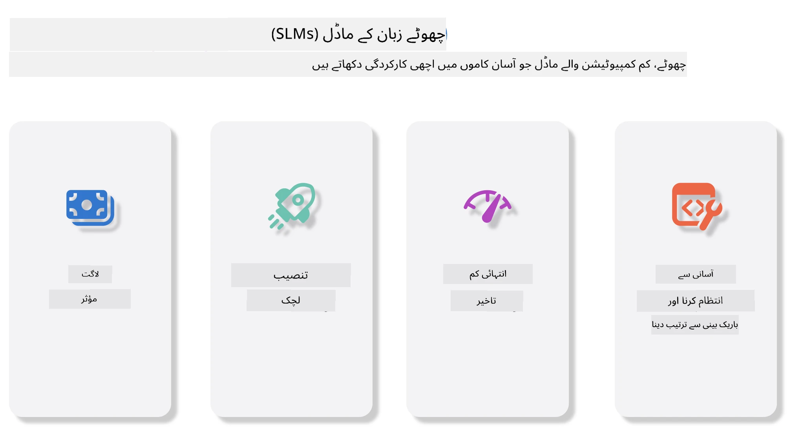
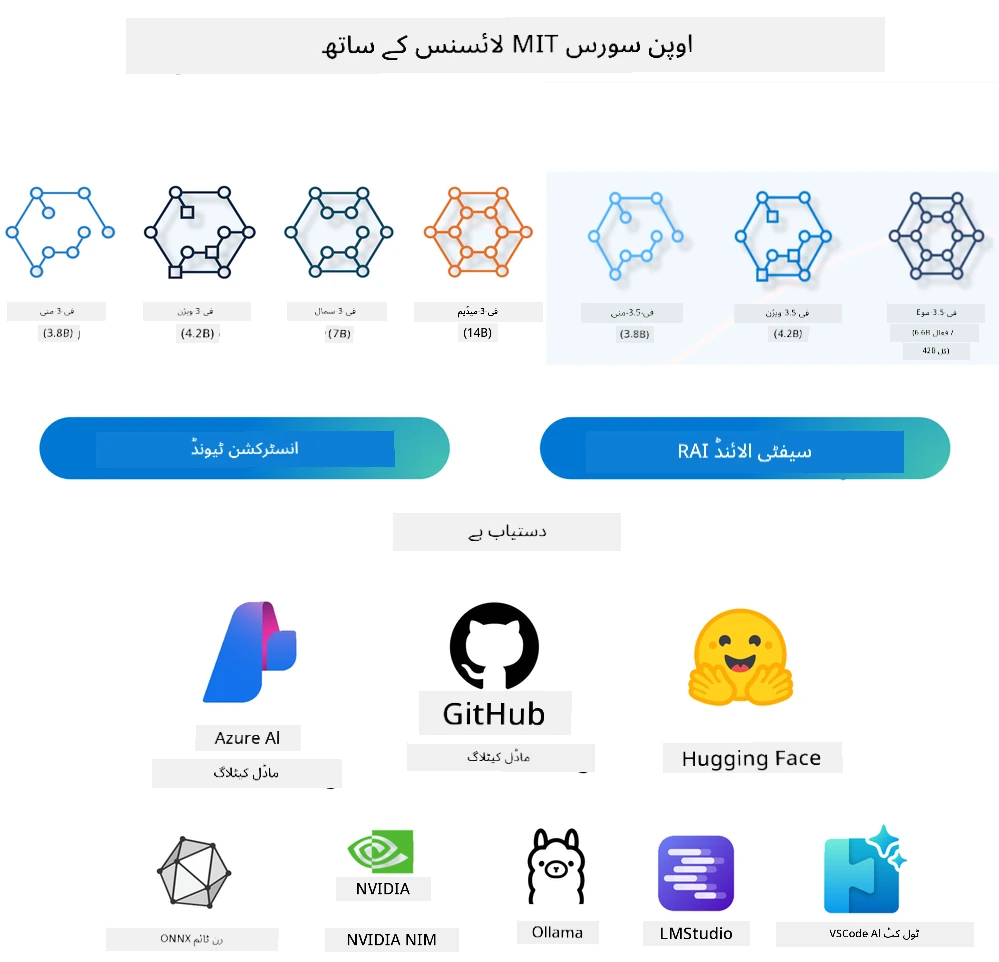
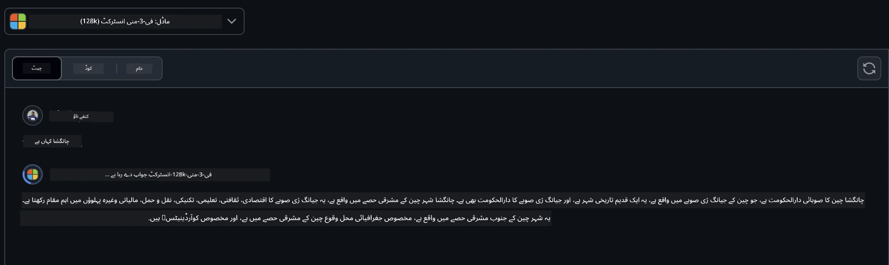
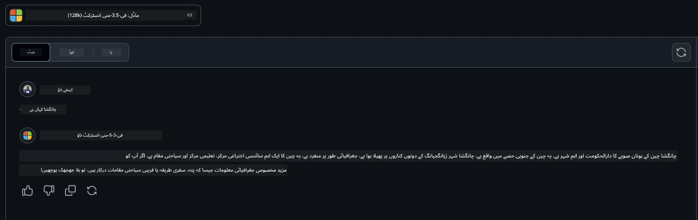

# جنریٹیو اے آئی کے لیے چھوٹے زبان پر مبنی ماڈلز کا تعارف برائے ابتدائی افراد
جنریٹیو اے آئی مصنوعی ذہانت کا ایک دلکش میدان ہے جو ایسے نظام بنانے پر توجہ دیتا ہے جو نیا مواد تخلیق کرنے کے قابل ہوں۔ یہ مواد متن، تصاویر، موسیقی اور یہاں تک کہ مکمل ورچوئل ماحول تک ہوسکتا ہے۔ جنریٹیو اے آئی کی سب سے دلچسپ ایپلیکیشنز میں سے ایک زبان کے ماڈلز کا شعبہ ہے۔

## چھوٹے زبان پر مبنی ماڈلز کیا ہیں؟

ایک چھوٹا زبان پر مبنی ماڈل (SLM) ایک کم حجم میں بڑے زبان پر مبنی ماڈل (LLM) کا متبادل ہے، جو LLM کی متعدد بنیادی ساختی اصولوں اور تکنیکوں کا استعمال کرتا ہے، تاہم اس کا کمپیوٹیشنل فرِٹ پرنٹ نمایاں طور پر کم ہوتا ہے۔

SLM زبان کے ماڈلز کا ایک ذیلی مجموعہ ہے جو انسان جیسا متن پیدا کرنے کے لیے ڈیزائن کیا گیا ہے۔ بڑے ماڈلز جیسے GPT-4 کے برعکس، SLM زیادہ مختصر اور مؤثر ہوتے ہیں، جو انہیں ایسے اطلاقی حالات کے لیے مثالی بناتے ہیں جہاں کمپیوٹیشنل وسائل محدود ہوں۔ اپنے چھوٹے سائز کے باوجود، یہ مختلف کام انجام دے سکتے ہیں۔ عام طور پر، SLMs LLMs کو کمپریس یا ڈسٹل کر کے بنائے جاتے ہیں، تاکہ اصل ماڈل کی نمایاں صلاحیتوں اور لسانی قابلیت کا بڑا حصہ محفوظ رکھا جائے۔ ماڈل کے اس سائز کو کم کرنے سے پیچیدگی بھی کم ہوتی ہے، جس سے SLM حافظہ کے استعمال اور کمپیوٹیشنل ضروریات دونوں کے لحاظ سے زیادہ مؤثر ہو جاتے ہیں۔ ان بہتریوں کے باوجود، SLM کئی نوعیت کے قدرتی زبان کی پروسیسنگ (NLP) کے کام انجام دے سکتے ہیں:

- متن کی تخلیق: مربوط اور سیاق و سباق کے مطابق جملے یا پیراگراف بنانا۔
- متن کی تکمیل: دیے گئے پرامپٹ کی بنیاد پر جملے کی پیش گوئی اور مکمل کرنا۔
- ترجمہ: کسی زبان سے دوسری زبان میں متن کا ترجمہ۔
- خلاصہ سازی: طویل متون کو مختصر اور آسانی سے سمجھنے والے مضامین میں بدلنا۔

اگرچہ کارکردگی یا سمجھ کی گہرائی میں کچھ رعایت کے ساتھ، مقابلتاً بڑے ماڈلز کے مقابلے میں۔

## چھوٹے زبان پر مبنی ماڈلز کیسے کام کرتے ہیں؟
SLM بڑی مقدار میں متن کے ڈیٹا پر تربیت یافتہ ہوتے ہیں۔ تربیت کے دوران، یہ زبان کے نمونے اور ساختیں سیکھتے ہیں، جس سے انہیں ایسا متن پیدا کرنے کی صلاحیت ملتی ہے جو گرامر کے لحاظ سے درست اور سیاق و سباق کے لحاظ سے مناسب ہو۔ تربیتی عمل میں شامل ہوتے ہیں:

- ڈیٹا کی جمع آوری: مختلف ذرائع سے بڑے حجم میں متن کے مجموعے اکٹھے کرنا۔
- پیشگی عمل درآمد: ڈیٹا کو صاف اور ترتیب دینا تاکہ تربیت کے لیے مناسب بنایا جا سکے۔
- تربیت: مشین لرننگ الگورتھمز کا استعمال کرتے ہوئے ماڈل کو متن کو سمجھنے اور پیدا کرنے کی تعلیم دینا۔
- فائن ٹیو ننگ: ماڈل کی کارکردگی کو مخصوص کاموں پر بہتر بنانے کے لیے ایڈجسٹ کرنا۔

SLM کی ترقی ان ماڈلز کی بڑھتی ہوئی ضرورت کے ساتھ ہم آہنگ ہے جو محدود وسائل والے ماحولیات، جیسے موبائل ڈیوائسز یا ایج کمپیوٹنگ پلیٹ فارمز میں چلائے جا سکیں، جہاں مکمل سکیل LLMs ان کے بھاری وسائل کی طلب کی وجہ سے عملی نہیں ہوتے۔ SLM کی توجہ کاری کے ساتھ، یہ کارکردگی اور رسائی کے درمیان توازن قائم کرتے ہیں، جس سے مختلف شعبوں میں وسیع استعمال ممکن ہوتا ہے۔



## سیکھنے کے مقاصد

اس سبق میں، ہم SLM کے متعلق علم متعارف کرائیں گے اور اسے Microsoft Phi-3 کے ساتھ مل کر متن کے مواد، وژن، اور MoE کے مختلف منظرنامے سیکھیں گے۔

سبق کے آخر میں، آپ درج ذیل سوالات کے جوابات دے سکیں گے:

- SLM کیا ہے؟
- SLM اور LLM میں کیا فرق ہے؟
- Microsoft Phi-3/3.5 فیملی کیا ہے؟
- Microsoft Phi-3/3.5 فیملی کے ساتھ انفرنس کیسے چلائی جاتی ہے؟

تیار ہیں؟ چلیں شروع کرتے ہیں۔

## بڑے زبان پر مبنی ماڈلز (LLMs) اور چھوٹے زبان پر مبنی ماڈلز (SLMs) کے درمیان فرق

LLM اور SLM دونوں امکانیت پر مبنی مشین لرننگ کے بنیادی اصولوں پر تعمیر کیے گئے ہیں، اور اپنی ساختی ڈیزائن، تربیتی طریقوں، ڈیٹا تخلیق کے عمل، اور ماڈل کی تشخیص کی تکنیکوں میں ملتے جلتے ہیں۔ تاہم، کئی اہم عوامل ان دو اقسام کے ماڈلز میں فرق پیدا کرتے ہیں۔

## چھوٹے زبان پر مبنی ماڈلز کی ایپلیکیشنز

SLM کے مختلف استعمالات ہیں، جن میں شامل ہیں:

- چیٹ بوٹس: صارفین کی مدد فراہم کرنا اور ان سے مکالمتی انداز میں بات چیت کرنا۔
- مواد کی تخلیق: مصنفین کی مدد کرنا، خیال پیدا کرنا یا مکمل مضامین کا مسودہ تیار کرنا۔
- تعلیم: طلباء کی تحریری کام یا زبانیں سیکھنے میں مدد۔
- رسائی: معذور افراد کے لیے آلات بنانا، جیسے ٹیکسٹ ٹو اسپیچ سسٹمز۔

**سائز**

LLM اور SLM کے درمیان ایک بنیادی فرق ماڈلز کے حجم میں ہے۔ LLM، جیسے ChatGPT (GPT-4)، تخمینی طور پر 1.76 کھرب پیرا میٹرز پر مشتمل ہو سکتے ہیں، جبکہ اوپن سورس SLMs جیسے Mistral 7B تقریباً 7 ارب پیرا میٹرز کے ساتھ بنائے گئے ہیں۔ یہ فرق بنیادی طور پر ماڈل کی ساخت اور تربیت کے عمل کی وجہ سے ہے۔ مثلاً ChatGPT میں ایک اینکوڈر-ڈیکوڈر فریم ورک کے اندر سیلف اٹینشن میکانزم ہے، جب کہ Mistral 7B میں سلائیڈنگ ونڈو اٹینشن استعمال ہوتی ہے، جو ایک ڈیکوڈر-صرف ماڈل میں تربیت کو زیادہ مؤثر بناتی ہے۔ یہ ساختی فرق ماڈلز کی پیچیدگی اور کارکردگی پر گہرا اثر ڈالتا ہے۔

**سمجھ بوجھ**

SLM عام طور پر خاص شعبوں میں کارکردگی کے لیے بہتر کیے جاتے ہیں، جس سے یہ زیادہ مخصوص ہوتے ہیں مگر مختلف علمی میدانوں میں وسیع سیاق و سباق کی سمجھ بوجھ میں محدود ہو سکتے ہیں۔ اس کے برعکس، LLM انسان جیسی ذہانت کی کوشش کرتے ہیں جو زیادہ جامع سطح پر ہو۔ وسیع اور متنوع ڈیٹا سیٹس پر تربیت یافتہ، LLM مختلف شعبوں میں اچھی کارکردگی دکھاتے ہیں، زیادہ ورسٹائل اور موافق ہوتے ہیں۔ نتیجتاً، LLM قدرتی زبان کی پروسیسنگ اور پروگرامنگ جیسے وسیع ڈومین کے کاموں کے لیے زیادہ موزوں ہیں۔

**کمپیوٹنگ**

LLM کی تربیت اور تعیناتی وسائل کا تقاضا کرتی ہے، جس کے لیے اکثر بڑے پیمانے پر GPU کلسٹرز کی ضرورت ہوتی ہے۔ مثال کے طور پر، ChatGPT جیسے ماڈل کو شروع سے تربیت دینے کے لیے ہزاروں GPUs کئی گھنٹوں یا دنوں کی ضرورت ہو سکتی ہے۔ اس کے برعکس، SLM، جن کے پیرا میٹر شمار کم ہوتے ہیں، کمپیوٹیشنل وسائل کے لحاظ سے زیادہ قابل رسائی ہوتے ہیں۔ Mistral 7B جیسے ماڈلز کو مقامی مشینوں پر درمیانے درجے کے GPUs کے ساتھ تربیت اور چلایا جا سکتا ہے، اگرچہ تربیت میں کئی گھنٹے اور متعدد GPUs کی ضرورت ہوتی ہے۔

**تعصب**

تعصب LLM میں ایک معروف مسئلہ ہے، جو بنیادی طور پر تربیتی ڈیٹا کی نوعیت کی وجہ سے ہوتا ہے۔ یہ ماڈل عام طور پر انٹرنیٹ سے حاصل کردہ خام، کھلے ڈیٹا پر انحصار کرتے ہیں، جو کچھ گروہوں کی غیر نمائندگی یا غلط نمائندگی کر سکتا ہے، غلط لیبلنگ کر سکتا ہے، یا زبان کے لہجے، جغرافیائی تغیرات، اور گرامر کے قواعد سے متاثرہ لسانی تعصب ظاہر کر سکتا ہے۔ اس کے علاوہ، LLM کی پیچیدگی تعصب کو بلااجازت بڑھا سکتی ہے، جو بغیر محتاط فائن ٹیو ننگ کے نظر انداز کیا جا سکتا ہے۔ دوسری جانب، SLM، زیادہ محدود اور مخصوص شعبہ جات کے ڈیٹا سیٹس پر تربیت یافتہ ہوتے ہیں، اس لیے یہ تعصب کے مقابلے میں نسبتا کم حساس ہوتے ہیں، اگرچہ مکمل طور پر آزاد نہیں ہوتے۔

**انفرنس**

SLM کے چھوٹے سائز کی وجہ سے ان کو انفرنس کی رفتار میں نمایاں فائدہ حاصل ہوتا ہے، جو انہیں مقامی ہارڈ ویئر پر مؤثر انداز میں آؤٹ پٹ تیار کرنے کی اجازت دیتا ہے بغیر وسیع پیمانے پر متوازی پروسیسنگ کی ضرورت کے۔ اس کے برعکس، LLM اپنے حجم اور پیچیدگی کی وجہ سے قابل قبول انفرنس اوقات حاصل کرنے کے لیے نمایاں متوازی کمپیوٹیشنل وسائل کی ضرورت ہوتی ہے۔ متعدد صارفین کی موجودگی بھی LLM کی جوابی اوقات کو سست کر دیتی ہے، خاص طور پر جب بڑے پیمانے پر تعینات کیے جاتے ہیں۔

خلاصہ کرتے ہوئے، اگرچہ LLM اور SLM مشین لرننگ کی بنیاد پر تعمیر کیے گئے ہیں، مگر یہ ماڈل کے سائز، وسائل کی ضروریات، سیاق و سباق کی سمجھ بوجھ، تعصب کے امکانات، اور انفرنس کی رفتار کے لحاظ سے نمایاں طور پر مختلف ہوتے ہیں۔ یہ فرق ان کے مختلف استعمالات کے موافق بنانے کی عکاسی کرتے ہیں، جہاں LLM زیادہ ورسٹائل مگر وسائل کے لحاظ سے بھاری ہوتے ہیں، اور SLM مخصوص شعبہ جات میں کم کمپیوٹیشنل مطالبات کے ساتھ زیادہ مؤثر ہوتے ہیں۔

***نوٹ: اس سبق میں، ہم SLM متعارف کرانے کے لیے Microsoft Phi-3 / 3.5 کو بطور مثال استعمال کریں گے۔***

## Phi-3 / Phi-3.5 فیملی کا تعارف

Phi-3 / 3.5 فیملی بنیادی طور پر متن، وژن، اور Agent (MoE) کی ایپلیکیشن منظرناموں پر مرکوز ہے:

### Phi-3 / 3.5 انسٹرکٹ

زیادہ تر متن کی تخلیق، چیٹ کی تکمیل، اور مواد کی معلومات اخذ کرنے کے لیے۔

**Phi-3-mini**

3.8B زبان پر مبنی ماڈل Microsoft Azure AI Studio، Hugging Face، اور Ollama پر دستیاب ہے۔ Phi-3 ماڈلز کلیدی بینچ مارکس پر مساوی اور بڑے ماڈلز سے نمایاں بہتر ہیں (نیچے دئے گئے بینچ مارک نمبرز دیکھیں، نمبر جتنا زیادہ ہوگا اتنا بہتر)۔ Phi-3-mini اپنے حجم سے دوگنے بڑے ماڈلز کو پیچھے چھوڑ دیتا ہے، جبکہ Phi-3-small اور Phi-3-medium بڑے ماڈلز بشمول GPT-3.5 کو پیچھے چھوڑتے ہیں۔

**Phi-3-small اور medium**

صرف 7B پیرا میٹرز کے ساتھ، Phi-3-small مختلف زبان، استدلال، کوڈنگ، اور ریاضی کے بینچ مارکس پر GPT-3.5T کو شکست دیتا ہے۔

Phi-3-medium جس کے 14B پیرا میٹرز ہیں، یہ رجحان جاری رکھتا ہے اور Gemini 1.0 Pro سے بہتر ہے۔

**Phi-3.5-mini**

ہم اسے Phi-3-mini کی اپگریڈ سمجھ سکتے ہیں۔ اگرچہ پیرا میٹرز تبدیل نہیں ہوتے، یہ متعدد زبانوں کی معاونت کو بہتر بناتا ہے (20+ زبانوں کی حمایت: عربی، چینی، چیک، ڈینش، ڈچ، انگریزی، فنش، فرانسیسی، جرمن، عبرانی، ہنگری، اطالوی، جاپانی، کورین، ناروے، پولش، پرتگالی، روسی، ہسپانوی، سویڈش، تھائی، ترکی، یوکرینی) اور طویل سیاق و سباق کے لیے زیادہ مضبوط سپورٹ شامل کرتا ہے۔

3.8B پیرا میٹرز کے ساتھ Phi-3.5-mini ایک ہی سائز کے زبان ماڈلز کو پیچھے چھوڑتا ہے اور اپنے حجم سے دوگنے ماڈلز کے برابر ہے۔

### Phi-3 / 3.5 وژن

ہم Phi-3/3.5 کا انسٹرکٹ ماڈل Phi کی سمجھنے کی صلاحیت کے طور پر سمجھ سکتے ہیں، اور وژن وہ صلاحیت دیتا ہے جو Phi کو دنیا کو دیکھنے اور سمجھنے کے قابل بناتا ہے۔

**Phi-3-Vision**

صرف 4.2B پیرا میٹرز کے ساتھ Phi-3-ویژن اس رجحان کو جاری رکھتا ہے اور کلاؤڈ-3 ہائیکو اور Gemini 1.0 Pro V جیسے بڑے ماڈلز کو عمومی بصری استدلال کے کاموں، OCR، اور ٹیبل و ڈایاگرام کی سمجھ بوجھ میں پیچھے چھوڑ دیتا ہے۔

**Phi-3.5-Vision**

Phi-3.5-ویژن بھی Phi-3-ویژن کی اپگریڈ ہے، جو متعدد تصاویر کی سپورٹ شامل کرتا ہے۔ آپ اسے وژن میں بہتری سمجھ سکتے ہیں، اب نہ صرف تصاویر دیکھ سکتا ہے بلکہ ویڈیوز بھی۔

Phi-3.5-ویژن بڑے ماڈلز جیسے Claude-3.5 Sonnet اور Gemini 1.5 Flash کو OCR، ٹیبل اور چارٹ کی سمجھ بوجھ کے کاموں میں پیچھے چھوڑتا ہے اور عمومی بصیرتی علم و استدلال کے کاموں پر برابر ہے۔ یہ متعدد فریم ان پٹ کی سپورٹ کرتا ہے، یعنی کئی ان پٹ تصاویر پر استدلال انجام دیتا ہے۔

### Phi-3.5-MoE

***Mixture of Experts (MoE)*** ماڈلز کو کم کمپیوٹیشنل وسائل کے ساتھ پری-ٹرین کرنے کے قابل بناتا ہے، جس کا مطلب ہے کہ آپ ایک گھنے ماڈل کے بجٹ کے مقابلے میں ماڈل یا ڈیٹا سیٹ کے سائز کو نمایاں طور پر بڑھا سکتے ہیں۔ خاص طور پر، MoE ماڈل کو اس کے گھنے متبادل کی طرح معیار کو بہت تیزی سے پری-ٹریننگ کے دوران حاصل کرنا چاہیے۔

Phi-3.5-MoE میں 16x3.8B ماہر ماڈیولز شامل ہیں۔ Phi-3.5-MoE، صرف 6.6B فعال پیرا میٹرز کے ساتھ، بڑی ماڈلز کی طرح استدلال، زبان کی سمجھ بوجھ، اور ریاضی کی کارکردگی حاصل کرتا ہے۔

ہم مختلف منظرناموں کی بنیاد پر Phi-3/3.5 فیملی ماڈلز استعمال کر سکتے ہیں۔ LLM کے برعکس، آپ Phi-3/3.5-mini یا Phi-3/3.5-Vision کو ایج ڈیوائسز پر تعینات کر سکتے ہیں۔

## Phi-3/3.5 فیملی ماڈلز کو کیسے استعمال کریں

ہم امید کرتے ہیں کہ Phi-3/3.5 کو مختلف منظرناموں میں استعمال کریں گے۔ اگلے حصے میں، ہم مختلف حالات کی بنیاد پر Phi-3/3.5 استعمال کریں گے۔



### کلاؤڈ APIs کے ذریعے انفرنس

**GitHub ماڈلز**

GitHub ماڈلز سب سے براہ راست طریقہ ہے۔ آپ تیزی سے Phi-3/3.5-Instruct ماڈل تک رسائی حاصل کر سکتے ہیں۔ Azure AI Inference SDK / OpenAI SDK کے ساتھ مل کر، آپ کوڈ کے ذریعے API کال کر کے Phi-3/3.5-Instruct تک پہنچ سکتے ہیں۔ آپ Playground کے ذریعے مختلف نتائج بھی آزما سکتے ہیں۔

- ڈیمو: چینی منظرناموں میں Phi-3-mini اور Phi-3.5-mini کے اثرات کا موازنہ





**Azure AI Studio**

اگر ہم وژن اور MoE ماڈلز استعمال کرنا چاہتے ہیں، تو Azure AI Studio کے ذریعے کال مکمل کی جا سکتی ہے۔ اگر آپ دلچسپی رکھتے ہیں تو آپ Phi-3 Cookbook پڑھ سکتے ہیں تاکہ سیکھ سکیں کہ Azure AI Studio کے ذریعے Phi-3/3.5 Instruct، Vision، MoE کو کیسے کال کیا جائے [یہ لنک کلک کریں](https://github.com/microsoft/Phi-3CookBook/blob/main/md/02.QuickStart/AzureAIStudio_QuickStart.md?WT.mc_id=academic-105485-koreyst)

**NVIDIA NIM**

Azure اور GitHub کی طرف سے فراہم کردہ کلاؤڈ بیسڈ ماڈل کیٹلاگ حل کے علاوہ، آپ [NVIDIA NIM](https://developer.nvidia.com/nim?WT.mc_id=academic-105485-koreyst) کا استعمال بھی متعلقہ کال مکمل کرنے کے لیے کر سکتے ہیں۔ آپ NVIDIA NIM پر جا کر Phi-3/3.5 فیملی کی API کال مکمل کر سکتے ہیں۔ NVIDIA NIM (NVIDIA Inference Microservices) ایک تیز رفتار انفرنس مائیکرو سروسز کا مجموعہ ہے جو ڈیولپرز کو مختلف ماحولیاتی نظاموں میں، بشمول کلاؤڈز، ڈیٹا سینٹرز، اور ورک اسٹیشنز پر، AI ماڈلز کو مؤثر طریقے سے تعینات کرنے میں مدد دینے کے لیے ڈیزائن کیا گیا ہے۔

یہاں NVIDIA NIM کی کچھ اہم خصوصیات ہیں:
- **آسان تعیناتی:** NIM ایک کمانڈ کے ذریعے AI ماڈلز کی تعیناتی کی اجازت دیتا ہے، جس سے موجودہ ورک فلو میں اسے شامل کرنا آسان ہو جاتا ہے۔
- **مؤثر کارکردگی:** یہ NVIDIA کے پری-آپٹمازڈ انفیرنس انجنز، جیسے TensorRT اور TensorRT-LLM، کا استعمال کرتا ہے تاکہ کم لیٹینسی اور زیادہ تھروپٹ کو یقینی بنایا جا سکے۔
- **وسعت پذیری:** NIM Kubernetes پر آٹو اسکیلنگ کی حمایت کرتا ہے، جو اسے مختلف ورک لوڈز کو مؤثر طریقے سے سنبھالنے کے قابل بناتا ہے۔
- **سلامتی اور کنٹرول:** تنظیمیں اپنے ڈیٹا اور ایپلیکیشنز پر کنٹرول برقرار رکھ سکتی ہیں کیونکہ وہ NIM مائیکرو سروسز کو اپنی منظم شدہ انفراسٹرکچر پر خود ہوسٹ کر سکتی ہیں۔
- **معیاری APIs:** NIM صنعت کے معیاری APIs فراہم کرتا ہے، جو چیٹ بوٹس، AI معاونین، اور دیگر AI ایپلیکیشنز بنانے اور شامل کرنے کو آسان بناتا ہے۔

NIM NVIDIA AI Enterprise کا حصہ ہے، جس کا مقصد AI ماڈلز کی تعیناتی اور آپریشن کو آسان بنانا ہے، تاکہ وہ NVIDIA GPUs پر مؤثر طریقے سے چل سکیں۔

- ڈیمو: NVIDIA NIM استعمال کرتے ہوئے Phi-3.5-Vision-API کو کال کرنا [[اس لنک پر کلک کریں](./python/Phi-3-Vision-Nividia-NIM.ipynb?WT.mc_id=academic-105485-koreyst)]

### مقامی طور پر Phi-3/3.5 چلانا
Phi-3، یا کسی بھی زبان کے ماڈل جیسے GPT-3 کے حوالے سے انفیرنس اس عمل کو کہتے ہیں جس میں موصولہ ان پٹ کی بنیاد پر جوابات یا پیش گوئیاں تیار کی جاتی ہیں۔ جب آپ Phi-3 کو کوئی پرامپٹ یا سوال دیتے ہیں، تو یہ اپنے تربیت یافتہ نیورل نیٹ ورک کا استعمال کرتے ہوئے ڈیٹا میں موجود پیٹرن اور تعلقات کا تجزیہ کر کے سب سے ممکنہ اور متعلقہ جواب اخذ کرتا ہے۔

**Hugging Face Transformer**  
Hugging Face Transformers ایک طاقتور لائبریری ہے جو قدرتی زبان کی پروسیسنگ (NLP) اور دیگر مشین لرننگ کے کاموں کے لیے ڈیزائن کی گئی ہے۔ یہاں اس کے کچھ اہم نکات ہیں:

1. **پری ٹرینڈ ماڈلز:** یہ ہزاروں پری ٹرینڈ ماڈلز فراہم کرتا ہے جو مختلف کاموں کے لیے استعمال کیے جا سکتے ہیں، جیسے متن کی درجہ بندی، نام شدہ ہستی کی شناخت، سوال کے جواب، خلاصہ سازی، ترجمہ، اور متن کی تخلیق۔

2. **فریم ورک انٹرآپریبلٹی:** یہ لائبریری متعدد ڈیپ لرننگ فریم ورکس، جن میں PyTorch، TensorFlow، اور JAX شامل ہیں، کی حمایت کرتی ہے، جو آپ کو ایک فریم ورک میں ماڈل تربیت دینے اور دوسرے میں اسے استعمال کرنے کی اجازت دیتی ہے۔

3. **ملٹی موڈل صلاحیتیں:** NLP کے علاوہ، Hugging Face Transformers کمپیوٹر وژن (مثلاً تصویر کی درجہ بندی، اشیاء کی شناخت) اور آڈیو پراسیسنگ (مثلاً تقریر کی شناخت، آڈیو کی درجہ بندی) کے کاموں کی بھی حمایت کرتا ہے۔

4. **استعمال میں آسانی:** یہ لائبریری APIs اور ٹولز فراہم کرتی ہے تاکہ ماڈلز کو آسانی سے ڈاؤن لوڈ اور فائن ٹیون کیا جا سکے، جو مبتدیوں اور ماہرین دونوں کے لیے قابل رسائی ہیں۔

5. **کمیونٹی اور وسائل:** Hugging Face کی ایک زبردست کمیونٹی ہے اور اس کے پاس وسیع دستاویزات، ٹیوٹوریلز، اور گائیڈز موجود ہیں جو صارفین کی مدد کرتے ہیں کہ وہ جلد شروع کر سکیں اور لائبریری کا زیادہ سے زیادہ فائدہ اٹھا سکیں۔ [سرکاری دستاویزات](https://huggingface.co/docs/transformers/index?WT.mc_id=academic-105485-koreyst) یا ان کا [GitHub ریپوزیٹری](https://github.com/huggingface/transformers?WT.mc_id=academic-105485-koreyst) دیکھیں۔

یہ طریقہ سب سے زیادہ استعمال ہوتا ہے، لیکن اس کے لیے GPU کی تیز رفتاری بھی ضروری ہے۔ آخر کار، Vision اور MoE جیسے منظرنامے بہت سارے حسابات طلب کرتے ہیں، جو CPU پر کوانٹائز نہ کیے جائیں تو بہت سست ہوں گے۔

- ڈیمو: Transformer استعمال کرتے ہوئے Phi-3.5-Instruct کو کال کرنا [اس لنک پر کلک کریں](./python/phi35-instruct-demo.ipynb?WT.mc_id=academic-105485-koreyst)

- ڈیمو: Transformer استعمال کرتے ہوئے Phi-3.5-Vision کو کال کرنا [اس لنک پر کلک کریں](./python/phi35-vision-demo.ipynb?WT.mc_id=academic-105485-koreyst)

- ڈیمو: Transformer استعمال کرتے ہوئے Phi-3.5-MoE کو کال کرنا [اس لنک پر کلک کریں](./python/phi35_moe_demo.ipynb?WT.mc_id=academic-105485-koreyst)

**Ollama**  
[Ollama](https://ollama.com/?WT.mc_id=academic-105485-koreyst) ایک ایسا پلیٹ فارم ہے جو بڑے زبان کے ماڈلز (LLMs) کو آپ کی مشین پر مقامی طور پر چلانا آسان بناتا ہے۔ یہ مختلف ماڈلز جیسے Llama 3.1، Phi 3، Mistral، اور Gemma 2 کی حمایت کرتا ہے۔ یہ پلیٹ فارم ماڈل کے وزن، کنفیگریشن، اور ڈیٹا کو ایک واحد پیکج میں بند کر کے عمل کو آسان بناتا ہے، جس سے صارفین کے لیے اپنی مرضی کے مطابق ماڈل تیار کرنا آسان ہو جاتا ہے۔ Ollama macOS، Linux، اور Windows کے لیے دستیاب ہے۔ یہ ایک بہترین ٹول ہے اگر آپ LLMs کے ساتھ تجربہ کرنا یا انہیں کلاؤڈ سروسز پر انحصار کیے بغیر تعینات کرنا چاہتے ہیں۔ Ollama سب سے براہ راست طریقہ ہے، آپ کو صرف درج ذیل کمانڈ چلانا ہے۔

```bash

ollama run phi3.5

```


**ONNX Runtime for GenAI**  

[ONNX Runtime](https://github.com/microsoft/onnxruntime-genai?WT.mc_id=academic-105485-koreyst) ایک کراس پلیٹ فارم انفیرنس اور تربیتی مشین لرننگ ایکسیلیریٹر ہے۔ ONNX Runtime for Generative AI (GENAI) ایک طاقتور ٹول ہے جو آپ کو مختلف پلیٹ فارمز پر جنریٹو AI ماڈلز مؤثر طریقے سے چلانے میں مدد دیتا ہے۔

## ONNX Runtime کیا ہے؟  
ONNX Runtime ایک اوپن سورس پروجیکٹ ہے جو مشین لرننگ ماڈلز کی ہائی پرفارمنس انفیرنس کو ممکن بناتا ہے۔ یہ Open Neural Network Exchange (ONNX) فارمیٹ میں ماڈلز کو سپورٹ کرتا ہے، جو مشین لرننگ ماڈلز کی نمائندگی کا معیار ہے۔ ONNX Runtime انفیرنس تیز صارف تجربات اور کم لاگت کو ممکن بناتی ہے، اور اسے PyTorch، TensorFlow/Keras جیسے ڈیپ لرننگ فریم ورکس کے ساتھ ساتھ scikit-learn، LightGBM، XGBoost جیسے کلاسیکل مشین لرننگ لائبریریز کے ماڈلز کی حمایت حاصل ہے۔ ONNX Runtime مختلف ہارڈ ویئر، ڈرائیورز، اور آپریٹنگ سسٹمز کے ساتھ مطابقت رکھتا ہے، اور جہاں ممکن ہو ہارڈ ویئر ایکسیلیریٹرز کا استعمال کرتے ہوئے گراف آپٹیمائزیشن اور ٹرانسفارم کے ذریعے بہترین کارکردگی فراہم کرتا ہے۔

## Generative AI کیا ہے؟  
Generative AI ایسے AI سسٹمز کو کہتے ہیں جو تربیت شدہ ڈیٹا کی بنیاد پر نیا مواد، جیسے متن، تصاویر، یا موسیقی تخلیق کر سکتے ہیں۔ مثالوں میں زبان کے ماڈلز جیسے GPT-3 اور تصویر تخلیق کرنے والے ماڈلز جیسے Stable Diffusion شامل ہیں۔ ONNX Runtime for GenAI لائبریری ONNX ماڈلز کے لیے جنریٹو AI لوپ فراہم کرتی ہے، جس میں ONNX Runtime کے ذریعے انفیرنس، لاگٹس پراسیسنگ، سرچ اور سیمپلنگ، اور KV کیش مینجمنٹ شامل ہے۔

## ONNX Runtime for GENAI  
ONNX Runtime for GENAI، ONNX Runtime کی صلاحیتوں کو بڑھاتا ہے تاکہ جنریٹو AI ماڈلز کی حمایت کی جا سکے۔ کچھ اہم خصوصیات یہ ہیں:

- **وسیع پلیٹ فارم حمایت:** یہ مختلف پلیٹ فارمز پر کام کرتا ہے، جن میں Windows، Linux، macOS، Android، اور iOS شامل ہیں۔  
- **ماڈل کی حمایت:** یہ بہت سے مقبول جنریٹو AI ماڈلز کی حمایت کرتا ہے، جیسے LLaMA، GPT-Neo، BLOOM، اور دیگر۔  
- **کارکردگی کی بہتری:** یہ مختلف ہارڈ ویئر ایکسیلیریٹرز جیسے NVIDIA GPUs، AMD GPUs وغیرہ کے لیے آپٹیمائزیشن شامل کرتا ہے۔  
- **آسان استعمال:** یہ ایپلیکیشنز میں آسانی سے انضمام کے لیے APIs فراہم کرتا ہے، جس سے آپ کم سے کم کوڈ کے ساتھ متن، تصاویر، اور دیگر مواد تخلیق کر سکتے ہیں۔  
- صارفین generate() کے اعلیٰ سطحی میتھڈ کو کال کر سکتے ہیں، یا ماڈل کے ہر ایٹریشن کو لوپ میں چلا سکتے ہیں، ایک وقت میں ایک ٹوکن بنا کر، اور اختیاری طور پر لوپ کے اندر جنریشن پیرا میٹرز کو اپ ڈیٹ کر سکتے ہیں۔  
- ONNX runtime میں greedy/beam سرچ اور TopP، TopK سیمپلنگ کی بھی حمایت ہے تاکہ ٹوکن سلسلے تیار کیے جا سکیں اور لاگٹس پراسیسنگ جیسے repetition penalties شامل ہیں۔ آپ آسانی سے کسٹم اسکورنگ بھی شامل کر سکتے ہیں۔

## شروع کرنے کا طریقہ  
ONNX Runtime for GENAI کے ساتھ شروع کرنے کے لیے آپ ان مراحل پر عمل کر سکتے ہیں:

### ONNX Runtime انسٹال کریں:  
```Python
pip install onnxruntime
```
  
### Generative AI ایکسٹینشنز انسٹال کریں:  
```Python
pip install onnxruntime-genai
```
  
### ماڈل چلائیں: یہاں Python میں ایک آسان مثال ہے:  
```Python
import onnxruntime_genai as og

model = og.Model('path_to_your_model.onnx')

tokenizer = og.Tokenizer(model)

input_text = "Hello, how are you?"

input_tokens = tokenizer.encode(input_text)

output_tokens = model.generate(input_tokens)

output_text = tokenizer.decode(output_tokens)

print(output_text) 
```
  
### ڈیمو: ONNX Runtime GenAI استعمال کرتے ہوئے Phi-3.5-Vision کو کال کرنا  

```python

import onnxruntime_genai as og

model_path = './Your Phi-3.5-vision-instruct ONNX Path'

img_path = './Your Image Path'

model = og.Model(model_path)

processor = model.create_multimodal_processor()

tokenizer_stream = processor.create_stream()

text = "Your Prompt"

prompt = "<|user|>\n"

prompt += "<|image_1|>\n"

prompt += f"{text}<|end|>\n"

prompt += "<|assistant|>\n"

image = og.Images.open(img_path)

inputs = processor(prompt, images=image)

params = og.GeneratorParams(model)

params.set_inputs(inputs)

params.set_search_options(max_length=3072)

generator = og.Generator(model, params)

while not generator.is_done():

    generator.compute_logits()
    
    generator.generate_next_token()

    new_token = generator.get_next_tokens()[0]
    
    output = tokenizer_stream.decode(new_token)
    
    print(tokenizer_stream.decode(new_token), end='', flush=True)

```


**دیگر**

ONNX Runtime اور Ollama حوالہ طریقوں کے علاوہ، ہم مختلف مینوفیکچررز کی طرف سے فراہم کردہ ماڈل حوالہ طریقوں کی بنیاد پر مقداری ماڈلز کی بھی حوالہ مکمل کر سکتے ہیں۔ جیسے Apple MLX فریم ورک Apple Metal کے ساتھ، Qualcomm QNN NPU کے ساتھ، Intel OpenVINO CPU/GPU کے ساتھ وغیرہ۔ آپ مزید مواد [Phi-3 Cookbook](https://github.com/microsoft/phi-3cookbook?WT.mc_id=academic-105485-koreyst) سے بھی حاصل کر سکتے ہیں۔

## مزید

ہم نے Phi-3/3.5 خاندان کی بنیادی باتیں سیکھ لی ہیں، لیکن SLM کے بارے میں مزید جاننے کے لیے ہمیں مزید معلومات کی ضرورت ہے۔ آپ اس کے جوابات Phi-3 Cookbook میں پا سکتے ہیں۔ اگر آپ مزید سیکھنا چاہتے ہیں تو براہ کرم [Phi-3 Cookbook](https://github.com/microsoft/phi-3cookbook?WT.mc_id=academic-105485-koreyst) ملاحظہ کریں۔

---

<!-- CO-OP TRANSLATOR DISCLAIMER START -->
**وضاحت**:  
اس دستاویز کا ترجمہ AI ترجمہ سروس [Co-op Translator](https://github.com/Azure/co-op-translator) کے ذریعے کیا گیا ہے۔ اگرچہ ہم درستگی کے لیے کوشاں ہیں، براہ کرم اس بات کا خیال رکھیں کہ خودکار تراجم میں غلطیاں یا عدم درستیاں ہو سکتی ہیں۔ اصل دستاویز اپنی مادری زبان میں معتبر ذریعہ سمجھی جائے گی۔ اہم معلومات کے لیے پیشہ ور انسانی ترجمہ تجویز کیا جاتا ہے۔ اس ترجمے کے استعمال سے پیدا ہونے والی کسی بھی غلط فہمی یا غلط تشریح کی ذمہ داری ہماری نہیں ہوگی۔
<!-- CO-OP TRANSLATOR DISCLAIMER END -->