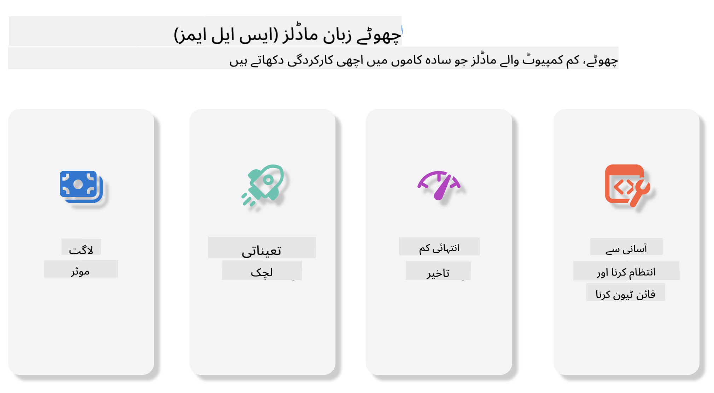
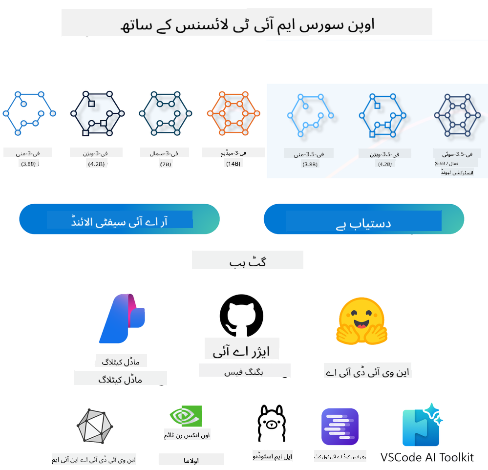
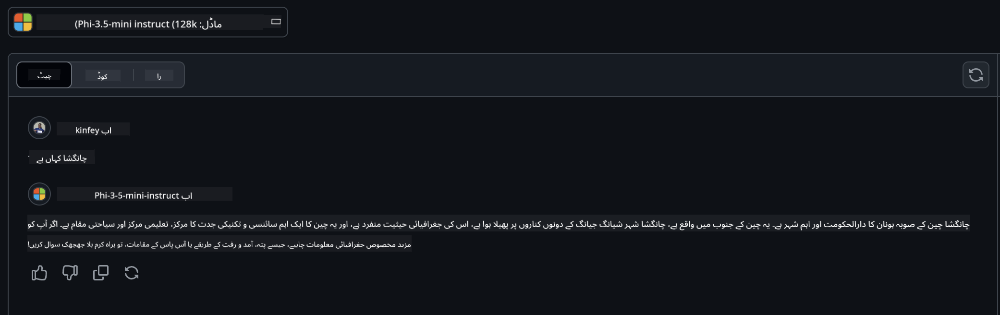

<!--
CO_OP_TRANSLATOR_METADATA:
{
  "original_hash": "124ad36cfe96f74038811b6e2bb93e9d",
  "translation_date": "2025-07-09T18:18:42+00:00",
  "source_file": "19-slm/README.md",
  "language_code": "ur"
}
-->
# جنریٹو AI کے لیے چھوٹے زبان کے ماڈلز کا تعارف برائے مبتدیان  
جنریٹو AI مصنوعی ذہانت کا ایک دلچسپ شعبہ ہے جو ایسے نظام بنانے پر مرکوز ہے جو نئی مواد تخلیق کرنے کے قابل ہوں۔ یہ مواد متن، تصاویر، موسیقی اور حتیٰ کہ مکمل ورچوئل ماحول تک ہو سکتا ہے۔ جنریٹو AI کی سب سے دلچسپ ایپلیکیشنز میں سے ایک زبان کے ماڈلز کا میدان ہے۔  

## چھوٹے زبان کے ماڈلز کیا ہیں؟  
چھوٹا زبان ماڈل (SLM) ایک بڑے زبان ماڈل (LLM) کا مختصر اور کم پیچیدہ ورژن ہوتا ہے، جو LLM کی بہت سی ساختی اصولوں اور تکنیکوں کو استعمال کرتا ہے، مگر اس کا کمپیوٹیشنل بوجھ بہت کم ہوتا ہے۔  

SLMs زبان کے ماڈلز کا ایک ذیلی حصہ ہیں جو انسانی طرز کا متن تخلیق کرنے کے لیے بنائے گئے ہیں۔ بڑے ماڈلز جیسے GPT-4 کے برعکس، SLMs زیادہ کمپیکٹ اور مؤثر ہوتے ہیں، جو انہیں ان جگہوں کے لیے مثالی بناتا ہے جہاں کمپیوٹیشنل وسائل محدود ہوں۔ چھوٹے ہونے کے باوجود، یہ مختلف کام انجام دے سکتے ہیں۔ عام طور پر، SLMs کو LLMs کو کمپریس یا ڈسٹل کر کے بنایا جاتا ہے تاکہ اصل ماڈل کی زیادہ تر صلاحیت اور لسانی قابلیت برقرار رکھی جا سکے۔ ماڈل کے سائز میں یہ کمی مجموعی پیچیدگی کو کم کرتی ہے، جس سے SLMs میموری اور کمپیوٹیشنل ضروریات دونوں کے لحاظ سے زیادہ مؤثر ہو جاتے ہیں۔ ان اصلاحات کے باوجود، SLMs مختلف قدرتی زبان کی پروسیسنگ (NLP) کے کام انجام دے سکتے ہیں:  

- متن کی تخلیق: مربوط اور سیاق و سباق کے مطابق جملے یا پیراگراف بنانا۔  
- متن کی تکمیل: دیے گئے پرامپٹ کی بنیاد پر جملے کی پیش گوئی اور تکمیل۔  
- ترجمہ: ایک زبان سے دوسری زبان میں متن کا ترجمہ۔  
- خلاصہ سازی: طویل متن کو مختصر اور آسان فہم خلاصوں میں تبدیل کرنا۔  

اگرچہ کارکردگی یا سمجھ کی گہرائی میں کچھ قربانیاں دی جاتی ہیں، خاص طور پر بڑے ماڈلز کے مقابلے میں۔  

## چھوٹے زبان کے ماڈلز کیسے کام کرتے ہیں؟  
SLMs کو وسیع مقدار میں متن کے ڈیٹا پر تربیت دی جاتی ہے۔ تربیت کے دوران، یہ زبان کے پیٹرنز اور ساختوں کو سیکھتے ہیں، جس سے وہ گرامر کے لحاظ سے درست اور سیاق و سباق کے مطابق متن تخلیق کر سکتے ہیں۔ تربیتی عمل میں شامل ہیں:  

- ڈیٹا جمع کرنا: مختلف ذرائع سے بڑے متن کے ڈیٹا سیٹس اکٹھے کرنا۔  
- پری پروسیسنگ: ڈیٹا کو صاف اور منظم کرنا تاکہ تربیت کے لیے موزوں بنایا جا سکے۔  
- تربیت: مشین لرننگ الگورتھمز کا استعمال کرتے ہوئے ماڈل کو متن سمجھنے اور تخلیق کرنے کی تعلیم دینا۔  
- فائن ٹیوننگ: مخصوص کاموں پر کارکردگی بہتر بنانے کے لیے ماڈل کو ایڈجسٹ کرنا۔  

SLMs کی ترقی اس بڑھتی ہوئی ضرورت کے ساتھ ہم آہنگ ہے کہ ایسے ماڈلز بنائے جائیں جو محدود وسائل والے ماحول میں، جیسے موبائل ڈیوائسز یا ایج کمپیوٹنگ پلیٹ فارمز پر، تعینات کیے جا سکیں، جہاں مکمل LLMs کا استعمال وسائل کی زیادتی کی وجہ سے مشکل ہو۔ مؤثریت پر توجہ دے کر، SLMs کارکردگی اور دستیابی کے درمیان توازن قائم کرتے ہیں، جس سے مختلف شعبوں میں وسیع تر اطلاق ممکن ہوتا ہے۔  

  

## سیکھنے کے مقاصد  
اس سبق میں، ہم SLM کے بارے میں معلومات فراہم کرنے اور اسے Microsoft Phi-3 کے ساتھ ملا کر متن، بصارت اور MoE میں مختلف منظرناموں کو سیکھنے کی کوشش کریں گے۔  

سبق کے اختتام پر، آپ درج ذیل سوالات کے جواب دے سکیں گے:  

- SLM کیا ہے؟  
- SLM اور LLM میں کیا فرق ہے؟  
- Microsoft Phi-3/3.5 فیملی کیا ہے؟  
- Microsoft Phi-3/3.5 فیملی کا انفرنس کیسے کریں؟  

تیار ہیں؟ چلیں شروع کرتے ہیں۔  

## بڑے زبان کے ماڈلز (LLMs) اور چھوٹے زبان کے ماڈلز (SLMs) کے درمیان فرق  
دونوں LLMs اور SLMs بنیادی طور پر احتمالی مشین لرننگ کے اصولوں پر مبنی ہیں، اور ان کی ساختی ڈیزائن، تربیتی طریقہ کار، ڈیٹا جنریشن کے عمل، اور ماڈل کی جانچ کے طریقے ملتے جلتے ہیں۔ تاہم، چند اہم عوامل ان دونوں اقسام کے ماڈلز میں فرق کرتے ہیں۔  

## چھوٹے زبان کے ماڈلز کی ایپلیکیشنز  
SLMs کے کئی استعمالات ہیں، جن میں شامل ہیں:  

- چیٹ بوٹس: صارفین کی مدد فراہم کرنا اور بات چیت کے ذریعے ان سے رابطہ کرنا۔  
- مواد کی تخلیق: لکھاریوں کی مدد کرنا، خیالات پیدا کرنا یا مکمل مضامین کا مسودہ تیار کرنا۔  
- تعلیم: طلباء کی تحریری اسائنمنٹس میں مدد یا نئی زبانیں سیکھنے میں معاونت۔  
- رسائی: معذور افراد کے لیے ٹیکسٹ ٹو اسپیچ جیسے آلات بنانا۔  

**سائز**  

LLMs اور SLMs کے درمیان بنیادی فرق ماڈل کے سائز میں ہوتا ہے۔ LLMs، جیسے ChatGPT (GPT-4)، میں تقریباً 1.76 ٹریلین پیرامیٹرز ہو سکتے ہیں، جبکہ اوپن سورس SLMs جیسے Mistral 7B میں تقریباً 7 بلین پیرامیٹرز ہوتے ہیں۔ یہ فرق بنیادی طور پر ماڈل کی ساخت اور تربیتی عمل کی وجہ سے ہوتا ہے۔ مثال کے طور پر، ChatGPT ایک encoder-decoder فریم ورک میں self-attention میکانزم استعمال کرتا ہے، جبکہ Mistral 7B sliding window attention استعمال کرتا ہے، جو decoder-only ماڈل میں زیادہ مؤثر تربیت ممکن بناتا ہے۔ یہ ساختی فرق ماڈلز کی پیچیدگی اور کارکردگی پر گہرا اثر ڈالتا ہے۔  

**سمجھ بوجھ**  

SLMs عام طور پر مخصوص شعبوں میں کارکردگی کے لیے بہتر بنائے جاتے ہیں، جس سے وہ خاص مہارت رکھتے ہیں مگر وسیع سیاق و سباق کی سمجھ میں محدود ہو سکتے ہیں۔ اس کے برعکس، LLMs وسیع اور متنوع ڈیٹا سیٹس پر تربیت یافتہ ہوتے ہیں تاکہ انسانی طرز کی ذہانت کی نقل کر سکیں اور مختلف شعبوں میں بہتر کارکردگی دکھا سکیں۔ اس وجہ سے، LLMs زیادہ ورسٹائل ہوتے ہیں اور قدرتی زبان کی پروسیسنگ اور پروگرامنگ جیسے وسیع تر کاموں کے لیے زیادہ موزوں ہوتے ہیں۔  

**کمپیوٹنگ**  

LLMs کی تربیت اور تعیناتی وسائل کا بھاری تقاضا کرتی ہے، جس کے لیے بڑے پیمانے پر GPU کلسٹرز کی ضرورت ہوتی ہے۔ مثال کے طور پر، ChatGPT جیسے ماڈل کی تربیت ہزاروں GPUs پر کئی ہفتوں تک چل سکتی ہے۔ اس کے برعکس، SLMs، جن کے پیرامیٹرز کم ہوتے ہیں، کمپیوٹیشنل وسائل کے لحاظ سے زیادہ قابل رسائی ہوتے ہیں۔ Mistral 7B جیسے ماڈلز کو مقامی مشینوں پر درمیانے درجے کی GPU صلاحیتوں کے ساتھ تربیت اور چلایا جا سکتا ہے، اگرچہ تربیت کے لیے کئی گھنٹے اور متعدد GPUs کی ضرورت ہوتی ہے۔  

**تعصب**  

LLMs میں تعصب ایک معروف مسئلہ ہے، جو بنیادی طور پر تربیتی ڈیٹا کی نوعیت کی وجہ سے ہوتا ہے۔ یہ ماڈلز اکثر انٹرنیٹ سے حاصل کردہ خام اور کھلے ڈیٹا پر انحصار کرتے ہیں، جو بعض گروہوں کی نمائندگی کم کر سکتا ہے، غلط لیبلنگ کر سکتا ہے، یا بولی، جغرافیائی فرق اور گرامر کے اثرات کی وجہ سے لسانی تعصب ظاہر کر سکتا ہے۔ مزید برآں، LLMs کی پیچیدہ ساخت تعصب کو بڑھا سکتی ہے، جو بغیر محتاط فائن ٹیوننگ کے نظر انداز رہ سکتا ہے۔ دوسری طرف، SLMs، جو محدود اور مخصوص شعبوں کے ڈیٹا پر تربیت یافتہ ہوتے ہیں، ایسے تعصبات کے لیے کم حساس ہوتے ہیں، اگرچہ مکمل طور پر محفوظ نہیں۔  

**انفرنس**  

SLMs کے چھوٹے سائز کی وجہ سے ان کی انفرنس کی رفتار زیادہ ہوتی ہے، جو انہیں مقامی ہارڈویئر پر مؤثر طریقے سے چلانے کی اجازت دیتی ہے بغیر بڑے پیمانے پر متوازی کمپیوٹنگ کے۔ اس کے برعکس، LLMs اپنی جسامت اور پیچیدگی کی وجہ سے قابل قبول انفرنس وقت کے لیے وسیع متوازی کمپیوٹیشنل وسائل کے محتاج ہوتے ہیں۔ متعدد صارفین کی موجودگی میں LLMs کی ردعمل کی رفتار مزید کم ہو جاتی ہے، خاص طور پر جب بڑے پیمانے پر تعینات کیے جائیں۔  

خلاصہ یہ کہ، اگرچہ LLMs اور SLMs مشین لرننگ کے بنیادی اصولوں پر مبنی ہیں، وہ ماڈل کے سائز، وسائل کی ضروریات، سیاق و سباق کی سمجھ، تعصب کی حساسیت، اور انفرنس کی رفتار کے لحاظ سے نمایاں طور پر مختلف ہیں۔ یہ فرق ان کے مختلف استعمالات کے لیے موزونیت کی عکاسی کرتے ہیں، جہاں LLMs زیادہ ورسٹائل مگر وسائل کے لحاظ سے بھاری ہوتے ہیں، اور SLMs مخصوص شعبوں میں مؤثر اور کم کمپیوٹیشنل تقاضوں کے حامل ہوتے ہیں۔  

***Note：اس باب میں، ہم SLM کو Microsoft Phi-3 / 3.5 کی مثال کے طور پر متعارف کرائیں گے۔***  

## Phi-3 / Phi-3.5 فیملی کا تعارف  
Phi-3 / 3.5 فیملی بنیادی طور پر متن، بصارت، اور ایجنٹ (MoE) کے ایپلیکیشن منظرناموں کو ہدف بناتی ہے:  

### Phi-3 / 3.5 Instruct  
یہ بنیادی طور پر متن کی تخلیق، چیٹ کی تکمیل، اور مواد کی معلومات نکالنے کے لیے ہے۔  

**Phi-3-mini**  
3.8B زبان ماڈل Microsoft Azure AI Studio، Hugging Face، اور Ollama پر دستیاب ہے۔ Phi-3 ماڈلز برابر یا بڑے سائز کے زبان ماڈلز کے مقابلے میں کلیدی بینچ مارکس پر نمایاں کارکردگی دکھاتے ہیں (نیچے بینچ مارک نمبرز دیکھیں، زیادہ نمبر بہتر ہیں)۔ Phi-3-mini اپنے سائز کے دوگنے ماڈلز سے بہتر ہے، جبکہ Phi-3-small اور Phi-3-medium بڑے ماڈلز بشمول GPT-3.5 کو پیچھے چھوڑ دیتے ہیں۔  

**Phi-3-small & medium**  
صرف 7B پیرامیٹرز کے ساتھ، Phi-3-small مختلف زبان، استدلال، کوڈنگ، اور ریاضی کے بینچ مارکس پر GPT-3.5T کو شکست دیتا ہے۔  

Phi-3-medium، جس میں 14B پیرامیٹرز ہیں، اس رجحان کو جاری رکھتا ہے اور Gemini 1.0 Pro سے بہتر کارکردگی دکھاتا ہے۔  

**Phi-3.5-mini**  
اسے Phi-3-mini کا اپ گریڈ سمجھا جا سکتا ہے۔ پیرامیٹرز وہی رہتے ہیں، مگر یہ متعدد زبانوں کی حمایت بہتر بناتا ہے (20+ زبانیں: عربی، چینی، چیک، ڈینش، ڈچ، انگریزی، فنش، فرانسیسی، جرمن، عبرانی، ہنگری، اطالوی، جاپانی، کوریائی، ناروے، پولش، پرتگالی، روسی، ہسپانوی، سویڈش، تھائی، ترکی، یوکرینی) اور طویل سیاق و سباق کی مضبوط حمایت شامل کرتا ہے۔  

3.8B پیرامیٹرز کے ساتھ Phi-3.5-mini اپنے سائز کے زبان ماڈلز سے بہتر ہے اور دوگنے سائز کے ماڈلز کے برابر ہے۔  

### Phi-3 / 3.5 Vision  
ہم Phi-3/3.5 کے Instruct ماڈل کو Phi کی سمجھنے کی صلاحیت کے طور پر دیکھ سکتے ہیں، اور Vision وہ ہے جو Phi کو دنیا کو سمجھنے کے لیے آنکھیں دیتا ہے۔  

**Phi-3-Vision**  
صرف 4.2B پیرامیٹرز کے ساتھ، Phi-3-vision اس رجحان کو جاری رکھتا ہے اور بڑے ماڈلز جیسے Claude-3 Haiku اور Gemini 1.0 Pro V کو عمومی بصری استدلال، OCR، اور جدول و خاکہ سمجھنے کے کاموں میں پیچھے چھوڑ دیتا ہے۔  

**Phi-3.5-Vision**  
Phi-3.5-Vision بھی Phi-3-Vision کا اپ گریڈ ہے، جو متعدد تصاویر کی حمایت شامل کرتا ہے۔ اسے بصارت میں بہتری سمجھیں، جہاں آپ نہ صرف تصاویر دیکھ سکتے ہیں بلکہ ویڈیوز بھی۔  

Phi-3.5-vision بڑے ماڈلز جیسے Claude-3.5 Sonnet اور Gemini 1.5 Flash کو OCR، جدول اور چارٹ سمجھنے کے کاموں میں پیچھے چھوڑ دیتا ہے اور عمومی بصری علم و استدلال کے کاموں میں برابر ہے۔ یہ متعدد فریم ان پٹ کی حمایت کرتا ہے، یعنی متعدد تصاویر پر استدلال کر سکتا ہے۔  

### Phi-3.5-MoE  
***Mixture of Experts (MoE)*** ماڈلز کو کم کمپیوٹیشنل وسائل کے ساتھ پری ٹرین کرنے کی اجازت دیتا ہے، جس کا مطلب ہے کہ آپ ایک ہی کمپیوٹ بجٹ کے ساتھ ماڈل یا ڈیٹا سیٹ کا سائز نمایاں طور پر بڑھا سکتے ہیں۔ خاص طور پر، MoE ماڈل کو اپنے ڈینس ہم منصب کے مقابلے میں پری ٹریننگ کے دوران بہت تیزی سے وہی معیار حاصل کرنا چاہیے۔  

Phi-3.5-MoE میں 16x3.8B ماہر ماڈیولز شامل ہیں۔ Phi-3.5-MoE صرف 6.6B فعال پیرامیٹرز کے ساتھ بڑے ماڈلز کے برابر استدلال، زبان کی سمجھ اور ریاضی کی صلاحیت رکھتا ہے۔  

ہم مختلف منظرناموں کی بنیاد پر Phi-3/3.5 فیملی ماڈلز استعمال کر سکتے ہیں۔ LLM کے برعکس، آپ Phi-3/3.5-mini یا Phi-3/3.5-Vision کو ایج ڈیوائسز پر تعینات کر سکتے ہیں۔  

## Phi-3/3.5 فیملی ماڈلز کا استعمال کیسے کریں  
ہم امید کرتے ہیں کہ Phi-3/3.5 کو مختلف منظرناموں میں استعمال کریں گے۔ اگلے حصے میں، ہم مختلف منظرناموں کی بنیاد پر Phi-3/3.5 استعمال کریں گے۔  

  

### کلاؤڈ API کے ذریعے انفرنس کا فرق  

**GitHub Models**  
GitHub Models سب سے براہ راست طریقہ ہے۔ آپ تیزی سے Phi-3/3.5-Instruct ماڈل تک رسائی حاصل کر سکتے ہیں۔ Azure AI Inference SDK / OpenAI SDK کے ساتھ مل کر، آپ کوڈ کے ذریعے API کال کر کے Phi-3/3.5-Instruct کو استعمال کر سکتے ہیں۔ آپ Playground کے ذریعے مختلف نتائج بھی آزما سکتے ہیں۔  

- ڈیمو: چینی منظرناموں میں Phi-3-mini اور Phi-3.5-mini کے اثرات کا موازنہ  

  

  

**Azure AI Studio**  
اگر آپ بصارت اور MoE ماڈلز استعمال کرنا چاہتے ہیں، تو Azure AI Studio کے ذریعے کال مکمل کر سکتے ہیں۔ اگر دلچسپی ہو تو Phi-3 Cookbook پڑھیں تاکہ سیکھ سکیں کہ Azure AI Studio کے ذریعے Phi-3/3.5 Instruct، Vision، MoE کو کیسے کال کیا جائے [اس لنک پر کلک کریں](https://github.com/microsoft/Phi-3CookBook/blob/main/md/02.QuickStart/AzureAIStudio_QuickStart.md?WT.mc_id=academic-105485-koreyst)  

**NVIDIA NIM**  
Azure اور GitHub کی کلاؤڈ بیسڈ ماڈل کیٹلاگ سلوشنز کے علاوہ، آپ [NVIDIA NIM](https://developer.nvidia.com/nim?WT.mc_id=academic-105485-koreyst) کا استعمال بھی کر سکتے ہیں تاکہ Phi-3/3.5 فیملی کی API کالز مکمل کی جا سکیں۔ NVIDIA NIM (NVIDIA Inference Microservices) ایک سیٹ ہے تیز رفتار انفرنس مائیکرو سروسز کی، جو ڈویلپرز کو مختلف ماحول میں، بشمول کلاؤڈز، ڈیٹا سینٹرز، اور ورک سٹیشنز، AI ماڈلز کو مؤثر طریقے سے تعینات کرنے میں مدد دیتی ہے۔  

NVIDIA NIM کی چند اہم خصوصیات:  

- **آسان تعیناتی:** NIM ایک کمانڈ کے ذریعے AI ماڈلز کی تعیناتی کی اجازت دیتا ہے، جس سے موجودہ ورک فلو میں انضمام آسان ہو جاتا ہے۔  
- **بہتر کارکردگی:** یہ NVIDIA کے پہلے سے بہتر کردہ انفرنس انجنز جیسے TensorRT اور TensorRT-LLM کا استعمال کرتا ہے تاکہ کم تاخیر اور زیادہ تھروپٹ یقینی بنایا جا سکے۔  
- **اسکیل ایبلٹی:** NIM Kubernetes پر آٹو اسکیلنگ کی حمایت کرتا ہے، جو مختلف ورک لوڈز کو مؤثر طریقے سے سنبھالنے کے قابل بناتا ہے۔
- **سیکیورٹی اور کنٹرول:** تنظیمیں اپنے ڈیٹا اور ایپلیکیشنز پر مکمل کنٹرول برقرار رکھ سکتی ہیں جب وہ NIM مائیکرو سروسز کو اپنی مینیجڈ انفراسٹرکچر پر خود ہوسٹ کریں۔
- **معیاری APIs:** NIM صنعت کے معیاری APIs فراہم کرتا ہے، جو چیٹ بوٹس، AI اسسٹنٹس اور دیگر AI ایپلیکیشنز بنانے اور انضمام کو آسان بناتے ہیں۔

NIM، NVIDIA AI Enterprise کا حصہ ہے، جس کا مقصد AI ماڈلز کی تعیناتی اور آپریشن کو آسان بنانا ہے تاکہ وہ NVIDIA GPUs پر مؤثر طریقے سے چل سکیں۔

- ڈیمو: Nvidia NIM کا استعمال کرتے ہوئے Phi-3.5-Vision-API کو کال کرنا [[اس لنک پر کلک کریں](python/Phi-3-Vision-Nividia-NIM.ipynb)]


### مقامی ماحول میں Phi-3/3.5 کی انفرنس
Phi-3 یا کسی بھی زبان کے ماڈل جیسے GPT-3 کی انفرنس سے مراد وہ عمل ہے جس میں ماڈل دیے گئے ان پٹ کی بنیاد پر جوابات یا پیش گوئیاں تیار کرتا ہے۔ جب آپ Phi-3 کو کوئی پرامپٹ یا سوال دیتے ہیں، تو یہ اپنے تربیت یافتہ نیورل نیٹ ورک کا استعمال کرتے ہوئے ڈیٹا میں موجود پیٹرنز اور تعلقات کا تجزیہ کر کے سب سے ممکنہ اور متعلقہ جواب تخلیق کرتا ہے۔

**Hugging Face Transformer**  
Hugging Face Transformers ایک طاقتور لائبریری ہے جو قدرتی زبان کی پروسیسنگ (NLP) اور دیگر مشین لرننگ کے کاموں کے لیے بنائی گئی ہے۔ اس کے بارے میں چند اہم نکات درج ذیل ہیں:

1. **پری ٹرینڈ ماڈلز:** یہ ہزاروں پری ٹرینڈ ماڈلز فراہم کرتا ہے جو مختلف کاموں جیسے ٹیکسٹ کلاسیفیکیشن، نامزد ادارہ شناخت، سوالات کے جوابات، خلاصہ سازی، ترجمہ، اور ٹیکسٹ جنریشن کے لیے استعمال کیے جا سکتے ہیں۔

2. **فریم ورک انٹرآپریبلٹی:** یہ لائبریری متعدد ڈیپ لرننگ فریم ورکس جیسے PyTorch، TensorFlow، اور JAX کو سپورٹ کرتی ہے، جس سے آپ ایک فریم ورک میں ماڈل ٹرین کر کے دوسرے میں استعمال کر سکتے ہیں۔

3. **کثیرالطبیعی صلاحیتیں:** NLP کے علاوہ، Hugging Face Transformers کمپیوٹر وژن (جیسے امیج کلاسیفیکیشن، آبجیکٹ ڈیٹیکشن) اور آڈیو پروسیسنگ (جیسے اسپeeچ ریکگنیشن، آڈیو کلاسیفیکیشن) کے کام بھی سپورٹ کرتا ہے۔

4. **آسان استعمال:** یہ لائبریری APIs اور ٹولز فراہم کرتی ہے جو ماڈلز کو آسانی سے ڈاؤن لوڈ اور فائن ٹیون کرنے میں مدد دیتے ہیں، جو نئے اور ماہر دونوں صارفین کے لیے قابل رسائی ہے۔

5. **کمیونٹی اور وسائل:** Hugging Face کی ایک متحرک کمیونٹی ہے اور اس کے پاس وسیع دستاویزات، ٹیوٹوریلز، اور گائیڈز موجود ہیں جو صارفین کو شروع کرنے اور لائبریری سے بھرپور فائدہ اٹھانے میں مدد دیتے ہیں۔  
[سرکاری دستاویزات](https://huggingface.co/docs/transformers/index?WT.mc_id=academic-105485-koreyst) یا ان کا [GitHub ریپوزیٹری](https://github.com/huggingface/transformers?WT.mc_id=academic-105485-koreyst) ملاحظہ کریں۔

یہ سب سے زیادہ استعمال ہونے والا طریقہ ہے، لیکن اس کے لیے GPU کی تیز رفتاری ضروری ہے۔ خاص طور پر Vision اور MoE جیسے مناظر میں بہت زیادہ حساب کتاب کی ضرورت ہوتی ہے، جو CPU پر بغیر کوانٹائز کیے بہت محدود ہو جائے گا۔

- ڈیمو: Transformer کا استعمال کرتے ہوئے Phi-3.5-Instuct کو کال کرنا [اس لنک پر کلک کریں](python/phi35-instruct-demo.ipynb)

- ڈیمو: Transformer کا استعمال کرتے ہوئے Phi-3.5-Vision کو کال کرنا [اس لنک پر کلک کریں](python/phi35-vision-demo.ipynb)

- ڈیمو: Transformer کا استعمال کرتے ہوئے Phi-3.5-MoE کو کال کرنا [اس لنک پر کلک کریں](python/phi35_moe_demo.ipynb)

**Ollama**  
[Ollama](https://ollama.com/?WT.mc_id=academic-105485-koreyst) ایک ایسا پلیٹ فارم ہے جو آپ کے کمپیوٹر پر بڑے زبان کے ماڈلز (LLMs) کو آسانی سے چلانے کے لیے ڈیزائن کیا گیا ہے۔ یہ مختلف ماڈلز جیسے Llama 3.1، Phi 3، Mistral، اور Gemma 2 کو سپورٹ کرتا ہے۔ یہ پلیٹ فارم ماڈل کے وزن، کنفیگریشن، اور ڈیٹا کو ایک پیکج میں بند کر کے صارفین کے لیے اپنی مرضی کے ماڈلز بنانے اور حسب ضرورت بنانے کے عمل کو آسان بناتا ہے۔ Ollama macOS، Linux، اور Windows کے لیے دستیاب ہے۔ اگر آپ کلاؤڈ سروسز پر انحصار کیے بغیر LLMs کے ساتھ تجربہ کرنا یا انہیں تعینات کرنا چاہتے ہیں تو یہ ایک بہترین ٹول ہے۔ Ollama سب سے سیدھا طریقہ ہے، آپ کو صرف درج ذیل بیان کو چلانا ہے۔

```bash

ollama run phi3.5

```

**ONNX Runtime for GenAI**

[ONNX Runtime](https://github.com/microsoft/onnxruntime-genai?WT.mc_id=academic-105485-koreyst) ایک کراس پلیٹ فارم انفرنس اور ٹریننگ مشین لرننگ ایکسیلیریٹر ہے۔ ONNX Runtime for Generative AI (GENAI) ایک طاقتور ٹول ہے جو آپ کو مختلف پلیٹ فارمز پر جنریٹو AI ماڈلز کو مؤثر طریقے سے چلانے میں مدد دیتا ہے۔

## ONNX Runtime کیا ہے؟  
ONNX Runtime ایک اوپن سورس پروجیکٹ ہے جو مشین لرننگ ماڈلز کی ہائی پرفارمنس انفرنس کو ممکن بناتا ہے۔ یہ Open Neural Network Exchange (ONNX) فارمیٹ میں ماڈلز کو سپورٹ کرتا ہے، جو مشین لرننگ ماڈلز کی نمائندگی کے لیے ایک معیار ہے۔ ONNX Runtime انفرنس تیز تر صارف تجربات اور کم لاگت فراہم کر سکتا ہے، اور PyTorch، TensorFlow/Keras جیسے ڈیپ لرننگ فریم ورکس کے ساتھ ساتھ scikit-learn، LightGBM، XGBoost جیسے کلاسیکی مشین لرننگ لائبریریز کو بھی سپورٹ کرتا ہے۔ ONNX Runtime مختلف ہارڈویئر، ڈرائیورز، اور آپریٹنگ سسٹمز کے ساتھ مطابقت رکھتا ہے، اور جہاں ممکن ہو ہارڈویئر ایکسیلیریٹرز کا فائدہ اٹھاتے ہوئے گراف آپٹیمائزیشنز اور ٹرانسفارمز کے ذریعے بہترین کارکردگی فراہم کرتا ہے۔

## Generative AI کیا ہے؟  
Generative AI ایسے AI سسٹمز کو کہتے ہیں جو نئے مواد جیسے متن، تصاویر، یا موسیقی تخلیق کر سکتے ہیں، جو انہوں نے تربیت کے دوران حاصل کیے گئے ڈیٹا کی بنیاد پر تیار کیا ہوتا ہے۔ مثال کے طور پر زبان کے ماڈلز جیسے GPT-3 اور تصویر بنانے والے ماڈلز جیسے Stable Diffusion۔ ONNX Runtime for GenAI لائبریری ONNX ماڈلز کے لیے جنریٹو AI لوپ فراہم کرتی ہے، جس میں ONNX Runtime کے ساتھ انفرنس، لاگٹس پروسیسنگ، سرچ اور سیمپلنگ، اور KV کیش مینجمنٹ شامل ہیں۔

## ONNX Runtime for GENAI  
ONNX Runtime for GENAI، ONNX Runtime کی صلاحیتوں کو بڑھا کر جنریٹو AI ماڈلز کی حمایت کرتا ہے۔ یہاں کچھ اہم خصوصیات ہیں:

- **وسیع پلیٹ فارم سپورٹ:** یہ مختلف پلیٹ فارمز پر کام کرتا ہے، جن میں Windows، Linux، macOS، Android، اور iOS شامل ہیں۔  
- **ماڈل سپورٹ:** یہ بہت سے مشہور جنریٹو AI ماڈلز جیسے LLaMA، GPT-Neo، BLOOM، اور دیگر کو سپورٹ کرتا ہے۔  
- **کارکردگی کی بہتری:** یہ NVIDIA GPUs، AMD GPUs، اور دیگر ہارڈویئر ایکسیلیریٹرز کے لیے آپٹیمائزیشنز شامل کرتا ہے۔  
- **آسان استعمال:** یہ ایپلیکیشنز میں آسان انضمام کے لیے APIs فراہم کرتا ہے، جس سے آپ کم کوڈ کے ساتھ متن، تصاویر، اور دیگر مواد تخلیق کر سکتے ہیں۔  
- صارفین generate() کے اعلیٰ سطحی طریقہ کو کال کر سکتے ہیں، یا ماڈل کے ہر چکر کو لوپ میں چلا کر ایک وقت میں ایک ٹوکن بنا سکتے ہیں، اور اختیاری طور پر لوپ کے اندر جنریشن پیرامیٹرز کو اپ ڈیٹ کر سکتے ہیں۔  
- ONNX Runtime میں greedy/beam سرچ اور TopP، TopK سیمپلنگ کی حمایت بھی موجود ہے تاکہ ٹوکن سیکوینسز بنائی جا سکیں، اور لاگٹس پروسیسنگ جیسے repetition penalties بھی شامل ہیں۔ آپ آسانی سے کسٹم اسکورنگ بھی شامل کر سکتے ہیں۔

## شروع کرنے کا طریقہ  
ONNX Runtime for GENAI کے ساتھ شروع کرنے کے لیے آپ درج ذیل اقدامات کر سکتے ہیں:

### ONNX Runtime انسٹال کریں:  
```Python
pip install onnxruntime
```  
### Generative AI ایکسٹینشنز انسٹال کریں:  
```Python
pip install onnxruntime-genai
```

### ماڈل چلائیں: یہاں Python میں ایک سادہ مثال ہے:  
```Python
import onnxruntime_genai as og

model = og.Model('path_to_your_model.onnx')

tokenizer = og.Tokenizer(model)

input_text = "Hello, how are you?"

input_tokens = tokenizer.encode(input_text)

output_tokens = model.generate(input_tokens)

output_text = tokenizer.decode(output_tokens)

print(output_text) 
```  
### ڈیمو: ONNX Runtime GenAI کا استعمال کرتے ہوئے Phi-3.5-Vision کو کال کرنا

```python

import onnxruntime_genai as og

model_path = './Your Phi-3.5-vision-instruct ONNX Path'

img_path = './Your Image Path'

model = og.Model(model_path)

processor = model.create_multimodal_processor()

tokenizer_stream = processor.create_stream()

text = "Your Prompt"

prompt = "<|user|>\n"

prompt += "<|image_1|>\n"

prompt += f"{text}<|end|>\n"

prompt += "<|assistant|>\n"

image = og.Images.open(img_path)

inputs = processor(prompt, images=image)

params = og.GeneratorParams(model)

params.set_inputs(inputs)

params.set_search_options(max_length=3072)

generator = og.Generator(model, params)

while not generator.is_done():

    generator.compute_logits()
    
    generator.generate_next_token()

    new_token = generator.get_next_tokens()[0]
    
    code += tokenizer_stream.decode(new_token)
    
    print(tokenizer_stream.decode(new_token), end='', flush=True)

```


**دیگر**

ONNX Runtime اور Ollama کے حوالہ جاتی طریقوں کے علاوہ، ہم مختلف مینوفیکچررز کی جانب سے فراہم کردہ ماڈل حوالہ جاتی طریقوں کی بنیاد پر مقداری ماڈلز کا حوالہ بھی مکمل کر سکتے ہیں۔ جیسے Apple MLX فریم ورک کے ساتھ Apple Metal، Qualcomm QNN کے ساتھ NPU، Intel OpenVINO کے ساتھ CPU/GPU وغیرہ۔ آپ مزید مواد [Phi-3 Cookbook](https://github.com/microsoft/phi-3cookbook?WT.mc_id=academic-105485-koreyst) سے حاصل کر سکتے ہیں۔

## مزید

ہم نے Phi-3/3.5 فیملی کی بنیادی باتیں سیکھ لی ہیں، لیکن SLM کے بارے میں مزید جاننے کے لیے ہمیں مزید معلومات کی ضرورت ہے۔ آپ اس کے جوابات Phi-3 Cookbook میں تلاش کر سکتے ہیں۔ اگر آپ مزید سیکھنا چاہتے ہیں تو براہ کرم [Phi-3 Cookbook](https://github.com/microsoft/phi-3cookbook?WT.mc_id=academic-105485-koreyst) ملاحظہ کریں۔

**دستخطی نوٹ**:  
یہ دستاویز AI ترجمہ سروس [Co-op Translator](https://github.com/Azure/co-op-translator) کے ذریعے ترجمہ کی گئی ہے۔ اگرچہ ہم درستگی کے لیے کوشاں ہیں، براہ کرم آگاہ رہیں کہ خودکار ترجمے میں غلطیاں یا عدم درستیاں ہو سکتی ہیں۔ اصل دستاویز اپنی مادری زبان میں معتبر ماخذ سمجھی جانی چاہیے۔ اہم معلومات کے لیے پیشہ ور انسانی ترجمہ کی سفارش کی جاتی ہے۔ اس ترجمے کے استعمال سے پیدا ہونے والی کسی بھی غلط فہمی یا غلط تشریح کی ذمہ داری ہم پر عائد نہیں ہوتی۔