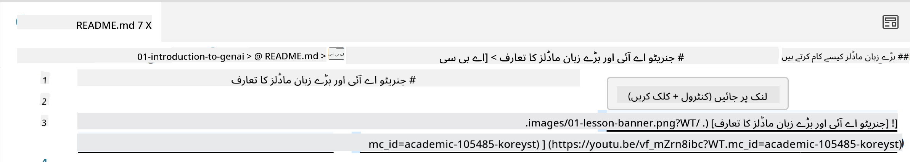
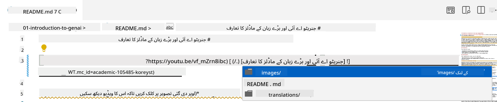
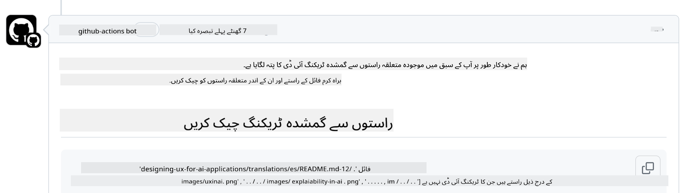
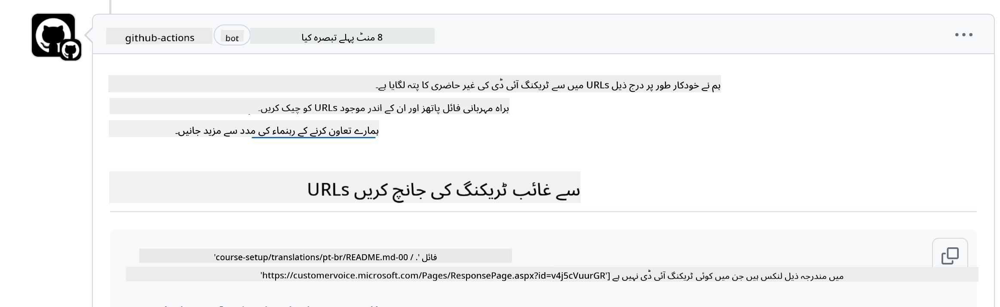
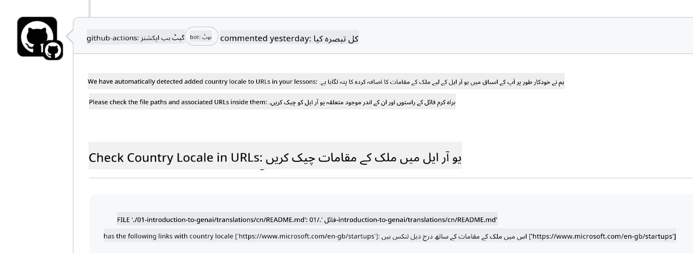

<!--
CO_OP_TRANSLATOR_METADATA:
{
  "original_hash": "57c41f2af71001a2cff9d8eb797cb843",
  "translation_date": "2025-05-19T11:10:39+00:00",
  "source_file": "CONTRIBUTING.md",
  "language_code": "ur"
}
-->
# تعاون

یہ پروجیکٹ تعاون اور تجاویز کا خیر مقدم کرتا ہے۔ زیادہ تر تعاون کے لیے آپ کو ایک کنٹریبیوٹر لائسنس معاہدے (CLA) سے اتفاق کرنا ہوگا، جو یہ ظاہر کرتا ہے کہ آپ کے پاس یہ حق ہے، اور آپ واقعی ہمیں اپنے تعاون کو استعمال کرنے کے حقوق دیتے ہیں۔ تفصیلات کے لیے <https://cla.microsoft.com> پر جائیں۔

> اہم: جب آپ اس ریپو میں متن کا ترجمہ کرتے ہیں، تو براہ کرم یقینی بنائیں کہ آپ مشینی ترجمہ استعمال نہیں کرتے۔ ہم کمیونٹی کے ذریعے ترجمے کی تصدیق کریں گے، لہذا براہ کرم صرف ان زبانوں میں ترجمے کے لیے رضاکار بنیں جن میں آپ ماہر ہیں۔

جب آپ ایک پل ریکویسٹ جمع کراتے ہیں، تو ایک CLA-بوٹ خود بخود یہ طے کرے گا کہ آیا آپ کو CLA فراہم کرنے کی ضرورت ہے اور PR کو مناسب طریقے سے سجائے گا (جیسے، لیبل، تبصرہ)۔ بس بوٹ کے فراہم کردہ ہدایات پر عمل کریں۔ آپ کو یہ صرف ایک بار کرنا ہوگا تمام ریپوزیٹریز میں جو ہمارے CLA کا استعمال کرتے ہیں۔

## ضابطہ اخلاق

اس پروجیکٹ نے [Microsoft Open Source Code of Conduct](https://opensource.microsoft.com/codeofconduct/?WT.mc_id=academic-105485-koreyst) کو اپنایا ہے۔
مزید معلومات کے لیے [Code of Conduct FAQ](https://opensource.microsoft.com/codeofconduct/faq/?WT.mc_id=academic-105485-koreyst) پڑھیں یا اضافی سوالات یا تبصرے کے ساتھ [opencode@microsoft.com](mailto:opencode@microsoft.com) سے رابطہ کریں۔

## سوال یا مسئلہ؟

براہ کرم عمومی معاونت کے سوالات کے لیے GitHub ایشوز نہ کھولیں کیونکہ GitHub کی فہرست کو خصوصیات کی درخواستوں اور بگ رپورٹس کے لیے استعمال کیا جانا چاہیے۔ اس طرح ہم کوڈ سے حقیقی مسائل یا بگز کو زیادہ آسانی سے ٹریک کر سکتے ہیں اور عمومی بحث کو حقیقی کوڈ سے الگ رکھ سکتے ہیں۔

## ٹائپوز، مسائل، بگز اور تعاون

جب بھی آپ جنریٹو AI فار بیگنرز ریپوزیٹری میں کوئی تبدیلی جمع کرائیں، براہ کرم ان سفارشات پر عمل کریں۔

* ہمیشہ اپنی ترمیمات کرنے سے پہلے ریپوزیٹری کو اپنے اکاؤنٹ میں فورک کریں
* متعدد تبدیلیوں کو ایک پل ریکویسٹ میں جمع نہ کریں۔ مثال کے طور پر، کسی بگ فکس اور دستاویزات کی اپ ڈیٹس کو الگ PRs میں جمع کرائیں
* اگر آپ کے پل ریکویسٹ میں مرج تنازعات ظاہر ہوتے ہیں، تو یقینی بنائیں کہ آپ کا مقامی مین اپ ڈیٹ ہو تاکہ وہ مین ریپوزیٹری میں موجود چیزوں کا آئینہ ہو اس سے پہلے کہ آپ اپنی ترمیمات کریں
* اگر آپ ترجمہ جمع کرا رہے ہیں، تو براہ کرم تمام ترجمہ شدہ فائلوں کے لیے ایک PR بنائیں کیونکہ ہم مواد کے لیے جزوی ترجمے قبول نہیں کرتے ہیں
* اگر آپ ٹائپو یا دستاویزات کی اصلاح جمع کر رہے ہیں، تو آپ موزوں جگہ پر ایک PR میں ترمیمات کو جمع کر سکتے ہیں

## لکھنے کے لیے عمومی رہنمائی

- یقینی بنائیں کہ آپ کے تمام URLs کو مربع بریکٹ میں لپیٹا گیا ہے جس کے بعد کوئی اضافی اسپیس کے بغیر یا اس کے اندر ایک پیرینتھیسس ہے ``۔
- یقینی بنائیں کہ کوئی بھی رشتہ دار لنک (یعنی ریپوزیٹری میں دیگر فائلوں اور فولڈرز کے لنکس) `./` سے شروع ہوتا ہے جو موجودہ ورکنگ ڈائریکٹری میں موجود فائل یا فولڈر کی طرف اشارہ کرتا ہے یا `../` جو پیرنٹ ورکنگ ڈائریکٹری میں موجود فائل یا فولڈر کی طرف اشارہ کرتا ہے۔
- یقینی بنائیں کہ کوئی بھی رشتہ دار لنک (یعنی ریپوزیٹری میں دیگر فائلوں اور فولڈرز کے لنکس) کے آخر میں ٹریکنگ ID ہے (یعنی `?` یا `&` پھر `wt.mc_id=` یا `WT.mc_id=`)۔
- یقینی بنائیں کہ مندرجہ ذیل ڈومینز _github.com, microsoft.com, visualstudio.com, aka.ms, اور azure.com_ کے کسی بھی URL کے آخر میں ٹریکنگ ID ہے (یعنی `?` یا `&` پھر `wt.mc_id=` یا `WT.mc_id=`)۔
- یقینی بنائیں کہ آپ کے لنکس میں ملک کی مخصوص لوکیل نہیں ہے (یعنی `/en-us/` یا `/en/`)۔
- یقینی بنائیں کہ تمام تصاویر `./images` فولڈر میں محفوظ ہیں۔
- یقینی بنائیں کہ تصاویر کے نام انگریزی حروف، نمبروں، اور ڈیشز کا استعمال کرتے ہوئے وضاحتی ہیں۔

## GitHub ورک فلو

جب آپ ایک پل ریکویسٹ جمع کراتے ہیں، تو چار مختلف ورک فلو شروع کیے جائیں گے تاکہ پچھلے قواعد کی توثیق کی جا سکے۔
بس یہاں درج ہدایات پر عمل کریں تاکہ ورک فلو چیکس کو پاس کریں۔

- [چیک بریکن رشتہ دار راستے](../..)
- [چیک راستوں میں ٹریکنگ ہے](../..)
- [چیک URLs میں ٹریکنگ ہے](../..)
- [چیک URLs میں لوکیل نہیں ہے](../..)

### چیک بریکن رشتہ دار راستے

یہ ورک فلو یقینی بناتا ہے کہ آپ کی فائلوں میں کوئی بھی رشتہ دار راستہ کام کر رہا ہے۔
یہ ریپوزیٹری GitHub پیجز پر تعینات ہے لہذا جب آپ لنکس لکھتے ہیں جو سب کچھ جوڑتے ہیں تو آپ کو بہت محتاط رہنے کی ضرورت ہے تاکہ کسی کو غلط جگہ پر نہ لے جائیں۔

یہ یقینی بنانے کے لیے کہ آپ کے لنکس صحیح کام کر رہے ہیں، بس VS کوڈ استعمال کریں تاکہ چیک کریں۔

مثال کے طور پر، جب آپ اپنی فائلوں میں کسی لنک پر ہور کرتے ہیں تو آپ کو **ctrl + click** پر کلک کر کے لنک کو فالو کرنے کا کہا جائے گا

اگر آپ لنک پر کلک کرتے ہیں اور یہ مقامی طور پر کام نہیں کر رہا ہے، تو یقیناً یہ ورک فلو کو متحرک کرے گا اور GitHub پر کام نہیں کرے گا۔

اس مسئلے کو حل کرنے کے لیے، VS کوڈ کی مدد سے لنک ٹائپ کرنے کی کوشش کریں۔

جب آپ `./` یا `../` ٹائپ کرتے ہیں تو VS کوڈ آپ کو دستیاب اختیارات میں سے انتخاب کرنے کی پرامپٹ کرے گا جو آپ نے ٹائپ کیا ہے۔

مطلوبہ فائل یا فولڈر پر کلک کر کے راستہ فالو کریں اور آپ کو یقین ہو جائے گا کہ آپ کا راستہ ٹوٹا ہوا نہیں ہے۔

ایک بار جب آپ صحیح رشتہ دار راستہ شامل کر لیں، محفوظ کریں، اور اپنی تبدیلیاں پش کریں، تو ورک فلو آپ کی تبدیلیوں کی تصدیق کے لیے دوبارہ متحرک ہو جائے گا۔
اگر آپ چیک پاس کر لیتے ہیں تو آپ اچھے ہیں۔

### چیک راستوں میں ٹریکنگ ہے

یہ ورک فلو یقینی بناتا ہے کہ کسی بھی رشتہ دار راستے میں ٹریکنگ موجود ہے۔
یہ ریپوزیٹری GitHub پیجز پر تعینات ہے لہذا ہمیں مختلف فائلوں اور فولڈرز کے درمیان حرکت کو ٹریک کرنے کی ضرورت ہے۔

یہ یقینی بنانے کے لیے کہ آپ کے رشتہ دار راستوں میں ٹریکنگ موجود ہے، بس راستے کے آخر میں درج ذیل متن `?wt.mc_id=` چیک کریں۔
اگر یہ آپ کے رشتہ دار راستوں میں شامل ہے تو آپ یہ چیک پاس کریں گے۔

اگر نہیں، تو آپ کو درج ذیل غلطی مل سکتی ہے۔

اس مسئلے کو حل کرنے کے لیے، وہ فائل راستہ کھولنے کی کوشش کریں جسے ورک فلو نے نمایاں کیا ہے اور رشتہ دار راستوں کے آخر میں ٹریکنگ ID شامل کریں۔

ایک بار جب آپ ٹریکنگ ID شامل کر لیں، محفوظ کریں، اور اپنی تبدیلیاں پش کریں، تو ورک فلو آپ کی تبدیلیوں کی تصدیق کے لیے دوبارہ متحرک ہو جائے گا۔
اگر آپ چیک پاس کر لیتے ہیں تو آپ اچھے ہیں۔

### چیک URLs میں ٹریکنگ ہے

یہ ورک فلو یقینی بناتا ہے کہ کسی بھی ویب URL میں ٹریکنگ موجود ہے۔
یہ ریپوزیٹری ہر کسی کے لیے دستیاب ہے لہذا آپ کو یہ یقینی بنانا ہوگا کہ رسائی کو ٹریک کریں تاکہ معلوم ہو سکے کہ ٹریفک کہاں سے آ رہا ہے۔

یہ یقینی بنانے کے لیے کہ آپ کے URLs میں ٹریکنگ موجود ہے، بس URL کے آخر میں درج ذیل متن `?wt.mc_id=` چیک کریں۔
اگر یہ آپ کے URLs میں شامل ہے تو آپ یہ چیک پاس کریں گے۔

اگر نہیں، تو آپ کو درج ذیل غلطی مل سکتی ہے۔

اس مسئلے کو حل کرنے کے لیے، وہ فائل راستہ کھولنے کی کوشش کریں جسے ورک فلو نے نمایاں کیا ہے اور URLs کے آخر میں ٹریکنگ ID شامل کریں۔

ایک بار جب آپ ٹریکنگ ID شامل کر لیں، محفوظ کریں، اور اپنی تبدیلیاں پش کریں، تو ورک فلو آپ کی تبدیلیوں کی تصدیق کے لیے دوبارہ متحرک ہو جائے گا۔
اگر آپ چیک پاس کر لیتے ہیں تو آپ اچھے ہیں۔

### چیک URLs میں لوکیل نہیں ہے

یہ ورک فلو یقینی بناتا ہے کہ کسی بھی ویب URL میں ملک کی مخصوص لوکیل موجود نہیں ہے۔
یہ ریپوزیٹری دنیا بھر میں ہر کسی کے لیے دستیاب ہے لہذا آپ کو یہ یقینی بنانا ہوگا کہ URLs میں اپنے ملک کی لوکیل شامل نہ کریں۔

یہ یقینی بنانے کے لیے کہ آپ کے URLs میں ملک کی لوکیل موجود نہیں ہے، بس URL میں کہیں بھی درج ذیل متن `/en-us/` یا `/en/` یا کسی دوسری زبان کی لوکیل چیک کریں۔
اگر یہ آپ کے URLs میں موجود نہیں ہے تو آپ یہ چیک پاس کریں گے۔

اگر نہیں، تو آپ کو درج ذیل غلطی مل سکتی ہے۔

اس مسئلے کو حل کرنے کے لیے، وہ فائل راستہ کھولنے کی کوشش کریں جسے ورک فلو نے نمایاں کیا ہے اور URLs سے ملک کی لوکیل کو ہٹا دیں۔

ایک بار جب آپ ملک کی لوکیل کو ہٹا دیں، محفوظ کریں، اور اپنی تبدیلیاں پش کریں، تو ورک فلو آپ کی تبدیلیوں کی تصدیق کے لیے دوبارہ متحرک ہو جائے گا۔
اگر آپ چیک پاس کر لیتے ہیں تو آپ اچھے ہیں۔

مبارک ہو! ہم جلد از جلد آپ کے تعاون کے بارے میں فیڈبیک کے ساتھ آپ سے رابطہ کریں گے۔

**ڈس کلیمر**:
یہ دستاویز AI ترجمہ سروس [Co-op Translator](https://github.com/Azure/co-op-translator) کا استعمال کرتے ہوئے ترجمہ کی گئی ہے۔ ہم درستگی کے لیے کوشش کرتے ہیں، لیکن براہ کرم آگاہ رہیں کہ خودکار ترجمے میں غلطیاں یا عدم درستگیاں ہو سکتی ہیں۔ اصل دستاویز کو اس کی اصل زبان میں مستند ذریعہ سمجھا جانا چاہیے۔ اہم معلومات کے لیے، پیشہ ور انسانی ترجمہ کی سفارش کی جاتی ہے۔ اس ترجمے کے استعمال سے پیدا ہونے والی کسی بھی غلط فہمی یا غلط تشریح کے لیے ہم ذمہ دار نہیں ہیں۔