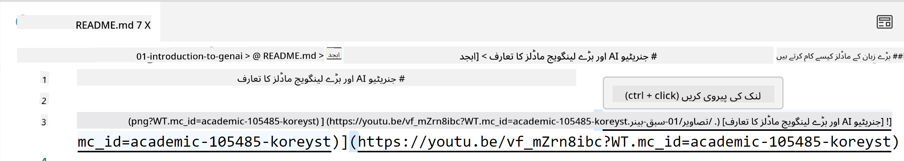
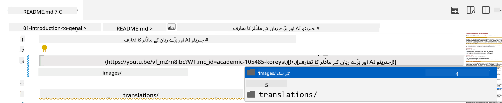
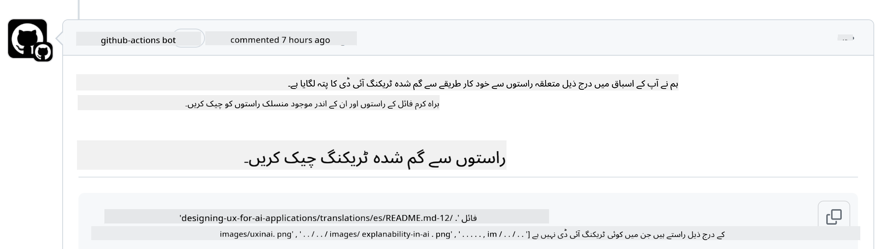
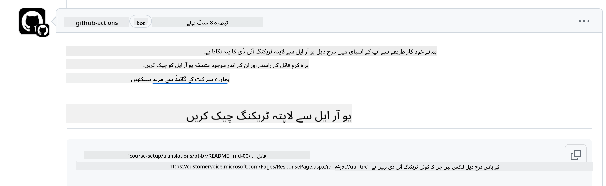
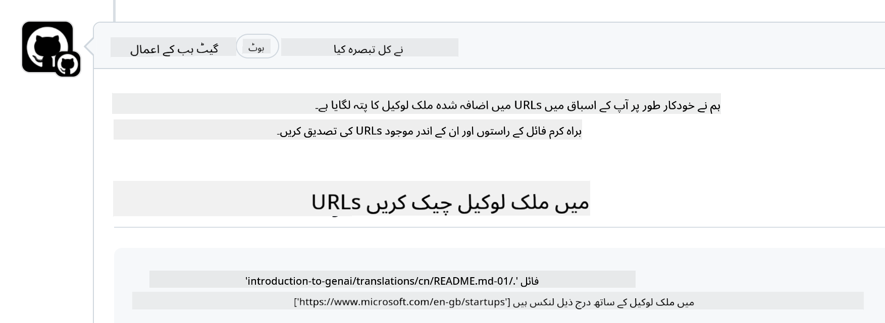

<!--
CO_OP_TRANSLATOR_METADATA:
{
  "original_hash": "57c41f2af71001a2cff9d8eb797cb843",
  "translation_date": "2025-06-25T07:01:28+00:00",
  "source_file": "CONTRIBUTING.md",
  "language_code": "ur"
}
-->
# شراکت

یہ پروجیکٹ شراکتوں اور تجاویز کا خیرمقدم کرتا ہے۔ زیادہ تر شراکتوں کے لئے آپ کو ایک کانٹریبیوٹر لائسنس معاہدے (CLA) سے اتفاق کرنے کی ضرورت ہوگی جو یہ اعلان کرتا ہے کہ آپ کو حق حاصل ہے، اور واقعی آپ ہمیں اپنی شراکت کے استعمال کے حقوق دینے کا حق رکھتے ہیں۔ تفصیلات کے لئے، <https://cla.microsoft.com> پر جائیں۔

> اہم: اس ریپو میں متن کا ترجمہ کرتے وقت، براہ کرم یقینی بنائیں کہ آپ مشین ترجمہ استعمال نہیں کر رہے ہیں۔ ہم ترجموں کی تصدیق کمیونٹی کے ذریعے کریں گے، لہذا براہ کرم صرف ان زبانوں میں ترجمہ کرنے کے لئے رضاکار بنیں جن میں آپ ماہر ہیں۔

جب آپ ایک پل ریکویسٹ جمع کراتے ہیں، تو ایک CLA بوٹ خود بخود یہ طے کرے گا کہ آیا آپ کو CLA فراہم کرنے کی ضرورت ہے اور PR کو مناسب طریقے سے سجائے گا (مثال کے طور پر، لیبل، تبصرہ)۔ بس بوٹ کی فراہم کردہ ہدایات پر عمل کریں۔ آپ کو یہ صرف ایک بار تمام ریپوزٹریز کے لئے کرنا ہوگا جو ہمارے CLA کا استعمال کرتے ہیں۔

## ضابطہ اخلاق

اس پروجیکٹ نے [Microsoft اوپن سورس ضابطہ اخلاق](https://opensource.microsoft.com/codeofconduct/?WT.mc_id=academic-105485-koreyst) کو اپنایا ہے۔ مزید معلومات کے لئے [ضابطہ اخلاق FAQ](https://opensource.microsoft.com/codeofconduct/faq/?WT.mc_id=academic-105485-koreyst) پڑھیں یا [opencode@microsoft.com](mailto:opencode@microsoft.com) سے رابطہ کریں کسی اضافی سوالات یا تبصرے کے لئے۔

## سوال یا مسئلہ؟

براہ کرم عمومی مدد کے سوالات کے لئے GitHub مسائل نہ کھولیں کیونکہ GitHub کی فہرست کو خصوصیت کی درخواستوں اور بگ رپورٹس کے لئے استعمال کیا جانا چاہئے۔ اس طرح ہم اصل مسائل یا بگز کو کوڈ سے آسانی سے ٹریک کر سکتے ہیں اور عمومی گفتگو کو اصل کوڈ سے الگ رکھ سکتے ہیں۔

## ٹائپوز، مسائل، بگز اور شراکتیں

جب بھی آپ "Generative AI for Beginners" ریپوزٹری میں کوئی تبدیلی جمع کرا رہے ہوں، براہ کرم ان سفارشات پر عمل کریں۔

* ہمیشہ اپنی ترامیم کرنے سے پہلے ریپوزٹری کو اپنے اکاؤنٹ میں فورک کریں
* ایک پل ریکویسٹ میں متعدد تبدیلیوں کو جمع نہ کریں۔ مثال کے طور پر، کسی بگ فکس اور دستاویزات کی تازہ کاریوں کو الگ PRs کے ذریعے جمع کریں
* اگر آپ کی پل ریکویسٹ میں مرج تنازعات دکھائی دیتے ہیں، تو یقینی بنائیں کہ آپ کا مقامی مین مین ریپوزٹری کے مین کا آئینہ ہے اس سے پہلے کہ آپ اپنی ترامیم کریں
* اگر آپ ترجمہ جمع کرا رہے ہیں، تو براہ کرم تمام ترجمہ شدہ فائلوں کے لئے ایک PR بنائیں کیونکہ ہم مواد کے لئے جزوی ترجمے قبول نہیں کرتے ہیں
* اگر آپ ٹائپو یا دستاویزات کی اصلاح جمع کرا رہے ہیں، تو آپ ایک PR میں مناسب جگہ پر ترامیم کو ملا سکتے ہیں

## لکھنے کے لئے عمومی رہنمائی

- یقینی بنائیں کہ آپ کے تمام URLs مربع بریکٹس میں لپٹے ہوئے ہیں اس کے بعد بریکٹ میں کوئی اضافی جگہ کے بغیر یا اندر ``۔
- یقینی بنائیں کہ کوئی بھی رشتہ دار لنک (یعنی ریپوزٹری میں دیگر فائلوں اور فولڈرز کے لنکس) ایک `./` سے شروع ہوتا ہے جو کہ موجودہ ورکنگ ڈائریکٹری میں واقع فائل یا فولڈر کی طرف اشارہ کرتا ہے یا ایک `../` جو کہ پیرنٹ ورکنگ ڈائریکٹری میں واقع فائل یا فولڈر کی طرف اشارہ کرتا ہے۔
- یقینی بنائیں کہ کوئی بھی رشتہ دار لنک (یعنی ریپوزٹری میں دیگر فائلوں اور فولڈرز کے لنکس) کے آخر میں ایک ٹریکنگ ID ہے (یعنی `?` یا `&` پھر `wt.mc_id=` یا `WT.mc_id=`)۔
- یقینی بنائیں کہ مندرجہ ذیل ڈومینز سے کوئی بھی URL _github.com, microsoft.com, visualstudio.com, aka.ms, اور azure.com_ کے آخر میں ایک ٹریکنگ ID ہے (یعنی `?` یا `&` پھر `wt.mc_id=` یا `WT.mc_id=`)۔
- یقینی بنائیں کہ آپ کے لنکس میں ملک کی مخصوص لوکیل نہیں ہے (یعنی `/en-us/` یا `/en/`)۔
- یقینی بنائیں کہ تمام تصاویر `./images` فولڈر میں محفوظ ہیں۔
- یقینی بنائیں کہ تصاویر کے نام انگریزی حروف، نمبروں، اور آپ کے تصویر کے نام میں ڈیشز کے ساتھ وضاحتی نام رکھتے ہیں۔

## GitHub ورک فلو

جب آپ ایک پل ریکویسٹ جمع کراتے ہیں، تو چار مختلف ورک فلو کو پہلے کے قواعد کی توثیق کرنے کے لئے متحرک کیا جائے گا۔ بس یہاں درج ہدایات پر عمل کریں تاکہ ورک فلو چیکس پاس کریں۔

- [چیک کریں ٹوٹے ہوئے رشتہ دار راستے](../..)
- [چیک کریں راستوں میں ٹریکنگ ہے](../..)
- [چیک کریں URLs میں ٹریکنگ ہے](../..)
- [چیک کریں URLs میں لوکیل نہیں ہے](../..)

### چیک کریں ٹوٹے ہوئے رشتہ دار راستے

یہ ورک فلو یقینی بناتا ہے کہ آپ کی فائلوں میں کوئی بھی رشتہ دار راستہ کام کر رہا ہے۔ یہ ریپوزٹری GitHub صفحات پر تعینات ہے لہذا جب آپ لنکس ٹائپ کرتے ہیں جو سب کو جوڑتا ہے تو بہت محتاط رہنے کی ضرورت ہے تاکہ کسی کو غلط جگہ پر نہ لے جائے۔

یقینی بنانے کے لئے کہ آپ کے لنکس صحیح طریقے سے کام کر رہے ہیں، بس VS کوڈ کا استعمال کریں تاکہ اس کی جانچ کریں۔

مثال کے طور پر، جب آپ اپنی فائلوں میں کسی لنک پر ہور کرتے ہیں تو آپ کو **ctrl + click** پر کلک کر کے لنک کو فالو کرنے کی ہدایت دی جائے گی۔

اگر آپ کسی لنک پر کلک کرتے ہیں اور یہ مقامی طور پر کام نہیں کر رہا ہے تو، یقیناً یہ ورک فلو کو متحرک کرے گا اور GitHub پر کام نہیں کرے گا۔

اس مسئلے کو حل کرنے کے لئے، کوشش کریں کہ لنک کو VS کوڈ کی مدد سے ٹائپ کریں۔

جب آپ `./` یا `../` ٹائپ کرتے ہیں تو VS کوڈ آپ کو دستیاب اختیارات میں سے انتخاب کرنے کی ترغیب دے گا جو آپ نے ٹائپ کیا ہے۔

مطلوبہ فائل یا فولڈر پر کلک کر کے راستہ فالو کریں اور آپ کو یقین ہو جائے گا کہ آپ کا راستہ ٹوٹا ہوا نہیں ہے۔

ایک بار جب آپ صحیح رشتہ دار راستہ شامل کر لیں، تو اپنی تبدیلیاں محفوظ کریں اور پش کریں، ورک فلو آپ کی تبدیلیوں کی تصدیق کے لئے دوبارہ متحرک ہو جائے گا۔ اگر آپ چیک پاس کر لیتے ہیں تو آپ کو جانے کے لئے تیار ہیں۔

### چیک کریں راستوں میں ٹریکنگ ہے

یہ ورک فلو یقینی بناتا ہے کہ کسی بھی رشتہ دار راستے میں ٹریکنگ ہے۔ یہ ریپوزٹری GitHub صفحات پر تعینات ہے لہذا ہمیں مختلف فائلوں اور فولڈرز کے درمیان حرکت کو ٹریک کرنے کی ضرورت ہے۔

یقینی بنانے کے لئے کہ آپ کے رشتہ دار راستوں میں ٹریکنگ ہے، بس درج ذیل متن `?wt.mc_id=` راستے کے آخر میں چیک کریں۔ اگر یہ آپ کے رشتہ دار راستوں میں شامل ہے تو آپ یہ چیک پاس کریں گے۔

اگر نہیں، تو آپ کو مندرجہ ذیل غلطی مل سکتی ہے۔

اس مسئلے کو حل کرنے کے لئے، کوشش کریں کہ ورک فلو نے جس فائل کا راستہ نمایاں کیا ہے اسے کھولیں اور رشتہ دار راستوں کے آخر میں ٹریکنگ ID شامل کریں۔

ایک بار جب آپ ٹریکنگ ID شامل کر لیں، تو اپنی تبدیلیاں محفوظ کریں اور پش کریں، ورک فلو آپ کی تبدیلیوں کی تصدیق کے لئے دوبارہ متحرک ہو جائے گا۔ اگر آپ چیک پاس کر لیتے ہیں تو آپ کو جانے کے لئے تیار ہیں۔

### چیک کریں URLs میں ٹریکنگ ہے

یہ ورک فلو یقینی بناتا ہے کہ کسی بھی ویب URL میں ٹریکنگ ہے۔ یہ ریپوزٹری سب کے لئے دستیاب ہے لہذا آپ کو یہ یقینی بنانا ہوگا کہ رسائی کو ٹریک کریں تاکہ معلوم ہو سکے کہ ٹریفک کہاں سے آ رہا ہے۔

یقینی بنانے کے لئے کہ آپ کے URLs میں ٹریکنگ ہے، بس درج ذیل متن `?wt.mc_id=` URL کے آخر میں چیک کریں۔ اگر یہ آپ کے URLs میں شامل ہے تو آپ یہ چیک پاس کریں گے۔

اگر نہیں، تو آپ کو مندرجہ ذیل غلطی مل سکتی ہے۔

اس مسئلے کو حل کرنے کے لئے، کوشش کریں کہ ورک فلو نے جس فائل کا راستہ نمایاں کیا ہے اسے کھولیں اور URLs کے آخر میں ٹریکنگ ID شامل کریں۔

ایک بار جب آپ ٹریکنگ ID شامل کر لیں، تو اپنی تبدیلیاں محفوظ کریں اور پش کریں، ورک فلو آپ کی تبدیلیوں کی تصدیق کے لئے دوبارہ متحرک ہو جائے گا۔ اگر آپ چیک پاس کر لیتے ہیں تو آپ کو جانے کے لئے تیار ہیں۔

### چیک کریں URLs میں لوکیل نہیں ہے

یہ ورک فلو یقینی بناتا ہے کہ کسی بھی ویب URL میں ملک کی مخصوص لوکیل نہیں ہے۔ یہ ریپوزٹری دنیا بھر میں سب کے لئے دستیاب ہے لہذا آپ کو یہ یقینی بنانا ہوگا کہ URLs میں اپنے ملک کی لوکیل شامل نہ کریں۔

یقینی بنانے کے لئے کہ آپ کے URLs میں ملک کی لوکیل نہیں ہے، بس درج ذیل متن `/en-us/` یا `/en/` یا کسی اور زبان کی لوکیل کو URL میں کہیں بھی چیک کریں۔ اگر یہ آپ کے URLs میں موجود نہیں ہے تو آپ یہ چیک پاس کریں گے۔

اگر نہیں، تو آپ کو مندرجہ ذیل غلطی مل سکتی ہے۔

اس مسئلے کو حل کرنے کے لئے، کوشش کریں کہ ورک فلو نے جس فائل کا راستہ نمایاں کیا ہے اسے کھولیں اور URLs سے ملک کی لوکیل ہٹا دیں۔

ایک بار جب آپ ملک کی لوکیل ہٹا دیں، تو اپنی تبدیلیاں محفوظ کریں اور پش کریں، ورک فلو آپ کی تبدیلیوں کی تصدیق کے لئے دوبارہ متحرک ہو جائے گا۔ اگر آپ چیک پاس کر لیتے ہیں تو آپ کو جانے کے لئے تیار ہیں۔

مبارک ہو! ہم آپ کی شراکت کے بارے میں جلد از جلد رائے کے ساتھ واپس آئیں گے۔

**ڈسکلیمر**:  
یہ دستاویز AI ترجمہ سروس [Co-op Translator](https://github.com/Azure/co-op-translator) کا استعمال کرتے ہوئے ترجمہ کی گئی ہے۔ ہم درستگی کے لئے کوشش کرتے ہیں، لیکن براہ کرم آگاہ رہیں کہ خودکار ترجمے میں غلطیاں یا نقائص ہو سکتے ہیں۔ اصل دستاویز کو اس کی مقامی زبان میں مستند ماخذ سمجھا جانا چاہئے۔ اہم معلومات کے لئے، پیشہ ورانہ انسانی ترجمہ کی سفارش کی جاتی ہے۔ ہم اس ترجمہ کے استعمال سے پیدا ہونے والی کسی بھی غلط فہمی یا غلط تشریح کے ذمہ دار نہیں ہیں۔