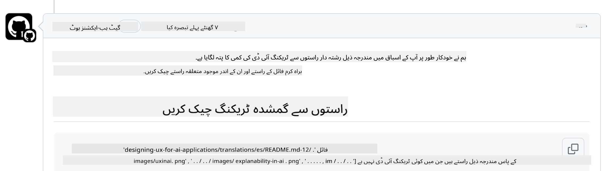
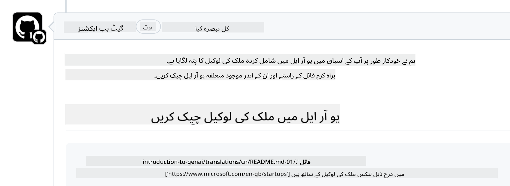

<!--
CO_OP_TRANSLATOR_METADATA:
{
  "original_hash": "57c41f2af71001a2cff9d8eb797cb843",
  "translation_date": "2025-07-09T05:49:14+00:00",
  "source_file": "CONTRIBUTING.md",
  "language_code": "ur"
}
-->
# تعاون کرنا

یہ پروجیکٹ تعاون اور تجاویز کا خیرمقدم کرتا ہے۔ زیادہ تر تعاون کے لیے آپ کو ایک Contributor License Agreement (CLA) سے اتفاق کرنا ہوگا جس میں آپ یہ اعلان کرتے ہیں کہ آپ کے پاس اپنے تعاون کے استعمال کے حقوق دینے کا حق ہے اور آپ واقعی ہمیں یہ حقوق دے رہے ہیں۔ تفصیلات کے لیے ملاحظہ کریں  
<https://cla.microsoft.com>۔

> اہم: جب آپ اس ریپوزٹری میں متن کا ترجمہ کریں تو براہ کرم مشین ترجمہ استعمال نہ کریں۔ ہم ترجموں کی تصدیق کمیونٹی کے ذریعے کریں گے، لہٰذا صرف ان زبانوں میں ترجمہ کے لیے رضاکار بنیں جن میں آپ ماہر ہوں۔

جب آپ pull request جمع کروائیں گے، تو CLA-bot خود بخود یہ تعین کرے گا کہ آیا آپ کو CLA فراہم کرنا ہے اور PR کو مناسب طریقے سے نشان زد کرے گا (مثلاً، لیبل، تبصرہ)۔ بس bot کی ہدایات پر عمل کریں۔ آپ کو یہ عمل تمام ریپوزٹریز میں صرف ایک بار کرنا ہوگا جو ہمارے CLA استعمال کرتی ہیں۔

## رویے کا ضابطہ

اس پروجیکٹ نے [Microsoft Open Source Code of Conduct](https://opensource.microsoft.com/codeofconduct/?WT.mc_id=academic-105485-koreyst) کو اپنایا ہے۔  
مزید معلومات کے لیے [Code of Conduct FAQ](https://opensource.microsoft.com/codeofconduct/faq/?WT.mc_id=academic-105485-koreyst) پڑھیں یا کسی اضافی سوال یا تبصرے کے لیے [opencode@microsoft.com](mailto:opencode@microsoft.com) سے رابطہ کریں۔

## سوال یا مسئلہ؟

براہ کرم عمومی سپورٹ سوالات کے لیے GitHub issues نہ کھولیں کیونکہ GitHub کی فہرست فیچر کی درخواستوں اور بگ رپورٹس کے لیے استعمال ہونی چاہیے۔ اس طرح ہم اصل مسائل یا بگز کو آسانی سے ٹریک کر سکیں گے اور عمومی گفتگو کو اصل کوڈ سے الگ رکھ سکیں گے۔

## ٹائپوز، مسائل، بگز اور تعاون

جب بھی آپ Generative AI for Beginners ریپوزٹری میں کوئی تبدیلیاں جمع کروائیں، تو براہ کرم درج ذیل سفارشات پر عمل کریں۔

* اپنی تبدیلیاں کرنے سے پہلے ہمیشہ ریپوزٹری کو اپنے اکاؤنٹ میں فورک کریں  
* متعدد تبدیلیوں کو ایک pull request میں یکجا نہ کریں۔ مثلاً، کسی بگ فکس اور دستاویزات کی اپ ڈیٹس کو الگ الگ PRs کے ذریعے جمع کروائیں  
* اگر آپ کے pull request میں merge conflicts دکھائی دیں، تو اپنی لوکل main کو مرکزی ریپوزٹری کے main کی عکاسی بنائیں اور پھر تبدیلیاں کریں  
* اگر آپ ترجمہ جمع کروا رہے ہیں، تو تمام ترجمہ شدہ فائلوں کے لیے ایک ہی PR بنائیں کیونکہ ہم مواد کے جزوی ترجمے قبول نہیں کرتے  
* اگر آپ ٹائپوز یا دستاویزات کی اصلاح جمع کروا رہے ہیں، تو جہاں مناسب ہو، تبدیلیوں کو ایک PR میں یکجا کر سکتے ہیں  

## تحریر کے لیے عمومی رہنمائی

- یقینی بنائیں کہ آپ کے تمام URLs مربع بریکٹس میں ہوں جن کے بعد قوسین ہوں، اور ان کے اندر یا باہر اضافی جگہ نہ ہو ``۔  
- یقینی بنائیں کہ کوئی بھی نسبتی لنک (یعنی ریپوزٹری میں دیگر فائلوں اور فولڈرز کے لنکس) `./` سے شروع ہو جو موجودہ ورکنگ ڈائریکٹری میں فائل یا فولڈر کی طرف اشارہ کرتا ہے یا `../` سے شروع ہو جو والدین ورکنگ ڈائریکٹری میں فائل یا فولڈر کی طرف اشارہ کرتا ہے۔  
- یقینی بنائیں کہ کوئی بھی نسبتی لنک کے آخر میں ٹریکنگ ID ہو (یعنی `?` یا `&` کے بعد `wt.mc_id=` یا `WT.mc_id=`)۔  
- یقینی بنائیں کہ درج ذیل ڈومینز سے کوئی بھی URL _github.com, microsoft.com, visualstudio.com, aka.ms, اور azure.com_ کے آخر میں ٹریکنگ ID ہو۔  
- یقینی بنائیں کہ آپ کے لنکس میں ملک مخصوص لوکیل نہ ہو (مثلاً `/en-us/` یا `/en/`)۔  
- یقینی بنائیں کہ تمام تصاویر `./images` فولڈر میں محفوظ ہوں۔  
- یقینی بنائیں کہ تصاویر کے نام انگریزی حروف، اعداد، اور ڈیشز پر مشتمل ہوں اور وضاحتی ہوں۔  

## GitHub ورک فلو

جب آپ pull request جمع کروائیں گے، تو چار مختلف ورک فلو پچھلے قواعد کی تصدیق کے لیے چلیں گے۔  
بس یہاں دی گئی ہدایات پر عمل کریں تاکہ ورک فلو چیکس پاس ہو سکیں۔

- [Check Broken Relative Paths](../..)  
- [Check Paths Have Tracking](../..)  
- [Check URLs Have Tracking](../..)  
- [Check URLs Don't Have Locale](../..)  

### Check Broken Relative Paths

یہ ورک فلو یقینی بناتا ہے کہ آپ کی فائلوں میں کوئی بھی نسبتی راستہ کام کر رہا ہو۔  
یہ ریپوزٹری GitHub pages پر تعینات ہے، اس لیے لنکس ٹائپ کرتے وقت بہت محتاط رہیں تاکہ کوئی بھی غلط جگہ پر نہ جائے۔

اپنے لنکس کی درستگی جانچنے کے لیے بس VS code استعمال کریں۔

مثال کے طور پر، جب آپ اپنی فائلوں میں کسی لنک پر hover کریں گے تو آپ کو لنک پر جانے کے لیے **ctrl + click** دبانے کا اشارہ ملے گا۔

اگر آپ کسی لنک پر کلک کریں اور وہ لوکل طور پر کام نہ کرے، تو یقیناً ورک فلو بھی اسے ناکام قرار دے گا اور GitHub پر بھی کام نہیں کرے گا۔

اس مسئلے کو حل کرنے کے لیے VS code کی مدد سے لنک ٹائپ کریں۔

جب آپ `./` یا `../` ٹائپ کریں گے تو VS code آپ کو دستیاب آپشنز میں سے انتخاب کرنے کا اشارہ دے گا۔

مطلوبہ فائل یا فولڈر پر کلک کر کے راستہ منتخب کریں تاکہ آپ کو یقین ہو کہ آپ کا راستہ ٹوٹا ہوا نہیں ہے۔

صحیح نسبتی راستہ شامل کرنے، محفوظ کرنے، اور تبدیلیاں push کرنے کے بعد ورک فلو دوبارہ چلے گا تاکہ آپ کی تبدیلیوں کی تصدیق کرے۔  
اگر آپ چیک پاس کر لیتے ہیں تو آپ تیار ہیں۔

### Check Paths Have Tracking

یہ ورک فلو یقینی بناتا ہے کہ کوئی بھی نسبتی راستہ ٹریکنگ رکھتا ہو۔  
یہ ریپوزٹری GitHub pages پر تعینات ہے، اس لیے ہمیں مختلف فائلوں اور فولڈرز کے درمیان حرکت کو ٹریک کرنا ضروری ہے۔

اپنے نسبتی راستوں میں ٹریکنگ کی موجودگی جانچنے کے لیے بس راستے کے آخر میں `?wt.mc_id=` تلاش کریں۔  
اگر یہ آپ کے نسبتی راستوں کے آخر میں موجود ہے تو آپ یہ چیک پاس کر جائیں گے۔

اگر نہیں، تو آپ کو درج ذیل غلطی مل سکتی ہے۔

اس مسئلے کو حل کرنے کے لیے، ورک فلو نے جس فائل کے راستے کو ہائی لائٹ کیا ہے اسے کھولیں اور نسبتی راستوں کے آخر میں ٹریکنگ ID شامل کریں۔

ٹریکنگ ID شامل کرنے، محفوظ کرنے، اور تبدیلیاں push کرنے کے بعد ورک فلو دوبارہ چلے گا تاکہ آپ کی تبدیلیوں کی تصدیق کرے۔  
اگر آپ چیک پاس کر لیتے ہیں تو آپ تیار ہیں۔

### Check URLs Have Tracking

یہ ورک فلو یقینی بناتا ہے کہ کوئی بھی ویب URL ٹریکنگ رکھتا ہو۔  
یہ ریپوزٹری سب کے لیے دستیاب ہے، اس لیے آپ کو ٹریفک کے ماخذ کو جاننے کے لیے رسائی کو ٹریک کرنا ضروری ہے۔

اپنے URLs میں ٹریکنگ کی موجودگی جانچنے کے لیے بس URL کے آخر میں `?wt.mc_id=` تلاش کریں۔  
اگر یہ آپ کے URLs کے آخر میں موجود ہے تو آپ یہ چیک پاس کر جائیں گے۔

اگر نہیں، تو آپ کو درج ذیل غلطی مل سکتی ہے۔

اس مسئلے کو حل کرنے کے لیے، ورک فلو نے جس فائل کے راستے کو ہائی لائٹ کیا ہے اسے کھولیں اور URLs کے آخر میں ٹریکنگ ID شامل کریں۔

ٹریکنگ ID شامل کرنے، محفوظ کرنے، اور تبدیلیاں push کرنے کے بعد ورک فلو دوبارہ چلے گا تاکہ آپ کی تبدیلیوں کی تصدیق کرے۔  
اگر آپ چیک پاس کر لیتے ہیں تو آپ تیار ہیں۔

### Check URLs Don't Have Locale

یہ ورک فلو یقینی بناتا ہے کہ کوئی بھی ویب URL ملک مخصوص لوکیل نہ رکھتا ہو۔  
یہ ریپوزٹری دنیا بھر کے لیے دستیاب ہے، اس لیے آپ کو URLs میں اپنے ملک کا لوکیل شامل نہ کرنے کا خیال رکھنا ہوگا۔

اپنے URLs میں ملک کا لوکیل نہ ہونے کی جانچ کے لیے بس URL میں کہیں بھی `/en-us/` یا `/en/` یا کوئی اور زبان کا لوکیل تلاش کریں۔  
اگر یہ آپ کے URLs میں موجود نہیں ہے تو آپ یہ چیک پاس کر جائیں گے۔

اگر موجود ہو، تو آپ کو درج ذیل غلطی مل سکتی ہے۔

اس مسئلے کو حل کرنے کے لیے، ورک فلو نے جس فائل کے راستے کو ہائی لائٹ کیا ہے اسے کھولیں اور URLs سے ملک کا لوکیل ہٹا دیں۔

ملک کا لوکیل ہٹانے، محفوظ کرنے، اور تبدیلیاں push کرنے کے بعد ورک فلو دوبارہ چلے گا تاکہ آپ کی تبدیلیوں کی تصدیق کرے۔  
اگر آپ چیک پاس کر لیتے ہیں تو آپ تیار ہیں۔

مبارک ہو! ہم جلد از جلد آپ کے تعاون کے بارے میں فیڈبیک کے ساتھ آپ سے رابطہ کریں گے۔

**دستخطی نوٹ**:  
یہ دستاویز AI ترجمہ سروس [Co-op Translator](https://github.com/Azure/co-op-translator) کے ذریعے ترجمہ کی گئی ہے۔ اگرچہ ہم درستگی کے لیے کوشاں ہیں، براہ کرم آگاہ رہیں کہ خودکار ترجمے میں غلطیاں یا عدم درستیاں ہو سکتی ہیں۔ اصل دستاویز اپنی مادری زبان میں ہی معتبر ماخذ سمجھی جانی چاہیے۔ اہم معلومات کے لیے پیشہ ور انسانی ترجمہ کی سفارش کی جاتی ہے۔ اس ترجمے کے استعمال سے پیدا ہونے والی کسی بھی غلط فہمی یا غلط تشریح کی ذمہ داری ہم پر عائد نہیں ہوتی۔