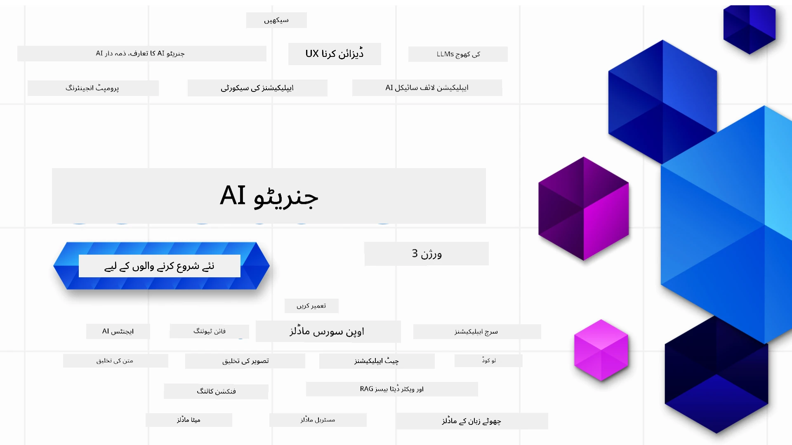

### 21 اسباق جو آپ کو جنریٹو اے آئی ایپلیکیشنز بنانے کے لیے درکار تمام معلومات سکھاتے ہیں

[](https://github.com/microsoft/Generative-AI-For-Beginners/blob/master/LICENSE?WT.mc_id=academic-105485-koreyst)
[](https://GitHub.com/microsoft/Generative-AI-For-Beginners/graphs/contributors/?WT.mc_id=academic-105485-koreyst)
[](https://GitHub.com/microsoft/Generative-AI-For-Beginners/issues/?WT.mc_id=academic-105485-koreyst)
[](https://GitHub.com/microsoft/Generative-AI-For-Beginners/pulls/?WT.mc_id=academic-105485-koreyst)
[](http://makeapullrequest.com?WT.mc_id=academic-105485-koreyst)

[](https://GitHub.com/microsoft/Generative-AI-For-Beginners/watchers/?WT.mc_id=academic-105485-koreyst)
[](https://GitHub.com/microsoft/Generative-AI-For-Beginners/network/?WT.mc_id=academic-105485-koreyst)
[](https://GitHub.com/microsoft/Generative-AI-For-Beginners/stargazers/?WT.mc_id=academic-105485-koreyst)

[](https://discord.gg/nTYy5BXMWG)

### 🌐 کثیراللسانی سپورٹ

#### GitHub ایکشن کے ذریعے سپورٹ شدہ (خودکار اور ہمیشہ اپ ٹو ڈیٹ)

<!-- CO-OP TRANSLATOR LANGUAGES TABLE START -->
[Arabic](../ar/README.md) | [Bengali](../bn/README.md) | [Bulgarian](../bg/README.md) | [Burmese (Myanmar)](../my/README.md) | [Chinese (Simplified)](../zh-CN/README.md) | [Chinese (Traditional, Hong Kong)](../zh-HK/README.md) | [Chinese (Traditional, Macau)](../zh-MO/README.md) | [Chinese (Traditional, Taiwan)](../zh-TW/README.md) | [Croatian](../hr/README.md) | [Czech](../cs/README.md) | [Danish](../da/README.md) | [Dutch](../nl/README.md) | [Estonian](../et/README.md) | [Finnish](../fi/README.md) | [French](../fr/README.md) | [German](../de/README.md) | [Greek](../el/README.md) | [Hebrew](../he/README.md) | [Hindi](../hi/README.md) | [Hungarian](../hu/README.md) | [Indonesian](../id/README.md) | [Italian](../it/README.md) | [Japanese](../ja/README.md) | [Kannada](../kn/README.md) | [Korean](../ko/README.md) | [Lithuanian](../lt/README.md) | [Malay](../ms/README.md) | [Malayalam](../ml/README.md) | [Marathi](../mr/README.md) | [Nepali](../ne/README.md) | [Nigerian Pidgin](../pcm/README.md) | [Norwegian](../no/README.md) | [Persian (Farsi)](../fa/README.md) | [Polish](../pl/README.md) | [Portuguese (Brazil)](../pt-BR/README.md) | [Portuguese (Portugal)](../pt-PT/README.md) | [Punjabi (Gurmukhi)](../pa/README.md) | [Romanian](../ro/README.md) | [Russian](../ru/README.md) | [Serbian (Cyrillic)](../sr/README.md) | [Slovak](../sk/README.md) | [Slovenian](../sl/README.md) | [Spanish](../es/README.md) | [Swahili](../sw/README.md) | [Swedish](../sv/README.md) | [Tagalog (Filipino)](../tl/README.md) | [Tamil](../ta/README.md) | [Telugu](../te/README.md) | [Thai](../th/README.md) | [Turkish](../tr/README.md) | [Ukrainian](../uk/README.md) | [Urdu](./README.md) | [Vietnamese](../vi/README.md)

> **مقامی طور پر کلون کرنا پسند کریں؟**
>
> اس ریپوزٹری میں 50+ زبانوں کے تراجم شامل ہیں جو ڈاؤن لوڈ کے حجم کو نمایاں طور پر بڑھاتے ہیں۔ بغیر تراجم کے کلون کرنے کے لیے اسپارس چیک آؤٹ استعمال کریں:
>
> **Bash / macOS / Linux:**
> ```bash
> git clone --filter=blob:none --sparse https://github.com/microsoft/generative-ai-for-beginners.git
> cd generative-ai-for-beginners
> git sparse-checkout set --no-cone '/*' '!translations' '!translated_images'
> ```
>
> **CMD (Windows):**
> ```cmd
> git clone --filter=blob:none --sparse https://github.com/microsoft/generative-ai-for-beginners.git
> cd generative-ai-for-beginners
> git sparse-checkout set --no-cone "/*" "!translations" "!translated_images"
> ```
>
> یہ آپ کو کورس مکمل کرنے کے لیے درکار تمام مواد فراہم کرتا ہے اور ڈاؤن لوڈ زیادہ تیز ہوتا ہے۔
<!-- CO-OP TRANSLATOR LANGUAGES TABLE END -->

# ابتدائیوں کے لیے جنریٹو اے آئی (ورژن 3) - ایک کورس

مائیکروسافٹ کلاؤڈ ایڈووکیٹس کی جانب سے 21 اسباق پر مشتمل جامع کورس کے ذریعے جنریٹو اے آئی ایپلیکیشنز بنانے کے بنیادی اصول سیکھیں۔

## 🌱 شروع کرتے ہیں

اس کورس میں 21 اسباق ہیں۔ ہر سبق اپنا موضوع بیان کرتا ہے لہذا جہاں چاہیں وہاں سے شروع کریں!

اسباق کو یا تو "سیکھیں" اسباق کے طور پر لیبل کیا گیا ہے جو جنریٹو اے آئی کے تصورات کی وضاحت کرتے ہیں یا "بنائیں" اسباق کے طور پر جو ایک تصور کی وضاحت کرتے ہیں اور ممکن ہو تو **Python** اور **TypeScript** میں کوڈ کے مثالیں فراہم کرتے ہیں۔

.NET ڈویلپرز کے لیے [جنریٹو اے آئی برائے ابتدائیان (.NET ایڈیشن)](https://github.com/microsoft/Generative-AI-for-beginners-dotnet?WT.mc_id=academic-105485-koreyst) دیکھیں!

ہر سبق میں اضافی سیکھنے کے اوزار کے ساتھ "مزید سیکھتے رہیں" کا سیکشن بھی شامل ہے۔

## آپ کو کیا چاہیے
### اس کورس کا کوڈ چلانے کے لیے، آپ درج ذیل میں سے کوئی ایک استعمال کر سکتے ہیں:
 - [Azure OpenAI Service](https://aka.ms/genai-beginners/azure-open-ai?WT.mc_id=academic-105485-koreyst) - **اسباق:** "aoai-assignment"
 - [GitHub Marketplace Model Catalog](https://aka.ms/genai-beginners/gh-models?WT.mc_id=academic-105485-koreyst) - **اسباق:** "githubmodels"
 - [OpenAI API](https://aka.ms/genai-beginners/open-ai?WT.mc_id=academic-105485-koreyst) - **اسباق:** "oai-assignment" 
   
- Python یا TypeScript کی بنیادی معلومات مددگار ثابت ہوتی ہے - \*مکمل ابتدائیوں کے لیے یہ [Python](https://aka.ms/genai-beginners/python?WT.mc_id=academic-105485-koreyst) اور [TypeScript](https://aka.ms/genai-beginners/typescript?WT.mc_id=academic-105485-koreyst) کورسز دیکھیں
- اپنا ایک GitHub اکاؤنٹ تاکہ آپ اس پورے ریپوزٹری کو [اپنے GitHub اکاؤنٹ میں فورک کر سکیں](https://aka.ms/genai-beginners/github?WT.mc_id=academic-105485-koreyst)

ہم نے آپ کی ڈویلپمنٹ ماحول کی سیٹنگ میں مدد کے لیے ایک **[کورس سیٹ اپ](./00-course-setup/README.md?WT.mc_id=academic-105485-koreyst)** سبق بنایا ہے۔

بعد میں آسانی سے تلاش کرنے کے لیے [اس ریپوزٹری کو اسٹار (🌟) کرنا نہ بھولیں](https://docs.github.com/en/get-started/exploring-projects-on-github/saving-repositories-with-stars?WT.mc_id=academic-105485-koreyst)۔

## 🧠 تعیناتی کے لیے تیار؟

اگر آپ مزید جدید کوڈ کے نمونے تلاش کر رہے ہیں تو ہمارے [جنریٹو اے آئی کوڈ نمونوں کے مجموعے](https://aka.ms/genai-beg-code?WT.mc_id=academic-105485-koreyst) کو دیکھیں جو دونوں **Python** اور **TypeScript** میں دستیاب ہیں۔

## 🗣️ دوسرے سیکھنے والوں سے ملیں، مدد پائیں

ہمارے [سرکاری Azure AI Foundry Discord سرور](https://aka.ms/genai-discord?WT.mc_id=academic-105485-koreyst) میں شامل ہوں تاکہ اس کورس میں شامل دیگر سیکھنے والوں سے مل سکیں اور مدد حاصل کر سکیں۔

سوالات پوچھیں یا ہماری [Azure AI Foundry Developer Forum](https://aka.ms/azureaifoundry/forum) پر GitHub پر مصنوعات کا تاثرات شئیر کریں۔

## 🚀 ایک اسٹارٹ اپ بنا رہے ہیں؟

آج ہی Azure کریڈٹس کے ساتھ شروع کرنے کے لیے [Microsoft for Startups](https://www.microsoft.com/startups) پر جائیں۔

## 🙏 مدد کرنا چاہتے ہیں؟

کیا آپ کے پاس تجاویز ہیں یا کوئی املا یا کوڈ کی غلطیاں ملی ہیں؟ [مسئلہ اٹھائیں](https://github.com/microsoft/generative-ai-for-beginners/issues?WT.mc_id=academic-105485-koreyst) یا [پُل ریکویسٹ بنائیں](https://github.com/microsoft/generative-ai-for-beginners/pulls?WT.mc_id=academic-105485-koreyst)

## 📂 ہر سبق میں شامل ہے:

- موضوع کا ایک مختصر ویڈیو تعارف
- README میں تحریری سبق
- Python اور TypeScript کے کوڈ کے نمونے جو Azure OpenAI اور OpenAI API کی حمایت کرتے ہیں
- اضافی وسائل کے لنکس تاکہ آپ اپنی تعلیم جاری رکھ سکیں

## 🗃️ اسباق

| #   | **سبق کا لنک**                                                                                                                               | **تفصیل**                                                                                      | **ویڈیو**                                                                  | **اضافی تعلیم**                                                              |
| --- | -------------------------------------------------------------------------------------------------------------------------------------------- | ---------------------------------------------------------------------------------------------- | -------------------------------------------------------------------------- | ----------------------------------------------------------------------------- |
| 00  | [کورس سیٹ اپ](./00-course-setup/README.md?WT.mc_id=academic-105485-koreyst)                                                                   | **سیکھیں:** اپنا ڈویلپمنٹ ماحول کیسے سیٹ اپ کریں                                              | ویڈیو جلد آ رہا ہے                                                         | [مزید جانیں](https://aka.ms/genai-collection?WT.mc_id=academic-105485-koreyst) |
| 01  | [جنریٹو اے آئی اور بڑے زبان ماڈلز کا تعارف](./01-introduction-to-genai/README.md?WT.mc_id=academic-105485-koreyst)                           | **سیکھیں:** جانیں کہ جنریٹو اے آئی کیا ہے اور بڑے زبان ماڈلز (LLMs) کیسے کام کرتے ہیں۔       | [ویڈیو](https://aka.ms/gen-ai-lesson-1-gh?WT.mc_id=academic-105485-koreyst) | [مزید جانیں](https://aka.ms/genai-collection?WT.mc_id=academic-105485-koreyst) |
| 02  | [مختلف بڑے زبان ماڈلز کو دریافت کرنا اور موازنہ کرنا](./02-exploring-and-comparing-different-llms/README.md?WT.mc_id=academic-105485-koreyst) | **سیکھیں:** اپنے استعمال کے معاملے کے لیے درست ماڈل کا انتخاب کیسے کریں                       | [ویڈیو](https://aka.ms/gen-ai-lesson2-gh?WT.mc_id=academic-105485-koreyst) | [مزید جانیں](https://aka.ms/genai-collection?WT.mc_id=academic-105485-koreyst) |
| 03  | [جنریٹو اے آئی کو ذمہ داری سے استعمال کرنا](./03-using-generative-ai-responsibly/README.md?WT.mc_id=academic-105485-koreyst)                   | **سیکھیں:** کس طرح ذمہ داری سے جنریٹو اے آئی ایپلیکیشنز بنائیں                              | [ویڈیو](https://aka.ms/gen-ai-lesson3-gh?WT.mc_id=academic-105485-koreyst) | [مزید جانیں](https://aka.ms/genai-collection?WT.mc_id=academic-105485-koreyst) |
| 04  | [پرومپٹ انجینئرنگ کے بنیادی اصول سمجھنا](./04-prompt-engineering-fundamentals/README.md?WT.mc_id=academic-105485-koreyst)             | **سیکھیں:** پرومپٹ انجینئرنگ کی بہترین عملی تکنیکیں                                           | [ویڈیو](https://aka.ms/gen-ai-lesson4-gh?WT.mc_id=academic-105485-koreyst)  | [مزید جانیں](https://aka.ms/genai-collection?WT.mc_id=academic-105485-koreyst) |
| 05  | [ایڈوانس پرومپٹس بنانا](./05-advanced-prompts/README.md?WT.mc_id=academic-105485-koreyst)                                                | **سیکھیں:** پرومپٹ انجینئرنگ کی تکنیکوں کو کیسے لاگو کریں جو آپ کے پرومپٹس کے نتائج کو بہتر بنائیں۔ | [ویڈیو](https://aka.ms/gen-ai-lesson5-gh?WT.mc_id=academic-105485-koreyst)  | [مزید جانیں](https://aka.ms/genai-collection?WT.mc_id=academic-105485-koreyst) |
| 06  | [ٹیکسٹ جنریشن ایپلیکیشنز بنانا](./06-text-generation-apps/README.md?WT.mc_id=academic-105485-koreyst)                                | **بنائیں:** Azure OpenAI / OpenAI API استعمال کرتے ہوئے ایک ٹیکسٹ جنریشن ایپ                     | [ویڈیو](https://aka.ms/gen-ai-lesson6-gh?WT.mc_id=academic-105485-koreyst)  | [مزید جانیں](https://aka.ms/genai-collection?WT.mc_id=academic-105485-koreyst) |
| 07  | [چیٹ ایپلیکیشنز بنانا](./07-building-chat-applications/README.md?WT.mc_id=academic-105485-koreyst)                                     | **بنائیں:** چیٹ ایپلیکیشنز کو مؤثر طریقے سے بنانے اور انٹیگریٹ کرنے کی تکنیکیں۔               | [ویڈیو](https://aka.ms/gen-ai-lessons7-gh?WT.mc_id=academic-105485-koreyst) | [مزید جانیں](https://aka.ms/genai-collection?WT.mc_id=academic-105485-koreyst) |
| 08  | [سرچ ایپس ویکٹر ڈیٹابیسز کے ساتھ بنانا](./08-building-search-applications/README.md?WT.mc_id=academic-105485-koreyst)                        | **بنائیں:** ایک سرچ ایپلیکیشن جو ایمبیڈنگز استعمال کرتی ہے ڈیٹا کی تلاش کے لیے۔                        | [ویڈیو](https://aka.ms/gen-ai-lesson8-gh?WT.mc_id=academic-105485-koreyst)  | [مزید جانیں](https://aka.ms/genai-collection?WT.mc_id=academic-105485-koreyst) |
| 09  | [امیج جنریشن ایپلیکیشنز بنانا](./09-building-image-applications/README.md?WT.mc_id=academic-105485-koreyst)                        | **بنائیں:** ایک امیج جنریشن ایپلیکیشن                                                       | [ویڈیو](https://aka.ms/gen-ai-lesson9-gh?WT.mc_id=academic-105485-koreyst)  | [مزید جانیں](https://aka.ms/genai-collection?WT.mc_id=academic-105485-koreyst) |
| 10  | [لو کوڈ AI ایپلیکیشنز بنانا](./10-building-low-code-ai-applications/README.md?WT.mc_id=academic-105485-koreyst)                       | **بنائیں:** لو کوڈ ٹولز استعمال کرتے ہوئے ایک جنریٹو AI ایپلیکیشن                                     | [ویڈیو](https://aka.ms/gen-ai-lesson10-gh?WT.mc_id=academic-105485-koreyst) | [مزید جانیں](https://aka.ms/genai-collection?WT.mc_id=academic-105485-koreyst) |
| 11  | [فنکشن کالنگ کے ساتھ خارجی ایپلیکیشنز کو مربوط کرنا](./11-integrating-with-function-calling/README.md?WT.mc_id=academic-105485-koreyst) | **بنائیں:** فنکشن کالنگ کیا ہے اور ایپلیکیشنز میں اس کے استعمال کے کیسز                        | [ویڈیو](https://aka.ms/gen-ai-lesson11-gh?WT.mc_id=academic-105485-koreyst) | [مزید جانیں](https://aka.ms/genai-collection?WT.mc_id=academic-105485-koreyst) |
| 12  | [AI ایپلیکیشنز کے لیے UX ڈیزائن کرنا](./12-designing-ux-for-ai-applications/README.md?WT.mc_id=academic-105485-koreyst)                         | **سیکھیں:** جنریٹو AI ایپلیکیشنز تیار کرتے وقت UX ڈیزائن کے اصول کیسے لاگو کیے جائیں         | [ویڈیو](https://aka.ms/gen-ai-lesson12-gh?WT.mc_id=academic-105485-koreyst) | [مزید جانیں](https://aka.ms/genai-collection?WT.mc_id=academic-105485-koreyst) |
| 13  | [اپنی جنریٹو AI ایپلیکیشنز کو محفوظ بنانا](./13-securing-ai-applications/README.md?WT.mc_id=academic-105485-koreyst)                         | **سیکھیں:** AI سسٹمز کے خطرات اور ان کو محفوظ بنانے کے طریقے۔             | [ویڈیو](https://aka.ms/gen-ai-lesson13-gh?WT.mc_id=academic-105485-koreyst) | [مزید جانیں](https://aka.ms/genai-collection?WT.mc_id=academic-105485-koreyst) |
| 14  | [جنریٹو AI ایپلیکیشن کے لائف سائیکل کا جائزہ](./14-the-generative-ai-application-lifecycle/README.md?WT.mc_id=academic-105485-koreyst)           | **سیکھیں:** LLM لائف سائیکل اور LLMOps کو منظم کرنے کے لیے ٹولز اور میٹرکس                         | [ویڈیو](https://aka.ms/gen-ai-lesson14-gh?WT.mc_id=academic-105485-koreyst) | [مزید جانیں](https://aka.ms/genai-collection?WT.mc_id=academic-105485-koreyst) |
| 15  | [ریٹریول آگیومنٹڈ جنریشن (RAG) اور ویکٹر ڈیٹابیسز](./15-rag-and-vector-databases/README.md?WT.mc_id=academic-105485-koreyst)        | **بنائیں:** ایک ایپلیکیشن جو RAG فریم ورک استعمال کرتی ہے ایمبیڈنگز کو ویکٹر ڈیٹابیسز سے بازیافت کرنے کے لیے  | [ویڈیو](https://aka.ms/gen-ai-lesson15-gh?WT.mc_id=academic-105485-koreyst) | [مزید جانیں](https://aka.ms/genai-collection?WT.mc_id=academic-105485-koreyst) |
| 16  | [اوپن سورس ماڈلز اور Hugging Face](./16-open-source-models/README.md?WT.mc_id=academic-105485-koreyst)                                    | **بنائیں:** ایک ایسی ایپلیکیشن جو Hugging Face پر موجود اوپن سورس ماڈلز استعمال کرتی ہو                    | [ویڈیو](https://aka.ms/gen-ai-lesson16-gh?WT.mc_id=academic-105485-koreyst) | [مزید جانیں](https://aka.ms/genai-collection?WT.mc_id=academic-105485-koreyst) |
| 17  | [AI ایجنٹس](./17-ai-agents/README.md?WT.mc_id=academic-105485-koreyst)                                                                       | **بنائیں:** ایک ایپلیکیشن جو AI ایجنٹ فریم ورک استعمال کرتی ہو                                           | [ویڈیو](https://aka.ms/gen-ai-lesson17-gh?WT.mc_id=academic-105485-koreyst) | [مزید جانیں](https://aka.ms/genai-collection?WT.mc_id=academic-105485-koreyst) |
| 18  | [LLMs کی فائن ٹیوننگ](./18-fine-tuning/README.md?WT.mc_id=academic-105485-koreyst)                                                              | **سیکھیں:** LLMs کی فائن ٹیوننگ کیا ہے، کیوں اور کیسے کی جاتی ہے                                            | [ویڈیو](https://aka.ms/gen-ai-lesson18-gh?WT.mc_id=academic-105485-koreyst) | [مزید جانیں](https://aka.ms/genai-collection?WT.mc_id=academic-105485-koreyst) |
| 19  | [SLMs کے ساتھ بنانا](./19-slm/README.md?WT.mc_id=academic-105485-koreyst)                                                              | **سیکھیں:** Small Language Models کے ساتھ بنانے کے فوائد                                            | ویڈیو جلد آرہا ہے | [مزید جانیں](https://aka.ms/genai-collection?WT.mc_id=academic-105485-koreyst) |
| 20  | [Mistral ماڈلز کے ساتھ بنانا](./20-mistral/README.md?WT.mc_id=academic-105485-koreyst)                                                              | **سیکھیں:** Mistral فیملی ماڈلز کی خصوصیات اور فرق                                           | ویڈیو جلد آرہا ہے | [مزید جانیں](https://aka.ms/genai-collection?WT.mc_id=academic-105485-koreyst) |
| 21  | [Meta ماڈلز کے ساتھ بنانا](./21-meta/README.md?WT.mc_id=academic-105485-koreyst)                                                              | **سیکھیں:** Meta فیملی ماڈلز کی خصوصیات اور فرق                                           | ویڈیو جلد آرہا ہے | [مزید جانیں](https://aka.ms/genai-collection?WT.mc_id=academic-105485-koreyst) |

### 🌟 خصوصی شکریہ

خصوصی شکریہ [**جان عزیز**](https://www.linkedin.com/in/john0isaac/) کو تمام GitHub ایکشنز اور ورک فلو بنانے کے لیے۔

[**برنہارڈ مرکلے**](https://www.linkedin.com/in/bernhard-merkle-738b73/) کو ہر سبق میں اہم شراکتیں فراہم کرنے کے لیے تاکہ لرنر اور کوڈ کے تجربے کو بہتر بنایا جا سکے۔

## 🎒 دیگر کورسز

ہماری ٹیم دیگر کورسز بھی تیار کرتی ہے! دیکھیں:

<!-- CO-OP TRANSLATOR OTHER COURSES START -->
### LangChain
[](https://aka.ms/langchain4j-for-beginners)
[](https://aka.ms/langchainjs-for-beginners?WT.mc_id=m365-94501-dwahlin)
[](https://github.com/microsoft/langchain-for-beginners?WT.mc_id=m365-94501-dwahlin)
---

### Azure / Edge / MCP / Agents
[](https://github.com/microsoft/AZD-for-beginners?WT.mc_id=academic-105485-koreyst)
[](https://github.com/microsoft/edgeai-for-beginners?WT.mc_id=academic-105485-koreyst)
[](https://github.com/microsoft/mcp-for-beginners?WT.mc_id=academic-105485-koreyst)
[](https://github.com/microsoft/ai-agents-for-beginners?WT.mc_id=academic-105485-koreyst)

---
 
### جنریٹو AI سیریز
[](https://github.com/microsoft/generative-ai-for-beginners?WT.mc_id=academic-105485-koreyst)
[-9333EA?style=for-the-badge&labelColor=E5E7EB&color=9333EA)](https://github.com/microsoft/Generative-AI-for-beginners-dotnet?WT.mc_id=academic-105485-koreyst)
[-C084FC?style=for-the-badge&labelColor=E5E7EB&color=C084FC)](https://github.com/microsoft/generative-ai-for-beginners-java?WT.mc_id=academic-105485-koreyst)
[-E879F9?style=for-the-badge&labelColor=E5E7EB&color=E879F9)](https://github.com/microsoft/generative-ai-with-javascript?WT.mc_id=academic-105485-koreyst)

---
 
### بنیادی تعلیم
[](https://aka.ms/ml-beginners?WT.mc_id=academic-105485-koreyst)
[](https://aka.ms/datascience-beginners?WT.mc_id=academic-105485-koreyst)
[](https://aka.ms/ai-beginners?WT.mc_id=academic-105485-koreyst)
[](https://github.com/microsoft/Security-101?WT.mc_id=academic-96948-sayoung)
[](https://aka.ms/webdev-beginners?WT.mc_id=academic-105485-koreyst)
[](https://aka.ms/iot-beginners?WT.mc_id=academic-105485-koreyst)
[](https://github.com/microsoft/xr-development-for-beginners?WT.mc_id=academic-105485-koreyst)

---
 
### کوپائلٹ سیریز
[](https://aka.ms/GitHubCopilotAI?WT.mc_id=academic-105485-koreyst)
[](https://github.com/microsoft/mastering-github-copilot-for-dotnet-csharp-developers?WT.mc_id=academic-105485-koreyst)
[](https://github.com/microsoft/CopilotAdventures?WT.mc_id=academic-105485-koreyst)
<!-- CO-OP TRANSLATOR OTHER COURSES END -->

## مدد لینا

اگر آپ پھنس جائیں یا AI ایپس بنانے کے بارے میں کوئی سوالات ہوں۔ MCP پر دیگر سیکھنے والوں اور تجربہ کار ڈویلپرز کے ساتھ تبصرے میں شامل ہوں۔ یہ ایک معاون کمیونٹی ہے جہاں سوالات خوش آمدید ہیں اور علم آزادانہ طور پر شیئر کیا جاتا ہے۔

[](https://discord.gg/nTYy5BXMWG)

اگر آپ کے پاس پروڈکٹ فیڈبیک ہے یا تعمیر کے دوران کوئی غلطیاں آ رہی ہیں تو ملاحظہ کریں:

[](https://aka.ms/foundry/forum)

---

<!-- CO-OP TRANSLATOR DISCLAIMER START -->
**ڈس کلیمر**:  
اس دستاویز کا ترجمہ مصنوعی ذہانت کے ترجمہ سروس [Co-op Translator](https://github.com/Azure/co-op-translator) کے ذریعے کیا گیا ہے۔ اگرچہ ہم درستگی کی کوشش کرتے ہیں، لیکن براہ کرم اس بات کا علم رکھیں کہ خودکار تراجم میں غلطیاں یا نادقیقیاں ہو سکتی ہیں۔ اصل دستاویز اپنی مادری زبان میں ہی معتبر ماخذ سمجھی جائے گی۔ اہم معلومات کے لیے پیشہ ور انسانی ترجمہ تجویز کیا جاتا ہے۔ اس ترجمے کے استعمال سے پیدا ہونے والی کسی بھی غلط فہمی یا بدفہمی کی ذمہ داری ہم پر عائد نہیں ہوتی۔
<!-- CO-OP TRANSLATOR DISCLAIMER END -->