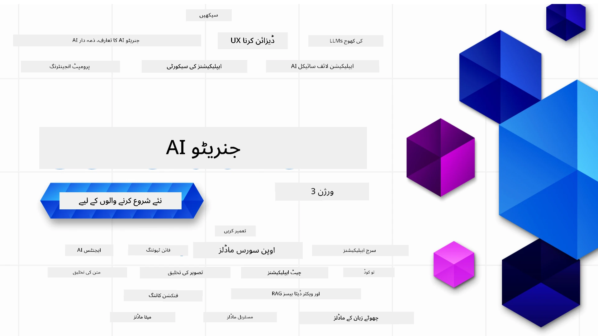

### 21 اسباق جو آپ کو جنریٹو AI ایپلیکیشنز بنانے کے لیے ضروری تمام باتیں سکھاتے ہیں

[](https://github.com/microsoft/Generative-AI-For-Beginners/blob/master/LICENSE?WT.mc_id=academic-105485-koreyst)
[](https://GitHub.com/microsoft/Generative-AI-For-Beginners/graphs/contributors/?WT.mc_id=academic-105485-koreyst)
[](https://GitHub.com/microsoft/Generative-AI-For-Beginners/issues/?WT.mc_id=academic-105485-koreyst)
[](https://GitHub.com/microsoft/Generative-AI-For-Beginners/pulls/?WT.mc_id=academic-105485-koreyst)
[](http://makeapullrequest.com?WT.mc_id=academic-105485-koreyst)

[](https://GitHub.com/microsoft/Generative-AI-For-Beginners/watchers/?WT.mc_id=academic-105485-koreyst)
[](https://GitHub.com/microsoft/Generative-AI-For-Beginners/network/?WT.mc_id=academic-105485-koreyst)
[](https://GitHub.com/microsoft/Generative-AI-For-Beginners/stargazers/?WT.mc_id=academic-105485-koreyst)

[](https://discord.gg/nTYy5BXMWG)

### 🌐 کثیراللسانی سپورٹ

#### GitHub ایکشن کے ذریعے سپورٹ شدہ (خودکار اور ہمیشہ تازہ ترین)

<!-- CO-OP TRANSLATOR LANGUAGES TABLE START -->
[Arabic](../ar/README.md) | [Bengali](../bn/README.md) | [Bulgarian](../bg/README.md) | [Burmese (Myanmar)](../my/README.md) | [Chinese (Simplified)](../zh-CN/README.md) | [Chinese (Traditional, Hong Kong)](../zh-HK/README.md) | [Chinese (Traditional, Macau)](../zh-MO/README.md) | [Chinese (Traditional, Taiwan)](../zh-TW/README.md) | [Croatian](../hr/README.md) | [Czech](../cs/README.md) | [Danish](../da/README.md) | [Dutch](../nl/README.md) | [Estonian](../et/README.md) | [Finnish](../fi/README.md) | [French](../fr/README.md) | [German](../de/README.md) | [Greek](../el/README.md) | [Hebrew](../he/README.md) | [Hindi](../hi/README.md) | [Hungarian](../hu/README.md) | [Indonesian](../id/README.md) | [Italian](../it/README.md) | [Japanese](../ja/README.md) | [Kannada](../kn/README.md) | [Khmer](../km/README.md) | [Korean](../ko/README.md) | [Lithuanian](../lt/README.md) | [Malay](../ms/README.md) | [Malayalam](../ml/README.md) | [Marathi](../mr/README.md) | [Nepali](../ne/README.md) | [Nigerian Pidgin](../pcm/README.md) | [Norwegian](../no/README.md) | [Persian (Farsi)](../fa/README.md) | [Polish](../pl/README.md) | [Portuguese (Brazil)](../pt-BR/README.md) | [Portuguese (Portugal)](../pt-PT/README.md) | [Punjabi (Gurmukhi)](../pa/README.md) | [Romanian](../ro/README.md) | [Russian](../ru/README.md) | [Serbian (Cyrillic)](../sr/README.md) | [Slovak](../sk/README.md) | [Slovenian](../sl/README.md) | [Spanish](../es/README.md) | [Swahili](../sw/README.md) | [Swedish](../sv/README.md) | [Tagalog (Filipino)](../tl/README.md) | [Tamil](../ta/README.md) | [Telugu](../te/README.md) | [Thai](../th/README.md) | [Turkish](../tr/README.md) | [Ukrainian](../uk/README.md) | [Urdu](./README.md) | [Vietnamese](../vi/README.md)

> **مقامی طور پر کلون کرنا پسند کریں؟**
>
> اس ذخیرۂ کلام میں 50+ زبانوں کے تراجم شامل ہیں جو ڈاؤن لوڈ کا حجم نمایاں بڑھاتے ہیں۔ بغیر تراجم کے کلون کرنے کے لیے spars checkout استعمال کریں:
>
> **Bash / macOS / Linux:**
> ```bash
> git clone --filter=blob:none --sparse https://github.com/microsoft/generative-ai-for-beginners.git
> cd generative-ai-for-beginners
> git sparse-checkout set --no-cone '/*' '!translations' '!translated_images'
> ```
>
> **CMD (Windows):**
> ```cmd
> git clone --filter=blob:none --sparse https://github.com/microsoft/generative-ai-for-beginners.git
> cd generative-ai-for-beginners
> git sparse-checkout set --no-cone "/*" "!translations" "!translated_images"
> ```
>
> اس سے آپ کو کورس مکمل کرنے کے لیے ہر چیز بہت تیز تر ڈاؤن لوڈ کے ساتھ مل جائے گی۔
<!-- CO-OP TRANSLATOR LANGUAGES TABLE END -->

# ابتدائیوں کے لیے جنریٹو AI (ورژن 3) - ایک کورس

Microsoft Cloud Advocates کی جامع 21 اسباقی کورس کے ذریعے جنریٹو AI ایپلیکیشنز بنانے کے بنیادی اصول سیکھیں۔

## 🌱 شروع کرنا

اس کورس میں 21 اسباق ہیں۔ ہر سبق اپنے موضوع پر مشتمل ہے اس لیے جہاں چاہیں وہاں سے شروع کریں!

اسباق کو "سیکھیں" یا "تعلیم" کے تحت تقسیم کیا گیا ہے جو جنریٹو AI کے تصورات کی وضاحت کرتے ہیں، اور "بنائیں" کے تحت وہ اسباق جو تصور اور کوڈ کے نمونے Python اور TypeScript دونوں میں فراہم کرتے ہیں جہاں ممکن ہو۔

.NET ڈویلپرز کے لیے [Generative AI for Beginners (.NET Edition)](https://github.com/microsoft/Generative-AI-for-beginners-dotnet?WT.mc_id=academic-105485-koreyst) دیکھیں!

ہر سبق میں "مزید سیکھتے رہیں" کا حصہ بھی شامل ہے جس میں اضافی تعلیمی وسائل موجود ہیں۔

## آپ کو کیا ضرورت ہے
### اس کورس کا کوڈ چلانے کے لیے آپ ان میں سے کسی ایک کا استعمال کر سکتے ہیں: 
 - [Azure OpenAI Service](https://aka.ms/genai-beginners/azure-open-ai?WT.mc_id=academic-105485-koreyst) - **اسباق:** "aoai-assignment"
 - [GitHub Marketplace Model Catalog](https://aka.ms/genai-beginners/gh-models?WT.mc_id=academic-105485-koreyst) - **اسباق:** "githubmodels"
 - [OpenAI API](https://aka.ms/genai-beginners/open-ai?WT.mc_id=academic-105485-koreyst) - **اسباق:** "oai-assignment" 
   
- Python یا TypeScript کا بنیادی علم مددگار ہے - \*مکمل نوآموز افراد کیلئے یہ [Python](https://aka.ms/genai-beginners/python?WT.mc_id=academic-105485-koreyst) اور [TypeScript](https://aka.ms/genai-beginners/typescript?WT.mc_id=academic-105485-koreyst) کورسز دیکھیں
- اپنا ایک GitHub اکاؤنٹ ہو تاکہ آپ اس پورے ذخیرۂ کلام کو اپنی GitHub اکاؤنٹ میں [fork کر سکیں](https://aka.ms/genai-beginners/github?WT.mc_id=academic-105485-koreyst)

ہم نے آپ کی ڈیولپمنٹ ماحول کو سیٹ اپ کرنے میں مدد کے لیے ایک **[کورس سیٹ اپ](./00-course-setup/README.md?WT.mc_id=academic-105485-koreyst)** سبق بھی تیار کیا ہے۔

اس ذخیرۂ کلام کو بعد میں آسانی سے تلاش کرنے کے لیے اسے [⭐ اسٹار دینا نہ بھولیں](https://docs.github.com/en/get-started/exploring-projects-on-github/saving-repositories-with-stars?WT.mc_id=academic-105485-koreyst)۔

## 🧠 تعیناتی کے لیے تیار ہیں؟

اگر آپ زیادہ پیش رفتہ کوڈ کے نمونے تلاش کر رہے ہیں، تو ہمارے [جنریٹو AI کوڈ نمونوں کا مجموعہ](https://aka.ms/genai-beg-code?WT.mc_id=academic-105485-koreyst) دیکھیں جو Python اور TypeScript دونوں میں دستیاب ہیں۔

## 🗣️ دوسرے سیکھنے والوں سے ملیں، مدد حاصل کریں

ہمارے [سرکاری Azure AI Foundry Discord سرور](https://aka.ms/genai-discord?WT.mc_id=academic-105485-koreyst) میں شامل ہوں تاکہ اس کورس کو لینے والے دیگر سیکھنے والوں سے ملاقات اور رابطہ کریں اور مدد حاصل کریں۔

سوالات پوچھیں یا پروڈکٹ فیڈبیک ہمارے [Azure AI Foundry Developer Forum](https://aka.ms/azureaifoundry/forum) پر Github پر شیئر کریں۔

## 🚀 اسٹارٹ اپ بنا رہے ہیں؟

Azure کریڈٹس کے ذریعے آج ہی شروع کرنے کے لیے [Microsoft for Startups](https://www.microsoft.com/startups) پر جائیں۔

## 🙏 مدد کرنا چاہتے ہیں؟

کیا آپ کے پاس تجاویز ہیں یا آپ نے ہجے یا کوڈ کی غلطیاں پائی ہیں؟ [مسئلہ رپورٹ کریں](https://github.com/microsoft/generative-ai-for-beginners/issues?WT.mc_id=academic-105485-koreyst) یا [پُل ریکویسٹ بنائیں](https://github.com/microsoft/generative-ai-for-beginners/pulls?WT.mc_id=academic-105485-koreyst)

## 📂 ہر سبق میں شامل ہے:

- موضوع کا مختصر ویڈیو تعارف
- README میں تحریری سبق
- Azure OpenAI اور OpenAI API کی حمایت کرنے والے Python اور TypeScript کوڈ کے نمونے
- آپ کی پڑھائی جاری رکھنے کے لیے اضافی وسائل کے لنکس

## 🗃️ اسباق

| #   | **سبق کا لنک**                                                                                                                              | **تفصیل**                                                                                 | **ویڈیو**                                                                   | **مزید تعلیم**                                                             |
| --- | -------------------------------------------------------------------------------------------------------------------------------------------- | ----------------------------------------------------------------------------------------- | --------------------------------------------------------------------------- | -------------------------------------------------------------------------- |
| 00  | [کورس سیٹ اپ](./00-course-setup/README.md?WT.mc_id=academic-105485-koreyst)                                                                   | **سیکھیں:** اپنا ڈیولپمنٹ ماحول کیسے سیٹ اپ کریں                                         | ویڈیو جلد آ رہا ہے                                                         | [مزید جانیں](https://aka.ms/genai-collection?WT.mc_id=academic-105485-koreyst) |
| 01  | [جنریٹو AI اور LLMs کا تعارف](./01-introduction-to-genai/README.md?WT.mc_id=academic-105485-koreyst)                                          | **سیکھیں:** یہ سمجھنا کہ جنریٹو AI کیا ہے اور بڑے زبان کے ماڈلز (LLMs) کیسے کام کرتے ہیں | [ویڈیو](https://aka.ms/gen-ai-lesson-1-gh?WT.mc_id=academic-105485-koreyst) | [مزید جانیں](https://aka.ms/genai-collection?WT.mc_id=academic-105485-koreyst) |
| 02  | [مختلف LLMs کو دریافت کرنا اور موازنہ کرنا](./02-exploring-and-comparing-different-llms/README.md?WT.mc_id=academic-105485-koreyst)             | **سیکھیں:** اپنے استعمال کے لیے درست ماڈل کا انتخاب کیسے کریں                           | [ویڈیو](https://aka.ms/gen-ai-lesson2-gh?WT.mc_id=academic-105485-koreyst)  | [مزید جانیں](https://aka.ms/genai-collection?WT.mc_id=academic-105485-koreyst) |
| 03  | [جنریٹو AI کو ذمہ داری سے استعمال کرنا](./03-using-generative-ai-responsibly/README.md?WT.mc_id=academic-105485-koreyst)                       | **سیکھیں:** جنریٹو AI ایپلیکیشنز کو ذمہ داری سے کیسے بنائیں؟                           | [ویڈیو](https://aka.ms/gen-ai-lesson3-gh?WT.mc_id=academic-105485-koreyst)  | [مزید جانیں](https://aka.ms/genai-collection?WT.mc_id=academic-105485-koreyst) |
| 04  | [پرومپٹ انجینئرنگ بنیادی اصول کو سمجھنا](./04-prompt-engineering-fundamentals/README.md?WT.mc_id=academic-105485-koreyst)             | **سیکھیں:** عملی پرومپٹ انجینئرنگ کی بہترین مشقیں                                           | [ویڈیو](https://aka.ms/gen-ai-lesson4-gh?WT.mc_id=academic-105485-koreyst)  | [مزید جانیں](https://aka.ms/genai-collection?WT.mc_id=academic-105485-koreyst) |
| 05  | [متقدم پرومپٹس بنانا](./05-advanced-prompts/README.md?WT.mc_id=academic-105485-koreyst)                                                | **سیکھیں:** پرومپٹ انجینئرنگ کی تکنیکیں کیسے لاگو کی جائیں جو آپ کے پرومپٹس کے نتائج کو بہتر بنائیں۔ | [ویڈیو](https://aka.ms/gen-ai-lesson5-gh?WT.mc_id=academic-105485-koreyst)  | [مزید جانیں](https://aka.ms/genai-collection?WT.mc_id=academic-105485-koreyst) |
| 06  | [ٹیکسٹ جنریشن ایپلی کیشنز بنانا](./06-text-generation-apps/README.md?WT.mc_id=academic-105485-koreyst)                                | **بنائیں:** Azure OpenAI / OpenAI API کا استعمال کرتے ہوئے ایک ٹیکسٹ جنریشن ایپ                  | [ویڈیو](https://aka.ms/gen-ai-lesson6-gh?WT.mc_id=academic-105485-koreyst)  | [مزید جانیں](https://aka.ms/genai-collection?WT.mc_id=academic-105485-koreyst) |
| 07  | [چیٹ ایپلی کیشنز بنانا](./07-building-chat-applications/README.md?WT.mc_id=academic-105485-koreyst)                                     | **بنائیں:** چیٹ ایپلی کیشنز کو مؤثر طریقے سے بنانے اور انضمام کے تکنیکیں۔                      | [ویڈیو](https://aka.ms/gen-ai-lessons7-gh?WT.mc_id=academic-105485-koreyst) | [مزید جانیں](https://aka.ms/genai-collection?WT.mc_id=academic-105485-koreyst) |
| 08  | [سرچ ایپس اور ویکٹر ڈیٹا بیس بنانا](./08-building-search-applications/README.md?WT.mc_id=academic-105485-koreyst)                        | **بنائیں:** ایک سرچ ایپلیکیشن جو ڈیٹا تلاش کرنے کے لیے ایمبیڈنگز کا استعمال کرتی ہے۔          | [ویڈیو](https://aka.ms/gen-ai-lesson8-gh?WT.mc_id=academic-105485-koreyst)  | [مزید جانیں](https://aka.ms/genai-collection?WT.mc_id=academic-105485-koreyst) |
| 09  | [امیج جنریشن ایپلی کیشنز بنانا](./09-building-image-applications/README.md?WT.mc_id=academic-105485-koreyst)                            | **بنائیں:** ایک تصویر جنریشن ایپلیکیشن                                                       | [ویڈیو](https://aka.ms/gen-ai-lesson9-gh?WT.mc_id=academic-105485-koreyst)  | [مزید جانیں](https://aka.ms/genai-collection?WT.mc_id=academic-105485-koreyst) |
| 10  | [لو کوڈ AI ایپلی کیشنز بنانا](./10-building-low-code-ai-applications/README.md?WT.mc_id=academic-105485-koreyst)                         | **بنائیں:** لو کوڈ ٹولز کا استعمال کرتے ہوئے ایک جنریٹیو AI ایپلیکیشن                        | [ویڈیو](https://aka.ms/gen-ai-lesson10-gh?WT.mc_id=academic-105485-koreyst) | [مزید جانیں](https://aka.ms/genai-collection?WT.mc_id=academic-105485-koreyst) |
| 11  | [فنکشن کالنگ کے ساتھ بیرونی ایپلی کیشنز کا انضمام](./11-integrating-with-function-calling/README.md?WT.mc_id=academic-105485-koreyst)   | **بنائیں:** فنکشن کالنگ کیا ہے اور ایپلیکیشنز کے لیے اس کے استعمال کے کیسز                      | [ویڈیو](https://aka.ms/gen-ai-lesson11-gh?WT.mc_id=academic-105485-koreyst) | [مزید جانیں](https://aka.ms/genai-collection?WT.mc_id=academic-105485-koreyst) |
| 12  | [AI ایپلی کیشنز کے لیے UX ڈیزائن کرنا](./12-designing-ux-for-ai-applications/README.md?WT.mc_id=academic-105485-koreyst)                   | **سیکھیں:** جنریٹیو AI ایپلیکیشنز تیار کرتے وقت UX ڈیزائن اصول کیسے لاگو کیے جائیں             | [ویڈیو](https://aka.ms/gen-ai-lesson12-gh?WT.mc_id=academic-105485-koreyst) | [مزید جانیں](https://aka.ms/genai-collection?WT.mc_id=academic-105485-koreyst) |
| 13  | [اپنی جنریٹیو AI ایپلی کیشنز کو محفوظ بنانا](./13-securing-ai-applications/README.md?WT.mc_id=academic-105485-koreyst)                   | **سیکھیں:** AI نظاموں کے خطرات اور خطرات، اور ان نظاموں کو محفوظ بنانے کے طریقے۔               | [ویڈیو](https://aka.ms/gen-ai-lesson13-gh?WT.mc_id=academic-105485-koreyst) | [مزید جانیں](https://aka.ms/genai-collection?WT.mc_id=academic-105485-koreyst) |
| 14  | [جنریٹیو AI ایپلیکیشن لائف سائیکل](./14-the-generative-ai-application-lifecycle/README.md?WT.mc_id=academic-105485-koreyst)               | **سیکھیں:** LLM لائف سائیکل اور LLMOps کو منظم کرنے کے لیے آلات اور میٹرکس                       | [ویڈیو](https://aka.ms/gen-ai-lesson14-gh?WT.mc_id=academic-105485-koreyst) | [مزید جانیں](https://aka.ms/genai-collection?WT.mc_id=academic-105485-koreyst) |
| 15  | [ریٹریول آگمینٹڈ جنریشن (RAG) اور ویکٹر ڈیٹا بیسز](./15-rag-and-vector-databases/README.md?WT.mc_id=academic-105485-koreyst)             | **بنائیں:** RAG فریم ورک استعمال کرتے ہوئے ویکٹر ڈیٹا بیسز سے ایمبیڈنگز حاصل کرنے والی ایپ     | [ویڈیو](https://aka.ms/gen-ai-lesson15-gh?WT.mc_id=academic-105485-koreyst) | [مزید جانیں](https://aka.ms/genai-collection?WT.mc_id=academic-105485-koreyst) |
| 16  | [اوپن سورس ماڈلز اور ہگنگ فیس](./16-open-source-models/README.md?WT.mc_id=academic-105485-koreyst)                                        | **بنائیں:** ایک ایپلیکیشن جو ہگنگ فیس پر دستیاب اوپن سورس ماڈلز استعمال کرتی ہے               | [ویڈیو](https://aka.ms/gen-ai-lesson16-gh?WT.mc_id=academic-105485-koreyst) | [مزید جانیں](https://aka.ms/genai-collection?WT.mc_id=academic-105485-koreyst) |
| 17  | [AI ایجنٹس](./17-ai-agents/README.md?WT.mc_id=academic-105485-koreyst)                                                                      | **بنائیں:** AI ایجنٹ فریم ورک استعمال کرتے ہوئے ایک ایپلیکیشن                                 | [ویڈیو](https://aka.ms/gen-ai-lesson17-gh?WT.mc_id=academic-105485-koreyst) | [مزید جانیں](https://aka.ms/genai-collection?WT.mc_id=academic-105485-koreyst) |
| 18  | [LLMs کی فائن-ٹیوننگ](./18-fine-tuning/README.md?WT.mc_id=academic-105485-koreyst)                                                         | **سیکھیں:** LLMs کی فائن-ٹیوننگ کیا ہے، کیوں اور کیسے کی جاتی ہے                             | [ویڈیو](https://aka.ms/gen-ai-lesson18-gh?WT.mc_id=academic-105485-koreyst) | [مزید جانیں](https://aka.ms/genai-collection?WT.mc_id=academic-105485-koreyst) |
| 19  | [SLMs کے ساتھ تعمیر](./19-slm/README.md?WT.mc_id=academic-105485-koreyst)                                                                  | **سیکھیں:** Small Language Models کے ساتھ تعمیر کرنے کے فوائد                                | ویڈیو جلد آ رہا ہے | [مزید جانیں](https://aka.ms/genai-collection?WT.mc_id=academic-105485-koreyst) |
| 20  | [Mistral ماڈلز کے ساتھ تعمیر](./20-mistral/README.md?WT.mc_id=academic-105485-koreyst)                                                    | **سیکھیں:** Mistral فیملی ماڈلز کی خصوصیات اور اختلافات                                   | ویڈیو جلد آ رہا ہے | [مزید جانیں](https://aka.ms/genai-collection?WT.mc_id=academic-105485-koreyst) |
| 21  | [Meta ماڈلز کے ساتھ تعمیر](./21-meta/README.md?WT.mc_id=academic-105485-koreyst)                                                         | **سیکھیں:** Meta فیملی ماڈلز کی خصوصیات اور اختلافات                                     | ویڈیو جلد آ رہا ہے | [مزید جانیں](https://aka.ms/genai-collection?WT.mc_id=academic-105485-koreyst) |

### 🌟 خصوصی شکریہ

تمام GitHub ایکشنز اور ورک فلو بنانے کے لیے [**جان عزیز**](https://www.linkedin.com/in/john0isaac/) کا خصوصی شکریہ

ہر سبق میں سیکھنے والے اور کوڈ کے تجربے کو بہتر بنانے کے لیے کلیدی تعاون فراہم کرنے پر [**برنہارڈ مرکلے**](https://www.linkedin.com/in/bernhard-merkle-738b73/) کا شکریہ۔

## 🎒 دیگر کورسز

ہماری ٹیم دیگر کورسز بھی تیار کرتی ہے! دیکھیں:

<!-- CO-OP TRANSLATOR OTHER COURSES START -->
### LangChain
[](https://aka.ms/langchain4j-for-beginners)
[](https://aka.ms/langchainjs-for-beginners?WT.mc_id=m365-94501-dwahlin)
[](https://github.com/microsoft/langchain-for-beginners?WT.mc_id=m365-94501-dwahlin)
---

### Azure / Edge / MCP / Agents
[](https://github.com/microsoft/AZD-for-beginners?WT.mc_id=academic-105485-koreyst)
[](https://github.com/microsoft/edgeai-for-beginners?WT.mc_id=academic-105485-koreyst)
[](https://github.com/microsoft/mcp-for-beginners?WT.mc_id=academic-105485-koreyst)
[](https://github.com/microsoft/ai-agents-for-beginners?WT.mc_id=academic-105485-koreyst)

---
 
### جنریٹیو AI سیریز
[](https://github.com/microsoft/generative-ai-for-beginners?WT.mc_id=academic-105485-koreyst)
[-9333EA?style=for-the-badge&labelColor=E5E7EB&color=9333EA)](https://github.com/microsoft/Generative-AI-for-beginners-dotnet?WT.mc_id=academic-105485-koreyst)
[-C084FC?style=for-the-badge&labelColor=E5E7EB&color=C084FC)](https://github.com/microsoft/generative-ai-for-beginners-java?WT.mc_id=academic-105485-koreyst)
[-E879F9?style=for-the-badge&labelColor=E5E7EB&color=E879F9)](https://github.com/microsoft/generative-ai-with-javascript?WT.mc_id=academic-105485-koreyst)

---
 
### بنیادی تعلیم
[](https://aka.ms/ml-beginners?WT.mc_id=academic-105485-koreyst)
[](https://aka.ms/datascience-beginners?WT.mc_id=academic-105485-koreyst)
[](https://aka.ms/ai-beginners?WT.mc_id=academic-105485-koreyst)
[](https://github.com/microsoft/Security-101?WT.mc_id=academic-96948-sayoung)
[](https://aka.ms/webdev-beginners?WT.mc_id=academic-105485-koreyst)
[](https://aka.ms/iot-beginners?WT.mc_id=academic-105485-koreyst)
[](https://github.com/microsoft/xr-development-for-beginners?WT.mc_id=academic-105485-koreyst)

---
 
### کوپائلٹ سیریز
[](https://aka.ms/GitHubCopilotAI?WT.mc_id=academic-105485-koreyst)
[](https://github.com/microsoft/mastering-github-copilot-for-dotnet-csharp-developers?WT.mc_id=academic-105485-koreyst)
[](https://github.com/microsoft/CopilotAdventures?WT.mc_id=academic-105485-koreyst)
<!-- CO-OP TRANSLATOR OTHER COURSES END -->

## مدد حاصل کرنا

اگر آپ پھنس گئے ہیں یا AI ایپس بنانے کے بارے میں کوئی سوالات ہیں تو۔ MCP کے نمایاں سیکھنے والوں اور تجربہ کار ڈویلپرز کے ساتھ بات چیت میں شامل ہوں۔ یہ ایک معاون کمیونٹی ہے جہاں سوالات خوش آمدید ہیں اور علم آزادانہ طور پر شیئر کیا جاتا ہے۔

[](https://discord.gg/nTYy5BXMWG)

اگر آپ کے پاس پروڈکٹ فیڈ بیک یا تعمیر کے دوران مسائل ہوں تو وزٹ کریں:

[](https://aka.ms/foundry/forum)

---

<!-- CO-OP TRANSLATOR DISCLAIMER START -->
**انکارِ ذمہ داری**:  
اس دستاویز کا ترجمہ AI ترجمہ سروس [Co-op Translator](https://github.com/Azure/co-op-translator) کے ذریعے کیا گیا ہے۔ اگرچہ ہم درستگی کے لیے کوشاں ہیں، براہ کرم اس بات سے آگاہ رہیں کہ خودکار ترجموں میں غلطیاں یا کمی بیشی ہو سکتی ہے۔ اصل دستاویز اپنی مادری زبان میں معتبر ماخذ سمجھا جانا چاہیے۔ اہم معلومات کے لیے پیشہ ور انسانی ترجمہ کی سفارش کی جاتی ہے۔ اس ترجمے کے استعمال سے پیدا ہونے والی کسی بھی غلط فہمی یا بدفہمی کے لیے ہم ذمہ دار نہیں ہوں گے۔
<!-- CO-OP TRANSLATOR DISCLAIMER END -->