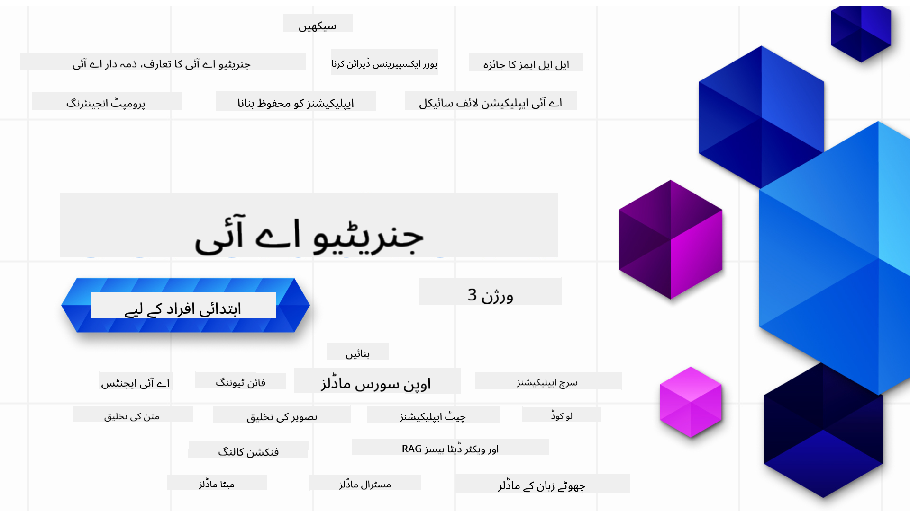

<!--
CO_OP_TRANSLATOR_METADATA:
{
  "original_hash": "3371380dfb4e3ac288036c36fff84eeb",
  "translation_date": "2025-08-25T11:18:39+00:00",
  "source_file": "README.md",
  "language_code": "ur"
}
-->

### ۲۱ اسباق جو آپ کو جنریٹیو اے آئی ایپلیکیشنز بنانے کے لیے درکار سب کچھ سکھاتے ہیں

### 🌐 کثیر لسانی سپورٹ

#### GitHub Action کے ذریعے سپورٹڈ (خودکار اور ہمیشہ تازہ ترین)

[French](../fr/README.md) | [Spanish](../es/README.md) | [German](../de/README.md) | [Russian](../ru/README.md) | [Arabic](../ar/README.md) | [Persian (Farsi)](../fa/README.md) | [Urdu](./README.md) | [Chinese (Simplified)](../zh/README.md) | [Chinese (Traditional, Macau)](../mo/README.md) | [Chinese (Traditional, Hong Kong)](../hk/README.md) | [Chinese (Traditional, Taiwan)](../tw/README.md) | [Japanese](../ja/README.md) | [Korean](../ko/README.md) | [Hindi](../hi/README.md) | [Bengali](../bn/README.md) | [Marathi](../mr/README.md) | [Nepali](../ne/README.md) | [Punjabi (Gurmukhi)](../pa/README.md) | [Portuguese (Portugal)](../pt/README.md) | [Portuguese (Brazil)](../br/README.md) | [Italian](../it/README.md) | [Lithuanian](../lt/README.md) | [Polish](../pl/README.md) | [Turkish](../tr/README.md) | [Greek](../el/README.md) | [Thai](../th/README.md) | [Swedish](../sv/README.md) | [Danish](../da/README.md) | [Norwegian](../no/README.md) | [Finnish](../fi/README.md) | [Dutch](../nl/README.md) | [Hebrew](../he/README.md) | [Vietnamese](../vi/README.md) | [Indonesian](../id/README.md) | [Malay](../ms/README.md) | [Tagalog (Filipino)](../tl/README.md) | [Swahili](../sw/README.md) | [Hungarian](../hu/README.md) | [Czech](../cs/README.md) | [Slovak](../sk/README.md) | [Romanian](../ro/README.md) | [Bulgarian](../bg/README.md) | [Serbian (Cyrillic)](../sr/README.md) | [Croatian](../hr/README.md) | [Slovenian](../sl/README.md) | [Ukrainian](../uk/README.md) | [Burmese (Myanmar)](../my/README.md)

# جنریٹیو اے آئی برائے ابتدائی افراد (ورژن ۳) - ایک کورس

مائیکروسافٹ کلاؤڈ ایڈووکیٹس کے اس ۲۱ اسباق پر مشتمل جامع کورس کے ساتھ جنریٹیو اے آئی ایپلیکیشنز بنانے کی بنیادی باتیں سیکھیں۔

## 🌱 شروعات کیسے کریں

اس کورس میں ۲۱ اسباق ہیں۔ ہر سبق ایک الگ موضوع پر ہے، اس لیے آپ جہاں چاہیں سے شروع کریں!

اسباق کو "Learn" (سیکھیں) یا "Build" (بنائیں) کے طور پر لیبل کیا گیا ہے۔ "Learn" اسباق میں جنریٹیو اے آئی کا کوئی تصور سمجھایا جاتا ہے جبکہ "Build" اسباق میں تصور کے ساتھ ساتھ **Python** اور **TypeScript** میں کوڈ کی مثالیں بھی دی جاتی ہیں (جہاں ممکن ہو)۔

.NET ڈویلپرز کے لیے [Generative AI for Beginners (.NET Edition)](https://github.com/microsoft/Generative-AI-for-beginners-dotnet?WT.mc_id=academic-105485-koreyst) بھی دستیاب ہے!

ہر سبق کے آخر میں "Keep Learning" (مزید سیکھیں) سیکشن بھی شامل ہے جس میں اضافی سیکھنے کے وسائل دیے گئے ہیں۔

## آپ کو کیا چاہیے
### اس کورس کا کوڈ چلانے کے لیے آپ ان میں سے کوئی بھی استعمال کر سکتے ہیں:
 - [Azure OpenAI Service](https://aka.ms/genai-beginners/azure-open-ai?WT.mc_id=academic-105485-koreyst) - **اسباق:** "aoai-assignment"
 - [GitHub Marketplace Model Catalog](https://aka.ms/genai-beginners/gh-models?WT.mc_id=academic-105485-koreyst) - **اسباق:** "githubmodels"
 - [OpenAI API](https://aka.ms/genai-beginners/open-ai?WT.mc_id=academic-105485-koreyst) - **اسباق:** "oai-assignment" 
   
- Python یا TypeScript کی بنیادی معلومات فائدہ مند ہیں - \*بالکل ابتدائی افراد کے لیے یہ [Python](https://aka.ms/genai-beginners/python?WT.mc_id=academic-105485-koreyst) اور [TypeScript](https://aka.ms/genai-beginners/typescript?WT.mc_id=academic-105485-koreyst) کورسز دیکھیں
- ایک GitHub اکاؤنٹ تاکہ آپ [اس پورے ریپو کو فورک](https://aka.ms/genai-beginners/github?WT.mc_id=academic-105485-koreyst) کر سکیں

ہم نے آپ کے لیے **[کورس سیٹ اپ](./00-course-setup/README.md?WT.mc_id=academic-105485-koreyst)** سبق تیار کیا ہے تاکہ آپ اپنا ڈیولپمنٹ ماحول آسانی سے سیٹ کر سکیں۔

اس ریپو کو [🌟 اسٹار](https://docs.github.com/en/get-started/exploring-projects-on-github/saving-repositories-with-stars?WT.mc_id=academic-105485-koreyst) کرنا نہ بھولیں تاکہ بعد میں آسانی سے تلاش کر سکیں۔

## 🧠 کیا آپ تیار ہیں ڈیپلائے کرنے کے لیے؟

اگر آپ مزید ایڈوانسڈ کوڈ نمونوں کی تلاش میں ہیں تو ہمارے [جنریٹیو اے آئی کوڈ سیمپلز](https://aka.ms/genai-beg-code?WT.mc_id=academic-105485-koreyst) کے مجموعے کو دیکھیں، جو **Python** اور **TypeScript** دونوں میں دستیاب ہیں۔

## 🗣️ دوسرے سیکھنے والوں سے ملیں، سپورٹ حاصل کریں

ہمارے [آفیشل Azure AI Foundry Discord سرور](https://aka.ms/genai-discord?WT.mc_id=academic-105485-koreyst) میں شامل ہوں، دوسرے سیکھنے والوں سے ملیں اور نیٹ ورکنگ کریں اور سپورٹ حاصل کریں۔

سوالات پوچھیں یا پروڈکٹ فیڈبیک شیئر کریں ہمارے [Azure AI Foundry Developer Forum](https://aka.ms/azureaifoundry/forum) پر جو Github پر ہے۔

## 🚀 اسٹارٹ اپ بنا رہے ہیں؟

[Microsoft for Startups](https://www.microsoft.com/startups) پر جائیں اور جانیں کہ آج ہی Azure کریڈٹس کے ساتھ کیسے شروعات کریں۔

## 🙏 مدد کرنا چاہتے ہیں؟

کوئی تجویز ہے یا املا یا کوڈ میں غلطی ملی ہے؟ [مسئلہ رپورٹ کریں](https://github.com/microsoft/generative-ai-for-beginners/issues?WT.mc_id=academic-105485-koreyst) یا [پُل ریکویسٹ بنائیں](https://github.com/microsoft/generative-ai-for-beginners/pulls?WT.mc_id=academic-105485-koreyst)

## 📂 ہر سبق میں شامل ہے:

- موضوع کا مختصر ویڈیو تعارف
- README میں تحریری سبق
- Python اور TypeScript میں کوڈ سیمپلز جو Azure OpenAI اور OpenAI API کو سپورٹ کرتے ہیں
- مزید سیکھنے کے لیے اضافی وسائل کے لنکس

## 🗃️ اسباق

| #   | **سبق کا لنک**                                                                                                                              | **تفصیل**                                                                                 | **ویڈیو**                                                                   | **اضافی سیکھنا**                                                             |
| --- | -------------------------------------------------------------------------------------------------------------------------------------------- | ----------------------------------------------------------------------------------------- | --------------------------------------------------------------------------- | ------------------------------------------------------------------------------ |
| 00  | [کورس سیٹ اپ](./00-course-setup/README.md?WT.mc_id=academic-105485-koreyst)                                                                 | **سیکھیں:** اپنا ڈیولپمنٹ ماحول کیسے سیٹ اپ کریں                                            | ویڈیو جلد آ رہا ہے                                                                 | [مزید سیکھیں](https://aka.ms/genai-collection?WT.mc_id=academic-105485-koreyst) |
| 01  | [جنریٹیو اے آئی اور ایل ایل ایمز کا تعارف](./01-introduction-to-genai/README.md?WT.mc_id=academic-105485-koreyst)                              | **سیکھیں:** جنریٹیو اے آئی کیا ہے اور بڑے لینگویج ماڈلز (LLMs) کیسے کام کرتے ہیں۔       | [ویڈیو](https://aka.ms/gen-ai-lesson-1-gh?WT.mc_id=academic-105485-koreyst) | [مزید سیکھیں](https://aka.ms/genai-collection?WT.mc_id=academic-105485-koreyst) |
| 02  | [مختلف ایل ایل ایمز کا جائزہ اور موازنہ](./02-exploring-and-comparing-different-llms/README.md?WT.mc_id=academic-105485-koreyst)             | **سیکھیں:** اپنے استعمال کے لیے درست ماڈل کیسے منتخب کریں                                      | [ویڈیو](https://aka.ms/gen-ai-lesson2-gh?WT.mc_id=academic-105485-koreyst)  | [مزید سیکھیں](https://aka.ms/genai-collection?WT.mc_id=academic-105485-koreyst) |
| 03  | [جنریٹیو اے آئی کا ذمہ دارانہ استعمال](./03-using-generative-ai-responsibly/README.md?WT.mc_id=academic-105485-koreyst)                           | **سیکھیں:** جنریٹیو اے آئی ایپلیکیشنز ذمہ داری سے کیسے بنائیں                                  | [ویڈیو](https://aka.ms/gen-ai-lesson3-gh?WT.mc_id=academic-105485-koreyst)  | [مزید سیکھیں](https://aka.ms/genai-collection?WT.mc_id=academic-105485-koreyst) |
| 04  | [پرومپٹ انجینئرنگ کی بنیادی باتیں سمجھنا](./04-prompt-engineering-fundamentals/README.md?WT.mc_id=academic-105485-koreyst)             | **سیکھیں:** پرومپٹ انجینئرنگ کے بہترین عملی طریقے                                           | [ویڈیو](https://aka.ms/gen-ai-lesson4-gh?WT.mc_id=academic-105485-koreyst)  | [مزید سیکھیں](https://aka.ms/genai-collection?WT.mc_id=academic-105485-koreyst) |
| 05  | [ایڈوانسڈ پرومپٹس بنانا](./05-advanced-prompts/README.md?WT.mc_id=academic-105485-koreyst)                                                | **سیکھیں:** پرومپٹ انجینئرنگ کی تکنیکیں کیسے اپنائیں جو آپ کے پرومپٹس کے نتائج کو بہتر بنائیں۔ | [ویڈیو](https://aka.ms/gen-ai-lesson5-gh?WT.mc_id=academic-105485-koreyst)  | [مزید سیکھیں](https://aka.ms/genai-collection?WT.mc_id=academic-105485-koreyst) |
| 06  | [ٹیکسٹ جنریشن ایپلیکیشنز بنانا](./06-text-generation-apps/README.md?WT.mc_id=academic-105485-koreyst)                                | **بنائیں:** ایک ٹیکسٹ جنریشن ایپ Azure OpenAI / OpenAI API کے ساتھ                                | [ویڈیو](https://aka.ms/gen-ai-lesson6-gh?WT.mc_id=academic-105485-koreyst)  | [مزید جانیں](https://aka.ms/genai-collection?WT.mc_id=academic-105485-koreyst) |
| 07  | [چیٹ ایپلیکیشنز بنانا](./07-building-chat-applications/README.md?WT.mc_id=academic-105485-koreyst)                                     | **بنائیں:** چیٹ ایپلیکیشنز کو مؤثر طریقے سے بنانے اور انٹیگریٹ کرنے کی تکنیکیں               | [ویڈیو](https://aka.ms/gen-ai-lessons7-gh?WT.mc_id=academic-105485-koreyst) | [مزید جانیں](https://aka.ms/genai-collection?WT.mc_id=academic-105485-koreyst) |
| 08  | [سرچ ایپلیکیشنز اور ویکٹر ڈیٹا بیسز بنانا](./08-building-search-applications/README.md?WT.mc_id=academic-105485-koreyst)                        | **بنائیں:** ایک سرچ ایپلیکیشن جو ایمبیڈنگز کا استعمال کر کے ڈیٹا تلاش کرے                        | [ویڈیو](https://aka.ms/gen-ai-lesson8-gh?WT.mc_id=academic-105485-koreyst)  | [مزید جانیں](https://aka.ms/genai-collection?WT.mc_id=academic-105485-koreyst) |
| 09  | [امیج جنریشن ایپلیکیشنز بنانا](./09-building-image-applications/README.md?WT.mc_id=academic-105485-koreyst)                        | **بنائیں:** ایک امیج جنریشن ایپلیکیشن                                                       | [ویڈیو](https://aka.ms/gen-ai-lesson9-gh?WT.mc_id=academic-105485-koreyst)  | [مزید جانیں](https://aka.ms/genai-collection?WT.mc_id=academic-105485-koreyst) |
| 10  | [لو کوڈ اے آئی ایپلیکیشنز بنانا](./10-building-low-code-ai-applications/README.md?WT.mc_id=academic-105485-koreyst)                       | **بنائیں:** لو کوڈ ٹولز کے ذریعے ایک جنریٹیو اے آئی ایپلیکیشن                                     | [ویڈیو](https://aka.ms/gen-ai-lesson10-gh?WT.mc_id=academic-105485-koreyst) | [مزید جانیں](https://aka.ms/genai-collection?WT.mc_id=academic-105485-koreyst) |
| 11  | [فنکشن کالنگ کے ساتھ ایکسٹرنل ایپلیکیشنز کو انٹیگریٹ کرنا](./11-integrating-with-function-calling/README.md?WT.mc_id=academic-105485-koreyst) | **بنائیں:** فنکشن کالنگ کیا ہے اور ایپلیکیشنز میں اس کے استعمالات                          | [ویڈیو](https://aka.ms/gen-ai-lesson11-gh?WT.mc_id=academic-105485-koreyst) | [مزید جانیں](https://aka.ms/genai-collection?WT.mc_id=academic-105485-koreyst) |
| 12  | [اے آئی ایپلیکیشنز کے لیے یو ایکس ڈیزائن کرنا](./12-designing-ux-for-ai-applications/README.md?WT.mc_id=academic-105485-koreyst)                         | **سیکھیں:** جنریٹیو اے آئی ایپلیکیشنز بناتے وقت یو ایکس ڈیزائن کے اصول کیسے اپلائی کریں         | [ویڈیو](https://aka.ms/gen-ai-lesson12-gh?WT.mc_id=academic-105485-koreyst) | [مزید جانیں](https://aka.ms/genai-collection?WT.mc_id=academic-105485-koreyst) |
| 13  | [اپنی جنریٹیو اے آئی ایپلیکیشنز کو محفوظ بنانا](./13-securing-ai-applications/README.md?WT.mc_id=academic-105485-koreyst)                         | **سیکھیں:** اے آئی سسٹمز کو درپیش خطرات اور ان سسٹمز کو محفوظ بنانے کے طریقے             | [ویڈیو](https://aka.ms/gen-ai-lesson13-gh?WT.mc_id=academic-105485-koreyst) | [مزید جانیں](https://aka.ms/genai-collection?WT.mc_id=academic-105485-koreyst) |
| 14  | [جنریٹیو اے آئی ایپلیکیشن لائف سائیکل](./14-the-generative-ai-application-lifecycle/README.md?WT.mc_id=academic-105485-koreyst)           | **سیکھیں:** ایل ایل ایم لائف سائیکل اور ایل ایل ایم اوپس کو مینج کرنے کے ٹولز اور میٹرکس                         | [ویڈیو](https://aka.ms/gen-ai-lesson14-gh?WT.mc_id=academic-105485-koreyst) | [مزید جانیں](https://aka.ms/genai-collection?WT.mc_id=academic-105485-koreyst) |
| 15  | [ریٹریول آگمینٹڈ جنریشن (RAG) اور ویکٹر ڈیٹا بیسز](./15-rag-and-vector-databases/README.md?WT.mc_id=academic-105485-koreyst)        | **بنائیں:** ایک ایپلیکیشن جو RAG فریم ورک کے ذریعے ویکٹر ڈیٹا بیس سے ایمبیڈنگز حاصل کرے  | [ویڈیو](https://aka.ms/gen-ai-lesson15-gh?WT.mc_id=academic-105485-koreyst) | [مزید جانیں](https://aka.ms/genai-collection?WT.mc_id=academic-105485-koreyst) |
| 16  | [اوپن سورس ماڈلز اور ہگنگ فیس](./16-open-source-models/README.md?WT.mc_id=academic-105485-koreyst)                                    | **بنائیں:** ایک ایپلیکیشن جو ہگنگ فیس پر دستیاب اوپن سورس ماڈلز کا استعمال کرے                    | [ویڈیو](https://aka.ms/gen-ai-lesson16-gh?WT.mc_id=academic-105485-koreyst) | [مزید جانیں](https://aka.ms/genai-collection?WT.mc_id=academic-105485-koreyst) |
| 17  | [اے آئی ایجنٹس](./17-ai-agents/README.md?WT.mc_id=academic-105485-koreyst)                                                                       | **بنائیں:** ایک ایپلیکیشن جو اے آئی ایجنٹ فریم ورک کا استعمال کرے                                           | [ویڈیو](https://aka.ms/gen-ai-lesson17-gh?WT.mc_id=academic-105485-koreyst) | [مزید جانیں](https://aka.ms/genai-collection?WT.mc_id=academic-105485-koreyst) |
| 18  | [ایل ایل ایمز کی فائن ٹیوننگ](./18-fine-tuning/README.md?WT.mc_id=academic-105485-koreyst)                                                              | **سیکھیں:** ایل ایل ایمز کی فائن ٹیوننگ کیا ہے، کیوں اور کیسے کی جاتی ہے                                            | [ویڈیو](https://aka.ms/gen-ai-lesson18-gh?WT.mc_id=academic-105485-koreyst) | [مزید جانیں](https://aka.ms/genai-collection?WT.mc_id=academic-105485-koreyst) |
| 19  | [ایس ایل ایمز کے ساتھ بنانا](./19-slm/README.md?WT.mc_id=academic-105485-koreyst)                                                              | **سیکھیں:** اسمال لینگویج ماڈلز کے ساتھ بنانے کے فوائد                                            | ویڈیو جلد آ رہی ہے | [مزید جانیں](https://aka.ms/genai-collection?WT.mc_id=academic-105485-koreyst) |
| 20  | [مِسٹرال ماڈلز کے ساتھ بنانا](./20-mistral/README.md?WT.mc_id=academic-105485-koreyst)                                                              | **سیکھیں:** مِسٹرال فیملی ماڈلز کی خصوصیات اور فرق                                           | ویڈیو جلد آ رہی ہے | [مزید جانیں](https://aka.ms/genai-collection?WT.mc_id=academic-105485-koreyst) |
| 21  | [میٹا ماڈلز کے ساتھ بنانا](./21-meta/README.md?WT.mc_id=academic-105485-koreyst)                                                              | **سیکھیں:** میٹا فیملی ماڈلز کی خصوصیات اور فرق                                           | ویڈیو جلد آ رہی ہے | [مزید جانیں](https://aka.ms/genai-collection?WT.mc_id=academic-105485-koreyst) |

### 🌟 خصوصی شکریہ

خصوصی شکریہ [**جان عزیز**](https://www.linkedin.com/in/john0isaac/) کو جنہوں نے تمام GitHub Actions اور ورک فلو بنائے

[**برنہارڈ مرکلے**](https://www.linkedin.com/in/bernhard-merkle-738b73/) کا بھی شکریہ جنہوں نے ہر سبق میں اہم کردار ادا کیا تاکہ سیکھنے اور کوڈنگ کے تجربے کو بہتر بنایا جا سکے۔

## 🎒 دیگر کورسز

ہماری ٹیم دیگر کورسز بھی بناتی ہے! دیکھیں:

- [**نیا** ماڈل کانٹیکسٹ پروٹوکول برائے ابتدائی افراد](https://github.com/microsoft/mcp-for-beginners?WT.mc_id=academic-105485-koreyst)
- [اے آئی ایجنٹس برائے ابتدائی افراد](https://github.com/microsoft/ai-agents-for-beginners?WT.mc_id=academic-105485-koreyst)
- [جنریٹیو اے آئی برائے ابتدائی افراد (.NET کے ساتھ)](https://github.com/microsoft/Generative-AI-for-beginners-dotnet?WT.mc_id=academic-105485-koreyst)
- [جنریٹیو اے آئی برائے ابتدائی افراد (جاوا اسکرپٹ کے ساتھ)](https://aka.ms/genai-js-course?WT.mc_id=academic-105485-koreyst)
- [جنریٹیو اے آئی برائے ابتدائی افراد (جاوا کے ساتھ)](https://aka.ms/genaijava?WT.mc_id=academic-105485-koreyst)
- [ایم ایل برائے ابتدائی افراد](https://aka.ms/ml-beginners?WT.mc_id=academic-105485-koreyst)
- [ڈیٹا سائنس برائے ابتدائی افراد](https://aka.ms/datascience-beginners?WT.mc_id=academic-105485-koreyst)
- [اے آئی برائے ابتدائی افراد](https://aka.ms/ai-beginners?WT.mc_id=academic-105485-koreyst)
- [سائبر سکیورٹی برائے ابتدائی افراد](https://github.com/microsoft/Security-101??WT.mc_id=academic-96948-sayoung)
- [ویب ڈیولپمنٹ برائے ابتدائی افراد](https://aka.ms/webdev-beginners?WT.mc_id=academic-105485-koreyst)
- [آئی او ٹی برائے ابتدائی افراد](https://aka.ms/iot-beginners?WT.mc_id=academic-105485-koreyst)
- [ایکس آر ڈیولپمنٹ برائے ابتدائی افراد](https://github.com/microsoft/xr-development-for-beginners?WT.mc_id=academic-105485-koreyst)
- [گٹ ہب کوپائلٹ کے ساتھ اے آئی پیئرڈ پروگرامنگ میں مہارت حاصل کریں](https://aka.ms/GitHubCopilotAI?WT.mc_id=academic-105485-koreyst)
- [گٹ ہب کوپائلٹ میں مہارت حاصل کریں (C#/.NET ڈویلپرز کے لیے)](https://github.com/microsoft/mastering-github-copilot-for-dotnet-csharp-developers?WT.mc_id=academic-105485-koreyst)
- [اپنی کوپائلٹ ایڈونچر خود منتخب کریں](https://github.com/microsoft/CopilotAdventures?WT.mc_id=academic-105485-koreyst)

---

**اعلانِ دستبرداری**:  
یہ دستاویز AI ترجمہ سروس [Co-op Translator](https://github.com/Azure/co-op-translator) کے ذریعے ترجمہ کی گئی ہے۔ اگرچہ ہم درستگی کی بھرپور کوشش کرتے ہیں، براہ کرم آگاہ رہیں کہ خودکار ترجمے میں غلطیاں یا عدم درستگی ہو سکتی ہے۔ اصل دستاویز اپنی زبان میں مستند ماخذ سمجھی جائے۔ اہم معلومات کے لیے پیشہ ور انسانی ترجمہ کی سفارش کی جاتی ہے۔ اس ترجمے کے استعمال سے پیدا ہونے والی کسی بھی غلط فہمی یا غلط تشریح کی ذمہ داری ہم قبول نہیں کرتے۔