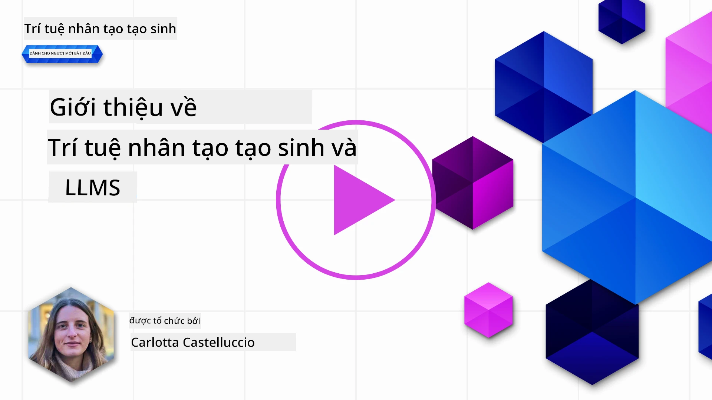
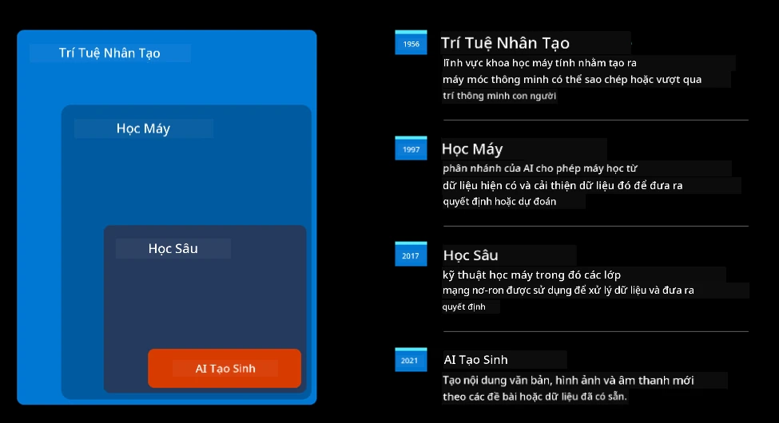
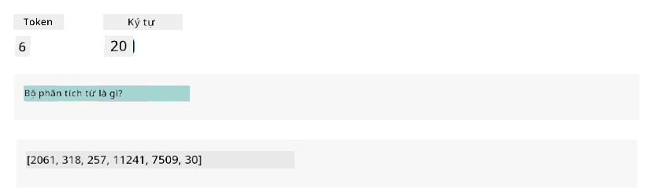
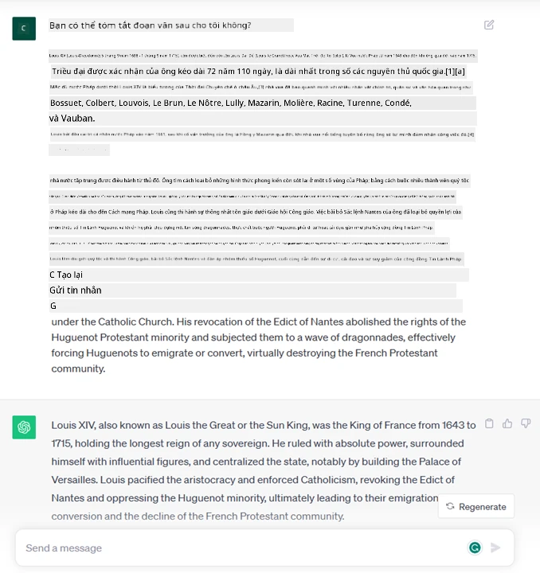
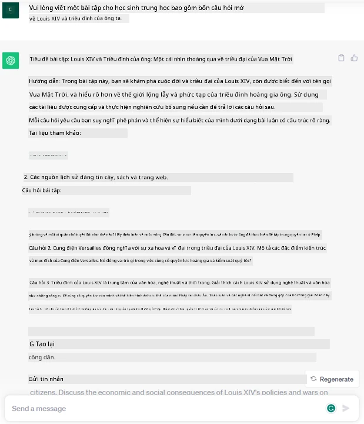
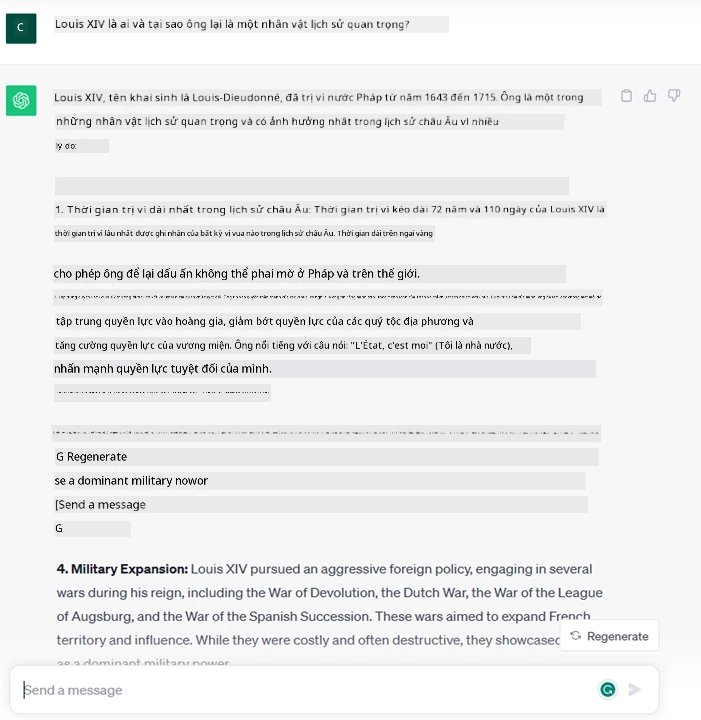
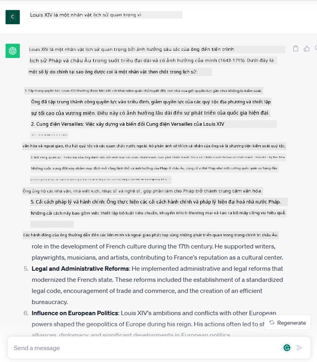
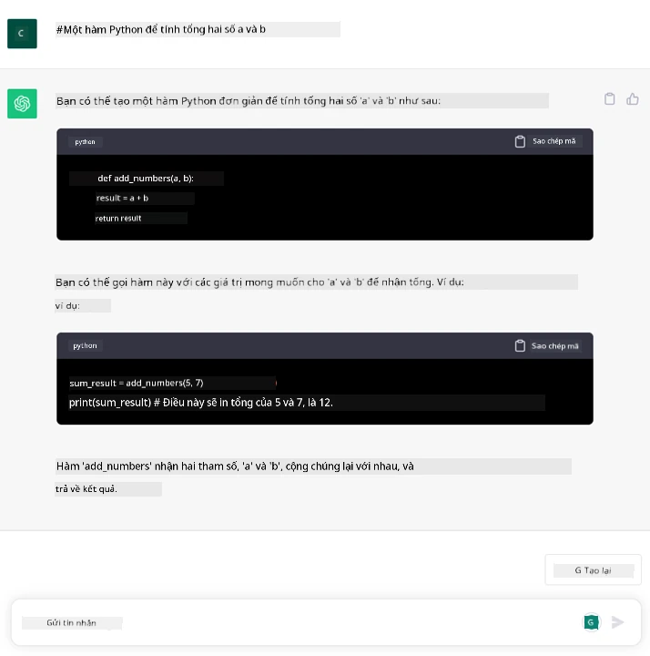

# Giới thiệu về AI Tạo Sinh và Mô Hình Ngôn Ngữ Lớn

_(Nhấn vào hình ảnh ở trên để xem video bài học này)_

AI Tạo Sinh là trí tuệ nhân tạo có khả năng tạo ra văn bản, hình ảnh và các loại nội dung khác. Điều làm cho nó trở thành một công nghệ tuyệt vời là nó dân chủ hóa AI, ai cũng có thể sử dụng chỉ với một lời nhắc văn bản, một câu viết bằng ngôn ngữ tự nhiên. Bạn không cần học một ngôn ngữ như Java hay SQL để làm điều gì đó có giá trị, tất cả những gì bạn cần là sử dụng ngôn ngữ của mình, nêu rõ yêu cầu và nhận được một đề xuất từ mô hình AI. Ứng dụng và tác động của điều này là rất lớn, bạn có thể viết hoặc hiểu báo cáo, viết ứng dụng và nhiều hơn nữa, tất cả chỉ trong vài giây.

Trong chương trình học này, chúng ta sẽ khám phá cách startup của chúng tôi tận dụng AI tạo sinh để mở khóa các kịch bản mới trong thế giới giáo dục và cách chúng tôi giải quyết những thách thức tất yếu liên quan đến các tác động xã hội của việc áp dụng nó cũng như các giới hạn của công nghệ.

## Giới thiệu

Bài học này sẽ bao gồm:

- Giới thiệu về kịch bản kinh doanh: ý tưởng và sứ mệnh của startup chúng tôi.
- AI tạo sinh và cách chúng tôi tiếp cận cảnh quan công nghệ hiện tại.
- Cách hoạt động bên trong của một mô hình ngôn ngữ lớn.
- Các khả năng chính và các trường hợp sử dụng thực tiễn của Mô Hình Ngôn Ngữ Lớn.

## Mục tiêu học tập

Sau khi hoàn thành bài học này, bạn sẽ hiểu được:

- AI tạo sinh là gì và cách các Mô Hình Ngôn Ngữ Lớn hoạt động.
- Cách bạn có thể tận dụng các mô hình ngôn ngữ lớn cho các trường hợp sử dụng khác nhau, với trọng tâm vào các kịch bản giáo dục.

## Kịch bản: startup giáo dục của chúng tôi

Trí tuệ nhân tạo tạo sinh (AI) đại diện cho đỉnh cao của công nghệ AI, đẩy xa hơn những giới hạn từng được cho là không thể. Các mô hình AI tạo sinh có nhiều khả năng và ứng dụng, nhưng trong chương trình này, chúng ta sẽ khám phá cách nó đang cách mạng hóa giáo dục thông qua một startup giả tưởng. Chúng ta sẽ gọi startup này là _startup của chúng tôi_. Startup của chúng tôi hoạt động trong lĩnh vực giáo dục với tuyên bố sứ mệnh tham vọng:

> _nâng cao khả năng tiếp cận trong học tập, trên phạm vi toàn cầu, đảm bảo quyền truy cập công bằng vào giáo dục và cung cấp trải nghiệm học tập cá nhân hóa cho từng học viên, theo nhu cầu của họ_.

Đội ngũ startup của chúng tôi nhận thức rằng chúng tôi sẽ không thể đạt được mục tiêu này nếu không tận dụng một trong những công cụ mạnh mẽ nhất của thời đại hiện nay – Mô Hình Ngôn Ngữ Lớn (LLMs).

AI Tạo Sinh được kỳ vọng sẽ cách mạng hóa cách chúng ta học và dạy ngày nay, với học sinh có thể tiếp cận giáo viên ảo suốt 24 giờ mỗi ngày cung cấp lượng thông tin và ví dụ phong phú, và giáo viên có thể sử dụng các công cụ đổi mới để đánh giá học sinh và đưa ra phản hồi.

Để bắt đầu, hãy cùng định nghĩa một số khái niệm và thuật ngữ cơ bản mà chúng ta sẽ sử dụng trong suốt chương trình học.

## AI Tạo Sinh được hình thành như thế nào?

Mặc dù sự _hào hứng_ phi thường được tạo ra gần đây bởi sự ra mắt của các mô hình AI tạo sinh, công nghệ này đã được phát triển trong nhiều thập kỷ, với các nỗ lực nghiên cứu đầu tiên từ những năm 60. Hiện nay, AI đã đạt được khả năng nhận thức giống con người, như trò chuyện được minh họa bởi ví dụ như [OpenAI ChatGPT](https://openai.com/chatgpt) hoặc [Microsoft Copilot](https://copilot.microsoft.com/?WT.mc_id=academic-105485-koreyst), vốn cũng sử dụng mô hình GPT cho trải nghiệm tìm kiếm web bằng trò chuyện.

Quay lại một chút, những nguyên mẫu AI đầu tiên bao gồm các chatbot đánh máy, dựa vào một cơ sở tri thức được trích xuất từ nhóm chuyên gia và được thể hiện trên máy tính. Các câu trả lời trong cơ sở tri thức được kích hoạt bởi các từ khóa xuất hiện trong văn bản đầu vào.
Tuy nhiên, sớm nhận ra rằng phương pháp này, sử dụng chatbot đánh máy, không mở rộng hiệu quả.

### Một phương pháp thống kê cho AI: Học máy

Một bước ngoặt xảy ra trong những năm 90, khi áp dụng phương pháp thống kê vào phân tích văn bản. Điều này dẫn đến sự phát triển của các thuật toán mới – được gọi là học máy – có khả năng học các mẫu từ dữ liệu mà không cần lập trình rõ ràng. Phương pháp này cho phép máy mô phỏng khả năng hiểu ngôn ngữ con người: một mô hình thống kê được đào tạo trên các cặp văn bản-nhãn, giúp mô hình phân loại văn bản chưa biết với nhãn được định nghĩa sẵn biểu thị ý định của thông điệp.

### Mạng nơ-ron và trợ lý ảo hiện đại

Trong những năm gần đây, sự tiến bộ công nghệ phần cứng, có khả năng xử lý lượng dữ liệu lớn hơn và tính toán phức tạp hơn, đã thúc đẩy nghiên cứu AI, dẫn tới sự phát triển của các thuật toán học máy tiên tiến được gọi là mạng nơ-ron hoặc thuật toán học sâu.

Mạng nơ-ron (đặc biệt là Mạng Nơ-ron Tái Tạo – RNNs) đã cải thiện đáng kể xử lý ngôn ngữ tự nhiên, cho phép mô tả ý nghĩa của văn bản một cách có ý nghĩa hơn, coi trọng ngữ cảnh của một từ trong câu.

Đây là công nghệ đã tạo ra các trợ lý ảo xuất hiện trong thập kỷ đầu tiên của thế kỷ mới, rất thành thạo trong việc hiểu ngôn ngữ con người, xác định nhu cầu và thực hiện hành động để thỏa mãn nhu cầu đó – như trả lời bằng kịch bản có sẵn hoặc sử dụng dịch vụ bên thứ ba.

### Hiện nay, AI tạo sinh

Đó là cách chúng ta đến với AI tạo sinh ngày nay, có thể xem là một nhánh con của học sâu.

Sau nhiều thập kỷ nghiên cứu trong lĩnh vực AI, một kiến trúc mô hình mới – gọi là _Transformer_ – đã vượt qua giới hạn của RNNs, có thể nhận đầu vào là các chuỗi văn bản dài hơn nhiều. Transformer dựa trên cơ chế chú ý, cho phép mô hình đặt trọng số khác nhau cho các đầu vào nhận được, ‘chú ý nhiều hơn’ nơi tập trung thông tin quan trọng nhất, bất kể thứ tự của chúng trong chuỗi văn bản.

Hầu hết các mô hình AI tạo sinh gần đây – còn gọi là Mô Hình Ngôn Ngữ Lớn (LLMs), vì chúng làm việc với đầu vào và đầu ra dạng văn bản – thực sự dựa trên kiến trúc này. Điều thú vị về các mô hình này – được huấn luyện trên lượng dữ liệu không gán nhãn khổng lồ từ các nguồn đa dạng như sách, bài viết và trang web – là chúng có thể được điều chỉnh cho nhiều nhiệm vụ khác nhau và tạo ra văn bản đúng ngữ pháp với vẻ sáng tạo nhất định. Vì vậy, chúng không chỉ cải thiện đáng kể khả năng ‘hiểu’ văn bản đầu vào của máy mà còn cho phép tạo ra phản hồi gốc bằng ngôn ngữ con người.

## Các mô hình ngôn ngữ lớn hoạt động như thế nào?

Trong chương tiếp theo, chúng ta sẽ khám phá các loại mô hình AI tạo sinh khác nhau, nhưng bây giờ hãy xem cách các mô hình ngôn ngữ lớn hoạt động, tập trung vào các mô hình OpenAI GPT (Generative Pre-trained Transformer).

- **Tokenizer, chuyển văn bản thành số**: Mô hình Ngôn Ngữ Lớn nhận đầu vào là văn bản và tạo ra đầu ra cũng là văn bản. Tuy nhiên, vì là mô hình thống kê, chúng làm việc tốt hơn nhiều với số hơn là các chuỗi văn bản. Do đó, mọi đầu vào cho mô hình đều được xử lý bởi tokenizer trước khi được sử dụng bởi mô hình chính. Một token là một đoạn văn bản – gồm số lượng ký tự biến đổi, vì vậy nhiệm vụ chính của tokenizer là phân chia đầu vào thành một mảng các token. Sau đó, mỗi token được ánh xạ với chỉ số token, là mã số nguyên của đoạn văn bản gốc.

- **Dự đoán token đầu ra**: Với n token làm đầu vào (với n tối đa thay đổi tùy mô hình), mô hình có thể dự đoán một token làm đầu ra. Token này sau đó được thêm vào đầu vào cho bước lặp tiếp theo, theo mô hình cửa sổ mở rộng, giúp cải thiện trải nghiệm người dùng khi nhận được một (hoặc nhiều) câu trả lời. Điều này giải thích tại sao, nếu bạn từng dùng ChatGPT, bạn có thể thấy đôi khi nó dừng lại giữa câu.

- **Quá trình lựa chọn, phân phối xác suất**: Token đầu ra được mô hình chọn theo xác suất xuất hiện của nó sau chuỗi văn bản hiện tại. Vì mô hình dự đoán phân phối xác suất trên tất cả các ‘token tiếp theo’ có thể, được tính dựa trên việc huấn luyện. Tuy nhiên, không phải lúc nào token có xác suất cao nhất cũng được chọn. Một mức độ ngẫu nhiên được thêm vào lựa chọn này, để mô hình hoạt động theo cách không xác định - ta không nhận được đầu ra chính xác giống nhau cho cùng một đầu vào. Mức độ ngẫu nhiên này được thêm để mô phỏng quá trình suy nghĩ sáng tạo và có thể được điều chỉnh bằng tham số nhiệt độ của mô hình.

## Startup của chúng ta có thể tận dụng Mô Hình Ngôn Ngữ Lớn như thế nào?

Giờ khi chúng ta hiểu rõ hơn về cách hoạt động bên trong của một mô hình ngôn ngữ lớn, hãy xem một số ví dụ thực tế về các nhiệm vụ phổ biến mà chúng có thể thực hiện rất tốt, với cái nhìn hướng tới kịch bản kinh doanh của chúng ta.
Chúng ta đã nói rằng khả năng chính của một Mô Hình Ngôn Ngữ Lớn là _tạo ra văn bản từ đầu, bắt đầu từ một đầu vào văn bản tự nhiên_.

Nhưng đầu vào và đầu ra văn bản là gì?
Đầu vào của mô hình ngôn ngữ lớn được gọi là prompt, trong khi đầu ra gọi là completion, thuật ngữ này chỉ cơ chế mô hình tạo token tiếp theo để hoàn thành đầu vào hiện tại. Chúng ta sẽ đi sâu tìm hiểu prompt là gì và cách thiết kế nó để tận dụng tối đa mô hình. Nhưng bây giờ, hãy nói rằng một prompt có thể bao gồm:

- Một **hướng dẫn** chỉ định loại đầu ra chúng ta mong đợi từ mô hình. Hướng dẫn này đôi khi có thể bao gồm ví dụ hoặc dữ liệu bổ sung.

  1. Tóm tắt một bài viết, sách, đánh giá sản phẩm và hơn thế nữa, cùng với trích xuất thông tin từ dữ liệu không cấu trúc.
    
    
  
  2. Sáng tạo ý tưởng và thiết kế một bài viết, bài luận, bài tập hoặc hơn thế nữa.
      
     

- Một **câu hỏi**, đặt dưới dạng cuộc trò chuyện với một đại lý.
  
  

- Một đoạn **văn bản để hoàn thành**, đây ngầm hiểu là lời nhờ hỗ trợ viết.
  
  

- Một đoạn **mã code** kèm theo yêu cầu giải thích và tài liệu, hoặc một bình luận yêu cầu tạo một đoạn mã thực hiện một nhiệm vụ cụ thể.
  
  

Các ví dụ trên khá đơn giản và không nhằm mục đích thể hiện đầy đủ khả năng của các Mô Hình Ngôn Ngữ Lớn. Chúng nhằm cho thấy tiềm năng sử dụng AI tạo sinh, đặc biệt nhưng không giới hạn trong bối cảnh giáo dục.

Ngoài ra, đầu ra của mô hình AI tạo sinh không hoàn hảo và đôi khi sự sáng tạo của mô hình có thể gây bất lợi, dẫn đến đầu ra là sự kết hợp các từ mà người dùng có thể hiểu như là sự bóp méo thực tế, hoặc có thể gây khó chịu. AI tạo sinh không thông minh - ít nhất không theo định nghĩa rộng hơn về trí tuệ, bao gồm lý luận phản biện và sáng tạo hoặc trí tuệ cảm xúc; nó không xác định và không đáng tin cậy, bởi vì những sai sót như tham chiếu, nội dung và tuyên bố sai có thể được kết hợp với thông tin đúng và được trình bày một cách thuyết phục và tự tin. Trong các bài học tiếp theo, chúng ta sẽ xử lý tất cả các giới hạn này và xem chúng ta có thể làm gì để giảm thiểu chúng.

## Bài tập

Bài tập của bạn là đọc thêm về [AI tạo sinh](https://en.wikipedia.org/wiki/Generative_artificial_intelligence?WT.mc_id=academic-105485-koreyst) và cố gắng xác định một lĩnh vực mà bạn sẽ thêm AI tạo sinh mà hiện chưa có. Tác động sẽ khác biệt thế nào so với cách làm “theo kiểu cũ”, bạn có làm được điều gì trước đây không làm được, hay bạn làm nhanh hơn? Viết một bản tóm tắt 300 từ về startup AI trong mơ của bạn và bao gồm các tiêu đề như "Vấn đề", "Cách tôi sử dụng AI", "Tác động" và tùy chọn một kế hoạch kinh doanh.

Nếu bạn đã làm bài tập này, bạn còn có thể sẵn sàng đăng ký vào chương trình ươm tạo của Microsoft, [Microsoft for Startups Founders Hub](https://www.microsoft.com/startups?WT.mc_id=academic-105485-koreyst) – chúng tôi cung cấp tín dụng cho cả Azure, OpenAI, cố vấn và nhiều hơn nữa, hãy khám phá nhé!

## Kiểm tra kiến thức

Điều gì đúng về các mô hình ngôn ngữ lớn?

1. Bạn nhận được câu trả lời chính xác như nhau mỗi lần.
1. Nó làm mọi việc hoàn hảo, tuyệt vời trong việc cộng số, tạo mã hoạt động, v.v.
1. Câu trả lời có thể thay đổi mặc dù dùng cùng một prompt. Nó cũng rất tốt để cho bạn bản nháp đầu tiên, dù là văn bản hay mã. Nhưng bạn cần cải thiện kết quả.

A: 3, một LLM là không xác định, câu trả lời thay đổi, tuy nhiên bạn có thể điều khiển độ biến thiên bằng tham số nhiệt độ. Bạn cũng không nên mong nó làm mọi việc hoàn hảo, nó ở đây để làm phần việc nặng nhọc, thường có nghĩa bạn có một nỗ lực đầu tiên tốt để từ từ cải tiến.

## Làm tốt lắm! Tiếp tục hành trình

Sau khi hoàn thành bài học này, hãy xem bộ sưu tập [Generative AI Learning collection](https://aka.ms/genai-collection?WT.mc_id=academic-105485-koreyst) của chúng tôi để tiếp tục nâng cao kiến thức về AI tạo sinh!

Hãy chuyển sang Bài học 2 nơi chúng ta sẽ xem cách [khám phá và so sánh các loại LLM khác nhau](../02-exploring-and-comparing-different-llms/README.md?WT.mc_id=academic-105485-koreyst)!

---

<!-- CO-OP TRANSLATOR DISCLAIMER START -->
**Tuyên bố miễn trừ trách nhiệm**:
Tài liệu này đã được dịch bằng dịch vụ dịch thuật AI [Co-op Translator](https://github.com/Azure/co-op-translator). Mặc dù chúng tôi cố gắng đảm bảo độ chính xác, xin lưu ý rằng bản dịch tự động có thể chứa lỗi hoặc sai sót. Tài liệu gốc bằng ngôn ngữ gốc nên được coi là nguồn tin chính thức. Đối với thông tin quan trọng, nên sử dụng dịch vụ dịch thuật chuyên nghiệp bởi con người. Chúng tôi không chịu trách nhiệm về bất kỳ hiểu lầm hoặc giải thích sai nào phát sinh từ việc sử dụng bản dịch này.
<!-- CO-OP TRANSLATOR DISCLAIMER END -->