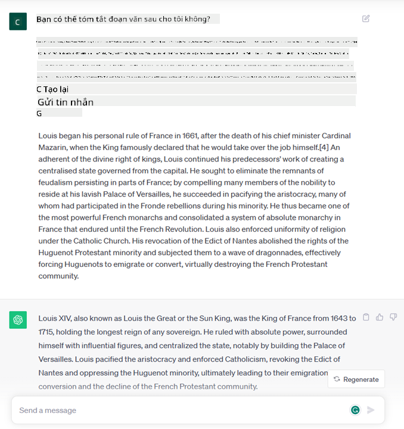
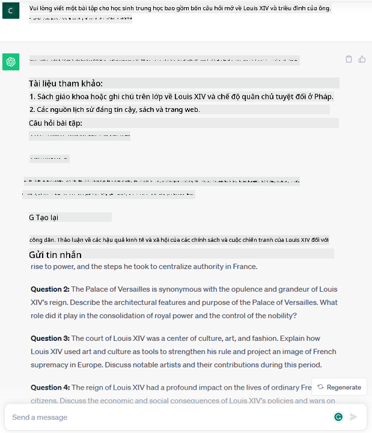
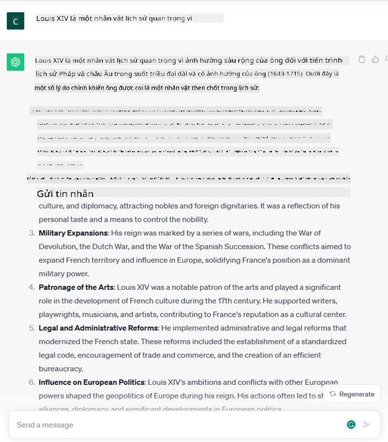

<!--
CO_OP_TRANSLATOR_METADATA:
{
  "original_hash": "f53ba0fa49164f9323043f1c6b11f2b1",
  "translation_date": "2025-07-09T07:57:33+00:00",
  "source_file": "01-introduction-to-genai/README.md",
  "language_code": "vi"
}
-->
# Giới thiệu về Generative AI và Mô hình Ngôn ngữ Lớn

_(Nhấn vào hình trên để xem video bài học này)_

Generative AI là trí tuệ nhân tạo có khả năng tạo ra văn bản, hình ảnh và các loại nội dung khác. Điều làm cho công nghệ này trở nên tuyệt vời là nó giúp AI trở nên phổ biến hơn, ai cũng có thể sử dụng chỉ với một câu lệnh văn bản, một câu viết bằng ngôn ngữ tự nhiên. Bạn không cần phải học các ngôn ngữ lập trình như Java hay SQL để làm điều gì đó có ý nghĩa, tất cả những gì bạn cần là dùng ngôn ngữ của mình, nói rõ điều bạn muốn và nhận được đề xuất từ một mô hình AI. Ứng dụng và tác động của công nghệ này rất lớn, bạn có thể viết hoặc hiểu báo cáo, viết ứng dụng và nhiều hơn nữa, tất cả chỉ trong vài giây.

Trong chương trình học này, chúng ta sẽ khám phá cách startup của chúng tôi tận dụng generative AI để mở ra những kịch bản mới trong lĩnh vực giáo dục và cách chúng tôi giải quyết những thách thức không thể tránh khỏi liên quan đến tác động xã hội của việc ứng dụng công nghệ này cũng như những giới hạn của nó.

## Giới thiệu

Bài học này sẽ bao gồm:

- Giới thiệu về kịch bản kinh doanh: ý tưởng và sứ mệnh của startup chúng tôi.
- Generative AI và cách chúng tôi tiếp cận bối cảnh công nghệ hiện tại.
- Cách hoạt động bên trong của một mô hình ngôn ngữ lớn.
- Các khả năng chính và các trường hợp sử dụng thực tế của Mô hình Ngôn ngữ Lớn.

## Mục tiêu học tập

Sau khi hoàn thành bài học này, bạn sẽ hiểu được:

- Generative AI là gì và Mô hình Ngôn ngữ Lớn hoạt động như thế nào.
- Cách bạn có thể tận dụng mô hình ngôn ngữ lớn cho các trường hợp sử dụng khác nhau, tập trung vào các kịch bản giáo dục.

## Kịch bản: startup giáo dục của chúng tôi

Generative Artificial Intelligence (AI) đại diện cho đỉnh cao của công nghệ AI, mở rộng giới hạn của những gì từng được coi là không thể. Các mô hình generative AI có nhiều khả năng và ứng dụng, nhưng trong chương trình này, chúng ta sẽ khám phá cách nó đang cách mạng hóa giáo dục thông qua một startup giả định. Chúng ta sẽ gọi startup này là _startup của chúng tôi_. Startup của chúng tôi hoạt động trong lĩnh vực giáo dục với sứ mệnh đầy tham vọng:

> _cải thiện khả năng tiếp cận trong học tập trên quy mô toàn cầu, đảm bảo quyền tiếp cận giáo dục công bằng và cung cấp trải nghiệm học tập cá nhân hóa cho từng người học, phù hợp với nhu cầu của họ_.

Đội ngũ startup của chúng tôi nhận thức rằng sẽ không thể đạt được mục tiêu này nếu không tận dụng một trong những công cụ mạnh mẽ nhất của thời đại hiện nay – Mô hình Ngôn ngữ Lớn (LLMs).

Generative AI được kỳ vọng sẽ cách mạng hóa cách chúng ta học và dạy ngày nay, với học sinh có thể tiếp cận giáo viên ảo 24/7 cung cấp lượng lớn thông tin và ví dụ, và giáo viên có thể sử dụng các công cụ sáng tạo để đánh giá học sinh và đưa ra phản hồi.

Để bắt đầu, hãy định nghĩa một số khái niệm và thuật ngữ cơ bản mà chúng ta sẽ sử dụng xuyên suốt chương trình học.

## Làm thế nào chúng ta có Generative AI?

Mặc dù sự _hào hứng_ lớn được tạo ra gần đây bởi việc công bố các mô hình generative AI, công nghệ này đã được phát triển trong nhiều thập kỷ, với những nỗ lực nghiên cứu đầu tiên bắt đầu từ những năm 60. Hiện nay, AI đã đạt đến khả năng nhận thức giống con người, như khả năng trò chuyện được thể hiện qua ví dụ như [OpenAI ChatGPT](https://openai.com/chatgpt) hoặc [Bing Chat](https://www.microsoft.com/edge/features/bing-chat?WT.mc_id=academic-105485-koreyst), cũng sử dụng mô hình GPT cho các cuộc hội thoại tìm kiếm trên web Bing.

Quay lại một chút, những nguyên mẫu AI đầu tiên là các chatbot đánh máy, dựa trên cơ sở tri thức được trích xuất từ nhóm chuyên gia và được biểu diễn trong máy tính. Các câu trả lời trong cơ sở tri thức được kích hoạt bởi các từ khóa xuất hiện trong văn bản đầu vào. Tuy nhiên, sớm nhận ra rằng cách tiếp cận này, sử dụng chatbot đánh máy, không thể mở rộng hiệu quả.

### Cách tiếp cận thống kê với AI: Machine Learning

Một bước ngoặt đến vào những năm 90, với việc áp dụng phương pháp thống kê vào phân tích văn bản. Điều này dẫn đến sự phát triển của các thuật toán mới – gọi là machine learning – có khả năng học các mẫu từ dữ liệu mà không cần được lập trình rõ ràng. Cách tiếp cận này cho phép máy móc mô phỏng khả năng hiểu ngôn ngữ của con người: một mô hình thống kê được huấn luyện trên các cặp văn bản-nhãn, giúp mô hình phân loại văn bản đầu vào chưa biết với nhãn định sẵn đại diện cho ý định của thông điệp.

### Mạng nơ-ron và trợ lý ảo hiện đại

Trong những năm gần đây, sự tiến bộ về phần cứng, có khả năng xử lý lượng dữ liệu lớn hơn và các phép tính phức tạp hơn, đã thúc đẩy nghiên cứu AI, dẫn đến sự phát triển của các thuật toán machine learning tiên tiến gọi là mạng nơ-ron hoặc deep learning.

Mạng nơ-ron (đặc biệt là Recurrent Neural Networks – RNNs) đã cải thiện đáng kể xử lý ngôn ngữ tự nhiên, cho phép biểu diễn ý nghĩa của văn bản một cách sâu sắc hơn, đánh giá ngữ cảnh của từ trong câu.

Đây là công nghệ đã tạo nên các trợ lý ảo ra đời trong thập kỷ đầu của thế kỷ mới, rất thành thạo trong việc hiểu ngôn ngữ con người, nhận diện nhu cầu và thực hiện hành động để đáp ứng – như trả lời theo kịch bản có sẵn hoặc sử dụng dịch vụ bên thứ ba.

### Hiện tại, Generative AI

Vậy đó là cách chúng ta có Generative AI ngày nay, có thể xem như một nhánh con của deep learning.

Sau nhiều thập kỷ nghiên cứu trong lĩnh vực AI, một kiến trúc mô hình mới – gọi là _Transformer_ – đã vượt qua giới hạn của RNNs, có khả năng xử lý các chuỗi văn bản dài hơn nhiều. Transformer dựa trên cơ chế attention, cho phép mô hình gán trọng số khác nhau cho các đầu vào nhận được, ‘chú ý nhiều hơn’ đến nơi tập trung thông tin quan trọng nhất, bất kể vị trí của chúng trong chuỗi văn bản.

Hầu hết các mô hình generative AI gần đây – còn gọi là Mô hình Ngôn ngữ Lớn (LLMs), vì chúng làm việc với đầu vào và đầu ra dạng văn bản – đều dựa trên kiến trúc này. Điều thú vị về các mô hình này – được huấn luyện trên lượng lớn dữ liệu chưa gán nhãn từ nhiều nguồn khác nhau như sách, bài báo và trang web – là chúng có thể được điều chỉnh cho nhiều nhiệm vụ khác nhau và tạo ra văn bản đúng ngữ pháp với vẻ sáng tạo nhất định. Vì vậy, không chỉ nâng cao khả năng ‘hiểu’ văn bản đầu vào của máy, mà còn giúp máy tạo ra phản hồi gốc bằng ngôn ngữ con người.

## Mô hình ngôn ngữ lớn hoạt động như thế nào?

Trong chương tiếp theo, chúng ta sẽ khám phá các loại mô hình Generative AI khác nhau, nhưng trước hết hãy xem cách mô hình ngôn ngữ lớn hoạt động, tập trung vào các mô hình OpenAI GPT (Generative Pre-trained Transformer).

- **Tokenizer, chuyển văn bản thành số**: Mô hình Ngôn ngữ Lớn nhận đầu vào là văn bản và tạo đầu ra cũng là văn bản. Tuy nhiên, vì là mô hình thống kê, chúng hoạt động tốt hơn với số hơn là chuỗi văn bản. Do đó, mỗi đầu vào được xử lý qua một tokenizer trước khi được sử dụng bởi mô hình chính. Một token là một đoạn văn bản – gồm một số ký tự thay đổi, nên nhiệm vụ chính của tokenizer là tách đầu vào thành một mảng các token. Sau đó, mỗi token được ánh xạ với một chỉ số token, là mã số nguyên đại diện cho đoạn văn bản gốc.

- **Dự đoán token đầu ra**: Với n token đầu vào (với n tối đa thay đổi tùy mô hình), mô hình có thể dự đoán một token đầu ra. Token này sau đó được thêm vào đầu vào cho vòng lặp tiếp theo, theo kiểu cửa sổ mở rộng, giúp trải nghiệm người dùng tốt hơn khi nhận được một (hoặc nhiều) câu trả lời. Điều này giải thích tại sao, nếu bạn từng dùng ChatGPT, đôi khi nó dường như dừng lại giữa chừng câu.

- **Quá trình lựa chọn, phân phối xác suất**: Token đầu ra được mô hình chọn dựa trên xác suất xuất hiện sau chuỗi văn bản hiện tại. Mô hình dự đoán phân phối xác suất trên tất cả các ‘token tiếp theo’ có thể, dựa trên quá trình huấn luyện. Tuy nhiên, không phải lúc nào token có xác suất cao nhất cũng được chọn. Một mức độ ngẫu nhiên được thêm vào lựa chọn này, khiến mô hình hoạt động không theo quy luật cố định – bạn sẽ không nhận được kết quả giống hệt nhau cho cùng một đầu vào. Mức độ ngẫu nhiên này được thêm vào để mô phỏng quá trình suy nghĩ sáng tạo và có thể điều chỉnh bằng tham số gọi là temperature.

## Startup của chúng tôi có thể tận dụng Mô hình Ngôn ngữ Lớn như thế nào?

Bây giờ chúng ta đã hiểu rõ hơn về cách hoạt động bên trong của mô hình ngôn ngữ lớn, hãy xem một số ví dụ thực tế về các nhiệm vụ phổ biến mà chúng có thể làm rất tốt, với góc nhìn về kịch bản kinh doanh của chúng ta.

Chúng ta đã nói rằng khả năng chính của Mô hình Ngôn ngữ Lớn là _tạo ra văn bản từ đầu, bắt đầu từ một đầu vào văn bản viết bằng ngôn ngữ tự nhiên_.

Nhưng loại đầu vào và đầu ra văn bản là gì?  
Đầu vào của mô hình ngôn ngữ lớn được gọi là prompt, trong khi đầu ra gọi là completion, thuật ngữ này chỉ cơ chế mô hình tạo token tiếp theo để hoàn thành đầu vào hiện tại. Chúng ta sẽ đi sâu vào prompt là gì và cách thiết kế nó để tận dụng tối đa mô hình. Nhưng trước mắt, hãy nói rằng một prompt có thể bao gồm:

- Một **hướng dẫn** chỉ định loại đầu ra mong muốn từ mô hình. Hướng dẫn này đôi khi có thể kèm theo ví dụ hoặc dữ liệu bổ sung.

  1. Tóm tắt một bài báo, sách, đánh giá sản phẩm và hơn thế nữa, cùng với việc trích xuất thông tin từ dữ liệu không cấu trúc.
    
    
  
  2. Ý tưởng sáng tạo và thiết kế một bài báo, bài luận, bài tập hoặc nhiều hơn nữa.
      
     

- Một **câu hỏi**, được đặt dưới dạng hội thoại với một trợ lý.

  

- Một đoạn **văn bản cần hoàn thành**, ngầm hiểu là yêu cầu hỗ trợ viết.

  

- Một đoạn **mã lệnh** kèm theo yêu cầu giải thích và ghi chú, hoặc một bình luận yêu cầu tạo đoạn mã thực hiện nhiệm vụ cụ thể.

  

Các ví dụ trên khá đơn giản và không nhằm mục đích trình bày đầy đủ khả năng của Mô hình Ngôn ngữ Lớn. Chúng chỉ nhằm minh họa tiềm năng của generative AI, đặc biệt nhưng không giới hạn trong bối cảnh giáo dục.

Ngoài ra, đầu ra của mô hình generative AI không hoàn hảo và đôi khi sự sáng tạo của mô hình có thể phản tác dụng, tạo ra kết quả là sự kết hợp các từ mà người dùng có thể hiểu như sự bóp méo thực tế, hoặc có thể gây xúc phạm. Generative AI không phải là trí tuệ – ít nhất theo định nghĩa toàn diện hơn về trí tuệ, bao gồm lý luận phản biện và sáng tạo hay trí tuệ cảm xúc; nó không phải là mô hình xác định, và không hoàn toàn đáng tin cậy, vì có thể kết hợp các thông tin sai lệch như tham chiếu, nội dung và tuyên bố không chính xác cùng với thông tin đúng, được trình bày một cách thuyết phục và tự tin. Trong các bài học tiếp theo, chúng ta sẽ xử lý các giới hạn này và xem cách giảm thiểu chúng.

## Bài tập

Bài tập của bạn là tìm hiểu thêm về [generative AI](https://en.wikipedia.org/wiki/Generative_artificial_intelligence?WT.mc_id=academic-105485-koreyst) và cố gắng xác định một lĩnh vực mà bạn sẽ thêm generative AI vào ngày hôm nay mà hiện chưa có. Tác động sẽ khác biệt như thế nào so với cách làm “cũ”, bạn có thể làm điều gì đó trước đây không làm được, hay bạn làm nhanh hơn? Viết một bản tóm tắt 300 từ về startup AI mơ ước của bạn sẽ trông như thế nào, bao gồm các tiêu đề như "Vấn đề", "Cách tôi sử dụng AI", "Tác động" và tùy chọn một kế hoạch kinh doanh.

Nếu bạn hoàn thành bài tập này, bạn có thể sẵn sàng đăng ký vào chương trình ươm tạo của Microsoft, [Microsoft for Startups Founders Hub](https://www.microsoft.com/startups?WT.mc_id=academic-105485-koreyst) – chúng tôi cung cấp tín dụng cho cả Azure, OpenAI, cố vấn và nhiều hơn nữa, hãy khám phá nhé!

## Kiểm tra kiến thức

Điều nào đúng về mô hình ngôn ngữ lớn?

1. Bạn nhận được câu trả lời giống hệt nhau mỗi lần.
2. Nó làm mọi việc hoàn hảo, rất giỏi cộng số, tạo mã chạy được, v.v.
3. Câu trả lời có thể khác nhau dù dùng cùng một prompt. Nó cũng rất tốt trong việc đưa ra bản nháp đầu tiên của một thứ gì đó, dù là văn bản hay mã. Nhưng bạn cần cải thiện kết quả.

Đáp án: 3, LLM là mô hình không xác định, câu trả lời thay đổi, tuy nhiên bạn có thể điều chỉnh mức độ biến thiên qua tham số temperature. Bạn cũng không nên mong nó làm mọi việc hoàn hảo, nó ở đây để làm phần việc nặng cho bạn, thường là giúp bạn có một bản thử đầu tiên tốt mà bạn cần dần hoàn thiện.

## Làm tốt lắm! Tiếp tục hành trình

Sau khi hoàn thành bài học này, hãy xem bộ sưu tập [Generative AI Learning collection](https://aka.ms/genai-collection?WT.mc_id=academic-105485-koreyst) để tiếp tục nâng cao kiến thức về Generative AI!
Hãy đến với Bài học 2, nơi chúng ta sẽ tìm hiểu cách [khám phá và so sánh các loại LLM khác nhau](../02-exploring-and-comparing-different-llms/README.md?WT.mc_id=academic-105485-koreyst)!

**Tuyên bố từ chối trách nhiệm**:  
Tài liệu này đã được dịch bằng dịch vụ dịch thuật AI [Co-op Translator](https://github.com/Azure/co-op-translator). Mặc dù chúng tôi cố gắng đảm bảo độ chính xác, xin lưu ý rằng các bản dịch tự động có thể chứa lỗi hoặc không chính xác. Tài liệu gốc bằng ngôn ngữ gốc của nó nên được coi là nguồn chính xác và đáng tin cậy. Đối với các thông tin quan trọng, nên sử dụng dịch vụ dịch thuật chuyên nghiệp do con người thực hiện. Chúng tôi không chịu trách nhiệm về bất kỳ sự hiểu lầm hoặc giải thích sai nào phát sinh từ việc sử dụng bản dịch này.