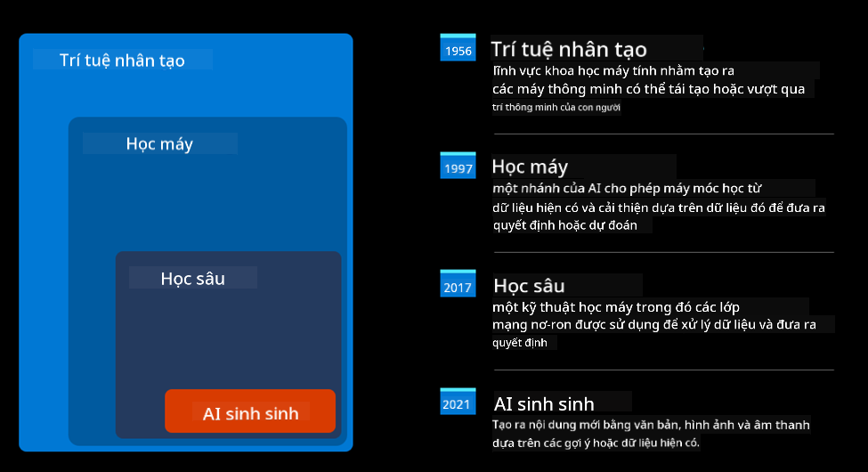
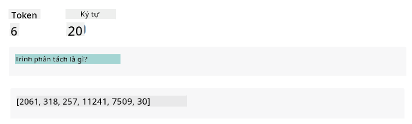
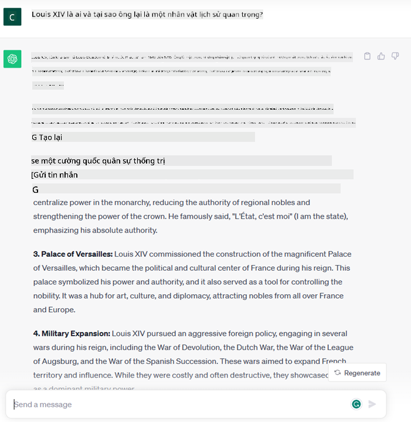
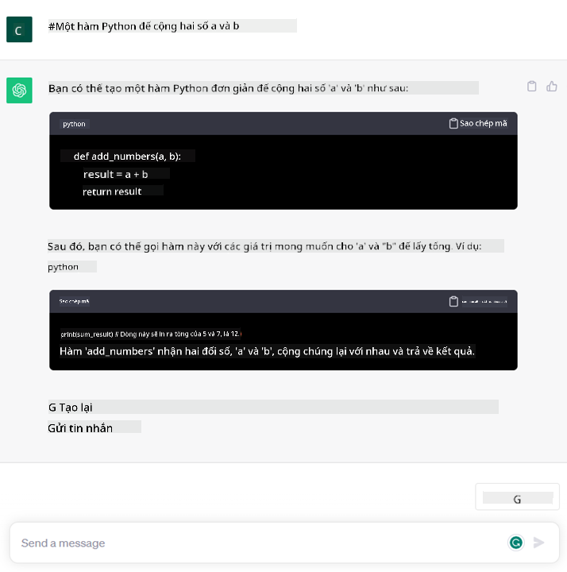

<!--
CO_OP_TRANSLATOR_METADATA:
{
  "original_hash": "bfb7901bdbece1ba3e9f35c400ca33e8",
  "translation_date": "2025-10-17T20:38:08+00:00",
  "source_file": "01-introduction-to-genai/README.md",
  "language_code": "vi"
}
-->
# Giới thiệu về AI Tạo Sinh và Mô Hình Ngôn Ngữ Lớn

_(Nhấn vào hình ảnh trên để xem video bài học này)_

AI Tạo Sinh là trí tuệ nhân tạo có khả năng tạo ra văn bản, hình ảnh và các loại nội dung khác. Điều làm cho nó trở thành một công nghệ tuyệt vời là nó dân chủ hóa AI, bất kỳ ai cũng có thể sử dụng nó chỉ với một lời nhắc văn bản, một câu viết bằng ngôn ngữ tự nhiên. Bạn không cần phải học một ngôn ngữ như Java hay SQL để làm được điều gì đó đáng giá, tất cả những gì bạn cần là sử dụng ngôn ngữ của mình, nói ra điều bạn muốn và nhận được gợi ý từ một mô hình AI. Ứng dụng và tác động của điều này là rất lớn, bạn có thể viết hoặc hiểu báo cáo, viết ứng dụng và nhiều hơn nữa, tất cả chỉ trong vài giây.

Trong chương trình học này, chúng ta sẽ khám phá cách startup của chúng tôi tận dụng AI Tạo Sinh để mở ra những kịch bản mới trong thế giới giáo dục và cách chúng tôi giải quyết những thách thức không thể tránh khỏi liên quan đến các tác động xã hội của việc ứng dụng nó và những hạn chế của công nghệ.

## Giới thiệu

Bài học này sẽ bao gồm:

- Giới thiệu về kịch bản kinh doanh: ý tưởng và sứ mệnh của startup chúng tôi.
- AI Tạo Sinh và cách chúng tôi đạt được bối cảnh công nghệ hiện tại.
- Cách hoạt động bên trong của một mô hình ngôn ngữ lớn.
- Các khả năng chính và các trường hợp sử dụng thực tế của Mô Hình Ngôn Ngữ Lớn.

## Mục tiêu học tập

Sau khi hoàn thành bài học này, bạn sẽ hiểu:

- AI Tạo Sinh là gì và cách Mô Hình Ngôn Ngữ Lớn hoạt động.
- Cách bạn có thể tận dụng Mô Hình Ngôn Ngữ Lớn cho các trường hợp sử dụng khác nhau, tập trung vào các kịch bản giáo dục.

## Kịch bản: startup giáo dục của chúng tôi

Trí tuệ nhân tạo tạo sinh (AI) đại diện cho đỉnh cao của công nghệ AI, đẩy xa giới hạn của những gì từng được cho là không thể. Các mô hình AI Tạo Sinh có nhiều khả năng và ứng dụng, nhưng trong chương trình học này, chúng ta sẽ khám phá cách nó đang cách mạng hóa giáo dục thông qua một startup giả tưởng. Chúng tôi sẽ gọi startup này là _startup của chúng tôi_. Startup của chúng tôi hoạt động trong lĩnh vực giáo dục với tuyên bố sứ mệnh đầy tham vọng:

> _cải thiện khả năng tiếp cận học tập trên quy mô toàn cầu, đảm bảo quyền tiếp cận giáo dục công bằng và cung cấp trải nghiệm học tập cá nhân hóa cho mọi người học, theo nhu cầu của họ_.

Đội ngũ startup của chúng tôi nhận thức rằng chúng tôi sẽ không thể đạt được mục tiêu này nếu không tận dụng một trong những công cụ mạnh mẽ nhất của thời hiện đại – Mô Hình Ngôn Ngữ Lớn (LLMs).

AI Tạo Sinh được kỳ vọng sẽ cách mạng hóa cách chúng ta học và dạy ngày nay, với học sinh có sẵn giáo viên ảo 24 giờ mỗi ngày cung cấp lượng lớn thông tin và ví dụ, và giáo viên có thể tận dụng các công cụ sáng tạo để đánh giá học sinh và đưa ra phản hồi.

Để bắt đầu, hãy định nghĩa một số khái niệm và thuật ngữ cơ bản mà chúng ta sẽ sử dụng trong suốt chương trình học.

## Làm thế nào chúng ta có được AI Tạo Sinh?

Mặc dù _hype_ phi thường được tạo ra gần đây bởi các thông báo về các mô hình AI Tạo Sinh, công nghệ này đã được nghiên cứu trong nhiều thập kỷ, với những nỗ lực nghiên cứu đầu tiên bắt đầu từ những năm 60. Hiện tại chúng ta đang ở một điểm mà AI có khả năng nhận thức của con người, như hội thoại được thể hiện bởi ví dụ [OpenAI ChatGPT](https://openai.com/chatgpt) hoặc [Bing Chat](https://www.microsoft.com/edge/features/bing-chat?WT.mc_id=academic-105485-koreyst), cũng sử dụng mô hình GPT cho các cuộc hội thoại tìm kiếm trên web Bing.

Quay lại một chút, các nguyên mẫu đầu tiên của AI bao gồm các chatbot gõ máy, dựa vào cơ sở kiến thức được trích xuất từ một nhóm chuyên gia và được biểu diễn trong máy tính. Các câu trả lời trong cơ sở kiến thức được kích hoạt bởi các từ khóa xuất hiện trong văn bản đầu vào. Tuy nhiên, nhanh chóng nhận ra rằng cách tiếp cận này, sử dụng chatbot gõ máy, không mở rộng tốt.

### Cách tiếp cận thống kê đối với AI: Machine Learning

Một bước ngoặt đã đến vào những năm 90, với việc áp dụng cách tiếp cận thống kê để phân tích văn bản. Điều này dẫn đến sự phát triển của các thuật toán mới – được gọi là machine learning – có khả năng học các mẫu từ dữ liệu mà không cần được lập trình rõ ràng. Cách tiếp cận này cho phép máy móc mô phỏng sự hiểu biết ngôn ngữ của con người: một mô hình thống kê được huấn luyện trên các cặp văn bản-nhãn, cho phép mô hình phân loại văn bản đầu vào chưa biết với một nhãn được định nghĩa trước đại diện cho ý định của thông điệp.

### Mạng nơ-ron và trợ lý ảo hiện đại

Trong những năm gần đây, sự tiến hóa công nghệ của phần cứng, có khả năng xử lý lượng dữ liệu lớn hơn và các tính toán phức tạp hơn, đã khuyến khích nghiên cứu về AI, dẫn đến sự phát triển của các thuật toán machine learning tiên tiến được gọi là mạng nơ-ron hoặc thuật toán học sâu.

Mạng nơ-ron (đặc biệt là Mạng nơ-ron hồi quy – RNNs) đã cải thiện đáng kể xử lý ngôn ngữ tự nhiên, cho phép biểu diễn ý nghĩa của văn bản một cách có ý nghĩa hơn, đánh giá ngữ cảnh của một từ trong câu.

Đây là công nghệ đã thúc đẩy các trợ lý ảo ra đời trong thập kỷ đầu tiên của thế kỷ mới, rất thành thạo trong việc diễn giải ngôn ngữ con người, xác định nhu cầu và thực hiện hành động để đáp ứng nó – như trả lời bằng một kịch bản được định nghĩa trước hoặc sử dụng một dịch vụ bên thứ ba.

### Ngày nay, AI Tạo Sinh

Vậy đó là cách chúng ta đến với AI Tạo Sinh ngày nay, có thể được xem như một phần của học sâu.

Sau nhiều thập kỷ nghiên cứu trong lĩnh vực AI, một kiến trúc mô hình mới – gọi là _Transformer_ – đã vượt qua giới hạn của RNNs, có khả năng nhận được các chuỗi văn bản dài hơn nhiều làm đầu vào. Transformers dựa trên cơ chế chú ý, cho phép mô hình gán các trọng số khác nhau cho các đầu vào mà nó nhận được, ‘chú ý nhiều hơn’ đến nơi thông tin quan trọng nhất tập trung, bất kể thứ tự của chúng trong chuỗi văn bản.

Hầu hết các mô hình AI Tạo Sinh gần đây – còn được gọi là Mô Hình Ngôn Ngữ Lớn (LLMs), vì chúng hoạt động với các đầu vào và đầu ra bằng văn bản – thực sự dựa trên kiến trúc này. Điều thú vị về các mô hình này – được huấn luyện trên một lượng lớn dữ liệu không được gắn nhãn từ các nguồn đa dạng như sách, bài báo và trang web – là chúng có thể được điều chỉnh cho nhiều nhiệm vụ khác nhau và tạo ra văn bản ngữ pháp chính xác với một chút sáng tạo. Vì vậy, không chỉ chúng đã cải thiện đáng kể khả năng của máy móc trong việc ‘hiểu’ văn bản đầu vào, mà còn cho phép chúng tạo ra một phản hồi nguyên bản bằng ngôn ngữ con người.

## Mô Hình Ngôn Ngữ Lớn hoạt động như thế nào?

Trong chương tiếp theo, chúng ta sẽ khám phá các loại mô hình AI Tạo Sinh khác nhau, nhưng bây giờ hãy xem cách Mô Hình Ngôn Ngữ Lớn hoạt động, tập trung vào các mô hình OpenAI GPT (Generative Pre-trained Transformer).

- **Tokenizer, chuyển văn bản thành số**: Mô Hình Ngôn Ngữ Lớn nhận một văn bản làm đầu vào và tạo ra một văn bản làm đầu ra. Tuy nhiên, vì là mô hình thống kê, chúng hoạt động tốt hơn với số hơn là chuỗi văn bản. Đó là lý do tại sao mọi đầu vào cho mô hình đều được xử lý bởi một tokenizer trước khi được sử dụng bởi mô hình cốt lõi. Một token là một đoạn văn bản – bao gồm một số lượng ký tự biến đổi, vì vậy nhiệm vụ chính của tokenizer là chia đầu vào thành một mảng các token. Sau đó, mỗi token được ánh xạ với một chỉ số token, là mã hóa số nguyên của đoạn văn bản gốc.

- **Dự đoán token đầu ra**: Với n token làm đầu vào (với n tối đa thay đổi từ mô hình này sang mô hình khác), mô hình có thể dự đoán một token làm đầu ra. Token này sau đó được kết hợp vào đầu vào của lần lặp tiếp theo, theo mô hình cửa sổ mở rộng, cho phép trải nghiệm người dùng tốt hơn khi nhận được một (hoặc nhiều) câu trả lời. Điều này giải thích tại sao, nếu bạn từng thử ChatGPT, bạn có thể nhận thấy rằng đôi khi nó dừng lại giữa câu.

- **Quá trình lựa chọn, phân phối xác suất**: Token đầu ra được mô hình chọn theo xác suất xảy ra sau chuỗi văn bản hiện tại. Điều này là do mô hình dự đoán một phân phối xác suất trên tất cả các ‘token tiếp theo’ có thể, được tính toán dựa trên quá trình huấn luyện của nó. Tuy nhiên, không phải lúc nào token có xác suất cao nhất cũng được chọn từ phân phối kết quả. Một mức độ ngẫu nhiên được thêm vào lựa chọn này, theo cách mà mô hình hoạt động không theo cách xác định - chúng ta không nhận được đầu ra giống hệt nhau cho cùng một đầu vào. Mức độ ngẫu nhiên này được thêm vào để mô phỏng quá trình tư duy sáng tạo và có thể được điều chỉnh bằng một tham số mô hình gọi là nhiệt độ.

## Startup của chúng tôi có thể tận dụng Mô Hình Ngôn Ngữ Lớn như thế nào?

Bây giờ chúng ta đã hiểu rõ hơn về cách hoạt động bên trong của một Mô Hình Ngôn Ngữ Lớn, hãy xem một số ví dụ thực tế về các nhiệm vụ phổ biến mà chúng có thể thực hiện khá tốt, với cái nhìn về kịch bản kinh doanh của chúng tôi. Chúng tôi đã nói rằng khả năng chính của một Mô Hình Ngôn Ngữ Lớn là _tạo văn bản từ đầu, bắt đầu từ một đầu vào văn bản, viết bằng ngôn ngữ tự nhiên_.

Nhưng loại đầu vào và đầu ra văn bản nào?
Đầu vào của một Mô Hình Ngôn Ngữ Lớn được gọi là prompt, trong khi đầu ra được gọi là completion, thuật ngữ này đề cập đến cơ chế của mô hình trong việc tạo token tiếp theo để hoàn thành đầu vào hiện tại. Chúng ta sẽ đi sâu vào prompt là gì và cách thiết kế nó để tận dụng tối đa mô hình của chúng ta. Nhưng hiện tại, hãy chỉ nói rằng một prompt có thể bao gồm:

- Một **hướng dẫn** chỉ định loại đầu ra mà chúng ta mong đợi từ mô hình. Hướng dẫn này đôi khi có thể bao gồm một số ví dụ hoặc một số dữ liệu bổ sung.

  1. Tóm tắt một bài báo, sách, đánh giá sản phẩm và hơn thế nữa, cùng với việc trích xuất thông tin từ dữ liệu không có cấu trúc.
    
    
  
  2. Tư duy sáng tạo và thiết kế một bài báo, bài luận, bài tập hoặc hơn thế nữa.
      
     

- Một **câu hỏi**, được hỏi dưới dạng cuộc trò chuyện với một tác nhân.
  
  

- Một đoạn **văn bản để hoàn thành**, mà ngầm hiểu là yêu cầu hỗ trợ viết.
  
  

- Một đoạn **mã** cùng với yêu cầu giải thích và tài liệu hóa nó, hoặc một bình luận yêu cầu tạo một đoạn mã thực hiện một nhiệm vụ cụ thể.
  
  

Các ví dụ trên khá đơn giản và không nhằm mục đích là một minh chứng đầy đủ về khả năng của Mô Hình Ngôn Ngữ Lớn. Chúng được thiết kế để cho thấy tiềm năng của việc sử dụng AI Tạo Sinh, đặc biệt nhưng không giới hạn trong các bối cảnh giáo dục.

Ngoài ra, đầu ra của một mô hình AI Tạo Sinh không hoàn hảo và đôi khi sự sáng tạo của mô hình có thể phản tác dụng, dẫn đến đầu ra là sự kết hợp của các từ mà người dùng có thể hiểu là sự bóp méo thực tế, hoặc có thể gây xúc phạm. AI Tạo Sinh không thông minh - ít nhất là theo định nghĩa toàn diện hơn về trí thông minh, bao gồm lý luận phản biện và sáng tạo hoặc trí thông minh cảm xúc; nó không xác định, và nó không đáng tin cậy, vì các sự bịa đặt, chẳng hạn như các tham chiếu sai, nội dung và tuyên bố, có thể được kết hợp với thông tin đúng, và được trình bày một cách thuyết phục và tự tin. Trong các bài học tiếp theo, chúng ta sẽ giải quyết tất cả những hạn chế này và sẽ xem chúng ta có thể làm gì để giảm thiểu chúng.

## Bài tập

Bài tập của bạn là tìm hiểu thêm về [AI Tạo Sinh](https://en.wikipedia.org/wiki/Generative_artificial_intelligence?WT.mc_id=academic-105485-koreyst) và cố gắng xác định một lĩnh vực mà bạn sẽ thêm AI Tạo Sinh vào ngày hôm nay mà hiện chưa có. Tác động sẽ khác biệt như thế nào so với cách làm "cũ", bạn có thể làm điều gì mà trước đây không thể, hoặc bạn có nhanh hơn không? Viết một bản tóm tắt 300 từ về startup AI mơ ước của bạn sẽ trông như thế nào và bao gồm các tiêu đề như "Vấn đề", "Cách tôi sẽ sử dụng AI", "Tác động" và tùy chọn một kế hoạch kinh doanh.

Nếu bạn hoàn thành nhiệm vụ này, bạn thậm chí có thể sẵn sàng nộp đơn vào chương trình ươm tạo của Microsoft, [Microsoft for Startups Founders Hub](https://www.microsoft.com/startups?WT.mc_id=academic-105485-koreyst) chúng tôi cung cấp tín dụng cho cả Azure, OpenAI, cố vấn và nhiều hơn nữa, hãy kiểm tra ngay!

## Kiểm tra kiến thức

Điều gì đúng về Mô Hình Ngôn Ngữ Lớn?

1. Bạn nhận được phản hồi giống hệt nhau mỗi lần.
1. Nó làm mọi thứ hoàn hảo, rất giỏi trong việc cộng số, tạo mã hoạt động, v.v.
1. Phản hồi có thể thay đổi mặc dù sử dụng cùng một prompt. Nó cũng rất giỏi trong việc cung cấp bản nháp đầu tiên của một thứ gì đó, dù là văn bản hay mã. Nhưng bạn cần cải thiện kết quả.

A: 3, một LLM không xác định, phản hồi thay đổi, tuy nhiên, bạn có thể kiểm soát sự thay đổi của nó thông qua cài đặt nhiệt độ. Bạn cũng không nên mong đợi nó làm mọi thứ hoàn hảo, nó ở đây để làm công việc nặng nhọc cho bạn, điều này thường có nghĩa là bạn nhận được một nỗ lực đầu tiên tốt mà bạn cần cải thiện dần.

## Làm tốt lắm! Tiếp tục hành trình

Sau khi hoàn thành bài học này, hãy xem [Bộ sưu tập học AI Tạo Sinh](https://aka.ms/genai-collection?WT.mc_id=academic-105485-koreyst) của chúng tôi để tiếp tục nâng cao kiến thức về AI Tạo Sinh!
Hãy chuyển sang Bài học 2, nơi chúng ta sẽ tìm hiểu cách [khám phá và so sánh các loại LLM khác nhau](../02-exploring-and-comparing-different-llms/README.md?WT.mc_id=academic-105485-koreyst)!

---

**Tuyên bố miễn trừ trách nhiệm**:  
Tài liệu này đã được dịch bằng dịch vụ dịch thuật AI [Co-op Translator](https://github.com/Azure/co-op-translator). Mặc dù chúng tôi cố gắng đảm bảo độ chính xác, xin lưu ý rằng các bản dịch tự động có thể chứa lỗi hoặc không chính xác. Tài liệu gốc bằng ngôn ngữ bản địa nên được coi là nguồn thông tin chính thức. Đối với thông tin quan trọng, nên sử dụng dịch vụ dịch thuật chuyên nghiệp bởi con người. Chúng tôi không chịu trách nhiệm về bất kỳ sự hiểu lầm hoặc diễn giải sai nào phát sinh từ việc sử dụng bản dịch này.