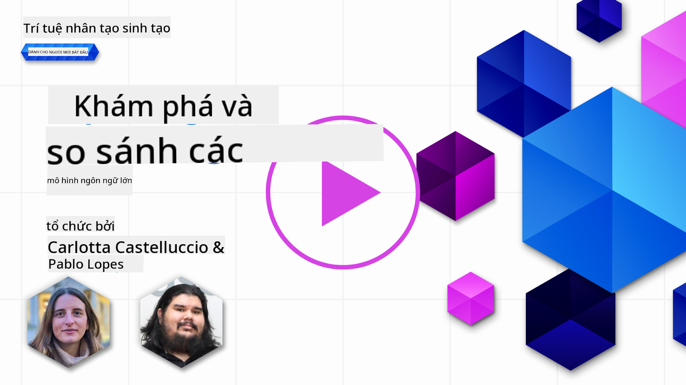
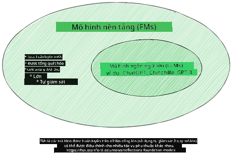
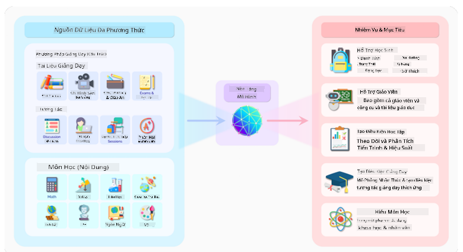
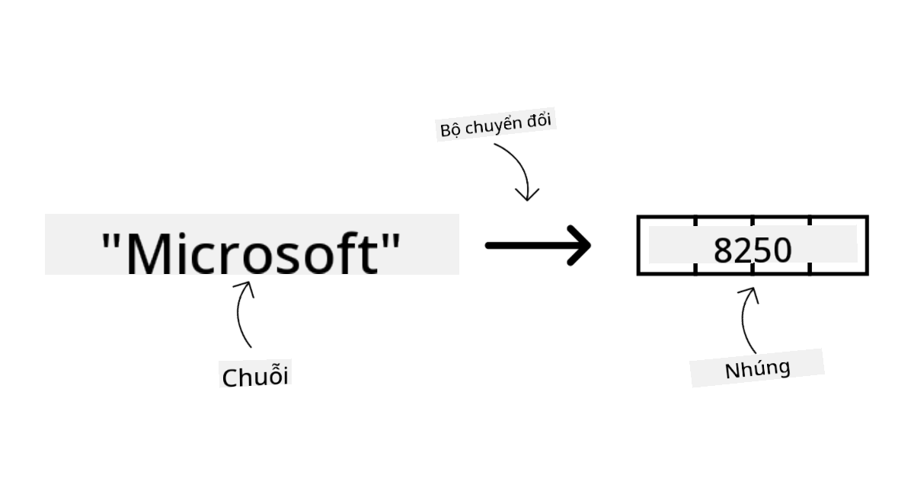
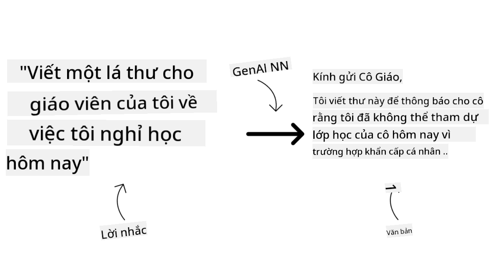
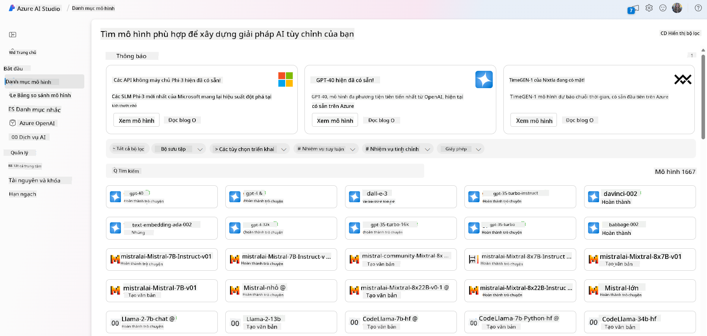
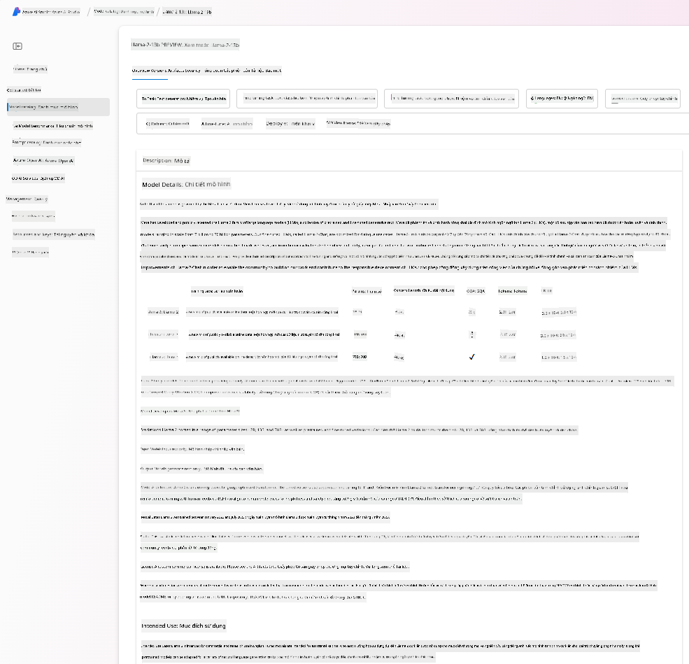
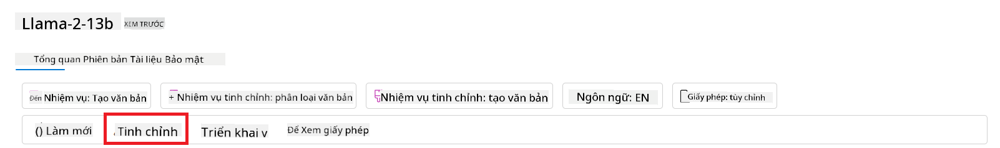
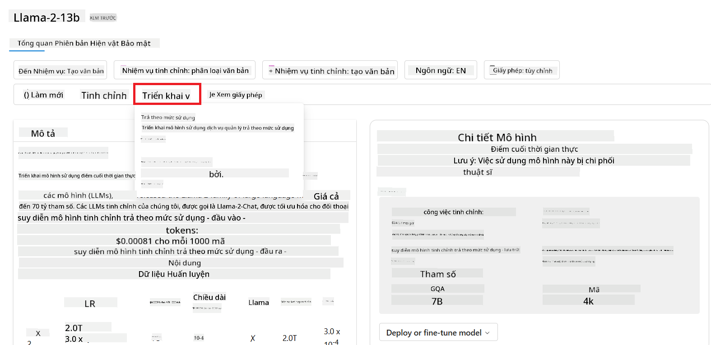
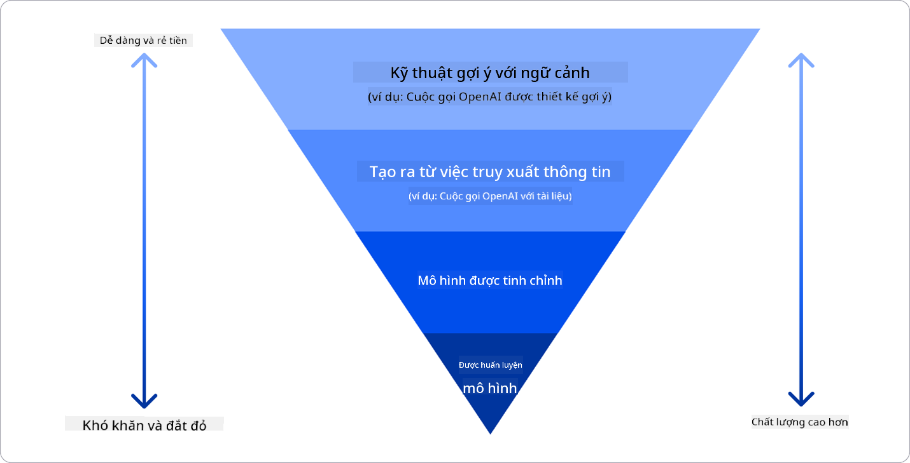

<!--
CO_OP_TRANSLATOR_METADATA:
{
  "original_hash": "e2f686f2eb794941761252ac5e8e090b",
  "translation_date": "2025-07-09T08:33:09+00:00",
  "source_file": "02-exploring-and-comparing-different-llms/README.md",
  "language_code": "vi"
}
-->
# Khám phá và so sánh các LLM khác nhau

> _Nhấn vào hình ảnh trên để xem video bài học này_

Trong bài học trước, chúng ta đã thấy cách Generative AI đang thay đổi bối cảnh công nghệ, cách các Large Language Models (LLMs) hoạt động và cách một doanh nghiệp - như startup của chúng ta - có thể áp dụng chúng vào các trường hợp sử dụng và phát triển! Trong chương này, chúng ta sẽ so sánh và đối chiếu các loại mô hình ngôn ngữ lớn khác nhau để hiểu ưu và nhược điểm của chúng.

Bước tiếp theo trong hành trình của startup là khám phá bối cảnh hiện tại của các LLM và hiểu được mô hình nào phù hợp với trường hợp sử dụng của chúng ta.

## Giới thiệu

Bài học này sẽ bao gồm:

- Các loại LLM khác nhau trong bối cảnh hiện tại.
- Thử nghiệm, lặp lại và so sánh các mô hình khác nhau cho trường hợp sử dụng của bạn trên Azure.
- Cách triển khai một LLM.

## Mục tiêu học tập

Sau khi hoàn thành bài học này, bạn sẽ có thể:

- Lựa chọn mô hình phù hợp cho trường hợp sử dụng của bạn.
- Hiểu cách thử nghiệm, lặp lại và cải thiện hiệu suất của mô hình.
- Biết cách các doanh nghiệp triển khai mô hình.

## Hiểu về các loại LLM khác nhau

LLM có thể được phân loại theo nhiều cách dựa trên kiến trúc, dữ liệu huấn luyện và trường hợp sử dụng. Hiểu được những khác biệt này sẽ giúp startup của chúng ta chọn được mô hình phù hợp cho từng tình huống, cũng như biết cách thử nghiệm, lặp lại và cải thiện hiệu suất.

Có rất nhiều loại mô hình LLM khác nhau, việc lựa chọn mô hình phụ thuộc vào mục đích sử dụng, dữ liệu của bạn, ngân sách và nhiều yếu tố khác.

Tùy thuộc vào việc bạn muốn sử dụng mô hình cho văn bản, âm thanh, video, tạo hình ảnh, v.v., bạn có thể chọn loại mô hình khác nhau.

- **Nhận dạng âm thanh và giọng nói**. Với mục đích này, các mô hình kiểu Whisper là lựa chọn tuyệt vời vì chúng mang tính đa dụng và tập trung vào nhận dạng giọng nói. Chúng được huấn luyện trên nhiều loại âm thanh đa dạng và có khả năng nhận dạng giọng nói đa ngôn ngữ. Tìm hiểu thêm về [mô hình kiểu Whisper tại đây](https://platform.openai.com/docs/models/whisper?WT.mc_id=academic-105485-koreyst).

- **Tạo hình ảnh**. Đối với tạo hình ảnh, DALL-E và Midjourney là hai lựa chọn rất nổi tiếng. DALL-E được cung cấp bởi Azure OpenAI. [Đọc thêm về DALL-E tại đây](https://platform.openai.com/docs/models/dall-e?WT.mc_id=academic-105485-koreyst) và cũng trong Chương 9 của chương trình học này.

- **Tạo văn bản**. Hầu hết các mô hình được huấn luyện để tạo văn bản và bạn có nhiều lựa chọn từ GPT-3.5 đến GPT-4. Chúng có mức giá khác nhau, trong đó GPT-4 là đắt nhất. Bạn nên thử nghiệm trên [Azure OpenAI playground](https://oai.azure.com/portal/playground?WT.mc_id=academic-105485-koreyst) để đánh giá mô hình nào phù hợp nhất với nhu cầu về khả năng và chi phí.

- **Đa phương thức**. Nếu bạn muốn xử lý nhiều loại dữ liệu đầu vào và đầu ra, bạn có thể xem xét các mô hình như [gpt-4 turbo with vision hoặc gpt-4o](https://learn.microsoft.com/azure/ai-services/openai/concepts/models#gpt-4-and-gpt-4-turbo-models?WT.mc_id=academic-105485-koreyst) - các phiên bản mới nhất của OpenAI - có khả năng kết hợp xử lý ngôn ngữ tự nhiên với hiểu biết hình ảnh, cho phép tương tác qua giao diện đa phương thức.

Việc chọn một mô hình đồng nghĩa với việc bạn có được những khả năng cơ bản, tuy nhiên đôi khi vẫn chưa đủ. Thường thì bạn có dữ liệu riêng của công ty mà bạn cần truyền đạt cho LLM. Có một vài cách tiếp cận khác nhau cho việc này, sẽ được đề cập trong các phần tiếp theo.

### Foundation Models và LLMs

Thuật ngữ Foundation Model được [các nhà nghiên cứu Stanford đặt ra](https://arxiv.org/abs/2108.07258?WT.mc_id=academic-105485-koreyst) và được định nghĩa là một mô hình AI đáp ứng một số tiêu chí, như:

- **Chúng được huấn luyện bằng học không giám sát hoặc học tự giám sát**, nghĩa là được huấn luyện trên dữ liệu đa phương thức không có nhãn, và không cần con người chú thích hay gán nhãn dữ liệu trong quá trình huấn luyện.
- **Chúng là các mô hình rất lớn**, dựa trên mạng nơ-ron sâu với hàng tỷ tham số.
- **Chúng thường được thiết kế để làm ‘nền tảng’ cho các mô hình khác**, nghĩa là có thể được dùng làm điểm khởi đầu để xây dựng các mô hình khác dựa trên đó, thông qua việc tinh chỉnh (fine-tuning).

Nguồn ảnh: [Essential Guide to Foundation Models and Large Language Models | by Babar M Bhatti | Medium](https://thebabar.medium.com/essential-guide-to-foundation-models-and-large-language-models-27dab58f7404)

Để làm rõ hơn sự khác biệt này, hãy lấy ChatGPT làm ví dụ. Để xây dựng phiên bản đầu tiên của ChatGPT, một mô hình gọi là GPT-3.5 đã được dùng làm foundation model. Điều này có nghĩa OpenAI đã sử dụng một số dữ liệu đặc thù cho chat để tạo ra phiên bản tinh chỉnh của GPT-3.5, chuyên biệt cho các tình huống hội thoại như chatbot.

Nguồn ảnh: [2108.07258.pdf (arxiv.org)](https://arxiv.org/pdf/2108.07258.pdf?WT.mc_id=academic-105485-koreyst)

### Mô hình mã nguồn mở và mô hình độc quyền

Một cách khác để phân loại LLM là dựa vào việc chúng là mã nguồn mở hay độc quyền.

Mô hình mã nguồn mở là các mô hình được công khai cho mọi người sử dụng. Chúng thường được cung cấp bởi công ty phát triển hoặc cộng đồng nghiên cứu. Những mô hình này cho phép người dùng kiểm tra, chỉnh sửa và tùy biến cho các trường hợp sử dụng khác nhau. Tuy nhiên, chúng không phải lúc nào cũng được tối ưu cho môi trường sản xuất và có thể không hiệu quả bằng các mô hình độc quyền. Ngoài ra, nguồn tài trợ cho các mô hình mã nguồn mở có thể hạn chế, và chúng có thể không được duy trì lâu dài hoặc cập nhật theo nghiên cứu mới nhất. Ví dụ các mô hình mã nguồn mở phổ biến gồm [Alpaca](https://crfm.stanford.edu/2023/03/13/alpaca.html?WT.mc_id=academic-105485-koreyst), [Bloom](https://huggingface.co/bigscience/bloom) và [LLaMA](https://llama.meta.com).

Mô hình độc quyền là các mô hình thuộc sở hữu của một công ty và không được công khai cho người dùng bên ngoài. Những mô hình này thường được tối ưu cho môi trường sản xuất. Tuy nhiên, người dùng không được phép kiểm tra, chỉnh sửa hay tùy biến cho các trường hợp sử dụng khác nhau. Ngoài ra, chúng không phải lúc nào cũng miễn phí và có thể yêu cầu đăng ký hoặc trả phí để sử dụng. Người dùng cũng không kiểm soát được dữ liệu dùng để huấn luyện mô hình, nên phải tin tưởng nhà cung cấp đảm bảo cam kết về bảo mật dữ liệu và sử dụng AI có trách nhiệm. Ví dụ các mô hình độc quyền phổ biến gồm [OpenAI models](https://platform.openai.com/docs/models/overview?WT.mc_id=academic-105485-koreyst), [Google Bard](https://sapling.ai/llm/bard?WT.mc_id=academic-105485-koreyst) hoặc [Claude 2](https://www.anthropic.com/index/claude-2?WT.mc_id=academic-105485-koreyst).

### Embedding, tạo hình ảnh và tạo văn bản, mã nguồn

LLM cũng có thể được phân loại theo loại đầu ra mà chúng tạo ra.

Embedding là tập hợp các mô hình có thể chuyển đổi văn bản thành dạng số, gọi là embedding, một biểu diễn số của văn bản đầu vào. Embedding giúp máy tính hiểu được mối quan hệ giữa các từ hoặc câu và có thể được dùng làm đầu vào cho các mô hình khác, như mô hình phân loại hoặc mô hình phân nhóm, vốn hoạt động tốt hơn với dữ liệu số. Mô hình embedding thường được dùng trong học chuyển giao, khi một mô hình được xây dựng cho một nhiệm vụ thay thế có nhiều dữ liệu, sau đó trọng số mô hình (embedding) được tái sử dụng cho các nhiệm vụ khác. Ví dụ trong nhóm này là [OpenAI embeddings](https://platform.openai.com/docs/models/embeddings?WT.mc_id=academic-105485-koreyst).

Mô hình tạo hình ảnh là các mô hình tạo ra hình ảnh. Chúng thường được dùng cho chỉnh sửa ảnh, tổng hợp ảnh và chuyển đổi ảnh. Các mô hình này thường được huấn luyện trên bộ dữ liệu lớn về hình ảnh, như [LAION-5B](https://laion.ai/blog/laion-5b/?WT.mc_id=academic-105485-koreyst), và có thể tạo ra hình ảnh mới hoặc chỉnh sửa hình ảnh hiện có bằng các kỹ thuật như inpainting, tăng độ phân giải và tô màu. Ví dụ gồm [DALL-E-3](https://openai.com/dall-e-3?WT.mc_id=academic-105485-koreyst) và [Stable Diffusion models](https://github.com/Stability-AI/StableDiffusion?WT.mc_id=academic-105485-koreyst).

Mô hình tạo văn bản và mã nguồn là các mô hình tạo ra văn bản hoặc mã lập trình. Chúng thường được dùng cho tóm tắt văn bản, dịch thuật và trả lời câu hỏi. Mô hình tạo văn bản thường được huấn luyện trên bộ dữ liệu lớn về văn bản, như [BookCorpus](https://www.cv-foundation.org/openaccess/content_iccv_2015/html/Zhu_Aligning_Books_and_ICCV_2015_paper.html?WT.mc_id=academic-105485-koreyst), và có thể tạo ra văn bản mới hoặc trả lời câu hỏi. Mô hình tạo mã nguồn, như [CodeParrot](https://huggingface.co/codeparrot?WT.mc_id=academic-105485-koreyst), thường được huấn luyện trên bộ dữ liệu lớn về mã nguồn, như GitHub, và có thể tạo mã mới hoặc sửa lỗi trong mã hiện có.

### Encoder-Decoder và Decoder-only

Để nói về các loại kiến trúc khác nhau của LLM, hãy dùng một phép ẩn dụ.

Hãy tưởng tượng quản lý của bạn giao cho bạn nhiệm vụ viết một bài kiểm tra cho học sinh. Bạn có hai đồng nghiệp; một người phụ trách tạo nội dung và người kia phụ trách xem xét lại.

Người tạo nội dung giống như mô hình chỉ có Decoder, họ có thể nhìn vào chủ đề và xem những gì bạn đã viết rồi sau đó viết bài học dựa trên đó. Họ rất giỏi trong việc viết nội dung hấp dẫn và đầy đủ thông tin, nhưng không giỏi trong việc hiểu chủ đề và mục tiêu học tập. Một số ví dụ về mô hình Decoder là các mô hình thuộc họ GPT, như GPT-3.

Người xem xét giống như mô hình chỉ có Encoder, họ xem xét bài học đã viết và câu trả lời, nhận ra mối quan hệ giữa chúng và hiểu ngữ cảnh, nhưng không giỏi tạo nội dung. Ví dụ về mô hình chỉ có Encoder là BERT.

Hãy tưởng tượng chúng ta có một người vừa có thể tạo nội dung vừa có thể xem xét lại bài kiểm tra, đó là mô hình Encoder-Decoder. Một số ví dụ là BART và T5.

### Dịch vụ và Mô hình

Bây giờ, hãy nói về sự khác biệt giữa dịch vụ và mô hình. Dịch vụ là sản phẩm được cung cấp bởi nhà cung cấp dịch vụ đám mây, thường là sự kết hợp của các mô hình, dữ liệu và các thành phần khác. Mô hình là thành phần cốt lõi của dịch vụ, thường là một foundation model, như LLM.

Dịch vụ thường được tối ưu cho môi trường sản xuất và dễ sử dụng hơn mô hình thông qua giao diện người dùng đồ họa. Tuy nhiên, dịch vụ không phải lúc nào cũng miễn phí và có thể yêu cầu đăng ký hoặc trả phí để sử dụng, đổi lại người dùng tận dụng được thiết bị và tài nguyên của nhà cung cấp dịch vụ, tối ưu chi phí và dễ dàng mở rộng. Ví dụ về dịch vụ là [Azure OpenAI Service](https://learn.microsoft.com/azure/ai-services/openai/overview?WT.mc_id=academic-105485-koreyst), cung cấp gói trả tiền theo mức sử dụng, nghĩa là người dùng chỉ trả tiền dựa trên lượng sử dụng dịch vụ. Ngoài ra, Azure OpenAI Service còn cung cấp bảo mật cấp doanh nghiệp và khung AI có trách nhiệm bên cạnh các khả năng của mô hình.

Mô hình chỉ là mạng nơ-ron với các tham số, trọng số và các thành phần khác. Cho phép các công ty chạy mô hình tại chỗ, tuy nhiên cần phải mua thiết bị, xây dựng hạ tầng để mở rộng và mua giấy phép hoặc sử dụng mô hình mã nguồn mở. Một mô hình như LLaMA có thể được sử dụng, nhưng cần sức mạnh tính toán để vận hành.

## Cách thử nghiệm và lặp lại với các mô hình khác nhau để hiểu hiệu suất trên Azure

Khi nhóm của chúng ta đã khám phá bối cảnh LLM hiện tại và xác định được một số ứng viên phù hợp cho các tình huống của họ, bước tiếp theo là thử nghiệm các mô hình đó trên dữ liệu và khối lượng công việc của mình. Đây là một quá trình lặp đi lặp lại, được thực hiện qua các thí nghiệm và đo lường.
Hầu hết các mô hình mà chúng tôi đã đề cập trong các đoạn trước (mô hình OpenAI, mô hình mã nguồn mở như Llama2, và các transformer của Hugging Face) đều có sẵn trong [Model Catalog](https://learn.microsoft.com/azure/ai-studio/how-to/model-catalog-overview?WT.mc_id=academic-105485-koreyst) tại [Azure AI Studio](https://ai.azure.com/?WT.mc_id=academic-105485-koreyst).

[Azure AI Studio](https://learn.microsoft.com/azure/ai-studio/what-is-ai-studio?WT.mc_id=academic-105485-koreyst) là một nền tảng đám mây được thiết kế dành cho các nhà phát triển để xây dựng các ứng dụng AI tạo sinh và quản lý toàn bộ vòng đời phát triển - từ thử nghiệm đến đánh giá - bằng cách kết hợp tất cả các dịch vụ Azure AI vào một trung tâm duy nhất với giao diện người dùng thân thiện. Model Catalog trong Azure AI Studio cho phép người dùng:

- Tìm kiếm Foundation Model mà bạn quan tâm trong danh mục - có thể là mô hình độc quyền hoặc mã nguồn mở, lọc theo nhiệm vụ, giấy phép hoặc tên. Để cải thiện khả năng tìm kiếm, các mô hình được tổ chức thành các bộ sưu tập, như bộ sưu tập Azure OpenAI, bộ sưu tập Hugging Face, và nhiều hơn nữa.

- Xem lại thẻ mô hình, bao gồm mô tả chi tiết về mục đích sử dụng và dữ liệu huấn luyện, các ví dụ mã và kết quả đánh giá trên thư viện đánh giá nội bộ.

- So sánh các benchmark giữa các mô hình và bộ dữ liệu có sẵn trong ngành để đánh giá mô hình nào phù hợp với kịch bản kinh doanh, thông qua bảng [Model Benchmarks](https://learn.microsoft.com/azure/ai-studio/how-to/model-benchmarks?WT.mc_id=academic-105485-koreyst).

- Tinh chỉnh mô hình trên dữ liệu huấn luyện tùy chỉnh để cải thiện hiệu suất mô hình trong một khối lượng công việc cụ thể, tận dụng khả năng thử nghiệm và theo dõi của Azure AI Studio.

- Triển khai mô hình gốc đã được huấn luyện sẵn hoặc phiên bản đã được tinh chỉnh lên điểm suy luận thời gian thực từ xa - managed compute - hoặc endpoint API serverless - [trả tiền theo mức sử dụng](https://learn.microsoft.com/azure/ai-studio/how-to/model-catalog-overview#model-deployment-managed-compute-and-serverless-api-pay-as-you-go?WT.mc_id=academic-105485-koreyst) - để các ứng dụng có thể sử dụng.

> [!NOTE]
> Không phải tất cả các mô hình trong danh mục hiện đều có thể được tinh chỉnh và/hoặc triển khai theo hình thức trả tiền theo mức sử dụng. Hãy kiểm tra thẻ mô hình để biết chi tiết về khả năng và giới hạn của mô hình.

## Cải thiện kết quả LLM

Chúng tôi đã cùng nhóm startup của mình khám phá nhiều loại LLM khác nhau và một nền tảng đám mây (Azure Machine Learning) cho phép chúng tôi so sánh các mô hình, đánh giá chúng trên dữ liệu thử nghiệm, cải thiện hiệu suất và triển khai chúng trên các điểm suy luận.

Nhưng khi nào thì nên cân nhắc tinh chỉnh một mô hình thay vì sử dụng mô hình đã được huấn luyện sẵn? Có những cách tiếp cận nào khác để cải thiện hiệu suất mô hình trên các khối lượng công việc cụ thể?

Có một số cách mà doanh nghiệp có thể sử dụng để đạt được kết quả mong muốn từ một LLM. Bạn có thể chọn các loại mô hình khác nhau với mức độ huấn luyện khác nhau khi triển khai LLM trong môi trường sản xuất, với các mức độ phức tạp, chi phí và chất lượng khác nhau. Dưới đây là một số cách tiếp cận khác nhau:

- **Kỹ thuật prompt với ngữ cảnh**. Ý tưởng là cung cấp đủ ngữ cảnh khi bạn đưa prompt để đảm bảo nhận được câu trả lời bạn cần.

- **Retrieval Augmented Generation, RAG**. Dữ liệu của bạn có thể tồn tại trong cơ sở dữ liệu hoặc điểm truy cập web chẳng hạn, để đảm bảo dữ liệu này, hoặc một phần của nó, được đưa vào lúc prompt, bạn có thể truy xuất dữ liệu liên quan và đưa nó vào phần prompt của người dùng.

- **Mô hình được tinh chỉnh**. Ở đây, bạn huấn luyện thêm mô hình trên dữ liệu riêng của mình, giúp mô hình chính xác và phản hồi tốt hơn với nhu cầu của bạn nhưng có thể tốn kém.

Nguồn ảnh: [Four Ways that Enterprises Deploy LLMs | Fiddler AI Blog](https://www.fiddler.ai/blog/four-ways-that-enterprises-deploy-llms?WT.mc_id=academic-105485-koreyst)

### Kỹ thuật Prompt với Ngữ cảnh

Các LLM đã được huấn luyện sẵn hoạt động rất tốt với các nhiệm vụ ngôn ngữ tự nhiên tổng quát, thậm chí chỉ cần gọi chúng với một prompt ngắn, như một câu để hoàn thành hoặc một câu hỏi – gọi là học “zero-shot”.

Tuy nhiên, người dùng càng có thể định hình câu hỏi của mình, với yêu cầu chi tiết và ví dụ – tức là Ngữ cảnh – thì câu trả lời càng chính xác và gần với mong đợi của người dùng hơn. Trong trường hợp này, ta gọi là “one-shot” learning nếu prompt chỉ bao gồm một ví dụ và “few-shot learning” nếu có nhiều ví dụ.
Kỹ thuật prompt với ngữ cảnh là cách tiếp cận tiết kiệm chi phí nhất để bắt đầu.

### Retrieval Augmented Generation (RAG)

LLM có hạn chế là chỉ có thể sử dụng dữ liệu đã được dùng trong quá trình huấn luyện để tạo ra câu trả lời. Điều này có nghĩa là chúng không biết gì về các sự kiện xảy ra sau quá trình huấn luyện, và không thể truy cập thông tin không công khai (như dữ liệu công ty).
Điều này có thể được khắc phục bằng RAG, một kỹ thuật bổ sung prompt với dữ liệu bên ngoài dưới dạng các đoạn tài liệu, đồng thời cân nhắc giới hạn độ dài prompt. Kỹ thuật này được hỗ trợ bởi các công cụ cơ sở dữ liệu Vector (như [Azure Vector Search](https://learn.microsoft.com/azure/search/vector-search-overview?WT.mc_id=academic-105485-koreyst)) giúp truy xuất các đoạn dữ liệu hữu ích từ nhiều nguồn dữ liệu đã được định nghĩa trước và thêm chúng vào Ngữ cảnh của prompt.

Kỹ thuật này rất hữu ích khi doanh nghiệp không có đủ dữ liệu, thời gian hoặc nguồn lực để tinh chỉnh LLM, nhưng vẫn muốn cải thiện hiệu suất trên một khối lượng công việc cụ thể và giảm thiểu rủi ro về việc tạo ra thông tin sai lệch, tức là làm sai lệch thực tế hoặc nội dung có hại.

### Mô hình được tinh chỉnh

Tinh chỉnh là một quá trình tận dụng học chuyển giao để ‘điều chỉnh’ mô hình cho một nhiệm vụ cụ thể hoặc để giải quyết một vấn đề cụ thể. Khác với học few-shot và RAG, nó tạo ra một mô hình mới với các trọng số và độ lệch được cập nhật. Quá trình này cần một tập hợp các ví dụ huấn luyện gồm một đầu vào (prompt) và đầu ra tương ứng (completion).
Đây sẽ là cách tiếp cận ưu tiên nếu:

- **Sử dụng mô hình được tinh chỉnh**. Doanh nghiệp muốn sử dụng các mô hình tinh chỉnh có khả năng thấp hơn (như mô hình embedding) thay vì các mô hình hiệu suất cao, giúp giải pháp tiết kiệm chi phí và nhanh hơn.

- **Xem xét độ trễ**. Độ trễ quan trọng cho một trường hợp sử dụng cụ thể, nên không thể dùng các prompt quá dài hoặc số lượng ví dụ mà mô hình cần học không phù hợp với giới hạn độ dài prompt.

- **Luôn cập nhật**. Doanh nghiệp có nhiều dữ liệu chất lượng cao và nhãn chuẩn xác, cùng nguồn lực cần thiết để duy trì dữ liệu này luôn được cập nhật theo thời gian.

### Mô hình được huấn luyện

Huấn luyện một LLM từ đầu chắc chắn là cách tiếp cận khó khăn và phức tạp nhất, đòi hỏi lượng dữ liệu khổng lồ, nguồn lực có kỹ năng và sức mạnh tính toán phù hợp. Lựa chọn này chỉ nên được cân nhắc trong trường hợp doanh nghiệp có một trường hợp sử dụng chuyên biệt theo lĩnh vực và một lượng lớn dữ liệu tập trung vào lĩnh vực đó.

## Kiểm tra kiến thức

Cách tiếp cận nào có thể giúp cải thiện kết quả hoàn thành của LLM?

1. Kỹ thuật prompt với ngữ cảnh  
1. RAG  
1. Mô hình được tinh chỉnh  

Đáp án: 3, nếu bạn có thời gian, nguồn lực và dữ liệu chất lượng cao, tinh chỉnh là lựa chọn tốt hơn để luôn cập nhật. Tuy nhiên, nếu bạn muốn cải thiện nhanh và thiếu thời gian, nên cân nhắc RAG trước.

## 🚀 Thử thách

Tìm hiểu thêm về cách bạn có thể [sử dụng RAG](https://learn.microsoft.com/azure/search/retrieval-augmented-generation-overview?WT.mc_id=academic-105485-koreyst) cho doanh nghiệp của mình.

## Làm tốt lắm, tiếp tục học hỏi

Sau khi hoàn thành bài học này, hãy xem bộ sưu tập [Generative AI Learning collection](https://aka.ms/genai-collection?WT.mc_id=academic-105485-koreyst) để tiếp tục nâng cao kiến thức về Generative AI!

Hãy đến với Bài học 3, nơi chúng ta sẽ tìm hiểu cách [xây dựng với Generative AI một cách có trách nhiệm](../03-using-generative-ai-responsibly/README.md?WT.mc_id=academic-105485-koreyst)!

**Tuyên bố từ chối trách nhiệm**:  
Tài liệu này đã được dịch bằng dịch vụ dịch thuật AI [Co-op Translator](https://github.com/Azure/co-op-translator). Mặc dù chúng tôi cố gắng đảm bảo độ chính xác, xin lưu ý rằng các bản dịch tự động có thể chứa lỗi hoặc không chính xác. Tài liệu gốc bằng ngôn ngữ gốc của nó nên được coi là nguồn chính xác và đáng tin cậy. Đối với các thông tin quan trọng, nên sử dụng dịch vụ dịch thuật chuyên nghiệp do con người thực hiện. Chúng tôi không chịu trách nhiệm về bất kỳ sự hiểu lầm hoặc giải thích sai nào phát sinh từ việc sử dụng bản dịch này.