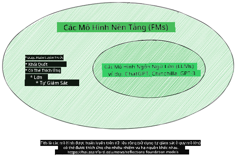
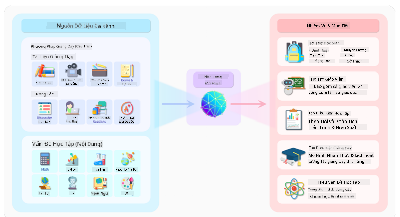
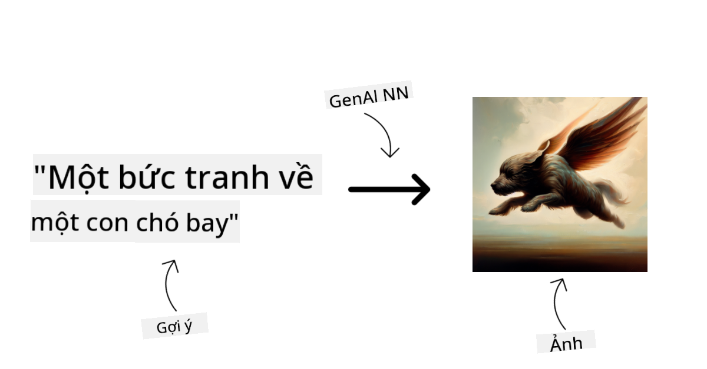
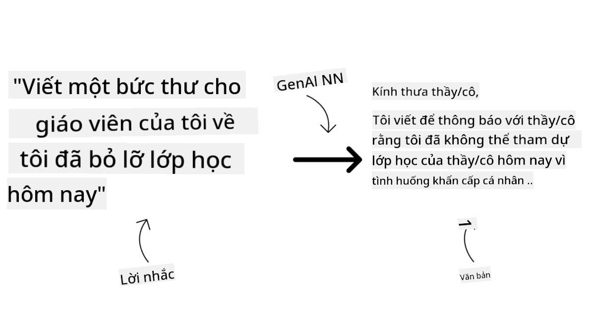
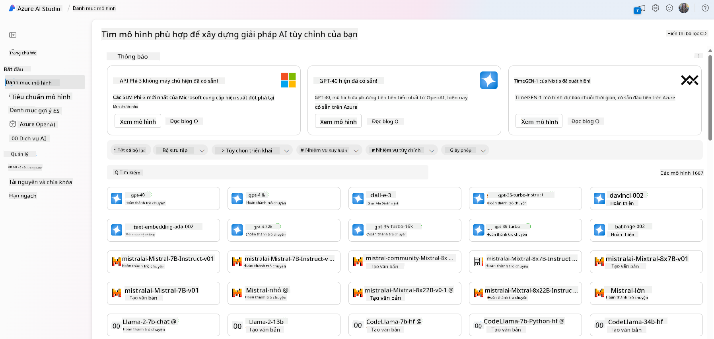
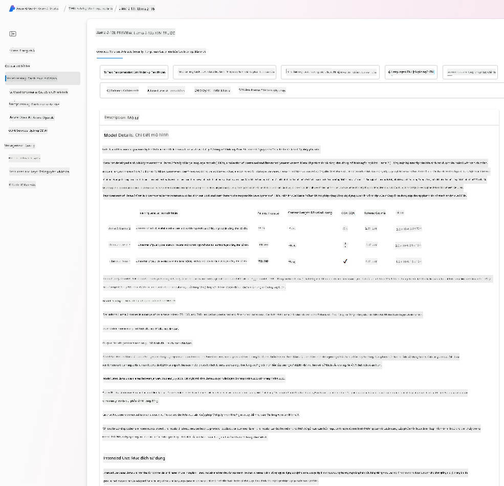
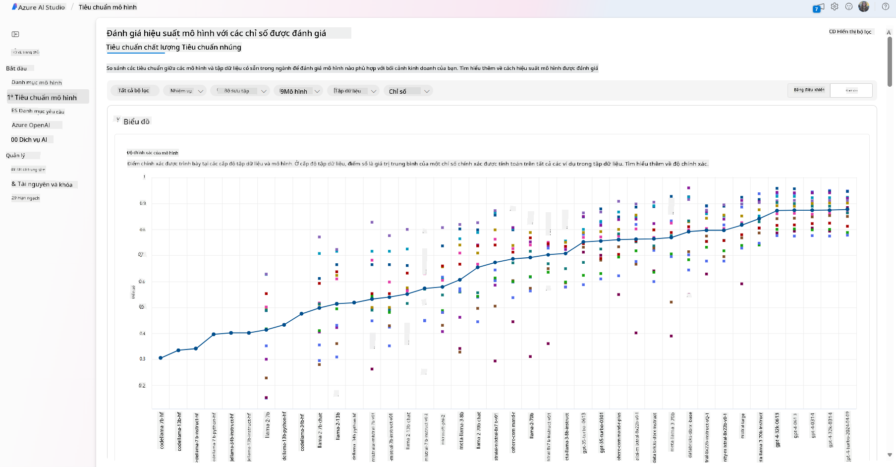
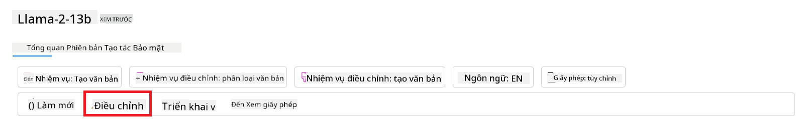
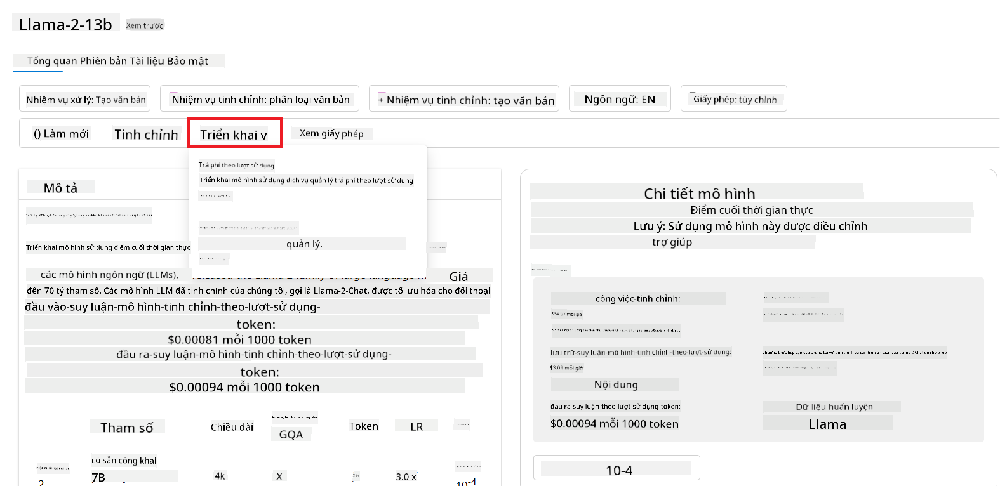

<!--
CO_OP_TRANSLATOR_METADATA:
{
  "original_hash": "e2f686f2eb794941761252ac5e8e090b",
  "translation_date": "2025-05-19T14:12:26+00:00",
  "source_file": "02-exploring-and-comparing-different-llms/README.md",
  "language_code": "vi"
}
-->
# Khám phá và so sánh các LLM khác nhau

> _Nhấn vào hình ảnh trên để xem video của bài học này_

Trong bài học trước, chúng ta đã thấy cách AI Tạo Sinh đang thay đổi bối cảnh công nghệ, cách mà Các Mô Hình Ngôn Ngữ Lớn (LLMs) hoạt động và cách mà một doanh nghiệp - như startup của chúng ta - có thể áp dụng chúng vào các trường hợp sử dụng của mình và phát triển! Trong chương này, chúng ta sẽ so sánh và đối chiếu các loại mô hình ngôn ngữ lớn khác nhau (LLMs) để hiểu ưu và nhược điểm của chúng.

Bước tiếp theo trong hành trình của startup chúng ta là khám phá bối cảnh hiện tại của LLMs và hiểu mô hình nào phù hợp với trường hợp sử dụng của chúng ta.

## Giới thiệu

Bài học này sẽ bao gồm:

- Các loại LLM khác nhau trong bối cảnh hiện tại.
- Thử nghiệm, lặp lại và so sánh các mô hình khác nhau cho trường hợp sử dụng của bạn trong Azure.
- Cách triển khai một LLM.

## Mục tiêu học tập

Sau khi hoàn thành bài học này, bạn sẽ có thể:

- Chọn mô hình phù hợp cho trường hợp sử dụng của bạn.
- Hiểu cách thử nghiệm, lặp lại và cải thiện hiệu suất của mô hình của bạn.
- Biết cách các doanh nghiệp triển khai mô hình.

## Hiểu các loại LLM khác nhau

LLMs có thể có nhiều phân loại dựa trên kiến trúc, dữ liệu đào tạo và trường hợp sử dụng của chúng. Hiểu được những khác biệt này sẽ giúp startup của chúng ta chọn đúng mô hình cho kịch bản và hiểu cách thử nghiệm, lặp lại và cải thiện hiệu suất.

Có nhiều loại mô hình LLM khác nhau, lựa chọn của bạn phụ thuộc vào mục tiêu sử dụng, dữ liệu của bạn, mức độ sẵn sàng chi trả và nhiều yếu tố khác.

Tùy thuộc vào việc bạn muốn sử dụng các mô hình cho văn bản, âm thanh, video, tạo hình ảnh và v.v., bạn có thể chọn một loại mô hình khác.

- **Nhận dạng âm thanh và giọng nói**. Đối với mục đích này, các mô hình kiểu Whisper là lựa chọn tuyệt vời vì chúng đa dụng và nhắm vào nhận dạng giọng nói. Nó được đào tạo trên âm thanh đa dạng và có thể thực hiện nhận dạng giọng nói đa ngôn ngữ. Tìm hiểu thêm về [các mô hình kiểu Whisper tại đây](https://platform.openai.com/docs/models/whisper?WT.mc_id=academic-105485-koreyst).

- **Tạo hình ảnh**. Đối với tạo hình ảnh, DALL-E và Midjourney là hai lựa chọn rất nổi tiếng. DALL-E được cung cấp bởi Azure OpenAI. [Đọc thêm về DALL-E tại đây](https://platform.openai.com/docs/models/dall-e?WT.mc_id=academic-105485-koreyst) và cũng trong Chương 9 của chương trình học này.

- **Tạo văn bản**. Hầu hết các mô hình được đào tạo về tạo văn bản và bạn có nhiều lựa chọn từ GPT-3.5 đến GPT-4. Chúng có giá khác nhau với GPT-4 là đắt nhất. Đáng để xem xét [Azure OpenAI playground](https://oai.azure.com/portal/playground?WT.mc_id=academic-105485-koreyst) để đánh giá mô hình nào phù hợp nhất với nhu cầu của bạn về khả năng và chi phí.

- **Đa phương tiện**. Nếu bạn muốn xử lý nhiều loại dữ liệu đầu vào và đầu ra, bạn có thể muốn xem xét các mô hình như [gpt-4 turbo với vision hoặc gpt-4o](https://learn.microsoft.com/azure/ai-services/openai/concepts/models#gpt-4-and-gpt-4-turbo-models?WT.mc_id=academic-105485-koreyst) - các phiên bản mới nhất của các mô hình OpenAI - có khả năng kết hợp xử lý ngôn ngữ tự nhiên với hiểu biết hình ảnh, cho phép tương tác qua các giao diện đa phương tiện.

Việc chọn mô hình có nghĩa là bạn có được một số khả năng cơ bản, tuy nhiên có thể không đủ. Thường thì bạn có dữ liệu cụ thể của công ty mà bạn cần phải cung cấp cho LLM. Có một vài lựa chọn khác nhau về cách tiếp cận điều đó, sẽ được đề cập trong các phần tiếp theo.

### Mô hình Nền tảng so với LLMs

Thuật ngữ Mô hình Nền tảng được [đặt ra bởi các nhà nghiên cứu Stanford](https://arxiv.org/abs/2108.07258?WT.mc_id=academic-105485-koreyst) và được định nghĩa là một mô hình AI tuân theo một số tiêu chí, chẳng hạn như:

- **Chúng được đào tạo bằng học không giám sát hoặc học tự giám sát**, có nghĩa là chúng được đào tạo trên dữ liệu đa phương tiện không gắn nhãn và không yêu cầu gắn nhãn hay chú thích dữ liệu của con người cho quá trình đào tạo của chúng.
- **Chúng là các mô hình rất lớn**, dựa trên các mạng nơ-ron rất sâu được đào tạo trên hàng tỷ tham số.
- **Chúng thường được dự định để làm nền tảng cho các mô hình khác**, có nghĩa là chúng có thể được sử dụng làm điểm khởi đầu cho các mô hình khác được xây dựng trên đó, điều này có thể được thực hiện bằng cách tinh chỉnh.

Nguồn hình ảnh: [Hướng dẫn cơ bản về Mô hình Nền tảng và Mô hình Ngôn ngữ Lớn | Bởi Babar M Bhatti | Medium
](https://thebabar.medium.com/essential-guide-to-foundation-models-and-large-language-models-27dab58f7404)

Để làm rõ thêm sự khác biệt này, hãy lấy ChatGPT làm ví dụ. Để xây dựng phiên bản đầu tiên của ChatGPT, một mô hình gọi là GPT-3.5 đã được sử dụng làm mô hình nền tảng. Điều này có nghĩa là OpenAI đã sử dụng một số dữ liệu cụ thể về chat để tạo ra một phiên bản tinh chỉnh của GPT-3.5 chuyên về hoạt động tốt trong các kịch bản hội thoại, chẳng hạn như chatbot.

Nguồn hình ảnh: [2108.07258.pdf (arxiv.org)](https://arxiv.org/pdf/2108.07258.pdf?WT.mc_id=academic-105485-koreyst)

### Mô hình Mở so với Mô hình Sở hữu Độc quyền

Một cách khác để phân loại LLMs là liệu chúng có mở nguồn hay sở hữu độc quyền.

Các mô hình mở nguồn là các mô hình được cung cấp cho công chúng và có thể được sử dụng bởi bất kỳ ai. Chúng thường được cung cấp bởi công ty tạo ra chúng hoặc bởi cộng đồng nghiên cứu. Những mô hình này có thể được kiểm tra, sửa đổi và tùy chỉnh cho các trường hợp sử dụng khác nhau trong LLMs. Tuy nhiên, chúng không phải lúc nào cũng được tối ưu hóa cho việc sử dụng trong sản xuất và có thể không hoạt động tốt như các mô hình sở hữu độc quyền. Hơn nữa, tài trợ cho các mô hình mở nguồn có thể bị hạn chế và chúng có thể không được duy trì lâu dài hoặc không được cập nhật với nghiên cứu mới nhất. Ví dụ về các mô hình mở nguồn phổ biến bao gồm [Alpaca](https://crfm.stanford.edu/2023/03/13/alpaca.html?WT.mc_id=academic-105485-koreyst), [Bloom](https://huggingface.co/bigscience/bloom) và [LLaMA](https://llama.meta.com).

Các mô hình sở hữu độc quyền là các mô hình thuộc sở hữu của một công ty và không được cung cấp cho công chúng. Những mô hình này thường được tối ưu hóa cho việc sử dụng trong sản xuất. Tuy nhiên, chúng không được phép kiểm tra, sửa đổi hoặc tùy chỉnh cho các trường hợp sử dụng khác nhau. Hơn nữa, chúng không phải lúc nào cũng được cung cấp miễn phí và có thể yêu cầu một đăng ký hoặc thanh toán để sử dụng. Ngoài ra, người dùng không có quyền kiểm soát dữ liệu được sử dụng để đào tạo mô hình, điều này có nghĩa là họ nên tin tưởng vào chủ sở hữu mô hình để đảm bảo cam kết với quyền riêng tư dữ liệu và sử dụng AI có trách nhiệm. Ví dụ về các mô hình sở hữu độc quyền phổ biến bao gồm [mô hình OpenAI](https://platform.openai.com/docs/models/overview?WT.mc_id=academic-105485-koreyst), [Google Bard](https://sapling.ai/llm/bard?WT.mc_id=academic-105485-koreyst) hoặc [Claude 2](https://www.anthropic.com/index/claude-2?WT.mc_id=academic-105485-koreyst).

### Nhúng so với Tạo hình ảnh so với Tạo văn bản và mã

LLMs cũng có thể được phân loại theo đầu ra mà chúng tạo ra.

Nhúng là một tập hợp các mô hình có thể chuyển đổi văn bản thành một dạng số, gọi là nhúng, là một biểu diễn số của văn bản đầu vào. Nhúng làm cho máy móc dễ dàng hiểu mối quan hệ giữa các từ hoặc câu và có thể được tiêu thụ như đầu vào bởi các mô hình khác, chẳng hạn như mô hình phân loại hoặc mô hình phân cụm có hiệu suất tốt hơn trên dữ liệu số. Các mô hình nhúng thường được sử dụng cho học chuyển giao, nơi một mô hình được xây dựng cho một nhiệm vụ thay thế mà có sẵn nhiều dữ liệu, và sau đó các trọng số mô hình (nhúng) được tái sử dụng cho các nhiệm vụ tiếp theo. Một ví dụ của loại này là [nhúng OpenAI](https://platform.openai.com/docs/models/embeddings?WT.mc_id=academic-105485-koreyst).

Các mô hình tạo hình ảnh là các mô hình tạo ra hình ảnh. Những mô hình này thường được sử dụng để chỉnh sửa hình ảnh, tổng hợp hình ảnh và dịch hình ảnh. Các mô hình tạo hình ảnh thường được đào tạo trên các tập dữ liệu lớn về hình ảnh, chẳng hạn như [LAION-5B](https://laion.ai/blog/laion-5b/?WT.mc_id=academic-105485-koreyst), và có thể được sử dụng để tạo ra hình ảnh mới hoặc chỉnh sửa hình ảnh hiện có với các kỹ thuật vẽ lại, siêu phân giải và tô màu. Ví dụ bao gồm [DALL-E-3](https://openai.com/dall-e-3?WT.mc_id=academic-105485-koreyst) và [các mô hình Khuếch Tán Ổn Định](https://github.com/Stability-AI/StableDiffusion?WT.mc_id=academic-105485-koreyst).

Các mô hình tạo văn bản và mã là các mô hình tạo ra văn bản hoặc mã. Những mô hình này thường được sử dụng để tóm tắt văn bản, dịch thuật và trả lời câu hỏi. Các mô hình tạo văn bản thường được đào tạo trên các tập dữ liệu lớn về văn bản, chẳng hạn như [BookCorpus](https://www.cv-foundation.org/openaccess/content_iccv_2015/html/Zhu_Aligning_Books_and_ICCV_2015_paper.html?WT.mc_id=academic-105485-koreyst), và có thể được sử dụng để tạo ra văn bản mới hoặc trả lời câu hỏi. Các mô hình tạo mã, như [CodeParrot](https://huggingface.co/codeparrot?WT.mc_id=academic-105485-koreyst), thường được đào tạo trên các tập dữ liệu lớn về mã, chẳng hạn như GitHub, và có thể được sử dụng để tạo mã mới hoặc sửa lỗi trong mã hiện có.

### Bộ mã hóa-giải mã so với Chỉ giải mã

Để nói về các loại kiến trúc khác nhau của LLMs, hãy sử dụng một ví dụ tương tự.

Hãy tưởng tượng quản lý của bạn giao cho bạn một nhiệm vụ viết một bài kiểm tra cho sinh viên. Bạn có hai đồng nghiệp; một người chịu trách nhiệm tạo nội dung và người kia chịu trách nhiệm đánh giá chúng.

Người tạo nội dung giống như một mô hình Chỉ giải mã, họ có thể xem xét chủ đề và xem những gì bạn đã viết và sau đó họ có thể viết một khóa học dựa trên đó. Họ rất giỏi trong việc viết nội dung hấp dẫn và thông tin, nhưng họ không giỏi trong việc hiểu chủ đề và các mục tiêu học tập. Một số ví dụ về mô hình Chỉ giải mã là các mô hình gia đình GPT, chẳng hạn như GPT-3.

Người đánh giá giống như một mô hình Chỉ mã hóa, họ xem xét khóa học đã viết và các câu trả lời, nhận thấy mối quan hệ giữa chúng và hiểu ngữ cảnh, nhưng họ không giỏi trong việc tạo nội dung. Một ví dụ về mô hình Chỉ mã hóa là BERT.

Hãy tưởng tượng rằng chúng ta cũng có thể có ai đó vừa có thể tạo và đánh giá bài kiểm tra, đây là một mô hình Bộ mã hóa-giải mã. Một số ví dụ là BART và T5.

### Dịch vụ so với Mô hình

Bây giờ, hãy nói về sự khác biệt giữa một dịch vụ và một mô hình. Một dịch vụ là một sản phẩm được cung cấp bởi một Nhà Cung Cấp Dịch Vụ Đám Mây và thường là sự kết hợp của các mô hình, dữ liệu và các thành phần khác. Một mô hình là thành phần cốt lõi của một dịch vụ và thường là một mô hình nền tảng, chẳng hạn như một LLM.

Các dịch vụ thường được tối ưu hóa cho việc sử dụng trong sản xuất và thường dễ sử dụng hơn các mô hình, thông qua giao diện người dùng đồ họa. Tuy nhiên, các dịch vụ không phải lúc nào cũng được cung cấp miễn phí và có thể yêu cầu một đăng ký hoặc thanh toán để sử dụng, để tận dụng thiết bị và tài nguyên của chủ sở hữu dịch vụ, tối ưu hóa chi phí và dễ dàng mở rộng. Một ví dụ về một dịch vụ là [Azure OpenAI Service](https://learn.microsoft.com/azure/ai-services/openai/overview?WT.mc_id=academic-105485-koreyst), cung cấp một kế hoạch giá theo sử dụng, nghĩa là người dùng được tính phí tỷ lệ thuận với mức độ sử dụng dịch vụ. Ngoài ra, Azure OpenAI Service cung cấp bảo mật cấp doanh nghiệp và một khung AI có trách nhiệm trên các khả năng của các mô hình.

Các mô hình chỉ là Mạng Nơ-ron, với các tham số, trọng số và các yếu tố khác. Cho phép các công ty chạy tại chỗ, tuy nhiên, sẽ cần phải mua thiết bị, xây dựng một cấu trúc để mở rộng và mua giấy phép hoặc sử dụng một mô hình mở nguồn. Một mô hình như LLaMA có sẵn để sử dụng, yêu cầu sức mạnh tính toán để chạy mô hình.

## Cách thử nghiệm và lặp lại với các mô hình khác nhau để hiểu hiệu suất trên Azure

Khi nhóm của chúng ta đã khám phá bối cảnh hiện tại của LLMs và xác định một số ứng viên tốt cho các kịch bản của họ, bước tiếp theo là thử nghiệm chúng trên dữ liệu và khối lượng công việc của họ. Đây là một quá trình lặp lại, được thực hiện bằng các thí nghiệm và đo lường. Hầu hết các mô hình chúng ta đã đề cập trong các đoạn trước (mô hình OpenAI, mô hình mở nguồn như Llama2 và các bộ chuyển đổi Hugging Face) có sẵn trong [Danh mục Mô hình](https://learn.microsoft.com/azure/ai-studio/how-to/model-catalog-overview?WT.mc_id=academic-105485-koreyst) trong [Azure AI Studio](https://ai.azure.com/?WT.mc_id=academic-105485-koreyst).

[Azure AI Studio](https://learn.microsoft.com/azure/ai-studio/what-is-ai-studio?WT.mc_id=academic-105485-koreyst) là một Nền tảng Đám Mây được thiết kế cho các nhà phát triển để xây dựng các ứng dụng AI tạo sinh và quản lý toàn bộ vòng đời phát triển - từ thí nghiệm đến đánh giá - bằng cách kết hợp tất cả các dịch vụ AI của Azure vào một trung tâm duy nhất với giao diện người dùng đồ họa tiện lợi. Danh mục Mô hình trong Azure AI Studio cho phép người dùng:

- Tìm mô hình Nền tảng quan tâm trong danh mục - dù là sở hữu độc quyền hay mở nguồn, lọc theo nhiệm vụ, giấy phép hoặc tên. Để cải thiện khả năng tìm kiếm, các mô hình được tổ chức thành các bộ sưu tập, như bộ sưu tập Azure OpenAI, bộ sưu tập Hugging Face và nhiều hơn nữa.

- Xem xét thẻ mô hình, bao gồm mô tả chi tiết về mục đích sử dụng và dữ liệu đào tạo, mẫu mã và kết quả đánh giá trên thư viện đánh giá nội bộ.

- So sánh các tiêu chuẩn giữa các mô hình và tập dữ liệu có sẵn trong ngành để đánh giá mô hình nào phù hợp với kịch bản kinh doanh, thông qua bảng điều khiển [Model Benchmarks](https://learn.microsoft.com/azure/ai-studio/how-to/model-benchmarks?WT.mc_id=academic-105485-koreyst).

- Tinh chỉnh mô hình trên dữ liệu đào tạo tùy chỉnh để cải thiện hiệu suất mô hình trong một khối lượng công việc cụ thể, tận dụng khả năng thử nghiệm và theo dõi của Azure AI Studio.

- Triển khai mô hình gốc đã được đào tạo trước hoặc phiên bản đã tinh chỉnh đến một điểm cuối suy luận thời gian thực từ xa - tính toán quản lý - hoặc điểm cuối api không máy chủ - [trả theo mức sử dụng](https://learn.microsoft.com/azure/ai-studio/how-to/model-catalog-overview#model-deployment-managed-compute-and-serverless-api-pay-as-you-go?WT.mc_id=academic-105485-koreyst) - để cho phép các ứng dụng tiêu thụ nó.

> [!NOTE]
> Không phải tất cả các mô hình trong danh mục đều có sẵn để tinh chỉnh và/hoặc triển khai trả theo mức sử dụng. Kiểm tra thẻ mô hình để biết chi tiết về khả năng và hạn chế của mô hình.

## Cải thiện kết quả LLM

Chúng tôi đã cùng nhóm khởi nghiệp khám phá các loại LLM khác nhau và một Nền tảng Đám mây (Azure Machine Learning) cho phép chúng tôi so sánh các mô hình khác nhau, đánh giá chúng trên dữ liệu kiểm tra, cải thiện hiệu suất và triển khai chúng trên các điểm cuối suy luận.

Nhưng khi nào họ nên cân nhắc tinh chỉnh một mô hình thay vì sử dụng một mô hình đã được đào tạo trước? Có những cách tiếp cận khác để cải thiện hiệu suất mô hình trong các khối lượng công việc cụ thể không?

Có một số cách tiếp cận mà doanh nghiệp có thể sử dụng để đạt được kết quả cần thiết từ một LLM. Bạn có thể chọn các loại mô hình khác nhau với các mức độ đào tạo khác nhau khi triển khai một LLM trong sản xuất, với các mức độ phức tạp, chi phí và chất lượng khác nhau. Dưới đây là một số cách tiếp cận khác nhau:

- **Kỹ thuật gợi ý với ngữ cảnh**. Ý tưởng là cung cấp đủ ngữ cảnh khi bạn gợi ý để đảm bảo bạn nhận được phản hồi cần thiết.

- **Tạo thế hệ tăng cường truy xuất, RAG**. Dữ liệu của bạn có thể tồn tại trong cơ sở dữ liệu hoặc điểm cuối web chẳng hạn, để đảm bảo dữ liệu này hoặc một phần của nó được bao gồm tại thời điểm gợi ý, bạn có thể truy xuất dữ liệu liên quan và đưa nó vào phần gợi ý của người dùng.

- **Mô hình tinh chỉnh**. Ở đây, bạn đào tạo mô hình thêm trên dữ liệu của riêng bạn, dẫn đến mô hình chính xác hơn và đáp ứng nhu cầu của bạn nhưng có thể tốn kém.

Nguồn ảnh: [Four Ways that Enterprises Deploy LLMs | Fiddler AI Blog](https://www.fiddler.ai/blog/four-ways-that-enterprises-deploy-llms?WT.mc_id=academic-105485-koreyst)

### Kỹ thuật Gợi ý với Ngữ cảnh

Các LLM đã được đào tạo trước hoạt động rất tốt trên các nhiệm vụ ngôn ngữ tự nhiên tổng quát, ngay cả khi gọi chúng với một gợi ý ngắn, như một câu để hoàn thành hoặc một câu hỏi – cái gọi là học "zero-shot".

Tuy nhiên, càng nhiều người dùng có thể định hình câu hỏi của họ, với yêu cầu chi tiết và ví dụ – Ngữ cảnh – thì câu trả lời càng chính xác và gần với kỳ vọng của người dùng. Trong trường hợp này, chúng ta nói về học "one-shot" nếu gợi ý chỉ bao gồm một ví dụ và "few shot learning" nếu bao gồm nhiều ví dụ.
Kỹ thuật gợi ý với ngữ cảnh là cách tiếp cận hiệu quả về chi phí nhất để bắt đầu.

### Tạo thế hệ Tăng cường Truy xuất (RAG)

LLM có hạn chế là chúng chỉ có thể sử dụng dữ liệu đã được sử dụng trong quá trình đào tạo để tạo ra câu trả lời. Điều này có nghĩa là chúng không biết gì về các sự kiện đã xảy ra sau quá trình đào tạo của chúng và chúng không thể truy cập thông tin không công khai (như dữ liệu công ty).
Điều này có thể được khắc phục thông qua RAG, một kỹ thuật bổ sung gợi ý với dữ liệu bên ngoài dưới dạng các đoạn tài liệu, xem xét các giới hạn độ dài gợi ý. Điều này được hỗ trợ bởi các công cụ cơ sở dữ liệu Vector (như [Azure Vector Search](https://learn.microsoft.com/azure/search/vector-search-overview?WT.mc_id=academic-105485-koreyst)) truy xuất các đoạn hữu ích từ các nguồn dữ liệu định trước khác nhau và thêm chúng vào Ngữ cảnh gợi ý.

Kỹ thuật này rất hữu ích khi một doanh nghiệp không có đủ dữ liệu, đủ thời gian hoặc nguồn lực để tinh chỉnh một LLM, nhưng vẫn muốn cải thiện hiệu suất trên một khối lượng công việc cụ thể và giảm rủi ro tạo ra thông tin sai lệch, tức là làm sai lệch thực tế hoặc nội dung có hại.

### Mô hình tinh chỉnh

Tinh chỉnh là một quá trình sử dụng học chuyển giao để 'thích ứng' mô hình với một nhiệm vụ hạ nguồn hoặc để giải quyết một vấn đề cụ thể. Khác với học vài lần và RAG, nó tạo ra một mô hình mới, với trọng số và độ lệch được cập nhật. Nó yêu cầu một tập hợp các ví dụ đào tạo bao gồm một đầu vào duy nhất (gợi ý) và đầu ra liên quan của nó (hoàn thành).
Đây sẽ là cách tiếp cận ưu tiên nếu:

- **Sử dụng các mô hình tinh chỉnh**. Một doanh nghiệp muốn sử dụng các mô hình tinh chỉnh kém khả năng hơn (như các mô hình nhúng) thay vì các mô hình hiệu suất cao, dẫn đến một giải pháp hiệu quả về chi phí và nhanh chóng.

- **Xem xét độ trễ**. Độ trễ quan trọng đối với một trường hợp sử dụng cụ thể, do đó không thể sử dụng các gợi ý rất dài hoặc số lượng ví dụ cần học từ mô hình không phù hợp với giới hạn độ dài gợi ý.

- **Cập nhật liên tục**. Một doanh nghiệp có nhiều dữ liệu chất lượng cao và nhãn sự thật nền tảng và các nguồn lực cần thiết để duy trì dữ liệu này cập nhật theo thời gian.

### Mô hình đào tạo

Đào tạo một LLM từ đầu chắc chắn là cách tiếp cận khó nhất và phức tạp nhất để áp dụng, đòi hỏi lượng dữ liệu lớn, nguồn lực có kỹ năng và sức mạnh tính toán phù hợp. Tùy chọn này chỉ nên được xem xét trong một kịch bản mà một doanh nghiệp có một trường hợp sử dụng cụ thể theo lĩnh vực và một lượng lớn dữ liệu tập trung theo lĩnh vực.

## Kiểm tra kiến thức

Điều gì có thể là một cách tiếp cận tốt để cải thiện kết quả hoàn thành LLM?

1. Kỹ thuật gợi ý với ngữ cảnh
1. RAG
1. Mô hình tinh chỉnh

A:3, nếu bạn có thời gian và nguồn lực và dữ liệu chất lượng cao, tinh chỉnh là lựa chọn tốt hơn để cập nhật. Tuy nhiên, nếu bạn đang tìm cách cải thiện mọi thứ và thiếu thời gian thì đáng xem xét RAG trước.

## 🚀 Thử thách

Tìm hiểu thêm về cách bạn có thể [sử dụng RAG](https://learn.microsoft.com/azure/search/retrieval-augmented-generation-overview?WT.mc_id=academic-105485-koreyst) cho doanh nghiệp của mình.

## Làm tốt, Tiếp tục Học tập của Bạn

Sau khi hoàn thành bài học này, hãy xem bộ sưu tập [Học tập AI Tạo sinh](https://aka.ms/genai-collection?WT.mc_id=academic-105485-koreyst) của chúng tôi để tiếp tục nâng cao kiến thức về AI Tạo sinh của bạn!

Hãy đến với Bài học 3 nơi chúng ta sẽ xem xét cách [xây dựng với AI Tạo sinh một cách có trách nhiệm](../03-using-generative-ai-responsibly/README.md?WT.mc_id=academic-105485-koreyst)!

**Tuyên bố miễn trừ trách nhiệm**:  
Tài liệu này đã được dịch bằng dịch vụ dịch thuật AI [Co-op Translator](https://github.com/Azure/co-op-translator). Mặc dù chúng tôi cố gắng đảm bảo độ chính xác, xin lưu ý rằng các bản dịch tự động có thể chứa lỗi hoặc không chính xác. Tài liệu gốc bằng ngôn ngữ gốc nên được coi là nguồn đáng tin cậy. Đối với thông tin quan trọng, khuyến nghị sử dụng dịch vụ dịch thuật chuyên nghiệp của con người. Chúng tôi không chịu trách nhiệm về bất kỳ sự hiểu lầm hoặc diễn giải sai nào phát sinh từ việc sử dụng bản dịch này.