# Khám phá và so sánh các LLM khác nhau

[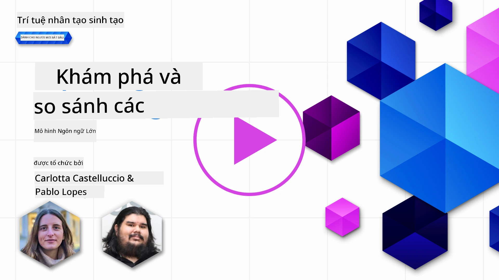](https://youtu.be/KIRUeDKscfI?si=8BHX1zvwzQBn-PlK)

> _Nhấp vào hình ảnh trên để xem video của bài học này_

Với bài học trước, chúng ta đã thấy cách Trí tuệ nhân tạo Tạo sinh (Generative AI) đang thay đổi cảnh quan công nghệ, cách các Mô hình Ngôn ngữ Lớn (LLMs) hoạt động và cách một doanh nghiệp - như công ty khởi nghiệp của chúng ta - có thể áp dụng chúng cho các trường hợp sử dụng và phát triển! Trong chương này, chúng ta sẽ xem xét để so sánh và đối chiếu các loại mô hình ngôn ngữ lớn khác nhau để hiểu ưu và nhược điểm của chúng.

Bước tiếp theo trong hành trình của startup chúng ta là khám phá cảnh quan LLM hiện tại và hiểu xem mô hình nào phù hợp với trường hợp sử dụng của mình.

## Giới thiệu

Bài học này sẽ bao gồm:

- Các loại LLM khác nhau trong cảnh quan hiện tại.
- Thử nghiệm, lặp lại và so sánh các mô hình khác nhau cho trường hợp sử dụng của bạn trên Azure.
- Cách triển khai một LLM.

## Mục tiêu học tập

Sau khi hoàn thành bài học này, bạn sẽ có thể:

- Lựa chọn mô hình phù hợp cho trường hợp sử dụng của bạn.
- Hiểu cách thử nghiệm, lặp lại và cải thiện hiệu suất của mô hình.
- Biết cách doanh nghiệp triển khai các mô hình.

## Hiểu các loại LLM khác nhau

LLM có thể được phân loại dựa trên kiến trúc, dữ liệu huấn luyện và trường hợp sử dụng. Hiểu những khác biệt này sẽ giúp startup của chúng ta chọn mô hình phù hợp với kịch bản, đồng thời hiểu cách thử nghiệm, lặp lại và cải thiện hiệu suất.

Có nhiều loại mô hình LLM khác nhau, sự lựa chọn của bạn phụ thuộc vào mục đích sử dụng, dữ liệu của bạn, mức chi phí bạn sẵn sàng chi trả và nhiều yếu tố khác.

Tùy thuộc vào việc bạn muốn sử dụng mô hình cho văn bản, âm thanh, video, tạo ảnh,... bạn có thể lựa chọn một loại mô hình khác biệt.

- **Nhận dạng âm thanh và giọng nói**. Mô hình kiểu Whisper vẫn hữu ích như những mô hình nhận dạng giọng nói đa năng, nhưng hiện tại các lựa chọn cho sản xuất cũng bao gồm mô hình chuyển giọng nói thành văn bản mới hơn như `gpt-4o-transcribe`, `gpt-4o-mini-transcribe`, và các biến thể diarization. Hãy đánh giá phạm vi ngôn ngữ, khả năng phân tách giọng nói, hỗ trợ thời gian thực, độ trễ và chi phí cho kịch bản của bạn. Tìm hiểu thêm trong [tài liệu chuyển giọng nói thành văn bản của OpenAI](https://platform.openai.com/docs/guides/speech-to-text?WT.mc_id=academic-105485-koreyst).

- **Tạo hình ảnh**. DALL-E và Midjourney là các lựa chọn nổi tiếng để tạo ảnh, nhưng API hình ảnh hiện tại của OpenAI tập trung vào các mô hình GPT Image như `gpt-image-2`, trong khi các gia đình mô hình Stable Diffusion, Imagen, Flux và các mô hình khác cũng là lựa chọn phổ biến. So sánh độ chính xác trước lệnh, hỗ trợ chỉnh sửa, kiểm soát phong cách, yêu cầu an toàn và cấp phép. Tìm hiểu thêm trong [hướng dẫn tạo hình ảnh của OpenAI](https://platform.openai.com/docs/guides/images?WT.mc_id=academic-105485-koreyst) và Chương 9 của chương trình học này.

- **Tạo văn bản**. Các mô hình văn bản giờ đây bao gồm các mô hình tiên phong, mô hình suy luận, mô hình nhỏ độ trễ thấp và mô hình trọng số mở. Ví dụ hiện tại gồm các mô hình OpenAI GPT-5.x, Anthropic Claude 4.x, Google Gemini 3.x, Meta Llama 4 và các mô hình Mistral. Đừng chỉ chọn dựa trên ngày phát hành hay giá; hãy so sánh chất lượng nhiệm vụ, độ trễ, kích thước cửa sổ ngữ cảnh, sử dụng công cụ, hành vi an toàn, khả năng sẵn có theo vùng và tổng chi phí. [Danh mục mô hình của Microsoft Foundry](https://ai.azure.com/catalog?WT.mc_id=academic-105485-koreyst) là nơi tốt để so sánh các mô hình có trên Azure.

- **Đa phương thức**. Nhiều mô hình hiện nay có thể xử lý nhiều hơn chỉ văn bản. Một số nhận đầu vào ảnh, âm thanh hoặc video; một số có thể gọi công cụ; và các mô hình chuyên biệt có thể tạo hình ảnh, âm thanh hoặc video. Ví dụ, mô hình hiện tại của OpenAI hỗ trợ đầu vào văn bản và hình ảnh, mô hình Gemini có thể hỗ trợ văn bản, mã, hình ảnh, âm thanh và video tùy biến thể, còn Llama 4 Scout và Maverick là các mô hình trọng số mở đa phương thức bẩm sinh. Luôn kiểm tra thẻ mô hình để biết các hình thức đầu vào và đầu ra được hỗ trợ trước khi xây dựng quy trình làm việc quanh nó.

Việc chọn một mô hình nghĩa là bạn có các khả năng cơ bản, tuy nhiên có thể chưa đủ. Thường thì bạn có dữ liệu riêng của công ty cần phải cho LLM biết đến. Có một vài cách tiếp cận khác nhau, sẽ được đề cập thêm trong các phần tiếp theo.

### Mô hình nền tảng và LLM

Thuật ngữ Mô hình Nền tảng được [các nhà nghiên cứu Stanford đặt ra](https://arxiv.org/abs/2108.07258?WT.mc_id=academic-105485-koreyst) và định nghĩa là một mô hình AI đáp ứng một số tiêu chí, như:

- **Chúng được huấn luyện bằng học không giám sát hoặc tự giám sát**, nghĩa là được huấn luyện trên dữ liệu đa phương thức không có nhãn và không yêu cầu chú thích hay gán nhãn dữ liệu thủ công trong quá trình huấn luyện.
- **Chúng là các mô hình rất lớn**, dựa trên mạng nơ-ron sâu với hàng tỷ tham số.
- **Chúng thường được dùng làm ‘nền tảng’ cho các mô hình khác**, có nghĩa là có thể dùng làm điểm khởi đầu để xây dựng các mô hình mới bằng cách tinh chỉnh (fine-tune).

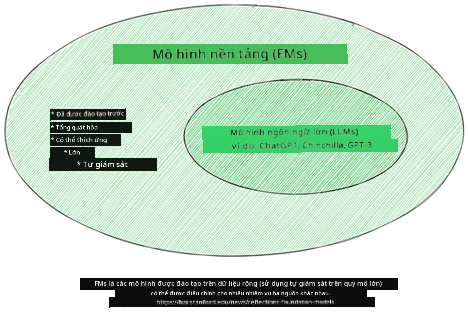

Nguồn ảnh: [Essential Guide to Foundation Models and Large Language Models | by Babar M Bhatti | Medium
](https://thebabar.medium.com/essential-guide-to-foundation-models-and-large-language-models-27dab58f7404)

Để làm rõ hơn sự khác biệt này, hãy lấy ChatGPT làm ví dụ lịch sử. Các phiên bản đầu tiên của ChatGPT dùng GPT-3.5 làm mô hình nền tảng. OpenAI sau đó dùng dữ liệu đặc thù cho chat và kỹ thuật căn chỉnh để tạo phiên bản tinh chỉnh có hiệu suất tốt hơn trong các kịch bản hội thoại, như chatbot. Các dịch vụ AI hiện đại thường điều phối giữa các biến thể mô hình khác nhau, nên tên dịch vụ và tên mô hình cơ sở không phải lúc nào cũng giống nhau.

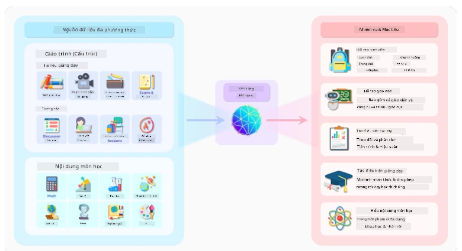

Nguồn ảnh: [2108.07258.pdf (arxiv.org)](https://arxiv.org/pdf/2108.07258.pdf?WT.mc_id=academic-105485-koreyst)

### Mô hình mở trọng số/mã nguồn so với mô hình độc quyền

Một cách khác để phân loại LLM là dựa trên việc chúng có trọng số/mã nguồn mở hay là mô hình độc quyền.

Mô hình mã nguồn mở và trọng số mở cho phép truy xuất, tải xuống hay tùy chỉnh các artefact mô hình, nhưng giấy phép của chúng khác nhau. Một số hoàn toàn mở, một số khác là mô hình trọng số mở với các hạn chế sử dụng. Chúng hữu ích khi doanh nghiệp cần kiểm soát triển khai, vị trí dữ liệu, chi phí hoặc tùy chỉnh. Tuy nhiên, nhóm vẫn cần kiểm tra điều khoản giấy phép, chi phí phục vụ, bảo trì, cập nhật bảo mật và chất lượng đánh giá trước khi sử dụng trong sản xuất. Ví dụ bao gồm [Meta Llama 4](https://ai.meta.com/blog/llama-4-multimodal-intelligence/?WT.mc_id=academic-105485-koreyst), một số [mô hình Mistral](https://docs.mistral.ai/models/overview?WT.mc_id=academic-105485-koreyst), và nhiều mô hình trên [Hugging Face](https://huggingface.co/models?WT.mc_id=academic-105485-koreyst).

Mô hình độc quyền thuộc sở hữu và được cung cấp bởi một nhà cung cấp. Các mô hình này thường được tối ưu cho sử dụng sản xuất được quản lý và có thể cung cấp hỗ trợ mạnh mẽ, hệ thống an toàn, tích hợp công cụ và khả năng mở rộng. Tuy nhiên khách hàng thường không thể kiểm tra hay chỉnh sửa trọng số, và phải xem xét điều khoản của nhà cung cấp về bảo mật, lưu trữ, tuân thủ và sử dụng hợp lệ. Ví dụ bao gồm [mô hình OpenAI](https://platform.openai.com/docs/models?WT.mc_id=academic-105485-koreyst), [Google Gemini](https://deepmind.google/models/gemini/pro/?WT.mc_id=academic-105485-koreyst), và [Anthropic Claude](https://platform.claude.com/docs/en/about-claude/models/overview?WT.mc_id=academic-105485-koreyst).

### Embedding so với tạo ảnh so với tạo văn bản và mã

LLM cũng có thể được phân loại theo đầu ra mà chúng tạo ra.

Embeddings là tập các mô hình có thể chuyển văn bản sang dạng số, gọi là embedding, một biểu diễn số của văn bản đầu vào. Embeddings giúp máy hiểu mối quan hệ giữa các từ hoặc câu và có thể được dùng làm đầu vào cho các mô hình khác, như phân loại hoặc nhóm, có hiệu suất tốt hơn trên dữ liệu số. Mô hình embedding thường dùng cho học chuyển giao, nơi mô hình được xây dựng cho nhiệm vụ đại diện có nhiều dữ liệu, sau đó trọng số mô hình (embeddings) được tái sử dụng cho các nhiệm vụ hạ nguồn khác. Một ví dụ là [embedding của OpenAI](https://platform.openai.com/docs/models/embeddings?WT.mc_id=academic-105485-koreyst).

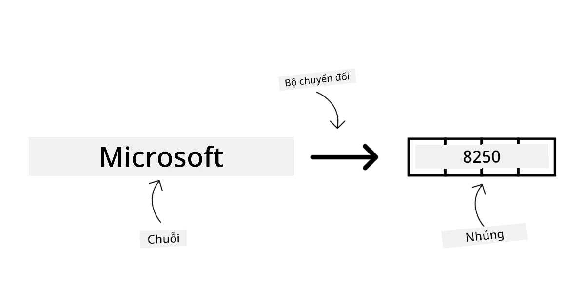

Mô hình tạo ảnh là các mô hình tạo ra hình ảnh. Chúng thường dùng cho chỉnh sửa ảnh, tổng hợp ảnh và dịch ảnh. Mô hình tạo ảnh được huấn luyện trên các bộ dữ liệu lớn như [LAION-5B](https://laion.ai/blog/laion-5b/?WT.mc_id=academic-105485-koreyst), và có thể dùng tạo ảnh mới hoặc chỉnh sửa ảnh hiện có bằng các kỹ thuật vá ảnh, tăng độ phân giải và tô màu. Ví dụ gồm [mô hình GPT Image](https://platform.openai.com/docs/guides/images?WT.mc_id=academic-105485-koreyst), [mô hình Stable Diffusion](https://github.com/Stability-AI/StableDiffusion?WT.mc_id=academic-105485-koreyst), và mô hình Imagen.

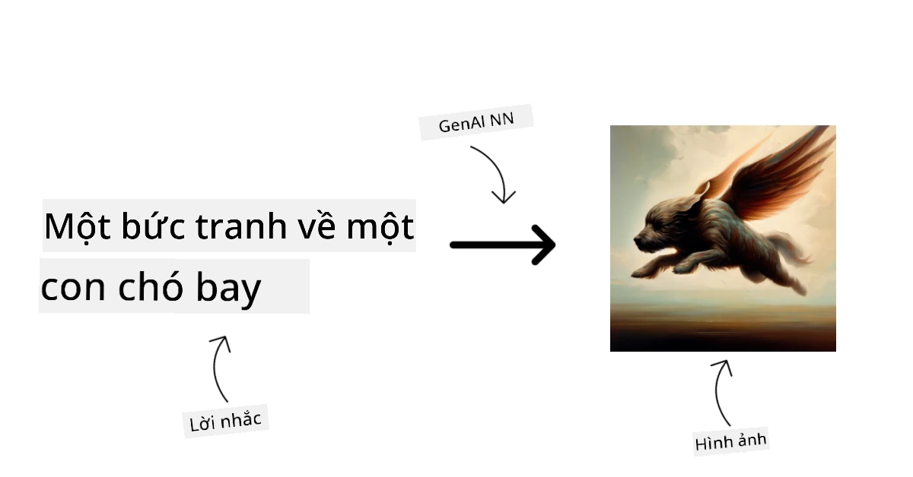

Mô hình tạo văn bản và mã là các mô hình tạo ra văn bản hoặc mã lập trình. Chúng thường dùng cho tóm tắt văn bản, dịch thuật và trả lời câu hỏi. Mô hình tạo văn bản được huấn luyện trên bộ dữ liệu lớn như [BookCorpus](https://www.cv-foundation.org/openaccess/content_iccv_2015/html/Zhu_Aligning_Books_and_ICCV_2015_paper.html?WT.mc_id=academic-105485-koreyst), có thể dùng để tạo văn bản mới hoặc trả lời câu hỏi. Mô hình tạo mã, như [CodeParrot](https://huggingface.co/codeparrot?WT.mc_id=academic-105485-koreyst), được huấn luyện trên bộ dữ liệu mã lớn như GitHub, có thể tạo mã mới hoặc sửa lỗi trong mã hiện có.

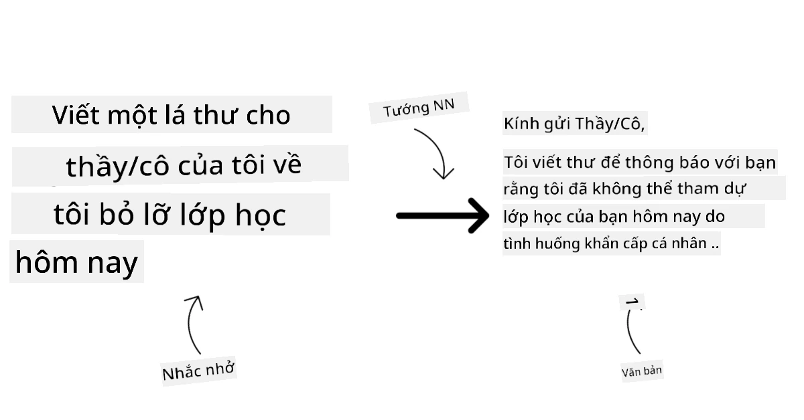

### Kiến trúc Encoder-Decoder so với chỉ Decoder

Để nói về các loại kiến trúc khác nhau của LLM, chúng ta hãy sử dụng một phép ẩn dụ.

Hãy tưởng tượng quản lý giao cho bạn nhiệm vụ viết một bài kiểm tra cho sinh viên. Bạn có hai đồng nghiệp; một người phụ trách tạo nội dung và người còn lại chịu trách nhiệm xem lại.

Người tạo nội dung giống như mô hình chỉ có decoder: họ có thể nhìn vào chủ đề, xem những gì bạn đã viết và tiếp tục tạo nội dung dựa trên ngữ cảnh đó. Họ rất giỏi trong viết nội dung hấp dẫn và nhiều thông tin, nhưng không phải lúc nào cũng là lựa chọn tốt nhất khi nhiệm vụ chỉ là phân loại, truy xuất hoặc mã hóa thông tin. Ví dụ về các gia đình mô hình chỉ decoder bao gồm các mô hình GPT và Llama.

Người xem xét giống như mô hình chỉ có Encoder, họ xem phần khóa học đã viết và câu trả lời, chú ý tới mối quan hệ giữa chúng và hiểu ngữ cảnh, nhưng họ không giỏi tạo nội dung. Ví dụ mô hình chỉ Encoder là BERT.

Hãy tưởng tượng cũng có thể có người vừa tạo vừa xem xét bài kiểm tra, đó là mô hình Encoder-Decoder. Ví dụ gồm BART và T5.

### Dịch vụ so với Mô hình

Bây giờ, hãy nói về sự khác biệt giữa dịch vụ và mô hình. Dịch vụ là sản phẩm do Nhà cung cấp Dịch vụ Đám mây cung cấp, thường là sự kết hợp của các mô hình, dữ liệu và các thành phần khác. Mô hình là phần lõi của dịch vụ, thường là mô hình nền tảng như LLM.

Dịch vụ thường được tối ưu cho sử dụng sản xuất và thường dễ dùng hơn mô hình qua giao diện người dùng đồ họa. Tuy nhiên, dịch vụ không phải lúc nào cũng miễn phí, có thể yêu cầu đăng ký hoặc trả phí để sử dụng, đổi lại bạn tận dụng thiết bị và nguồn lực của chủ dịch vụ, tối ưu chi phí và mở rộng dễ dàng. Ví dụ dịch vụ là [Dịch vụ Azure OpenAI](https://learn.microsoft.com/azure/ai-services/openai/overview?WT.mc_id=academic-105485-koreyst), cung cấp kế hoạch trả theo mức sử dụng, nghĩa là người dùng bị tính phí dựa trên mức độ sử dụng dịch vụ. Dịch vụ Azure OpenAI cũng cung cấp bảo mật cấp doanh nghiệp và khuôn khổ AI có trách nhiệm bên cạnh khả năng của mô hình.

Mô hình là artefact của mạng nơ-ron: các tham số, trọng số, kiến trúc, tokenizer và cấu hình hỗ trợ. Chạy mô hình cục bộ hoặc trong môi trường riêng cần phần cứng phù hợp, hạ tầng phục vụ, giám sát, và giấy phép mã nguồn mở/trọng số mở tương thích hoặc giấy phép thương mại. Các mô hình trọng số mở như Llama 4 hay Mistral có thể tự lưu trữ, nhưng vẫn đòi hỏi năng lực tính toán và chuyên môn vận hành.

## Cách thử nghiệm và lặp lại với các mô hình khác nhau để hiểu hiệu suất trên Azure

Khi nhóm của chúng tôi đã khám phá cảnh quan LLM hiện tại và xác định một số ứng viên tốt cho các kịch bản của họ, bước tiếp theo là thử nghiệm chúng trên dữ liệu và khối lượng công việc của họ. Đây là một quy trình lặp đi lặp lại, được thực hiện bằng các thí nghiệm và đo lường.
Hầu hết các mô hình mà chúng tôi đã đề cập trong các đoạn trước (mô hình OpenAI, các mô hình trọng số mở như Llama 4 và Mistral, và các mô hình Hugging Face) đều có sẵn trong [Microsoft Foundry Models](https://learn.microsoft.com/azure/foundry/concepts/foundry-models-overview?WT.mc_id=academic-105485-koreyst).

[Microsoft Foundry](https://learn.microsoft.com/azure/foundry/what-is-foundry?WT.mc_id=academic-105485-koreyst), trước đây là Azure AI Studio/Azure AI Foundry, là một nền tảng Azure thống nhất để xây dựng các ứng dụng và đại lý AI. Nó giúp các nhà phát triển quản lý vòng đời từ thí nghiệm và đánh giá đến triển khai, giám sát và quản trị. Danh mục mô hình trong Microsoft Foundry cho phép người dùng:

- Tìm mô hình cơ sở quan tâm trong danh mục, bao gồm các mô hình được bán bởi Azure và các mô hình từ đối tác và nhà cung cấp cộng đồng. Người dùng có thể lọc theo nhiệm vụ, nhà cung cấp, giấy phép, tùy chọn triển khai hoặc tên.

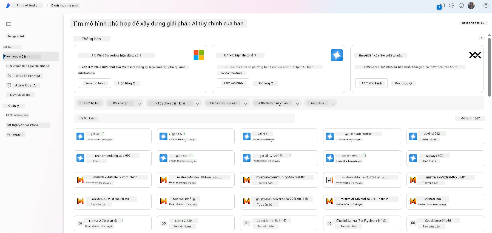

- Xem lại thẻ mô hình, bao gồm mô tả chi tiết về mục đích sử dụng và dữ liệu đào tạo, ví dụ mã và kết quả đánh giá trên thư viện đánh giá nội bộ.

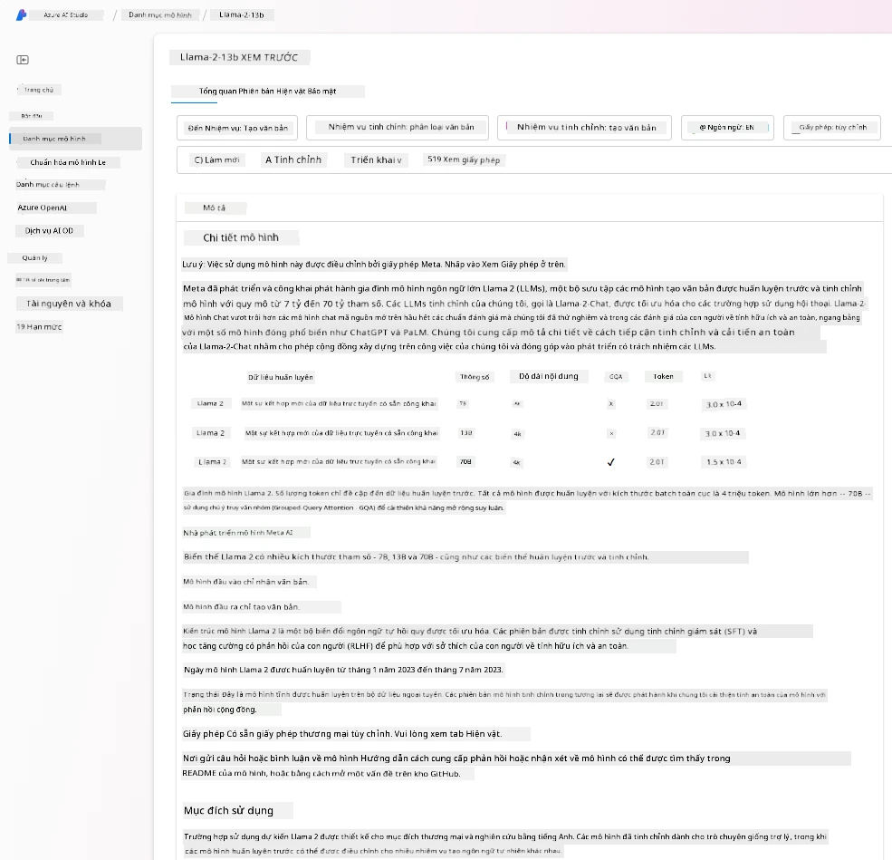

- So sánh điểm chuẩn giữa các mô hình và bộ dữ liệu có sẵn trong ngành để đánh giá mô hình nào phù hợp với kịch bản kinh doanh, thông qua bảng [Model Benchmarks](https://learn.microsoft.com/azure/ai-studio/how-to/model-benchmarks?WT.mc_id=academic-105485-koreyst).

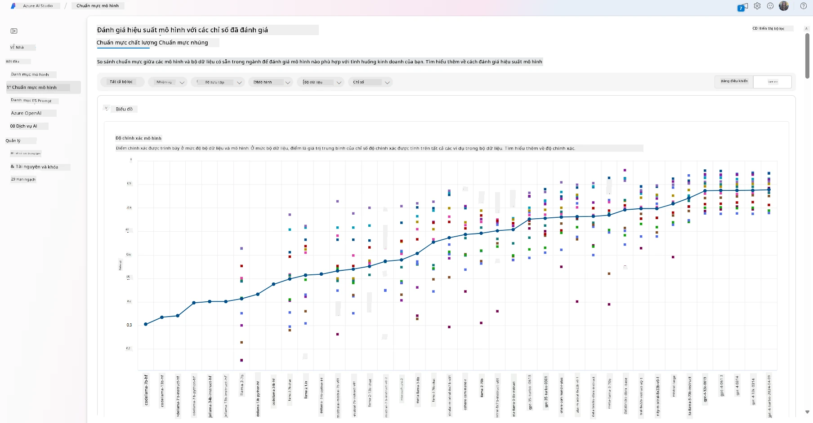

- Tinh chỉnh các mô hình được hỗ trợ trên dữ liệu đào tạo tùy chỉnh để cải thiện hiệu suất mô hình trong một khối lượng công việc cụ thể, tận dụng khả năng thử nghiệm và theo dõi của Microsoft Foundry.

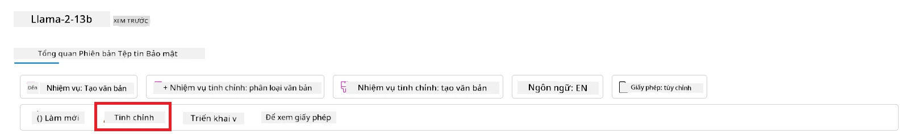

- Triển khai mô hình được đào tạo sẵn ban đầu hoặc phiên bản đã được tinh chỉnh lên điểm truy vấn suy luận thời gian thực từ xa, sử dụng tùy chọn tính toán được quản lý hoặc triển khai không máy chủ, để cho phép các ứng dụng sử dụng nó.

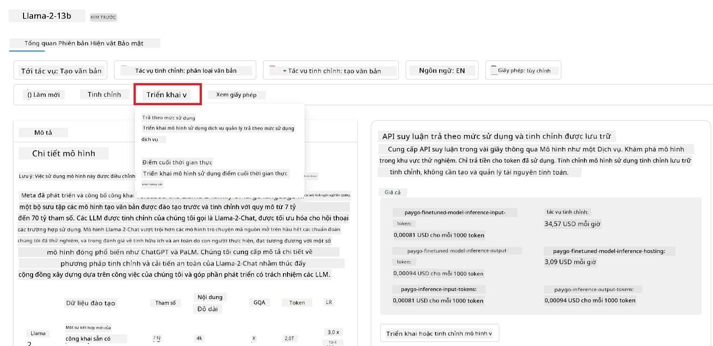

> [!NOTE]
> Không phải tất cả các mô hình trong danh mục hiện đều có sẵn để tinh chỉnh và/hoặc triển khai trả theo mức sử dụng. Kiểm tra thẻ mô hình để biết chi tiết về khả năng và giới hạn của mô hình.

## Cải thiện kết quả LLM

Chúng tôi đã khám phá với nhóm khởi nghiệp của mình các loại LLM khác nhau và một nền tảng đám mây (Microsoft Foundry) cho phép chúng tôi so sánh các mô hình khác nhau, đánh giá chúng trên dữ liệu thử nghiệm, cải thiện hiệu suất và triển khai chúng trên các điểm truy vấn suy luận.

Nhưng khi nào họ nên cân nhắc tinh chỉnh một mô hình thay vì sử dụng mô hình đã được đào tạo sẵn? Có những cách tiếp cận khác để cải thiện hiệu suất mô hình trên các khối lượng công việc cụ thể không?

Có một số cách tiếp cận mà doanh nghiệp có thể sử dụng để đạt được kết quả mà họ cần từ một LLM. Bạn có thể chọn các loại mô hình khác nhau với các mức độ đào tạo khác nhau khi triển khai một LLM trong sản xuất, với các mức độ phức tạp, chi phí và chất lượng khác nhau. Dưới đây là một số cách tiếp cận khác nhau:

- **Kỹ thuật tạo câu hỏi với ngữ cảnh**. Ý tưởng là cung cấp đủ ngữ cảnh khi bạn tạo câu hỏi để đảm bảo bạn nhận được các phản hồi cần thiết.

- **Truy xuất tăng cường sinh tạo, RAG**. Dữ liệu của bạn có thể tồn tại trong cơ sở dữ liệu hoặc điểm cuối web ví dụ, để đảm bảo dữ liệu này, hoặc một phần của nó, được bao gồm khi tạo câu hỏi, bạn có thể truy xuất dữ liệu liên quan và làm cho nó trở thành một phần của câu hỏi người dùng.

- **Mô hình đã được tinh chỉnh**. Ở đây, bạn đã đào tạo thêm mô hình trên dữ liệu của riêng bạn dẫn đến mô hình chính xác hơn và đáp ứng tốt hơn các nhu cầu của bạn nhưng có thể tốn kém.

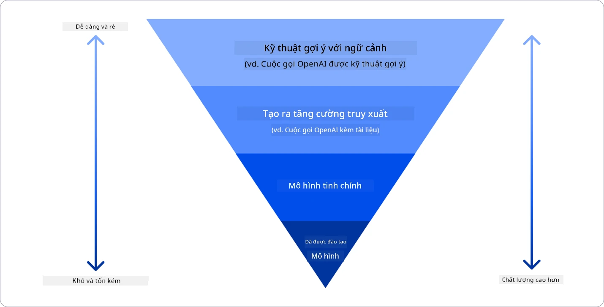

Nguồn ảnh: [Four Ways that Enterprises Deploy LLMs | Fiddler AI Blog](https://www.fiddler.ai/blog/four-ways-that-enterprises-deploy-llms?WT.mc_id=academic-105485-koreyst)

### Kỹ thuật tạo câu hỏi với ngữ cảnh

LLM đã được đào tạo sẵn hoạt động rất tốt trong các tác vụ ngôn ngữ tự nhiên tổng quát, ngay cả khi gọi chúng với một câu hỏi ngắn, như câu hoàn chỉnh hoặc câu hỏi – gọi là học “zero-shot”.

Tuy nhiên, người dùng càng có thể định khung truy vấn của họ, với yêu cầu chi tiết và các ví dụ – tức là Ngữ cảnh – thì câu trả lời càng chính xác và phù hợp với mong đợi của người dùng hơn. Trong trường hợp này, chúng ta nói về học “one-shot” nếu câu hỏi chỉ bao gồm một ví dụ và “few-shot learning” nếu nó bao gồm nhiều ví dụ.
Kỹ thuật tạo câu hỏi với ngữ cảnh là cách tiếp cận tiết kiệm chi phí nhất để bắt đầu.

### Truy xuất tăng cường sinh tạo (RAG)

LLM có giới hạn là chúng chỉ có thể sử dụng dữ liệu đã được sử dụng trong quá trình đào tạo để tạo ra câu trả lời. Điều này có nghĩa là chúng không biết gì về các sự kiện xảy ra sau quá trình đào tạo, và chúng không thể truy cập thông tin không công khai (như dữ liệu công ty).
Điều này có thể được khắc phục thông qua RAG, một kỹ thuật bổ sung câu hỏi với dữ liệu bên ngoài dưới dạng các đoạn tài liệu, xem xét giới hạn độ dài câu hỏi. Điều này được hỗ trợ bởi các công cụ cơ sở dữ liệu Vector (như [Azure Vector Search](https://learn.microsoft.com/azure/search/vector-search-overview?WT.mc_id=academic-105485-koreyst)) giúp truy xuất các đoạn hữu ích từ các nguồn dữ liệu được xác định trước đa dạng và thêm chúng vào Ngữ cảnh của câu hỏi.

Kỹ thuật này rất hữu ích khi doanh nghiệp không có đủ dữ liệu, thời gian hoặc nguồn lực để tinh chỉnh một LLM, nhưng vẫn muốn cải thiện hiệu suất trên một khối lượng công việc cụ thể và giảm thiểu rủi ro dựa trên các câu trả lời sai lệch, lỗi thời hoặc không được hỗ trợ.

### Mô hình đã được tinh chỉnh

Tinh chỉnh là một quá trình tận dụng học chuyển giao để ‘điều chỉnh’ mô hình cho một nhiệm vụ cụ thể hoặc để giải quyết một vấn đề cụ thể. Khác với few-shot learning và RAG, nó tạo ra một mô hình mới với các trọng số và sai số đã được cập nhật. Nó yêu cầu một bộ ví dụ đào tạo bao gồm một đầu vào duy nhất (câu hỏi) và kết quả liên quan (phần hoàn thành).
Đây sẽ là cách tiếp cận ưu tiên nếu:

- **Sử dụng các mô hình nhỏ hơn chuyên biệt theo nhiệm vụ**. Doanh nghiệp muốn tinh chỉnh một mô hình nhỏ hơn cho một nhiệm vụ hẹp thay vì gọi lại nhiều lần một mô hình lớn hơn, dẫn đến giải pháp tiết kiệm chi phí và nhanh hơn.

- **Xem xét độ trễ**. Độ trễ quan trọng cho một trường hợp sử dụng cụ thể, vì vậy không thể sử dụng câu hỏi rất dài hoặc số lượng ví dụ mà mô hình cần học không phù hợp với giới hạn độ dài câu hỏi.

- **Điều chỉnh hành vi ổn định**. Doanh nghiệp có nhiều ví dụ chất lượng cao và muốn mô hình luôn tuân theo mẫu thức nhiệm vụ, định dạng đầu ra, giọng điệu hoặc phong cách chuyên biệt theo lĩnh vực. Nếu vấn đề chính là các sự kiện mới hoặc kiến thức riêng tư thay đổi thường xuyên, hãy sử dụng RAG thay vì chỉ dựa vào tinh chỉnh.

### Mô hình được đào tạo

Đào tạo một LLM từ đầu chắc chắn là cách tiếp cận khó khăn và phức tạp nhất để áp dụng, đòi hỏi lượng dữ liệu khổng lồ, nguồn lực có kỹ năng và sức mạnh tính toán phù hợp. Lựa chọn này chỉ nên được xem xét trong trường hợp doanh nghiệp có trường hợp sử dụng chuyên biệt theo lĩnh vực và một lượng lớn dữ liệu tập trung theo lĩnh vực đó.

## Kiểm tra kiến thức

Một cách tiếp cận tốt để cải thiện kết quả hoàn thành LLM có thể là gì?

1. Kỹ thuật tạo câu hỏi với ngữ cảnh
1. RAG
1. Mô hình đã được tinh chỉnh

A: Cả ba đều có thể giúp. Bắt đầu với kỹ thuật tạo câu hỏi và ngữ cảnh để cải thiện nhanh chóng, và sử dụng RAG khi mô hình cần các dữ kiện cập nhật hoặc dữ liệu kinh doanh riêng tư. Chọn tinh chỉnh khi bạn có đủ ví dụ chất lượng cao và cần mô hình tuân theo nhất quán một nhiệm vụ, định dạng, giọng điệu hoặc mẫu lĩnh vực.

## 🚀 Thách thức

Tìm hiểu thêm về cách bạn có thể [sử dụng RAG](https://learn.microsoft.com/azure/search/retrieval-augmented-generation-overview?WT.mc_id=academic-105485-koreyst) cho doanh nghiệp của bạn.

## Làm tốt lắm, tiếp tục học tập

Sau khi hoàn thành bài học này, hãy xem bộ sưu tập [Generative AI Learning](https://aka.ms/genai-collection?WT.mc_id=academic-105485-koreyst) để tiếp tục nâng cao kiến thức về Generative AI!

Hãy đến với Bài học 3, nơi chúng ta sẽ xem cách [xây dựng với Generative AI có trách nhiệm](../03-using-generative-ai-responsibly/README.md?WT.mc_id=academic-105485-koreyst)!

---

<!-- CO-OP TRANSLATOR DISCLAIMER START -->
**Tuyên bố miễn trừ trách nhiệm**:
Tài liệu này đã được dịch bằng dịch vụ dịch thuật AI [Co-op Translator](https://github.com/Azure/co-op-translator). Mặc dù chúng tôi cố gắng đảm bảo độ chính xác, xin lưu ý rằng bản dịch tự động có thể chứa lỗi hoặc sai sót. Tài liệu gốc bằng ngôn ngữ gốc nên được coi là nguồn tin chính thức. Đối với thông tin quan trọng, nên sử dụng dịch vụ dịch thuật chuyên nghiệp bởi con người. Chúng tôi không chịu trách nhiệm về bất kỳ hiểu lầm hoặc giải thích sai nào phát sinh từ việc sử dụng bản dịch này.
<!-- CO-OP TRANSLATOR DISCLAIMER END -->