<!--
CO_OP_TRANSLATOR_METADATA:
{
  "original_hash": "e2f686f2eb794941761252ac5e8e090b",
  "translation_date": "2025-06-25T10:50:37+00:00",
  "source_file": "02-exploring-and-comparing-different-llms/README.md",
  "language_code": "vi"
}
-->
# Khám phá và so sánh các LLM khác nhau

[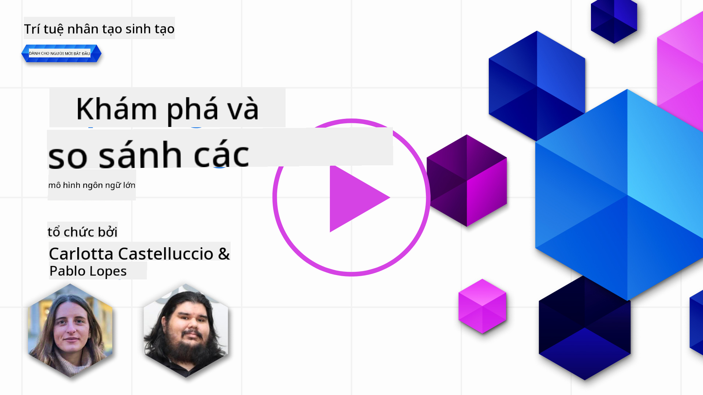](https://aka.ms/gen-ai-lesson2-gh?WT.mc_id=academic-105485-koreyst)

> _Nhấn vào hình ảnh trên để xem video của bài học này_

Trong bài học trước, chúng ta đã thấy cách AI Tạo Sinh đang thay đổi bối cảnh công nghệ, cách các Mô Hình Ngôn Ngữ Lớn (LLM) hoạt động và cách một doanh nghiệp - như startup của chúng ta - có thể áp dụng chúng vào các trường hợp sử dụng của họ và phát triển! Trong chương này, chúng ta sẽ so sánh và đối chiếu các loại mô hình ngôn ngữ lớn (LLM) khác nhau để hiểu rõ ưu và nhược điểm của chúng.

Bước tiếp theo trong hành trình của startup của chúng ta là khám phá bối cảnh hiện tại của LLM và hiểu rõ những mô hình nào phù hợp với trường hợp sử dụng của chúng ta.

## Giới thiệu

Bài học này sẽ bao gồm:

- Các loại LLM khác nhau trong bối cảnh hiện tại.
- Thử nghiệm, lặp lại và so sánh các mô hình khác nhau cho trường hợp sử dụng của bạn trên Azure.
- Cách triển khai một LLM.

## Mục tiêu học tập

Sau khi hoàn thành bài học này, bạn sẽ có thể:

- Chọn mô hình phù hợp cho trường hợp sử dụng của bạn.
- Hiểu cách thử nghiệm, lặp lại và cải thiện hiệu suất của mô hình của bạn.
- Biết cách doanh nghiệp triển khai các mô hình.

## Hiểu các loại LLM khác nhau

LLM có thể có nhiều phân loại dựa trên kiến trúc, dữ liệu đào tạo và trường hợp sử dụng của chúng. Hiểu những khác biệt này sẽ giúp startup của chúng ta chọn mô hình phù hợp cho tình huống, và hiểu cách thử nghiệm, lặp lại và cải thiện hiệu suất.

Có nhiều loại mô hình LLM khác nhau, sự lựa chọn mô hình của bạn phụ thuộc vào mục tiêu sử dụng của bạn, dữ liệu của bạn, mức độ sẵn sàng chi trả và nhiều yếu tố khác.

Tùy thuộc vào việc bạn có ý định sử dụng các mô hình cho văn bản, âm thanh, video, tạo hình ảnh và v.v., bạn có thể chọn một loại mô hình khác.

- **Nhận diện âm thanh và giọng nói**. Cho mục đích này, các mô hình kiểu Whisper là một lựa chọn tuyệt vời vì chúng là đa năng và hướng đến nhận diện giọng nói. Nó được đào tạo trên âm thanh đa dạng và có thể thực hiện nhận diện giọng nói đa ngôn ngữ. Tìm hiểu thêm về [mô hình kiểu Whisper tại đây](https://platform.openai.com/docs/models/whisper?WT.mc_id=academic-105485-koreyst).

- **Tạo hình ảnh**. Đối với việc tạo hình ảnh, DALL-E và Midjourney là hai lựa chọn rất nổi tiếng. DALL-E được cung cấp bởi Azure OpenAI. [Đọc thêm về DALL-E tại đây](https://platform.openai.com/docs/models/dall-e?WT.mc_id=academic-105485-koreyst) và cũng trong Chương 9 của giáo trình này.

- **Tạo văn bản**. Hầu hết các mô hình đều được đào tạo về tạo văn bản và bạn có rất nhiều lựa chọn từ GPT-3.5 đến GPT-4. Chúng có chi phí khác nhau với GPT-4 là đắt nhất. Đáng xem xét [Azure OpenAI playground](https://oai.azure.com/portal/playground?WT.mc_id=academic-105485-koreyst) để đánh giá mô hình nào phù hợp nhất với nhu cầu của bạn về khả năng và chi phí.

- **Đa phương tiện**. Nếu bạn muốn xử lý nhiều loại dữ liệu trong đầu vào và đầu ra, bạn có thể muốn xem xét các mô hình như [gpt-4 turbo với vision hoặc gpt-4o](https://learn.microsoft.com/azure/ai-services/openai/concepts/models#gpt-4-and-gpt-4-turbo-models?WT.mc_id=academic-105485-koreyst) - các phiên bản mới nhất của mô hình OpenAI - có khả năng kết hợp xử lý ngôn ngữ tự nhiên với hiểu biết hình ảnh, cho phép tương tác qua giao diện đa phương tiện.

Chọn một mô hình có nghĩa là bạn có được một số khả năng cơ bản, tuy nhiên điều đó có thể không đủ. Thường thì bạn có dữ liệu cụ thể của công ty mà bạn cần phải thông báo cho LLM biết. Có một số lựa chọn khác nhau về cách tiếp cận điều đó, nhiều hơn về điều đó trong các phần tiếp theo.

### Mô hình nền tảng so với LLM

Thuật ngữ Mô hình Nền tảng được [đặt ra bởi các nhà nghiên cứu Stanford](https://arxiv.org/abs/2108.07258?WT.mc_id=academic-105485-koreyst) và được định nghĩa là một mô hình AI tuân theo một số tiêu chí, như:

- **Chúng được đào tạo bằng học không giám sát hoặc học tự giám sát**, nghĩa là chúng được đào tạo trên dữ liệu đa phương tiện không có nhãn, và chúng không yêu cầu chú thích hoặc gắn nhãn dữ liệu của con người cho quá trình đào tạo của chúng.
- **Chúng là các mô hình rất lớn**, dựa trên các mạng nơron rất sâu được đào tạo trên hàng tỷ tham số.
- **Chúng thường được dự định phục vụ như một 'nền tảng' cho các mô hình khác**, nghĩa là chúng có thể được sử dụng làm điểm khởi đầu cho các mô hình khác được xây dựng trên đó, điều này có thể được thực hiện bằng cách tinh chỉnh.

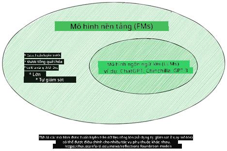

Nguồn hình ảnh: [Hướng dẫn cần thiết về Mô hình Nền tảng và Mô hình Ngôn ngữ Lớn | bởi Babar M Bhatti | Medium
](https://thebabar.medium.com/essential-guide-to-foundation-models-and-large-language-models-27dab58f7404)

Để làm rõ hơn sự khác biệt này, hãy lấy ChatGPT làm ví dụ. Để xây dựng phiên bản đầu tiên của ChatGPT, một mô hình có tên là GPT-3.5 đã đóng vai trò là mô hình nền tảng. Điều này có nghĩa là OpenAI đã sử dụng một số dữ liệu cụ thể cho trò chuyện để tạo ra một phiên bản tinh chỉnh của GPT-3.5 chuyên về hoạt động tốt trong các kịch bản hội thoại, chẳng hạn như chatbot.

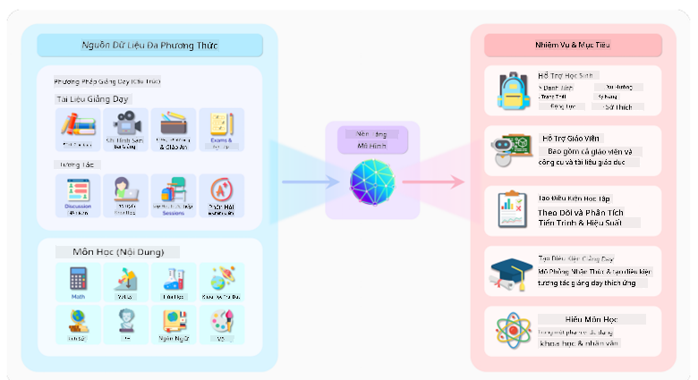

Nguồn hình ảnh: [2108.07258.pdf (arxiv.org)](https://arxiv.org/pdf/2108.07258.pdf?WT.mc_id=academic-105485-koreyst)

### Mô hình mã nguồn mở so với Mô hình độc quyền

Một cách khác để phân loại LLM là liệu chúng có phải là mã nguồn mở hay độc quyền.

Các mô hình mã nguồn mở là các mô hình được công khai và có thể được sử dụng bởi bất kỳ ai. Chúng thường được cung cấp bởi công ty đã tạo ra chúng hoặc bởi cộng đồng nghiên cứu. Các mô hình này được phép kiểm tra, sửa đổi và tùy chỉnh cho các trường hợp sử dụng khác nhau trong LLM. Tuy nhiên, chúng không phải lúc nào cũng được tối ưu hóa cho việc sử dụng trong sản xuất và có thể không hoạt động tốt như các mô hình độc quyền. Thêm vào đó, nguồn tài trợ cho các mô hình mã nguồn mở có thể bị hạn chế, và chúng có thể không được duy trì lâu dài hoặc không được cập nhật với các nghiên cứu mới nhất. Các ví dụ phổ biến về mô hình mã nguồn mở bao gồm [Alpaca](https://crfm.stanford.edu/2023/03/13/alpaca.html?WT.mc_id=academic-105485-koreyst), [Bloom](https://huggingface.co/bigscience/bloom) và [LLaMA](https://llama.meta.com).

Các mô hình độc quyền là các mô hình thuộc sở hữu của một công ty và không được công khai. Các mô hình này thường được tối ưu hóa cho việc sử dụng trong sản xuất. Tuy nhiên, chúng không được phép kiểm tra, sửa đổi hoặc tùy chỉnh cho các trường hợp sử dụng khác nhau. Thêm vào đó, chúng không phải lúc nào cũng có sẵn miễn phí và có thể yêu cầu đăng ký hoặc thanh toán để sử dụng. Ngoài ra, người dùng không có quyền kiểm soát dữ liệu được sử dụng để đào tạo mô hình, điều này có nghĩa là họ phải tin tưởng vào chủ sở hữu mô hình để đảm bảo cam kết bảo mật dữ liệu và sử dụng AI một cách có trách nhiệm. Các ví dụ phổ biến về mô hình độc quyền bao gồm [OpenAI models](https://platform.openai.com/docs/models/overview?WT.mc_id=academic-105485-koreyst), [Google Bard](https://sapling.ai/llm/bard?WT.mc_id=academic-105485-koreyst) hoặc [Claude 2](https://www.anthropic.com/index/claude-2?WT.mc_id=academic-105485-koreyst).

### Nhúng so với Tạo hình ảnh so với Tạo văn bản và mã

LLM cũng có thể được phân loại theo đầu ra mà chúng tạo ra.

Nhúng là một tập hợp các mô hình có thể chuyển đổi văn bản thành dạng số, gọi là nhúng, là một biểu diễn số của văn bản đầu vào. Nhúng giúp máy móc dễ dàng hiểu mối quan hệ giữa các từ hoặc câu và có thể được tiêu thụ như đầu vào bởi các mô hình khác, chẳng hạn như mô hình phân loại hoặc mô hình phân cụm có hiệu suất tốt hơn trên dữ liệu số. Các mô hình nhúng thường được sử dụng cho học chuyển giao, nơi một mô hình được xây dựng cho một nhiệm vụ thay thế mà có nhiều dữ liệu, và sau đó các trọng số của mô hình (nhúng) được sử dụng lại cho các nhiệm vụ khác. Một ví dụ của danh mục này là [OpenAI embeddings](https://platform.openai.com/docs/models/embeddings?WT.mc_id=academic-105485-koreyst).

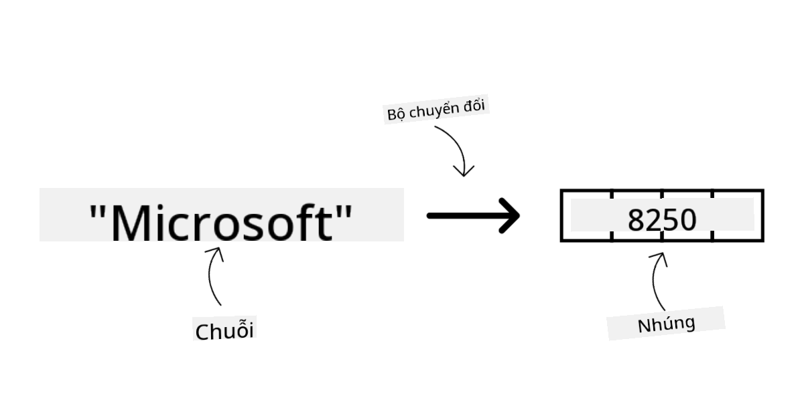

Các mô hình tạo hình ảnh là các mô hình tạo ra hình ảnh. Các mô hình này thường được sử dụng cho chỉnh sửa hình ảnh, tổng hợp hình ảnh và dịch hình ảnh. Các mô hình tạo hình ảnh thường được đào tạo trên các tập dữ liệu lớn về hình ảnh, chẳng hạn như [LAION-5B](https://laion.ai/blog/laion-5b/?WT.mc_id=academic-105485-koreyst), và có thể được sử dụng để tạo ra hình ảnh mới hoặc chỉnh sửa hình ảnh hiện có bằng các kỹ thuật inpainting, siêu phân giải và tô màu. Các ví dụ bao gồm [DALL-E-3](https://openai.com/dall-e-3?WT.mc_id=academic-105485-koreyst) và [Stable Diffusion models](https://github.com/Stability-AI/StableDiffusion?WT.mc_id=academic-105485-koreyst).

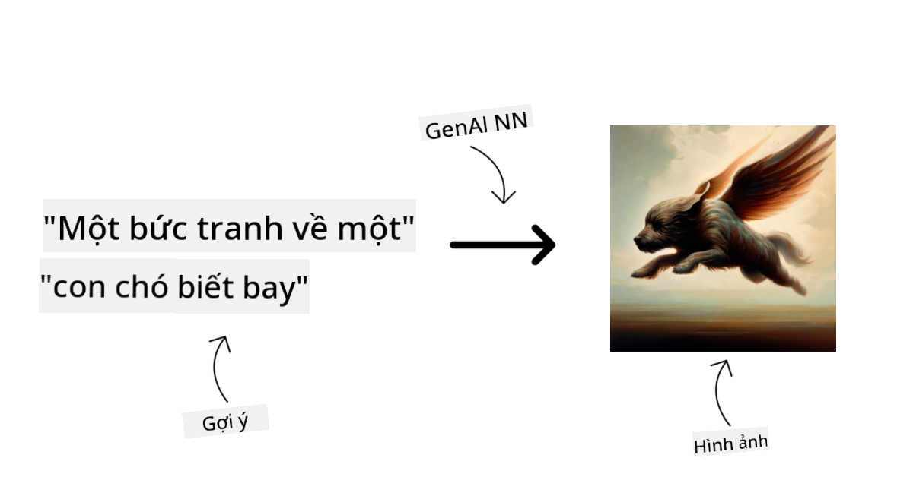

Các mô hình tạo văn bản và mã là các mô hình tạo ra văn bản hoặc mã. Các mô hình này thường được sử dụng cho tóm tắt văn bản, dịch thuật và trả lời câu hỏi. Các mô hình tạo văn bản thường được đào tạo trên các tập dữ liệu lớn về văn bản, chẳng hạn như [BookCorpus](https://www.cv-foundation.org/openaccess/content_iccv_2015/html/Zhu_Aligning_Books_and_ICCV_2015_paper.html?WT.mc_id=academic-105485-koreyst), và có thể được sử dụng để tạo ra văn bản mới hoặc trả lời câu hỏi. Các mô hình tạo mã, như [CodeParrot](https://huggingface.co/codeparrot?WT.mc_id=academic-105485-koreyst), thường được đào tạo trên các tập dữ liệu lớn về mã, chẳng hạn như GitHub, và có thể được sử dụng để tạo ra mã mới hoặc sửa lỗi trong mã hiện có.

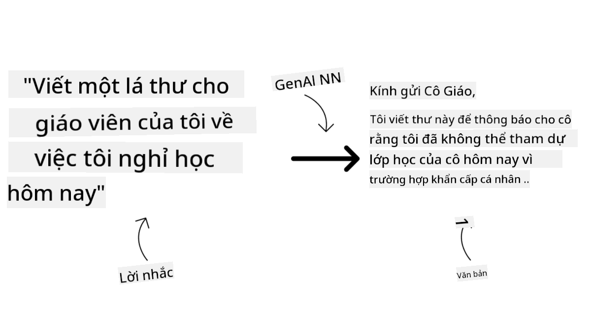

### Bộ mã hóa-Giải mã so với Chỉ giải mã

Để nói về các loại kiến trúc khác nhau của LLM, hãy sử dụng một phép ẩn dụ.

Hãy tưởng tượng quản lý của bạn giao cho bạn một nhiệm vụ viết một bài kiểm tra cho học sinh. Bạn có hai đồng nghiệp; một người phụ trách tạo nội dung và người kia phụ trách xem xét chúng.

Người tạo nội dung giống như một mô hình chỉ giải mã, họ có thể nhìn vào chủ đề và xem những gì bạn đã viết và sau đó họ có thể viết một khóa học dựa trên đó. Họ rất giỏi viết nội dung hấp dẫn và thông tin, nhưng họ không giỏi hiểu chủ đề và các mục tiêu học tập. Một số ví dụ về mô hình giải mã là các mô hình họ GPT, chẳng hạn như GPT-3.

Người xem xét giống như một mô hình chỉ mã hóa, họ nhìn vào khóa học đã viết và các câu trả lời, nhận ra mối quan hệ giữa chúng và hiểu ngữ cảnh, nhưng họ không giỏi tạo nội dung. Một ví dụ về mô hình chỉ mã hóa sẽ là BERT.

Hãy tưởng tượng rằng chúng ta cũng có thể có ai đó có thể tạo và xem xét bài kiểm tra, đây là một mô hình mã hóa-giải mã. Một số ví dụ sẽ là BART và T5.

### Dịch vụ so với Mô hình

Bây giờ, hãy nói về sự khác biệt giữa một dịch vụ và một mô hình. Một dịch vụ là một sản phẩm được cung cấp bởi Nhà cung cấp Dịch vụ Đám mây, và thường là sự kết hợp của các mô hình, dữ liệu và các thành phần khác. Một mô hình là thành phần cốt lõi của một dịch vụ, và thường là một mô hình nền tảng, chẳng hạn như một LLM.

Các dịch vụ thường được tối ưu hóa cho việc sử dụng trong sản xuất và thường dễ sử dụng hơn các mô hình, qua giao diện người dùng đồ họa. Tuy nhiên, các dịch vụ không phải lúc nào cũng có sẵn miễn phí và có thể yêu cầu đăng ký hoặc thanh toán để sử dụng, đổi lại việc tận dụng thiết bị và tài nguyên của chủ sở hữu dịch vụ, tối ưu hóa chi phí và dễ dàng mở rộng. Một ví dụ về dịch vụ là [Azure OpenAI Service](https://learn.microsoft.com/azure/ai-services/openai/overview?WT.mc_id=academic-105485-koreyst), cung cấp một kế hoạch giá trả theo mức sử dụng, nghĩa là người dùng được tính phí tỷ lệ thuận với mức độ sử dụng dịch vụ. Ngoài ra, Azure OpenAI Service cung cấp bảo mật cấp doanh nghiệp và một khung AI có trách nhiệm trên khả năng của các mô hình.

Các mô hình chỉ là Mạng Nơron, với các tham số, trọng số và các yếu tố khác. Cho phép các công ty chạy cục bộ, tuy nhiên, sẽ cần phải mua thiết bị, xây dựng một cấu trúc để mở rộng và mua giấy phép hoặc sử dụng một mô hình mã nguồn mở. Một mô hình như LLaMA có sẵn để sử dụng, yêu cầu sức mạnh tính toán để chạy mô hình.

## Cách thử nghiệm và lặp lại với các mô hình khác nhau để hiểu hiệu suất trên Azure

Khi nhóm của chúng ta đã khám phá bối cảnh LLM hiện tại và xác định một số ứng cử viên tốt cho các tình huống của họ, bước tiếp theo là thử nghiệm chúng trên dữ liệu và khối lượng công việc của họ. Đây là một quá trình lặp lại, được thực hiện thông qua các thí nghiệm và đo lường. Hầu hết các mô hình mà chúng tôi đã đề cập trong các đoạn trước (mô hình OpenAI, mô hình mã nguồn mở như Llama2 và Hugging Face transformers) có sẵn trong [Model Catalog](https://learn.microsoft.com/azure/ai-studio/how-to/model-catalog-overview?WT.mc_id=academic-105485-koreyst) trong [Azure AI Studio](https://ai.azure.com/?WT.mc_id=academic-105485-koreyst).

[Azure AI Studio](https://learn.microsoft.com/azure/ai-studio/what-is-ai-studio?WT.mc_id=academic-105485-koreyst) là một Nền tảng Đám mây được thiết kế cho các nhà phát triển để xây dựng các ứng dụng AI tạo sinh và quản lý toàn bộ vòng đời phát triển - từ thử nghiệm đến đánh giá - bằng cách kết hợp tất cả các dịch vụ AI của Azure vào một trung tâm duy nhất với một giao diện người dùng đồ họa tiện lợi. Model Catalog trong Azure AI Studio cho phép người dùng:

- Tìm Mô hình Nền tảng quan tâm trong danh mục - có thể là độc quyền hoặc mã nguồn mở, lọc theo nhiệm vụ, giấy phép hoặc tên. Để cải thiện khả năng tìm kiếm, các mô hình được tổ chức thành các bộ sưu tập, như bộ sưu tập Azure OpenAI, bộ sưu tập Hugging Face, và nhiều hơn nữa.

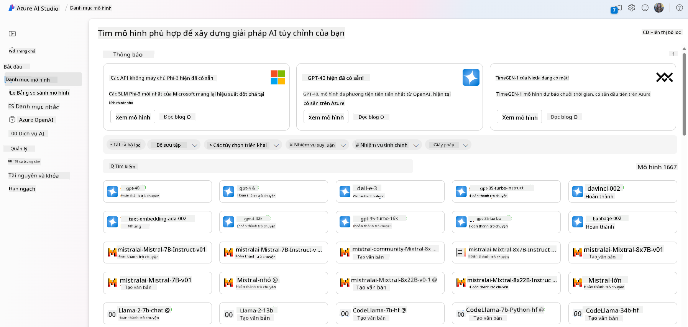

- Xem xét thẻ mô hình, bao gồm mô tả chi tiết về mục đích sử dụng và dữ liệu đào tạo, mẫu mã và kết quả đánh giá trên thư viện đánh giá nội bộ.

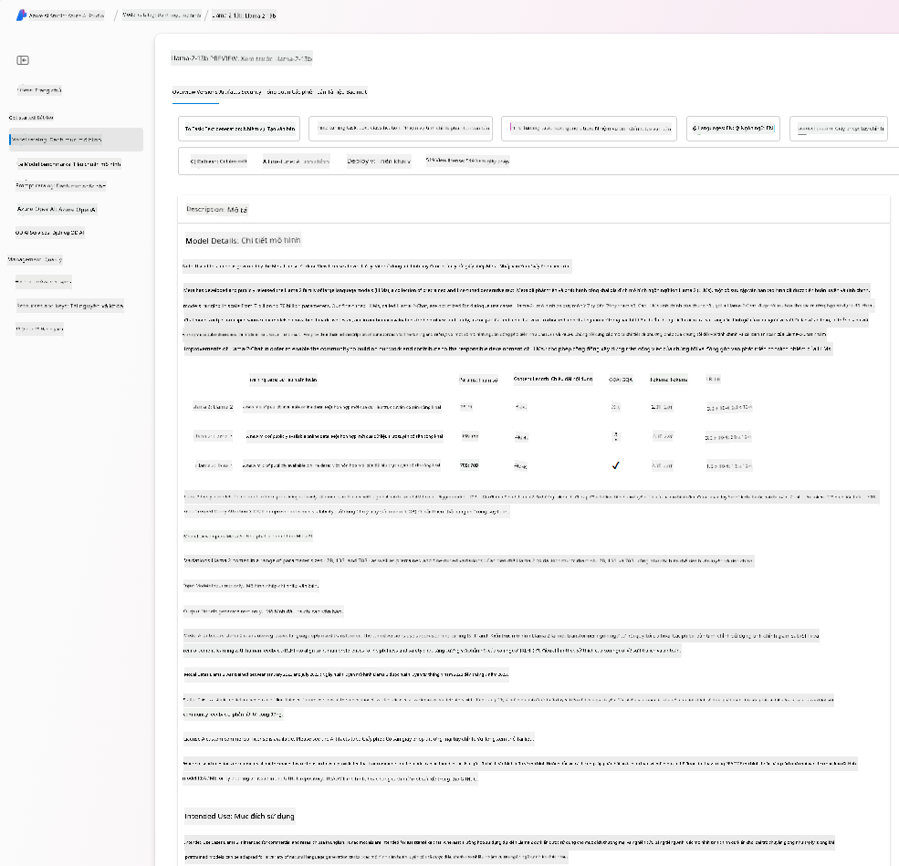
- So sánh các điểm chuẩn giữa các mô hình và tập dữ liệu có sẵn trong ngành để đánh giá mô hình nào đáp ứng kịch bản kinh doanh, thông qua bảng điều khiển [Model Benchmarks](https://learn.microsoft.com/azure/ai-studio/how-to/model-benchmarks?WT.mc_id=academic-105485-koreyst).

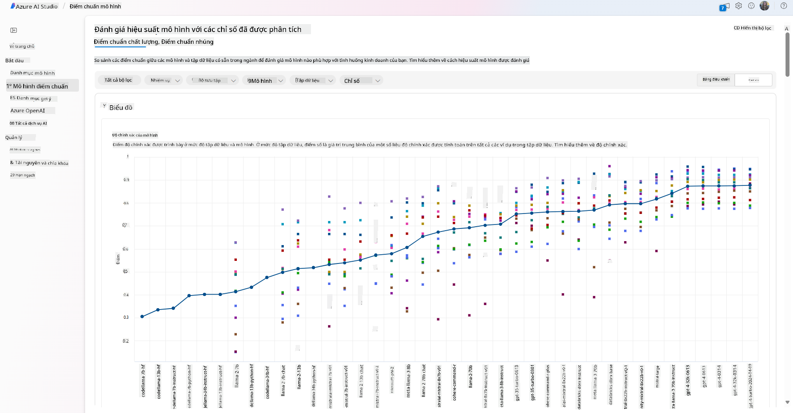

- Tinh chỉnh mô hình trên dữ liệu đào tạo tùy chỉnh để cải thiện hiệu suất mô hình trong một khối lượng công việc cụ thể, tận dụng khả năng thử nghiệm và theo dõi của Azure AI Studio.

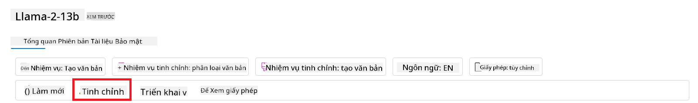

- Triển khai mô hình gốc đã được đào tạo trước hoặc phiên bản đã tinh chỉnh đến một điểm cuối suy luận thời gian thực từ xa - tính toán được quản lý - hoặc điểm cuối API không máy chủ - [trả phí theo mức sử dụng](https://learn.microsoft.com/azure/ai-studio/how-to/model-catalog-overview#model-deployment-managed-compute-and-serverless-api-pay-as-you-go?WT.mc_id=academic-105485-koreyst) - để cho phép ứng dụng sử dụng nó.

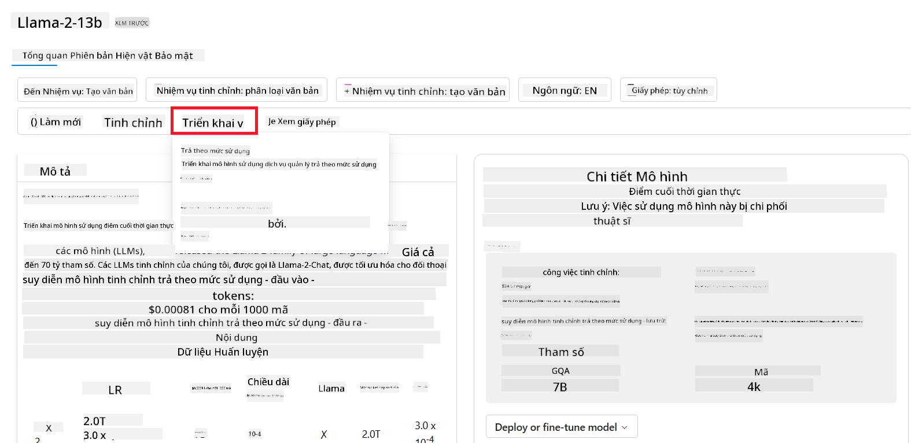

> [!NOTE]
> Không phải tất cả các mô hình trong danh mục đều hiện có sẵn để tinh chỉnh và/hoặc triển khai trả phí theo mức sử dụng. Kiểm tra thẻ mô hình để biết chi tiết về khả năng và hạn chế của mô hình.

## Cải thiện kết quả LLM

Chúng tôi đã khám phá với đội ngũ khởi nghiệp của mình các loại LLM khác nhau và một nền tảng đám mây (Azure Machine Learning) cho phép chúng tôi so sánh các mô hình khác nhau, đánh giá chúng trên dữ liệu thử nghiệm, cải thiện hiệu suất và triển khai chúng trên các điểm cuối suy luận.

Nhưng khi nào họ nên cân nhắc tinh chỉnh một mô hình thay vì sử dụng mô hình đã được đào tạo trước? Có những phương pháp khác để cải thiện hiệu suất mô hình trên các khối lượng công việc cụ thể không?

Có nhiều phương pháp mà doanh nghiệp có thể sử dụng để đạt được kết quả họ cần từ một LLM. Bạn có thể chọn các loại mô hình khác nhau với các mức độ đào tạo khác nhau khi triển khai một LLM trong sản xuất, với các mức độ phức tạp, chi phí và chất lượng khác nhau. Dưới đây là một số phương pháp khác nhau:

- **Kỹ thuật nhắc nhở với ngữ cảnh**. Ý tưởng là cung cấp đủ ngữ cảnh khi bạn nhắc để đảm bảo bạn nhận được các phản hồi cần thiết.

- **Thu thập dữ liệu được tăng cường, RAG**. Dữ liệu của bạn có thể tồn tại trong một cơ sở dữ liệu hoặc điểm cuối web chẳng hạn, để đảm bảo dữ liệu này hoặc một phần của nó được bao gồm khi nhắc, bạn có thể truy xuất dữ liệu liên quan và đưa nó vào phần nhắc của người dùng.

- **Mô hình đã tinh chỉnh**. Tại đây, bạn đào tạo mô hình thêm trên dữ liệu của mình, dẫn đến mô hình chính xác và đáp ứng hơn với nhu cầu của bạn nhưng có thể tốn kém.

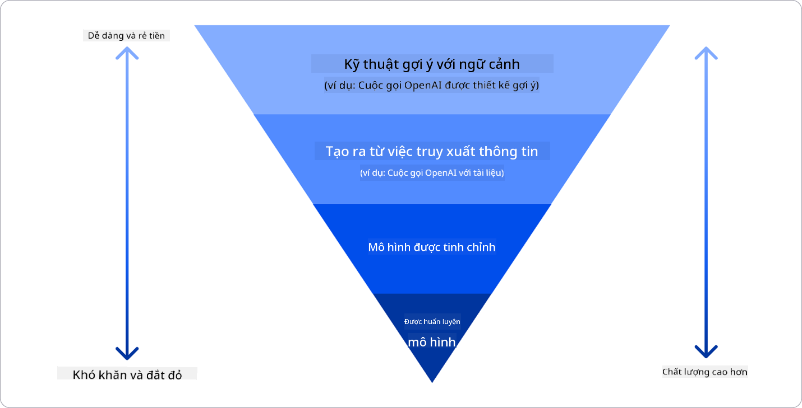

Nguồn hình ảnh: [Four Ways that Enterprises Deploy LLMs | Fiddler AI Blog](https://www.fiddler.ai/blog/four-ways-that-enterprises-deploy-llms?WT.mc_id=academic-105485-koreyst)

### Kỹ thuật nhắc nhở với ngữ cảnh

LLM đã được đào tạo trước hoạt động rất tốt trong các nhiệm vụ ngôn ngữ tự nhiên tổng quát, ngay cả khi gọi chúng với một lời nhắc ngắn, như một câu để hoàn thành hoặc một câu hỏi – cái gọi là học "zero-shot".

Tuy nhiên, người dùng càng có thể định hình câu hỏi của họ, với yêu cầu chi tiết và ví dụ – Ngữ cảnh – thì câu trả lời sẽ càng chính xác và gần với kỳ vọng của người dùng. Trong trường hợp này, chúng ta nói về học "one-shot" nếu lời nhắc chỉ bao gồm một ví dụ và "few shot learning" nếu nó bao gồm nhiều ví dụ. Kỹ thuật nhắc nhở với ngữ cảnh là phương pháp tiết kiệm chi phí nhất để bắt đầu.

### Thu thập dữ liệu được tăng cường (RAG)

LLM có giới hạn rằng chúng chỉ có thể sử dụng dữ liệu đã được sử dụng trong quá trình đào tạo của chúng để tạo ra câu trả lời. Điều này có nghĩa là chúng không biết gì về các sự kiện xảy ra sau quá trình đào tạo của chúng và chúng không thể truy cập thông tin không công khai (như dữ liệu công ty).
Điều này có thể được khắc phục thông qua RAG, một kỹ thuật tăng cường lời nhắc với dữ liệu bên ngoài dưới dạng các mảnh tài liệu, xem xét giới hạn độ dài lời nhắc. Điều này được hỗ trợ bởi các công cụ cơ sở dữ liệu Vector (như [Azure Vector Search](https://learn.microsoft.com/azure/search/vector-search-overview?WT.mc_id=academic-105485-koreyst)) mà truy xuất các mảnh hữu ích từ các nguồn dữ liệu định trước khác nhau và thêm chúng vào Ngữ cảnh lời nhắc.

Kỹ thuật này rất hữu ích khi doanh nghiệp không có đủ dữ liệu, đủ thời gian hoặc tài nguyên để tinh chỉnh một LLM, nhưng vẫn muốn cải thiện hiệu suất trên một khối lượng công việc cụ thể và giảm rủi ro về việc tạo ra nội dung sai lệch, tức là sự bóp méo thực tế hoặc nội dung có hại.

### Mô hình đã tinh chỉnh

Tinh chỉnh là một quá trình tận dụng học chuyển giao để 'thích nghi' mô hình với một nhiệm vụ hạ nguồn hoặc để giải quyết một vấn đề cụ thể. Khác với học few-shot và RAG, nó dẫn đến việc tạo ra một mô hình mới, với các trọng số và thiên lệch được cập nhật. Nó yêu cầu một tập hợp các ví dụ đào tạo gồm một đầu vào đơn (lời nhắc) và đầu ra liên quan của nó (hoàn thành).
Đây sẽ là phương pháp ưa thích nếu:

- **Sử dụng các mô hình đã tinh chỉnh**. Một doanh nghiệp muốn sử dụng các mô hình đã tinh chỉnh ít khả năng hơn (như các mô hình nhúng) thay vì các mô hình hiệu suất cao, dẫn đến giải pháp tiết kiệm chi phí và nhanh chóng hơn.

- **Xem xét độ trễ**. Độ trễ quan trọng đối với một trường hợp sử dụng cụ thể, vì vậy không thể sử dụng các lời nhắc rất dài hoặc số lượng ví dụ cần học từ mô hình không phù hợp với giới hạn độ dài lời nhắc.

- **Luôn cập nhật**. Một doanh nghiệp có nhiều dữ liệu chất lượng cao và nhãn sự thật và các tài nguyên cần thiết để duy trì dữ liệu này cập nhật theo thời gian.

### Mô hình đã được đào tạo

Đào tạo một LLM từ đầu chắc chắn là phương pháp khó khăn nhất và phức tạp nhất để áp dụng, yêu cầu lượng dữ liệu khổng lồ, tài nguyên có kỹ năng và sức mạnh tính toán phù hợp. Tùy chọn này chỉ nên được xem xét trong kịch bản mà doanh nghiệp có trường hợp sử dụng cụ thể theo lĩnh vực và lượng dữ liệu tập trung vào lĩnh vực lớn.

## Kiểm tra kiến thức

Phương pháp nào có thể là một cách tốt để cải thiện kết quả hoàn thành LLM?

1. Kỹ thuật nhắc nhở với ngữ cảnh
1. RAG
1. Mô hình đã tinh chỉnh

A:3, nếu bạn có thời gian và tài nguyên và dữ liệu chất lượng cao, tinh chỉnh là lựa chọn tốt hơn để luôn cập nhật. Tuy nhiên, nếu bạn đang tìm cách cải thiện và thiếu thời gian, nên xem xét RAG trước.

## 🚀 Thử thách

Tìm hiểu thêm về cách bạn có thể [sử dụng RAG](https://learn.microsoft.com/azure/search/retrieval-augmented-generation-overview?WT.mc_id=academic-105485-koreyst) cho doanh nghiệp của mình.

## Làm tốt lắm, tiếp tục học tập

Sau khi hoàn thành bài học này, hãy xem bộ sưu tập [Học tập AI tạo sinh](https://aka.ms/genai-collection?WT.mc_id=academic-105485-koreyst) của chúng tôi để tiếp tục nâng cao kiến thức AI tạo sinh của bạn!

Hãy đến với Bài học 3, nơi chúng ta sẽ tìm hiểu cách [xây dựng AI tạo sinh một cách có trách nhiệm](../03-using-generative-ai-responsibly/README.md?WT.mc_id=academic-105485-koreyst)!

**Tuyên bố miễn trừ trách nhiệm**:  
Tài liệu này đã được dịch bằng dịch vụ dịch thuật AI [Co-op Translator](https://github.com/Azure/co-op-translator). Mặc dù chúng tôi cố gắng đảm bảo độ chính xác, xin lưu ý rằng các bản dịch tự động có thể chứa lỗi hoặc không chính xác. Tài liệu gốc bằng ngôn ngữ bản địa nên được coi là nguồn đáng tin cậy. Đối với thông tin quan trọng, nên sử dụng dịch vụ dịch thuật chuyên nghiệp của con người. Chúng tôi không chịu trách nhiệm về bất kỳ sự hiểu lầm hoặc giải thích sai nào phát sinh từ việc sử dụng bản dịch này.