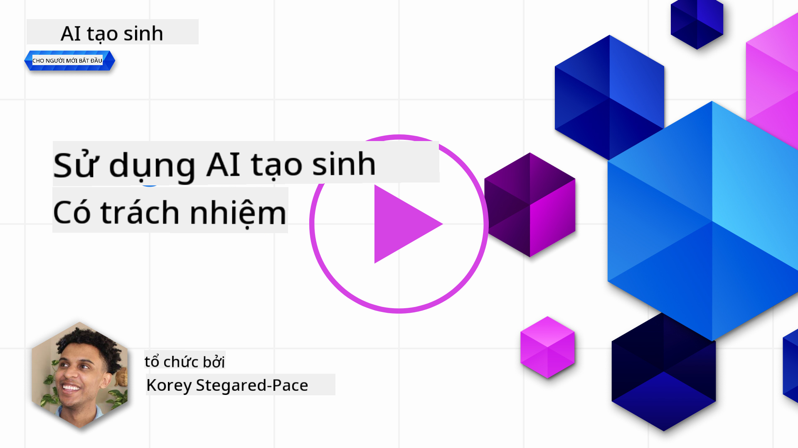
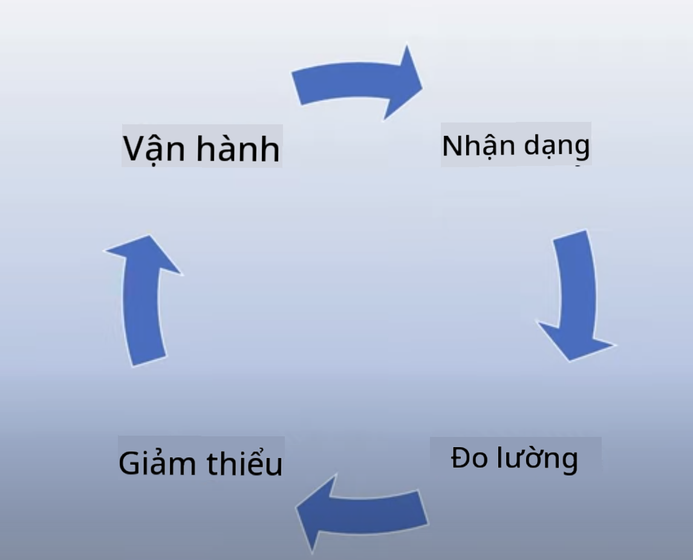
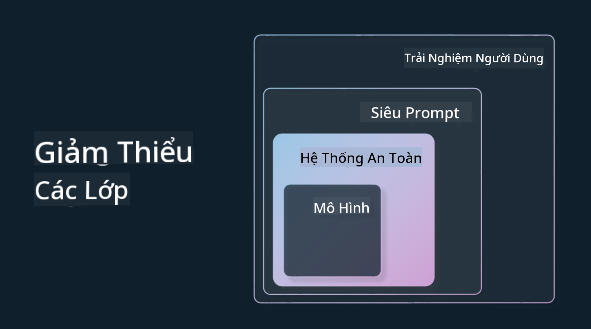

<!--
CO_OP_TRANSLATOR_METADATA:
{
  "original_hash": "7f8f4c11f8c1cb6e1794442dead414ea",
  "translation_date": "2025-07-09T08:59:39+00:00",
  "source_file": "03-using-generative-ai-responsibly/README.md",
  "language_code": "vi"
}
-->
# Sử Dụng Generative AI Một Cách Có Trách Nhiệm

> _Nhấp vào hình ảnh trên để xem video bài học này_

Rất dễ bị cuốn hút bởi AI, đặc biệt là Generative AI, nhưng bạn cần cân nhắc cách sử dụng nó một cách có trách nhiệm. Bạn cần xem xét các yếu tố như làm thế nào để đảm bảo kết quả đầu ra công bằng, không gây hại và nhiều điều khác nữa. Chương này nhằm cung cấp cho bạn bối cảnh đó, những điều cần cân nhắc và cách thực hiện các bước chủ động để cải thiện việc sử dụng AI của bạn.

## Giới Thiệu

Bài học này sẽ đề cập đến:

- Tại sao bạn nên ưu tiên Responsible AI khi xây dựng các ứng dụng Generative AI.
- Các nguyên tắc cốt lõi của Responsible AI và cách chúng liên quan đến Generative AI.
- Cách áp dụng các nguyên tắc Responsible AI vào thực tiễn thông qua chiến lược và công cụ.

## Mục Tiêu Học Tập

Sau khi hoàn thành bài học này, bạn sẽ hiểu:

- Tầm quan trọng của Responsible AI khi xây dựng các ứng dụng Generative AI.
- Khi nào cần suy nghĩ và áp dụng các nguyên tắc cốt lõi của Responsible AI khi xây dựng các ứng dụng Generative AI.
- Những công cụ và chiến lược nào có sẵn để bạn áp dụng khái niệm Responsible AI vào thực tế.

## Nguyên Tắc Responsible AI

Sự hào hứng với Generative AI chưa bao giờ cao đến thế. Sự hào hứng này đã thu hút rất nhiều nhà phát triển mới, sự chú ý và nguồn vốn vào lĩnh vực này. Mặc dù điều này rất tích cực cho bất kỳ ai muốn xây dựng sản phẩm và công ty sử dụng Generative AI, nhưng cũng rất quan trọng để chúng ta tiến hành một cách có trách nhiệm.

Trong suốt khóa học này, chúng ta tập trung vào việc xây dựng startup và sản phẩm giáo dục AI của mình. Chúng ta sẽ sử dụng các nguyên tắc Responsible AI: Công bằng, Bao trùm, Độ tin cậy/An toàn, Bảo mật & Quyền riêng tư, Minh bạch và Trách nhiệm giải trình. Với những nguyên tắc này, chúng ta sẽ khám phá cách chúng liên quan đến việc sử dụng Generative AI trong sản phẩm của mình.

## Tại Sao Bạn Nên Ưu Tiên Responsible AI

Khi xây dựng một sản phẩm, việc tiếp cận lấy con người làm trung tâm và luôn đặt lợi ích tốt nhất của người dùng lên hàng đầu sẽ mang lại kết quả tốt nhất.

Điểm đặc biệt của Generative AI là khả năng tạo ra các câu trả lời hữu ích, thông tin, hướng dẫn và nội dung cho người dùng. Điều này có thể thực hiện mà không cần nhiều bước thủ công, dẫn đến kết quả rất ấn tượng. Tuy nhiên, nếu không có kế hoạch và chiến lược phù hợp, nó cũng có thể dẫn đến những kết quả gây hại cho người dùng, sản phẩm và xã hội nói chung.

Hãy cùng xem một số (nhưng không phải tất cả) kết quả có thể gây hại này:

### Hallucinations

Hallucinations là thuật ngữ dùng để mô tả khi một LLM tạo ra nội dung hoàn toàn vô nghĩa hoặc sai sự thật dựa trên các nguồn thông tin khác.

Ví dụ, giả sử chúng ta xây dựng một tính năng cho startup cho phép học sinh đặt câu hỏi lịch sử cho mô hình. Một học sinh hỏi: `Ai là người sống sót duy nhất của Titanic?`

Mô hình trả lời như sau:

> _(Nguồn: [Flying bisons](https://flyingbisons.com?WT.mc_id=academic-105485-koreyst))_

Đây là một câu trả lời rất tự tin và chi tiết. Thật không may, nó không chính xác. Chỉ với một chút nghiên cứu, người ta sẽ phát hiện ra có nhiều người sống sót trong thảm họa Titanic. Đối với một học sinh mới bắt đầu tìm hiểu chủ đề này, câu trả lời này có thể đủ thuyết phục để không bị nghi ngờ và được coi là sự thật. Hệ quả là hệ thống AI trở nên không đáng tin cậy và ảnh hưởng tiêu cực đến uy tín của startup.

Với mỗi phiên bản mới của bất kỳ LLM nào, chúng ta đã thấy sự cải thiện trong việc giảm thiểu hallucinations. Dù vậy, với tư cách là người xây dựng ứng dụng và người dùng, chúng ta vẫn cần nhận thức rõ những hạn chế này.

### Nội Dung Gây Hại

Chúng ta đã đề cập ở phần trước khi một LLM tạo ra các câu trả lời sai hoặc vô nghĩa. Một rủi ro khác cần lưu ý là khi mô hình phản hồi bằng nội dung gây hại.

Nội dung gây hại được định nghĩa là:

- Cung cấp hướng dẫn hoặc khuyến khích tự làm hại bản thân hoặc làm hại các nhóm người nhất định.
- Nội dung thù hận hoặc xúc phạm.
- Hướng dẫn lên kế hoạch cho các cuộc tấn công hoặc hành vi bạo lực.
- Cung cấp hướng dẫn tìm nội dung bất hợp pháp hoặc thực hiện hành vi phạm pháp.
- Hiển thị nội dung khiêu dâm.

Đối với startup của chúng ta, cần đảm bảo có các công cụ và chiến lược phù hợp để ngăn chặn loại nội dung này xuất hiện trước mắt học sinh.

### Thiếu Công Bằng

Công bằng được định nghĩa là “đảm bảo hệ thống AI không có thành kiến và phân biệt đối xử, và đối xử công bằng, bình đẳng với mọi người.” Trong thế giới Generative AI, chúng ta muốn đảm bảo rằng các quan điểm loại trừ nhóm thiểu số không được củng cố qua kết quả đầu ra của mô hình.

Những kết quả như vậy không chỉ phá hoại trải nghiệm sản phẩm tích cực cho người dùng mà còn gây tổn hại xã hội sâu rộng hơn. Là người xây dựng ứng dụng, chúng ta luôn phải nghĩ đến một nhóm người dùng đa dạng và rộng lớn khi phát triển các giải pháp với Generative AI.

## Cách Sử Dụng Generative AI Một Cách Có Trách Nhiệm

Bây giờ khi đã xác định được tầm quan trọng của Responsible Generative AI, hãy cùng xem 4 bước chúng ta có thể thực hiện để xây dựng giải pháp AI một cách có trách nhiệm:

### Đo Lường Các Tác Hại Tiềm Ẩn

Trong kiểm thử phần mềm, chúng ta kiểm tra các hành động dự kiến của người dùng trên ứng dụng. Tương tự, việc thử nghiệm một tập hợp đa dạng các prompt mà người dùng có khả năng sử dụng nhất là cách tốt để đo lường các tác hại tiềm ẩn.

Vì startup của chúng ta đang xây dựng sản phẩm giáo dục, nên chuẩn bị danh sách các prompt liên quan đến giáo dục là điều hợp lý. Ví dụ như các chủ đề học thuật, sự kiện lịch sử, và các câu hỏi về cuộc sống học sinh.

### Giảm Thiểu Các Tác Hại Tiềm Ẩn

Đã đến lúc tìm cách ngăn chặn hoặc hạn chế các tác hại tiềm ẩn do mô hình và phản hồi của nó gây ra. Chúng ta có thể xem xét điều này qua 4 lớp khác nhau:

- **Model**. Lựa chọn mô hình phù hợp với trường hợp sử dụng. Các mô hình lớn và phức tạp như GPT-4 có thể gây rủi ro cao hơn về nội dung gây hại khi áp dụng cho các trường hợp nhỏ và cụ thể. Việc sử dụng dữ liệu huấn luyện để tinh chỉnh cũng giúp giảm rủi ro này.

- **Safety System**. Hệ thống an toàn là tập hợp các công cụ và cấu hình trên nền tảng phục vụ mô hình giúp giảm thiểu tác hại. Ví dụ như hệ thống lọc nội dung trên dịch vụ Azure OpenAI. Hệ thống cũng nên phát hiện các cuộc tấn công jailbreak và các hoạt động không mong muốn như yêu cầu từ bot.

- **Metaprompt**. Metaprompt và grounding là cách chúng ta có thể điều hướng hoặc giới hạn mô hình dựa trên hành vi và thông tin nhất định. Ví dụ như sử dụng đầu vào hệ thống để xác định giới hạn cho mô hình. Ngoài ra, cung cấp đầu ra phù hợp hơn với phạm vi hoặc lĩnh vực của hệ thống.

Cũng có thể sử dụng các kỹ thuật như Retrieval Augmented Generation (RAG) để mô hình chỉ lấy thông tin từ các nguồn đáng tin cậy được chọn lọc. Có một bài học sau trong khóa học này về [xây dựng ứng dụng tìm kiếm](../08-building-search-applications/README.md?WT.mc_id=academic-105485-koreyst).

- **User Experience**. Lớp cuối cùng là nơi người dùng tương tác trực tiếp với mô hình qua giao diện ứng dụng của chúng ta. Ở đây, chúng ta có thể thiết kế UI/UX để giới hạn loại đầu vào người dùng có thể gửi đến mô hình cũng như văn bản hoặc hình ảnh hiển thị cho người dùng. Khi triển khai ứng dụng AI, chúng ta cũng phải minh bạch về những gì ứng dụng Generative AI của mình có thể và không thể làm.

Chúng ta có một bài học riêng về [Thiết kế UX cho Ứng dụng AI](../12-designing-ux-for-ai-applications/README.md?WT.mc_id=academic-105485-koreyst).

- **Đánh giá mô hình**. Làm việc với LLM có thể khó khăn vì chúng ta không luôn kiểm soát được dữ liệu mà mô hình được huấn luyện. Tuy nhiên, chúng ta luôn cần đánh giá hiệu suất và kết quả đầu ra của mô hình. Việc đo lường độ chính xác, sự tương đồng, tính cơ sở và mức độ liên quan của kết quả vẫn rất quan trọng. Điều này giúp tạo sự minh bạch và niềm tin cho các bên liên quan và người dùng.

### Vận Hành Giải Pháp Generative AI Có Trách Nhiệm

Xây dựng quy trình vận hành cho các ứng dụng AI là giai đoạn cuối cùng. Điều này bao gồm hợp tác với các bộ phận khác trong startup như Pháp lý và An ninh để đảm bảo tuân thủ các chính sách quy định. Trước khi ra mắt, chúng ta cũng cần xây dựng kế hoạch về việc triển khai, xử lý sự cố và khôi phục để ngăn ngừa bất kỳ tác hại nào có thể xảy ra với người dùng.

## Công Cụ

Mặc dù việc phát triển các giải pháp Responsible AI có thể có vẻ nhiều công sức, nhưng đó là công việc rất xứng đáng. Khi lĩnh vực Generative AI phát triển, các công cụ hỗ trợ nhà phát triển tích hợp trách nhiệm vào quy trình làm việc sẽ ngày càng hoàn thiện. Ví dụ, [Azure AI Content Safety](https://learn.microsoft.com/azure/ai-services/content-safety/overview?WT.mc_id=academic-105485-koreyst) có thể giúp phát hiện nội dung và hình ảnh gây hại thông qua yêu cầu API.

## Kiểm Tra Kiến Thức

Những điều bạn cần quan tâm để đảm bảo sử dụng AI có trách nhiệm là gì?

1. Câu trả lời phải chính xác.
1. Ngăn chặn việc sử dụng AI vào mục đích phạm pháp.
1. Đảm bảo AI không có thành kiến và phân biệt đối xử.

Đáp án: 2 và 3 đúng. Responsible AI giúp bạn cân nhắc cách giảm thiểu các tác động gây hại và thành kiến, cùng nhiều điều khác.

## 🚀 Thử Thách

Tìm hiểu về [Azure AI Content Safety](https://learn.microsoft.com/azure/ai-services/content-safety/overview?WT.mc_id=academic-105485-koreyst) và xem bạn có thể áp dụng gì cho việc sử dụng của mình.

## Làm Tốt Lắm, Tiếp Tục Học Hỏi

Sau khi hoàn thành bài học này, hãy khám phá bộ sưu tập [Generative AI Learning collection](https://aka.ms/genai-collection?WT.mc_id=academic-105485-koreyst) để tiếp tục nâng cao kiến thức về Generative AI!

Hãy đến với Bài học 4, nơi chúng ta sẽ tìm hiểu về [Những kiến thức cơ bản về Prompt Engineering](../04-prompt-engineering-fundamentals/README.md?WT.mc_id=academic-105485-koreyst)!

**Tuyên bố từ chối trách nhiệm**:  
Tài liệu này đã được dịch bằng dịch vụ dịch thuật AI [Co-op Translator](https://github.com/Azure/co-op-translator). Mặc dù chúng tôi cố gắng đảm bảo độ chính xác, xin lưu ý rằng các bản dịch tự động có thể chứa lỗi hoặc không chính xác. Tài liệu gốc bằng ngôn ngữ gốc của nó nên được coi là nguồn chính xác và đáng tin cậy. Đối với các thông tin quan trọng, nên sử dụng dịch vụ dịch thuật chuyên nghiệp do con người thực hiện. Chúng tôi không chịu trách nhiệm về bất kỳ sự hiểu lầm hoặc giải thích sai nào phát sinh từ việc sử dụng bản dịch này.