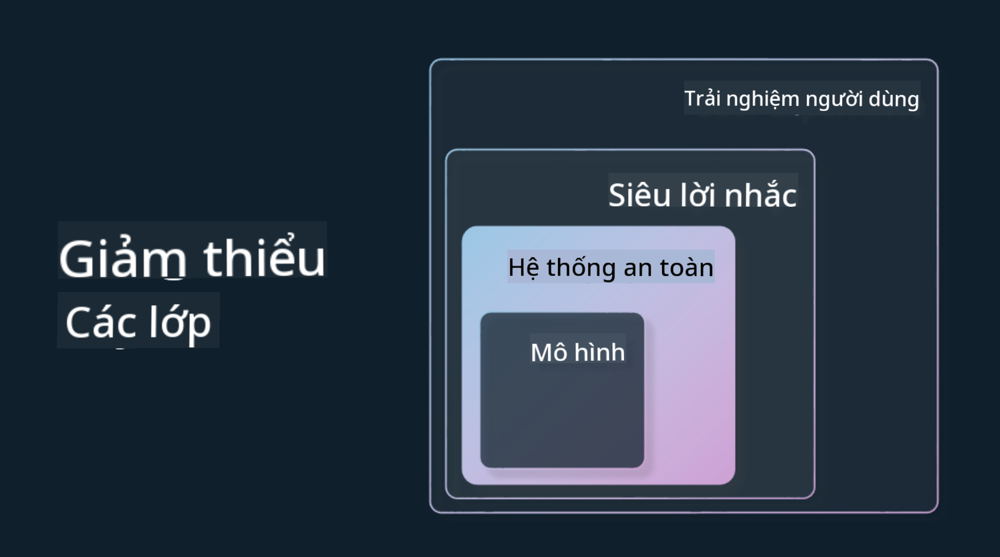

<!--
CO_OP_TRANSLATOR_METADATA:
{
  "original_hash": "13084c6321a2092841b9a081b29497ba",
  "translation_date": "2025-05-19T14:45:02+00:00",
  "source_file": "03-using-generative-ai-responsibly/README.md",
  "language_code": "vi"
}
-->
# Sử dụng AI Tạo sinh một cách Có trách nhiệm

> _Nhấn vào hình trên để xem video của bài học này_

Rất dễ bị cuốn hút bởi AI và đặc biệt là AI Tạo sinh, nhưng bạn cần cân nhắc cách sử dụng nó một cách có trách nhiệm. Bạn cần cân nhắc các yếu tố như làm thế nào để đảm bảo đầu ra là công bằng, không gây hại và hơn thế nữa. Chương này nhằm cung cấp cho bạn bối cảnh đã đề cập, những gì cần cân nhắc và cách thực hiện các bước tích cực để cải thiện việc sử dụng AI của bạn.

## Giới thiệu

Bài học này sẽ bao gồm:

- Tại sao bạn nên ưu tiên AI Có trách nhiệm khi xây dựng các ứng dụng AI Tạo sinh.
- Các nguyên tắc cốt lõi của AI Có trách nhiệm và cách chúng liên quan đến AI Tạo sinh.
- Cách áp dụng các nguyên tắc AI Có trách nhiệm này vào thực tế thông qua chiến lược và công cụ.

## Mục tiêu học tập

Sau khi hoàn thành bài học này, bạn sẽ biết:

- Tầm quan trọng của AI Có trách nhiệm khi xây dựng các ứng dụng AI Tạo sinh.
- Khi nào cần suy nghĩ và áp dụng các nguyên tắc cốt lõi của AI Có trách nhiệm khi xây dựng các ứng dụng AI Tạo sinh.
- Các công cụ và chiến lược nào có sẵn để bạn đưa khái niệm AI Có trách nhiệm vào thực tế.

## Nguyên tắc AI Có trách nhiệm

Sự phấn khích về AI Tạo sinh chưa bao giờ cao hơn. Sự phấn khích này đã mang lại rất nhiều nhà phát triển mới, sự chú ý và tài trợ cho lĩnh vực này. Mặc dù điều này rất tích cực đối với bất kỳ ai muốn xây dựng sản phẩm và công ty sử dụng AI Tạo sinh, nhưng điều quan trọng là chúng ta phải tiến hành một cách có trách nhiệm.

Trong suốt khóa học này, chúng tôi tập trung vào việc xây dựng startup của mình và sản phẩm giáo dục AI của chúng tôi. Chúng tôi sẽ sử dụng các nguyên tắc AI Có trách nhiệm: Công bằng, Bao trùm, Độ tin cậy/An toàn, Bảo mật & Riêng tư, Minh bạch và Trách nhiệm giải trình. Với những nguyên tắc này, chúng tôi sẽ khám phá cách chúng liên quan đến việc sử dụng AI Tạo sinh trong các sản phẩm của chúng tôi.

## Tại sao bạn nên ưu tiên AI Có trách nhiệm

Khi xây dựng một sản phẩm, việc áp dụng cách tiếp cận lấy con người làm trung tâm bằng cách giữ lợi ích tốt nhất của người dùng trong tâm trí dẫn đến kết quả tốt nhất.

Sự độc đáo của AI Tạo sinh là khả năng tạo ra các câu trả lời, thông tin, hướng dẫn và nội dung hữu ích cho người dùng. Điều này có thể được thực hiện mà không cần nhiều bước thủ công, có thể dẫn đến kết quả rất ấn tượng. Tuy nhiên, nếu không có kế hoạch và chiến lược phù hợp, nó cũng có thể dẫn đến một số kết quả có hại cho người dùng, sản phẩm của bạn và xã hội nói chung.

Hãy xem một số (nhưng không phải tất cả) những kết quả có thể gây hại này:

### Ảo giác

Ảo giác là một thuật ngữ dùng để mô tả khi một LLM tạo ra nội dung hoàn toàn vô nghĩa hoặc điều mà chúng ta biết là sai sự thật dựa trên các nguồn thông tin khác.

Hãy lấy ví dụ chúng ta xây dựng một tính năng cho startup của mình cho phép sinh viên đặt câu hỏi lịch sử cho một mô hình. Một sinh viên hỏi câu hỏi `Who was the sole survivor of Titanic?`

Mô hình tạo ra một phản hồi như bên dưới:

> _(Nguồn: [Flying bisons](https://flyingbisons.com?WT.mc_id=academic-105485-koreyst))_

Đây là một câu trả lời rất tự tin và chi tiết. Đáng tiếc, nó không chính xác. Ngay cả với một lượng nghiên cứu tối thiểu, người ta sẽ phát hiện ra rằng có nhiều hơn một người sống sót trong thảm họa Titanic. Đối với một sinh viên chỉ mới bắt đầu nghiên cứu chủ đề này, câu trả lời này có thể đủ thuyết phục để không bị nghi ngờ và được coi là sự thật. Hậu quả của điều này có thể dẫn đến hệ thống AI không đáng tin cậy và ảnh hưởng tiêu cực đến uy tín của startup của chúng tôi.

Với mỗi lần lặp lại của bất kỳ LLM nào, chúng ta đã thấy những cải tiến về hiệu suất xung quanh việc giảm thiểu ảo giác. Ngay cả với sự cải tiến này, chúng tôi với tư cách là người xây dựng ứng dụng và người dùng vẫn cần nhận thức được những hạn chế này.

### Nội dung có hại

Chúng tôi đã đề cập trong phần trước khi một LLM tạo ra các phản hồi không chính xác hoặc vô nghĩa. Một rủi ro khác mà chúng ta cần nhận thức là khi một mô hình phản hồi bằng nội dung có hại.

Nội dung có hại có thể được định nghĩa là:

- Cung cấp hướng dẫn hoặc khuyến khích tự làm hại hoặc gây hại cho một số nhóm nhất định.
- Nội dung thù hận hoặc hạ thấp.
- Hướng dẫn lập kế hoạch bất kỳ loại tấn công hoặc hành động bạo lực nào.
- Cung cấp hướng dẫn về cách tìm nội dung bất hợp pháp hoặc thực hiện hành vi bất hợp pháp.
- Hiển thị nội dung khiêu dâm.

Đối với startup của chúng tôi, chúng tôi muốn đảm bảo rằng chúng tôi có các công cụ và chiến lược phù hợp để ngăn chặn loại nội dung này xuất hiện trước sinh viên.

### Thiếu công bằng

Công bằng được định nghĩa là “đảm bảo rằng một hệ thống AI không có thiên vị và phân biệt đối xử và rằng chúng đối xử với mọi người một cách công bằng và bình đẳng.” Trong thế giới của AI Tạo sinh, chúng tôi muốn đảm bảo rằng các quan điểm loại trừ của các nhóm bị thiệt thòi không bị củng cố bởi đầu ra của mô hình.

Các loại đầu ra này không chỉ phá hủy việc xây dựng trải nghiệm sản phẩm tích cực cho người dùng của chúng tôi mà còn gây ra thiệt hại xã hội hơn nữa. Với tư cách là người xây dựng ứng dụng, chúng tôi nên luôn giữ một cơ sở người dùng rộng lớn và đa dạng khi xây dựng các giải pháp với AI Tạo sinh.

## Cách sử dụng AI Tạo sinh có trách nhiệm

Bây giờ chúng tôi đã xác định được tầm quan trọng của AI Tạo sinh có trách nhiệm, hãy cùng xem 4 bước chúng tôi có thể thực hiện để xây dựng các giải pháp AI của mình một cách có trách nhiệm:

### Đo lường các tác hại tiềm ẩn

Trong kiểm thử phần mềm, chúng tôi kiểm thử các hành động dự kiến của người dùng trên một ứng dụng. Tương tự, kiểm thử một tập hợp đa dạng các gợi ý mà người dùng có khả năng sử dụng là một cách tốt để đo lường tác hại tiềm ẩn.

Vì startup của chúng tôi đang xây dựng một sản phẩm giáo dục, sẽ tốt nếu chuẩn bị một danh sách các gợi ý liên quan đến giáo dục. Điều này có thể bao gồm một số chủ đề nhất định, các sự kiện lịch sử và các gợi ý về cuộc sống sinh viên.

### Giảm thiểu các tác hại tiềm ẩn

Đã đến lúc tìm cách mà chúng tôi có thể ngăn chặn hoặc hạn chế tác hại tiềm ẩn do mô hình và các phản hồi của nó gây ra. Chúng tôi có thể xem xét điều này ở 4 lớp khác nhau:

- **Mô hình**. Chọn mô hình phù hợp cho trường hợp sử dụng phù hợp. Các mô hình lớn và phức tạp hơn như GPT-4 có thể gây ra nhiều rủi ro hơn về nội dung có hại khi áp dụng cho các trường hợp sử dụng nhỏ hơn và cụ thể hơn. Sử dụng dữ liệu đào tạo của bạn để tinh chỉnh cũng giảm thiểu rủi ro về nội dung có hại.

- **Hệ thống An toàn**. Một hệ thống an toàn là một tập hợp các công cụ và cấu hình trên nền tảng phục vụ mô hình giúp giảm thiểu tác hại. Một ví dụ về điều này là hệ thống lọc nội dung trên dịch vụ Azure OpenAI. Các hệ thống cũng nên phát hiện các cuộc tấn công jailbreak và các hoạt động không mong muốn như yêu cầu từ các bot.

- **Metaprompt**. Metaprompt và grounding là những cách mà chúng ta có thể hướng dẫn hoặc giới hạn mô hình dựa trên các hành vi và thông tin nhất định. Điều này có thể là sử dụng các đầu vào hệ thống để xác định các giới hạn nhất định của mô hình. Ngoài ra, cung cấp các đầu ra phù hợp hơn với phạm vi hoặc lĩnh vực của hệ thống.

Nó cũng có thể là sử dụng các kỹ thuật như Tạo sinh Tăng cường Truy xuất (RAG) để mô hình chỉ lấy thông tin từ một tập hợp các nguồn đáng tin cậy. Có một bài học sau trong khóa học này về [xây dựng các ứng dụng tìm kiếm](../08-building-search-applications/README.md?WT.mc_id=academic-105485-koreyst)

- **Trải nghiệm Người dùng**. Lớp cuối cùng là nơi người dùng tương tác trực tiếp với mô hình thông qua giao diện ứng dụng của chúng tôi theo một cách nào đó. Bằng cách này, chúng tôi có thể thiết kế UI/UX để giới hạn người dùng về các loại đầu vào mà họ có thể gửi cho mô hình cũng như văn bản hoặc hình ảnh được hiển thị cho người dùng. Khi triển khai ứng dụng AI, chúng tôi cũng phải minh bạch về những gì ứng dụng AI Tạo sinh của chúng tôi có thể và không thể làm.

Chúng tôi có một bài học hoàn toàn dành riêng cho [Thiết kế UX cho các Ứng dụng AI](../12-designing-ux-for-ai-applications/README.md?WT.mc_id=academic-105485-koreyst)

- **Đánh giá mô hình**. Làm việc với LLMs có thể là một thách thức vì chúng tôi không phải lúc nào cũng kiểm soát được dữ liệu mà mô hình đã được đào tạo. Dù sao đi nữa, chúng tôi nên luôn đánh giá hiệu suất và đầu ra của mô hình. Vẫn quan trọng để đo lường độ chính xác, độ tương đồng, độ bám sát và mức độ liên quan của đầu ra của mô hình. Điều này giúp cung cấp sự minh bạch và tin cậy cho các bên liên quan và người dùng.

### Vận hành một giải pháp AI Tạo sinh có trách nhiệm

Xây dựng một thực hành vận hành xung quanh các ứng dụng AI của bạn là giai đoạn cuối cùng. Điều này bao gồm hợp tác với các bộ phận khác của startup của chúng tôi như Pháp lý và Bảo mật để đảm bảo chúng tôi tuân thủ tất cả các chính sách quy định. Trước khi ra mắt, chúng tôi cũng muốn xây dựng kế hoạch xung quanh việc giao hàng, xử lý sự cố và khôi phục để ngăn chặn bất kỳ tác hại nào đối với người dùng của chúng tôi.

## Công cụ

Mặc dù công việc phát triển các giải pháp AI Có trách nhiệm có vẻ như rất nhiều, nhưng đó là công việc rất đáng giá. Khi lĩnh vực AI Tạo sinh phát triển, nhiều công cụ để giúp các nhà phát triển tích hợp trách nhiệm vào quy trình công việc của họ một cách hiệu quả sẽ trưởng thành. Ví dụ, [Azure AI Content Safety](https://learn.microsoft.com/azure/ai-services/content-safety/overview?WT.mc_id=academic-105485-koreyst) có thể giúp phát hiện nội dung và hình ảnh có hại thông qua một yêu cầu API.

## Kiểm tra kiến thức

Có những điều gì bạn cần quan tâm để đảm bảo việc sử dụng AI có trách nhiệm?

1. Rằng câu trả lời là chính xác.
1. Sử dụng có hại, rằng AI không được sử dụng cho mục đích phạm tội.
1. Đảm bảo rằng AI không có thiên vị và phân biệt đối xử.

A: 2 và 3 là đúng. AI Có trách nhiệm giúp bạn cân nhắc cách giảm thiểu các tác động có hại và thiên kiến và nhiều hơn nữa.

## 🚀 Thử thách

Đọc về [Azure AI Content Safety](https://learn.microsoft.com/azure/ai-services/content-safety/overview?WT.mc_id=academic-105485-koreyst) và xem những gì bạn có thể áp dụng cho việc sử dụng của mình.

## Công việc tuyệt vời, Tiếp tục Học tập của bạn

Sau khi hoàn thành bài học này, hãy xem bộ sưu tập [Học tập AI Tạo sinh](https://aka.ms/genai-collection?WT.mc_id=academic-105485-koreyst) của chúng tôi để tiếp tục nâng cao kiến thức về AI Tạo sinh của bạn!

Hãy đến với Bài học 4, nơi chúng ta sẽ xem xét [Các nguyên tắc cơ bản về Kỹ thuật Gợi ý](../04-prompt-engineering-fundamentals/README.md?WT.mc_id=academic-105485-koreyst)!

**Tuyên bố miễn trừ trách nhiệm**:  
Tài liệu này đã được dịch bằng dịch vụ dịch thuật AI [Co-op Translator](https://github.com/Azure/co-op-translator). Mặc dù chúng tôi cố gắng đảm bảo độ chính xác, xin lưu ý rằng các bản dịch tự động có thể chứa lỗi hoặc không chính xác. Tài liệu gốc bằng ngôn ngữ bản địa nên được coi là nguồn thông tin chính thức. Đối với thông tin quan trọng, chúng tôi khuyến nghị sử dụng dịch vụ dịch thuật chuyên nghiệp của con người. Chúng tôi không chịu trách nhiệm cho bất kỳ sự hiểu lầm hoặc diễn giải sai nào phát sinh từ việc sử dụng bản dịch này.