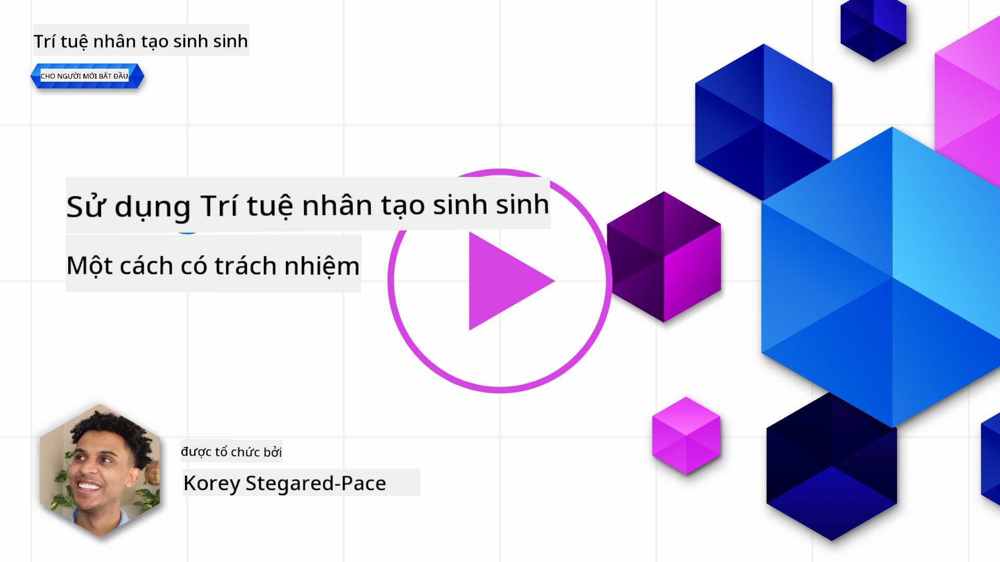
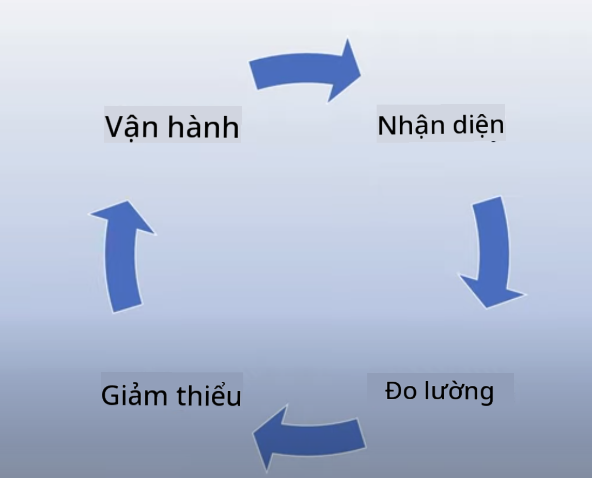

<!--
CO_OP_TRANSLATOR_METADATA:
{
  "original_hash": "4d57fad773cbeb69c5dd62e65c34200d",
  "translation_date": "2025-10-17T20:33:23+00:00",
  "source_file": "03-using-generative-ai-responsibly/README.md",
  "language_code": "vi"
}
-->
# Sử dụng AI Tạo Nội Dung một cách Có Trách Nhiệm

> _Nhấn vào hình ảnh trên để xem video của bài học này_

AI, đặc biệt là AI Tạo Nội Dung, rất dễ khiến chúng ta bị cuốn hút, nhưng bạn cần cân nhắc cách sử dụng nó một cách có trách nhiệm. Bạn cần xem xét các yếu tố như làm thế nào để đảm bảo đầu ra công bằng, không gây hại và nhiều hơn nữa. Chương này nhằm cung cấp cho bạn bối cảnh đã đề cập, những điều cần cân nhắc và cách thực hiện các bước chủ động để cải thiện việc sử dụng AI của bạn.

## Giới thiệu

Bài học này sẽ đề cập đến:

- Tại sao bạn nên ưu tiên AI Có Trách Nhiệm khi xây dựng các ứng dụng AI Tạo Nội Dung.
- Các nguyên tắc cốt lõi của AI Có Trách Nhiệm và cách chúng liên quan đến AI Tạo Nội Dung.
- Cách áp dụng các nguyên tắc AI Có Trách Nhiệm thông qua chiến lược và công cụ.

## Mục tiêu học tập

Sau khi hoàn thành bài học này, bạn sẽ biết:

- Tầm quan trọng của AI Có Trách Nhiệm khi xây dựng các ứng dụng AI Tạo Nội Dung.
- Khi nào cần suy nghĩ và áp dụng các nguyên tắc cốt lõi của AI Có Trách Nhiệm khi xây dựng các ứng dụng AI Tạo Nội Dung.
- Những công cụ và chiến lược nào có sẵn để bạn áp dụng khái niệm AI Có Trách Nhiệm vào thực tế.

## Nguyên tắc AI Có Trách Nhiệm

Sự phấn khích về AI Tạo Nội Dung chưa bao giờ cao như hiện nay. Sự phấn khích này đã thu hút rất nhiều nhà phát triển mới, sự chú ý và nguồn tài trợ vào lĩnh vực này. Mặc dù đây là điều rất tích cực đối với bất kỳ ai muốn xây dựng sản phẩm và công ty sử dụng AI Tạo Nội Dung, nhưng cũng rất quan trọng để chúng ta tiến hành một cách có trách nhiệm.

Trong suốt khóa học này, chúng ta sẽ tập trung vào việc xây dựng startup và sản phẩm giáo dục AI của mình. Chúng ta sẽ sử dụng các nguyên tắc của AI Có Trách Nhiệm: Công bằng, Bao trùm, Độ tin cậy/An toàn, Bảo mật & Quyền riêng tư, Minh bạch và Trách nhiệm. Với những nguyên tắc này, chúng ta sẽ khám phá cách chúng liên quan đến việc sử dụng AI Tạo Nội Dung trong các sản phẩm của mình.

## Tại sao bạn nên ưu tiên AI Có Trách Nhiệm

Khi xây dựng một sản phẩm, việc áp dụng cách tiếp cận lấy con người làm trung tâm bằng cách giữ lợi ích tốt nhất của người dùng trong tâm trí sẽ mang lại kết quả tốt nhất.

Điểm đặc biệt của AI Tạo Nội Dung là khả năng tạo ra các câu trả lời hữu ích, thông tin, hướng dẫn và nội dung cho người dùng. Điều này có thể được thực hiện mà không cần nhiều bước thủ công, dẫn đến kết quả rất ấn tượng. Tuy nhiên, nếu không có kế hoạch và chiến lược phù hợp, nó cũng có thể dẫn đến một số kết quả gây hại cho người dùng, sản phẩm của bạn và xã hội nói chung.

Hãy cùng xem một số (nhưng không phải tất cả) những kết quả có thể gây hại này:

### Ảo giác

Ảo giác là thuật ngữ được sử dụng để mô tả khi một LLM tạo ra nội dung hoàn toàn vô nghĩa hoặc điều gì đó mà chúng ta biết là sai sự thật dựa trên các nguồn thông tin khác.

Hãy lấy ví dụ chúng ta xây dựng một tính năng cho startup của mình cho phép học sinh đặt câu hỏi lịch sử cho một mô hình. Một học sinh hỏi câu hỏi `Ai là người sống sót duy nhất của Titanic?`

Mô hình tạo ra một câu trả lời như bên dưới:

> _(Nguồn: [Flying bisons](https://flyingbisons.com?WT.mc_id=academic-105485-koreyst))_

Đây là một câu trả lời rất tự tin và chi tiết. Tuy nhiên, nó không chính xác. Ngay cả với một lượng nghiên cứu tối thiểu, người ta cũng sẽ phát hiện ra rằng có nhiều hơn một người sống sót trong thảm họa Titanic. Đối với một học sinh mới bắt đầu nghiên cứu chủ đề này, câu trả lời này có thể đủ thuyết phục để không bị nghi ngờ và được coi là sự thật. Hậu quả của điều này có thể dẫn đến hệ thống AI không đáng tin cậy và ảnh hưởng tiêu cực đến danh tiếng của startup của chúng ta.

Với mỗi lần lặp lại của bất kỳ LLM nào, chúng ta đã thấy sự cải thiện hiệu suất trong việc giảm thiểu ảo giác. Ngay cả với sự cải thiện này, chúng ta với tư cách là người xây dựng ứng dụng và người dùng vẫn cần nhận thức được những hạn chế này.

### Nội dung gây hại

Chúng ta đã đề cập trong phần trước khi một LLM tạo ra các phản hồi không chính xác hoặc vô nghĩa. Một rủi ro khác mà chúng ta cần nhận thức là khi một mô hình phản hồi bằng nội dung gây hại.

Nội dung gây hại có thể được định nghĩa là:

- Cung cấp hướng dẫn hoặc khuyến khích tự gây hại hoặc gây hại cho một số nhóm nhất định.
- Nội dung thù hận hoặc hạ thấp.
- Hướng dẫn lập kế hoạch cho bất kỳ loại tấn công hoặc hành động bạo lực nào.
- Cung cấp hướng dẫn về cách tìm nội dung bất hợp pháp hoặc thực hiện hành vi bất hợp pháp.
- Hiển thị nội dung khiêu dâm.

Đối với startup của chúng ta, chúng ta muốn đảm bảo rằng chúng ta có các công cụ và chiến lược phù hợp để ngăn chặn loại nội dung này được nhìn thấy bởi học sinh.

### Thiếu công bằng

Công bằng được định nghĩa là “đảm bảo rằng hệ thống AI không có thiên vị và phân biệt đối xử, và đối xử với mọi người một cách công bằng và bình đẳng.” Trong thế giới AI Tạo Nội Dung, chúng ta muốn đảm bảo rằng các quan điểm loại trừ của các nhóm bị thiệt thòi không được củng cố bởi đầu ra của mô hình.

Những loại đầu ra này không chỉ phá hoại việc xây dựng trải nghiệm sản phẩm tích cực cho người dùng của chúng ta, mà còn gây hại thêm cho xã hội. Là người xây dựng ứng dụng, chúng ta nên luôn giữ một cơ sở người dùng rộng và đa dạng trong tâm trí khi xây dựng các giải pháp với AI Tạo Nội Dung.

## Cách sử dụng AI Tạo Nội Dung một cách Có Trách Nhiệm

Bây giờ chúng ta đã xác định được tầm quan trọng của AI Tạo Nội Dung Có Trách Nhiệm, hãy cùng xem 4 bước chúng ta có thể thực hiện để xây dựng các giải pháp AI của mình một cách có trách nhiệm:

### Đo lường các tác hại tiềm ẩn

Trong kiểm thử phần mềm, chúng ta kiểm tra các hành động dự kiến của người dùng trên một ứng dụng. Tương tự, kiểm tra một tập hợp đa dạng các lời nhắc mà người dùng có khả năng sử dụng là một cách tốt để đo lường tác hại tiềm ẩn.

Vì startup của chúng ta đang xây dựng một sản phẩm giáo dục, sẽ rất tốt nếu chuẩn bị một danh sách các lời nhắc liên quan đến giáo dục. Điều này có thể bao gồm một số môn học, các sự kiện lịch sử và các lời nhắc về cuộc sống học sinh.

### Giảm thiểu các tác hại tiềm ẩn

Bây giờ là lúc tìm cách để chúng ta có thể ngăn chặn hoặc hạn chế tác hại tiềm ẩn do mô hình và các phản hồi của nó gây ra. Chúng ta có thể xem xét điều này ở 4 lớp khác nhau:

- **Mô hình**. Lựa chọn mô hình phù hợp với trường hợp sử dụng. Các mô hình lớn và phức tạp hơn như GPT-4 có thể gây ra nhiều rủi ro về nội dung gây hại hơn khi áp dụng cho các trường hợp sử dụng nhỏ hơn và cụ thể hơn. Sử dụng dữ liệu đào tạo của bạn để tinh chỉnh cũng giảm thiểu rủi ro về nội dung gây hại.

- **Hệ thống An toàn**. Hệ thống an toàn là một tập hợp các công cụ và cấu hình trên nền tảng phục vụ mô hình giúp giảm thiểu tác hại. Một ví dụ về điều này là hệ thống lọc nội dung trên dịch vụ Azure OpenAI. Các hệ thống cũng nên phát hiện các cuộc tấn công jailbreak và hoạt động không mong muốn như các yêu cầu từ bot.

- **Metaprompt**. Metaprompt và grounding là những cách chúng ta có thể định hướng hoặc giới hạn mô hình dựa trên các hành vi và thông tin nhất định. Điều này có thể là sử dụng các đầu vào hệ thống để xác định các giới hạn nhất định của mô hình. Ngoài ra, cung cấp các đầu ra phù hợp hơn với phạm vi hoặc lĩnh vực của hệ thống.

Nó cũng có thể là sử dụng các kỹ thuật như Retrieval Augmented Generation (RAG) để mô hình chỉ lấy thông tin từ một tập hợp các nguồn đáng tin cậy. Có một bài học sau trong khóa học này về [xây dựng ứng dụng tìm kiếm](../08-building-search-applications/README.md?WT.mc_id=academic-105485-koreyst)

- **Trải nghiệm Người dùng**. Lớp cuối cùng là nơi người dùng tương tác trực tiếp với mô hình thông qua giao diện ứng dụng của chúng ta theo một cách nào đó. Theo cách này, chúng ta có thể thiết kế UI/UX để giới hạn người dùng về các loại đầu vào mà họ có thể gửi đến mô hình cũng như văn bản hoặc hình ảnh hiển thị cho người dùng. Khi triển khai ứng dụng AI, chúng ta cũng phải minh bạch về những gì ứng dụng AI Tạo Nội Dung của chúng ta có thể và không thể làm.

Chúng ta có một bài học toàn diện dành riêng cho [Thiết kế UX cho Ứng dụng AI](../12-designing-ux-for-ai-applications/README.md?WT.mc_id=academic-105485-koreyst)

- **Đánh giá mô hình**. Làm việc với LLM có thể là một thách thức vì chúng ta không phải lúc nào cũng kiểm soát được dữ liệu mà mô hình đã được đào tạo. Dù vậy, chúng ta vẫn nên đánh giá hiệu suất và đầu ra của mô hình. Điều này vẫn quan trọng để đo lường độ chính xác, sự tương đồng, tính căn cứ và mức độ liên quan của đầu ra. Điều này giúp cung cấp sự minh bạch và tin tưởng cho các bên liên quan và người dùng.

### Vận hành một giải pháp AI Tạo Nội Dung Có Trách Nhiệm

Xây dựng một thực hành vận hành xung quanh các ứng dụng AI của bạn là giai đoạn cuối cùng. Điều này bao gồm hợp tác với các bộ phận khác của startup như Pháp lý và Bảo mật để đảm bảo chúng ta tuân thủ tất cả các chính sách quy định. Trước khi ra mắt, chúng ta cũng muốn xây dựng các kế hoạch xung quanh việc triển khai, xử lý sự cố và quay lại để ngăn chặn bất kỳ tác hại nào đối với người dùng của chúng ta.

## Công cụ

Mặc dù công việc phát triển các giải pháp AI Có Trách Nhiệm có vẻ như rất nhiều, nhưng đó là công việc rất đáng để thực hiện. Khi lĩnh vực AI Tạo Nội Dung phát triển, các công cụ giúp nhà phát triển tích hợp trách nhiệm vào quy trình làm việc của họ sẽ ngày càng trưởng thành. Ví dụ, [Azure AI Content Safety](https://learn.microsoft.com/azure/ai-services/content-safety/overview?WT.mc_id=academic-105485-koreyst) có thể giúp phát hiện nội dung và hình ảnh gây hại thông qua yêu cầu API.

## Kiểm tra kiến thức

Những điều nào bạn cần quan tâm để đảm bảo sử dụng AI một cách có trách nhiệm?

1. Đảm bảo câu trả lời chính xác.
1. Sử dụng gây hại, rằng AI không được sử dụng cho mục đích phạm pháp.
1. Đảm bảo AI không có thiên vị và phân biệt đối xử.

A: 2 và 3 là đúng. AI Có Trách Nhiệm giúp bạn cân nhắc cách giảm thiểu các tác động gây hại và thiên vị, cùng nhiều điều khác.

## 🚀 Thử thách

Tìm hiểu thêm về [Azure AI Content Safety](https://learn.microsoft.com/azure/ai-services/content-safety/overview?WT.mc_id=academic-105485-koreyst) và xem bạn có thể áp dụng gì cho việc sử dụng của mình.

## Làm tốt lắm, tiếp tục học tập

Sau khi hoàn thành bài học này, hãy xem bộ sưu tập [Học về AI Tạo Nội Dung](https://aka.ms/genai-collection?WT.mc_id=academic-105485-koreyst) của chúng tôi để tiếp tục nâng cao kiến thức về AI Tạo Nội Dung!

Hãy chuyển sang Bài học 4, nơi chúng ta sẽ tìm hiểu về [Các nguyên tắc cơ bản của Kỹ thuật Lời nhắc](../04-prompt-engineering-fundamentals/README.md?WT.mc_id=academic-105485-koreyst)!

---

**Tuyên bố miễn trừ trách nhiệm**:  
Tài liệu này đã được dịch bằng dịch vụ dịch thuật AI [Co-op Translator](https://github.com/Azure/co-op-translator). Mặc dù chúng tôi cố gắng đảm bảo độ chính xác, xin lưu ý rằng các bản dịch tự động có thể chứa lỗi hoặc không chính xác. Tài liệu gốc bằng ngôn ngữ bản địa nên được coi là nguồn thông tin chính xác nhất. Đối với thông tin quan trọng, chúng tôi khuyến nghị sử dụng dịch vụ dịch thuật chuyên nghiệp từ con người. Chúng tôi không chịu trách nhiệm cho bất kỳ sự hiểu lầm hoặc diễn giải sai nào phát sinh từ việc sử dụng bản dịch này.