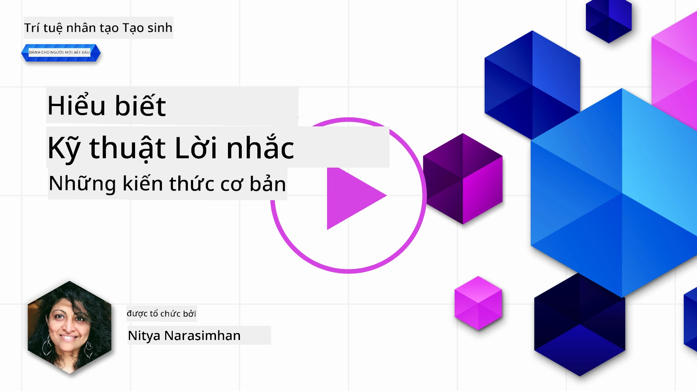
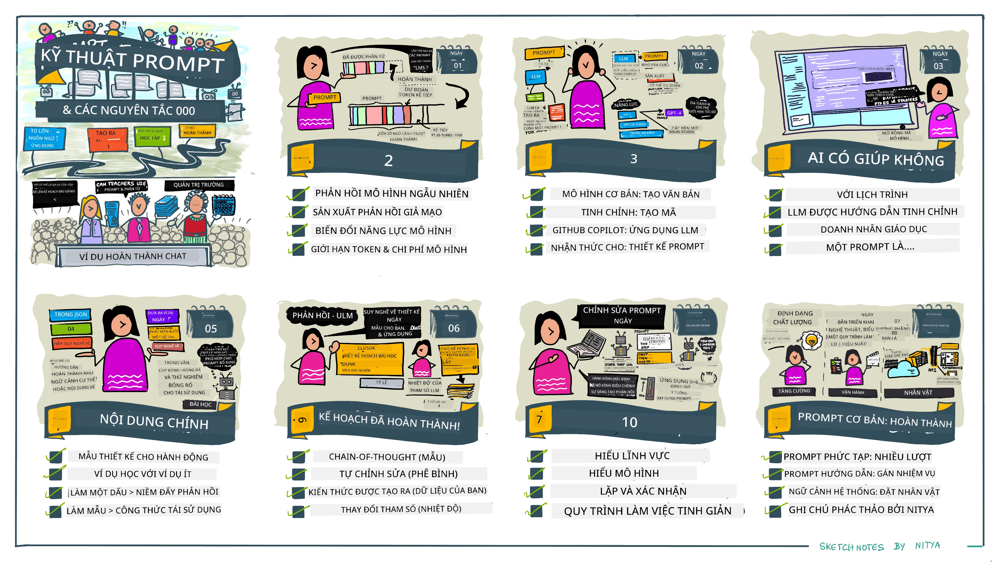
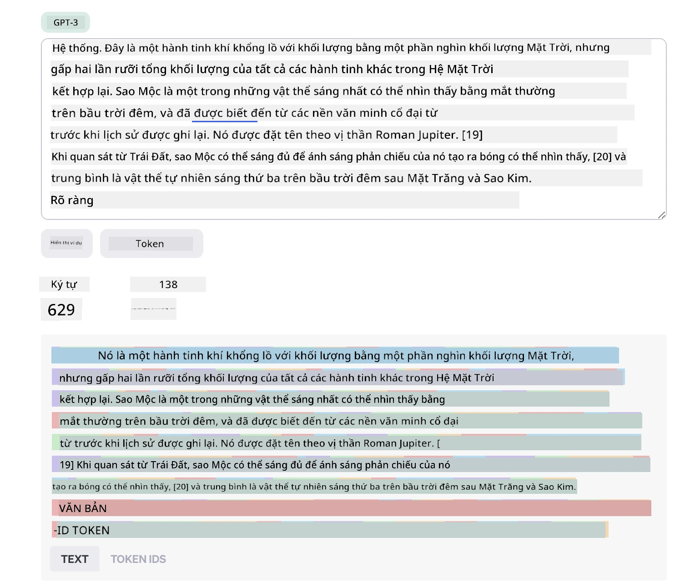
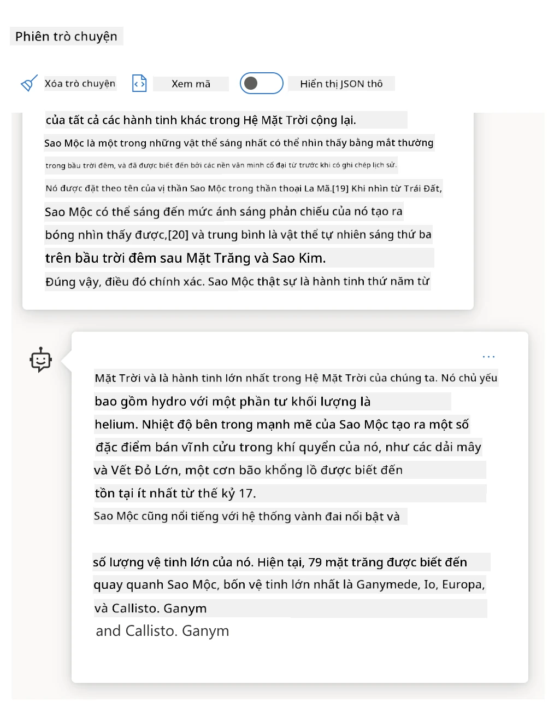
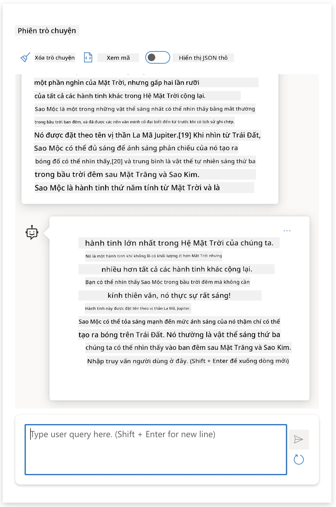
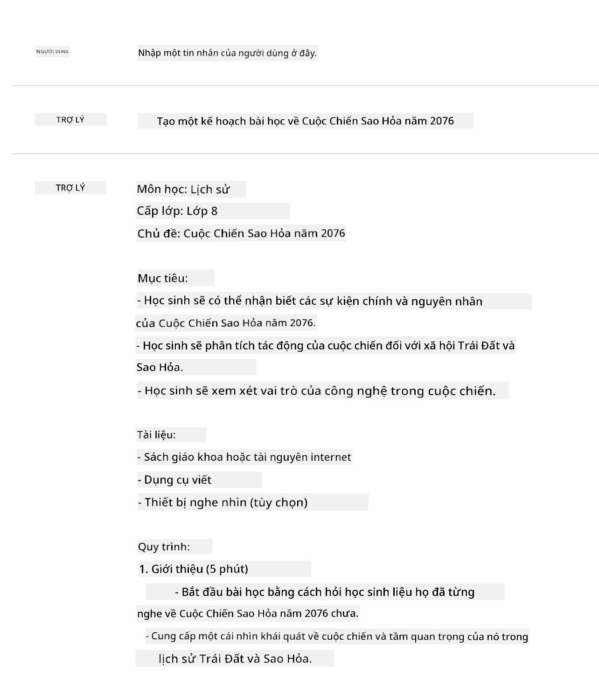
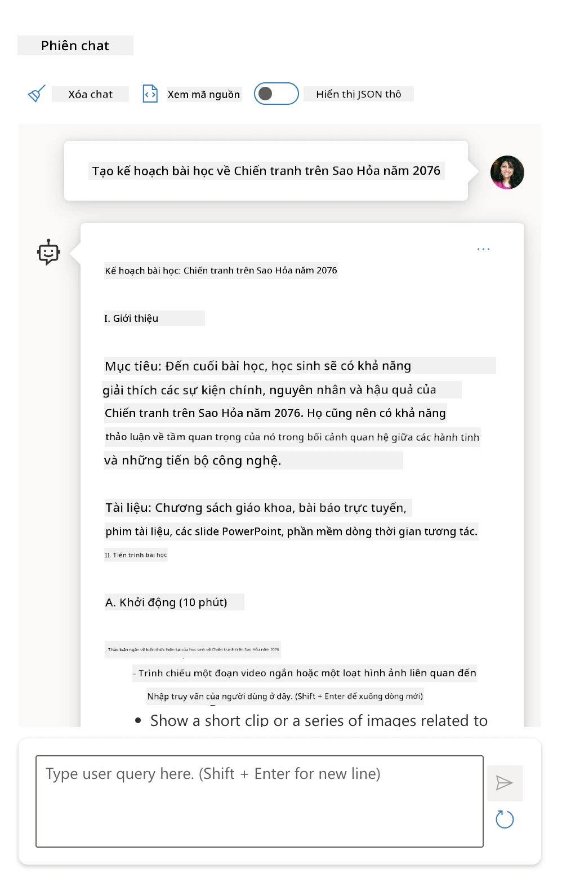
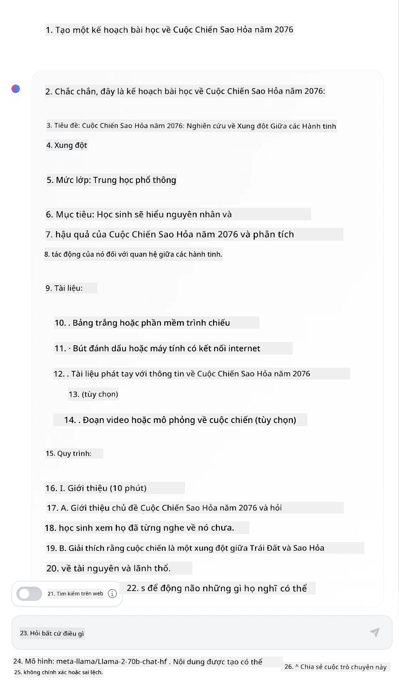

# Các Nguyên Lý Cơ Bản về Kỹ Thuật Tạo Prompt

[](https://youtu.be/GElCu2kUlRs?si=qrXsBvXnCW12epb8)

## Giới Thiệu
Mô-đun này bao gồm các khái niệm và kỹ thuật thiết yếu để tạo ra các prompt hiệu quả trong các mô hình AI sinh tạo. Cách bạn viết prompt cho một LLM cũng rất quan trọng. Một prompt được tạo cẩn thận có thể đạt được chất lượng phản hồi tốt hơn. Nhưng chính xác thì các thuật ngữ như _prompt_ và _kỹ thuật tạo prompt_ có ý nghĩa gì? Và làm sao để tôi cải thiện _đầu vào prompt_ mà tôi gửi cho LLM? Đây là những câu hỏi chúng ta sẽ cố gắng trả lời trong chương này và chương kế tiếp.

_AI sinh tạo_ có khả năng tạo ra nội dung mới (ví dụ: văn bản, hình ảnh, âm thanh, mã lập trình, v.v.) dựa trên yêu cầu từ người dùng. Nó thực hiện điều này bằng cách sử dụng _Các Mô Hình Ngôn Ngữ Lớn_ như chuỗi GPT ("Generative Pre-trained Transformer") của OpenAI được huấn luyện sử dụng ngôn ngữ tự nhiên và mã.

Người dùng hiện có thể tương tác với các mô hình này qua các hình thức quen thuộc như trò chuyện, mà không cần phải có chuyên môn kỹ thuật hay đào tạo. Các mô hình này hoạt động dựa trên _prompt_ - người dùng gửi đầu vào văn bản (prompt) và nhận lại phản hồi từ AI (hoàn thành). Họ có thể tiếp tục "trò chuyện với AI" một cách tương tác trong các cuộc hội thoại đa lượt, điều chỉnh prompt cho đến khi phản hồi phù hợp với mong đợi.

"Prompt" giờ đây trở thành _giao diện lập trình_ chính cho các ứng dụng AI sinh tạo, hướng dẫn mô hình thực hiện nhiệm vụ và ảnh hưởng đến chất lượng phản hồi nhận được. "Kỹ thuật tạo prompt" là một lĩnh vực nghiên cứu phát triển nhanh, tập trung vào _thiết kế và tối ưu_ các prompt để cung cấp phản hồi nhất quán và chất lượng ở quy mô lớn.

## Mục Tiêu Học Tập

Trong bài học này, chúng ta sẽ tìm hiểu Prompt Engineering là gì, tại sao nó quan trọng và cách tạo các prompt hiệu quả hơn cho một mô hình và mục tiêu ứng dụng cụ thể. Chúng ta sẽ hiểu các khái niệm cốt lõi và các phương pháp hay nhất trong kỹ thuật tạo prompt - và tìm hiểu về môi trường "sandbox" tương tác trên Jupyter Notebook, nơi ta có thể thấy các khái niệm này áp dụng vào các ví dụ thực tế.

Kết thúc bài học, bạn sẽ có khả năng:

1. Giải thích Prompt Engineering là gì và tại sao nó quan trọng.
2. Mô tả các thành phần của một prompt và cách chúng được sử dụng.
3. Học các phương pháp hay nhất và kỹ thuật tạo prompt.
4. Áp dụng kỹ thuật đã học vào các ví dụ thực tế, sử dụng endpoint của OpenAI.

## Thuật Ngữ Chính

Prompt Engineering: Thực hành thiết kế và tinh chỉnh các đầu vào để hướng dẫn các mô hình AI tạo ra kết quả mong muốn.  
Tokenization: Quá trình chuyển đổi văn bản thành các đơn vị nhỏ hơn, gọi là token, mà mô hình có thể hiểu và xử lý.  
Instruction-Tuned LLMs: Các Mô Hình Ngôn Ngữ Lớn (LLMs) được tinh chỉnh thêm với các hướng dẫn cụ thể nhằm cải thiện độ chính xác và sự phù hợp của phản hồi.

## Môi Trường Sandbox Học Tập

Kỹ thuật tạo prompt hiện nay là nghệ thuật nhiều hơn khoa học. Cách tốt nhất để cải thiện trực giác về nó là _thực hành nhiều hơn_ và áp dụng phương pháp thử-và-sai kết hợp kiến thức chuyên ngành cùng các kỹ thuật được đề xuất và tối ưu riêng theo mô hình.

Jupyter Notebook đi kèm bài học này cung cấp môi trường _sandbox_ để bạn thử nghiệm những gì học được - ngay khi học hoặc như một phần của thử thách mã ở cuối. Để thực hiện các bài tập, bạn sẽ cần:

1. **Khóa API Azure OpenAI** - điểm đầu cuối dịch vụ cho một LLM đã triển khai.  
2. **Môi trường thực thi Python** - nơi Notebook có thể chạy.  
3. **Biến môi trường nội bộ** - _hoàn thành các bước [SETUP](./../00-course-setup/02-setup-local.md?WT.mc_id=academic-105485-koreyst) ngay bây giờ để sẵn sàng_.

Notebook đi kèm các bài tập _khởi động_ - nhưng bạn được khuyến khích thêm phần _Markdown_ (mô tả) và _Code_ (yêu cầu prompt) để thử thêm nhiều ví dụ hoặc ý tưởng - và xây dựng trực giác thiết kế prompt của bạn.

## Hướng Dẫn Minh Họa

Muốn có cái nhìn tổng thể về bài học này trước khi bắt đầu? Xem qua hướng dẫn minh họa này, giúp bạn có cảm nhận về các chủ đề chính và các điểm nhấn quan trọng để bạn suy nghĩ ở từng phần. Lộ trình bài học dẫn bạn từ việc hiểu các khái niệm cốt lõi và thách thức đến cách giải quyết chúng bằng các kỹ thuật kỹ thuật tạo prompt và các phương pháp hay nhất tương ứng. Lưu ý rằng phần "Kỹ Thuật Nâng Cao" trong hướng dẫn này đề cập đến nội dung sẽ được trình bày trong _chương tiếp theo_ của chương trình học.



## Khởi Nghiệp Của Chúng Ta

Giờ, hãy nói về mối liên hệ của _chủ đề này_ với sứ mệnh khởi nghiệp của chúng ta là [mang đổi mới AI đến giáo dục](https://educationblog.microsoft.com/2023/06/collaborating-to-bring-ai-innovation-to-education?WT.mc_id=academic-105485-koreyst). Chúng ta muốn xây dựng các ứng dụng AI hỗ trợ _học tập cá nhân hóa_ - vậy hãy nghĩ về cách các người dùng khác nhau của ứng dụng có thể "thiết kế" prompt:

- **Quản trị viên** có thể yêu cầu AI _phân tích dữ liệu chương trình giảng dạy để xác định các khoảng trống trong phạm vi kiến thức_. AI có thể tóm tắt kết quả hoặc trực quan hóa chúng bằng mã.  
- **Giáo viên** có thể yêu cầu AI _tạo kế hoạch bài học cho đối tượng và chủ đề cụ thể_. AI có thể xây dựng kế hoạch cá nhân hóa theo định dạng yêu cầu.  
- **Học sinh** có thể yêu cầu AI _giúp dạy kèm môn học khó_. AI có thể hướng dẫn học sinh bằng bài giảng, gợi ý & ví dụ phù hợp với trình độ.

Đó mới chỉ là phần nổi của tảng băng chìm. Hãy xem qua [Prompts For Education](https://github.com/microsoft/prompts-for-edu/tree/main?WT.mc_id=academic-105485-koreyst) - một thư viện prompt mã nguồn mở do các chuyên gia giáo dục tuyển chọn - để có cái nhìn rộng hơn về các khả năng! _Hãy thử chạy một số prompt đó trong sandbox hoặc sử dụng OpenAI Playground để xem kết quả!_

<!--
LESSON TEMPLATE:
This unit should cover core concept #1.
Reinforce the concept with examples and references.

CONCEPT #1:
Prompt Engineering.
Define it and explain why it is needed.
-->

## Kỹ Thuật Tạo Prompt là gì?

Chúng ta đã bắt đầu bài học này bằng cách định nghĩa **Kỹ Thuật Tạo Prompt** là quá trình _thiết kế và tối ưu_ các đầu vào văn bản (prompt) để cung cấp phản hồi nhất quán và chất lượng (hoàn thành) cho một mục tiêu ứng dụng và mô hình cụ thể. Chúng ta có thể coi đây là một quy trình 2 bước:

- _thiết kế_ prompt ban đầu cho một mô hình và mục tiêu nhất định  
- _tinh chỉnh_ prompt lặp đi lặp lại để nâng cao chất lượng phản hồi

Đây tất yếu là một quy trình thử-và-sai đòi hỏi trực giác và nỗ lực của người dùng để đạt kết quả tối ưu. Vậy tại sao nó lại quan trọng? Để trả lời, trước hết chúng ta cần hiểu ba khái niệm:

- _Tokenization_ = cách mô hình "nhìn thấy" prompt  
- _Base LLMs_ = cách mô hình nền tảng "xử lý" prompt  
- _Instruction-Tuned LLMs_ = cách mô hình giờ đây có thể hiểu "nhiệm vụ"

### Tokenization

Một LLM nhìn thấy prompt dưới dạng _chuỗi các token_ mà các mô hình khác nhau (hoặc các phiên bản của một mô hình) có thể chia token của cùng một prompt theo cách khác nhau. Vì LLM được huấn luyện trên token (không phải trên văn bản thô), cách mà prompt được token hóa ảnh hưởng trực tiếp đến chất lượng phản hồi tạo ra.

Để hiểu thêm về cách tokenization hoạt động, hãy thử các công cụ như [OpenAI Tokenizer](https://platform.openai.com/tokenizer?WT.mc_id=academic-105485-koreyst) được minh họa bên dưới. Sao chép prompt của bạn vào - và xem nó được chuyển thành các token như thế nào, chú ý cách các ký tự dấu cách và dấu câu được xử lý. Lưu ý rằng ví dụ này dùng một LLM cũ hơn (GPT-3) - nên thử với mô hình mới hơn có thể cho kết quả khác.



### Khái Niệm: Mô Hình Nền Tảng

Khi prompt đã được token hóa, chức năng chính của ["Base LLM"](https://blog.gopenai.com/an-introduction-to-base-and-instruction-tuned-large-language-models-8de102c785a6?WT.mc_id=academic-105485-koreyst) (hay mô hình nền tảng) là dự đoán token tiếp theo trong chuỗi đó. Vì LLM được huấn luyện trên các tập dữ liệu văn bản khổng lồ, chúng có hiểu biết tốt về các mối quan hệ thống kê giữa các token và có thể dự đoán với độ tin cậy nhất định. Lưu ý rằng chúng không hiểu _ý nghĩa_ của từ trong prompt hoặc token; chúng chỉ nhận thấy một mẫu mà có thể "hoàn thiện" bằng dự đoán tiếp theo. Chúng có thể tiếp tục dự đoán cho đến khi bị người dùng can thiệp hoặc điều kiện kết thúc nào đó được thiết lập.

Muốn xem cách hoàn thành dựa trên prompt hoạt động? Nhập prompt trên vào Azure OpenAI Studio [_Chat Playground_](https://oai.azure.com/playground?WT.mc_id=academic-105485-koreyst) với cấu hình mặc định. Hệ thống được cấu hình để coi prompt như các yêu cầu thông tin - nên bạn sẽ thấy phản hồi phù hợp với ngữ cảnh này.

Nhưng nếu người dùng muốn xem điều gì đó cụ thể hơn đáp ứng tiêu chí hoặc mục tiêu nhiệm vụ? Đây là lúc các LLM _được huấn luyện theo chỉ dẫn_ xuất hiện.



### Khái Niệm: LLM Được Huấn Luyện Theo Chỉ Dẫn

Một [Instruction Tuned LLM](https://blog.gopenai.com/an-introduction-to-base-and-instruction-tuned-large-language-models-8de102c785a6?WT.mc_id=academic-105485-koreyst) bắt đầu từ mô hình nền tảng và được tinh chỉnh thêm với các ví dụ hoặc cặp đầu vào/đầu ra (ví dụ: các "tin nhắn" đa lượt) có thể chứa chỉ dẫn rõ ràng - và phản hồi từ AI cố gắng tuân theo chỉ dẫn đó.

Các kỹ thuật như Học Tăng Cường với Phản Hồi Con Người (RLHF) được dùng nhằm huấn luyện mô hình _tuân theo chỉ dẫn_ và _học hỏi từ phản hồi_ để tạo ra các phản hồi phù hợp hơn với ứng dụng thực tế và đúng mục tiêu người dùng.

Hãy thử - quay lại prompt phía trên, nhưng lần này đổi _tin nhắn hệ thống_ cung cấp chỉ dẫn sau làm ngữ cảnh:

> _Tóm tắt nội dung bạn nhận được cho học sinh lớp hai. Giữ kết quả trong một đoạn với 3-5 mục gạch đầu dòng._

Bạn sẽ thấy kết quả nay đã được điều chỉnh để phản ánh đúng mục tiêu và định dạng mong muốn? Một giáo viên có thể dùng trực tiếp phản hồi này trong slide giảng dạy của họ.



## Tại Sao Chúng Ta Cần Kỹ Thuật Tạo Prompt?

Bây giờ chúng ta đã biết prompt được LLM xử lý như thế nào, hãy nói về _tại sao_ chúng ta cần kỹ thuật tạo prompt. Câu trả lời nằm ở việc các LLM hiện nay gặp nhiều thách thức khiến việc đạt được _phản hồi đáng tin cậy và nhất quán_ trở nên khó khăn nếu không bỏ công sức xây dựng và tối ưu prompt. Ví dụ:

1. **Phản hồi của mô hình mang tính ngẫu nhiên.** _Cùng một prompt_ có thể tạo ra các phản hồi khác nhau trên các mô hình hoặc các phiên bản mô hình khác nhau. Thậm chí nó có thể tạo ra kết quả khác trên _cùng một mô hình_ tại các thời điểm khác nhau. _Kỹ thuật tạo prompt giúp giảm thiểu sự biến động này bằng cách cung cấp các giới hạn an toàn tốt hơn_.

1. **Mô hình có thể tạo ra thông tin không đúng sự thật.** Mô hình được huấn luyện với _tập dữ liệu lớn nhưng hữu hạn_, nghĩa là chúng thiếu kiến thức về các khái niệm nằm ngoài phạm vi đào tạo. Do đó, chúng có thể tạo ra các phản hồi không chính xác, tưởng tượng, hoặc mâu thuẫn trực tiếp với sự thật đã biết. _Kỹ thuật tạo prompt giúp người dùng nhận diện và giảm thiểu các tình trạng thông tin bịa đặt này, ví dụ bằng cách yêu cầu AI trích dẫn nguồn hoặc lý giải_.

1. **Khả năng của các mô hình sẽ đa dạng.** Các mô hình mới hay thế hệ mô hình mới hơn có khả năng phong phú hơn nhưng đồng thời kèm theo các đặc điểm khác biệt, các đánh đổi về chi phí và độ phức tạp. _Kỹ thuật tạo prompt giúp ta phát triển các phương pháp hay nhất và quy trình làm việc để ẩn giấu sự khác biệt này và thích ứng với yêu cầu riêng của từng mô hình một cách mở rộng và liền mạch_.

Hãy thử xem điều này trong OpenAI hoặc Azure OpenAI Playground:

- Dùng cùng một prompt với các triển khai LLM khác nhau (ví dụ OpenAI, Azure OpenAI, Hugging Face) - bạn có thấy sự khác biệt?  
- Dùng lại prompt đó nhiều lần với _cùng một_ triển khai LLM (ví dụ Azure OpenAI playground) - các phản hồi khác nhau như thế nào?

### Ví dụ về Thông Tin Bịa Đặt

Trong khóa học này, chúng tôi dùng thuật ngữ **"thông tin bịa đặt"** để nói về hiện tượng LLM đôi khi tạo ra thông tin sai sự thật do giới hạn trong quá trình huấn luyện hoặc các hạn chế khác. Bạn cũng có thể đã nghe gọi hiện tượng này là _"ảo giác"_ trong các bài báo hay nghiên cứu phổ biến. Tuy nhiên, chúng tôi khuyến nghị dùng _"thông tin bịa đặt"_ để tránh vô tình nhân cách hóa hành vi này bằng cách gán thói quen con người cho kết quả do máy tạo ra. Điều này cũng góp phần củng cố [hướng dẫn AI có trách nhiệm](https://www.microsoft.com/ai/responsible-ai?WT.mc_id=academic-105485-koreyst) từ góc độ thuật ngữ, loại bỏ các từ ngữ có thể bị coi là xúc phạm hoặc không bao hàm trong một số ngữ cảnh.

Muốn hiểu rõ hơn cách thông tin bịa đặt hoạt động? Hãy tưởng tượng một prompt yêu cầu AI tạo nội dung cho một chủ đề không tồn tại (để đảm bảo nó không có trong tập dữ liệu đào tạo). Ví dụ - tôi đã thử prompt này:

> **Prompt:** tạo kế hoạch bài học về Cuộc chiến trên Sao Hỏa năm 2076.
Một tìm kiếm trên web cho tôi thấy rằng có những câu chuyện giả tưởng (ví dụ: loạt phim truyền hình hoặc sách) về các cuộc chiến tranh trên sao Hỏa - nhưng không có trong năm 2076. Lẽ thường cũng nói với chúng ta rằng năm 2076 là _trong tương lai_ và do đó, không thể liên quan đến một sự kiện thực tế.

Vậy điều gì xảy ra khi chúng ta chạy đoạn yêu cầu này với các nhà cung cấp LLM khác nhau?

> **Phản hồi 1**: OpenAI Playground (GPT-35)



> **Phản hồi 2**: Azure OpenAI Playground (GPT-35)



> **Phản hồi 3**: : Hugging Face Chat Playground (LLama-2)



Như đã dự đoán, mỗi mô hình (hoặc phiên bản mô hình) tạo ra các phản hồi hơi khác nhau nhờ hành vi ngẫu nhiên và sự khác biệt về năng lực của mô hình. Ví dụ, một mô hình hướng tới đối tượng học sinh lớp 8 trong khi mô hình kia giả sử người dùng là học sinh trung học phổ thông. Nhưng cả ba mô hình đều tạo ra phản hồi có thể thuyết phục một người dùng không được thông tin rằng sự kiện đó là thật.

Các kỹ thuật thiết kế prompt như _metaprompting_ và _cấu hình nhiệt độ_ có thể giảm bớt phần nào sự bịa đặt của mô hình. Các _kiến trúc_ thiết kế prompt mới cũng kết hợp các công cụ và kỹ thuật mới một cách liền mạch vào luồng prompt, để giảm thiểu hoặc hạn chế một số ảnh hưởng này.

## Nghiên cứu trường hợp: GitHub Copilot

Hãy kết thúc phần này bằng việc hiểu cách thiết kế prompt được sử dụng trong các giải pháp thực tế qua một Nghiên cứu trường hợp: [GitHub Copilot](https://github.com/features/copilot?WT.mc_id=academic-105485-koreyst).

GitHub Copilot là "bạn lập trình AI đôi" của bạn - nó chuyển đổi các đoạn văn bản yêu cầu thành các đoạn hoàn thành mã và được tích hợp vào môi trường phát triển của bạn (ví dụ: Visual Studio Code) để mang lại trải nghiệm người dùng liền mạch. Như được ghi nhận trong loạt bài blog dưới đây, phiên bản đầu tiên dựa trên mô hình OpenAI Codex - với các kỹ sư nhanh chóng nhận ra nhu cầu tinh chỉnh mô hình và phát triển các kỹ thuật thiết kế prompt tốt hơn, để cải thiện chất lượng mã. Vào tháng 7, họ đã [giới thiệu một mô hình AI cải tiến vượt trội Codex](https://github.blog/2023-07-28-smarter-more-efficient-coding-github-copilot-goes-beyond-codex-with-improved-ai-model/?WT.mc_id=academic-105485-koreyst) cho các gợi ý nhanh hơn nữa.

Hãy đọc các bài viết theo thứ tự để theo dõi hành trình học hỏi của họ.

- **Tháng 5 năm 2023** | [GitHub Copilot ngày càng hiểu mã của bạn tốt hơn](https://github.blog/2023-05-17-how-github-copilot-is-getting-better-at-understanding-your-code/?WT.mc_id=academic-105485-koreyst)
- **Tháng 5 năm 2023** | [Bên trong GitHub: Làm việc với các LLM phía sau GitHub Copilot](https://github.blog/2023-05-17-inside-github-working-with-the-llms-behind-github-copilot/?WT.mc_id=academic-105485-koreyst)
- **Tháng 6 năm 2023** | [Cách viết các prompt tốt hơn cho GitHub Copilot](https://github.blog/2023-06-20-how-to-write-better-prompts-for-github-copilot/?WT.mc_id=academic-105485-koreyst)
- **Tháng 7 năm 2023** | [.. GitHub Copilot vượt qua Codex với mô hình AI cải tiến](https://github.blog/2023-07-28-smarter-more-efficient-coding-github-copilot-goes-beyond-codex-with-improved-ai-model/?WT.mc_id=academic-105485-koreyst)
- **Tháng 7 năm 2023** | [Hướng dẫn lập trình viên về Thiết kế Prompt và LLM](https://github.blog/2023-07-17-prompt-engineering-guide-generative-ai-llms/?WT.mc_id=academic-105485-koreyst)
- **Tháng 9 năm 2023** | [Cách xây dựng một ứng dụng LLM doanh nghiệp: Bài học từ GitHub Copilot](https://github.blog/2023-09-06-how-to-build-an-enterprise-llm-application-lessons-from-github-copilot/?WT.mc_id=academic-105485-koreyst)

Bạn cũng có thể xem qua [blog Kỹ thuật](https://github.blog/category/engineering/?WT.mc_id=academic-105485-koreyst) của họ để xem thêm các bài như [bài này](https://github.blog/2023-09-27-how-i-used-github-copilot-chat-to-build-a-reactjs-gallery-prototype/?WT.mc_id=academic-105485-koreyst) trình bày cách các mô hình và kỹ thuật này được _áp dụng_ để phát triển các ứng dụng thực tế.

---

<!--
LESSON TEMPLATE:
This unit should cover core concept #2.
Reinforce the concept with examples and references.

CONCEPT #2:
Prompt Design.
Illustrated with examples.
-->

## Cấu trúc Prompt

Chúng ta đã thấy tại sao thiết kế prompt lại quan trọng - bây giờ hãy hiểu cách các prompt được _xây dựng_ để ta có thể đánh giá các kỹ thuật khác nhau nhằm thiết kế prompt hiệu quả hơn.

### Prompt cơ bản

Hãy bắt đầu với prompt cơ bản: một văn bản nhập vào gửi tới mô hình mà không có ngữ cảnh nào khác. Đây là một ví dụ - khi ta gửi vài từ đầu của quốc ca Hoa Kỳ tới OpenAI [Completion API](https://platform.openai.com/docs/api-reference/completions?WT.mc_id=academic-105485-koreyst) nó ngay lập tức _hoàn thành_ câu trả lời với vài dòng tiếp theo, minh họa hành vi dự đoán cơ bản.

| Prompt (Input)     | Hoàn thành (Output)                                                                                                                          |
| :----------------- | :------------------------------------------------------------------------------------------------------------------------------------------- |
| Oh say can you see | Có vẻ như bạn đang bắt đầu lời bài hát "The Star-Spangled Banner," quốc ca của Hoa Kỳ. Lời đầy đủ là ...                                      |

### Prompt phức tạp

Bây giờ hãy thêm ngữ cảnh và hướng dẫn vào prompt cơ bản đó. [Chat Completion API](https://learn.microsoft.com/azure/ai-services/openai/how-to/chatgpt?WT.mc_id=academic-105485-koreyst) cho phép ta xây dựng một prompt phức tạp như một tập hợp các _tin nhắn_ với:

- Cặp đầu vào/đầu ra phản ánh đầu vào của _người dùng_ và phản hồi của _trợ lý_.
- Tin nhắn hệ thống đặt bối cảnh cho hành vi hoặc tính cách của trợ lý.

Yêu cầu giờ ở dạng dưới đây, nơi _tokenization_ hiệu quả thu thập thông tin liên quan từ ngữ cảnh và hội thoại. Thay đổi bối cảnh hệ thống có thể ảnh hưởng tương tự đến chất lượng các hoàn thành như các đầu vào do người dùng cung cấp.

```python
response = openai.chat.completions.create(
    model="gpt-3.5-turbo",
    messages=[
        {"role": "system", "content": "You are a helpful assistant."},
        {"role": "user", "content": "Who won the world series in 2020?"},
        {"role": "assistant", "content": "The Los Angeles Dodgers won the World Series in 2020."},
        {"role": "user", "content": "Where was it played?"}
    ]
)
```

### Prompt Hướng dẫn

Trong các ví dụ trên, prompt người dùng là một truy vấn văn bản đơn giản có thể được hiểu là yêu cầu thông tin. Với các prompt _hướng dẫn_, ta có thể dùng văn bản đó để chỉ định nhiệm vụ chi tiết hơn, cung cấp hướng dẫn tốt hơn cho AI. Đây là một ví dụ:

| Prompt (Input)                                                                                                                                    | Hoàn thành (Output)                                                                                    | Loại hướng dẫn     |
| :------------------------------------------------------------------------------------------------------------------------------------------------ | :--------------------------------------------------------------------------------------------------- | :----------------- |
| Viết một mô tả về Nội chiến Hoa Kỳ                                                                                                                | _trả về một đoạn văn đơn giản_                                                                        | Đơn giản           |
| Viết một mô tả về Nội chiến Hoa Kỳ. Nêu các ngày và sự kiện chính, mô tả ý nghĩa của chúng                                                        | _trả về đoạn văn rồi theo sau là danh sách các ngày sự kiện chính kèm mô tả_                          | Phức tạp           |
| Viết một mô tả về Nội chiến Hoa Kỳ trong 1 đoạn văn. Nêu 3 điểm chính với các ngày quan trọng và ý nghĩa của chúng. Nêu thêm 3 điểm chính liên quan đến các nhân vật lịch sử quan trọng và đóng góp của họ. Trả kết quả dưới dạng file JSON | _trả về chi tiết mở rộng trong ô văn bản, định dạng JSON để bạn có thể sao chép-dán vào file và kiểm tra nếu cần_ | Phức tạp. Định dạng. |

## Nội dung chính

Trong các ví dụ trên, prompt vẫn còn khá mở, cho phép LLM quyết định phần nào của tập dữ liệu đã được đào tạo là liên quan. Với mẫu thiết kế _nội dung chính_, văn bản đầu vào được chia thành hai phần:

- một hướng dẫn (hành động)
- nội dung liên quan (ảnh hưởng tới hành động)

Dưới đây là ví dụ, nơi hướng dẫn là "tóm tắt đoạn này trong 2 câu".

| Prompt (Input)                                                                                                                                                                                                                                                                                                                                                                                                                                                                                                                                                                                                                                                                                    | Hoàn thành (Output)                                                                                                                                                                                                                                                                             |
| :------------------------------------------------------------------------------------------------------------------------------------------------------------------------------------------------------------------------------------------------------------------------------------------------------------------------------------------------------------------------------------------------------------------------------------------------------------------------------------------------------------------------------------------------------------------------------------------------------------------------------------------------------------------------------------------------ | :---------------------------------------------------------------------------------------------------------------------------------------------------------------------------------------------------------------------------------------------------------------------------------------------- |
| Sao Mộc là hành tinh thứ năm tính từ Mặt Trời và lớn nhất trong Hệ Mặt Trời. Nó là một hành tinh khí với khối lượng bằng một phần nghìn khối lượng Mặt Trời, nhưng gấp hai lần rưỡi tổng khối lượng của tất cả các hành tinh khác trong Hệ Mặt Trời cộng lại. Sao Mộc là một trong những vật thể sáng nhất có thể nhìn thấy bằng mắt thường trên bầu trời đêm, và đã được các nền văn minh cổ đại biết đến từ trước cả khi có lịch sử ghi chép. Nó được đặt tên theo thần Jupiter của La Mã.[19] Khi nhìn từ Trái Đất, sao Mộc có thể sáng tới mức ánh sáng phản chiếu của nó có thể tạo ra bóng nhìn thấy được,[20] và trung bình là vật thể tự nhiên sáng thứ ba trên bầu trời đêm sau Mặt Trăng và Sao Kim. <br/> **Tóm tắt đoạn này trong 2 câu ngắn** | Sao Mộc, hành tinh thứ năm tính từ Mặt Trời, là lớn nhất trong Hệ Mặt Trời và được biết đến như một trong những vật thể sáng nhất trên bầu trời đêm. Được đặt tên theo thần Jupiter của La Mã, nó là một hành tinh khí có khối lượng gấp hai lần rưỡi tổng khối lượng của tất cả các hành tinh khác trong hệ Mặt Trời cộng lại. |

Phân đoạn nội dung chính có thể được sử dụng theo nhiều cách để tạo ra các hướng dẫn hiệu quả hơn:

- **Ví dụ** - thay vì nói rõ với mô hình phải làm gì bằng hướng dẫn cụ thể, hãy cho nó các ví dụ về việc cần làm và để mô hình suy ra quy luật.
- **Dấu hiệu** - theo sau hướng dẫn với một "dấu hiệu" để kích hoạt phần hoàn thành, hướng dẫn mô hình theo các phản hồi phù hợp hơn.
- **Mẫu** - đây là các 'công thức' có thể lặp lại cho các prompt với các vị trí chỗ trống (biến) có thể tùy chỉnh bằng dữ liệu cho các trường hợp sử dụng cụ thể.

Hãy khám phá các cách này qua ví dụ.

### Sử dụng Ví dụ

Đây là cách tiếp cận dùng nội dung chính để "cung cấp cho mô hình" một vài ví dụ về kết quả mong muốn cho một hướng dẫn nhất định, và để mô hình suy ra mẫu kết quả. Dựa trên số lượng ví dụ cung cấp, ta có thể có prompt không ví dụ, prompt một ví dụ, hoặc prompt vài ví dụ v.v.

Prompt giờ bao gồm ba thành phần:

- Mô tả nhiệm vụ
- Một vài ví dụ về kết quả mong muốn
- Bắt đầu một ví dụ mới (trở thành mô tả nhiệm vụ ngầm định)

| Loại học tập | Prompt (Input)                                                                                                                                    | Hoàn thành (Output)         |
| :----------- | :------------------------------------------------------------------------------------------------------------------------------------------------ | :-------------------------- |
| Không ví dụ  | "The Sun is Shining". Dịch sang tiếng Tây Ban Nha                                                                                                 | "El Sol está brillando".    |
| Một ví dụ    | "The Sun is Shining" => ""El Sol está brillando". <br> "It's a Cold and Windy Day" =>                                                             | "Es un día frío y ventoso". |
| Vài ví dụ    | Người chơi chạy qua các căn cứ => Bóng chày <br/> Người chơi đánh ace => Quần vợt <br/> Người chơi đánh sáu => Cricket <br/> Người chơi úp rổ => | Bóng rổ                     |
|              |                                                                                                                                                   |                             |

Lưu ý rằng ta phải cung cấp hướng dẫn rõ ràng ("Dịch sang tiếng Tây Ban Nha") trong prompt không ví dụ, nhưng trong ví dụ một lần thì điều đó được suy ra. Ví dụ vài lần cho thấy việc thêm nhiều ví dụ cho phép các mô hình suy đoán chính xác hơn mà không cần hướng dẫn bổ sung.

### Dấu hiệu trong Prompt

Một kỹ thuật khác dùng nội dung chính là cung cấp _dấu hiệu_ thay vì ví dụ. Trong trường hợp này, ta tạo một cú huých cho mô hình bằng cách _bắt đầu_ với một đoạn mẫu phản ánh định dạng phản hồi mong muốn. Mô hình sau đó "bắt lấy dấu hiệu" để tiếp tục theo phong cách đó.

| Số lượng dấu hiệu | Prompt (Input)                                                                                                                                                                                                                                                                                                                                                                                                                                               | Hoàn thành (Output)                                                                                                                                                                                                                                                                                       |
| :---------------- | :----------------------------------------------------------------------------------------------------------------------------------------------------------------------------------------------------------------------------------------------------------------------------------------------------------------------------------------------------------------------------------------------------------------------------------------------------------- | :-------------------------------------------------------------------------------------------------------------------------------------------------------------------------------------------------------------------------------------------------------------------------------------------------------- |
| 0                 | Sao Mộc là hành tinh thứ năm tính từ Mặt Trời và lớn nhất trong Hệ Mặt Trời. Nó là một hành tinh khí với khối lượng bằng một phần nghìn khối lượng Mặt Trời, nhưng gấp hai lần rưỡi tổng khối lượng của tất cả các hành tinh khác trong Hệ Mặt Trời cộng lại. Sao Mộc là một trong những vật thể sáng nhất có thể nhìn thấy bằng mắt thường trên bầu trời đêm, và đã được các nền văn minh cổ đại biết đến từ trước cả khi có lịch sử ghi chép. <br/>**Tóm tắt đoạn này**                                       | Sao Mộc là hành tinh lớn nhất trong Hệ Mặt Trời của chúng ta và là hành tinh thứ năm tính từ Mặt Trời. Nó là một hành tinh khí có khối lượng bằng 1/1000 khối lượng Mặt Trời, nhưng nặng hơn tất cả các hành tinh khác cộng lại. Các nền văn minh cổ đại đã biết về sao Mộc trong thời gian rất dài, và nó dễ dàng nhìn thấy trên bầu trời đêm. |
| 1              | Sao Mộc là hành tinh thứ năm từ Mặt Trời và là hành tinh lớn nhất trong Hệ Mặt Trời. Nó là một hành tinh khí khổng lồ với khối lượng bằng một phần nghìn khối lượng của Mặt Trời, nhưng gấp hai lần rưỡi tổng khối lượng của tất cả các hành tinh khác trong Hệ Mặt Trời cộng lại. Sao Mộc là một trong những vật thể sáng nhất có thể nhìn thấy bằng mắt thường trên bầu trời đêm và đã được các nền văn minh cổ đại biết đến từ trước khi có lịch sử ghi chép. <br/>**Tóm tắt nội dung này** <br/> Những gì chúng ta học được là Sao Mộc | là hành tinh thứ năm từ Mặt Trời và là hành tinh lớn nhất trong Hệ Mặt Trời. Nó là một hành tinh khí khổng lồ với khối lượng bằng một phần nghìn khối lượng của Mặt Trời, nhưng gấp hai lần rưỡi tổng khối lượng của tất cả các hành tinh khác cộng lại. Nó dễ dàng nhìn thấy bằng mắt thường và đã được biết đến từ thời cổ đại.                        |
| 2              | Sao Mộc là hành tinh thứ năm từ Mặt Trời và là hành tinh lớn nhất trong Hệ Mặt Trời. Nó là một hành tinh khí khổng lồ với khối lượng bằng một phần nghìn khối lượng của Mặt Trời, nhưng gấp hai lần rưỡi tổng khối lượng của tất cả các hành tinh khác trong Hệ Mặt Trời cộng lại. Sao Mộc là một trong những vật thể sáng nhất có thể nhìn thấy bằng mắt thường trên bầu trời đêm và đã được các nền văn minh cổ đại biết đến từ trước khi có lịch sử ghi chép. <br/>**Tóm tắt nội dung này** <br/> 3 Sự Thật Hàng Đầu Chúng Tôi Đã Học:         | 1. Sao Mộc là hành tinh thứ năm từ Mặt Trời và là hành tinh lớn nhất trong Hệ Mặt Trời. <br/> 2. Nó là một hành tinh khí khổng lồ với khối lượng bằng một phần nghìn khối lượng của Mặt Trời...<br/> 3. Sao Mộc đã có thể nhìn thấy bằng mắt thường từ thời cổ đại ...                                                                       |
|                |                                                                                                                                                                                                                                                                                                                                                                                                                                                              |                                                                                                                                                                                                                                                                                                           |

### Prompt Templates

Một mẫu câu lệnh là một _công thức được định nghĩa sẵn cho một câu lệnh_ có thể được lưu trữ và sử dụng lại khi cần, để tạo ra trải nghiệm người dùng nhất quán hơn ở quy mô lớn. Ở dạng đơn giản nhất, nó chỉ là một tập hợp các ví dụ về câu lệnh như [ví dụ này từ OpenAI](https://platform.openai.com/examples?WT.mc_id=academic-105485-koreyst) cung cấp cả các thành phần tương tác của câu lệnh (tin nhắn người dùng và hệ thống) và định dạng yêu cầu API - để hỗ trợ tái sử dụng.

Ở dạng phức tạp hơn như [ví dụ này từ LangChain](https://python.langchain.com/docs/concepts/prompt_templates/?WT.mc_id=academic-105485-koreyst) nó chứa các _chỗ giữ chỗ_ có thể được thay thế bằng dữ liệu từ nhiều nguồn khác nhau (đầu vào người dùng, ngữ cảnh hệ thống, nguồn dữ liệu bên ngoài, v.v.) để tạo một câu lệnh một cách động. Điều này cho phép chúng ta tạo ra thư viện các câu lệnh có thể sử dụng lại để tạo ra trải nghiệm người dùng nhất quán **theo cách lập trình** trên quy mô lớn.

Cuối cùng, giá trị thực của các mẫu nằm ở khả năng tạo và xuất bản các _thư viện câu lệnh_ cho các lĩnh vực ứng dụng chuyên ngành - nơi mẫu câu lệnh được _tối ưu_ để phản ánh các ngữ cảnh hoặc ví dụ cụ thể về ứng dụng giúp câu trả lời phù hợp và chính xác hơn với đối tượng người dùng mục tiêu. Kho lưu trữ [Prompts For Edu](https://github.com/microsoft/prompts-for-edu?WT.mc_id=academic-105485-koreyst) là một ví dụ tuyệt vời cho cách tiếp cận này, tổng hợp một thư viện các câu lệnh cho lĩnh vực giáo dục với trọng tâm vào các mục tiêu chính như lập kế hoạch bài học, thiết kế chương trình học, hỗ trợ học sinh, v.v.

## Nội dung Hỗ trợ

Nếu chúng ta nghĩ về việc xây dựng câu lệnh có một hướng dẫn (nhiệm vụ) và một mục tiêu (nội dung chính), thì _nội dung phụ_ giống như ngữ cảnh bổ sung mà chúng ta cung cấp để **ảnh hưởng đến kết quả trả về theo một cách nào đó**. Đây có thể là các tham số điều chỉnh, hướng dẫn về định dạng, phân loại chủ đề, v.v., giúp mô hình _điều chỉnh_ phản hồi phù hợp với mục tiêu hoặc mong đợi của người dùng.

Ví dụ: Cho một danh mục khóa học với siêu dữ liệu rộng lớn (tên, mô tả, cấp độ, thẻ siêu dữ liệu, giảng viên, v.v.) về tất cả các khóa học có trong chương trình học:

- chúng ta có thể định nghĩa một hướng dẫn là "tóm tắt danh mục khóa học cho học kỳ Fall 2023"
- chúng ta có thể dùng nội dung chính để cung cấp một vài ví dụ về kết quả mong muốn
- chúng ta có thể dùng nội dung phụ để xác định 5 "thẻ" quan trọng hàng đầu.

Bây giờ, mô hình có thể cung cấp bản tóm tắt theo định dạng mà các ví dụ đã cho - nhưng nếu một kết quả chứa nhiều thẻ, nó có thể ưu tiên 5 thẻ đã được xác định trong nội dung phụ.

---

<!--
LESSON TEMPLATE:
Đơn vị này nên bao gồm khái niệm cốt lõi #1.
Củng cố khái niệm với các ví dụ và tham khảo.

KHÁI NIỆM #3:
Kỹ thuật Kỹ thuật Đặt câu lệnh.
Có những kỹ thuật cơ bản gì cho kỹ thuật đặt câu lệnh?
Minh họa bằng một số bài tập.
-->

## Thực hành Tốt Nhất khi Đặt Câu Lệnh

Bây giờ chúng ta đã biết cách câu lệnh có thể được _xây dựng_, chúng ta có thể bắt đầu suy nghĩ về cách _thiết kế_ chúng để phản ánh các thực hành tốt nhất. Chúng ta có thể xem xét điều này theo hai phần - có _tư duy_ đúng và áp dụng các _kỹ thuật_ đúng.

### Tư duy Kỹ thuật Đặt Câu Lệnh

Kỹ thuật Đặt Câu Lệnh là một quá trình thử-và-lỗi, vì vậy hãy nhớ ba yếu tố hướng dẫn rộng sau:

1. **Hiểu Biết về Lĩnh Vực Quan Trọng.** Độ chính xác và liên quan của phản hồi là chức năng của _lĩnh vực_ mà ứng dụng hoặc người dùng đó hoạt động. Áp dụng trực giác và chuyên môn lĩnh vực của bạn để **tùy chỉnh kỹ thuật** thêm. Ví dụ, định nghĩa _nhân vật chuyên biệt theo lĩnh vực_ trong các câu lệnh hệ thống của bạn, hoặc sử dụng _mẫu chuyên biệt theo lĩnh vực_ trong câu lệnh người dùng. Cung cấp nội dung phụ phản ánh các ngữ cảnh chuyên biệt, hoặc sử dụng _các dấu hiệu và ví dụ chuyên biệt theo lĩnh vực_ để hướng mô hình tới các mẫu sử dụng quen thuộc.

2. **Hiểu Biết về Mô Hình Quan Trọng.** Chúng ta biết các mô hình là ngẫu nhiên theo bản chất. Nhưng việc triển khai mô hình cũng có thể khác nhau về tập dữ liệu huấn luyện sử dụng (kiến thức tiền huấn luyện), các khả năng cung cấp (ví dụ, qua API hoặc SDK) và loại nội dung được tối ưu hóa (ví dụ: mã, hình ảnh, văn bản). Hiểu điểm mạnh và hạn chế của mô hình bạn đang sử dụng và dùng kiến thức đó để _ưu tiên nhiệm vụ_ hoặc xây dựng _mẫu tùy chỉnh_ được tối ưu cho khả năng của mô hình.

3. **Lặp lại & Xác thực Quan Trọng.** Mô hình đang phát triển nhanh chóng, và các kỹ thuật đặt câu lệnh cũng vậy. Là một chuyên gia lĩnh vực, bạn có thể có ngữ cảnh hoặc tiêu chí khác cho ứng dụng _cụ thể của bạn_, mà có thể không áp dụng cho cộng đồng rộng hơn. Sử dụng công cụ & kỹ thuật đặt câu lệnh để "khởi động nhanh" xây dựng câu lệnh, sau đó lặp lại và xác thực kết quả bằng trực giác và chuyên môn lĩnh vực của bạn. Ghi lại những hiểu biết và tạo một **cơ sở tri thức** (ví dụ, thư viện câu lệnh) để người khác sử dụng làm nền tảng mới, giúp đẩy nhanh các vòng lặp trong tương lai.

## Thực hành Tốt Nhất

Giờ hãy xem xét các thực hành tốt phổ biến được đề xuất bởi [OpenAI](https://help.openai.com/en/articles/6654000-best-practices-for-prompt-engineering-with-openai-api?WT.mc_id=academic-105485-koreyst) và [Azure OpenAI](https://learn.microsoft.com/azure/ai-services/openai/concepts/prompt-engineering#best-practices?WT.mc_id=academic-105485-koreyst).

| Điều gì                           | Tại sao                                                                                                                                                                                                                                            |
| :-------------------------------- | :------------------------------------------------------------------------------------------------------------------------------------------------------------------------------------------------------------------------------------------------ |
| Đánh giá các mô hình mới nhất.    | Các thế hệ mô hình mới có thể cải thiện tính năng và chất lượng - nhưng cũng có thể phát sinh chi phí cao hơn. Đánh giá chúng về tác động, sau đó ra quyết định chuyển đổi.                                                                     |
| Phân tách hướng dẫn & ngữ cảnh    | Kiểm tra xem mô hình/nhà cung cấp của bạn có định nghĩa _định giới_ để phân biệt rõ hướng dẫn, nội dung chính và nội dung phụ không. Điều này giúp mô hình gán trọng số chính xác hơn cho các token.                                         |
| Cụ thể và rõ ràng                 | Cung cấp nhiều chi tiết hơn về ngữ cảnh mong muốn, kết quả, độ dài, định dạng, phong cách, v.v. Điều này cải thiện cả chất lượng và tính nhất quán của phản hồi. Ghi lại công thức trong các mẫu có thể tái sử dụng.                             |
| Mô tả chi tiết, dùng ví dụ         | Mô hình có thể phản hồi tốt hơn với phương pháp "trình bày và giải thích". Bắt đầu với phương pháp `zero-shot` (không có ví dụ), sau đó thử `few-shot` để tinh chỉnh bằng cách cung cấp một vài ví dụ về kết quả mong muốn. Dùng phép ẩn dụ.   |
| Dùng dấu hiệu để khơi động phản hồi | Lôi kéo mô hình hướng tới kết quả mong muốn bằng cách cung cấp một số từ hoặc cụm từ khởi đầu mà nó có thể dùng làm điểm bắt đầu cho phản hồi.                                                                                                   |
| Tăng cường                         | Đôi khi bạn cần lặp lại hướng dẫn với mô hình. Đưa ra hướng dẫn trước và sau nội dung chính, dùng cả hướng dẫn và dấu hiệu, v.v. Lặp lại & xác thực xem cách nào hiệu quả.                                                                       |
| Thứ tự quan trọng                  | Thứ tự bạn cung cấp thông tin cho mô hình có thể ảnh hưởng đến kết quả, ngay cả trong ví dụ học, do thiên vị gần đây. Thử các phương án khác nhau để tìm lựa chọn tốt nhất.                                                                     |
| Cho mô hình “lối thoát”            | Cho phép mô hình có một phản hồi dự phòng nếu nó không thể hoàn thành nhiệm vụ vì bất kỳ lý do nào. Điều này giảm khả năng mô hình tạo ra phản hồi sai hoặc bịa đặt.                                                                             |
|                                   |                                                                                                                                                                                                                                                   |

Giống như mọi thực hành tốt, hãy nhớ rằng _kết quả có thể khác nhau_ tùy theo mô hình, nhiệm vụ và lĩnh vực. Hãy dùng những điều này làm điểm khởi đầu và lặp lại để tìm cách tốt nhất cho bạn. Liên tục đánh giá lại quy trình kỹ thuật đặt câu lệnh khi có mô hình và công cụ mới, tập trung vào khả năng mở rộng quy trình và chất lượng phản hồi.

<!--
LESSON TEMPLATE:
Đơn vị này nên cung cấp thử thách mã nếu có thể áp dụng

THỬ THÁCH:
Liên kết tới một Jupyter Notebook chỉ có phần chú thích mã trong hướng dẫn (các phần mã để trống).

GIẢI PHÁP:
Liên kết tới bản sao của Notebook đó với các lời nhắc đã được điền vào và chạy, cho thấy một ví dụ.
-->

## Bài tập

Chúc mừng bạn! Bạn đã hoàn thành bài học! Đã đến lúc áp dụng một số khái niệm và kỹ thuật đó với các ví dụ thực tế!

Cho bài tập, chúng ta sẽ sử dụng Jupyter Notebook với các bài tập bạn có thể hoàn thành tương tác. Bạn cũng có thể mở rộng Notebook với các ô Markdown và Code của riêng bạn để khám phá các ý tưởng và kỹ thuật theo cách của riêng bạn.

### Để bắt đầu, fork repo, sau đó

- (Khuyến nghị) Khởi chạy GitHub Codespaces
- (Thay thế) Clone repo về thiết bị cục bộ và dùng Docker Desktop
- (Thay thế) Mở Notebook với môi trường thời gian chạy Notebook bạn ưa thích.

### Tiếp theo, cấu hình biến môi trường

- Sao chép file `.env.copy` trong thư mục gốc repo thành `.env` và điền các giá trị `AZURE_OPENAI_API_KEY`, `AZURE_OPENAI_ENDPOINT` và `AZURE_OPENAI_DEPLOYMENT`. Quay lại phần [Learning Sandbox](../../../04-prompt-engineering-fundamentals) để tìm hiểu cách làm.

### Tiếp theo, mở Jupyter Notebook

- Chọn kernel thời gian chạy. Nếu dùng phương án 1 hoặc 2, chỉ cần chọn kernel Python 3.10.x mặc định được cung cấp bởi container phát triển.

Bạn đã sẵn sàng để chạy các bài tập. Lưu ý không có câu trả lời _đúng hay sai_ ở đây - chỉ là khám phá các lựa chọn qua thử-và-lỗi và xây dựng trực giác về điều gì hiệu quả với từng mô hình và lĩnh vực ứng dụng.

_Vì lý do này không có phần Giải pháp Mã trong bài học này. Thay vào đó, Notebook có các ô Markdown có tiêu đề "Giải pháp của tôi:" cho thấy một ví dụ đầu ra để tham khảo._

 <!--
LESSON TEMPLATE:
Tóm tắt phần với tóm lược và tài nguyên cho học tập tự hướng dẫn.
-->

## Kiểm tra Kiến thức

Câu lệnh nào sau đây là câu lệnh tốt theo một số thực hành tốt hợp lý?

1. Hiển thị cho tôi hình ảnh của chiếc xe ô tô màu đỏ
2. Hiển thị cho tôi hình ảnh của chiếc xe ô tô màu đỏ hiệu Volvo và mẫu XC90 đỗ bên vách đá với hoàng hôn phía sau
3. Hiển thị cho tôi hình ảnh của chiếc xe ô tô màu đỏ hiệu Volvo và mẫu XC90

Đáp án: 2, đây là câu lệnh tốt nhất vì nó cung cấp chi tiết về "cái gì" và đi vào cụ thể (không phải bất kỳ chiếc xe nào mà là hiệu và mẫu cụ thể) và đồng thời mô tả cả khung cảnh tổng thể. Câu 3 là tốt thứ hai vì cũng chứa nhiều mô tả.

## 🚀 Thử thách

Hãy thử sử dụng kỹ thuật "dấu hiệu" với câu lệnh: Hoàn thành câu "Hiển thị cho tôi hình ảnh của chiếc xe ô tô màu đỏ hiệu Volvo và ". Nó trả lời ra sao và bạn sẽ cải thiện thế nào?

## Tuyệt vời! Tiếp tục Học tập

Bạn muốn tìm hiểu thêm về các khái niệm Kỹ thuật Đặt câu lệnh khác? Hãy đến trang [học tập tiếp theo](https://aka.ms/genai-collection?WT.mc_id=academic-105485-koreyst) để tìm các tài nguyên tuyệt vời khác về chủ đề này.

Đi đến Bài học 5 nơi chúng ta sẽ xem xét [kỹ thuật đặt câu lệnh nâng cao](../05-advanced-prompts/README.md?WT.mc_id=academic-105485-koreyst)!

---

<!-- CO-OP TRANSLATOR DISCLAIMER START -->
**Tuyên bố từ chối trách nhiệm**:  
Tài liệu này đã được dịch bằng dịch vụ dịch thuật AI [Co-op Translator](https://github.com/Azure/co-op-translator). Mặc dù chúng tôi nỗ lực để đảm bảo độ chính xác, xin lưu ý rằng các bản dịch tự động có thể chứa lỗi hoặc sự không chính xác. Tài liệu gốc bằng ngôn ngữ bản địa nên được xem là nguồn tham khảo chính thức. Đối với thông tin quan trọng, nên sử dụng dịch vụ dịch thuật chuyên nghiệp do con người thực hiện. Chúng tôi không chịu trách nhiệm về bất kỳ sự hiểu lầm hoặc giải thích sai nào phát sinh từ việc sử dụng bản dịch này.
<!-- CO-OP TRANSLATOR DISCLAIMER END -->