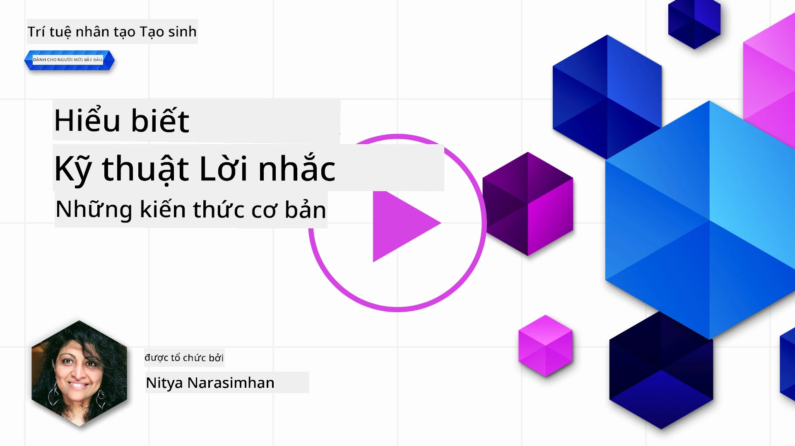
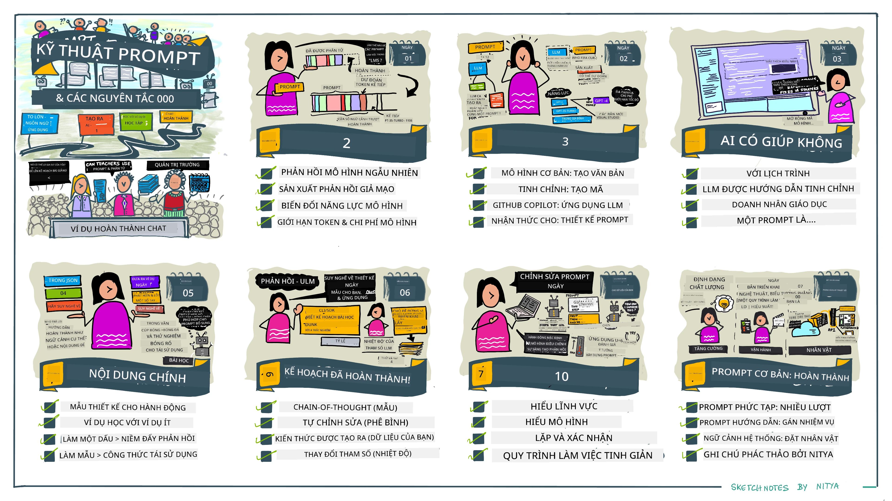
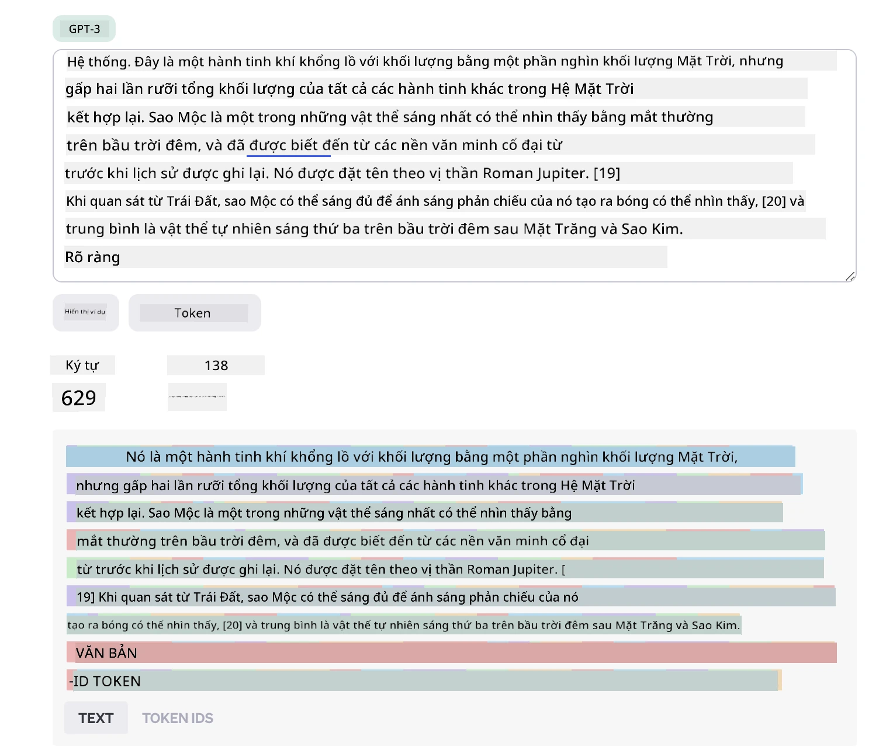
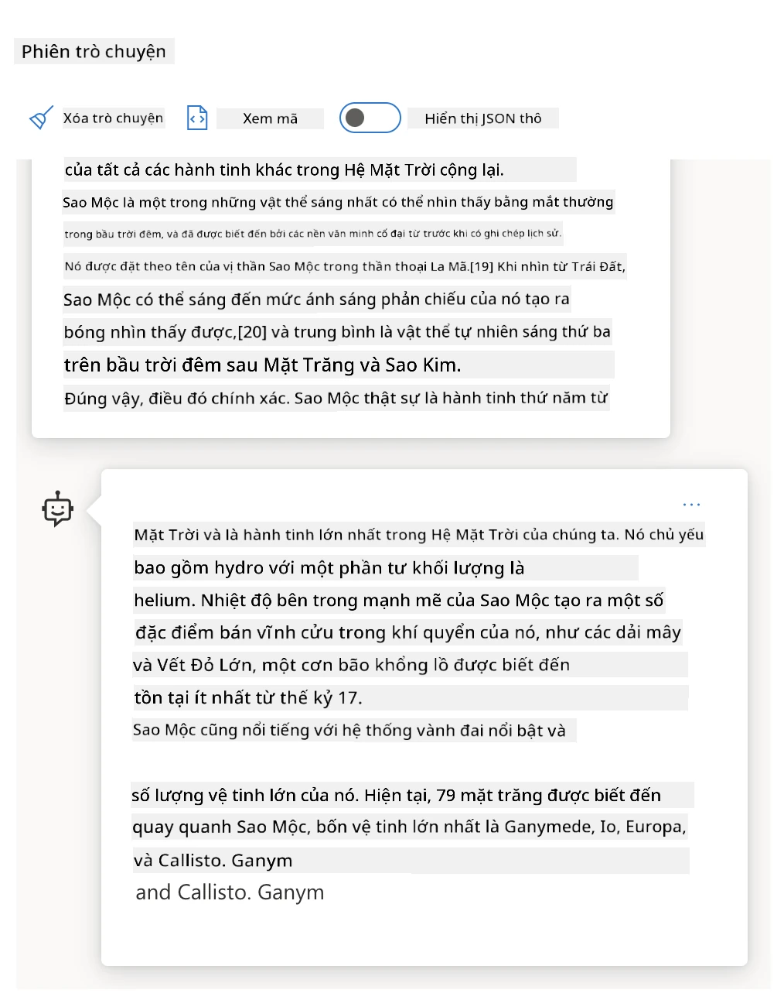
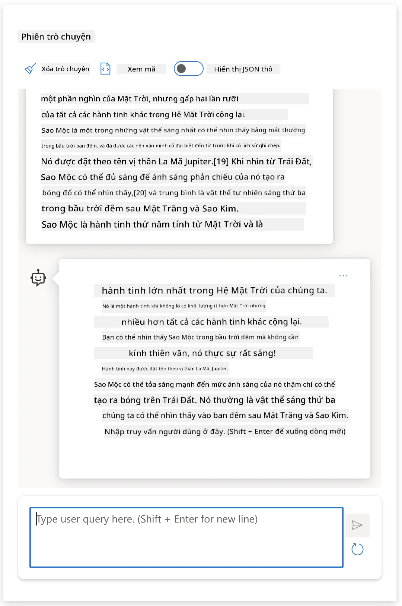
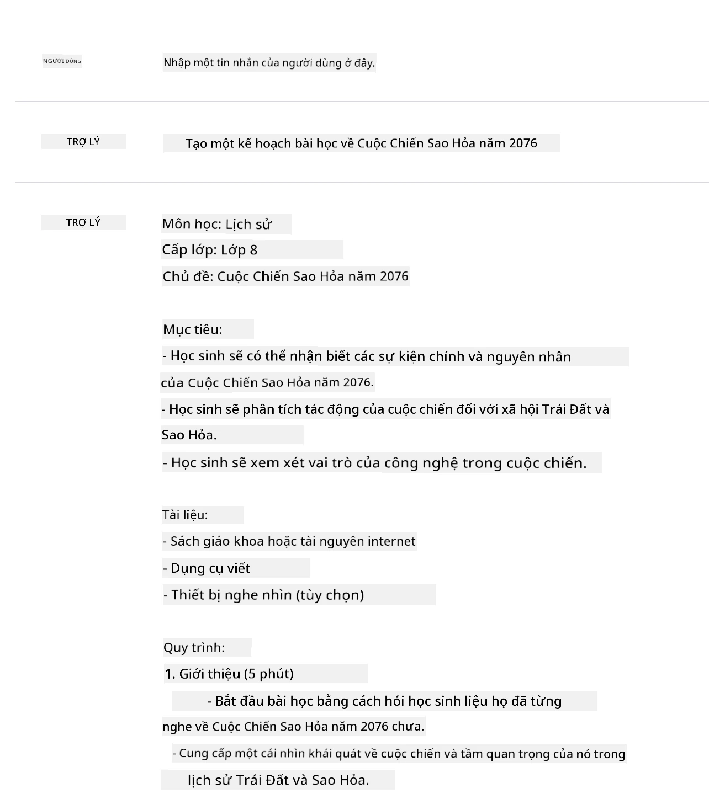
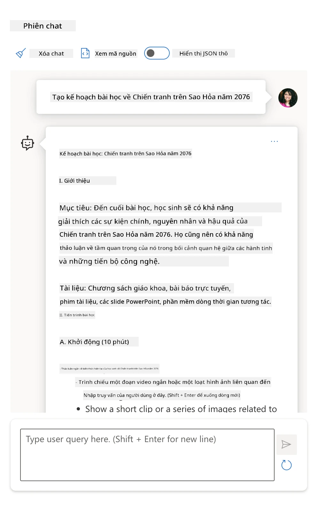
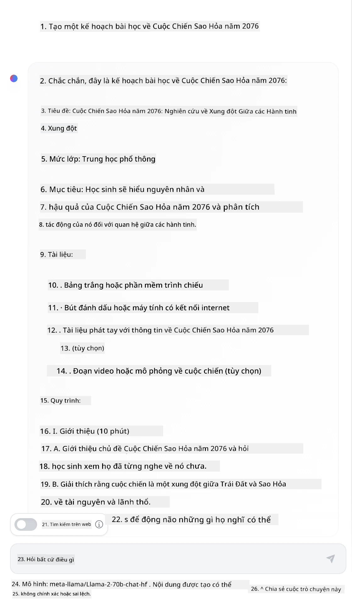

# Những Nguyên Lý Cơ Bản về Kỹ Thuật Prompt

[](https://youtu.be/GElCu2kUlRs?si=qrXsBvXnCW12epb8)

## Giới Thiệu  
Mô-đun này bao gồm các khái niệm và kỹ thuật thiết yếu để tạo ra các prompt hiệu quả trong các mô hình AI sinh tạo. Cách bạn viết prompt cho một LLM cũng quan trọng. Một prompt được thiết kế cẩn thận có thể đạt được chất lượng phản hồi tốt hơn. Nhưng chính xác thì các thuật ngữ như _prompt_ và _kỹ thuật prompt_ có nghĩa là gì? Và làm thế nào tôi có thể cải thiện đầu vào prompt mà tôi gửi tới LLM? Đây là những câu hỏi chúng ta sẽ cố gắng trả lời trong chương này và chương tiếp theo.

_AI sinh tạo_ có khả năng tạo ra nội dung mới (ví dụ, văn bản, hình ảnh, âm thanh, mã code, v.v.) đáp lại yêu cầu của người dùng. Nó đạt được điều này sử dụng _Các Mô Hình Ngôn Ngữ Lớn_ như sê-ri GPT của OpenAI ("Generative Pre-trained Transformer") được đào tạo để sử dụng ngôn ngữ tự nhiên và mã code.

Người dùng giờ đây có thể tương tác với các mô hình này sử dụng các phương thức quen thuộc như chat, mà không cần bất kỳ chuyên môn kỹ thuật hoặc đào tạo nào. Các mô hình là _dựa trên prompt_ — người dùng gửi đầu vào bằng văn bản (prompt) và nhận lại phản hồi AI (hoàn thành). Họ có thể tiếp tục "trò chuyện với AI" một cách lặp đi lặp lại, trong các cuộc hội thoại đa lượt, điều chỉnh prompt cho đến khi phản hồi đáp ứng được kỳ vọng.

"Prompt" giờ trở thành _giao diện lập trình_ chính cho các ứng dụng AI sinh tạo, chỉ dẫn các mô hình phải làm gì và ảnh hưởng đến chất lượng phản hồi trả về. "Kỹ thuật prompt" là một lĩnh vực nghiên cứu phát triển nhanh tập trung vào _thiết kế và tối ưu hóa_ prompt để cung cấp các phản hồi ổn định và chất lượng trên quy mô lớn.

## Mục Tiêu Học Tập

Trong bài học này, chúng ta sẽ tìm hiểu kỹ thuật prompt là gì, tại sao nó quan trọng, và làm thế nào để tạo ra các prompt hiệu quả hơn cho một mô hình nhất định và mục tiêu ứng dụng cụ thể. Chúng ta sẽ hiểu các khái niệm cốt lõi và các thực hành tốt nhất về kỹ thuật prompt — đồng thời tìm hiểu về môi trường "sandbox" tương tác trên Jupyter Notebook nơi chúng ta có thể nhìn thấy các khái niệm này được áp dụng vào các ví dụ thực tế.

Đến cuối bài học này, chúng ta sẽ có thể:

1. Giải thích kỹ thuật prompt là gì và tại sao nó quan trọng.  
2. Mô tả các thành phần của một prompt và cách chúng được sử dụng.  
3. Học các thực hành tốt nhất và kỹ thuật về kỹ thuật prompt.  
4. Áp dụng các kỹ thuật đã học vào các ví dụ thực tế, sử dụng endpoint OpenAI.

## Thuật Ngữ Chính

Kỹ Thuật Prompt: Thực hành thiết kế và tinh chỉnh đầu vào để hướng các mô hình AI sản xuất các đầu ra mong muốn.  
Phân Mảnh Từ (Tokenization): Quá trình chuyển đổi văn bản thành các đơn vị nhỏ hơn, gọi là token, mà mô hình có thể hiểu và xử lý.  
LLM Điều Chỉnh Theo Hướng Dẫn (Instruction-Tuned LLMs): Các Mô Hình Ngôn Ngữ Lớn (LLMs) được tinh chỉnh với các hướng dẫn cụ thể để cải thiện độ chính xác và sự phù hợp của phản hồi.

## Môi Trường Thực Hành

Kỹ thuật prompt hiện nay vẫn còn là nghệ thuật hơn là khoa học. Cách tốt nhất để cải thiện trực giác kỹ thuật này là _thực hành nhiều hơn_ và áp dụng cách tiếp cận thử-và-sai kết hợp kiến thức chuyên môn trong lĩnh vực ứng dụng với các kỹ thuật được khuyến nghị và tối ưu hóa riêng cho từng mô hình.

Jupyter Notebook đi kèm bài học này cung cấp một môi trường _sandbox_ nơi bạn có thể thử áp dụng những gì bạn học — vừa học vừa thực hành hoặc làm thử thách mã cuối bài. Để thực hiện các bài tập, bạn cần:

1. **Một khoá API Azure OpenAI** — điểm kết nối dịch vụ cho một LLM được triển khai.  
2. **Một môi trường thực thi Python** — nơi có thể chạy Notebook.  
3. **Các Biến Môi Trường Cục Bộ** — _hoàn thành các bước [CÀI ĐẶT](./../00-course-setup/02-setup-local.md?WT.mc_id=academic-105485-koreyst) ngay bây giờ để chuẩn bị_.

Notebook đi kèm các bài tập _khởi đầu_ — nhưng bạn được khuyến khích thêm các phần _Markdown_ (mô tả) và _Code_ (yêu cầu prompt) để thử nhiều ví dụ hoặc ý tưởng hơn — và xây dựng trực giác cho thiết kế prompt.

## Hướng Dẫn Minh Họa

Bạn muốn có cái nhìn tổng quan về những gì bài học này đề cập trước khi bắt đầu? Xem hướng dẫn minh họa này, giúp bạn nắm được các chủ đề chính và các điểm mấu chốt cần suy nghĩ trong từng phần. Lộ trình bài học dẫn bạn từ việc hiểu các khái niệm cốt lõi và thách thức đến cách giải quyết chúng bằng các kỹ thuật kỹ thuật prompt và thực hành tốt nhất phù hợp. Lưu ý rằng phần "Kỹ Thuật Nâng Cao" trong hướng dẫn này đề cập đến nội dung sẽ được trình bày trong chương _tiếp theo_ của giáo trình này.



## Khởi Nghiệp của Chúng Ta  

Bây giờ, hãy nói về cách _chủ đề này_ liên quan đến sứ mệnh khởi nghiệp của chúng ta nhằm [đưa đổi mới AI vào giáo dục](https://educationblog.microsoft.com/2023/06/collaborating-to-bring-ai-innovation-to-education?WT.mc_id=academic-105485-koreyst). Chúng ta muốn xây dựng các ứng dụng AI hỗ trợ _học tập cá nhân hóa_ — vì vậy hãy cùng nghĩ về cách những người dùng khác nhau của ứng dụng chúng ta có thể "thiết kế" các prompt:

- **Quản trị viên** có thể yêu cầu AI _phân tích dữ liệu chương trình học để xác định những khoảng trống trong phạm vi kiến thức_. AI có thể tổng hợp kết quả hoặc trực quan hóa chúng bằng mã code.  
- **Giáo viên** có thể yêu cầu AI _tạo kế hoạch bài học cho đối tượng và chủ đề mục tiêu_. AI có thể xây dựng kế hoạch cá nhân hóa theo định dạng được chỉ định.  
- **Học sinh** có thể nhờ AI _hướng dẫn học một môn học khó_. AI giờ có thể hướng dẫn học sinh với bài học, gợi ý & ví dụ phù hợp với trình độ của họ.

Đó chỉ là phần nổi của tảng băng. Hãy xem qua [Prompts For Education](https://github.com/microsoft/prompts-for-edu/tree/main?WT.mc_id=academic-105485-koreyst) — thư viện prompt mã nguồn mở được tuyển chọn bởi các chuyên gia giáo dục — để có cái nhìn rộng hơn về khả năng! _Thử chạy một số prompt đó trong sandbox hoặc dùng OpenAI Playground xem điều gì xảy ra!_

<!--
LESSON TEMPLATE:
This unit should cover core concept #1.
Reinforce the concept with examples and references.

CONCEPT #1:
Prompt Engineering.
Define it and explain why it is needed.
-->

## Kỹ Thuật Prompt Là Gì?

Chúng ta bắt đầu bài học này bằng cách định nghĩa **Kỹ Thuật Prompt** là quá trình _thiết kế và tối ưu hóa_ đầu vào văn bản (prompt) để cung cấp các phản hồi (hoàn thành) nhất quán và chất lượng cho một mục tiêu ứng dụng và mô hình nhất định. Chúng ta có thể xem đây là một quy trình gồm 2 bước:

- _thiết kế_ prompt ban đầu cho mô hình và mục tiêu nhất định  
- _tinh chỉnh_ prompt theo từng bước lặp để cải thiện chất lượng phản hồi

Quá trình này đòi hỏi thử-và-sai và cần trực giác cùng nỗ lực của người dùng để đạt được kết quả tối ưu. Vậy tại sao nó quan trọng? Để trả lời câu hỏi đó, trước tiên chúng ta cần hiểu ba khái niệm:

- _Phân mảnh từ (Tokenization)_ = cách mô hình "nhìn thấy" prompt  
- _LLM cơ bản_ = cách mô hình nền tảng "xử lý" prompt  
- _LLM điều chỉnh theo hướng dẫn_ = cách mô hình có thể "thấy" các tác vụ

### Phân Mảnh Từ (Tokenization)

Một LLM xem prompt dưới dạng _chuỗi token_ trong đó các mô hình khác nhau (hoặc phiên bản của mô hình) có thể phân đoạn cùng một prompt theo những cách khác nhau. Vì LLM được đào tạo trên token (chứ không phải văn bản thô), cách mà prompt được phân mảnh ảnh hưởng trực tiếp đến chất lượng của phản hồi được tạo ra.

Để có trực giác về cách hoạt động của phân mảnh từ, hãy thử các công cụ như [OpenAI Tokenizer](https://platform.openai.com/tokenizer?WT.mc_id=academic-105485-koreyst) được minh họa bên dưới. Sao chép prompt của bạn vào, và xem nó được chuyển đổi thành token như thế nào, chú ý cách các ký tự khoảng trắng và dấu câu được xử lý ra sao. Lưu ý ví dụ này dùng một LLM cũ hơn (GPT-3) — nên thử với mô hình mới hơn có thể cho kết quả khác.



### Khái Niệm: Mô Hình Nền Tảng

Một khi prompt được phân mảnh thành token, chức năng chính của ["LLM cơ bản"](https://blog.gopenai.com/an-introduction-to-base-and-instruction-tuned-large-language-models-8de102c785a6?WT.mc_id=academic-105485-koreyst) (hay mô hình nền tảng) là dự đoán token tiếp theo trong chuỗi đó. Vì LLM được đào tạo trên tập dữ liệu văn bản khổng lồ, chúng có khả năng hiểu các quan hệ thống kê giữa các token và có thể dự đoán token tiếp theo với độ tin cậy nhất định. Lưu ý rằng chúng không hiểu _ý nghĩa_ của từ trong prompt hay token; chúng chỉ nhận ra một mẫu mà có thể "hoàn thành" bằng dự đoán tiếp theo của mình. Chúng có thể tiếp tục dự đoán chuỗi token cho tới khi người dùng can thiệp hoặc thỏa mãn điều kiện đã định trước.

Muốn xem cách hoàn thành dựa trên prompt hoạt động? Hãy nhập prompt trên vào Azure OpenAI Studio [_Chat Playground_](https://oai.azure.com/playground?WT.mc_id=academic-105485-koreyst) với các thiết lập mặc định. Hệ thống được cấu hình để coi prompt như các yêu cầu thông tin — nên bạn sẽ thấy một phản hồi thỏa mãn ngữ cảnh này.

Nhưng nếu người dùng muốn thấy điều gì đó cụ thể đáp ứng một tiêu chí hoặc mục tiêu nhiệm vụ? Đây là lúc _LLM điều chỉnh theo hướng dẫn_ xuất hiện.



### Khái Niệm: LLM Điều Chỉnh Theo Hướng Dẫn

Một [LLM Điều Chỉnh Theo Hướng Dẫn](https://blog.gopenai.com/an-introduction-to-base-and-instruction-tuned-large-language-models-8de102c785a6?WT.mc_id=academic-105485-koreyst) bắt đầu từ mô hình nền tảng và tinh chỉnh thêm với các ví dụ hoặc cặp đầu vào/đầu ra (ví dụ, các "tin nhắn" đa lượt) có thể chứa các hướng dẫn rõ ràng — và phản hồi từ AI cố gắng tuân theo hướng dẫn đó.

Điều này dùng các kỹ thuật như Học Tăng Cường với Phản Hồi Con Người (RLHF) để huấn luyện mô hình _tuân theo hướng dẫn_ và _học từ phản hồi_ nhằm tạo ra phản hồi phù hợp hơn với ứng dụng thực tiễn và sát với mục tiêu người dùng.

Hãy thử ngay — quay lại prompt trên, nhưng bây giờ thay đổi _tin nhắn hệ thống_ để cung cấp hướng dẫn sau làm ngữ cảnh:

> _Tóm tắt nội dung bạn được cung cấp cho học sinh lớp hai. Giữ kết quả trong một đoạn văn với 3-5 điểm gạch đầu dòng._

Xem cách kết quả giờ được điều chỉnh để phản ánh mục tiêu và định dạng mong muốn? Một giáo viên giờ có thể trực tiếp sử dụng phản hồi này trong slide bài giảng của mình.



## Tại Sao Chúng Ta Cần Kỹ Thuật Prompt?

Giờ khi biết cách LLM xử lý prompt, hãy nói về _tại sao_ chúng ta cần kỹ thuật prompt. Câu trả lời nằm ở thực tế rằng các LLM hiện tại gặp phải nhiều thách thức khiến cho việc đạt được _phản hồi đáng tin cậy và nhất quán_ trở nên khó khăn nếu không bỏ công sức vào xây dựng và tối ưu prompt. Ví dụ:

1. **Phản hồi mô hình có tính ngẫu nhiên.** _Cùng một prompt_ có thể tạo ra các phản hồi khác nhau với các mô hình hoặc phiên bản khác nhau. Thậm chí có thể cho kết quả khác nhau khi sử dụng _cùng một mô hình_ vào các thời điểm khác nhau. _Kỹ thuật prompt có thể giúp giảm thiểu các biến thể này bằng cách cung cấp các giới hạn kiểm soát tốt hơn_.

1. **Mô hình có thể tạo ra phản hồi sai lệch.** Mô hình được tiền huấn luyện với các tập dữ liệu _lớn nhưng có giới hạn_, nghĩa là chúng thiếu kiến thức về các khái niệm ngoài phạm vi đào tạo. Do đó, chúng có thể tạo ra các phản hồi không chính xác, tưởng tượng hoặc mâu thuẫn trực tiếp với sự thật đã biết. _Kỹ thuật prompt giúp người dùng xác định và giảm thiểu các sai lệch đó, ví dụ bằng cách yêu cầu AI trích dẫn hoặc lý giải_.

1. **Năng lực mô hình sẽ khác nhau.** Các mô hình mới hơn hoặc các thế hệ mô hình sẽ có nhiều năng lực phong phú hơn nhưng cũng đem đến những điểm khác biệt độc đáo và đánh đổi về chi phí & độ phức tạp. _Kỹ thuật prompt giúp phát triển các thực hành và quy trình công việc trừu tượng hóa sự khác biệt này và thích ứng với yêu cầu riêng của từng mô hình một cách mở rộng và liền mạch_.

Hãy thử chứng kiến điều này trong OpenAI hoặc Azure OpenAI Playground:

- Dùng cùng một prompt trên các triển khai LLM khác nhau (ví dụ, OpenAI, Azure OpenAI, Hugging Face) — bạn có thấy sự khác biệt?  
- Dùng cùng một prompt lặp đi lặp lại với cùng một triển khai LLM (ví dụ, Azure OpenAI playground) — các phản hồi có khác nhau thế nào?

### Ví Dụ Về Sai Lệch (Fabrications)

Trong khoá học này, chúng tôi dùng thuật ngữ **"sai lệch"** để chỉ hiện tượng mà các LLM đôi khi tạo ra thông tin sai lệch về mặt thực tế do giới hạn trong quá trình đào tạo hoặc các ràng buộc khác. Bạn cũng có thể đã nghe thuật ngữ này gọi là _"ảo giác"_ trong các bài viết hay công trình nghiên cứu phổ biến. Tuy nhiên, chúng tôi khuyến nghị dùng _"sai lệch"_ để tránh việc nhân cách hóa hành vi này bằng cách gán đặc tính giống con người cho một kết quả do máy tạo ra. Điều này cũng củng cố [các hướng dẫn AI có trách nhiệm](https://www.microsoft.com/ai/responsible-ai?WT.mc_id=academic-105485-koreyst) về mặt thuật ngữ, loại bỏ các thuật ngữ có thể bị coi là xúc phạm hoặc không bao gồm trong một số ngữ cảnh.

Muốn cảm nhận cách sai lệch hoạt động? Hãy nghĩ đến một prompt yêu cầu AI tạo nội dung cho một chủ đề không tồn tại (để chắc chắn nó không có trong tập huấn luyện). Ví dụ — tôi đã thử prompt:

> **Prompt:** tạo một kế hoạch bài học về Cuộc Chiến trên Sao Hỏa năm 2076.
Một tìm kiếm trên web đã cho tôi biết rằng có những câu chuyện hư cấu (ví dụ, loạt phim truyền hình hoặc sách) về các cuộc chiến tranh trên Sao Hỏa - nhưng không có cuộc chiến nào xảy ra vào năm 2076. Lý trí cũng cho rằng năm 2076 là _trong tương lai_ và vì vậy, không thể liên quan đến một sự kiện có thật.

Vậy điều gì xảy ra khi chúng ta chạy đoạn gợi ý này với các nhà cung cấp LLM khác nhau?

> **Phản hồi 1**: OpenAI Playground (GPT-35)



> **Phản hồi 2**: Azure OpenAI Playground (GPT-35)



> **Phản hồi 3**: : Hugging Face Chat Playground (LLama-2)



Như mong đợi, mỗi mô hình (hoặc phiên bản mô hình) tạo ra các phản hồi hơi khác nhau nhờ vào hành vi ngẫu nhiên và sự khác biệt về khả năng mô hình. Ví dụ, một mô hình hướng đến đối tượng học sinh lớp 8 trong khi mô hình khác giả định người dùng là học sinh cấp trung học phổ thông. Nhưng cả ba mô hình đều tạo ra các phản hồi có thể thuyết phục một người dùng không có thông tin rằng sự kiện đó là có thật.

Các kỹ thuật thiết kế lời nhắc như _metaprompting_ và _cấu hình nhiệt độ_ có thể giảm bớt việc mô hình tạo ra thông tin sai lệch ở một mức độ nhất định. Các _kiến trúc_ kỹ thuật thiết kế lời nhắc mới cũng kết hợp các công cụ và kỹ thuật mới một cách liền mạch vào luồng lời nhắc, nhằm giảm hoặc hạn chế một số tác động này.

## Nghiên cứu tình huống: GitHub Copilot

Hãy kết thúc phần này bằng cách tìm hiểu cách kỹ thuật thiết kế lời nhắc được sử dụng trong các giải pháp thực tế thông qua một Nghiên cứu Tình huống: [GitHub Copilot](https://github.com/features/copilot?WT.mc_id=academic-105485-koreyst).

GitHub Copilot là "Trợ Lý Lập Trình AI song hành" của bạn - nó chuyển đổi các gợi ý văn bản thành các đoạn hoàn thiện mã và được tích hợp trong môi trường phát triển của bạn (ví dụ, Visual Studio Code) để mang lại trải nghiệm người dùng liền mạch. Như được ghi lại trong chuỗi các bài blog dưới đây, phiên bản đầu tiên dựa trên mô hình OpenAI Codex - với các kỹ sư nhanh chóng nhận ra sự cần thiết phải tinh chỉnh mô hình và phát triển các kỹ thuật thiết kế lời nhắc tốt hơn, nhằm nâng cao chất lượng mã. Vào tháng Bảy, họ đã [trình làng một mô hình AI cải tiến vượt ra ngoài Codex](https://github.blog/2023-07-28-smarter-more-efficient-coding-github-copilot-goes-beyond-codex-with-improved-ai-model/?WT.mc_id=academic-105485-koreyst) để đề xuất nhanh hơn nữa.

Hãy đọc theo thứ tự các bài viết để theo dõi hành trình học hỏi của họ.

- **Tháng 5 năm 2023** | [GitHub Copilot ngày càng hiểu rõ mã của bạn hơn](https://github.blog/2023-05-17-how-github-copilot-is-getting-better-at-understanding-your-code/?WT.mc_id=academic-105485-koreyst)
- **Tháng 5 năm 2023** | [Bên trong GitHub: Làm việc với các mô hình ngôn ngữ lớn phía sau GitHub Copilot](https://github.blog/2023-05-17-inside-github-working-with-the-llms-behind-github-copilot/?WT.mc_id=academic-105485-koreyst)
- **Tháng 6 năm 2023** | [Cách viết các lời nhắc tốt hơn cho GitHub Copilot](https://github.blog/2023-06-20-how-to-write-better-prompts-for-github-copilot/?WT.mc_id=academic-105485-koreyst)
- **Tháng 7 năm 2023** | [.. GitHub Copilot vượt ra ngoài Codex với mô hình AI được cải thiện](https://github.blog/2023-07-28-smarter-more-efficient-coding-github-copilot-goes-beyond-codex-with-improved-ai-model/?WT.mc_id=academic-105485-koreyst)
- **Tháng 7 năm 2023** | [Hướng dẫn dành cho nhà phát triển về Kỹ thuật Thiết kế Lời nhắc và các mô hình ngôn ngữ lớn](https://github.blog/2023-07-17-prompt-engineering-guide-generative-ai-llms/?WT.mc_id=academic-105485-koreyst)
- **Tháng 9 năm 2023** | [Cách xây dựng một ứng dụng LLM doanh nghiệp: Bài học từ GitHub Copilot](https://github.blog/2023-09-06-how-to-build-an-enterprise-llm-application-lessons-from-github-copilot/?WT.mc_id=academic-105485-koreyst)

Bạn cũng có thể duyệt qua [blog Kỹ thuật](https://github.blog/category/engineering/?WT.mc_id=academic-105485-koreyst) của họ để xem thêm các bài viết như [bài này](https://github.blog/2023-09-27-how-i-used-github-copilot-chat-to-build-a-reactjs-gallery-prototype/?WT.mc_id=academic-105485-koreyst) cho thấy cách các mô hình và kỹ thuật này được _ứng dụng_ để phát triển các ứng dụng thực tế.

---

<!--
LESSON TEMPLATE:
This unit should cover core concept #2.
Reinforce the concept with examples and references.

CONCEPT #2:
Prompt Design.
Illustrated with examples.
-->

## Xây dựng lời nhắc

Chúng ta đã thấy tại sao kỹ thuật thiết kế lời nhắc lại quan trọng - bây giờ hãy tìm hiểu cách các lời nhắc được _xây dựng_ để có thể đánh giá các kỹ thuật khác nhau nhằm thiết kế lời nhắc hiệu quả hơn.

### Lời nhắc cơ bản

Hãy bắt đầu với lời nhắc cơ bản: một đầu vào văn bản được gửi đến mô hình mà không có ngữ cảnh nào khác. Đây là một ví dụ - khi ta gửi những từ đầu tiên của quốc ca Hoa Kỳ đến OpenAI [Completion API](https://platform.openai.com/docs/api-reference/completions?WT.mc_id=academic-105485-koreyst) nó ngay lập tức _hoàn thiện_ câu trả lời với vài câu tiếp theo, minh họa cho hành vi dự đoán cơ bản.

| Lời nhắc (Đầu vào)       | Hoàn thiện (Đầu ra)                                                                                                                            |
| :----------------------- | :--------------------------------------------------------------------------------------------------------------------------------------------- |
| Oh say can you see       | Có vẻ như bạn đang bắt đầu lời bài hát "The Star-Spangled Banner," quốc ca của Hoa Kỳ. Lời bài hát đầy đủ là ...                                |

### Lời nhắc phức tạp

Bây giờ hãy thêm ngữ cảnh và hướng dẫn vào lời nhắc cơ bản đó. [Chat Completion API](https://learn.microsoft.com/azure/ai-services/openai/how-to/chatgpt?WT.mc_id=academic-105485-koreyst) cho phép chúng ta xây dựng một lời nhắc phức tạp dưới dạng tập hợp các _tin nhắn_ với:

- Cặp đầu vào/đầu ra phản ánh đầu vào của _người dùng_ và phản hồi của _trợ lý_.
- Tin nhắn hệ thống đặt bối cảnh cho hành vi hoặc cá tính của trợ lý.

Yêu cầu giờ có dạng dưới đây, nơi _quá trình tách từ (tokenization)_ giúp nắm bắt hiệu quả các thông tin liên quan từ ngữ cảnh và cuộc hội thoại. Việc thay đổi ngữ cảnh hệ thống có thể ảnh hưởng đến chất lượng các kết quả hoàn thiện tương đương với các đầu vào của người dùng được cung cấp.

```python
response = openai.chat.completions.create(
    model="gpt-3.5-turbo",
    messages=[
        {"role": "system", "content": "You are a helpful assistant."},
        {"role": "user", "content": "Who won the world series in 2020?"},
        {"role": "assistant", "content": "The Los Angeles Dodgers won the World Series in 2020."},
        {"role": "user", "content": "Where was it played?"}
    ]
)
```

### Lời nhắc hướng dẫn

Trong các ví dụ trên, lời nhắc người dùng là một truy vấn văn bản đơn giản có thể được hiểu như một yêu cầu thông tin. Với lời nhắc _hướng dẫn_, ta có thể dùng văn bản đó để chỉ định một nhiệm vụ chi tiết hơn, cung cấp hướng dẫn tốt hơn cho AI. Đây là một ví dụ:

| Lời nhắc (Đầu vào)                                                                                                                                                                                        | Hoàn thiện (Đầu ra)                                                                                         | Loại chỉ dẫn      |
| :--------------------------------------------------------------------------------------------------------------------------------------------------------------------------------------------------------- | :---------------------------------------------------------------------------------------------------------- | :---------------- |
| Viết một đoạn mô tả về Nội Chiến                                                                                                                                                                          | _trả về một đoạn văn đơn giản_                                                                               | Đơn giản          |
| Viết một đoạn mô tả về Nội Chiến. Cung cấp các ngày tháng và sự kiện chính và mô tả tầm quan trọng của chúng                                                                                              | _trả về một đoạn văn kèm theo danh sách các ngày sự kiện chính cùng mô tả_                                  | Phức tạp          |
| Viết một đoạn mô tả về Nội Chiến trong 1 đoạn văn. Cung cấp 3 mục gạch đầu dòng với các ngày tháng quan trọng và ý nghĩa của chúng. Cung cấp thêm 3 mục gạch đầu dòng nữa với các nhân vật lịch sử và đóng góp của họ. Trả về kết quả dưới dạng tệp JSON | _trả về chi tiết mở rộng hơn trong một ô văn bản, định dạng JSON để bạn có thể sao chép-dán vào tệp và kiểm tra khi cần_ | Phức tạp. Định dạng.|

## Nội dung chính

Trong các ví dụ trên, lời nhắc vẫn còn khá mở, cho phép LLM tự quyết định phần nào trong tập dữ liệu huấn luyện là thích hợp. Với mẫu thiết kế _nội dung chính_, văn bản đầu vào được chia thành hai phần:

- một chỉ dẫn (hành động)
- nội dung liên quan (ảnh hưởng đến hành động)

Đây là ví dụ trong đó chỉ dẫn là "tóm tắt đoạn này trong 2 câu".

| Lời nhắc (Đầu vào)                                                                                                                                                                                                                                                                                                                                                                                                                                                                                                                                                                                                                                                                                        | Hoàn thiện (Đầu ra)                                                                                                                                                                                                                                                                            |
| :------------------------------------------------------------------------------------------------------------------------------------------------------------------------------------------------------------------------------------------------------------------------------------------------------------------------------------------------------------------------------------------------------------------------------------------------------------------------------------------------------------------------------------------------------------------------------------------------------------------------------------------------------------------------------------------------------ | :--------------------------------------------------------------------------------------------------------------------------------------------------------------------------------------------------------------------------------------------------------------------------------------------- |
| Sao Mộc là hành tinh thứ năm tính từ Mặt Trời và là hành tinh lớn nhất trong Hệ Mặt Trời. Nó là một hành tinh khí khổng lồ có khối lượng bằng một phần một nghìn so với Mặt Trời, nhưng lại lớn hơn hai lần rưỡi so với tổng khối lượng của tất cả các hành tinh khác trong Hệ Mặt Trời cộng lại. Sao Mộc là một trong những vật thể sáng nhất có thể nhìn thấy bằng mắt thường trên bầu trời đêm, và đã được các nền văn minh cổ đại biết đến từ trước khi có ghi chép lịch sử. Nó được đặt theo tên vị thần Sao Mộc trong thần thoại La Mã.[19] Khi nhìn từ Trái Đất, Sao Mộc có thể đủ sáng để ánh sáng phản chiếu có thể tạo bóng đổ có thể thấy được,[20] và trung bình là vật thể tự nhiên sáng thứ ba trên bầu trời đêm sau Mặt Trăng và Sao Kim. <br/> **Tóm tắt đoạn này trong 2 câu ngắn** | Sao Mộc, hành tinh thứ năm tính từ Mặt Trời, là hành tinh lớn nhất trong Hệ Mặt Trời và là một trong những vật thể sáng nhất trên bầu trời đêm. Được đặt theo tên vị thần La Mã Sao Mộc, đó là một hành tinh khí khổng lồ có khối lượng gấp hai lần rưỡi tổng khối lượng của tất cả các hành tinh khác trong Hệ Mặt Trời cộng lại. |

Đoạn nội dung chính có thể được dùng theo nhiều cách để thúc đẩy chỉ dẫn hiệu quả hơn:

- **Ví dụ** - thay vì chỉ bảo mô hình phải làm gì với chỉ dẫn rõ ràng, hãy cung cấp ví dụ về những gì cần làm và để nó suy luận mẫu đó.
- **Dấu hiệu** - kèm theo chỉ dẫn một "dấu hiệu" giúp mô hình khởi đầu hoàn thiện, hướng nó đến câu trả lời phù hợp hơn.
- **Mẫu** - đây là các 'công thức' có thể lặp lại cho lời nhắc, có chứa chỗ giữ chỗ (biến số) có thể tùy chỉnh bằng dữ liệu cho các trường hợp sử dụng cụ thể.

Hãy cùng khám phá các cách này trong thực tế.

### Sử dụng ví dụ

Đây là phương pháp dùng nội dung chính để "cung cấp cho mô hình" một số ví dụ về đầu ra mong muốn cho một chỉ dẫn nhất định, và để mô hình suy luận ra mẫu đầu ra phù hợp. Tùy theo số lượng ví dụ được cung cấp, ta có thể có cách gợi ý không ví dụ (zero-shot), gợi ý một ví dụ (one-shot), một vài ví dụ (few-shot), v.v.

Lời nhắc giờ có ba thành phần:

- Mô tả nhiệm vụ
- Một vài ví dụ về kết quả mong muốn
- Bắt đầu một ví dụ mới (trở thành mô tả nhiệm vụ ngầm hiểu)

| Loại học     | Lời nhắc (Đầu vào)                                                                                                                   | Hoàn thiện (Đầu ra)       |
| :----------- | :----------------------------------------------------------------------------------------------------------------------------------- | :------------------------ |
| Zero-shot    | "The Sun is Shining". Dịch sang tiếng Tây Ban Nha                                                                                   | "El Sol está brillando".  |
| One-shot     | "The Sun is Shining" => ""El Sol está brillando". <br> "It's a Cold and Windy Day" =>                                                | "Es un día frío y ventoso". |
| Few-shot     | Người chơi chạy vòng cơ sở => Bóng chày <br/> Người chơi ghi điểm ace => Quần vợt <br/> Người chơi ghi điểm sáu => Cricket <br/> Người chơi thực hiện cú slam-dunk => | Bóng rổ                    |
|              |                                                                                                                                     |                           |

Lưu ý cách ta phải cung cấp chỉ dẫn rõ ràng ("Dịch sang tiếng Tây Ban Nha") trong gợi ý zero-shot, nhưng nó được suy luận trong ví dụ one-shot. Ví dụ few-shot cho thấy cách thêm nhiều ví dụ giúp mô hình suy luận chính xác hơn mà không cần hướng dẫn bổ sung.

### Dấu hiệu trong lời nhắc

Một kỹ thuật khác dùng nội dung chính là cung cấp _dấu hiệu_ thay vì ví dụ. Ở trường hợp này, ta thúc đẩy mô hình theo hướng đúng bằng cách _bắt đầu_ với một đoạn phản ánh định dạng phản hồi mong muốn. Mô hình sẽ "lấy dấu hiệu" và tiếp tục theo kiểu đó.

| Số lượng Dấu hiệu | Lời nhắc (Đầu vào)                                                                                                                                                                                                                                                                                                                                                                                                                                  | Hoàn thiện (Đầu ra)                                                                                                                                                                                                                                                                               |
| :---------------- | :--------------------------------------------------------------------------------------------------------------------------------------------------------------------------------------------------------------------------------------------------------------------------------------------------------------------------------------------------------------------------------------------------------------------------------------------------- | :------------------------------------------------------------------------------------------------------------------------------------------------------------------------------------------------------------------------------------------------------------------------------------------------ |
| 0                 | Sao Mộc là hành tinh thứ năm tính từ Mặt Trời và là hành tinh lớn nhất trong Hệ Mặt Trời. Nó là một hành tinh khí khổng lồ có khối lượng bằng một phần một nghìn so với Mặt Trời, nhưng lại lớn hơn hai lần rưỡi so với tổng khối lượng của tất cả các hành tinh khác trong Hệ Mặt Trời cộng lại. Sao Mộc là một trong những vật thể sáng nhất có thể nhìn thấy bằng mắt thường trên bầu trời đêm, và đã được các nền văn minh cổ đại biết đến từ trước khi có ghi chép lịch sử. <br/>**Tóm tắt đoạn này** | Sao Mộc là hành tinh lớn nhất trong Hệ Mặt Trời và là hành tinh thứ năm tính từ Mặt Trời. Nó là một hành tinh khí có khối lượng bằng 1/1000 khối lượng Mặt Trời, nhưng nặng hơn tất cả các hành tinh khác cộng lại. Các nền văn minh cổ đại đã biết đến Sao Mộc từ lâu, và nó dễ dàng nhìn thấy trên bầu trời đêm. |
| 1              | Sao Mộc là hành tinh thứ năm tính từ Mặt Trời và là hành tinh lớn nhất trong Hệ Mặt Trời. Nó là một hành tinh khí khổng lồ với khối lượng bằng một phần nghìn khối lượng của Mặt Trời, nhưng gấp hai lần rưỡi tổng khối lượng của tất cả các hành tinh khác trong Hệ Mặt Trời cộng lại. Sao Mộc là một trong những thiên thể sáng nhất có thể nhìn thấy bằng mắt thường trên bầu trời đêm, và đã được biết đến bởi các nền văn minh cổ đại từ trước khi lịch sử có ghi chép. <br/>**Tóm tắt nội dung này** <br/> Điều chúng ta đã học được là Sao Mộc | là hành tinh thứ năm tính từ Mặt Trời và là hành tinh lớn nhất trong Hệ Mặt Trời. Nó là một hành tinh khí khổng lồ với khối lượng bằng một phần nghìn khối lượng của Mặt Trời, nhưng gấp hai lần rưỡi tổng khối lượng của tất cả các hành tinh khác cộng lại. Nó dễ dàng nhìn thấy bằng mắt thường và đã được biết đến từ thời cổ đại.                        |
| 2              | Sao Mộc là hành tinh thứ năm tính từ Mặt Trời và là hành tinh lớn nhất trong Hệ Mặt Trời. Nó là một hành tinh khí khổng lồ với khối lượng bằng một phần nghìn khối lượng của Mặt Trời, nhưng gấp hai lần rưỡi tổng khối lượng của tất cả các hành tinh khác trong Hệ Mặt Trời cộng lại. Sao Mộc là một trong những thiên thể sáng nhất có thể nhìn thấy bằng mắt thường trên bầu trời đêm, và đã được biết đến bởi các nền văn minh cổ đại từ trước khi lịch sử có ghi chép. <br/>**Tóm tắt nội dung này** <br/> 3 Sự Thật Hàng Đầu Chúng Ta Đã Học:         | 1. Sao Mộc là hành tinh thứ năm tính từ Mặt Trời và là hành tinh lớn nhất trong Hệ Mặt Trời. <br/> 2. Nó là một hành tinh khí khổng lồ với khối lượng bằng một phần nghìn khối lượng của Mặt Trời...<br/> 3. Sao Mộc đã được nhìn thấy bằng mắt thường từ thời cổ đại ...                                                                       |
|                |                                                                                                                                                                                                                                                                                                                                                                                                                                                              |                                                                                                                                                                                                                                                                                                           |

### Mẫu Lời Nhắc

Một mẫu lời nhắc là một _công thức được định nghĩa sẵn cho một lời nhắc_ có thể được lưu trữ và tái sử dụng khi cần, nhằm tạo ra trải nghiệm người dùng nhất quán ở quy mô lớn. Ở dạng đơn giản nhất, nó chỉ là tập hợp các ví dụ lời nhắc như [ví dụ này từ OpenAI](https://cookbook.openai.com/examples/gpt4-1_prompting_guide?WT.mc_id=academic-105485-koreyst) cung cấp cả các thành phần lời nhắc tương tác (tin nhắn người dùng và hệ thống) và định dạng yêu cầu API - để hỗ trợ tái sử dụng.

Ở dạng phức tạp hơn như [ví dụ này từ LangChain](https://python.langchain.com/docs/concepts/prompt_templates/?WT.mc_id=academic-105485-koreyst), nó chứa các _chỗ giữ chỗ_ có thể được thay thế bằng dữ liệu từ nhiều nguồn khác nhau (đầu vào người dùng, ngữ cảnh hệ thống, nguồn dữ liệu ngoài, v.v.) để tạo lời nhắc một cách động. Điều này cho phép chúng ta tạo thư viện lời nhắc có thể tái sử dụng nhằm tạo trải nghiệm người dùng nhất quán **một cách lập trình** ở quy mô lớn.

Cuối cùng, giá trị thực sự của các mẫu nằm ở khả năng tạo và xuất bản _thư viện lời nhắc_ cho các lĩnh vực ứng dụng theo chiều dọc - nơi mẫu lời nhắc được _tối ưu hóa_ để phản ánh bối cảnh hoặc ví dụ cụ thể của ứng dụng, giúp câu trả lời phù hợp và chính xác hơn với nhóm người dùng mục tiêu. Kho [Prompts For Edu](https://github.com/microsoft/prompts-for-edu?WT.mc_id=academic-105485-koreyst) là một ví dụ tuyệt vời về cách tiếp cận này, tổng hợp thư viện lời nhắc cho lĩnh vực giáo dục với trọng tâm vào các mục tiêu chính như lập kế hoạch bài học, thiết kế chương trình học, hướng dẫn học sinh, v.v.

## Nội dung hỗ trợ

Nếu chúng ta coi việc xây dựng lời nhắc như có một chỉ dẫn (nhiệm vụ) và một mục tiêu (nội dung chính), thì _nội dung phụ_ giống như ngữ cảnh bổ sung mà chúng ta cung cấp để **ảnh hưởng đến kết quả đầu ra theo một cách nào đó**. Nó có thể là tham số điều chỉnh, hướng dẫn định dạng, hệ thống phân loại chủ đề, v.v. giúp mô hình _điều chỉnh_ phản hồi phù hợp với mục tiêu hoặc kỳ vọng của người dùng.

Ví dụ: Cho một danh mục khóa học với dữ liệu siêu mẫu chi tiết (tên, mô tả, cấp độ, thẻ siêu dữ liệu, giảng viên, v.v.) cho tất cả các khóa có sẵn trong chương trình học:

- chúng ta có thể xác định một chỉ dẫn là "tóm tắt danh mục khóa học cho mùa Thu 2023"
- chúng ta có thể dùng nội dung chính để cung cấp vài ví dụ về đầu ra mong muốn
- chúng ta có thể sử dụng nội dung phụ để xác định 5 "thẻ" hàng đầu quan tâm.

Bây giờ, mô hình có thể cung cấp bản tóm tắt theo định dạng đã được các ví dụ minh họa - nhưng nếu một kết quả có nhiều thẻ, nó có thể ưu tiên 5 thẻ được xác định trong nội dung phụ.

---

<!--
MẪU BÀI HỌC:
Đơn vị này nên bao gồm khái niệm cốt lõi #1.
Củng cố khái niệm với các ví dụ và tài liệu tham khảo.

KHÁI NIỆM #3:
Kỹ thuật Kỹ thuật Lời Nhắc.
Một số kỹ thuật cơ bản cho kỹ thuật lời nhắc là gì?
Minh họa với vài bài tập.
-->

## Thực hành tốt nhất khi tạo lời nhắc

Bây giờ chúng ta đã biết cách _xây dựng_ lời nhắc, hãy bắt đầu nghĩ về cách _thiết kế_ chúng sao cho phản ánh các thực hành tốt nhất. Chúng ta có thể xem xét điều này thành hai phần - có tư duy đúng đắn và áp dụng các kỹ thuật đúng.

### Tư duy Kỹ thuật Lời Nhắc

Kỹ thuật Lời Nhắc là một quá trình thử và sai nên hãy nhớ ba yếu tố định hướng rộng:

1. **Hiểu biết về lĩnh vực rất quan trọng.** Độ chính xác và sự phù hợp của phản hồi phụ thuộc vào _lĩnh vực_ trong đó ứng dụng hoặc người dùng hoạt động. Áp dụng trực giác và chuyên môn lĩnh vực của bạn để **tùy chỉnh kỹ thuật** thêm nữa. Ví dụ, xác định _nhân cách đặc thù cho lĩnh vực_ trong lời nhắc hệ thống của bạn, hoặc dùng _mẫu đặc thù cho lĩnh vực_ trong lời nhắc người dùng. Cung cấp nội dung phụ phản ánh các bối cảnh đặc thù ngành, hoặc sử dụng _dấu hiệu và ví dụ riêng biệt cho lĩnh vực_ để hướng mô hình theo các mẫu sử dụng quen thuộc.

2. **Hiểu biết về mô hình rất quan trọng.** Chúng ta biết các mô hình có tính ngẫu nhiên tự nhiên. Nhưng triển khai mô hình cũng có thể khác nhau về bộ dữ liệu huấn luyện họ sử dụng (kiến thức đã được tiền huấn luyện), khả năng mà họ cung cấp (ví dụ, thông qua API hay SDK) và loại nội dung mà họ tối ưu hóa (ví dụ, mã code so với hình ảnh hay văn bản). Hiểu điểm mạnh và hạn chế của mô hình bạn đang dùng, và dùng kiến thức đó để _ưu tiên nhiệm vụ_ hoặc xây dựng _mẫu tùy chỉnh_ được tối ưu hóa theo khả năng của mô hình.

3. **Lặp lại & xác thực rất quan trọng.** Các mô hình đang phát triển nhanh, và các kỹ thuật kỹ thuật lời nhắc cũng vậy. Là chuyên gia trong lĩnh vực, bạn có thể có bối cảnh hoặc tiêu chí riêng cho _ứng dụng_ cụ thể của bạn, điều mà không phải lúc nào cũng áp dụng cho cộng đồng rộng lớn hơn. Dùng các công cụ & kỹ thuật kỹ thuật lời nhắc để "khởi động nhanh" việc xây dựng lời nhắc, rồi lặp lại và xác thực kết quả dựa trên trực giác và chuyên môn của bạn. Ghi lại những hiểu biết và tạo một **cơ sở tri thức** (ví dụ, thư viện lời nhắc) để người khác có thể dùng làm điểm khởi đầu mới, giúp tăng tốc lặp lại trong tương lai.

## Thực hành tốt nhất

Bây giờ hãy xem xét các thực hành tốt nhất phổ biến được đề xuất bởi các chuyên gia [OpenAI](https://help.openai.com/en/articles/6654000-best-practices-for-prompt-engineering-with-openai-api?WT.mc_id=academic-105485-koreyst) và [Azure OpenAI](https://learn.microsoft.com/azure/ai-services/openai/concepts/prompt-engineering#best-practices?WT.mc_id=academic-105485-koreyst).

| Điều gì                           | Tại sao                                                                                                                                                                                                                                           |
| :-------------------------------- | :------------------------------------------------------------------------------------------------------------------------------------------------------------------------------------------------------------------------------------------------ |
| Đánh giá các mô hình mới nhất.   | Các thế hệ mô hình mới có khả năng cải tiến về tính năng và chất lượng - nhưng cũng có thể gây tốn kém hơn. Hãy đánh giá chúng về tác động, rồi đưa ra quyết định chuyển đổi.                                                                     |
| Tách biệt chỉ dẫn & ngữ cảnh      | Kiểm tra xem mô hình/nhà cung cấp của bạn có định nghĩa _ranh giới_ để phân biệt rõ ràng giữa chỉ dẫn, nội dung chính và nội dung phụ không. Điều này giúp mô hình gán trọng số chính xác hơn cho các token.                                    |
| Rõ ràng và cụ thể                 | Cung cấp chi tiết hơn về ngữ cảnh mong muốn, kết quả, độ dài, định dạng, phong cách, v.v. Điều này sẽ cải thiện cả chất lượng và sự nhất quán của phản hồi. Ghi lại các công thức trong các mẫu có thể tái sử dụng.                                |
| Mô tả rõ ràng, dùng ví dụ         | Mô hình có thể phản hồi tốt hơn với cách tiếp cận "trình diễn và giải thích". Bắt đầu với cách `zero-shot` nơi bạn chỉ đưa ra chỉ dẫn (không ví dụ), sau đó thử `few-shot` để tinh chỉnh, cung cấp vài ví dụ về đầu ra mong muốn. Dùng phép ẩn dụ. |
| Dùng dấu hiệu để khởi động phản hồi | Gợi ý cho mô hình hướng tới kết quả mong muốn bằng cách cho trước một số từ hoặc cụm từ dẫn đầu mà nó có thể sử dụng làm điểm khởi đầu để hoàn thành.                                                                                             |
| Lặp đi lặp lại                   | Đôi khi bạn cần lặp lại lời nhắc với mô hình. Cho chỉ dẫn trước và sau nội dung chính, sử dụng chỉ dẫn và dấu hiệu, v.v. Lặp lại & xác thực để xem cách nào hiệu quả.                                                                             |
| Thứ tự quan trọng                | Thứ tự bạn trình bày thông tin với mô hình có thể ảnh hưởng tới kết quả, kể cả trong các ví dụ học tập, do thiên vị gần đây. Thử các tùy chọn khác nhau để xem cái nào hiệu quả nhất.                                                           |
| Cho mô hình "lối thoát"          | Cho mô hình một phản hồi hoàn thành _dự phòng_ mà nó có thể đưa ra nếu không thể hoàn thành nhiệm vụ vì bất kỳ lý do gì. Điều này giảm nguy cơ mô hình tạo ra phản hồi sai hoặc bịa đặt.                                                           |
|                                 |                                                                                                                                                                                                                                                   |

Như với bất kỳ thực hành tốt nhất nào, hãy nhớ rằng _trải nghiệm của bạn có thể khác_ tùy mô hình, nhiệm vụ và lĩnh vực. Dùng những điểm này làm điểm khởi đầu và lặp lại để tìm cách phù hợp nhất với bạn. Liên tục đánh giá lại quá trình kỹ thuật lời nhắc khi các mô hình và công cụ mới xuất hiện với trọng tâm vào khả năng mở rộng quy trình và chất lượng phản hồi.

<!--
MẪU BÀI HỌC:
Đơn vị này nên có một thách thức code nếu có thể.

THÁCH THỨC:
Liên kết đến một Jupyter Notebook với chỉ các phần bình luận trong hướng dẫn (phần code để trống).

GIẢI PHÁP:
Liên kết đến bản sao của Notebook đó với các lời nhắc điền đầy và chạy, cho thấy một ví dụ mẫu.
-->

## Bài tập

Chúc mừng bạn! Bạn đã đến cuối bài học! Giờ là lúc áp dụng một số khái niệm và kỹ thuật đó vào thực tế với các ví dụ thật!

Trong bài tập, chúng ta sẽ sử dụng một Jupyter Notebook với các bài tập bạn có thể hoàn thành một cách tương tác. Bạn cũng có thể mở rộng Notebook với các ô Markdown và Code của riêng bạn để khám phá ý tưởng và kỹ thuật theo cách cá nhân.

### Để bắt đầu, hãy fork repository, sau đó

- (Khuyên dùng) Khởi chạy GitHub Codespaces
- (Ngoài ra) Clone repo về thiết bị cục bộ và sử dụng với Docker Desktop
- (Ngoài ra) Mở Notebook với môi trường runtime Notebook bạn ưa thích.

### Tiếp theo, cấu hình biến môi trường

- Sao chép file `.env.copy` trong thư mục gốc repo thành `.env` và điền các giá trị `AZURE_OPENAI_API_KEY`, `AZURE_OPENAI_ENDPOINT` và `AZURE_OPENAI_DEPLOYMENT`. Quay lại phần [Learning Sandbox](#môi-trường-thực-hành) để biết cách làm.

### Tiếp theo, mở Jupyter Notebook

- Chọn kernel runtime. Nếu sử dụng lựa chọn 1 hoặc 2, chỉ cần chọn kernel Python 3.10.x mặc định được cung cấp bởi dev container.

Bạn đã sẵn sàng để chạy các bài tập. Lưu ý rằng không có câu trả lời _đúng hay sai_ ở đây - chỉ là khám phá các tùy chọn qua thử và sai và xây dựng trực giác về điều gì hiệu quả với một mô hình và lĩnh vực ứng dụng nhất định.

_Vì vậy, trong bài học này không có phần Giải pháp Code. Thay vào đó, Notebook sẽ có các ô Markdown với tiêu đề "Giải pháp của tôi:" để cho ví dụ kết quả tham khảo._

 <!--
MẪU BÀI HỌC:
Kết thúc phần với tóm tắt và tài liệu học tự hướng dẫn.
-->

## Kiểm tra kiến thức

Dưới đây phương án nào là lời nhắc tốt theo một số thực hành hợp lý?

1. Hiển thị cho tôi hình ảnh của một xe hơi màu đỏ  
2. Hiển thị cho tôi hình ảnh của một xe hơi màu đỏ hiệu Volvo và mẫu XC90 đỗ bên vách đá với hoàng hôn  
3. Hiển thị cho tôi hình ảnh của một xe hơi màu đỏ hiệu Volvo và mẫu XC90  

Đáp án: 2, đây là lời nhắc tốt nhất vì nó cung cấp chi tiết về "cái gì" và đi vào cụ thể (không phải bất kỳ xe nào mà là hiệu và mẫu cụ thể), đồng thời mô tả bối cảnh chung. 3 là lựa chọn tốt thứ hai vì cũng chứa nhiều mô tả.

## 🚀 Thử thách

Xem bạn có thể áp dụng kỹ thuật "dấu hiệu" với lời nhắc: Hoàn thành câu "Hiển thị cho tôi hình ảnh của một xe hơi màu đỏ hiệu Volvo và". Nó trả lời ra sao, và bạn sẽ cải thiện thế nào?

## Làm rất tốt! Tiếp tục học hỏi

Muốn học thêm về các khái niệm Kỹ thuật Lời Nhắc khác? Hãy đến [trang học tiếp](https://aka.ms/genai-collection?WT.mc_id=academic-105485-koreyst) để tìm các tài nguyên tuyệt vời khác về chủ đề này.

Đi tiếp đến Bài học 5, nơi chúng ta sẽ xem xét [kỹ thuật tạo lời nhắc nâng cao](../05-advanced-prompts/README.md?WT.mc_id=academic-105485-koreyst)!

---

<!-- CO-OP TRANSLATOR DISCLAIMER START -->
**Tuyên bố miễn trừ trách nhiệm**:
Tài liệu này đã được dịch bằng dịch vụ dịch thuật AI [Co-op Translator](https://github.com/Azure/co-op-translator). Mặc dù chúng tôi cố gắng đảm bảo độ chính xác, xin lưu ý rằng bản dịch tự động có thể chứa lỗi hoặc sai sót. Tài liệu gốc bằng ngôn ngữ gốc nên được coi là nguồn tin chính thức. Đối với thông tin quan trọng, nên sử dụng dịch vụ dịch thuật chuyên nghiệp bởi con người. Chúng tôi không chịu trách nhiệm về bất kỳ hiểu lầm hoặc giải thích sai nào phát sinh từ việc sử dụng bản dịch này.
<!-- CO-OP TRANSLATOR DISCLAIMER END -->