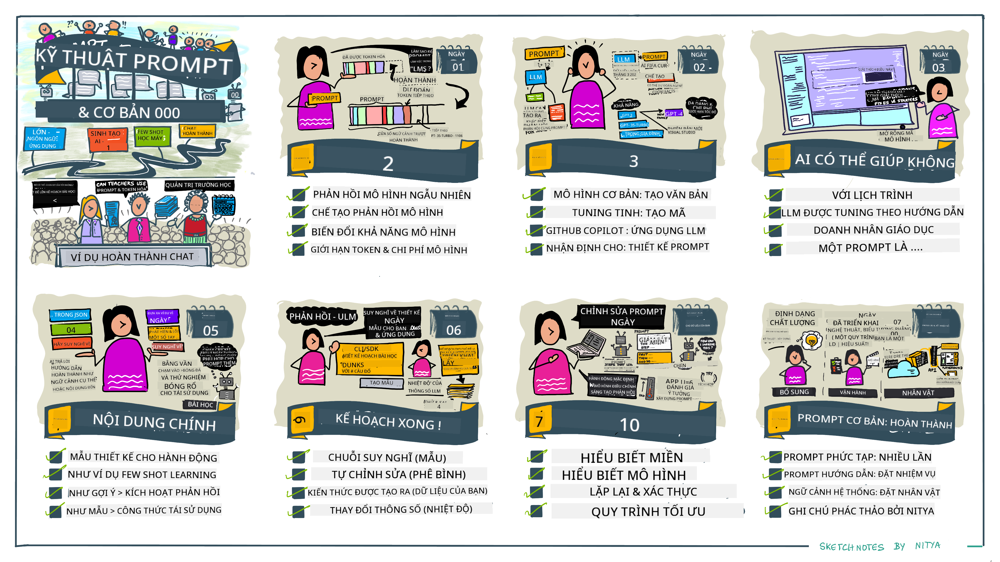
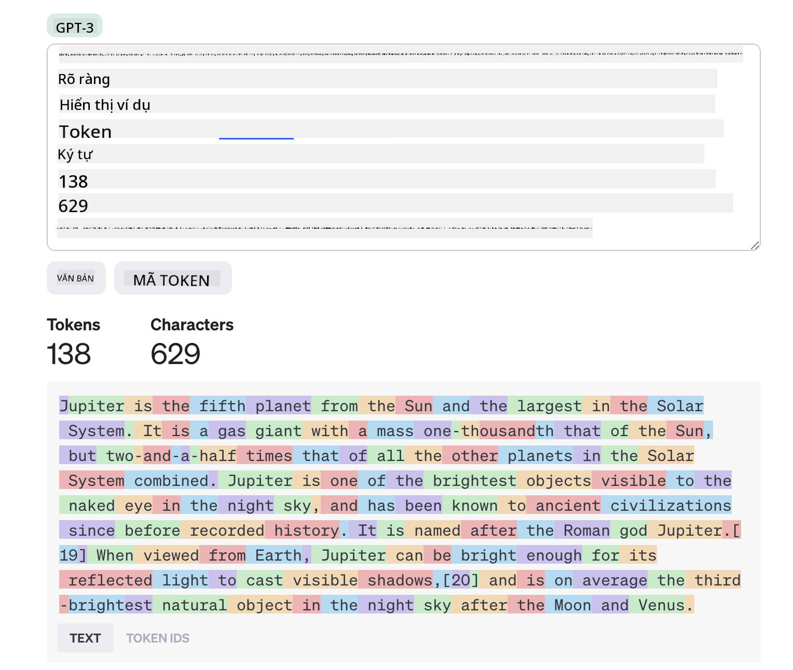

<!--
CO_OP_TRANSLATOR_METADATA:
{
  "original_hash": "8b3cb38518cf4fe7714d2f5e74dfa3eb",
  "translation_date": "2025-10-03T09:53:39+00:00",
  "source_file": "04-prompt-engineering-fundamentals/README.md",
  "language_code": "vi"
}
-->
# Nguyên tắc cơ bản về Kỹ thuật Tạo Prompt

[](https://aka.ms/gen-ai-lesson4-gh?WT.mc_id=academic-105485-koreyst)

## Giới thiệu
Module này bao gồm các khái niệm và kỹ thuật cơ bản để tạo các prompt hiệu quả trong các mô hình AI tạo sinh. Cách bạn viết prompt cho một LLM cũng rất quan trọng. Một prompt được thiết kế cẩn thận có thể mang lại chất lượng phản hồi tốt hơn. Nhưng chính xác thì các thuật ngữ như _prompt_ và _kỹ thuật tạo prompt_ có nghĩa là gì? Và làm thế nào để cải thiện _đầu vào prompt_ mà tôi gửi đến LLM? Đây là những câu hỏi chúng ta sẽ cố gắng trả lời trong chương này và chương tiếp theo.

_AI tạo sinh_ có khả năng tạo nội dung mới (ví dụ: văn bản, hình ảnh, âm thanh, mã code, v.v.) để đáp ứng yêu cầu của người dùng. Nó đạt được điều này thông qua _Mô hình Ngôn ngữ Lớn_ như dòng GPT ("Generative Pre-trained Transformer") của OpenAI, được huấn luyện để sử dụng ngôn ngữ tự nhiên và mã code.

Người dùng hiện có thể tương tác với các mô hình này thông qua các giao diện quen thuộc như trò chuyện, mà không cần bất kỳ chuyên môn kỹ thuật hay đào tạo nào. Các mô hình này dựa trên _prompt_ - người dùng gửi một đầu vào văn bản (prompt) và nhận lại phản hồi từ AI (completion). Sau đó, họ có thể "trò chuyện với AI" theo cách lặp lại, trong các cuộc hội thoại nhiều lượt, tinh chỉnh prompt cho đến khi phản hồi phù hợp với mong đợi.

"Prompt" giờ đây trở thành giao diện _lập trình chính_ cho các ứng dụng AI tạo sinh, hướng dẫn các mô hình làm gì và ảnh hưởng đến chất lượng của các phản hồi được trả về. "Kỹ thuật Tạo Prompt" là một lĩnh vực nghiên cứu đang phát triển nhanh chóng, tập trung vào việc _thiết kế và tối ưu hóa_ các prompt để mang lại các phản hồi nhất quán và chất lượng ở quy mô lớn.

## Mục tiêu học tập

Trong bài học này, chúng ta sẽ tìm hiểu Kỹ thuật Tạo Prompt là gì, tại sao nó quan trọng, và cách chúng ta có thể tạo các prompt hiệu quả hơn cho một mô hình và mục tiêu ứng dụng cụ thể. Chúng ta sẽ hiểu các khái niệm cốt lõi và các thực hành tốt nhất cho kỹ thuật tạo prompt - và tìm hiểu về môi trường "sandbox" tương tác trong Jupyter Notebooks, nơi chúng ta có thể thấy các khái niệm này được áp dụng vào các ví dụ thực tế.

Kết thúc bài học này, chúng ta sẽ có thể:

1. Giải thích Kỹ thuật Tạo Prompt là gì và tại sao nó quan trọng.
2. Mô tả các thành phần của một prompt và cách chúng được sử dụng.
3. Học các thực hành tốt nhất và kỹ thuật cho kỹ thuật tạo prompt.
4. Áp dụng các kỹ thuật đã học vào các ví dụ thực tế, sử dụng một endpoint của OpenAI.

## Các thuật ngữ chính

Kỹ thuật Tạo Prompt: Thực hành thiết kế và tinh chỉnh đầu vào để hướng dẫn các mô hình AI tạo ra các đầu ra mong muốn.
Tokenization: Quá trình chuyển đổi văn bản thành các đơn vị nhỏ hơn, gọi là token, mà mô hình có thể hiểu và xử lý.
Instruction-Tuned LLMs: Các Mô hình Ngôn ngữ Lớn (LLMs) đã được tinh chỉnh với các hướng dẫn cụ thể để cải thiện độ chính xác và sự liên quan của phản hồi.

## Sandbox học tập

Kỹ thuật tạo prompt hiện tại mang tính nghệ thuật hơn là khoa học. Cách tốt nhất để cải thiện trực giác của chúng ta về nó là _thực hành nhiều hơn_ và áp dụng cách tiếp cận thử nghiệm kết hợp chuyên môn trong lĩnh vực ứng dụng với các kỹ thuật được khuyến nghị và tối ưu hóa theo mô hình cụ thể.

Jupyter Notebook đi kèm với bài học này cung cấp một môi trường _sandbox_ nơi bạn có thể thử nghiệm những gì bạn học - khi bạn học hoặc như một phần của thử thách mã ở cuối. Để thực hiện các bài tập, bạn sẽ cần:

1. **Khóa API Azure OpenAI** - endpoint dịch vụ cho một LLM đã triển khai.
2. **Môi trường Python Runtime** - nơi Notebook có thể được thực thi.
3. **Biến môi trường cục bộ** - _hoàn thành các bước [SETUP](./../00-course-setup/02-setup-local.md?WT.mc_id=academic-105485-koreyst) ngay bây giờ để sẵn sàng_.

Notebook đi kèm với các bài tập _khởi đầu_ - nhưng bạn được khuyến khích thêm các phần _Markdown_ (mô tả) và _Code_ (yêu cầu prompt) của riêng mình để thử nghiệm thêm các ví dụ hoặc ý tưởng - và xây dựng trực giác của bạn về thiết kế prompt.

## Hướng dẫn minh họa

Muốn có cái nhìn tổng quan về những gì bài học này bao gồm trước khi bạn bắt đầu? Hãy xem hướng dẫn minh họa này, cung cấp cho bạn cảm nhận về các chủ đề chính được đề cập và những điểm chính cần suy nghĩ trong mỗi phần. Lộ trình bài học đưa bạn từ việc hiểu các khái niệm và thách thức cốt lõi đến việc giải quyết chúng bằng các kỹ thuật và thực hành tốt nhất trong kỹ thuật tạo prompt. Lưu ý rằng phần "Kỹ thuật Nâng cao" trong hướng dẫn này đề cập đến nội dung được đề cập trong chương _tiếp theo_ của chương trình học này.



## Startup của chúng ta

Bây giờ, hãy nói về cách _chủ đề này_ liên quan đến sứ mệnh startup của chúng ta nhằm [mang đổi mới AI vào giáo dục](https://educationblog.microsoft.com/2023/06/collaborating-to-bring-ai-innovation-to-education?WT.mc_id=academic-105485-koreyst). Chúng ta muốn xây dựng các ứng dụng học tập cá nhân hóa dựa trên AI - vậy hãy nghĩ về cách các người dùng khác nhau của ứng dụng của chúng ta có thể "thiết kế" các prompt:

- **Quản trị viên** có thể yêu cầu AI _phân tích dữ liệu chương trình học để xác định các khoảng trống trong nội dung_. AI có thể tóm tắt kết quả hoặc trực quan hóa chúng bằng mã code.
- **Giáo viên** có thể yêu cầu AI _tạo một kế hoạch bài học cho một đối tượng và chủ đề cụ thể_. AI có thể xây dựng kế hoạch cá nhân hóa theo định dạng được chỉ định.
- **Học sinh** có thể yêu cầu AI _dạy kèm họ trong một môn học khó_. AI giờ đây có thể hướng dẫn học sinh với các bài học, gợi ý và ví dụ phù hợp với trình độ của họ.

Đó chỉ là phần nổi của tảng băng chìm. Hãy xem [Prompts For Education](https://github.com/microsoft/prompts-for-edu/tree/main?WT.mc_id=academic-105485-koreyst) - một thư viện prompt mã nguồn mở được các chuyên gia giáo dục biên soạn - để có cái nhìn rộng hơn về các khả năng! _Hãy thử chạy một số prompt đó trong sandbox hoặc sử dụng OpenAI Playground để xem điều gì xảy ra!_

<!--
MẪU BÀI HỌC:
Đơn vị này nên bao gồm khái niệm cốt lõi #1.
Củng cố khái niệm với các ví dụ và tài liệu tham khảo.

KHÁI NIỆM #1:
Kỹ thuật Tạo Prompt.
Định nghĩa và giải thích tại sao nó cần thiết.
-->

## Kỹ thuật Tạo Prompt là gì?

Chúng ta bắt đầu bài học này bằng cách định nghĩa **Kỹ thuật Tạo Prompt** là quá trình _thiết kế và tối ưu hóa_ các đầu vào văn bản (prompt) để mang lại các phản hồi nhất quán và chất lượng (completion) cho một mục tiêu ứng dụng và mô hình cụ thể. Chúng ta có thể nghĩ về điều này như một quy trình gồm 2 bước:

- _thiết kế_ prompt ban đầu cho một mô hình và mục tiêu cụ thể
- _tinh chỉnh_ prompt theo cách lặp lại để cải thiện chất lượng phản hồi

Đây là một quy trình thử nghiệm cần trực giác và nỗ lực của người dùng để đạt được kết quả tối ưu. Vậy tại sao nó lại quan trọng? Để trả lời câu hỏi đó, trước tiên chúng ta cần hiểu ba khái niệm:

- _Tokenization_ = cách mô hình "nhìn thấy" prompt
- _Base LLMs_ = cách mô hình nền tảng "xử lý" một prompt
- _Instruction-Tuned LLMs_ = cách mô hình có thể nhìn thấy "nhiệm vụ"

### Tokenization

Một LLM nhìn thấy các prompt như một _chuỗi các token_ nơi các mô hình khác nhau (hoặc các phiên bản của một mô hình) có thể token hóa cùng một prompt theo các cách khác nhau. Vì LLMs được huấn luyện trên các token (chứ không phải trên văn bản thô), cách các prompt được token hóa có ảnh hưởng trực tiếp đến chất lượng của phản hồi được tạo ra.

Để có trực giác về cách tokenization hoạt động, hãy thử các công cụ như [OpenAI Tokenizer](https://platform.openai.com/tokenizer?WT.mc_id=academic-105485-koreyst) được hiển thị dưới đây. Sao chép prompt của bạn vào - và xem cách nó được chuyển đổi thành các token, chú ý đến cách các ký tự khoảng trắng và dấu câu được xử lý. Lưu ý rằng ví dụ này hiển thị một LLM cũ hơn (GPT-3) - vì vậy thử nghiệm điều này với một mô hình mới hơn có thể tạo ra kết quả khác.



### Khái niệm: Mô hình Nền tảng

Khi một prompt được token hóa, chức năng chính của ["Base LLM"](https://blog.gopenai.com/an-introduction-to-base-and-instruction-tuned-large-language-models-8de102c785a6?WT.mc_id=academic-105485-koreyst) (hoặc mô hình nền tảng) là dự đoán token tiếp theo trong chuỗi đó. Vì LLMs được huấn luyện trên các tập dữ liệu văn bản khổng lồ, chúng có cảm nhận tốt về mối quan hệ thống kê giữa các token và có thể thực hiện dự đoán đó với một mức độ tự tin nhất định. Lưu ý rằng chúng không hiểu _ý nghĩa_ của các từ trong prompt hoặc token; chúng chỉ nhìn thấy một mẫu mà chúng có thể "hoàn thành" với dự đoán tiếp theo của mình. Chúng có thể tiếp tục dự đoán chuỗi cho đến khi bị người dùng can thiệp hoặc một điều kiện được thiết lập trước.

Muốn thấy cách hoàn thành dựa trên prompt hoạt động? Nhập prompt trên vào [_Chat Playground_](https://oai.azure.com/playground?WT.mc_id=academic-105485-koreyst) của Azure OpenAI Studio với các cài đặt mặc định. Hệ thống được cấu hình để xử lý các prompt như các yêu cầu thông tin - vì vậy bạn sẽ thấy một phản hồi hoàn thành phù hợp với ngữ cảnh này.

Nhưng điều gì sẽ xảy ra nếu người dùng muốn thấy một điều gì đó cụ thể đáp ứng một tiêu chí hoặc mục tiêu nhiệm vụ? Đây là lúc các LLM được tinh chỉnh theo hướng dẫn xuất hiện.


### Khái niệm: Instruction-Tuned LLMs

Một [Instruction-Tuned LLM](https://blog.gopenai.com/an-introduction-to-base-and-instruction-tuned-large-language-models-8de102c785a6?WT.mc_id=academic-105485-koreyst) bắt đầu với mô hình nền tảng và tinh chỉnh nó với các ví dụ hoặc cặp đầu vào/đầu ra (ví dụ: các "tin nhắn" nhiều lượt) có thể chứa các hướng dẫn rõ ràng - và phản hồi từ AI cố gắng tuân theo hướng dẫn đó.

Điều này sử dụng các kỹ thuật như Học Tăng Cường với Phản hồi của Con Người (RLHF) để huấn luyện mô hình _tuân theo hướng dẫn_ và _học từ phản hồi_ để tạo ra các phản hồi phù hợp hơn với các ứng dụng thực tế và liên quan hơn đến mục tiêu của người dùng.

Hãy thử nghiệm - quay lại prompt trên, nhưng bây giờ thay đổi _tin nhắn hệ thống_ để cung cấp hướng dẫn sau làm ngữ cảnh:

> _Tóm tắt nội dung bạn được cung cấp cho học sinh lớp hai. Giữ kết quả trong một đoạn văn với 3-5 gạch đầu dòng._

Xem cách kết quả giờ đây được điều chỉnh để phản ánh mục tiêu và định dạng mong muốn? Một giáo viên giờ đây có thể trực tiếp sử dụng phản hồi này trong các slide cho lớp học đó.


## Tại sao chúng ta cần Kỹ thuật Tạo Prompt?

Bây giờ chúng ta đã biết cách các prompt được xử lý bởi LLMs, hãy nói về _tại sao_ chúng ta cần kỹ thuật tạo prompt. Câu trả lời nằm ở thực tế rằng các LLM hiện tại đặt ra một số thách thức khiến việc đạt được các phản hồi _đáng tin cậy và nhất quán_ trở nên khó khăn hơn nếu không nỗ lực vào việc xây dựng và tối ưu hóa prompt. Ví dụ:

1. **Phản hồi của mô hình mang tính ngẫu nhiên.** _Cùng một prompt_ có khả năng tạo ra các phản hồi khác nhau với các mô hình hoặc phiên bản mô hình khác nhau. Và nó thậm chí có thể tạo ra các kết quả khác nhau với _cùng một mô hình_ vào các thời điểm khác nhau. _Các kỹ thuật tạo prompt có thể giúp chúng ta giảm thiểu những biến đổi này bằng cách cung cấp các rào chắn tốt hơn_.

1. **Mô hình có thể tạo ra thông tin sai lệch.** Các mô hình được huấn luyện với _tập dữ liệu lớn nhưng hữu hạn_, nghĩa là chúng thiếu kiến thức về các khái niệm ngoài phạm vi huấn luyện đó. Kết quả là, chúng có thể tạo ra các phản hồi không chính xác, tưởng tượng, hoặc mâu thuẫn trực tiếp với các sự kiện đã biết. _Các kỹ thuật tạo prompt giúp người dùng xác định và giảm thiểu những thông tin sai lệch này, ví dụ: bằng cách yêu cầu AI cung cấp trích dẫn hoặc lý luận_.

1. **Khả năng của mô hình sẽ khác nhau.** Các mô hình mới hơn hoặc các thế hệ mô hình sẽ có khả năng phong phú hơn nhưng cũng mang lại những đặc điểm riêng và sự đánh đổi về chi phí & độ phức tạp. _Kỹ thuật tạo prompt có thể giúp chúng ta phát triển các thực hành tốt nhất và quy trình làm việc trừu tượng hóa sự khác biệt và thích ứng với các yêu cầu cụ thể của mô hình một cách liền mạch và có thể mở rộng_.

Hãy xem điều này hoạt động trong OpenAI hoặc Azure OpenAI Playground:

- Sử dụng cùng một prompt với các triển khai LLM khác nhau (ví dụ: OpenAI, Azure OpenAI, Hugging Face) - bạn có thấy sự khác biệt không?
- Sử dụng cùng một prompt lặp lại với cùng một triển khai LLM (ví dụ: Azure OpenAI Playground) - những biến đổi này khác nhau như thế nào?

### Ví dụ về thông tin sai lệch

Trong khóa học này, chúng ta sử dụng thuật ngữ **"fabrication"** để chỉ hiện tượng khi LLMs đôi khi tạo ra thông tin không chính xác do hạn chế trong quá trình huấn luyện hoặc các ràng buộc khác. Bạn cũng có thể đã nghe thuật ngữ này được gọi là _"hallucinations"_ trong các bài báo hoặc nghiên cứu phổ biến. Tuy nhiên, chúng tôi khuyến nghị mạnh mẽ sử dụng thuật ngữ _"fabrication"_ để tránh vô tình nhân hóa hành vi bằng cách gán một đặc điểm giống con người cho một kết quả do máy móc tạo ra. Điều này cũng củng cố [các hướng dẫn AI có trách nhiệm](https://www.microsoft.com/ai/responsible-ai?WT.mc_id=academic-105485-koreyst) từ góc độ thuật ngữ, loại bỏ các thuật ngữ có thể bị coi là xúc phạm hoặc không bao hàm trong một số ngữ cảnh.

Muốn hiểu cách thông tin sai lệch hoạt động? Hãy nghĩ về một prompt yêu cầu AI tạo nội dung cho một chủ đề không tồn tại (để đảm bảo nó không được tìm thấy trong tập dữ liệu huấn luyện). Ví dụ - tôi đã thử prompt này:

> **Prompt:** tạo một kế hoạch bài học về Cuộc chiến Sao Hỏa năm 2076.
Một tìm kiếm trên web cho thấy có những câu chuyện hư cấu (ví dụ: loạt phim truyền hình hoặc sách) về các cuộc chiến trên sao Hỏa - nhưng không có cuộc chiến nào vào năm 2076. Lý trí cũng cho chúng ta biết rằng năm 2076 là _tương lai_ và do đó, không thể liên quan đến một sự kiện có thật.

Vậy điều gì xảy ra khi chúng ta chạy lời nhắc này với các nhà cung cấp mô hình ngôn ngữ lớn (LLM) khác nhau?

> **Phản hồi 1**: OpenAI Playground (GPT-35)


> **Phản hồi 2**: Azure OpenAI Playground (GPT-35)


> **Phản hồi 3**: Hugging Face Chat Playground (LLama-2)


Như mong đợi, mỗi mô hình (hoặc phiên bản mô hình) tạo ra các phản hồi hơi khác nhau nhờ vào hành vi ngẫu nhiên và sự khác biệt về khả năng của mô hình. Ví dụ, một mô hình nhắm đến đối tượng học sinh lớp 8 trong khi mô hình khác giả định đối tượng là học sinh trung học. Nhưng cả ba mô hình đều tạo ra các phản hồi có thể thuyết phục một người dùng không có thông tin rằng sự kiện này là có thật.

Các kỹ thuật thiết kế lời nhắc như _metaprompting_ và _cấu hình nhiệt độ_ có thể giảm bớt sự bịa đặt của mô hình ở một mức độ nào đó. Các kiến trúc thiết kế lời nhắc mới cũng tích hợp các công cụ và kỹ thuật mới một cách liền mạch vào luồng lời nhắc, nhằm giảm thiểu hoặc hạn chế một số hiệu ứng này.

## Nghiên cứu trường hợp: GitHub Copilot

Hãy kết thúc phần này bằng cách tìm hiểu cách thiết kế lời nhắc được sử dụng trong các giải pháp thực tế qua một nghiên cứu trường hợp: [GitHub Copilot](https://github.com/features/copilot?WT.mc_id=academic-105485-koreyst).

GitHub Copilot là "Lập trình viên đồng hành AI" của bạn - nó chuyển đổi lời nhắc văn bản thành các đoạn mã hoàn chỉnh và được tích hợp vào môi trường phát triển của bạn (ví dụ: Visual Studio Code) để mang lại trải nghiệm người dùng liền mạch. Như được ghi nhận trong loạt bài viết dưới đây, phiên bản đầu tiên dựa trên mô hình OpenAI Codex - với các kỹ sư nhanh chóng nhận ra nhu cầu tinh chỉnh mô hình và phát triển các kỹ thuật thiết kế lời nhắc tốt hơn để cải thiện chất lượng mã. Vào tháng 7, họ [ra mắt một mô hình AI cải tiến vượt xa Codex](https://github.blog/2023-07-28-smarter-more-efficient-coding-github-copilot-goes-beyond-codex-with-improved-ai-model/?WT.mc_id=academic-105485-koreyst) để đưa ra các gợi ý nhanh hơn.

Hãy đọc các bài viết theo thứ tự để theo dõi hành trình học hỏi của họ.

- **Tháng 5 năm 2023** | [GitHub Copilot đang ngày càng hiểu mã của bạn tốt hơn](https://github.blog/2023-05-17-how-github-copilot-is-getting-better-at-understanding-your-code/?WT.mc_id=academic-105485-koreyst)
- **Tháng 5 năm 2023** | [Bên trong GitHub: Làm việc với các LLM đằng sau GitHub Copilot](https://github.blog/2023-05-17-inside-github-working-with-the-llms-behind-github-copilot/?WT.mc_id=academic-105485-koreyst).
- **Tháng 6 năm 2023** | [Cách viết lời nhắc tốt hơn cho GitHub Copilot](https://github.blog/2023-06-20-how-to-write-better-prompts-for-github-copilot/?WT.mc_id=academic-105485-koreyst).
- **Tháng 7 năm 2023** | [.. GitHub Copilot vượt xa Codex với mô hình AI cải tiến](https://github.blog/2023-07-28-smarter-more-efficient-coding-github-copilot-goes-beyond-codex-with-improved-ai-model/?WT.mc_id=academic-105485-koreyst)
- **Tháng 7 năm 2023** | [Hướng dẫn dành cho nhà phát triển về thiết kế lời nhắc và LLM](https://github.blog/2023-07-17-prompt-engineering-guide-generative-ai-llms/?WT.mc_id=academic-105485-koreyst)
- **Tháng 9 năm 2023** | [Cách xây dựng ứng dụng LLM doanh nghiệp: Bài học từ GitHub Copilot](https://github.blog/2023-09-06-how-to-build-an-enterprise-llm-application-lessons-from-github-copilot/?WT.mc_id=academic-105485-koreyst)

Bạn cũng có thể duyệt qua [blog kỹ thuật của họ](https://github.blog/category/engineering/?WT.mc_id=academic-105485-koreyst) để tìm thêm các bài viết như [bài này](https://github.blog/2023-09-27-how-i-used-github-copilot-chat-to-build-a-reactjs-gallery-prototype/?WT.mc_id=academic-105485-koreyst) cho thấy cách các mô hình và kỹ thuật này được _áp dụng_ để thúc đẩy các ứng dụng thực tế.

---

## Cấu trúc lời nhắc

Chúng ta đã thấy tại sao thiết kế lời nhắc lại quan trọng - bây giờ hãy tìm hiểu cách lời nhắc được _xây dựng_ để chúng ta có thể đánh giá các kỹ thuật khác nhau nhằm thiết kế lời nhắc hiệu quả hơn.

### Lời nhắc cơ bản

Hãy bắt đầu với lời nhắc cơ bản: một đầu vào văn bản được gửi đến mô hình mà không có ngữ cảnh nào khác. Đây là một ví dụ - khi chúng ta gửi vài từ đầu tiên của bài quốc ca Hoa Kỳ đến [API Completion](https://platform.openai.com/docs/api-reference/completions?WT.mc_id=academic-105485-koreyst) của OpenAI, nó ngay lập tức _hoàn thành_ phản hồi với vài dòng tiếp theo, minh họa hành vi dự đoán cơ bản.

| Lời nhắc (Đầu vào) | Hoàn thành (Đầu ra)                                                                                                                        |
| :----------------- | :----------------------------------------------------------------------------------------------------------------------------------------- |
| Oh say can you see | Có vẻ như bạn đang bắt đầu lời bài hát "The Star-Spangled Banner," quốc ca của Hoa Kỳ. Lời bài hát đầy đủ là ...                           |

### Lời nhắc phức tạp

Bây giờ hãy thêm ngữ cảnh và hướng dẫn vào lời nhắc cơ bản đó. [API Chat Completion](https://learn.microsoft.com/azure/ai-services/openai/how-to/chatgpt?WT.mc_id=academic-105485-koreyst) cho phép chúng ta xây dựng một lời nhắc phức tạp dưới dạng một tập hợp các _tin nhắn_ với:

- Các cặp đầu vào/đầu ra phản ánh đầu vào của _người dùng_ và phản hồi của _trợ lý_.
- Tin nhắn hệ thống thiết lập ngữ cảnh cho hành vi hoặc tính cách của trợ lý.

Yêu cầu bây giờ có dạng dưới đây, nơi _tokenization_ hiệu quả nắm bắt thông tin liên quan từ ngữ cảnh và cuộc trò chuyện. Bây giờ, việc thay đổi ngữ cảnh hệ thống có thể ảnh hưởng lớn đến chất lượng của các phản hồi, giống như các đầu vào của người dùng được cung cấp.

```python
response = openai.chat.completions.create(
    model="gpt-3.5-turbo",
    messages=[
        {"role": "system", "content": "You are a helpful assistant."},
        {"role": "user", "content": "Who won the world series in 2020?"},
        {"role": "assistant", "content": "The Los Angeles Dodgers won the World Series in 2020."},
        {"role": "user", "content": "Where was it played?"}
    ]
)
```

### Lời nhắc hướng dẫn

Trong các ví dụ trên, lời nhắc của người dùng là một truy vấn văn bản đơn giản có thể được hiểu là một yêu cầu thông tin. Với lời nhắc _hướng dẫn_, chúng ta có thể sử dụng văn bản đó để chỉ định một nhiệm vụ chi tiết hơn, cung cấp hướng dẫn tốt hơn cho AI. Đây là một ví dụ:

| Lời nhắc (Đầu vào)                                                                                                                                                                                                                         | Hoàn thành (Đầu ra)                                                                                                        | Loại hướng dẫn      |
| :------------------------------------------------------------------------------------------------------------------------------------------------------------------------------------------------------------------------------------- | :------------------------------------------------------------------------------------------------------------------------- | :------------------ |
| Viết mô tả về Nội chiến Hoa Kỳ                                                                                                                                                                                                   | _trả về một đoạn văn đơn giản_                                                                                              | Đơn giản            |
| Viết mô tả về Nội chiến Hoa Kỳ. Cung cấp các ngày và sự kiện quan trọng và mô tả ý nghĩa của chúng                                                                                                                                     | _trả về một đoạn văn kèm theo danh sách các ngày sự kiện quan trọng với mô tả_                                             | Phức tạp            |
| Viết mô tả về Nội chiến Hoa Kỳ trong 1 đoạn văn. Cung cấp 3 gạch đầu dòng với các ngày quan trọng và ý nghĩa của chúng. Cung cấp thêm 3 gạch đầu dòng với các nhân vật lịch sử quan trọng và đóng góp của họ. Trả về đầu ra dưới dạng tệp JSON | _trả về chi tiết phong phú hơn trong một hộp văn bản, được định dạng dưới dạng JSON mà bạn có thể sao chép-dán vào tệp và xác thực khi cần_ | Phức tạp. Định dạng.|

## Nội dung chính

Trong các ví dụ trên, lời nhắc vẫn khá mở, cho phép LLM quyết định phần nào trong tập dữ liệu được huấn luyện trước của nó là phù hợp. Với mẫu thiết kế _nội dung chính_, văn bản đầu vào được chia thành hai phần:

- một hướng dẫn (hành động)
- nội dung liên quan (ảnh hưởng đến hành động)

Đây là một ví dụ trong đó hướng dẫn là "tóm tắt điều này trong 2 câu".

| Lời nhắc (Đầu vào)                                                                                                                                                                                                                                                                                                                                                                                                                                                                                                                                                                                                                                                                                      | Hoàn thành (Đầu ra)                                                                                                                                                                                                                                                                             |
| :-------------------------------------------------------------------------------------------------------------------------------------------------------------------------------------------------------------------------------------------------------------------------------------------------------------------------------------------------------------------------------------------------------------------------------------------------------------------------------------------------------------------------------------------------------------------------------------------------------------------------------------------------------------------------------------------------- | :---------------------------------------------------------------------------------------------------------------------------------------------------------------------------------------------------------------------------------------------------------------------------------------------- |
| Sao Mộc là hành tinh thứ năm từ Mặt Trời và là hành tinh lớn nhất trong Hệ Mặt Trời. Nó là một hành tinh khí với khối lượng bằng một phần nghìn khối lượng của Mặt Trời, nhưng lớn gấp hai lần rưỡi khối lượng của tất cả các hành tinh khác trong Hệ Mặt Trời cộng lại. Sao Mộc là một trong những vật thể sáng nhất có thể nhìn thấy bằng mắt thường trên bầu trời đêm, và đã được các nền văn minh cổ đại biết đến từ trước khi có lịch sử ghi chép. Nó được đặt tên theo thần Jupiter của La Mã. Khi nhìn từ Trái Đất, Sao Mộc có thể sáng đến mức ánh sáng phản chiếu của nó có thể tạo ra bóng nhìn thấy được, và trung bình là vật thể tự nhiên sáng thứ ba trên bầu trời đêm sau Mặt Trăng và Sao Kim. <br/> **Tóm tắt điều này trong 2 câu ngắn** | Sao Mộc, hành tinh thứ năm từ Mặt Trời, là hành tinh lớn nhất trong Hệ Mặt Trời và được biết đến là một trong những vật thể sáng nhất trên bầu trời đêm. Được đặt tên theo thần Jupiter của La Mã, nó là một hành tinh khí với khối lượng lớn gấp hai lần rưỡi khối lượng của tất cả các hành tinh khác cộng lại. |

Phân đoạn nội dung chính có thể được sử dụng theo nhiều cách để thúc đẩy các hướng dẫn hiệu quả hơn:

- **Ví dụ** - thay vì nói cho mô hình biết phải làm gì bằng một hướng dẫn rõ ràng, hãy cung cấp cho nó các ví dụ về những gì cần làm và để nó suy luận ra mẫu.
- **Gợi ý** - theo sau hướng dẫn bằng một "gợi ý" để kích thích phản hồi, hướng dẫn mô hình đến các phản hồi phù hợp hơn.
- **Mẫu** - đây là các 'công thức' lặp lại cho lời nhắc với các chỗ trống (biến số) có thể được tùy chỉnh bằng dữ liệu cho các trường hợp sử dụng cụ thể.

Hãy khám phá các cách này trong thực tế.

### Sử dụng ví dụ

Đây là một cách tiếp cận trong đó bạn sử dụng nội dung chính để "cung cấp cho mô hình" một số ví dụ về đầu ra mong muốn cho một hướng dẫn nhất định và để nó suy luận ra mẫu cho đầu ra mong muốn. Dựa trên số lượng ví dụ được cung cấp, chúng ta có thể có lời nhắc không ví dụ, một ví dụ, vài ví dụ, v.v.

Lời nhắc bây giờ bao gồm ba thành phần:

- Mô tả nhiệm vụ
- Một vài ví dụ về đầu ra mong muốn
- Bắt đầu một ví dụ mới (trở thành mô tả nhiệm vụ ngầm)

| Loại học tập | Lời nhắc (Đầu vào)                                                                                                                                        | Hoàn thành (Đầu ra)         |
| :------------ | :---------------------------------------------------------------------------------------------------------------------------------------------------- | :-------------------------- |
| Không ví dụ   | "The Sun is Shining". Dịch sang tiếng Tây Ban Nha                                                                                                            | "El Sol está brillando".    |
| Một ví dụ     | "The Sun is Shining" => ""El Sol está brillando". <br> "It's a Cold and Windy Day" =>                                                                 | "Es un día frío y ventoso". |
| Vài ví dụ     | The player ran the bases => Baseball <br/> The player hit an ace => Tennis <br/> The player hit a six => Cricket <br/> The player made a slam-dunk => | Basketball                  |
|               |                                                                                                                                                       |                             |

Lưu ý cách chúng ta phải cung cấp hướng dẫn rõ ràng ("Dịch sang tiếng Tây Ban Nha") trong lời nhắc không ví dụ, nhưng nó được suy luận trong ví dụ một ví dụ. Ví dụ vài ví dụ cho thấy cách thêm nhiều ví dụ cho phép mô hình đưa ra suy luận chính xác hơn mà không cần thêm hướng dẫn.

### Gợi ý lời nhắc

Một kỹ thuật khác để sử dụng nội dung chính là cung cấp _gợi ý_ thay vì ví dụ. Trong trường hợp này, chúng ta đang đưa cho mô hình một sự thúc đẩy đúng hướng bằng cách _bắt đầu_ với một đoạn phản ánh định dạng phản hồi mong muốn. Mô hình sau đó "nhận gợi ý" để tiếp tục theo hướng đó.

| Số lượng gợi ý | Lời nhắc (Đầu vào)                                                                                                                                                                                                                                                                                                                                                                                                                                               | Hoàn thành (Đầu ra)                                                                                                                                                                                                                                                                                       |
| :------------- | :----------------------------------------------------------------------------------------------------------------------------------------------------------------------------------------------------------------------------------------------------------------------------------------------------------------------------------------------------------------------------------------------------------------------------------------------------------- | :-------------------------------------------------------------------------------------------------------------------------------------------------------------------------------------------------------------------------------------------------------------------------------------------------------- |
| 0              | Sao Mộc là hành tinh thứ năm từ Mặt Trời và là hành tinh lớn nhất trong Hệ Mặt Trời. Nó là một hành tinh khí với khối lượng bằng một phần nghìn khối lượng của Mặt Trời, nhưng lớn gấp hai lần rưỡi khối lượng của tất cả các hành tinh khác trong Hệ Mặt Trời cộng lại. Sao Mộc là một trong những vật thể sáng nhất có thể nhìn thấy bằng mắt thường trên bầu trời đêm, và đã được các nền văn minh cổ đại biết đến từ trước khi có lịch sử ghi chép. <br/>**Tóm tắt điều này**                                       | Sao Mộc là hành tinh lớn nhất trong Hệ Mặt Trời và là hành tinh thứ năm từ Mặt Trời. Nó là một hành tinh khí với khối lượng bằng 1/1000 khối lượng của Mặt Trời, nhưng nặng hơn tất cả các hành tinh khác cộng lại. Các nền văn minh cổ đại đã biết đến Sao Mộc từ lâu, và nó dễ dàng nhìn thấy trên bầu trời đêm. |
| 1              | Sao Mộc là hành tinh thứ năm tính từ Mặt Trời và là hành tinh lớn nhất trong Hệ Mặt Trời. Đây là một hành tinh khí khổng lồ với khối lượng bằng một phần nghìn khối lượng của Mặt Trời, nhưng lớn gấp hai lần rưỡi tổng khối lượng của tất cả các hành tinh khác trong Hệ Mặt Trời cộng lại. Sao Mộc là một trong những vật thể sáng nhất có thể nhìn thấy bằng mắt thường trên bầu trời đêm và đã được các nền văn minh cổ đại biết đến từ trước khi có lịch sử ghi chép. <br/>**Tóm tắt nội dung** <br/> Những gì chúng ta đã học được là Sao Mộc | là hành tinh thứ năm tính từ Mặt Trời và là hành tinh lớn nhất trong Hệ Mặt Trời. Đây là một hành tinh khí khổng lồ với khối lượng bằng một phần nghìn khối lượng của Mặt Trời, nhưng lớn gấp hai lần rưỡi tổng khối lượng của tất cả các hành tinh khác cộng lại. Nó dễ dàng nhìn thấy bằng mắt thường và đã được biết đến từ thời cổ đại.                        |
| 2              | Sao Mộc là hành tinh thứ năm tính từ Mặt Trời và là hành tinh lớn nhất trong Hệ Mặt Trời. Đây là một hành tinh khí khổng lồ với khối lượng bằng một phần nghìn khối lượng của Mặt Trời, nhưng lớn gấp hai lần rưỡi tổng khối lượng của tất cả các hành tinh khác trong Hệ Mặt Trời cộng lại. Sao Mộc là một trong những vật thể sáng nhất có thể nhìn thấy bằng mắt thường trên bầu trời đêm và đã được các nền văn minh cổ đại biết đến từ trước khi có lịch sử ghi chép. <br/>**Tóm tắt nội dung** <br/> 3 sự thật hàng đầu chúng ta đã học:         | 1. Sao Mộc là hành tinh thứ năm tính từ Mặt Trời và là hành tinh lớn nhất trong Hệ Mặt Trời. <br/> 2. Đây là một hành tinh khí khổng lồ với khối lượng bằng một phần nghìn khối lượng của Mặt Trời...<br/> 3. Sao Mộc đã có thể nhìn thấy bằng mắt thường từ thời cổ đại ...                                                                       |
|                |                                                                                                                                                                                                                                                                                                                                                                                                                                                              |                                                                                                                                                                                                                                                                                                           |

### Mẫu gợi ý

Mẫu gợi ý là một _công thức được định nghĩa trước cho gợi ý_ có thể được lưu trữ và tái sử dụng khi cần, nhằm tạo ra trải nghiệm người dùng nhất quán hơn ở quy mô lớn. Ở dạng đơn giản nhất, nó chỉ là một tập hợp các ví dụ gợi ý như [ví dụ này từ OpenAI](https://platform.openai.com/examples?WT.mc_id=academic-105485-koreyst) cung cấp cả các thành phần gợi ý tương tác (tin nhắn của người dùng và hệ thống) và định dạng yêu cầu qua API - để hỗ trợ tái sử dụng.

Ở dạng phức tạp hơn như [ví dụ này từ LangChain](https://python.langchain.com/docs/concepts/prompt_templates/?WT.mc_id=academic-105485-koreyst), nó chứa _các chỗ trống_ có thể được thay thế bằng dữ liệu từ nhiều nguồn khác nhau (nhập liệu từ người dùng, ngữ cảnh hệ thống, nguồn dữ liệu bên ngoài, v.v.) để tạo ra gợi ý một cách động. Điều này cho phép chúng ta tạo ra một thư viện các gợi ý có thể tái sử dụng để thúc đẩy trải nghiệm người dùng nhất quán **một cách lập trình** ở quy mô lớn.

Cuối cùng, giá trị thực sự của các mẫu gợi ý nằm ở khả năng tạo và xuất bản _thư viện gợi ý_ cho các lĩnh vực ứng dụng cụ thể - nơi mẫu gợi ý được _tối ưu hóa_ để phản ánh ngữ cảnh hoặc ví dụ cụ thể của ứng dụng, giúp các phản hồi trở nên phù hợp và chính xác hơn đối với đối tượng người dùng mục tiêu. Kho lưu trữ [Prompts For Edu](https://github.com/microsoft/prompts-for-edu?WT.mc_id=academic-105485-koreyst) là một ví dụ tuyệt vời về cách tiếp cận này, tập hợp một thư viện các gợi ý cho lĩnh vực giáo dục với trọng tâm là các mục tiêu chính như lập kế hoạch bài học, thiết kế chương trình học, hướng dẫn học sinh, v.v.

## Nội dung hỗ trợ

Nếu chúng ta nghĩ về việc xây dựng gợi ý như việc có một hướng dẫn (nhiệm vụ) và một mục tiêu (nội dung chính), thì _nội dung phụ_ giống như ngữ cảnh bổ sung mà chúng ta cung cấp để **ảnh hưởng đến kết quả theo một cách nào đó**. Nó có thể là các tham số điều chỉnh, hướng dẫn định dạng, phân loại chủ đề, v.v., giúp mô hình _tùy chỉnh_ phản hồi để phù hợp với các mục tiêu hoặc kỳ vọng của người dùng.

Ví dụ: Với một danh mục khóa học có siêu dữ liệu phong phú (tên, mô tả, cấp độ, thẻ siêu dữ liệu, giảng viên, v.v.) về tất cả các khóa học có trong chương trình học:

- chúng ta có thể định nghĩa một hướng dẫn để "tóm tắt danh mục khóa học cho mùa Thu 2023"
- chúng ta có thể sử dụng nội dung chính để cung cấp một vài ví dụ về kết quả mong muốn
- chúng ta có thể sử dụng nội dung phụ để xác định 5 "thẻ" hàng đầu được quan tâm.

Bây giờ, mô hình có thể cung cấp một bản tóm tắt theo định dạng được hiển thị bởi các ví dụ - nhưng nếu một kết quả có nhiều thẻ, nó có thể ưu tiên 5 thẻ được xác định trong nội dung phụ.

---

<!--
MẪU BÀI HỌC:
Đơn vị này nên bao gồm khái niệm cốt lõi #1.
Củng cố khái niệm bằng các ví dụ và tài liệu tham khảo.

KHÁI NIỆM #3:
Kỹ thuật xây dựng gợi ý.
Một số kỹ thuật cơ bản để xây dựng gợi ý là gì?
Minh họa bằng các bài tập.
-->

## Các nguyên tắc xây dựng gợi ý

Bây giờ chúng ta đã biết cách gợi ý có thể được _xây dựng_, chúng ta có thể bắt đầu nghĩ về cách _thiết kế_ chúng để phản ánh các nguyên tắc tốt nhất. Chúng ta có thể nghĩ về điều này theo hai phần - có tư duy đúng đắn và áp dụng các kỹ thuật phù hợp.

### Tư duy xây dựng gợi ý

Xây dựng gợi ý là một quá trình thử nghiệm và sai sót, vì vậy hãy ghi nhớ ba yếu tố hướng dẫn rộng lớn:

1. **Hiểu biết về lĩnh vực rất quan trọng.** Độ chính xác và mức độ liên quan của phản hồi là một hàm số của _lĩnh vực_ mà ứng dụng hoặc người dùng đó hoạt động. Áp dụng trực giác và chuyên môn của bạn để **tùy chỉnh các kỹ thuật** hơn nữa. Ví dụ, định nghĩa _các tính cách cụ thể của lĩnh vực_ trong các gợi ý hệ thống của bạn, hoặc sử dụng _các mẫu gợi ý cụ thể của lĩnh vực_ trong các gợi ý của người dùng. Cung cấp nội dung phụ phản ánh ngữ cảnh cụ thể của lĩnh vực, hoặc sử dụng _các tín hiệu và ví dụ cụ thể của lĩnh vực_ để hướng dẫn mô hình theo các mẫu sử dụng quen thuộc.

2. **Hiểu biết về mô hình rất quan trọng.** Chúng ta biết rằng các mô hình có tính ngẫu nhiên. Nhưng việc triển khai mô hình cũng có thể khác nhau về tập dữ liệu huấn luyện mà chúng sử dụng (kiến thức được huấn luyện trước), các khả năng mà chúng cung cấp (ví dụ, qua API hoặc SDK) và loại nội dung mà chúng được tối ưu hóa (ví dụ, mã, hình ảnh, văn bản). Hiểu rõ điểm mạnh và hạn chế của mô hình bạn đang sử dụng, và sử dụng kiến thức đó để _ưu tiên nhiệm vụ_ hoặc xây dựng _các mẫu tùy chỉnh_ được tối ưu hóa cho khả năng của mô hình.

3. **Lặp lại và xác nhận rất quan trọng.** Các mô hình đang phát triển nhanh chóng, và các kỹ thuật xây dựng gợi ý cũng vậy. Là một chuyên gia trong lĩnh vực, bạn có thể có ngữ cảnh hoặc tiêu chí khác _cho_ ứng dụng cụ thể của mình, mà có thể không áp dụng cho cộng đồng rộng lớn hơn. Sử dụng các công cụ và kỹ thuật xây dựng gợi ý để "khởi động" việc xây dựng gợi ý, sau đó lặp lại và xác nhận kết quả bằng trực giác và chuyên môn của bạn. Ghi lại những hiểu biết của bạn và tạo một **cơ sở kiến thức** (ví dụ, thư viện gợi ý) có thể được sử dụng làm cơ sở mới bởi người khác, để lặp lại nhanh hơn trong tương lai.

## Các nguyên tắc tốt nhất

Bây giờ hãy xem các nguyên tắc tốt nhất phổ biến được khuyến nghị bởi [OpenAI](https://help.openai.com/en/articles/6654000-best-practices-for-prompt-engineering-with-openai-api?WT.mc_id=academic-105485-koreyst) và các chuyên gia [Azure OpenAI](https://learn.microsoft.com/azure/ai-services/openai/concepts/prompt-engineering#best-practices?WT.mc_id=academic-105485-koreyst).

| Nội dung                          | Lý do                                                                                                                                                                                                                                               |
| :-------------------------------- | :------------------------------------------------------------------------------------------------------------------------------------------------------------------------------------------------------------------------------------------------ |
| Đánh giá các mô hình mới nhất.    | Các thế hệ mô hình mới có khả năng có các tính năng và chất lượng được cải thiện - nhưng cũng có thể phát sinh chi phí cao hơn. Đánh giá chúng để xem tác động, sau đó đưa ra quyết định di chuyển.                                                                                |
| Tách biệt hướng dẫn và ngữ cảnh   | Kiểm tra xem mô hình/nhà cung cấp của bạn có định nghĩa _các dấu phân cách_ để phân biệt rõ ràng giữa hướng dẫn, nội dung chính và nội dung phụ hay không. Điều này có thể giúp mô hình gán trọng số chính xác hơn cho các token.                                                         |
| Cụ thể và rõ ràng                 | Cung cấp nhiều chi tiết hơn về ngữ cảnh mong muốn, kết quả, độ dài, định dạng, phong cách, v.v. Điều này sẽ cải thiện cả chất lượng và tính nhất quán của các phản hồi. Ghi lại các công thức trong các mẫu có thể tái sử dụng.                                                          |
| Mô tả, sử dụng ví dụ              | Các mô hình có thể phản hồi tốt hơn với cách tiếp cận "hiển thị và kể". Bắt đầu với cách tiếp cận `zero-shot` nơi bạn chỉ đưa ra hướng dẫn (nhưng không có ví dụ), sau đó thử `few-shot` như một sự tinh chỉnh, cung cấp một vài ví dụ về kết quả mong muốn. Sử dụng các phép so sánh. |
| Sử dụng tín hiệu để khởi động hoàn thành | Hướng nó đến một kết quả mong muốn bằng cách cung cấp một số từ hoặc cụm từ dẫn đầu mà nó có thể sử dụng làm điểm bắt đầu cho phản hồi.                                                                                                               |
| Nhấn mạnh                         | Đôi khi bạn có thể cần lặp lại hướng dẫn cho mô hình. Đưa ra hướng dẫn trước và sau nội dung chính của bạn, sử dụng một hướng dẫn và một tín hiệu, v.v. Lặp lại và xác nhận để xem điều gì hiệu quả.                                                         |
| Thứ tự quan trọng                 | Thứ tự mà bạn trình bày thông tin cho mô hình có thể ảnh hưởng đến kết quả, ngay cả trong các ví dụ học tập, nhờ vào sự thiên vị gần đây. Thử các tùy chọn khác nhau để xem điều gì hiệu quả nhất.                                                               |
| Cho mô hình một "lối thoát"       | Cung cấp cho mô hình một phản hồi hoàn thành _dự phòng_ mà nó có thể cung cấp nếu không thể hoàn thành nhiệm vụ vì bất kỳ lý do nào. Điều này có thể giảm khả năng mô hình tạo ra các phản hồi sai hoặc bịa đặt.                                                         |
|                                   |                                                                                                                                                                                                                                                   |

Như với bất kỳ nguyên tắc tốt nhất nào, hãy nhớ rằng _kết quả của bạn có thể khác nhau_ tùy thuộc vào mô hình, nhiệm vụ và lĩnh vực. Sử dụng những điều này làm điểm khởi đầu, và lặp lại để tìm ra điều gì hiệu quả nhất cho bạn. Liên tục đánh giá lại quy trình xây dựng gợi ý của bạn khi các mô hình và công cụ mới trở nên khả dụng, với trọng tâm là khả năng mở rộng quy trình và chất lượng phản hồi.

<!--
MẪU BÀI HỌC:
Đơn vị này nên cung cấp một thử thách mã nếu có thể

THỬ THÁCH:
Liên kết đến một Jupyter Notebook chỉ có các nhận xét mã trong hướng dẫn (các phần mã trống).

GIẢI PHÁP:
Liên kết đến một bản sao của Notebook đó với các gợi ý được điền vào và chạy, hiển thị một ví dụ có thể.
-->

## Bài tập

Chúc mừng! Bạn đã hoàn thành bài học! Đã đến lúc áp dụng một số khái niệm và kỹ thuật đó với các ví dụ thực tế!

Đối với bài tập của chúng ta, chúng ta sẽ sử dụng một Jupyter Notebook với các bài tập bạn có thể hoàn thành tương tác. Bạn cũng có thể mở rộng Notebook với các ô Markdown và Code của riêng mình để khám phá các ý tưởng và kỹ thuật theo cách của bạn.

### Để bắt đầu, fork repo, sau đó

- (Khuyến nghị) Khởi chạy GitHub Codespaces
- (Tùy chọn) Clone repo về thiết bị của bạn và sử dụng với Docker Desktop
- (Tùy chọn) Mở Notebook với môi trường runtime Notebook mà bạn ưa thích.

### Tiếp theo, cấu hình các biến môi trường của bạn

- Sao chép tệp `.env.copy` trong thư mục gốc repo thành `.env` và điền các giá trị `AZURE_OPENAI_API_KEY`, `AZURE_OPENAI_ENDPOINT` và `AZURE_OPENAI_DEPLOYMENT`. Quay lại phần [Learning Sandbox](../../../04-prompt-engineering-fundamentals/04-prompt-engineering-fundamentals) để tìm hiểu cách thực hiện.

### Tiếp theo, mở Jupyter Notebook

- Chọn kernel runtime. Nếu sử dụng tùy chọn 1 hoặc 2, chỉ cần chọn kernel Python 3.10.x mặc định được cung cấp bởi dev container.

Bạn đã sẵn sàng để chạy các bài tập. Lưu ý rằng không có câu trả lời _đúng hay sai_ ở đây - chỉ là khám phá các tùy chọn thông qua thử nghiệm và xây dựng trực giác cho điều gì hiệu quả đối với một mô hình và lĩnh vực ứng dụng nhất định.

_Vì lý do này, không có các đoạn Giải pháp Mã trong bài học này. Thay vào đó, Notebook sẽ có các ô Markdown có tiêu đề "Giải pháp của tôi:" hiển thị một ví dụ kết quả để tham khảo._

 <!--
MẪU BÀI HỌC:
Kết thúc phần với một bản tóm tắt và tài liệu cho việc học tự hướng dẫn.
-->

## Kiểm tra kiến thức

Trong số các gợi ý sau đây, gợi ý nào là tốt theo một số nguyên tắc hợp lý?

1. Hiển thị cho tôi hình ảnh của một chiếc xe hơi màu đỏ
2. Hiển thị cho tôi hình ảnh của một chiếc xe hơi màu đỏ hiệu Volvo và mẫu XC90 đỗ bên vách đá với mặt trời lặn
3. Hiển thị cho tôi hình ảnh của một chiếc xe hơi màu đỏ hiệu Volvo và mẫu XC90

A: 2, đây là gợi ý tốt nhất vì nó cung cấp chi tiết về "cái gì" và đi vào cụ thể (không chỉ bất kỳ chiếc xe nào mà là một hiệu và mẫu cụ thể) và nó cũng mô tả bối cảnh tổng thể. 3 là tốt nhất tiếp theo vì nó cũng chứa nhiều mô tả.

## 🚀 Thử thách

Hãy thử sử dụng kỹ thuật "tín hiệu" với gợi ý: Hoàn thành câu "Hiển thị cho tôi hình ảnh của một chiếc xe hơi màu đỏ hiệu Volvo và ". Nó phản hồi như thế nào, và bạn sẽ cải thiện nó ra sao?

## Làm tốt lắm! Tiếp tục học tập của bạn

Muốn tìm hiểu thêm về các khái niệm khác nhau trong Xây dựng Gợi ý? Truy cập [trang học tập tiếp tục](https://aka.ms/genai-collection?WT.mc_id=academic-105485-koreyst) để tìm các tài liệu tuyệt vời khác về chủ đề này.

Hãy chuyển sang Bài học 5, nơi chúng ta sẽ xem xét [các kỹ thuật gợi ý nâng cao](../05-advanced-prompts/README.md?WT.mc_id=academic-105485-koreyst)!

---

**Tuyên bố miễn trừ trách nhiệm**:  
Tài liệu này đã được dịch bằng dịch vụ dịch thuật AI [Co-op Translator](https://github.com/Azure/co-op-translator). Mặc dù chúng tôi cố gắng đảm bảo độ chính xác, xin lưu ý rằng các bản dịch tự động có thể chứa lỗi hoặc không chính xác. Tài liệu gốc bằng ngôn ngữ bản địa nên được coi là nguồn thông tin chính thức. Đối với thông tin quan trọng, chúng tôi khuyến nghị sử dụng dịch vụ dịch thuật chuyên nghiệp bởi con người. Chúng tôi không chịu trách nhiệm cho bất kỳ sự hiểu lầm hoặc diễn giải sai nào phát sinh từ việc sử dụng bản dịch này.