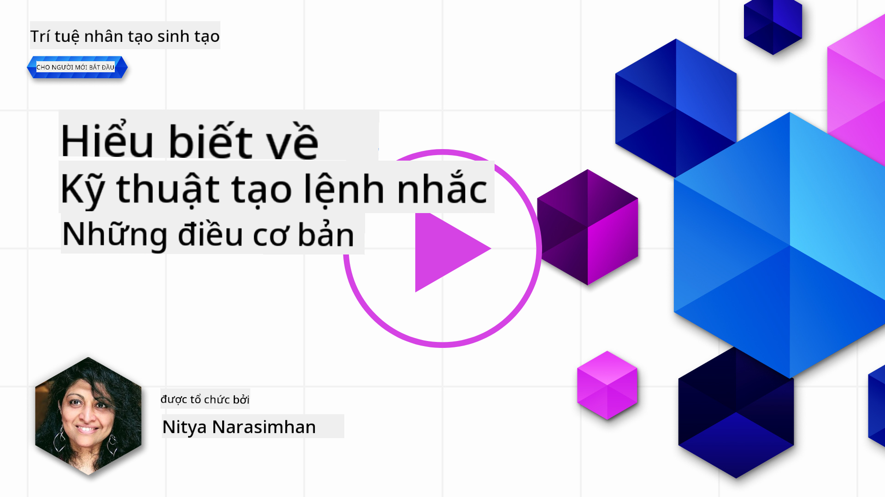
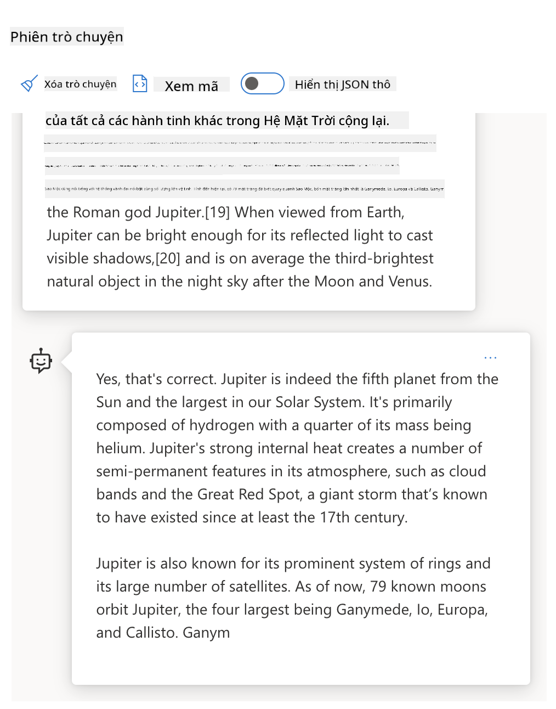
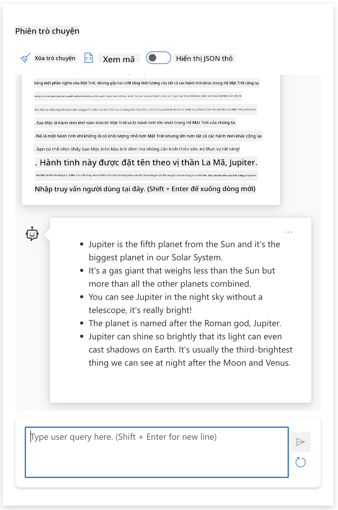
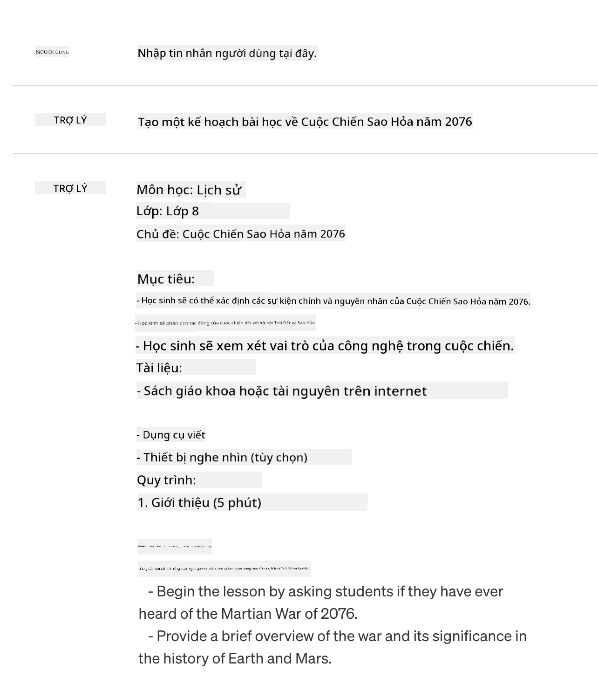
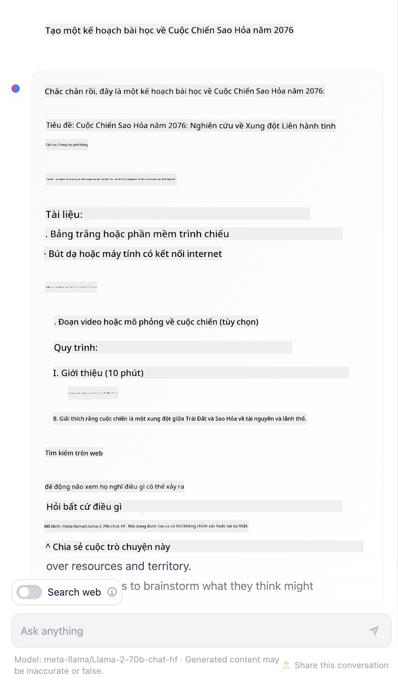

<!--
CO_OP_TRANSLATOR_METADATA:
{
  "original_hash": "dcbaaae026cb50fee071e690685b5843",
  "translation_date": "2025-08-26T18:10:24+00:00",
  "source_file": "04-prompt-engineering-fundamentals/README.md",
  "language_code": "vi"
}
-->
# Kiến Thức Cơ Bản Về Kỹ Thuật Viết Prompt

[](https://aka.ms/gen-ai-lesson4-gh?WT.mc_id=academic-105485-koreyst)

## Giới Thiệu
Chủ đề này sẽ đề cập đến các khái niệm và kỹ thuật quan trọng để tạo ra các prompt hiệu quả cho các mô hình AI sinh ngữ. Cách bạn viết prompt cho một LLM cũng rất quan trọng. Một prompt được xây dựng cẩn thận có thể mang lại phản hồi chất lượng hơn. Nhưng chính xác thì các thuật ngữ như _prompt_ và _kỹ thuật viết prompt_ nghĩa là gì? Và làm thế nào để cải thiện _dữ liệu đầu vào_ mà bạn gửi cho LLM? Đây là những câu hỏi mà chúng ta sẽ cùng tìm hiểu trong chương này và chương tiếp theo.

_AI sinh ngữ_ có khả năng tạo ra nội dung mới (ví dụ: văn bản, hình ảnh, âm thanh, mã nguồn, v.v.) dựa trên yêu cầu của người dùng. Điều này được thực hiện nhờ các _Mô hình Ngôn ngữ Lớn_ như dòng GPT ("Generative Pre-trained Transformer") của OpenAI, được huấn luyện để sử dụng ngôn ngữ tự nhiên và mã nguồn.

Người dùng hiện có thể tương tác với các mô hình này thông qua các hình thức quen thuộc như trò chuyện, mà không cần kiến thức kỹ thuật hay đào tạo chuyên sâu. Các mô hình này dựa trên _prompt_ - người dùng gửi một đoạn văn bản (prompt) và nhận lại phản hồi từ AI (completion). Họ có thể "trò chuyện với AI" nhiều lượt, liên tục điều chỉnh prompt cho đến khi phản hồi phù hợp với mong đợi.

"Prompt" giờ đây trở thành _giao diện lập trình_ chính cho các ứng dụng AI sinh ngữ, hướng dẫn mô hình thực hiện nhiệm vụ và ảnh hưởng đến chất lượng phản hồi. "Kỹ thuật viết prompt" là một lĩnh vực đang phát triển nhanh, tập trung vào _thiết kế và tối ưu hóa_ prompt để mang lại phản hồi nhất quán và chất lượng ở quy mô lớn.

## Mục Tiêu Học Tập

Trong bài học này, chúng ta sẽ tìm hiểu kỹ thuật viết prompt là gì, tại sao nó quan trọng, và làm thế nào để xây dựng các prompt hiệu quả hơn cho một mô hình và mục tiêu ứng dụng cụ thể. Chúng ta sẽ nắm được các khái niệm cốt lõi và các thực tiễn tốt nhất cho kỹ thuật viết prompt - đồng thời làm quen với môi trường "sandbox" Jupyter Notebooks tương tác, nơi bạn có thể quan sát các khái niệm này được áp dụng vào ví dụ thực tế.

Kết thúc bài học này, bạn sẽ có thể:

1. Giải thích kỹ thuật viết prompt là gì và tại sao nó quan trọng.
2. Mô tả các thành phần của một prompt và cách sử dụng chúng.
3. Tìm hiểu các thực tiễn và kỹ thuật tốt nhất cho kỹ thuật viết prompt.
4. Áp dụng các kỹ thuật đã học vào ví dụ thực tế, sử dụng endpoint của OpenAI.

## Thuật Ngữ Chính

Kỹ thuật viết prompt: Thực hành thiết kế và tinh chỉnh đầu vào để hướng dẫn mô hình AI tạo ra kết quả mong muốn.
Tokenization: Quá trình chuyển đổi văn bản thành các đơn vị nhỏ hơn, gọi là token, để mô hình có thể hiểu và xử lý.
Instruction-Tuned LLMs: Các Mô hình Ngôn ngữ Lớn (LLMs) được tinh chỉnh với các hướng dẫn cụ thể nhằm nâng cao độ chính xác và phù hợp của phản hồi.

## Môi Trường Thực Hành

Kỹ thuật viết prompt hiện tại vẫn là một nghệ thuật nhiều hơn là khoa học. Cách tốt nhất để nâng cao trực giác về nó là _luyện tập nhiều hơn_ và áp dụng phương pháp thử-sai, kết hợp kiến thức chuyên môn về lĩnh vực ứng dụng với các kỹ thuật khuyến nghị và tối ưu hóa theo từng mô hình.

Jupyter Notebook đi kèm với bài học này cung cấp một môi trường _sandbox_ để bạn thử nghiệm những gì đã học - vừa học vừa thực hành hoặc tham gia thử thách mã ở cuối bài. Để thực hiện các bài tập, bạn cần:

1. **Khóa API Azure OpenAI** - endpoint dịch vụ cho một LLM đã triển khai.
2. **Môi trường Python** - để chạy Notebook.
3. **Biến môi trường cục bộ** - _hoàn thành các bước [SETUP](./../00-course-setup/02-setup-local.md?WT.mc_id=academic-105485-koreyst) ngay bây giờ để sẵn sàng_.

Notebook có sẵn các bài tập _khởi động_ - nhưng bạn được khuyến khích bổ sung thêm các phần _Markdown_ (mô tả) và _Code_ (yêu cầu prompt) của riêng mình để thử nhiều ví dụ hoặc ý tưởng hơn - và xây dựng trực giác về thiết kế prompt.

## Hướng Dẫn Minh Họa

Muốn có cái nhìn tổng quan về nội dung bài học trước khi bắt đầu? Hãy xem hướng dẫn minh họa này, giúp bạn hình dung các chủ đề chính và những điều cần lưu ý ở mỗi phần. Lộ trình bài học sẽ dẫn bạn từ việc hiểu các khái niệm và thách thức cốt lõi đến cách giải quyết chúng bằng các kỹ thuật và thực tiễn tốt nhất về kỹ thuật viết prompt. Lưu ý rằng phần "Kỹ thuật nâng cao" trong hướng dẫn này sẽ được đề cập ở chương _tiếp theo_ của chương trình.


## Startup Của Chúng Ta

Bây giờ, hãy nói về việc _chủ đề này_ liên quan như thế nào đến sứ mệnh startup của chúng ta là [mang đổi mới AI vào giáo dục](https://educationblog.microsoft.com/2023/06/collaborating-to-bring-ai-innovation-to-education?WT.mc_id=academic-105485-koreyst). Chúng ta muốn xây dựng các ứng dụng học tập cá nhân hóa dựa trên AI - vậy hãy thử nghĩ xem những người dùng khác nhau của ứng dụng sẽ "thiết kế" prompt như thế nào:

- **Quản trị viên** có thể yêu cầu AI _phân tích dữ liệu chương trình học để xác định các lỗ hổng trong nội dung_. AI có thể tóm tắt kết quả hoặc trực quan hóa bằng mã nguồn.
- **Giáo viên** có thể yêu cầu AI _tạo kế hoạch bài giảng cho một đối tượng và chủ đề cụ thể_. AI có thể xây dựng kế hoạch cá nhân hóa theo định dạng chỉ định.
- **Học sinh** có thể yêu cầu AI _hướng dẫn họ về một môn học khó_. AI có thể hướng dẫn học sinh với bài học, gợi ý & ví dụ phù hợp với trình độ của họ.

Đó chỉ là phần nổi của tảng băng. Hãy khám phá [Prompts For Education](https://github.com/microsoft/prompts-for-edu/tree/main?WT.mc_id=academic-105485-koreyst) - thư viện prompt mã nguồn mở được tuyển chọn bởi các chuyên gia giáo dục - để thấy được nhiều khả năng hơn nữa! _Hãy thử chạy một số prompt đó trong sandbox hoặc sử dụng OpenAI Playground để xem kết quả!_

<!--
LESSON TEMPLATE:
This unit should cover core concept #1.
Reinforce the concept with examples and references.

CONCEPT #1:
Prompt Engineering.
Define it and explain why it is needed.
-->

## Kỹ Thuật Viết Prompt Là Gì?

Chúng ta bắt đầu bài học này bằng cách định nghĩa **Kỹ thuật viết prompt** là quá trình _thiết kế và tối ưu hóa_ đầu vào văn bản (prompt) để tạo ra phản hồi (completion) nhất quán và chất lượng cho một mục tiêu ứng dụng và mô hình cụ thể. Có thể xem đây là một quy trình gồm 2 bước:

- _thiết kế_ prompt ban đầu cho một mô hình và mục tiêu cụ thể
- _tinh chỉnh_ prompt nhiều lần để cải thiện chất lượng phản hồi

Đây là một quá trình thử-sai đòi hỏi trực giác và nỗ lực của người dùng để đạt kết quả tối ưu. Vậy tại sao nó lại quan trọng? Để trả lời, trước tiên chúng ta cần hiểu ba khái niệm:

- _Tokenization_ = cách mô hình "nhìn thấy" prompt
- _Base LLMs_ = cách mô hình nền tảng "xử lý" prompt
- _Instruction-Tuned LLMs_ = cách mô hình có thể "nhìn thấy" các "nhiệm vụ"

### Tokenization

Một LLM nhìn prompt như một _chuỗi các token_ mà mỗi mô hình (hoặc phiên bản mô hình) có thể tách token cùng một prompt theo cách khác nhau. Vì LLM được huấn luyện trên các token (không phải văn bản thô), cách prompt được tách token sẽ ảnh hưởng trực tiếp đến chất lượng phản hồi được tạo ra.

Để hiểu rõ hơn về cách tokenization hoạt động, hãy thử các công cụ như [OpenAI Tokenizer](https://platform.openai.com/tokenizer?WT.mc_id=academic-105485-koreyst) dưới đây. Dán prompt của bạn vào - và xem nó được chuyển thành các token như thế nào, chú ý cách các ký tự khoảng trắng và dấu câu được xử lý. Lưu ý ví dụ này sử dụng một LLM cũ hơn (GPT-3) - nên thử với mô hình mới hơn có thể cho kết quả khác.


### Khái Niệm: Mô Hình Nền Tảng

Sau khi prompt được tách token, chức năng chính của ["Base LLM"](https://blog.gopenai.com/an-introduction-to-base-and-instruction-tuned-large-language-models-8de102c785a6?WT.mc_id=academic-105485-koreyst) (hay mô hình nền tảng) là dự đoán token tiếp theo trong chuỗi đó. Vì LLM được huấn luyện trên tập dữ liệu văn bản khổng lồ, chúng có khả năng nhận biết mối quan hệ thống kê giữa các token và có thể dự đoán với độ tin cậy nhất định. Lưu ý rằng chúng không hiểu _ý nghĩa_ của từ trong prompt hay token; chúng chỉ nhận ra mẫu và "hoàn thành" bằng dự đoán tiếp theo. Chúng có thể tiếp tục dự đoán chuỗi cho đến khi bị dừng bởi người dùng hoặc điều kiện định sẵn.

Muốn xem cách hoàn thành dựa trên prompt hoạt động? Hãy nhập prompt trên vào [_Chat Playground_](https://oai.azure.com/playground?WT.mc_id=academic-105485-koreyst) của Azure OpenAI Studio với thiết lập mặc định. Hệ thống được cấu hình để coi prompt là yêu cầu thông tin - nên bạn sẽ thấy một completion phù hợp với ngữ cảnh này.

Nhưng nếu người dùng muốn thấy một kết quả cụ thể đáp ứng tiêu chí hoặc mục tiêu nhiệm vụ thì sao? Đây là lúc các LLM _instruction-tuned_ xuất hiện.



### Khái Niệm: Instruction Tuned LLMs

Một [Instruction Tuned LLM](https://blog.gopenai.com/an-introduction-to-base-and-instruction-tuned-large-language-models-8de102c785a6?WT.mc_id=academic-105485-koreyst) bắt đầu từ mô hình nền tảng và được tinh chỉnh thêm với các ví dụ hoặc cặp đầu vào/đầu ra (ví dụ: các "tin nhắn" nhiều lượt) có thể chứa hướng dẫn rõ ràng - và phản hồi từ AI sẽ cố gắng làm theo hướng dẫn đó.

Điều này sử dụng các kỹ thuật như Học tăng cường với phản hồi của con người (RLHF) để huấn luyện mô hình _làm theo hướng dẫn_ và _học từ phản hồi_, giúp tạo ra phản hồi phù hợp hơn với ứng dụng thực tế và mục tiêu của người dùng.

Hãy thử ngay - quay lại prompt ở trên, nhưng lần này thay đổi _system message_ để cung cấp hướng dẫn sau làm ngữ cảnh:

> _Tóm tắt nội dung bạn nhận được cho học sinh lớp 2. Giữ kết quả trong một đoạn văn với 3-5 gạch đầu dòng._

Bạn thấy kết quả đã được điều chỉnh để phù hợp với mục tiêu và định dạng mong muốn chưa? Giáo viên giờ đây có thể sử dụng trực tiếp phản hồi này trong slide cho lớp học đó.



## Tại Sao Cần Kỹ Thuật Viết Prompt?

Giờ chúng ta đã biết prompt được LLM xử lý như thế nào, hãy bàn về _lý do_ cần kỹ thuật viết prompt. Nguyên nhân nằm ở chỗ các LLM hiện tại có nhiều thách thức khiến việc tạo ra _completion đáng tin cậy và nhất quán_ trở nên khó khăn nếu không đầu tư vào việc xây dựng và tối ưu prompt. Ví dụ:

1. **Phản hồi của mô hình có tính ngẫu nhiên.** _Cùng một prompt_ có thể tạo ra các phản hồi khác nhau với các mô hình hoặc phiên bản mô hình khác nhau. Thậm chí với _cùng một mô hình_ ở các thời điểm khác nhau cũng có thể cho kết quả khác. _Kỹ thuật viết prompt có thể giúp giảm thiểu các biến thể này bằng cách đặt ra các giới hạn rõ ràng hơn_.

1. **Mô hình có thể bịa đặt thông tin.** Mô hình được huấn luyện với tập dữ liệu _lớn nhưng hữu hạn_, nghĩa là chúng thiếu kiến thức về các khái niệm ngoài phạm vi huấn luyện. Do đó, chúng có thể tạo ra completion không chính xác, tưởng tượng hoặc mâu thuẫn với thực tế. _Kỹ thuật viết prompt giúp người dùng nhận diện và giảm thiểu các trường hợp bịa đặt, ví dụ: yêu cầu AI trích dẫn nguồn hoặc giải thích lý do_.

1. **Khả năng của mô hình sẽ khác nhau.** Các mô hình mới hơn hoặc thế hệ mới sẽ có nhiều khả năng hơn nhưng cũng có những đặc điểm riêng và đánh đổi về chi phí & độ phức tạp. _Kỹ thuật viết prompt giúp xây dựng các thực tiễn và quy trình tốt nhất để trừu tượng hóa sự khác biệt và thích ứng với yêu cầu riêng của từng mô hình một cách linh hoạt, quy mô lớn_.

Hãy thử quan sát điều này trong OpenAI hoặc Azure OpenAI Playground:

- Sử dụng cùng một prompt với các triển khai LLM khác nhau (ví dụ, OpenAI, Azure OpenAI, Hugging Face) - bạn có thấy sự khác biệt không?
- Sử dụng cùng một prompt nhiều lần với _cùng một_ triển khai LLM (ví dụ, Azure OpenAI playground) - các kết quả khác nhau như thế nào?

### Ví Dụ Về Bịa Đặt

Trong khóa học này, chúng ta sử dụng thuật ngữ **"bịa đặt"** để chỉ hiện tượng LLM đôi khi tạo ra thông tin sai sự thật do giới hạn trong quá trình huấn luyện hoặc các ràng buộc khác. Bạn cũng có thể nghe thấy thuật ngữ _"ảo giác"_ trong các bài báo hoặc nghiên cứu. Tuy nhiên, chúng tôi khuyến nghị mạnh mẽ sử dụng từ _"bịa đặt"_ để tránh nhân hóa hành vi này bằng cách gán cho máy móc một đặc điểm giống con người. Điều này cũng phù hợp với [hướng dẫn AI có trách nhiệm](https://www.microsoft.com/ai/responsible-ai?WT.mc_id=academic-105485-koreyst) về mặt thuật ngữ, loại bỏ các từ có thể bị coi là xúc phạm hoặc không bao hàm trong một số ngữ cảnh.

Muốn hiểu rõ hơn về cách bịa đặt hoạt động? Hãy nghĩ đến một prompt yêu cầu AI tạo nội dung về một chủ đề không tồn tại (đảm bảo không có trong tập huấn luyện). Ví dụ - tôi đã thử prompt sau:
> **Yêu cầu:** tạo một kế hoạch bài học về Cuộc Chiến Sao Hỏa năm 2076.

# Kế hoạch bài học: Cuộc Chiến Sao Hỏa năm 2076

## Mục tiêu bài học

- Hiểu được nguyên nhân, diễn biến và hậu quả của Cuộc Chiến Sao Hỏa năm 2076.
- Phân tích vai trò của các bên tham gia trong cuộc chiến.
- Thảo luận về tác động của cuộc chiến đối với xã hội và công nghệ.

## Giới thiệu

Cuộc Chiến Sao Hỏa năm 2076 là một sự kiện lịch sử quan trọng, đánh dấu bước ngoặt trong quan hệ giữa Trái Đất và các thuộc địa trên Sao Hỏa. Cuộc chiến này không chỉ ảnh hưởng đến chính trị mà còn thúc đẩy sự phát triển vượt bậc về công nghệ.

## Nội dung bài học

### 1. Bối cảnh lịch sử

- Sự phát triển của các thuộc địa trên Sao Hỏa từ năm 2050 đến 2076.
- Những căng thẳng giữa chính phủ Trái Đất và các cộng đồng Sao Hỏa.
- Các yếu tố dẫn đến xung đột: tài nguyên, quyền tự trị, và công nghệ.

### 2. Diễn biến chính của cuộc chiến

- Sự kiện khởi đầu: @@INLINE_CODE_1@@
- Các trận chiến lớn: @@INLINE_CODE_2@@, @@INLINE_CODE_3@@
- Vai trò của các lực lượng: quân đội Trái Đất, lực lượng Sao Hỏa, các nhóm dân sự.

### 3. Hậu quả và tác động

- Thiệt hại về người và tài sản.
- Thay đổi về chính trị: sự ra đời của Liên minh Sao Hỏa.
- Ảnh hưởng đến công nghệ: phát triển vũ khí, hệ thống phòng thủ, và các giải pháp hòa bình.

## Hoạt động lớp học

- Thảo luận nhóm: Phân tích nguyên nhân sâu xa của cuộc chiến.
- Đóng vai: Học sinh nhập vai các bên tham gia để tranh luận về giải pháp hòa bình.
- Nghiên cứu tài liệu: Tìm hiểu các nguồn thông tin về cuộc chiến và trình bày kết quả.

## Câu hỏi ôn tập

1. Những nguyên nhân nào dẫn đến Cuộc Chiến Sao Hỏa năm 2076?
2. Các bên tham gia chính trong cuộc chiến là ai?
3. Cuộc chiến đã ảnh hưởng như thế nào đến xã hội và công nghệ?

## Tài liệu tham khảo

- @@INLINE_CODE_4@@
- @@INLINE_CODE_5@@
- @@INLINE_CODE_6@@

## Ghi chú cho giáo viên

- Khuyến khích học sinh đặt câu hỏi và thảo luận về các khía cạnh đạo đức của cuộc chiến.
- Có thể sử dụng các đoạn phim tài liệu hoặc mô phỏng để minh họa diễn biến sự kiện.
Một tìm kiếm trên web cho thấy có những câu chuyện hư cấu (ví dụ: loạt phim truyền hình hoặc sách) về các cuộc chiến trên sao Hỏa - nhưng không có cái nào vào năm 2076. Lý trí thông thường cũng cho chúng ta biết rằng năm 2076 là _trong tương lai_ nên không thể liên quan đến một sự kiện có thật.

Vậy điều gì xảy ra khi chúng ta chạy yêu cầu này với các nhà cung cấp LLM khác nhau?

> **Phản hồi 1**: OpenAI Playground (GPT-35)



> **Phản hồi 2**: Azure OpenAI Playground (GPT-35)


> **Phản hồi 3**: : Hugging Face Chat Playground (LLama-2)



Đúng như dự đoán, mỗi mô hình (hoặc phiên bản mô hình) tạo ra các phản hồi hơi khác nhau nhờ vào tính ngẫu nhiên và sự khác biệt về năng lực của mô hình. Ví dụ, một mô hình hướng đến đối tượng học sinh lớp 8 trong khi mô hình khác lại giả định người dùng là học sinh trung học. Nhưng cả ba mô hình đều tạo ra các phản hồi có thể khiến một người dùng không biết gì tin rằng sự kiện đó là thật.

Các kỹ thuật xây dựng prompt như _metaprompting_ và _cấu hình nhiệt độ_ có thể giúp giảm bớt việc mô hình bịa đặt ở một mức độ nào đó. Các _kiến trúc_ xây dựng prompt mới cũng tích hợp các công cụ và kỹ thuật mới vào luồng prompt một cách liền mạch, nhằm giảm thiểu hoặc hạn chế một số tác động này.

## Nghiên cứu tình huống: GitHub Copilot

Hãy kết thúc phần này bằng cách tìm hiểu cách xây dựng prompt được sử dụng trong các giải pháp thực tế qua một nghiên cứu tình huống: [GitHub Copilot](https://github.com/features/copilot?WT.mc_id=academic-105485-koreyst).

GitHub Copilot là "lập trình viên AI đồng hành" của bạn - nó chuyển đổi các prompt văn bản thành các gợi ý hoàn thiện mã và được tích hợp trực tiếp vào môi trường phát triển của bạn (ví dụ: Visual Studio Code) để mang lại trải nghiệm liền mạch. Như được ghi lại trong loạt blog dưới đây, phiên bản đầu tiên dựa trên mô hình OpenAI Codex - các kỹ sư nhanh chóng nhận ra cần phải tinh chỉnh mô hình và phát triển các kỹ thuật xây dựng prompt tốt hơn để nâng cao chất lượng mã. Vào tháng 7, họ [ra mắt một mô hình AI cải tiến vượt xa Codex](https://github.blog/2023-07-28-smarter-more-efficient-coding-github-copilot-goes-beyond-codex-with-improved-ai-model/?WT.mc_id=academic-105485-koreyst) để đưa ra gợi ý nhanh hơn nữa.

Hãy đọc các bài viết theo thứ tự để theo dõi hành trình học hỏi của họ.

- **Tháng 5/2023** | [GitHub Copilot ngày càng hiểu mã của bạn tốt hơn](https://github.blog/2023-05-17-how-github-copilot-is-getting-better-at-understanding-your-code/?WT.mc_id=academic-105485-koreyst)
- **Tháng 5/2023** | [Bên trong GitHub: Làm việc với các LLM đứng sau GitHub Copilot](https://github.blog/2023-05-17-inside-github-working-with-the-llms-behind-github-copilot/?WT.mc_id=academic-105485-koreyst).
- **Tháng 6/2023** | [Cách viết prompt tốt hơn cho GitHub Copilot](https://github.blog/2023-06-20-how-to-write-better-prompts-for-github-copilot/?WT.mc_id=academic-105485-koreyst).
- **Tháng 7/2023** | [.. GitHub Copilot vượt xa Codex với mô hình AI cải tiến](https://github.blog/2023-07-28-smarter-more-efficient-coding-github-copilot-goes-beyond-codex-with-improved-ai-model/?WT.mc_id=academic-105485-koreyst)
- **Tháng 7/2023** | [Hướng dẫn xây dựng prompt và LLM cho lập trình viên](https://github.blog/2023-07-17-prompt-engineering-guide-generative-ai-llms/?WT.mc_id=academic-105485-koreyst)
- **Tháng 9/2023** | [Cách xây dựng ứng dụng LLM cho doanh nghiệp: Bài học từ GitHub Copilot](https://github.blog/2023-09-06-how-to-build-an-enterprise-llm-application-lessons-from-github-copilot/?WT.mc_id=academic-105485-koreyst)

Bạn cũng có thể xem thêm [blog Kỹ thuật của họ](https://github.blog/category/engineering/?WT.mc_id=academic-105485-koreyst) để đọc thêm các bài như [bài này](https://github.blog/2023-09-27-how-i-used-github-copilot-chat-to-build-a-reactjs-gallery-prototype/?WT.mc_id=academic-105485-koreyst) cho thấy các mô hình và kỹ thuật này được _ứng dụng_ như thế nào trong các sản phẩm thực tế.

---

## Xây dựng Prompt

Chúng ta đã thấy vì sao xây dựng prompt lại quan trọng - giờ hãy cùng tìm hiểu cách các prompt được _xây dựng_ để có thể đánh giá các kỹ thuật khác nhau nhằm thiết kế prompt hiệu quả hơn.

### Prompt cơ bản

Hãy bắt đầu với prompt cơ bản: một đầu vào văn bản gửi đến mô hình mà không có ngữ cảnh nào khác. Đây là một ví dụ - khi chúng ta gửi vài từ đầu tiên của quốc ca Mỹ đến [Completion API của OpenAI](https://platform.openai.com/docs/api-reference/completions?WT.mc_id=academic-105485-koreyst), nó sẽ ngay lập tức _hoàn thành_ phản hồi với các dòng tiếp theo, minh họa cho hành vi dự đoán cơ bản.

| Prompt (Đầu vào)   | Completion (Đầu ra)                                                                                                                        |
| :----------------- | :----------------------------------------------------------------------------------------------------------------------------------------- |
| Oh say can you see | Có vẻ như bạn đang bắt đầu lời bài hát "The Star-Spangled Banner", quốc ca của Hoa Kỳ. Toàn bộ lời bài hát là ... |

### Prompt phức tạp

Bây giờ hãy thêm ngữ cảnh và hướng dẫn vào prompt cơ bản đó. [Chat Completion API](https://learn.microsoft.com/azure/ai-services/openai/how-to/chatgpt?WT.mc_id=academic-105485-koreyst) cho phép chúng ta xây dựng một prompt phức tạp dưới dạng tập hợp các _tin nhắn_ với:

- Các cặp đầu vào/đầu ra phản ánh đầu vào của _người dùng_ và phản hồi của _trợ lý_.
- Tin nhắn hệ thống thiết lập ngữ cảnh cho hành vi hoặc tính cách của trợ lý.

Yêu cầu giờ đây có dạng như dưới đây, trong đó _tokenization_ sẽ trích xuất thông tin liên quan từ ngữ cảnh và cuộc trò chuyện. Việc thay đổi ngữ cảnh hệ thống giờ đây có thể ảnh hưởng lớn đến chất lượng phản hồi, tương tự như đầu vào của người dùng.

```python
response = openai.chat.completions.create(
    model="gpt-3.5-turbo",
    messages=[
        {"role": "system", "content": "You are a helpful assistant."},
        {"role": "user", "content": "Who won the world series in 2020?"},
        {"role": "assistant", "content": "The Los Angeles Dodgers won the World Series in 2020."},
        {"role": "user", "content": "Where was it played?"}
    ]
)
```

### Prompt hướng dẫn

Trong các ví dụ trên, prompt của người dùng là một truy vấn văn bản đơn giản có thể được hiểu là một yêu cầu thông tin. Với prompt _hướng dẫn_, chúng ta có thể sử dụng văn bản đó để chỉ định nhiệm vụ chi tiết hơn, cung cấp chỉ dẫn rõ ràng hơn cho AI. Ví dụ:

| Prompt (Đầu vào)                                                                                                                                                                                                                         | Completion (Đầu ra)                                                                                                        | Loại hướng dẫn      |
| :--------------------------------------------------------------------------------------------------------------------------------------------------------------------------------------------------------------------------------------- | :------------------------------------------------------------------------------------------------------------------------- | :------------------ |
| Viết mô tả về Nội chiến Hoa Kỳ                                                                                                                                                                     | _trả về một đoạn văn đơn giản_                                                                                             | Đơn giản            |
| Viết mô tả về Nội chiến Hoa Kỳ. Cung cấp các mốc thời gian và sự kiện chính, đồng thời mô tả ý nghĩa của chúng                                                                                     | _trả về một đoạn văn kèm danh sách các mốc sự kiện chính với mô tả_                                                        | Phức tạp            |
| Viết mô tả về Nội chiến Hoa Kỳ trong 1 đoạn văn. Cung cấp 3 gạch đầu dòng với các mốc thời gian quan trọng và ý nghĩa của chúng. Thêm 3 gạch đầu dòng nữa với các nhân vật lịch sử chủ chốt và đóng góp của họ. Trả về kết quả dưới dạng tệp JSON | _trả về thông tin chi tiết hơn trong một hộp văn bản, được định dạng JSON mà bạn có thể sao chép-dán vào tệp và kiểm tra_  | Phức tạp. Có định dạng. |

## Nội dung chính

Trong các ví dụ trên, prompt vẫn còn khá mở, cho phép LLM tự quyết định phần nào trong tập dữ liệu đã huấn luyện là phù hợp. Với mẫu thiết kế _nội dung chính_, văn bản đầu vào được chia thành hai phần:

- một hướng dẫn (hành động)
- nội dung liên quan (ảnh hưởng đến hành động)

Ví dụ dưới đây, hướng dẫn là "tóm tắt nội dung này trong 2 câu".

| Prompt (Đầu vào)                                                                                                                                                                                                                                                                                                                                                                                                                                                                                                                                                                                                                                                                                      | Completion (Đầu ra)                                                                                                                                                                                                                                                                             |
| :-------------------------------------------------------------------------------------------------------------------------------------------------------------------------------------------------------------------------------------------------------------------------------------------------------------------------------------------------------------------------------------------------------------------------------------------------------------------------------------------------------------------------------------------------------------------------------------------------------------------------------------------------------------------------------------------------- | :---------------------------------------------------------------------------------------------------------------------------------------------------------------------------------------------------------------------------------------------------------------------------------------------- |
| Jupiter là hành tinh thứ năm tính từ Mặt Trời và là hành tinh lớn nhất trong Hệ Mặt Trời. Đây là một hành tinh khí khổng lồ với khối lượng bằng một phần nghìn Mặt Trời, nhưng lớn gấp hai rưỡi tổng khối lượng của tất cả các hành tinh khác cộng lại. Jupiter là một trong những vật thể sáng nhất có thể nhìn thấy bằng mắt thường trên bầu trời đêm, và đã được các nền văn minh cổ đại biết đến từ trước khi có lịch sử ghi chép. Nó được đặt tên theo thần Jupiter của La Mã.[19] Khi nhìn từ Trái Đất, Jupiter có thể đủ sáng để ánh sáng phản chiếu của nó tạo ra bóng nhìn thấy được,[20] và trung bình là vật thể tự nhiên sáng thứ ba trên bầu trời đêm sau Mặt Trăng và Sao Kim. <br/> **Tóm tắt nội dung này trong 2 câu ngắn** | Jupiter, hành tinh thứ năm tính từ Mặt Trời, là hành tinh lớn nhất trong Hệ Mặt Trời và nổi tiếng là một trong những vật thể sáng nhất trên bầu trời đêm. Được đặt tên theo thần Jupiter của La Mã, đây là hành tinh khí khổng lồ có khối lượng lớn gấp hai rưỡi tổng các hành tinh còn lại cộng lại. |

Phần nội dung chính có thể được sử dụng theo nhiều cách để tạo ra hướng dẫn hiệu quả hơn:

- **Ví dụ** - thay vì chỉ nói cho mô hình biết phải làm gì bằng hướng dẫn rõ ràng, hãy đưa ra các ví dụ về việc cần làm và để mô hình tự suy ra quy luật.
- **Gợi ý** - sau hướng dẫn, thêm một "gợi ý" để định hướng phần hoàn thành, giúp mô hình tạo ra phản hồi phù hợp hơn.
- **Mẫu** - đây là các 'công thức' prompt lặp lại với các chỗ trống (biến) có thể tùy chỉnh bằng dữ liệu cho từng trường hợp cụ thể.

Hãy cùng khám phá các cách này trong thực tế.

### Sử dụng ví dụ

Đây là cách bạn dùng phần nội dung chính để "cung cấp cho mô hình" một số ví dụ về đầu ra mong muốn cho một hướng dẫn, và để mô hình tự suy ra quy luật cho đầu ra đó. Dựa vào số lượng ví dụ, ta có zero-shot prompting, one-shot prompting, few-shot prompting, v.v.

Prompt lúc này gồm ba thành phần:

- Mô tả nhiệm vụ
- Một vài ví dụ về đầu ra mong muốn
- Phần bắt đầu của một ví dụ mới (trở thành mô tả nhiệm vụ ngầm định)

| Loại học máy | Prompt (Đầu vào)                                                                                                                                        | Completion (Đầu ra)         |
| :----------- | :------------------------------------------------------------------------------------------------------------------------------------------------------ | :-------------------------- |
| Zero-shot    | "The Sun is Shining". Translate to Spanish                                                                                                              | "El Sol está brillando".    |
| One-shot     | "The Sun is Shining" => ""El Sol está brillando". <br> "It's a Cold and Windy Day" =>                                                                   | "Es un día frío y ventoso". |
| Few-shot     | The player ran the bases => Baseball <br/> The player hit an ace => Tennis <br/> The player hit a six => Cricket <br/> The player made a slam-dunk =>  | Basketball                  |
|              |                                                                                                                                                         |                             |

Hãy chú ý rằng chúng ta phải cung cấp hướng dẫn rõ ràng ("Translate to Spanish") trong zero-shot prompting, nhưng nó được mô hình tự suy ra ở ví dụ one-shot. Ví dụ few-shot cho thấy việc thêm nhiều ví dụ giúp mô hình suy luận chính xác hơn mà không cần thêm hướng dẫn.

### Gợi ý trong prompt

Một kỹ thuật khác khi sử dụng nội dung chính là cung cấp _gợi ý_ thay vì ví dụ. Trong trường hợp này, chúng ta "định hướng" cho mô hình bằng cách _bắt đầu_ với một đoạn phản ánh định dạng phản hồi mong muốn. Mô hình sau đó sẽ "bắt nhịp" và tiếp tục theo hướng đó.

| Số lượng gợi ý | Prompt (Đầu vào)                                                                                                                                                                                                                                                                                                                                                                                                                                               | Completion (Đầu ra)                                                                                                                                                                                                                                                                                       |
| :------------- | :----------------------------------------------------------------------------------------------------------------------------------------------------------------------------------------------------------------------------------------------------------------------------------------------------------------------------------------------------------------------------------------------------------------------------------------------------------- | :-------------------------------------------------------------------------------------------------------------------------------------------------------------------------------------------------------------------------------------------------------------------------------------------------------- |
| 0              | Jupiter là hành tinh thứ năm tính từ Mặt Trời và là hành tinh lớn nhất trong Hệ Mặt Trời. Đây là một hành tinh khí khổng lồ với khối lượng bằng một phần nghìn Mặt Trời, nhưng lớn gấp hai rưỡi tổng khối lượng của tất cả các hành tinh khác cộng lại. Jupiter là một trong những vật thể sáng nhất có thể nhìn thấy bằng mắt thường trên bầu trời đêm, và đã được các nền văn minh cổ đại biết đến từ trước khi có lịch sử ghi chép.

**Tóm tắt nội dung này**                                       | Sao Mộc là hành tinh lớn nhất trong Hệ Mặt Trời và là hành tinh thứ năm tính từ Mặt Trời. Đây là một hành tinh khí khổng lồ với khối lượng bằng 1/1000 khối lượng của Mặt Trời, nhưng nặng hơn tất cả các hành tinh còn lại cộng lại. Các nền văn minh cổ đại đã biết đến Sao Mộc từ rất lâu, và nó dễ dàng nhìn thấy trên bầu trời đêm. |
| 1              | Sao Mộc là hành tinh thứ năm tính từ Mặt Trời và là hành tinh lớn nhất trong Hệ Mặt Trời. Đây là một hành tinh khí khổng lồ với khối lượng bằng một phần nghìn của Mặt Trời, nhưng lại nặng gấp hai lần rưỡi tổng khối lượng của tất cả các hành tinh còn lại trong Hệ Mặt Trời. Sao Mộc là một trong những vật thể sáng nhất có thể nhìn thấy bằng mắt thường trên bầu trời đêm, và đã được các nền văn minh cổ đại biết đến từ trước khi có lịch sử ghi chép. <br/>**Tóm tắt nội dung này** <br/> Điều chúng ta học được là Sao Mộc | là hành tinh thứ năm tính từ Mặt Trời và là hành tinh lớn nhất trong Hệ Mặt Trời. Đây là một hành tinh khí khổng lồ với khối lượng bằng một phần nghìn của Mặt Trời, nhưng lại nặng gấp hai lần rưỡi tổng khối lượng của tất cả các hành tinh còn lại. Nó dễ dàng nhìn thấy bằng mắt thường và đã được biết đến từ thời cổ đại.                        |
| 2              | Sao Mộc là hành tinh thứ năm tính từ Mặt Trời và là hành tinh lớn nhất trong Hệ Mặt Trời. Đây là một hành tinh khí khổng lồ với khối lượng bằng một phần nghìn của Mặt Trời, nhưng lại nặng gấp hai lần rưỡi tổng khối lượng của tất cả các hành tinh còn lại trong Hệ Mặt Trời. Sao Mộc là một trong những vật thể sáng nhất có thể nhìn thấy bằng mắt thường trên bầu trời đêm, và đã được các nền văn minh cổ đại biết đến từ trước khi có lịch sử ghi chép. <br/>**Tóm tắt nội dung này** <br/> Top 3 điều chúng ta học được:         | 1. Sao Mộc là hành tinh thứ năm tính từ Mặt Trời và là hành tinh lớn nhất trong Hệ Mặt Trời. <br/> 2. Đây là một hành tinh khí khổng lồ với khối lượng bằng một phần nghìn của Mặt Trời...<br/> 3. Sao Mộc đã được nhìn thấy bằng mắt thường từ thời cổ đại ...                                                                       |
|                |                                                                                                                                                                                                                                                                                                                                                                                                                                                              |                                                                                                                                                                                                                                                                                                           |

### Mẫu Prompt

Một mẫu prompt là _công thức định sẵn cho một prompt_ có thể được lưu trữ và tái sử dụng khi cần, giúp tạo ra trải nghiệm người dùng nhất quán ở quy mô lớn. Ở dạng đơn giản nhất, nó chỉ là tập hợp các ví dụ về prompt như [ví dụ này từ OpenAI](https://platform.openai.com/examples?WT.mc_id=academic-105485-koreyst) cung cấp cả thành phần prompt tương tác (tin nhắn người dùng và hệ thống) và định dạng yêu cầu qua API - để hỗ trợ việc tái sử dụng.

Ở dạng phức tạp hơn như [ví dụ này từ LangChain](https://python.langchain.com/docs/concepts/prompt_templates/?WT.mc_id=academic-105485-koreyst), nó chứa các _placeholder_ có thể được thay thế bằng dữ liệu từ nhiều nguồn khác nhau (đầu vào người dùng, ngữ cảnh hệ thống, nguồn dữ liệu bên ngoài, v.v.) để tạo prompt một cách động. Điều này cho phép chúng ta xây dựng thư viện các prompt có thể tái sử dụng, dùng để tạo ra trải nghiệm người dùng nhất quán **bằng lập trình** ở quy mô lớn.

Cuối cùng, giá trị thực sự của các mẫu prompt nằm ở khả năng tạo và xuất bản _thư viện prompt_ cho các lĩnh vực ứng dụng chuyên biệt - nơi mẫu prompt được _tối ưu hóa_ để phản ánh ngữ cảnh hoặc ví dụ đặc thù của ứng dụng, giúp phản hồi phù hợp và chính xác hơn với nhóm người dùng mục tiêu. Kho [Prompts For Edu](https://github.com/microsoft/prompts-for-edu?WT.mc_id=academic-105485-koreyst) là một ví dụ tuyệt vời cho cách tiếp cận này, tập hợp thư viện prompt cho lĩnh vực giáo dục với trọng tâm vào các mục tiêu như lập kế hoạch bài học, thiết kế chương trình học, hỗ trợ học sinh, v.v.

## Nội dung hỗ trợ

Nếu chúng ta coi việc xây dựng prompt gồm có phần hướng dẫn (nhiệm vụ) và phần mục tiêu (nội dung chính), thì _nội dung phụ_ giống như bối cảnh bổ sung mà chúng ta cung cấp để **ảnh hưởng đến kết quả đầu ra theo một cách nào đó**. Đó có thể là các tham số điều chỉnh, hướng dẫn định dạng, phân loại chủ đề, v.v. giúp mô hình _tùy chỉnh_ phản hồi cho phù hợp với mục tiêu hoặc kỳ vọng của người dùng.

Ví dụ: Giả sử có một danh mục khóa học với nhiều siêu dữ liệu (tên, mô tả, trình độ, thẻ, giảng viên, v.v.) cho tất cả các khóa học trong chương trình:

- chúng ta có thể định nghĩa một hướng dẫn là "tóm tắt danh mục khóa học cho kỳ Thu 2023"
- chúng ta có thể dùng nội dung chính để cung cấp một vài ví dụ về kết quả mong muốn
- chúng ta có thể dùng nội dung phụ để xác định 5 "thẻ" quan trọng nhất.

Lúc này, mô hình có thể cung cấp bản tóm tắt theo định dạng của các ví dụ - nhưng nếu một kết quả có nhiều thẻ, nó có thể ưu tiên 5 thẻ đã xác định trong nội dung phụ.

---

<!--
MẪU BÀI HỌC:
Phần này nên đề cập đến khái niệm cốt lõi #1.
Củng cố khái niệm bằng ví dụ và tài liệu tham khảo.

KHÁI NIỆM #3:
Kỹ thuật xây dựng prompt.
Một số kỹ thuật cơ bản cho prompt engineering là gì?
Minh họa bằng một số bài tập.
-->

## Thực hành xây dựng prompt

Giờ khi đã biết cách _xây dựng_ prompt, chúng ta có thể bắt đầu nghĩ về cách _thiết kế_ chúng để tuân theo các thực hành tốt nhất. Có thể chia thành hai phần - có _tư duy_ đúng và áp dụng _kỹ thuật_ phù hợp.

### Tư duy xây dựng prompt

Prompt Engineering là một quá trình thử - sai, vì vậy hãy ghi nhớ ba yếu tố định hướng lớn:

1. **Hiểu biết về lĩnh vực rất quan trọng.** Độ chính xác và phù hợp của phản hồi phụ thuộc vào _lĩnh vực_ mà ứng dụng hoặc người dùng đó hoạt động. Hãy vận dụng trực giác và chuyên môn của bạn để **tùy chỉnh các kỹ thuật** thêm nữa. Ví dụ, xác định _tính cách đặc thù lĩnh vực_ trong prompt hệ thống, hoặc dùng _mẫu prompt đặc thù lĩnh vực_ trong prompt người dùng. Cung cấp nội dung phụ phản ánh ngữ cảnh đặc thù lĩnh vực, hoặc dùng _gợi ý và ví dụ đặc thù lĩnh vực_ để hướng mô hình theo các mẫu sử dụng quen thuộc.

2. **Hiểu biết về mô hình rất quan trọng.** Chúng ta biết các mô hình có tính ngẫu nhiên. Nhưng các mô hình cũng có thể khác nhau về bộ dữ liệu huấn luyện (kiến thức tiền huấn luyện), các khả năng cung cấp (ví dụ qua API hoặc SDK) và loại nội dung mà chúng được tối ưu hóa (ví dụ, mã nguồn, hình ảnh, văn bản). Hãy hiểu rõ điểm mạnh và hạn chế của mô hình bạn đang dùng, và dùng kiến thức đó để _ưu tiên nhiệm vụ_ hoặc xây dựng _mẫu prompt tùy chỉnh_ phù hợp với khả năng của mô hình.

3. **Lặp lại & kiểm chứng rất quan trọng.** Các mô hình đang phát triển rất nhanh, và các kỹ thuật xây dựng prompt cũng vậy. Là chuyên gia lĩnh vực, bạn có thể có ngữ cảnh hoặc tiêu chí _riêng_ cho ứng dụng của mình, có thể không áp dụng cho cộng đồng rộng hơn. Hãy dùng các công cụ & kỹ thuật prompt engineering để "khởi động" việc xây dựng prompt, sau đó lặp lại và kiểm chứng kết quả bằng trực giác và chuyên môn của bạn. Ghi lại các phát hiện và tạo **cơ sở tri thức** (ví dụ, thư viện prompt) để người khác dùng làm nền tảng cho các lần lặp tiếp theo nhanh hơn.

## Thực hành tốt nhất

Hãy cùng xem các thực hành tốt nhất thường được khuyến nghị bởi [OpenAI](https://help.openai.com/en/articles/6654000-best-practices-for-prompt-engineering-with-openai-api?WT.mc_id=academic-105485-koreyst) và [Azure OpenAI](https://learn.microsoft.com/azure/ai-services/openai/concepts/prompt-engineering#best-practices?WT.mc_id=academic-105485-koreyst).

| Nội dung                              | Lý do                                                                                                                                                                                                                                               |
| :-------------------------------- | :------------------------------------------------------------------------------------------------------------------------------------------------------------------------------------------------------------------------------------------------ |
| Đánh giá các mô hình mới nhất.       | Các thế hệ mô hình mới thường có nhiều tính năng và chất lượng tốt hơn - nhưng cũng có thể tốn kém hơn. Hãy đánh giá tác động rồi quyết định chuyển đổi.                                                                                |
| Tách biệt hướng dẫn & ngữ cảnh   | Kiểm tra xem mô hình/nhà cung cấp của bạn có định nghĩa _kí tự phân tách_ để phân biệt rõ hơn giữa hướng dẫn, nội dung chính và nội dung phụ không. Điều này giúp mô hình gán trọng số chính xác hơn cho các token.                                                         |
| Cụ thể và rõ ràng             | Cung cấp nhiều chi tiết hơn về ngữ cảnh, kết quả mong muốn, độ dài, định dạng, phong cách, v.v. Điều này sẽ cải thiện cả chất lượng lẫn tính nhất quán của phản hồi. Ghi lại các công thức trong mẫu prompt có thể tái sử dụng.                                                          |
| Mô tả chi tiết, dùng ví dụ      | Mô hình có thể phản hồi tốt hơn với cách "trình diễn và giải thích". Bắt đầu với cách `zero-shot` (chỉ đưa hướng dẫn, không có ví dụ), sau đó thử `few-shot` để tinh chỉnh, cung cấp một vài ví dụ về kết quả mong muốn. Dùng phép so sánh. |
| Dùng gợi ý để khởi động phản hồi | Định hướng mô hình đến kết quả mong muốn bằng cách đưa ra một số từ hoặc cụm từ dẫn dắt để nó dùng làm điểm bắt đầu cho phản hồi.                                                                                                               |
| Lặp lại nhiều lần                       | Đôi khi bạn cần lặp lại hướng dẫn cho mô hình. Đưa hướng dẫn trước và sau nội dung chính, dùng cả hướng dẫn và gợi ý, v.v. Lặp lại & kiểm chứng để xem cách nào hiệu quả.                                                         |
| Thứ tự quan trọng                     | Thứ tự trình bày thông tin cho mô hình có thể ảnh hưởng đến kết quả, kể cả trong các ví dụ học tập, do hiệu ứng thiên vị gần nhất. Thử nhiều cách khác nhau để tìm ra cách tốt nhất.                                                               |
| Cho mô hình một “lối thoát”           | Đưa cho mô hình một phản hồi _dự phòng_ nếu nó không thể hoàn thành nhiệm vụ vì lý do nào đó. Điều này giúp giảm khả năng mô hình tạo ra phản hồi sai hoặc bịa đặt.                                                         |
|                                   |                                                                                                                                                                                                                                                   |

Như mọi thực hành tốt nhất, hãy nhớ rằng _kết quả có thể khác nhau_ tùy vào mô hình, nhiệm vụ và lĩnh vực. Hãy dùng các gợi ý này làm điểm khởi đầu, và lặp lại để tìm ra cách phù hợp nhất với bạn. Luôn đánh giá lại quy trình xây dựng prompt khi có mô hình và công cụ mới, tập trung vào khả năng mở rộng quy trình và chất lượng phản hồi.

<!--
MẪU BÀI HỌC:
Phần này nên có thử thách về code nếu phù hợp

THỬ THÁCH:
Liên kết đến một Jupyter Notebook chỉ có chú thích trong phần hướng dẫn (phần code để trống).

GIẢI PHÁP:
Liên kết đến bản sao của Notebook đó với các prompt đã được điền và chạy, cho thấy một ví dụ kết quả.
-->

## Bài tập

Chúc mừng bạn đã hoàn thành bài học! Đã đến lúc áp dụng một số khái niệm và kỹ thuật vừa học vào các ví dụ thực tế!

Trong bài tập này, chúng ta sẽ sử dụng một Jupyter Notebook với các bài tập bạn có thể hoàn thành tương tác. Bạn cũng có thể mở rộng Notebook với các ô Markdown và Code của riêng mình để khám phá ý tưởng và kỹ thuật.

### Để bắt đầu, hãy fork repo, sau đó

- (Khuyến nghị) Khởi động GitHub Codespaces
- (Hoặc) Clone repo về thiết bị cá nhân và sử dụng với Docker Desktop
- (Hoặc) Mở Notebook với môi trường Notebook bạn thích.

### Tiếp theo, cấu hình biến môi trường

- Sao chép file `.env.copy` ở thư mục gốc repo thành `.env` và điền giá trị cho `AZURE_OPENAI_API_KEY`, `AZURE_OPENAI_ENDPOINT` và `AZURE_OPENAI_DEPLOYMENT`. Quay lại [phần Learning Sandbox](../../../04-prompt-engineering-fundamentals/04-prompt-engineering-fundamentals) để biết cách làm.

### Tiếp theo, mở Jupyter Notebook

- Chọn kernel runtime. Nếu dùng lựa chọn 1 hoặc 2, chỉ cần chọn kernel Python 3.10.x mặc định do dev container cung cấp.

Bạn đã sẵn sàng để chạy các bài tập. Lưu ý rằng không có _đáp án đúng hay sai_ ở đây - chỉ là thử nghiệm các lựa chọn và xây dựng trực giác cho những gì hiệu quả với từng mô hình và lĩnh vực ứng dụng.

_Vì lý do này, bài học này không có phần Giải pháp Code. Thay vào đó, Notebook sẽ có các ô Markdown với tiêu đề "Giải pháp của tôi:" để bạn tham khảo một ví dụ kết quả._

 <!--
MẪU BÀI HỌC:
Kết thúc phần này bằng tóm tắt và tài nguyên tự học.
-->

## Kiểm tra kiến thức

Prompt nào sau đây là tốt theo một số thực hành hợp lý?

1. Hiển thị cho tôi hình ảnh một chiếc xe màu đỏ
2. Hiển thị cho tôi hình ảnh một chiếc xe màu đỏ, hãng Volvo, mẫu XC90, đang đỗ bên vách đá lúc hoàng hôn
3. Hiển thị cho tôi hình ảnh một chiếc xe màu đỏ, hãng Volvo, mẫu XC90

A: 2, đây là prompt tốt nhất vì cung cấp chi tiết về "cái gì" và đi vào cụ thể (không chỉ là bất kỳ xe nào mà là hãng và mẫu cụ thể), đồng thời mô tả bối cảnh tổng thể. 3 là lựa chọn tiếp theo vì cũng có nhiều mô tả.

## 🚀 Thử thách

Hãy thử áp dụng kỹ thuật "gợi ý" với prompt: Hoàn thành câu "Hiển thị cho tôi hình ảnh một chiếc xe màu đỏ, hãng Volvo và ". Mô hình phản hồi thế nào, và bạn sẽ cải thiện ra sao?

## Làm tốt lắm! Tiếp tục học nhé

Muốn tìm hiểu thêm về các khái niệm khác của Prompt Engineering? Hãy truy cập [trang học tiếp](https://aka.ms/genai-collection?WT.mc_id=academic-105485-koreyst) để khám phá nhiều tài nguyên hữu ích về chủ đề này.

Chuyển sang Bài học 5, nơi chúng ta sẽ tìm hiểu về [kỹ thuật prompt nâng cao](../05-advanced-prompts/README.md?WT.mc_id=academic-105485-koreyst)!

---

**Tuyên bố miễn trừ trách nhiệm**:  
Tài liệu này đã được dịch bằng dịch vụ dịch thuật AI [Co-op Translator](https://github.com/Azure/co-op-translator). Mặc dù chúng tôi cố gắng đảm bảo độ chính xác, xin lưu ý rằng bản dịch tự động có thể chứa lỗi hoặc không chính xác. Tài liệu gốc bằng ngôn ngữ bản địa nên được coi là nguồn tham khảo chính thức. Đối với các thông tin quan trọng, khuyến nghị sử dụng dịch vụ dịch thuật chuyên nghiệp bởi con người. Chúng tôi không chịu trách nhiệm về bất kỳ sự hiểu lầm hoặc diễn giải sai nào phát sinh từ việc sử dụng bản dịch này.