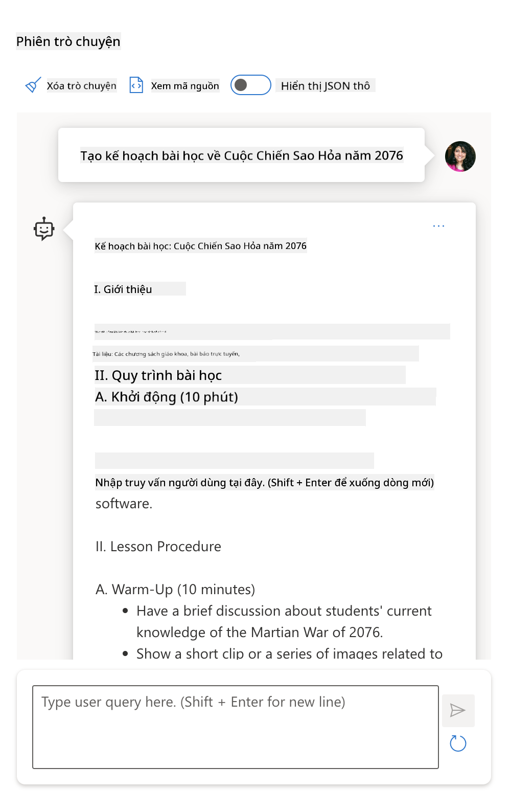

<!--
CO_OP_TRANSLATOR_METADATA:
{
  "original_hash": "a45c318dc6ebc2604f35b8b829f93af2",
  "translation_date": "2025-07-09T10:38:50+00:00",
  "source_file": "04-prompt-engineering-fundamentals/README.md",
  "language_code": "vi"
}
-->
# Các Nguyên Tắc Cơ Bản về Prompt Engineering

[](https://aka.ms/gen-ai-lesson4-gh?WT.mc_id=academic-105485-koreyst)

## Giới Thiệu  
Module này bao gồm các khái niệm và kỹ thuật thiết yếu để tạo ra các prompt hiệu quả trong các mô hình AI sinh tạo. Cách bạn viết prompt cho một LLM cũng rất quan trọng. Một prompt được thiết kế cẩn thận có thể mang lại chất lượng phản hồi tốt hơn. Nhưng chính xác thì các thuật ngữ như _prompt_ và _prompt engineering_ có nghĩa là gì? Và làm thế nào để tôi cải thiện _đầu vào_ prompt mà tôi gửi đến LLM? Đây là những câu hỏi chúng ta sẽ cố gắng trả lời trong chương này và chương tiếp theo.

_Generative AI_ có khả năng tạo ra nội dung mới (ví dụ: văn bản, hình ảnh, âm thanh, mã code, v.v.) dựa trên yêu cầu của người dùng. Nó đạt được điều này nhờ sử dụng _Large Language Models_ như chuỗi GPT ("Generative Pre-trained Transformer") của OpenAI, được huấn luyện để sử dụng ngôn ngữ tự nhiên và mã code.

Người dùng giờ đây có thể tương tác với các mô hình này qua các phương thức quen thuộc như chat, mà không cần kiến thức kỹ thuật hay đào tạo chuyên sâu. Các mô hình này dựa trên _prompt_ — người dùng gửi một đầu vào văn bản (prompt) và nhận lại phản hồi từ AI (completion). Họ có thể "trò chuyện với AI" theo nhiều lượt, liên tục chỉnh sửa prompt cho đến khi phản hồi đáp ứng được kỳ vọng.

"Prompt" giờ đây trở thành _giao diện lập trình chính_ cho các ứng dụng AI sinh tạo, chỉ dẫn cho mô hình phải làm gì và ảnh hưởng đến chất lượng phản hồi trả về. "Prompt Engineering" là một lĩnh vực nghiên cứu phát triển nhanh, tập trung vào _thiết kế và tối ưu hóa_ prompt để mang lại các phản hồi nhất quán và chất lượng ở quy mô lớn.

## Mục Tiêu Học Tập

Trong bài học này, chúng ta sẽ tìm hiểu Prompt Engineering là gì, tại sao nó quan trọng, và làm thế nào để tạo ra các prompt hiệu quả hơn cho một mô hình và mục tiêu ứng dụng cụ thể. Chúng ta sẽ hiểu các khái niệm cốt lõi và các thực hành tốt nhất trong prompt engineering — đồng thời làm quen với môi trường "sandbox" tương tác trong Jupyter Notebooks, nơi ta có thể thấy các khái niệm này được áp dụng vào các ví dụ thực tế.

Kết thúc bài học, bạn sẽ có thể:

1. Giải thích Prompt Engineering là gì và tại sao nó quan trọng.
2. Mô tả các thành phần của một prompt và cách sử dụng chúng.
3. Học các thực hành và kỹ thuật tốt nhất cho prompt engineering.
4. Áp dụng các kỹ thuật đã học vào các ví dụ thực tế, sử dụng endpoint OpenAI.

## Thuật Ngữ Chính

Prompt Engineering: Thực hành thiết kế và tinh chỉnh đầu vào để hướng các mô hình AI tạo ra kết quả mong muốn.  
Tokenization: Quá trình chuyển đổi văn bản thành các đơn vị nhỏ hơn gọi là token, mà mô hình có thể hiểu và xử lý.  
Instruction-Tuned LLMs: Các Large Language Models (LLMs) được tinh chỉnh với các hướng dẫn cụ thể nhằm cải thiện độ chính xác và sự phù hợp của phản hồi.

## Môi Trường Thực Hành

Prompt engineering hiện nay vẫn là một nghệ thuật nhiều hơn là khoa học. Cách tốt nhất để nâng cao trực giác về nó là _luyện tập nhiều hơn_ và áp dụng phương pháp thử-và-sai kết hợp kiến thức chuyên môn về lĩnh vực ứng dụng với các kỹ thuật được khuyến nghị và tối ưu hóa theo mô hình cụ thể.

Jupyter Notebook đi kèm bài học này cung cấp một môi trường _sandbox_ để bạn thử nghiệm những gì học được — trong quá trình học hoặc như một phần của thử thách mã ở cuối bài. Để thực hiện các bài tập, bạn cần:

1. **Khóa API Azure OpenAI** — điểm cuối dịch vụ cho một LLM đã triển khai.  
2. **Môi trường Python Runtime** — để chạy Notebook.  
3. **Biến môi trường cục bộ** — _hoàn thành các bước [SETUP](./../00-course-setup/SETUP.md?WT.mc_id=academic-105485-koreyst) ngay bây giờ để chuẩn bị_.

Notebook có sẵn các bài tập _khởi đầu_ — nhưng bạn được khuyến khích thêm các phần _Markdown_ (mô tả) và _Code_ (yêu cầu prompt) để thử thêm nhiều ví dụ hoặc ý tưởng — và xây dựng trực giác thiết kế prompt.

## Hướng Dẫn Minh Họa

Muốn có cái nhìn tổng quan về những gì bài học này đề cập trước khi bắt đầu? Hãy xem hướng dẫn minh họa này, giúp bạn nắm được các chủ đề chính và những điểm quan trọng để suy ngẫm trong từng phần. Lộ trình bài học dẫn bạn từ việc hiểu các khái niệm cốt lõi và thách thức đến cách giải quyết chúng bằng các kỹ thuật và thực hành tốt nhất trong prompt engineering. Lưu ý rằng phần "Kỹ Thuật Nâng Cao" trong hướng dẫn này đề cập đến nội dung sẽ được trình bày trong _chương tiếp theo_ của khóa học.


## Startup của Chúng Ta

Bây giờ, hãy nói về cách _chủ đề này_ liên quan đến sứ mệnh startup của chúng ta trong việc [đưa đổi mới AI vào giáo dục](https://educationblog.microsoft.com/2023/06/collaborating-to-bring-ai-innovation-to-education?WT.mc_id=academic-105485-koreyst). Chúng ta muốn xây dựng các ứng dụng AI hỗ trợ _học tập cá nhân hóa_ — vậy hãy cùng suy nghĩ về cách các nhóm người dùng khác nhau trong ứng dụng của chúng ta có thể "thiết kế" prompt:

- **Quản trị viên** có thể yêu cầu AI _phân tích dữ liệu chương trình học để xác định các khoảng trống trong nội dung_. AI có thể tóm tắt kết quả hoặc trực quan hóa chúng bằng mã code.  
- **Giáo viên** có thể yêu cầu AI _tạo kế hoạch bài học cho đối tượng và chủ đề cụ thể_. AI có thể xây dựng kế hoạch cá nhân hóa theo định dạng được chỉ định.  
- **Học sinh** có thể yêu cầu AI _hướng dẫn họ trong một môn học khó_. AI có thể hỗ trợ học sinh với bài học, gợi ý và ví dụ phù hợp với trình độ của họ.

Đó chỉ là phần nổi của tảng băng chìm. Hãy xem [Prompts For Education](https://github.com/microsoft/prompts-for-edu/tree/main?WT.mc_id=academic-105485-koreyst) — thư viện prompt mã nguồn mở được các chuyên gia giáo dục tuyển chọn — để có cái nhìn rộng hơn về các khả năng! _Hãy thử chạy một số prompt đó trong sandbox hoặc dùng OpenAI Playground để xem kết quả!_

<!--  
LESSON TEMPLATE:  
This unit should cover core concept #1.  
Reinforce the concept with examples and references.

CONCEPT #1:  
Prompt Engineering.  
Define it and explain why it is needed.  
-->

## Prompt Engineering là gì?

Chúng ta bắt đầu bài học này bằng cách định nghĩa **Prompt Engineering** là quá trình _thiết kế và tối ưu hóa_ các đầu vào văn bản (prompt) để mang lại các phản hồi (completion) nhất quán và chất lượng cho một mục tiêu ứng dụng và mô hình cụ thể. Ta có thể coi đây là một quy trình gồm 2 bước:

- _thiết kế_ prompt ban đầu cho một mô hình và mục tiêu nhất định  
- _tinh chỉnh_ prompt theo từng bước để cải thiện chất lượng phản hồi

Đây chắc chắn là một quá trình thử-và-sai đòi hỏi trực giác và nỗ lực của người dùng để đạt kết quả tối ưu. Vậy tại sao nó lại quan trọng? Để trả lời câu hỏi đó, trước tiên ta cần hiểu ba khái niệm:

- _Tokenization_ = cách mô hình "nhìn thấy" prompt  
- _Base LLMs_ = cách mô hình nền tảng "xử lý" prompt  
- _Instruction-Tuned LLMs_ = cách mô hình có thể "hiểu nhiệm vụ"

### Tokenization

Một LLM xem prompt như một _chuỗi các token_, trong đó các mô hình khác nhau (hoặc các phiên bản của cùng một mô hình) có thể phân tách prompt thành token theo cách khác nhau. Vì LLM được huấn luyện trên token (chứ không phải văn bản thô), cách prompt được token hóa ảnh hưởng trực tiếp đến chất lượng phản hồi được tạo ra.

Để có trực giác về cách tokenization hoạt động, hãy thử các công cụ như [OpenAI Tokenizer](https://platform.openai.com/tokenizer?WT.mc_id=academic-105485-koreyst) được minh họa bên dưới. Sao chép prompt của bạn vào — và xem nó được chuyển thành token như thế nào, chú ý cách các ký tự khoảng trắng và dấu câu được xử lý. Lưu ý ví dụ này dùng một LLM cũ hơn (GPT-3) — nên thử với mô hình mới hơn có thể cho kết quả khác.


### Khái Niệm: Mô Hình Nền Tảng

Khi prompt đã được token hóa, chức năng chính của ["Base LLM"](https://blog.gopenai.com/an-introduction-to-base-and-instruction-tuned-large-language-models-8de102c785a6?WT.mc_id=academic-105485-koreyst) (hay mô hình nền tảng) là dự đoán token tiếp theo trong chuỗi đó. Vì LLM được huấn luyện trên bộ dữ liệu văn bản khổng lồ, chúng có khả năng nắm bắt mối quan hệ thống kê giữa các token và có thể dự đoán với độ tin cậy nhất định. Lưu ý rằng chúng không hiểu _ý nghĩa_ của từ trong prompt hay token; chúng chỉ nhận ra một mẫu có thể "hoàn thành" bằng dự đoán tiếp theo. Chúng có thể tiếp tục dự đoán chuỗi cho đến khi bị người dùng dừng hoặc đạt điều kiện đã định.

Muốn xem cách hoàn thành dựa trên prompt hoạt động? Hãy nhập prompt trên vào Azure OpenAI Studio [_Chat Playground_](https://oai.azure.com/playground?WT.mc_id=academic-105485-koreyst) với các thiết lập mặc định. Hệ thống được cấu hình để xem prompt như yêu cầu thông tin — nên bạn sẽ thấy một phản hồi phù hợp với ngữ cảnh này.

Nhưng nếu người dùng muốn thấy điều gì đó cụ thể, đáp ứng một tiêu chí hoặc mục tiêu nhiệm vụ? Đây là lúc các LLM _được tinh chỉnh theo hướng dẫn_ xuất hiện.


### Khái Niệm: Instruction Tuned LLMs

Một [Instruction Tuned LLM](https://blog.gopenai.com/an-introduction-to-base-and-instruction-tuned-large-language-models-8de102c785a6?WT.mc_id=academic-105485-koreyst) bắt đầu từ mô hình nền tảng và được tinh chỉnh thêm với các ví dụ hoặc cặp đầu vào/đầu ra (ví dụ: các "tin nhắn" đa lượt) có thể chứa hướng dẫn rõ ràng — và phản hồi từ AI cố gắng tuân theo hướng dẫn đó.

Điều này sử dụng các kỹ thuật như Reinforcement Learning with Human Feedback (RLHF) để huấn luyện mô hình _tuân theo hướng dẫn_ và _học từ phản hồi_, giúp tạo ra các phản hồi phù hợp hơn với ứng dụng thực tế và sát với mục tiêu người dùng.

Hãy thử ngay — quay lại prompt trên, nhưng lần này thay đổi _system message_ để cung cấp hướng dẫn sau làm ngữ cảnh:

> _Tóm tắt nội dung bạn được cung cấp cho học sinh lớp hai. Giữ kết quả trong một đoạn văn với 3-5 gạch đầu dòng._

Xem kết quả giờ đây được điều chỉnh để phản ánh mục tiêu và định dạng mong muốn? Một giáo viên có thể dùng trực tiếp phản hồi này trong bài giảng của họ.


## Tại sao chúng ta cần Prompt Engineering?

Giờ khi đã hiểu cách LLM xử lý prompt, hãy nói về _tại sao_ chúng ta cần prompt engineering. Câu trả lời nằm ở việc các LLM hiện tại gặp nhiều thách thức khiến việc đạt được _phản hồi đáng tin cậy và nhất quán_ trở nên khó khăn nếu không đầu tư công sức vào xây dựng và tối ưu prompt. Ví dụ:

1. **Phản hồi của mô hình mang tính ngẫu nhiên.** _Cùng một prompt_ có thể tạo ra các phản hồi khác nhau với các mô hình hoặc phiên bản mô hình khác nhau. Thậm chí có thể cho kết quả khác nhau khi dùng _cùng một mô hình_ vào các thời điểm khác nhau. _Kỹ thuật prompt engineering giúp giảm thiểu sự biến động này bằng cách cung cấp các ràng buộc tốt hơn_.

2. **Mô hình có thể tạo ra thông tin sai lệch.** Mô hình được huấn luyện trên bộ dữ liệu _lớn nhưng có giới hạn_, nghĩa là chúng thiếu kiến thức về các khái niệm ngoài phạm vi huấn luyện. Do đó, chúng có thể tạo ra các phản hồi không chính xác, tưởng tượng hoặc mâu thuẫn trực tiếp với sự thật đã biết. _Kỹ thuật prompt engineering giúp người dùng phát hiện và giảm thiểu các sai lệch này, ví dụ bằng cách yêu cầu AI trích dẫn nguồn hoặc lý giải_.

3. **Khả năng của mô hình sẽ khác nhau.** Các mô hình mới hơn hoặc thế hệ mô hình mới sẽ có khả năng phong phú hơn nhưng cũng mang theo những đặc điểm riêng biệt và các đánh đổi về chi phí & độ phức tạp. _Prompt engineering giúp phát triển các thực hành và quy trình làm việc tốt nhất, trừu tượng hóa sự khác biệt và thích ứng với yêu cầu riêng của từng mô hình một cách linh hoạt và mở rộng_.

Hãy thử điều này trong OpenAI hoặc Azure OpenAI Playground:

- Dùng cùng một prompt với các triển khai LLM khác nhau (ví dụ: OpenAI, Azure OpenAI, Hugging Face) — bạn có thấy sự khác biệt không?  
- Dùng cùng một prompt lặp lại nhiều lần với _cùng một_ triển khai LLM (ví dụ: Azure OpenAI playground) — các phản hồi khác nhau như thế nào?

### Ví dụ về Fabrications

Trong khóa học này, chúng ta dùng thuật ngữ **"fabrication"** để chỉ hiện tượng LLM đôi khi tạo ra thông tin sai sự thật do hạn chế trong dữ liệu huấn luyện hoặc các giới hạn khác. Bạn có thể đã nghe thuật ngữ này dưới tên _"hallucinations"_ trong các bài báo hoặc nghiên cứu phổ biến. Tuy nhiên, chúng tôi khuyến nghị dùng _"fabrication"_ để tránh vô tình nhân cách hóa hành vi này bằng cách gán cho máy móc những đặc điểm giống con người. Điều này cũng củng cố các [nguyên tắc AI có trách nhiệm](https://www.microsoft.com/ai/responsible-ai?WT.mc_id=academic-105485-koreyst) từ góc độ thuật ngữ, loại bỏ các từ ngữ có thể bị coi là xúc phạm hoặc không bao gồm trong một số ngữ cảnh.

Muốn hiểu cách fabrication hoạt động? Hãy nghĩ đến một prompt yêu cầu AI tạo nội dung cho một chủ đề không tồn tại (để đảm bảo nó không có trong bộ dữ liệu huấn luyện). Ví dụ — tôi đã thử prompt sau:
# Kế hoạch bài học: Cuộc chiến trên sao Hỏa năm 2076

## Mục tiêu bài học
- Hiểu được nguyên nhân và diễn biến chính của Cuộc chiến trên sao Hỏa năm 2076.
- Phân tích tác động của cuộc chiến đối với nhân loại và công nghệ.
- Phát triển kỹ năng tư duy phản biện thông qua việc thảo luận các kịch bản giả định.

## Nội dung bài học

### 1. Giới thiệu về Cuộc chiến trên sao Hỏa năm 2076
- Bối cảnh lịch sử và xã hội trước khi cuộc chiến bùng nổ.
- Các bên tham chiến chính và mục tiêu của họ.

### 2. Diễn biến chính của cuộc chiến
- Các trận đánh quan trọng và chiến thuật được sử dụng.
- Vai trò của công nghệ tiên tiến trong cuộc chiến.

### 3. Hậu quả và tác động
- Tác động đối với dân cư trên sao Hỏa và Trái Đất.
- Những thay đổi về chính trị, kinh tế và khoa học sau cuộc chiến.

### 4. Thảo luận nhóm
- Giả định nếu cuộc chiến không xảy ra, thế giới sẽ ra sao?
- Những bài học rút ra từ cuộc chiến cho tương lai.

## Phương pháp giảng dạy
- Thuyết trình kết hợp trình chiếu.
- Thảo luận nhóm và phân tích tình huống.
- Bài tập viết ngắn về quan điểm cá nhân.

## Tài liệu tham khảo
- Các bài báo khoa học và báo cáo về Cuộc chiến trên sao Hỏa năm 2076.
- Tài liệu hình ảnh và video minh họa.
Một tìm kiếm trên web cho thấy có những câu chuyện hư cấu (ví dụ, các loạt phim truyền hình hoặc sách) về các cuộc chiến trên sao Hỏa - nhưng không có cái nào vào năm 2076. Lẽ thường cũng cho chúng ta biết rằng năm 2076 là _trong tương lai_ và do đó, không thể liên quan đến một sự kiện thực tế.

Vậy điều gì xảy ra khi chúng ta chạy prompt này với các nhà cung cấp LLM khác nhau?

> **Phản hồi 1**: OpenAI Playground (GPT-35)


> **Phản hồi 2**: Azure OpenAI Playground (GPT-35)



> **Phản hồi 3**: : Hugging Face Chat Playground (LLama-2)


Như dự đoán, mỗi mô hình (hoặc phiên bản mô hình) tạo ra các phản hồi hơi khác nhau nhờ vào tính ngẫu nhiên và sự khác biệt về khả năng của mô hình. Ví dụ, một mô hình hướng đến đối tượng học sinh lớp 8 trong khi mô hình khác giả định người dùng là học sinh trung học phổ thông. Nhưng cả ba mô hình đều tạo ra các phản hồi có thể thuyết phục người dùng không có thông tin rằng sự kiện đó là thật.

Các kỹ thuật thiết kế prompt như _metaprompting_ và _cấu hình nhiệt độ_ có thể giảm bớt các thông tin sai lệch do mô hình tạo ra ở một mức độ nào đó. Các _kiến trúc_ thiết kế prompt mới cũng tích hợp liền mạch các công cụ và kỹ thuật mới vào luồng prompt, nhằm giảm thiểu hoặc hạn chế một số tác động này.

## Nghiên cứu trường hợp: GitHub Copilot

Hãy kết thúc phần này bằng cách tìm hiểu cách thiết kế prompt được sử dụng trong các giải pháp thực tế qua một Nghiên cứu trường hợp: [GitHub Copilot](https://github.com/features/copilot?WT.mc_id=academic-105485-koreyst).

GitHub Copilot là "Bạn lập trình viên AI" của bạn - nó chuyển đổi các prompt văn bản thành các đoạn mã hoàn chỉnh và được tích hợp vào môi trường phát triển của bạn (ví dụ, Visual Studio Code) để mang lại trải nghiệm người dùng liền mạch. Như được ghi lại trong chuỗi bài blog dưới đây, phiên bản đầu tiên dựa trên mô hình OpenAI Codex - với các kỹ sư nhanh chóng nhận ra cần phải tinh chỉnh mô hình và phát triển các kỹ thuật thiết kế prompt tốt hơn để cải thiện chất lượng mã. Vào tháng 7, họ đã [ra mắt một mô hình AI cải tiến vượt xa Codex](https://github.blog/2023-07-28-smarter-more-efficient-coding-github-copilot-goes-beyond-codex-with-improved-ai-model/?WT.mc_id=academic-105485-koreyst) để đề xuất nhanh hơn nữa.

Hãy đọc các bài viết theo thứ tự để theo dõi hành trình học hỏi của họ.

- **Tháng 5/2023** | [GitHub Copilot ngày càng hiểu mã của bạn tốt hơn](https://github.blog/2023-05-17-how-github-copilot-is-getting-better-at-understanding-your-code/?WT.mc_id=academic-105485-koreyst)
- **Tháng 5/2023** | [Bên trong GitHub: Làm việc với các LLM đằng sau GitHub Copilot](https://github.blog/2023-05-17-inside-github-working-with-the-llms-behind-github-copilot/?WT.mc_id=academic-105485-koreyst)
- **Tháng 6/2023** | [Cách viết prompt tốt hơn cho GitHub Copilot](https://github.blog/2023-06-20-how-to-write-better-prompts-for-github-copilot/?WT.mc_id=academic-105485-koreyst)
- **Tháng 7/2023** | [.. GitHub Copilot vượt xa Codex với mô hình AI cải tiến](https://github.blog/2023-07-28-smarter-more-efficient-coding-github-copilot-goes-beyond-codex-with-improved-ai-model/?WT.mc_id=academic-105485-koreyst)
- **Tháng 7/2023** | [Hướng dẫn dành cho nhà phát triển về thiết kế prompt và LLM](https://github.blog/2023-07-17-prompt-engineering-guide-generative-ai-llms/?WT.mc_id=academic-105485-koreyst)
- **Tháng 9/2023** | [Cách xây dựng ứng dụng LLM doanh nghiệp: Bài học từ GitHub Copilot](https://github.blog/2023-09-06-how-to-build-an-enterprise-llm-application-lessons-from-github-copilot/?WT.mc_id=academic-105485-koreyst)

Bạn cũng có thể tham khảo [blog Kỹ thuật](https://github.blog/category/engineering/?WT.mc_id=academic-105485-koreyst) của họ để xem thêm các bài viết như [bài này](https://github.blog/2023-09-27-how-i-used-github-copilot-chat-to-build-a-reactjs-gallery-prototype/?WT.mc_id=academic-105485-koreyst) cho thấy cách các mô hình và kỹ thuật này được _ứng dụng_ để phát triển các ứng dụng thực tế.

---

<!--
MẪU BÀI HỌC:
Đơn vị này nên bao gồm khái niệm cốt lõi #2.
Củng cố khái niệm với các ví dụ và tài liệu tham khảo.

KHÁI NIỆM #2:
Thiết kế Prompt.
Minh họa bằng các ví dụ.
-->

## Cấu trúc Prompt

Chúng ta đã thấy tại sao thiết kế prompt lại quan trọng - giờ hãy hiểu cách các prompt được _xây dựng_ để có thể đánh giá các kỹ thuật khác nhau nhằm thiết kế prompt hiệu quả hơn.

### Prompt cơ bản

Hãy bắt đầu với prompt cơ bản: một đầu vào văn bản gửi đến mô hình mà không có ngữ cảnh nào khác. Đây là một ví dụ - khi chúng ta gửi vài từ đầu tiên của quốc ca Mỹ đến OpenAI [Completion API](https://platform.openai.com/docs/api-reference/completions?WT.mc_id=academic-105485-koreyst), nó ngay lập tức _hoàn thành_ phản hồi với vài câu tiếp theo, minh họa hành vi dự đoán cơ bản.

| Prompt (Đầu vào)     | Hoàn thành (Đầu ra)                                                                                                                        |
| :----------------- | :----------------------------------------------------------------------------------------------------------------------------------------- |
| Oh say can you see | Nghe có vẻ bạn đang bắt đầu lời bài hát "The Star-Spangled Banner," quốc ca của Hoa Kỳ. Toàn bộ lời bài hát là ... |

### Prompt phức tạp

Bây giờ hãy thêm ngữ cảnh và hướng dẫn vào prompt cơ bản đó. [Chat Completion API](https://learn.microsoft.com/azure/ai-services/openai/how-to/chatgpt?WT.mc_id=academic-105485-koreyst) cho phép chúng ta xây dựng một prompt phức tạp dưới dạng tập hợp các _tin nhắn_ với:

- Các cặp đầu vào/đầu ra phản ánh đầu vào của _người dùng_ và phản hồi của _trợ lý_.
- Tin nhắn hệ thống thiết lập ngữ cảnh cho hành vi hoặc tính cách của trợ lý.

Yêu cầu giờ đây có dạng như dưới đây, trong đó _tokenization_ hiệu quả nắm bắt thông tin liên quan từ ngữ cảnh và cuộc trò chuyện. Việc thay đổi ngữ cảnh hệ thống có thể ảnh hưởng lớn đến chất lượng các hoàn thành, tương tự như các đầu vào người dùng được cung cấp.

```python
response = openai.chat.completions.create(
    model="gpt-3.5-turbo",
    messages=[
        {"role": "system", "content": "You are a helpful assistant."},
        {"role": "user", "content": "Who won the world series in 2020?"},
        {"role": "assistant", "content": "The Los Angeles Dodgers won the World Series in 2020."},
        {"role": "user", "content": "Where was it played?"}
    ]
)
```

### Prompt hướng dẫn

Trong các ví dụ trên, prompt của người dùng là một truy vấn văn bản đơn giản có thể được hiểu như một yêu cầu thông tin. Với các prompt _hướng dẫn_, chúng ta có thể dùng văn bản đó để chỉ định nhiệm vụ chi tiết hơn, cung cấp hướng dẫn rõ ràng hơn cho AI. Đây là một ví dụ:

| Prompt (Đầu vào)                                                                                                                                                                                                                         | Hoàn thành (Đầu ra)                                                                                                        | Loại hướng dẫn      |
| :------------------------------------------------------------------------------------------------------------------------------------------------------------------------------------------------------------------------------------- | :------------------------------------------------------------------------------------------------------------------------- | :------------------ |
| Viết một mô tả về Nội chiến                                                                                                                                                                                                   | _trả về một đoạn văn đơn giản_                                                                                              | Đơn giản            |
| Viết một mô tả về Nội chiến. Cung cấp các ngày và sự kiện chính và mô tả ý nghĩa của chúng                                                                                                                                     | _trả về một đoạn văn kèm theo danh sách các ngày sự kiện chính với mô tả_                                             | Phức tạp            |
| Viết một mô tả về Nội chiến trong 1 đoạn văn. Cung cấp 3 gạch đầu dòng với các ngày quan trọng và ý nghĩa của chúng. Cung cấp thêm 3 gạch đầu dòng với các nhân vật lịch sử chính và đóng góp của họ. Trả kết quả dưới dạng file JSON | _trả về chi tiết mở rộng trong một hộp văn bản, định dạng JSON để bạn có thể sao chép-dán vào file và kiểm tra khi cần_ | Phức tạp. Định dạng. |

## Nội dung chính

Trong các ví dụ trên, prompt vẫn còn khá mở, cho phép LLM quyết định phần nào trong tập dữ liệu đã được huấn luyện là liên quan. Với mẫu thiết kế _nội dung chính_, văn bản đầu vào được chia thành hai phần:

- một hướng dẫn (hành động)
- nội dung liên quan (ảnh hưởng đến hành động)

Dưới đây là ví dụ trong đó hướng dẫn là "tóm tắt nội dung này trong 2 câu ngắn".

| Prompt (Đầu vào)                                                                                                                                                                                                                                                                                                                                                                                                                                                                                                                                                                                                                                                                                      | Hoàn thành (Đầu ra)                                                                                                                                                                                                                                                                             |
| :-------------------------------------------------------------------------------------------------------------------------------------------------------------------------------------------------------------------------------------------------------------------------------------------------------------------------------------------------------------------------------------------------------------------------------------------------------------------------------------------------------------------------------------------------------------------------------------------------------------------------------------------------------------------------------------------------- | :---------------------------------------------------------------------------------------------------------------------------------------------------------------------------------------------------------------------------------------------------------------------------------------------- |
| Sao Mộc là hành tinh thứ năm tính từ Mặt Trời và là hành tinh lớn nhất trong Hệ Mặt Trời. Nó là một hành tinh khí khổng lồ với khối lượng bằng một phần nghìn khối lượng Mặt Trời, nhưng gấp hai lần rưỡi tổng khối lượng của tất cả các hành tinh khác trong Hệ Mặt Trời cộng lại. Sao Mộc là một trong những vật thể sáng nhất có thể nhìn thấy bằng mắt thường trên bầu trời đêm, và đã được các nền văn minh cổ đại biết đến từ trước khi có ghi chép lịch sử. Nó được đặt theo tên vị thần La Mã Jupiter.[19] Khi nhìn từ Trái Đất, Sao Mộc có thể sáng đến mức ánh sáng phản chiếu của nó tạo ra bóng đổ có thể nhìn thấy,[20] và trung bình là vật thể tự nhiên sáng thứ ba trên bầu trời đêm sau Mặt Trăng và Sao Kim. <br/> **Tóm tắt nội dung này trong 2 câu ngắn** | Sao Mộc, hành tinh thứ năm tính từ Mặt Trời, là hành tinh lớn nhất trong Hệ Mặt Trời và được biết đến là một trong những vật thể sáng nhất trên bầu trời đêm. Được đặt theo tên vị thần La Mã Jupiter, nó là một hành tinh khí khổng lồ có khối lượng gấp hai lần rưỡi tổng khối lượng của tất cả các hành tinh khác trong Hệ Mặt Trời cộng lại. |

Phần nội dung chính có thể được sử dụng theo nhiều cách để tạo ra các hướng dẫn hiệu quả hơn:

- **Ví dụ** - thay vì nói rõ cho mô hình biết phải làm gì bằng một hướng dẫn cụ thể, hãy cho nó các ví dụ về việc cần làm và để nó suy luận ra mẫu.
- **Dấu hiệu** - theo sau hướng dẫn bằng một "dấu hiệu" để kích hoạt phần hoàn thành, hướng mô hình đến các phản hồi phù hợp hơn.
- **Mẫu** - đây là các 'công thức' có thể lặp lại cho các prompt với các chỗ giữ chỗ (biến) có thể tùy chỉnh với dữ liệu cho các trường hợp sử dụng cụ thể.

Hãy cùng khám phá các cách này trong thực tế.

### Sử dụng ví dụ

Đây là cách tiếp cận trong đó bạn dùng phần nội dung chính để "cung cấp cho mô hình" một số ví dụ về đầu ra mong muốn cho một hướng dẫn nhất định, và để nó suy ra mẫu cho đầu ra mong muốn. Dựa trên số lượng ví dụ được cung cấp, chúng ta có thể có zero-shot prompting, one-shot prompting, few-shot prompting, v.v.

Prompt giờ đây gồm ba thành phần:

- Mô tả nhiệm vụ
- Một vài ví dụ về đầu ra mong muốn
- Phần bắt đầu của một ví dụ mới (trở thành mô tả nhiệm vụ ngầm định)

| Loại học | Prompt (Đầu vào)                                                                                                                                        | Hoàn thành (Đầu ra)         |
| :------------ | :---------------------------------------------------------------------------------------------------------------------------------------------------- | :-------------------------- |
| Zero-shot     | "The Sun is Shining". Dịch sang tiếng Tây Ban Nha                                                                                                            | "El Sol está brillando".    |
| One-shot      | "The Sun is Shining" => ""El Sol está brillando". <br> "It's a Cold and Windy Day" =>                                                                 | "Es un día frío y ventoso". |
| Few-shot      | Người chơi chạy quanh các căn cứ => Bóng chày <br/> Người chơi ghi điểm ace => Quần vợt <br/> Người chơi ghi sáu điểm => Cricket <br/> Người chơi thực hiện cú slam-dunk => | Bóng rổ                      |
|               |                                                                                                                                                       |                             |

Lưu ý cách chúng ta phải cung cấp hướng dẫn rõ ràng ("Dịch sang tiếng Tây Ban Nha") trong zero-shot prompting, nhưng nó được suy ra trong ví dụ one-shot. Ví dụ few-shot cho thấy việc thêm nhiều ví dụ hơn giúp mô hình suy luận chính xác hơn mà không cần thêm hướng dẫn.

### Dấu hiệu trong prompt

Một kỹ thuật khác để sử dụng nội dung chính là cung cấp _dấu hiệu_ thay vì ví dụ. Trong trường hợp này, chúng ta khởi đầu cho mô hình bằng một đoạn văn bản phản ánh định dạng phản hồi mong muốn. Mô hình sau đó "nhận dấu hiệu" để tiếp tục theo hướng đó.

| Số lượng dấu hiệu | Prompt (Đầu vào)                                                                                                                                                                                                                                                                                                                                                                                                                                               | Hoàn thành (Đầu ra)                                                                                                                                                                                                                                                                                       |
| :------------- | :----------------------------------------------------------------------------------------------------------------------------------------------------------------------------------------------------------------------------------------------------------------------------------------------------------------------------------------------------------------------------------------------------------------------------------------------------------- | :-------------------------------------------------------------------------------------------------------------------------------------------------------------------------------------------------------------------------------------------------------------------------------------------------------- |
| 0              | Sao Mộc là hành tinh thứ năm tính từ Mặt Trời và là hành tinh lớn nhất trong Hệ Mặt Trời. Nó là một hành tinh khí khổng lồ với khối lượng bằng một phần nghìn khối lượng Mặt Trời, nhưng gấp hai lần rưỡi tổng khối lượng của tất cả các hành tinh khác trong Hệ Mặt Trời cộng lại. Sao Mộc là một trong những vật thể sáng nhất có thể nhìn thấy bằng mắt thường trên bầu trời đêm, và đã được biết đến từ các nền văn minh cổ đại trước khi có ghi chép lịch sử.

**Tóm tắt nội dung này**                                       | Sao Mộc là hành tinh lớn nhất trong Hệ Mặt Trời của chúng ta và là hành tinh thứ năm tính từ Mặt Trời. Đây là một hành tinh khí khổng lồ với khối lượng bằng 1/1000 khối lượng Mặt Trời, nhưng nặng hơn tất cả các hành tinh khác cộng lại. Các nền văn minh cổ đại đã biết đến Sao Mộc từ rất lâu, và nó dễ dàng nhìn thấy trên bầu trời đêm. |
| 1              | Sao Mộc là hành tinh thứ năm tính từ Mặt Trời và là hành tinh lớn nhất trong Hệ Mặt Trời. Đây là một hành tinh khí khổng lồ với khối lượng bằng một phần nghìn khối lượng Mặt Trời, nhưng gấp hai lần rưỡi tổng khối lượng của tất cả các hành tinh khác trong Hệ Mặt Trời. Sao Mộc là một trong những vật thể sáng nhất có thể nhìn thấy bằng mắt thường trên bầu trời đêm, và đã được các nền văn minh cổ đại biết đến từ trước khi có ghi chép lịch sử. <br/>**Tóm tắt nội dung này** <br/> Điều chúng ta học được là Sao Mộc | là hành tinh thứ năm tính từ Mặt Trời và là hành tinh lớn nhất trong Hệ Mặt Trời. Đây là một hành tinh khí khổng lồ với khối lượng bằng một phần nghìn khối lượng Mặt Trời, nhưng gấp hai lần rưỡi tổng khối lượng của tất cả các hành tinh khác cộng lại. Nó dễ dàng nhìn thấy bằng mắt thường và đã được biết đến từ thời cổ đại.                        |
| 2              | Sao Mộc là hành tinh thứ năm tính từ Mặt Trời và là hành tinh lớn nhất trong Hệ Mặt Trời. Đây là một hành tinh khí khổng lồ với khối lượng bằng một phần nghìn khối lượng Mặt Trời, nhưng gấp hai lần rưỡi tổng khối lượng của tất cả các hành tinh khác trong Hệ Mặt Trời. Sao Mộc là một trong những vật thể sáng nhất có thể nhìn thấy bằng mắt thường trên bầu trời đêm, và đã được các nền văn minh cổ đại biết đến từ trước khi có ghi chép lịch sử. <br/>**Tóm tắt nội dung này** <br/> 3 Sự thật hàng đầu chúng ta đã học được:         | 1. Sao Mộc là hành tinh thứ năm tính từ Mặt Trời và là hành tinh lớn nhất trong Hệ Mặt Trời. <br/> 2. Đây là một hành tinh khí khổng lồ với khối lượng bằng một phần nghìn khối lượng Mặt Trời...<br/> 3. Sao Mộc đã có thể nhìn thấy bằng mắt thường từ thời cổ đại ...                                                                       |
|                |                                                                                                                                                                                                                                                                                                                                                                                                                                                              |                                                                                                                                                                                                                                                                                                           |

### Mẫu Prompt

Mẫu prompt là một _công thức được định nghĩa sẵn cho một prompt_ có thể được lưu trữ và tái sử dụng khi cần, nhằm tạo ra trải nghiệm người dùng nhất quán ở quy mô lớn. Ở dạng đơn giản nhất, nó chỉ là một tập hợp các ví dụ prompt như [ví dụ này từ OpenAI](https://platform.openai.com/examples?WT.mc_id=academic-105485-koreyst) cung cấp cả các thành phần tương tác của prompt (tin nhắn người dùng và hệ thống) và định dạng yêu cầu qua API - để hỗ trợ tái sử dụng.

Ở dạng phức tạp hơn như [ví dụ này từ LangChain](https://python.langchain.com/docs/concepts/prompt_templates/?WT.mc_id=academic-105485-koreyst), nó chứa các _chỗ giữ chỗ_ có thể được thay thế bằng dữ liệu từ nhiều nguồn khác nhau (đầu vào người dùng, ngữ cảnh hệ thống, nguồn dữ liệu bên ngoài, v.v.) để tạo prompt một cách động. Điều này cho phép chúng ta tạo thư viện các prompt có thể tái sử dụng để tạo ra trải nghiệm người dùng nhất quán **một cách lập trình** ở quy mô lớn.

Cuối cùng, giá trị thực sự của các mẫu nằm ở khả năng tạo và xuất bản _thư viện prompt_ cho các lĩnh vực ứng dụng chuyên biệt - nơi mẫu prompt được _tối ưu hóa_ để phản ánh ngữ cảnh hoặc ví dụ cụ thể của ứng dụng, giúp câu trả lời trở nên phù hợp và chính xác hơn với đối tượng người dùng mục tiêu. Kho [Prompts For Edu](https://github.com/microsoft/prompts-for-edu?WT.mc_id=academic-105485-koreyst) là một ví dụ tuyệt vời về cách tiếp cận này, tập hợp thư viện các prompt cho lĩnh vực giáo dục với trọng tâm vào các mục tiêu chính như lập kế hoạch bài học, thiết kế chương trình giảng dạy, gia sư học sinh, v.v.

## Nội dung hỗ trợ

Nếu chúng ta xem việc xây dựng prompt như có một hướng dẫn (nhiệm vụ) và một mục tiêu (nội dung chính), thì _nội dung phụ_ giống như ngữ cảnh bổ sung mà ta cung cấp để **ảnh hưởng đến kết quả đầu ra theo một cách nào đó**. Nó có thể là các tham số điều chỉnh, hướng dẫn định dạng, phân loại chủ đề, v.v. giúp mô hình _điều chỉnh_ câu trả lời phù hợp với mục tiêu hoặc kỳ vọng của người dùng.

Ví dụ: Với một danh mục khóa học có siêu dữ liệu chi tiết (tên, mô tả, cấp độ, thẻ metadata, giảng viên, v.v.) về tất cả các khóa học có trong chương trình:

- ta có thể định nghĩa một hướng dẫn là "tóm tắt danh mục khóa học cho học kỳ Thu 2023"
- ta có thể dùng nội dung chính để cung cấp một vài ví dụ về kết quả mong muốn
- ta có thể dùng nội dung phụ để xác định 5 "thẻ" quan trọng nhất.

Bây giờ, mô hình có thể cung cấp bản tóm tắt theo định dạng được thể hiện trong các ví dụ - nhưng nếu một kết quả có nhiều thẻ, nó có thể ưu tiên 5 thẻ được xác định trong nội dung phụ.

---

<!--
MẪU BÀI HỌC:
Đơn vị này nên bao gồm khái niệm cốt lõi #1.
Củng cố khái niệm bằng ví dụ và tài liệu tham khảo.

KHÁI NIỆM #3:
Kỹ thuật Prompt Engineering.
Một số kỹ thuật cơ bản cho prompt engineering là gì?
Minh họa bằng một số bài tập.
-->

## Thực hành tốt nhất khi tạo Prompt

Bây giờ khi đã biết cách _xây dựng_ prompt, ta có thể bắt đầu suy nghĩ về cách _thiết kế_ chúng để phản ánh các thực hành tốt nhất. Ta có thể chia thành hai phần - có _tư duy_ đúng và áp dụng _kỹ thuật_ phù hợp.

### Tư duy Prompt Engineering

Prompt Engineering là một quá trình thử và sai, vì vậy hãy nhớ ba yếu tố hướng dẫn rộng sau:

1. **Hiểu biết về lĩnh vực rất quan trọng.** Độ chính xác và phù hợp của câu trả lời phụ thuộc vào _lĩnh vực_ mà ứng dụng hoặc người dùng hoạt động. Hãy áp dụng trực giác và chuyên môn lĩnh vực của bạn để **tùy chỉnh kỹ thuật** thêm. Ví dụ, định nghĩa _tính cách đặc thù lĩnh vực_ trong prompt hệ thống, hoặc dùng _mẫu prompt đặc thù lĩnh vực_ trong prompt người dùng. Cung cấp nội dung phụ phản ánh ngữ cảnh đặc thù lĩnh vực, hoặc dùng _dấu hiệu và ví dụ đặc thù lĩnh vực_ để hướng mô hình theo các mẫu sử dụng quen thuộc.

2. **Hiểu biết về mô hình rất quan trọng.** Chúng ta biết mô hình có tính ngẫu nhiên. Nhưng việc triển khai mô hình cũng có thể khác nhau về tập dữ liệu huấn luyện (kiến thức được huấn luyện trước), khả năng cung cấp (ví dụ qua API hoặc SDK) và loại nội dung được tối ưu (ví dụ, mã nguồn so với hình ảnh hay văn bản). Hiểu điểm mạnh và hạn chế của mô hình bạn đang dùng, và dùng kiến thức đó để _ưu tiên nhiệm vụ_ hoặc xây dựng _mẫu prompt tùy chỉnh_ tối ưu cho khả năng của mô hình.

3. **Lặp lại & xác thực rất quan trọng.** Mô hình phát triển nhanh, kỹ thuật prompt engineering cũng vậy. Là chuyên gia lĩnh vực, bạn có thể có ngữ cảnh hoặc tiêu chí riêng cho ứng dụng _của bạn_, không áp dụng cho cộng đồng rộng hơn. Dùng công cụ và kỹ thuật prompt engineering để "khởi động" việc xây dựng prompt, rồi lặp lại và xác thực kết quả bằng trực giác và chuyên môn của bạn. Ghi lại những hiểu biết và tạo **cơ sở tri thức** (ví dụ, thư viện prompt) có thể dùng làm chuẩn mới cho người khác, giúp tăng tốc các vòng lặp trong tương lai.

## Thực hành tốt nhất

Bây giờ hãy xem các thực hành tốt nhất phổ biến được khuyến nghị bởi [OpenAI](https://help.openai.com/en/articles/6654000-best-practices-for-prompt-engineering-with-openai-api?WT.mc_id=academic-105485-koreyst) và [Azure OpenAI](https://learn.microsoft.com/azure/ai-services/openai/concepts/prompt-engineering#best-practices?WT.mc_id=academic-105485-koreyst).

| Việc cần làm                     | Lý do                                                                                                                                                                                                                                             |
| :------------------------------ | :------------------------------------------------------------------------------------------------------------------------------------------------------------------------------------------------------------------------------------------------ |
| Đánh giá các mô hình mới nhất.  | Các thế hệ mô hình mới thường có tính năng và chất lượng cải tiến - nhưng cũng có thể tốn kém hơn. Đánh giá tác động rồi quyết định có nên chuyển đổi hay không.                                                                                |
| Tách biệt hướng dẫn & ngữ cảnh  | Kiểm tra xem mô hình/nhà cung cấp có định nghĩa _dấu phân cách_ để phân biệt rõ ràng hướng dẫn, nội dung chính và nội dung phụ không. Điều này giúp mô hình gán trọng số chính xác hơn cho các token.                                           |
| Cụ thể và rõ ràng               | Cung cấp nhiều chi tiết về ngữ cảnh mong muốn, kết quả, độ dài, định dạng, phong cách, v.v. Điều này cải thiện cả chất lượng và tính nhất quán của câu trả lời. Ghi lại công thức trong các mẫu có thể tái sử dụng.                                |
| Mô tả chi tiết, dùng ví dụ       | Mô hình có thể phản hồi tốt hơn với cách tiếp cận "trình bày và giải thích". Bắt đầu với cách `zero-shot` (chỉ hướng dẫn, không có ví dụ), sau đó thử `few-shot` để tinh chỉnh, cung cấp vài ví dụ về kết quả mong muốn. Dùng phép ẩn dụ.          |
| Dùng dấu hiệu để khởi động câu trả lời | Hướng mô hình tới kết quả mong muốn bằng cách cung cấp một vài từ hoặc cụm từ dẫn dắt làm điểm bắt đầu cho câu trả lời.                                                                                                                         |
| Lặp lại                        | Đôi khi bạn cần nhắc lại với mô hình. Đưa hướng dẫn trước và sau nội dung chính, dùng hướng dẫn và dấu hiệu, v.v. Lặp lại và xác thực để xem cách nào hiệu quả.                                                                                   |
| Thứ tự quan trọng               | Thứ tự bạn trình bày thông tin cho mô hình có thể ảnh hưởng đến kết quả, kể cả trong các ví dụ học, do thiên vị gần đây. Thử các lựa chọn khác nhau để tìm cách hiệu quả nhất.                                                                  |
| Cho mô hình “lối thoát”         | Cung cấp cho mô hình một câu trả lời dự phòng nếu nó không thể hoàn thành nhiệm vụ vì lý do nào đó. Điều này giảm khả năng mô hình tạo ra câu trả lời sai hoặc bịa đặt.                                                                           |
|                                |                                                                                                                                                                                                                                                   |

Như với bất kỳ thực hành tốt nhất nào, hãy nhớ rằng _kết quả có thể khác nhau_ tùy thuộc vào mô hình, nhiệm vụ và lĩnh vực. Dùng đây làm điểm khởi đầu, rồi lặp lại để tìm cách phù hợp nhất với bạn. Liên tục đánh giá lại quy trình prompt engineering khi có mô hình và công cụ mới, tập trung vào khả năng mở rộng quy trình và chất lượng câu trả lời.

<!--
MẪU BÀI HỌC:
Đơn vị này nên cung cấp một thử thách mã nếu có thể

THỬ THÁCH:
Liên kết đến Jupyter Notebook chỉ có phần chú thích mã trong hướng dẫn (các phần mã để trống).

GIẢI PHÁP:
Liên kết đến bản sao Notebook đó với các prompt đã điền và chạy, cho thấy một ví dụ kết quả.
-->

## Bài tập

Chúc mừng bạn! Bạn đã hoàn thành bài học! Đã đến lúc áp dụng một số khái niệm và kỹ thuật đó vào thực tế với các ví dụ cụ thể!

Trong bài tập này, chúng ta sẽ sử dụng một Jupyter Notebook với các bài tập bạn có thể hoàn thành tương tác. Bạn cũng có thể mở rộng Notebook bằng các ô Markdown và Code của riêng bạn để khám phá ý tưởng và kỹ thuật theo cách riêng.

### Để bắt đầu, fork repo, sau đó

- (Khuyến nghị) Khởi chạy GitHub Codespaces
- (Thay thế) Clone repo về thiết bị của bạn và sử dụng với Docker Desktop
- (Thay thế) Mở Notebook bằng môi trường runtime Notebook bạn ưa thích.

### Tiếp theo, cấu hình biến môi trường

- Sao chép file `.env.copy` trong thư mục gốc repo thành `.env` và điền các giá trị `AZURE_OPENAI_API_KEY`, `AZURE_OPENAI_ENDPOINT` và `AZURE_OPENAI_DEPLOYMENT`. Quay lại phần [Learning Sandbox](../../../04-prompt-engineering-fundamentals/04-prompt-engineering-fundamentals) để học cách làm.

### Tiếp theo, mở Jupyter Notebook

- Chọn kernel runtime. Nếu dùng lựa chọn 1 hoặc 2, chỉ cần chọn kernel Python 3.10.x mặc định do dev container cung cấp.

Bạn đã sẵn sàng chạy các bài tập. Lưu ý rằng không có câu trả lời _đúng hay sai_ ở đây - chỉ là khám phá các lựa chọn qua thử và sai, xây dựng trực giác về cách hoạt động với mô hình và lĩnh vực ứng dụng cụ thể.

_Vì lý do này, bài học không có phần Giải pháp Mã. Thay vào đó, Notebook sẽ có các ô Markdown với tiêu đề "My Solution:" thể hiện một ví dụ kết quả để tham khảo._

 <!--
MẪU BÀI HỌC:
Kết thúc phần với tóm tắt và tài nguyên cho học tự hướng dẫn.
-->

## Kiểm tra kiến thức

Prompt nào sau đây là một prompt tốt theo các thực hành hợp lý?

1. Hiển thị cho tôi hình ảnh một chiếc xe màu đỏ  
2. Hiển thị cho tôi hình ảnh một chiếc xe màu đỏ hiệu Volvo, mẫu XC90 đậu bên vách đá với hoàng hôn  
3. Hiển thị cho tôi hình ảnh một chiếc xe màu đỏ hiệu Volvo, mẫu XC90

Đáp án: 2, đây là prompt tốt nhất vì cung cấp chi tiết về "cái gì" và đi vào cụ thể (không chỉ là xe bất kỳ mà là hiệu và mẫu cụ thể) và còn mô tả bối cảnh tổng thể. 3 là lựa chọn tốt thứ hai vì cũng có nhiều mô tả.

## 🚀 Thử thách

Hãy thử áp dụng kỹ thuật "dấu hiệu" với prompt: Hoàn thành câu "Hiển thị cho tôi hình ảnh một chiếc xe màu đỏ hiệu Volvo và ". Mô hình trả lời thế nào, và bạn sẽ cải thiện prompt ra sao?

## Làm tốt lắm! Tiếp tục học hỏi

Muốn tìm hiểu thêm về các khái niệm Prompt Engineering khác? Hãy đến [trang học tiếp](https://aka.ms/genai-collection?WT.mc_id=academic-105485-koreyst) để tìm các tài nguyên tuyệt vời khác về chủ đề này.

Hãy đến Bài học 5, nơi chúng ta sẽ xem xét [kỹ thuật prompt nâng cao](../05-advanced-prompts/README.md?WT.mc_id=academic-105485-koreyst)!

**Tuyên bố từ chối trách nhiệm**:  
Tài liệu này đã được dịch bằng dịch vụ dịch thuật AI [Co-op Translator](https://github.com/Azure/co-op-translator). Mặc dù chúng tôi cố gắng đảm bảo độ chính xác, xin lưu ý rằng bản dịch tự động có thể chứa lỗi hoặc không chính xác. Tài liệu gốc bằng ngôn ngữ gốc của nó nên được coi là nguồn chính xác và đáng tin cậy. Đối với các thông tin quan trọng, nên sử dụng dịch vụ dịch thuật chuyên nghiệp do con người thực hiện. Chúng tôi không chịu trách nhiệm về bất kỳ sự hiểu lầm hoặc giải thích sai nào phát sinh từ việc sử dụng bản dịch này.