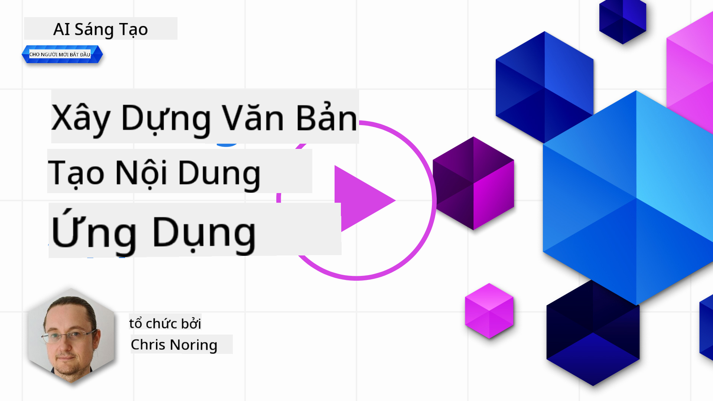

<!--
CO_OP_TRANSLATOR_METADATA:
{
  "original_hash": "ce8224073b86b728ed52b19bed7932fd",
  "translation_date": "2025-07-09T12:03:12+00:00",
  "source_file": "06-text-generation-apps/README.md",
  "language_code": "vi"
}
-->
# Xây dựng Ứng dụng Tạo Văn bản

[](https://aka.ms/gen-ai-lesson6-gh?WT.mc_id=academic-105485-koreyst)

> _(Nhấn vào hình trên để xem video bài học này)_

Bạn đã thấy trong chương trình học này có những khái niệm cốt lõi như prompt và thậm chí một lĩnh vực riêng gọi là "prompt engineering". Nhiều công cụ bạn có thể tương tác như ChatGPT, Office 365, Microsoft Power Platform và nhiều hơn nữa, đều hỗ trợ bạn sử dụng prompt để hoàn thành một việc gì đó.

Để bạn có thể thêm trải nghiệm như vậy vào một ứng dụng, bạn cần hiểu các khái niệm như prompt, completion và chọn một thư viện để làm việc. Đó chính là những gì bạn sẽ học trong chương này.

## Giới thiệu

Trong chương này, bạn sẽ:

- Tìm hiểu về thư viện openai và các khái niệm cốt lõi của nó.
- Xây dựng một ứng dụng tạo văn bản sử dụng openai.
- Hiểu cách sử dụng các khái niệm như prompt, temperature và tokens để xây dựng ứng dụng tạo văn bản.

## Mục tiêu học tập

Kết thúc bài học này, bạn sẽ có thể:

- Giải thích ứng dụng tạo văn bản là gì.
- Xây dựng ứng dụng tạo văn bản sử dụng openai.
- Cấu hình ứng dụng để sử dụng nhiều hoặc ít tokens hơn và thay đổi temperature để có kết quả đa dạng.

## Ứng dụng tạo văn bản là gì?

Thông thường khi bạn xây dựng một ứng dụng, nó sẽ có một giao diện nào đó như sau:

- Dựa trên lệnh. Ứng dụng console là những ứng dụng điển hình, nơi bạn nhập lệnh và nó thực hiện một tác vụ. Ví dụ, `git` là một ứng dụng dựa trên lệnh.
- Giao diện người dùng (UI). Một số ứng dụng có giao diện đồ họa (GUI) nơi bạn nhấn nút, nhập văn bản, chọn tùy chọn và nhiều hơn nữa.

### Ứng dụng console và UI có giới hạn

So sánh với ứng dụng dựa trên lệnh, nơi bạn nhập một lệnh:

- **Có giới hạn**. Bạn không thể nhập bất kỳ lệnh nào, chỉ những lệnh mà ứng dụng hỗ trợ.
- **Ngôn ngữ cụ thể**. Một số ứng dụng hỗ trợ nhiều ngôn ngữ, nhưng mặc định ứng dụng được xây dựng cho một ngôn ngữ cụ thể, dù bạn có thể thêm hỗ trợ ngôn ngữ khác.

### Lợi ích của ứng dụng tạo văn bản

Vậy ứng dụng tạo văn bản khác biệt như thế nào?

Trong ứng dụng tạo văn bản, bạn có nhiều sự linh hoạt hơn, không bị giới hạn bởi một tập lệnh hay một ngôn ngữ đầu vào cụ thể. Thay vào đó, bạn có thể sử dụng ngôn ngữ tự nhiên để tương tác với ứng dụng. Một lợi ích khác là bạn đang tương tác với một nguồn dữ liệu đã được huấn luyện trên một kho tàng thông tin rộng lớn, trong khi ứng dụng truyền thống có thể bị giới hạn bởi dữ liệu trong cơ sở dữ liệu.

### Tôi có thể xây dựng gì với ứng dụng tạo văn bản?

Có rất nhiều thứ bạn có thể xây dựng. Ví dụ:

- **Chatbot**. Một chatbot trả lời các câu hỏi về các chủ đề như công ty bạn và sản phẩm của nó có thể là một lựa chọn phù hợp.
- **Trợ lý**. Các mô hình ngôn ngữ lớn (LLM) rất giỏi trong việc tóm tắt văn bản, lấy thông tin từ văn bản, tạo ra các văn bản như sơ yếu lý lịch và nhiều hơn nữa.
- **Trợ lý lập trình**. Tùy thuộc vào mô hình ngôn ngữ bạn sử dụng, bạn có thể xây dựng trợ lý lập trình giúp bạn viết code. Ví dụ, bạn có thể dùng sản phẩm như GitHub Copilot cũng như ChatGPT để hỗ trợ viết code.

## Làm thế nào để bắt đầu?

Bạn cần tìm cách tích hợp với một LLM, thường có hai cách tiếp cận sau:

- Sử dụng API. Ở đây bạn xây dựng các yêu cầu web với prompt và nhận lại văn bản được tạo.
- Sử dụng thư viện. Thư viện giúp đóng gói các cuộc gọi API và làm cho việc sử dụng dễ dàng hơn.

## Thư viện/SDK

Có một vài thư viện nổi tiếng để làm việc với LLM như:

- **openai**, thư viện này giúp bạn dễ dàng kết nối với mô hình và gửi prompt.

Ngoài ra còn có các thư viện hoạt động ở cấp cao hơn như:

- **Langchain**. Langchain rất nổi tiếng và hỗ trợ Python.
- **Semantic Kernel**. Semantic Kernel là thư viện của Microsoft hỗ trợ các ngôn ngữ C#, Python và Java.

## Ứng dụng đầu tiên sử dụng openai

Hãy xem cách chúng ta có thể xây dựng ứng dụng đầu tiên, cần những thư viện gì, yêu cầu ra sao, v.v.

### Cài đặt openai

Có nhiều thư viện để tương tác với OpenAI hoặc Azure OpenAI. Bạn có thể dùng nhiều ngôn ngữ lập trình như C#, Python, JavaScript, Java và nhiều hơn nữa. Ở đây chúng ta chọn dùng thư viện `openai` cho Python, nên sẽ dùng `pip` để cài đặt.

```bash
pip install openai
```

### Tạo tài nguyên

Bạn cần thực hiện các bước sau:

- Tạo tài khoản trên Azure [https://azure.microsoft.com/free/](https://azure.microsoft.com/free/?WT.mc_id=academic-105485-koreyst).
- Đăng ký truy cập Azure OpenAI. Truy cập [https://learn.microsoft.com/azure/ai-services/openai/overview#how-do-i-get-access-to-azure-openai](https://learn.microsoft.com/azure/ai-services/openai/overview#how-do-i-get-access-to-azure-openai?WT.mc_id=academic-105485-koreyst) và yêu cầu truy cập.

  > [!NOTE]
  > Tại thời điểm viết bài, bạn cần đăng ký để được truy cập Azure OpenAI.

- Cài đặt Python <https://www.python.org/>
- Tạo một tài nguyên Azure OpenAI Service. Xem hướng dẫn cách [tạo tài nguyên](https://learn.microsoft.com/azure/ai-services/openai/how-to/create-resource?pivots=web-portal?WT.mc_id=academic-105485-koreyst).

### Tìm khóa API và endpoint

Lúc này, bạn cần cho thư viện `openai` biết khóa API nào sẽ dùng. Để tìm khóa API, vào phần "Keys and Endpoint" trong tài nguyên Azure OpenAI của bạn và sao chép giá trị "Key 1".


Khi đã sao chép thông tin này, hãy hướng dẫn thư viện sử dụng nó.

> [!NOTE]
> Nên tách khóa API ra khỏi mã nguồn. Bạn có thể làm điều này bằng cách dùng biến môi trường.
>
> - Đặt biến môi trường `OPENAI_API_KEY` thành khóa API của bạn.
>   `export OPENAI_API_KEY='sk-...'`

### Cấu hình Azure

Nếu bạn dùng Azure OpenAI, đây là cách cấu hình:

```python
openai.api_type = 'azure'
openai.api_key = os.environ["OPENAI_API_KEY"]
openai.api_version = '2023-05-15'
openai.api_base = os.getenv("API_BASE")
```

Ở trên, chúng ta thiết lập:

- `api_type` thành `azure`. Điều này báo cho thư viện biết dùng Azure OpenAI chứ không phải OpenAI.
- `api_key`, đây là khóa API bạn lấy từ Azure Portal.
- `api_version`, phiên bản API bạn muốn dùng. Tại thời điểm viết, phiên bản mới nhất là `2023-05-15`.
- `api_base`, đây là endpoint của API. Bạn có thể tìm thấy nó trong Azure Portal bên cạnh khóa API.

> [!NOTE] > `os.getenv` là hàm đọc biến môi trường. Bạn có thể dùng nó để đọc các biến như `OPENAI_API_KEY` và `API_BASE`. Đặt các biến môi trường này trong terminal hoặc dùng thư viện như `dotenv`.

## Tạo văn bản

Cách tạo văn bản là sử dụng lớp `Completion`. Ví dụ:

```python
prompt = "Complete the following: Once upon a time there was a"

completion = openai.Completion.create(model="davinci-002", prompt=prompt)
print(completion.choices[0].text)
```

Trong đoạn mã trên, chúng ta tạo một đối tượng completion và truyền vào mô hình muốn dùng cùng prompt. Sau đó in ra văn bản được tạo.

### Chat completions

Cho đến nay, bạn đã thấy cách dùng `Completion` để tạo văn bản. Nhưng còn có một lớp khác gọi là `ChatCompletion` phù hợp hơn cho chatbot. Ví dụ sử dụng:

```python
import openai

openai.api_key = "sk-..."

completion = openai.ChatCompletion.create(model="gpt-3.5-turbo", messages=[{"role": "user", "content": "Hello world"}])
print(completion.choices[0].message.content)
```

Sẽ có thêm thông tin về chức năng này trong chương tới.

## Bài tập - ứng dụng tạo văn bản đầu tiên của bạn

Bây giờ bạn đã biết cách thiết lập và cấu hình openai, đã đến lúc xây dựng ứng dụng tạo văn bản đầu tiên. Để xây dựng ứng dụng, làm theo các bước sau:

1. Tạo môi trường ảo và cài đặt openai:

   ```bash
   python -m venv venv
   source venv/bin/activate
   pip install openai
   ```

   > [!NOTE]
   > Nếu bạn dùng Windows, gõ `venv\Scripts\activate` thay vì `source venv/bin/activate`.

   > [!NOTE]
   > Tìm khóa Azure OpenAI bằng cách vào [https://portal.azure.com/](https://portal.azure.com/?WT.mc_id=academic-105485-koreyst), tìm `Open AI`, chọn `Open AI resource`, rồi vào `Keys and Endpoint` và sao chép giá trị `Key 1`.

1. Tạo file _app.py_ và thêm đoạn mã sau:

   ```python
   import openai

   openai.api_key = "<replace this value with your open ai key or Azure OpenAI key>"

   openai.api_type = 'azure'
   openai.api_version = '2023-05-15'
   openai.api_base = "<endpoint found in Azure Portal where your API key is>"
   deployment_name = "<deployment name>"

   # add your completion code
   prompt = "Complete the following: Once upon a time there was a"
   messages = [{"role": "user", "content": prompt}]

   # make completion
   completion = openai.chat.completions.create(model=deployment_name, messages=messages)

   # print response
   print(completion.choices[0].message.content)
   ```

   > [!NOTE]
   > Nếu bạn dùng Azure OpenAI, cần đặt `api_type` thành `azure` và `api_key` thành khóa Azure OpenAI của bạn.

   Bạn sẽ thấy kết quả như sau:

   ```output
    very unhappy _____.

   Once upon a time there was a very unhappy mermaid.
   ```

## Các loại prompt khác nhau, cho các mục đích khác nhau

Bây giờ bạn đã biết cách tạo văn bản bằng prompt. Bạn thậm chí đã có chương trình chạy được và có thể chỉnh sửa để tạo ra các loại văn bản khác nhau.

Prompt có thể dùng cho nhiều loại tác vụ. Ví dụ:

- **Tạo một loại văn bản**. Ví dụ, bạn có thể tạo thơ, câu hỏi cho một bài kiểm tra, v.v.
- **Tìm kiếm thông tin**. Bạn có thể dùng prompt để tìm thông tin như ví dụ sau: 'CORS có nghĩa là gì trong phát triển web?'.
- **Tạo code**. Bạn có thể dùng prompt để tạo code, ví dụ phát triển biểu thức chính quy để kiểm tra email hoặc thậm chí tạo một chương trình hoàn chỉnh, như một ứng dụng web.

## Trường hợp sử dụng thực tế hơn: trình tạo công thức nấu ăn

Hãy tưởng tượng bạn có nguyên liệu ở nhà và muốn nấu món gì đó. Để làm điều đó, bạn cần một công thức. Một cách để tìm công thức là dùng công cụ tìm kiếm hoặc bạn có thể dùng LLM.

Bạn có thể viết prompt như sau:

> "Cho tôi 5 công thức món ăn với các nguyên liệu sau: gà, khoai tây và cà rốt. Với mỗi công thức, liệt kê tất cả nguyên liệu sử dụng"

Với prompt trên, bạn có thể nhận được phản hồi tương tự:

```output
1. Roasted Chicken and Vegetables:
Ingredients:
- 4 chicken thighs
- 2 potatoes, cut into cubes
- 2 carrots, cut into cubes
- 2 tablespoons olive oil
- 2 cloves garlic, minced
- 1 teaspoon dried thyme
- 1 teaspoon dried oregano
- Salt and pepper, to taste

2. Chicken and Potato Stew:
Ingredients:
- 2 tablespoons olive oil
- 1 onion, diced
- 2 cloves garlic, minced
- 2 chicken breasts, cut into cubes
- 2 potatoes, cut into cubes
- 2 carrots, cut into cubes
- 1 teaspoon dried oregano
- 1 teaspoon dried thyme
- 1 cup chicken broth
- Salt and pepper, to taste

3. Chicken and Potato Bake:
Ingredients:
- 2 tablespoons olive oil
- 2 chicken breasts, cut into cubes
- 2 potatoes, cut into cubes
- 2 carrots, cut into cubes
- 1 onion, diced
- 2 cloves garlic, minced
- 1 teaspoon dried oregano
- 1 teaspoon dried thyme
- 1 cup chicken broth
- Salt and pepper, to taste

4. Chicken and Potato Soup:
Ingredients:
- 2 tablespoons olive oil
- 1 onion, diced
- 2 cloves garlic, minced
- 2 chicken breasts, cut into cubes
- 2 potatoes, cut into cubes
- 2 carrots, cut into cubes
- 1 teaspoon dried oregano
- 1 teaspoon dried thyme
- 4 cups chicken broth
- Salt and pepper, to taste

5. Chicken and Potato Hash:
Ingredients:
- 2 tablespoons olive oil
- 2 chicken breasts, cut into cubes
- 2 potatoes, cut into cubes
- 2 carrots, cut into cubes
- 1 onion, diced
- 2 cloves garlic, minced
- 1 teaspoon dried oregano
```

Kết quả này rất tốt, tôi biết sẽ nấu gì. Lúc này, những cải tiến hữu ích có thể là:

- Lọc ra những nguyên liệu tôi không thích hoặc bị dị ứng.
- Tạo danh sách mua sắm, trong trường hợp tôi chưa có đủ nguyên liệu ở nhà.

Với các trường hợp trên, hãy thêm một prompt bổ sung:

> "Vui lòng loại bỏ các công thức có tỏi vì tôi bị dị ứng và thay thế bằng nguyên liệu khác. Ngoài ra, vui lòng tạo danh sách mua sắm cho các công thức, tính đến việc tôi đã có gà, khoai tây và cà rốt ở nhà."

Bây giờ bạn có kết quả mới, cụ thể là:

```output
1. Roasted Chicken and Vegetables:
Ingredients:
- 4 chicken thighs
- 2 potatoes, cut into cubes
- 2 carrots, cut into cubes
- 2 tablespoons olive oil
- 1 teaspoon dried thyme
- 1 teaspoon dried oregano
- Salt and pepper, to taste

2. Chicken and Potato Stew:
Ingredients:
- 2 tablespoons olive oil
- 1 onion, diced
- 2 chicken breasts, cut into cubes
- 2 potatoes, cut into cubes
- 2 carrots, cut into cubes
- 1 teaspoon dried oregano
- 1 teaspoon dried thyme
- 1 cup chicken broth
- Salt and pepper, to taste

3. Chicken and Potato Bake:
Ingredients:
- 2 tablespoons olive oil
- 2 chicken breasts, cut into cubes
- 2 potatoes, cut into cubes
- 2 carrots, cut into cubes
- 1 onion, diced
- 1 teaspoon dried oregano
- 1 teaspoon dried thyme
- 1 cup chicken broth
- Salt and pepper, to taste

4. Chicken and Potato Soup:
Ingredients:
- 2 tablespoons olive oil
- 1 onion, diced
- 2 chicken breasts, cut into cubes
- 2 potatoes, cut into cubes
- 2 carrots, cut into cubes
- 1 teaspoon dried oregano
- 1 teaspoon dried thyme
- 4 cups chicken broth
- Salt and pepper, to taste

5. Chicken and Potato Hash:
Ingredients:
- 2 tablespoons olive oil
- 2 chicken breasts, cut into cubes
- 2 potatoes, cut into cubes
- 2 carrots, cut into cubes
- 1 onion, diced
- 1 teaspoon dried oregano

Shopping List:
- Olive oil
- Onion
- Thyme
- Oregano
- Salt
- Pepper
```

Đó là 5 công thức không có tỏi và bạn cũng có danh sách mua sắm dựa trên những gì đã có ở nhà.

## Bài tập - xây dựng trình tạo công thức nấu ăn

Bây giờ chúng ta đã mô phỏng một kịch bản, hãy viết mã để phù hợp với kịch bản đó. Để làm vậy, làm theo các bước:

1. Dùng file _app.py_ hiện có làm điểm bắt đầu
1. Tìm biến `prompt` và thay đổi mã của nó thành:

   ```python
   prompt = "Show me 5 recipes for a dish with the following ingredients: chicken, potatoes, and carrots. Per recipe, list all the ingredients used"
   ```

   Nếu chạy mã bây giờ, bạn sẽ thấy kết quả tương tự:

   ```output
   -Chicken Stew with Potatoes and Carrots: 3 tablespoons oil, 1 onion, chopped, 2 cloves garlic, minced, 1 carrot, peeled and chopped, 1 potato, peeled and chopped, 1 bay leaf, 1 thyme sprig, 1/2 teaspoon salt, 1/4 teaspoon black pepper, 1 1/2 cups chicken broth, 1/2 cup dry white wine, 2 tablespoons chopped fresh parsley, 2 tablespoons unsalted butter, 1 1/2 pounds boneless, skinless chicken thighs, cut into 1-inch pieces
   -Oven-Roasted Chicken with Potatoes and Carrots: 3 tablespoons extra-virgin olive oil, 1 tablespoon Dijon mustard, 1 tablespoon chopped fresh rosemary, 1 tablespoon chopped fresh thyme, 4 cloves garlic, minced, 1 1/2 pounds small red potatoes, quartered, 1 1/2 pounds carrots, quartered lengthwise, 1/2 teaspoon salt, 1/4 teaspoon black pepper, 1 (4-pound) whole chicken
   -Chicken, Potato, and Carrot Casserole: cooking spray, 1 large onion, chopped, 2 cloves garlic, minced, 1 carrot, peeled and shredded, 1 potato, peeled and shredded, 1/2 teaspoon dried thyme leaves, 1/4 teaspoon salt, 1/4 teaspoon black pepper, 2 cups fat-free, low-sodium chicken broth, 1 cup frozen peas, 1/4 cup all-purpose flour, 1 cup 2% reduced-fat milk, 1/4 cup grated Parmesan cheese

   -One Pot Chicken and Potato Dinner: 2 tablespoons olive oil, 1 pound boneless, skinless chicken thighs, cut into 1-inch pieces, 1 large onion, chopped, 3 cloves garlic, minced, 1 carrot, peeled and chopped, 1 potato, peeled and chopped, 1 bay leaf, 1 thyme sprig, 1/2 teaspoon salt, 1/4 teaspoon black pepper, 2 cups chicken broth, 1/2 cup dry white wine

   -Chicken, Potato, and Carrot Curry: 1 tablespoon vegetable oil, 1 large onion, chopped, 2 cloves garlic, minced, 1 carrot, peeled and chopped, 1 potato, peeled and chopped, 1 teaspoon ground coriander, 1 teaspoon ground cumin, 1/2 teaspoon ground turmeric, 1/2 teaspoon ground ginger, 1/4 teaspoon cayenne pepper, 2 cups chicken broth, 1/2 cup dry white wine, 1 (15-ounce) can chickpeas, drained and rinsed, 1/2 cup raisins, 1/2 cup chopped fresh cilantro
   ```

   > LƯU Ý, LLM của bạn không phải lúc nào cũng cho kết quả giống nhau, nên bạn có thể nhận được kết quả khác nhau mỗi lần chạy.

   Tuyệt vời, giờ hãy xem cách cải thiện. Để cải thiện, chúng ta muốn mã linh hoạt hơn, để số lượng công thức và nguyên liệu có thể thay đổi.

1. Hãy thay đổi mã như sau:

   ```python
   no_recipes = input("No of recipes (for example, 5): ")

   ingredients = input("List of ingredients (for example, chicken, potatoes, and carrots): ")

   # interpolate the number of recipes into the prompt an ingredients
   prompt = f"Show me {no_recipes} recipes for a dish with the following ingredients: {ingredients}. Per recipe, list all the ingredients used"
   ```

   Ví dụ chạy thử có thể như sau:

   ```output
   No of recipes (for example, 5): 3
   List of ingredients (for example, chicken, potatoes, and carrots): milk,strawberries

   -Strawberry milk shake: milk, strawberries, sugar, vanilla extract, ice cubes
   -Strawberry shortcake: milk, flour, baking powder, sugar, salt, unsalted butter, strawberries, whipped cream
   -Strawberry milk: milk, strawberries, sugar, vanilla extract
   ```

### Cải thiện bằng cách thêm bộ lọc và danh sách mua sắm

Chúng ta đã có ứng dụng hoạt động, có thể tạo công thức và linh hoạt vì dựa trên đầu vào của người dùng, cả số lượng công thức và nguyên liệu.

Để cải thiện hơn nữa, ta muốn thêm:

- **Lọc nguyên liệu**. Muốn lọc ra nguyên liệu không thích hoặc dị ứng. Để làm điều này, ta chỉnh sửa prompt hiện tại và thêm điều kiện lọc vào cuối prompt như sau:

  ```python
  filter = input("Filter (for example, vegetarian, vegan, or gluten-free): ")

  prompt = f"Show me {no_recipes} recipes for a dish with the following ingredients: {ingredients}. Per recipe, list all the ingredients used, no {filter}"
  ```

  Ở trên, ta thêm `{filter}` vào cuối prompt và cũng lấy giá trị filter từ người dùng.

  Ví dụ đầu vào khi chạy chương trình giờ có thể như sau:

  ```output
  No of recipes (for example, 5): 3
  List of ingredients (for example, chicken, potatoes, and carrots): onion,milk
  Filter (for example, vegetarian, vegan, or gluten-free): no milk

  1. French Onion Soup

  Ingredients:

  -1 large onion, sliced
  -3 cups beef broth
  -1 cup milk
  -6 slices french bread
  -1/4 cup shredded Parmesan cheese
  -1 tablespoon butter
  -1 teaspoon dried thyme
  -1/4 teaspoon salt
  -1/4 teaspoon black pepper

  Instructions:

  1. In a large pot, sauté onions in butter until golden brown.
  2. Add beef broth, milk, thyme, salt, and pepper. Bring to a boil.
  3. Reduce heat and simmer for 10 minutes.
  4. Place french bread slices on soup bowls.
  5. Ladle soup over bread.
  6. Sprinkle with Parmesan cheese.

  2. Onion and Potato Soup

  Ingredients:

  -1 large onion, chopped
  -2 cups potatoes, diced
  -3 cups vegetable broth
  -1 cup milk
  -1/4 teaspoon black pepper

  Instructions:

  1. In a large pot, sauté onions in butter until golden brown.
  2. Add potatoes, vegetable broth, milk, and pepper. Bring to a boil.
  3. Reduce heat and simmer for 10 minutes.
  4. Serve hot.

  3. Creamy Onion Soup

  Ingredients:

  -1 large onion, chopped
  -3 cups vegetable broth
  -1 cup milk
  -1/4 teaspoon black pepper
  -1/4 cup all-purpose flour
  -1/2 cup shredded Parmesan cheese

  Instructions:

  1. In a large pot, sauté onions in butter until golden brown.
  2. Add vegetable broth, milk, and pepper. Bring to a boil.
  3. Reduce heat and simmer for 10 minutes.
  4. In a small bowl, whisk together flour and Parmesan cheese until smooth.
  5. Add to soup and simmer for an additional 5 minutes, or until soup has thickened.
  ```

  Như bạn thấy, các công thức có sữa đã bị lọc ra. Nhưng nếu bạn không dung nạp lactose, có thể muốn lọc cả công thức có phô mai, nên cần rõ ràng hơn.

- **Tạo danh sách mua sắm**. Muốn tạo danh sách mua sắm dựa trên những gì đã có ở nhà.

  Với chức năng này, ta có thể thử giải quyết trong một prompt hoặc chia thành hai prompt. Hãy thử cách thứ hai. Ở đây ta đề xuất thêm một prompt nữa, nhưng để làm được điều đó, ta cần thêm kết quả của prompt trước làm ngữ cảnh cho prompt sau.

  Tìm phần mã in kết quả của prompt đầu tiên và thêm đoạn mã sau bên dưới:

  ```python
  old_prompt_result = completion.choices[0].message.content
  prompt = "Produce a shopping list for the generated recipes and please don't include ingredients that I already have."

  new_prompt = f"{old_prompt_result} {prompt}"
  messages = [{"role": "user", "content": new_prompt}]
  completion = openai.Completion.create(engine=deployment_name, messages=messages, max_tokens=1200)

  # print response
  print("Shopping list:")
  print(completion.choices[0].message.content)
  ```

  Lưu ý:

  1. Ta tạo prompt mới bằng cách thêm kết quả từ prompt đầu tiên vào prompt mới:

     ```python
     new_prompt = f"{old_prompt_result} {prompt}"
     ```
1. Chúng ta tạo một yêu cầu mới, nhưng cũng xem xét số lượng token đã yêu cầu trong lời nhắc đầu tiên, vì vậy lần này chúng ta đặt `max_tokens` là 1200.

```python
     completion = openai.Completion.create(engine=deployment_name, prompt=new_prompt, max_tokens=1200)
     ```

Chạy đoạn mã này, ta nhận được kết quả sau:

```output
     No of recipes (for example, 5): 2
     List of ingredients (for example, chicken, potatoes, and carrots): apple,flour
     Filter (for example, vegetarian, vegan, or gluten-free): sugar


     -Apple and flour pancakes: 1 cup flour, 1/2 tsp baking powder, 1/2 tsp baking soda, 1/4 tsp salt, 1 tbsp sugar, 1 egg, 1 cup buttermilk or sour milk, 1/4 cup melted butter, 1 Granny Smith apple, peeled and grated
     -Apple fritters: 1-1/2 cups flour, 1 tsp baking powder, 1/4 tsp salt, 1/4 tsp baking soda, 1/4 tsp nutmeg, 1/4 tsp cinnamon, 1/4 tsp allspice, 1/4 cup sugar, 1/4 cup vegetable shortening, 1/4 cup milk, 1 egg, 2 cups shredded, peeled apples
     Shopping list:
     -Flour, baking powder, baking soda, salt, sugar, egg, buttermilk, butter, apple, nutmeg, cinnamon, allspice
     ```

## Cải thiện thiết lập của bạn

Những gì chúng ta có cho đến giờ là mã hoạt động, nhưng vẫn còn một số điều chỉnh nên làm để cải thiện hơn nữa. Một số việc nên làm là:

- **Tách biệt thông tin bí mật khỏi mã nguồn**, như khóa API. Thông tin bí mật không nên nằm trong mã và cần được lưu trữ ở nơi an toàn. Để tách biệt thông tin bí mật khỏi mã, chúng ta có thể dùng biến môi trường và các thư viện như `python-dotenv` để tải chúng từ file. Dưới đây là cách làm trong mã:

  1. Tạo file `.env` với nội dung sau:

     ```bash
     OPENAI_API_KEY=sk-...
     ```

     
> Lưu ý, với Azure, bạn cần thiết lập các biến môi trường sau:

     ```bash
     OPENAI_API_TYPE=azure
     OPENAI_API_VERSION=2023-05-15
     OPENAI_API_BASE=<replace>
     ```

     Trong mã, bạn sẽ tải các biến môi trường như sau:

     ```python
     from dotenv import load_dotenv

     load_dotenv()

     openai.api_key = os.environ["OPENAI_API_KEY"]
     ```

- **Một lưu ý về độ dài token**. Chúng ta nên cân nhắc số lượng token cần thiết để tạo ra văn bản mong muốn. Token tốn tiền, nên nếu có thể, hãy cố gắng tiết kiệm số token sử dụng. Ví dụ, liệu chúng ta có thể diễn đạt lời nhắc sao cho dùng ít token hơn không?

  Để thay đổi số token sử dụng, bạn có thể dùng tham số `max_tokens`. Ví dụ, nếu bạn muốn dùng 100 token, bạn sẽ làm như sau:

  ```python
  completion = client.chat.completions.create(model=deployment, messages=messages, max_tokens=100)
  ```

- **Thử nghiệm với temperature**. Temperature là một yếu tố chúng ta chưa đề cập đến nhưng rất quan trọng cho cách chương trình hoạt động. Giá trị temperature càng cao thì kết quả càng ngẫu nhiên. Ngược lại, giá trị temperature càng thấp thì kết quả càng dễ đoán. Hãy cân nhắc xem bạn có muốn kết quả đa dạng hay không.

  Để thay đổi temperature, bạn có thể dùng tham số `temperature`. Ví dụ, nếu bạn muốn dùng temperature là 0.5, bạn sẽ làm như sau:

  ```python
  completion = client.chat.completions.create(model=deployment, messages=messages, temperature=0.5)
  ```

  > Lưu ý, càng gần 1.0 thì kết quả càng đa dạng.

## Bài tập

Với bài tập này, bạn có thể tự chọn dự án để xây dựng.

Dưới đây là một số gợi ý:

- Điều chỉnh ứng dụng tạo công thức nấu ăn để cải thiện hơn nữa. Thử thay đổi giá trị temperature và lời nhắc để xem bạn có thể tạo ra gì.
- Xây dựng một "bạn học". Ứng dụng này có thể trả lời các câu hỏi về một chủ đề, ví dụ Python, bạn có thể có các lời nhắc như "Chủ đề X trong Python là gì?", hoặc lời nhắc yêu cầu hiển thị mã cho một chủ đề cụ thể.
- Bot lịch sử, làm cho lịch sử trở nên sống động, hướng dẫn bot nhập vai một nhân vật lịch sử nào đó và hỏi về cuộc đời và thời đại của nhân vật đó.

## Giải pháp

### Bạn học

Dưới đây là lời nhắc khởi đầu, xem cách bạn có thể sử dụng và điều chỉnh theo ý thích.

```text
- "You're an expert on the Python language

    Suggest a beginner lesson for Python in the following format:

    Format:
    - concepts:
    - brief explanation of the lesson:
    - exercise in code with solutions"
```

### Bot lịch sử

Dưới đây là một số lời nhắc bạn có thể sử dụng:

```text
- "You are Abe Lincoln, tell me about yourself in 3 sentences, and respond using grammar and words like Abe would have used"
- "You are Abe Lincoln, respond using grammar and words like Abe would have used:

   Tell me about your greatest accomplishments, in 300 words"
```

## Kiểm tra kiến thức

Temperature có tác dụng gì?

1. Nó điều khiển mức độ ngẫu nhiên của kết quả.
1. Nó điều khiển kích thước phản hồi.
1. Nó điều khiển số lượng token được sử dụng.

## 🚀 Thử thách

Khi làm bài tập, hãy thử thay đổi temperature, đặt lần lượt là 0, 0.5 và 1. Hãy nhớ rằng 0 là ít biến đổi nhất và 1 là nhiều biến đổi nhất. Giá trị nào phù hợp nhất với ứng dụng của bạn?

## Làm tốt lắm! Tiếp tục học hỏi

Sau khi hoàn thành bài học này, hãy xem bộ sưu tập [Generative AI Learning collection](https://aka.ms/genai-collection?WT.mc_id=academic-105485-koreyst) để tiếp tục nâng cao kiến thức về Generative AI!

Hãy đến bài học 7, nơi chúng ta sẽ tìm hiểu cách [xây dựng ứng dụng chat](../07-building-chat-applications/README.md?WT.mc_id=academic-105485-koreyst)!

**Tuyên bố từ chối trách nhiệm**:  
Tài liệu này đã được dịch bằng dịch vụ dịch thuật AI [Co-op Translator](https://github.com/Azure/co-op-translator). Mặc dù chúng tôi cố gắng đảm bảo độ chính xác, xin lưu ý rằng các bản dịch tự động có thể chứa lỗi hoặc không chính xác. Tài liệu gốc bằng ngôn ngữ gốc của nó nên được coi là nguồn chính xác và đáng tin cậy. Đối với các thông tin quan trọng, nên sử dụng dịch vụ dịch thuật chuyên nghiệp do con người thực hiện. Chúng tôi không chịu trách nhiệm về bất kỳ sự hiểu lầm hoặc giải thích sai nào phát sinh từ việc sử dụng bản dịch này.